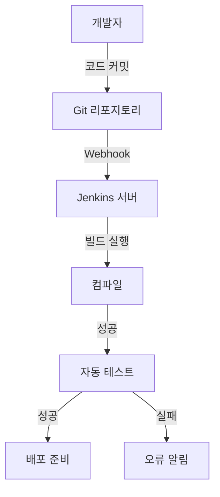
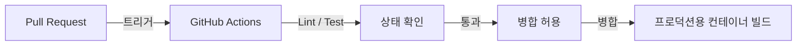
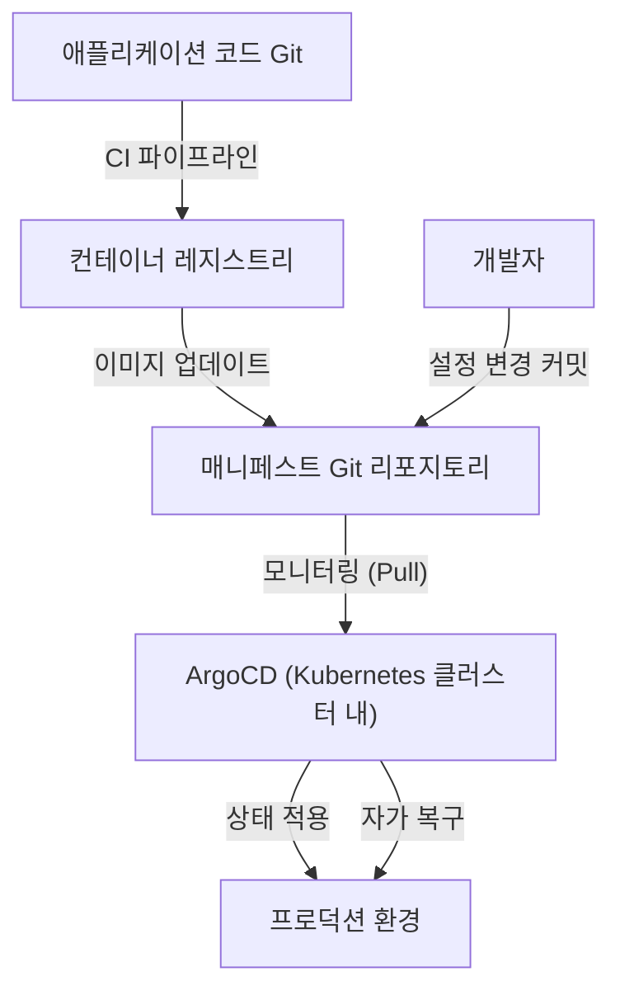

## 서장: 배포라는 이름의 '공포'와 토일(Toil)

과거에 소프트웨어 릴리스는 '공포'와 동의어였습니다. 엔지니어들은 야간이나 휴일에 모여 수동으로 FTP 클라이언트를 조작하고 서버에 파일을 업로드했습니다. '절차서'라는 이름의 거대한 Excel 파일에는 무수한 체크 항목이 나열되어 있었고, 단 하나의 실수라도 있으면 시스템은 침묵했으며 롤백을 위한 철야 작업(데스마치)이 기다리고 있었습니다.

이 수작업에 의한 배포는 이른바 '토일(Toil: 생산성 없는 반복적인 노고)'의 대표적인 예였습니다. 토일은 엔지니어의 동기를 꺾고 혁신을 위한 시간을 빼앗습니다. 본 기사에서는 이 수동 배포의 암흑시대부터 현대의 GitOps에 이르기까지, CI/CD(지속적 통합/지속적 제공)가 어떻게 진화하며 소프트웨어 개발의 세계를 근본적으로 변화시켜 왔는지 그 장대한 궤적을 깊이 파헤칩니다.

## 제1장: 익스트림 프로그래밍(XP)과 지속적 통합의 탄생

소프트웨어 공학의 역사에서 지속적 통합(Continuous Integration: CI)이라는 개념이 명확하게 정의된 것은 1990년대 후반 켄트 벡 등이 제창한 '익스트림 프로그래밍(XP)'에서였습니다.

당시 개발 현장에서는 '빅뱅 통합(Big Bang Integration)'이라 불리는 방식이 주류를 이루었습니다. 각 개발자가 몇 주에서 몇 달에 걸쳐 독립적으로 코드를 작성하고 마지막에 모든 코드를 결합(통합)하려는 것입니다. 그러나 이 순간에는 어김없이 '병합 충돌(Merge Conflict)의 폭풍'이 휘몰아쳤습니다. 누구의 변경 사항이 원인이 되어 시스템이 망가졌는지를 파악하는 데만 엄청난 시간을 낭비했던 것입니다.

XP는 이 문제를 '자주 결합하기'를 통해 해결하고자 시도했습니다. 개발자는 하루에도 몇 번씩 코드를 메인 브랜치에 병합하고 그때마다 자동 테스트를 실행합니다. '망가져 있다면 바로 알아채고 고친다'는 철학입니다. 그러나 이를 실천하기 위해서는 빌드와 테스트를 자동화하고 누구나 쉽게 실행할 수 있는 시스템이 필수적이었습니다.

## 제2장: Hudson(Jenkins)에 의한 자동화의 민주화

2000년대 중반, CI의 개념을 일부 선도적인 팀에서 전 세계의 개발 현장으로 보급시킨 주역이 등장합니다. 그것이 바로 'Hudson', 훗날의 'Jenkins'입니다.

가와구치 고스케 씨가 개발한 Hudson은 Java 기반의 오픈 소스 CI 서버로서 폭발적인 인기를 얻었습니다. Jenkins가 획기적이었던 것은 강력한 플러그인 생태계에 있었습니다. 버전 관리 시스템(Subversion이나 Git), 빌드 도구(Ant, Maven, Gradle), 테스트 프레임워크는 물론 알림 도구(이메일이나 Slack 등)까지 모든 도구를 원활하게 연동시킬 수 있었습니다.

Jenkins는 엔지니어로부터 '빌드 아저씨'라는 속인화된 역할을 빼앗아 CI/CD 프로세스를 민주화했습니다. 팀은 대시보드의 '파란 공(성공)'을 유지하기 위해 코드의 품질에 신경을 쓰게 되었고, '빨간 공(실패)'이 나타나면 즉시 수정하는 문화가 뿌리내렸습니다.

그러나 Jenkins에도 과제는 있었습니다. 서버의 운영 보수가 필요했고, 플러그인의 의존 관계가 복잡해지는 '플러그인 지옥'에 빠지기 쉬웠습니다. 또한 설정이 GUI로 이루어지는 경우가 많아 인프라를 코드로 관리(Infrastructure as Code)하는 관점에서는 미흡한 면이 있었습니다.

## 제3장: 컨테이너 기술(Docker)과의 융합

2013년 Docker가 등장하면서 소프트웨어 개발의 패러다임은 극적으로 변화합니다. "내 환경에서는 잘 작동했는데(It works on my machine)"라는 오래된 변명은 컨테이너 기술로 인해 과거의 것이 되었습니다.

CI/CD와 컨테이너 기술의 융합은 제공의 확실성을 비약적으로 높였습니다. 애플리케이션과 그 의존 관계(라이브러리, 런타임 등)를 모두 컨테이너 이미지로 패키징함으로써, 개발 환경, 테스트 환경 그리고 프로덕션 환경 간의 환경 차이를 완전히 배제한 것입니다.

이 시대부터 CI 프로세스의 최종 결과물은 '실행 가능 파일'에서 '컨테이너 이미지'로 이동했습니다. 빌드된 이미지는 컨테이너 레지스트리에 푸시되고, CD(지속적 제공) 프로세스가 이를 인계받아 각 환경에 배포합니다.

## 제4장: GitHub Actions와 서버리스 CI/CD의 대두

Jenkins가 안고 있던 인프라 관리의 과제를 해결하는 형태로 대두된 것이 클라우드 기반의 CI/CD 서비스입니다. Travis CI나 CircleCI 등이 선구자 역할을 했고, 이후 GitHub 자체가 제공하는 'GitHub Actions'가 업계의 사실상 표준(De facto standard)으로 자리 잡았습니다.

GitHub Actions의 가장 큰 장점은 코드가 호스팅되는 위치와 CI/CD 플랫폼이 완전히 통합되어 있다는 것입니다. 리포지토리 내의 `.github/workflows` 디렉터리에 YAML 파일(워크플로 정의)을 배치하는 것만으로도 모든 자동화가 실현됩니다.

서버리스이기 때문에 개발 팀은 CI 서버의 패치 적용이나 확장을 신경 쓸 필요가 없습니다. 또한 'Actions'라는 재사용 가능한 단계의 개념을 통해 오픈 소스 커뮤니티가 만든 무수한 Action을 조합하여 복잡한 파이프라인을 블록 놀이처럼 구축할 수 있게 되었습니다.

## 제5장: GitOps — Pull 방식 접근에 의한 최종 형태

CI/CD의 진화는 마침내 'GitOps'라는 강력한 패러다임에 도달했습니다. Weaveworks가 제창한 GitOps는 'Git 리포지토리를 시스템의 유일하고 신뢰할 수 있는 정보 출처(Single Source of Truth)로 삼는다'는 접근 방식입니다.

기존의 CD 도구(Jenkins 등)는 CI 파이프라인의 연장으로서 빌드가 완료된 후 외부 환경(Kubernetes 클러스터 등)에 배포 명령을 'Push'하는 방식을 취했습니다. 그러나 이 'Push 방식'에서는 CI 도구가 프로덕션 환경의 강력한 권한을 가질 필요가 있어 보안 위험이 존재했습니다. 또한 수동으로 프로덕션 환경의 설정을 변경한 경우 Git 상의 설정과 실제 상태 간에 괴리(드리프트)가 발생하는 문제가 있었습니다.

이에 반해 ArgoCD나 Flux와 같은 GitOps 도구는 'Pull 방식'의 접근을 채택합니다.

1. **선언적 정의**: 인프라나 애플리케이션의 바람직한 상태(Desired State)를 모두 Kubernetes의 매니페스트나 Helm 차트로서 Git에 저장합니다.
2. **자동 동기화**: 클러스터 내부에서 동작하는 GitOps 에이전트(ArgoCD 등)가 Git 리포지토리를 정기적으로 모니터링(Pull)합니다.
3. **자가 복구**: Git의 정의와 실제 클러스터 상태에 차이가 있으면 에이전트가 자동으로 이를 감지하여 Git의 정의에 맞게 클러스터 상태를 수정(동기화)합니다.

GitOps를 통해 배포는 단순한 'Git의 커밋과 병합'이 되었습니다. 장애가 발생한 경우에도 Git 상에서 이전 커밋으로 `git revert`하기만 하면 시스템은 순식간에 이전의 안전한 상태로 되돌아갑니다.

## 결론: 릴리스를 '지루하게' 만들기 위해

배포는 더 이상 공포로 가득 찬 일대 사건이 아닙니다. 현대의 뛰어난 CI/CD와 GitOps의 실천에서 릴리스란 '물이 흐르듯 자연스럽고 지극히 지루한 일상 업무'여야 합니다.

수동 FTP 업로드에서 시작하여 XP의 철학, Jenkins의 플러그인 생태계, Docker의 이식성, GitHub Actions의 서버리스화 그리고 ArgoCD가 가져온 GitOps의 자율 제어. 이 기나긴 진화의 궤적은 모두 '인간이 진정으로 창조적인 일에 집중하기 위한' 역사였습니다.

앞으로도 기술은 계속 진화할 것입니다. 그러나 '자동화를 통해 토일을 배제하고 가치 제공의 주기를 가속화한다'는 CI/CD의 근본적인 사상은 영원히 변하지 않을 것입니다.
