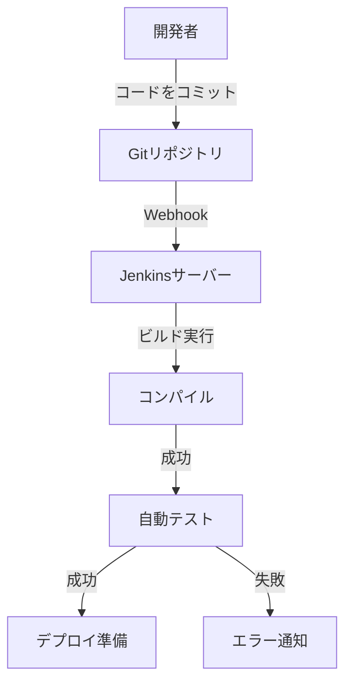
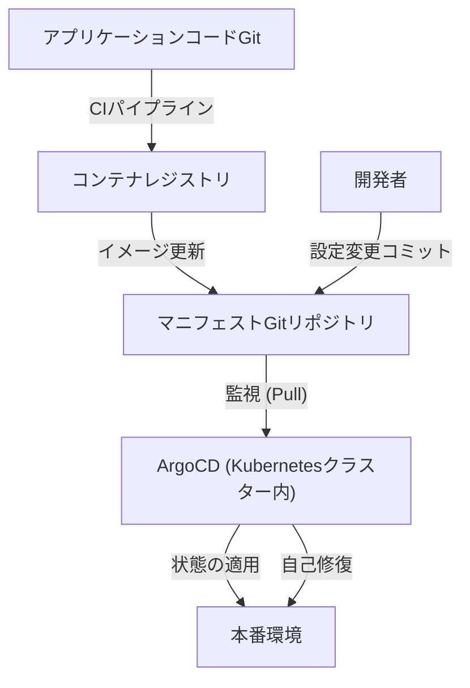

## 序章：デプロイという名の「恐怖」とトイル

かつて、ソフトウェアのリリースは「恐怖」と同義でした。エンジニアたちは夜間や休日に集まり、手動でFTPクライアントを操作し、サーバーにファイルをアップロードしていました。「手順書」という名の長大なExcelファイルには無数のチェック項目が並び、一つでもミスがあればシステムは沈黙し、ロールバックのために徹夜の作業（デスマーチ）が待ち受けていました。

この手作業によるデプロイは、いわゆる「トイル（Toil：生産性のない繰り返しの労力）」の最たるものでした。トイルはエンジニアのモチベーションを削ぎ、イノベーションのための時間を奪います。本記事では、この手動デプロイの暗黒時代から、現代のGitOpsに至るまで、CI/CD（継続的インテグレーション／継続的デリバリー）がいかに進化し、ソフトウェア開発の世界を根本から変革してきたのか、その壮大な軌跡を深掘りします。

## 第1章：エクストリームプログラミング（XP）と継続的インテグレーションの誕生

ソフトウェア工学の歴史において、継続的インテグレーション（Continuous Integration: CI）という概念が明確に定義されたのは、1990年代後半にケント・ベックらが提唱した「エクストリームプログラミング（XP）」においてでした。

当時の開発現場では、「ビッグバン・インテグレーション」と呼ばれる手法が主流でした。各開発者が数週間から数ヶ月かけて独立してコードを書き、最後にすべてのコードを結合（インテグレーション）しようとするものです。しかし、この瞬間には必ずと言っていいほど「マージコンフリクトの嵐」が吹き荒れました。誰の変更が原因でシステムが壊れたのかを特定するだけで、膨大な時間を浪費していたのです。

XPは、この問題を「こまめに結合する」ことで解決しようと試みました。開発者は1日に何度もコードをメインブランチにマージし、その度に自動テストを走らせます。「壊れているなら、すぐに気づいて直す」という哲学です。しかし、これを実践するためには、ビルドとテストを自動化し、誰でも簡単に実行できる仕組みが必要不可欠でした。

## 第2章：Hudson（Jenkins）による自動化の民主化

2000年代半ば、CIの概念を一部の先進的なチームから世界中の開発現場へと普及させた立役者が登場します。それが「Hudson」、後の「Jenkins」です。

川口耕介氏によって開発されたHudsonは、JavaベースのオープンソースCIサーバーとして爆発的な人気を博しました。Jenkinsが画期的だったのは、その強力なプラグインエコシステムです。バージョン管理システム（SubversionやGit）、ビルドツール（Ant、Maven、Gradle）、テストフレームワーク、さらには通知ツール（メールやSlackなど）と、あらゆるツールをシームレスに連携させることができました。

Jenkinsは、エンジニアから「ビルドおじさん」という属人化した役割を奪い、CI/CDプロセスを民主化しました。チームはダッシュボードの「青いボール（成功）」を維持するためにコードの品質に気を配るようになり、「赤いボール（失敗）」が出れば即座に修正する文化が根付きました。

しかし、Jenkinsにも課題がありました。サーバーの運用保守が必要であり、プラグインの依存関係が複雑化する「プラグイン地獄」に陥りやすかったのです。また、設定がGUIで行われることが多く、インフラとしてのコード化（Infrastructure as Code）の観点からは不十分な面がありました。

## 第3章：コンテナ技術（Docker）との融合

2013年、Dockerが登場すると、ソフトウェア開発のパラダイムは劇的に変化します。「私の環境では動いた（It works on my machine）」という古くからの言い訳は、コンテナ技術によって過去のものとなりました。

CI/CDとコンテナ技術の融合は、デリバリーの確実性を飛躍的に高めました。アプリケーションとその依存関係（ライブラリ、ランタイムなど）をすべてコンテナイメージにパッケージングすることで、開発環境、テスト環境、そして本番環境の間での環境差異を完全に排除したのです。

この時代から、CIプロセスの最終成果物は「実行可能ファイル」から「コンテナイメージ」へと移行しました。ビルドされたイメージはコンテナレジストリにプッシュされ、CD（継続的デリバリー）プロセスがそれを引き継いで各環境にデプロイします。

## 第4章：GitHub ActionsとサーバーレスCI/CDの台頭

Jenkinsが抱えていたインフラ管理の課題を解決する形で台頭したのが、クラウドベースのCI/CDサービスです。Travis CIやCircleCIなどが先鞭をつけ、その後、GitHub自身が提供する「GitHub Actions」が業界のデファクトスタンダードとして定着しました。

GitHub Actionsの最大の利点は、コードがホストされている場所とCI/CDプラットフォームが完全に統合されていることです。リポジトリ内の `.github/workflows` ディレクトリにYAMLファイル（ワークフロー定義）を配置するだけで、あらゆる自動化が実現します。

サーバーレスであるため、開発チームはCIサーバーのパッチ当てやスケーリングを気にする必要がありません。また、「Actions」という再利用可能なステップの概念により、オープンソースコミュニティが作成した無数のActionを組み合わせて、複雑なパイプラインをブロック遊びのように構築できるようになりました。

## 第5章：GitOps — Pull型アプローチによる最終形態

CI/CDの進化は、ついに「GitOps」という強力なパラダイムに到達しました。Weaveworksによって提唱されたGitOpsは、「Gitリポジトリをシステムの唯一の信頼できる情報源（Single Source of Truth）とする」というアプローチです。

従来のCDツール（Jenkinsなど）は、CIパイプラインの延長として、ビルドが完了した後に外部の環境（Kubernetesクラスターなど）にデプロイコマンドを「Push」するアプローチをとっていました。しかし、この「Push型」では、CIツールが本番環境の強力な権限を持つ必要があり、セキュリティリスクが存在しました。また、手動で本番環境の設定を変更された場合、Git上の設定と実際の状態に乖離（ドリフト）が生じる問題がありました。

これに対し、ArgoCDやFluxといったGitOpsツールは「Pull型」のアプローチを採用します。

1. **宣言的定義**: インフラやアプリケーションの望ましい状態（Desired State）をすべてKubernetesのマニフェストやHelmチャートとしてGitに保存します。
2. **自動同期**: クラスター内部で動作するGitOpsエージェント（ArgoCDなど）が、Gitリポジトリを定期的に監視（Pull）します。
3. **自己修復**: Gitの定義と実際のクラスターの状態に差分があれば、エージェントが自動的にそれを検知し、Gitの定義に合わせてクラスターの状態を修正（同期）します。

GitOpsにより、デプロイは単なる「Gitのコミットとマージ」になりました。障害が発生した場合も、Git上で一つ前のコミットに`git revert`するだけで、システムは瞬時に以前の安全な状態に巻き戻ります。

## 結論：リリースを「退屈」にするために

デプロイは、もはや恐怖に満ちた一大イベントではありません。現代の優れたCI/CDとGitOpsの実践において、リリースとは「水が流れるように自然で、極めて退屈な日常業務」であるべきです。

手動のFTPアップロードから始まり、XPの哲学、Jenkinsのプラグインエコシステム、Dockerのポータビリティ、GitHub Actionsのサーバーレス化、そしてArgoCDがもたらしたGitOpsの自律制御。この長い進化の軌跡は、すべて「人間が真にクリエイティブな仕事に集中するため」の歴史でした。

これからも技術は進化し続けるでしょう。しかし、「自動化を通じてトイルを排除し、価値提供のサイクルを高速化する」というCI/CDの根本的な思想は、未来永劫変わることはありません。
