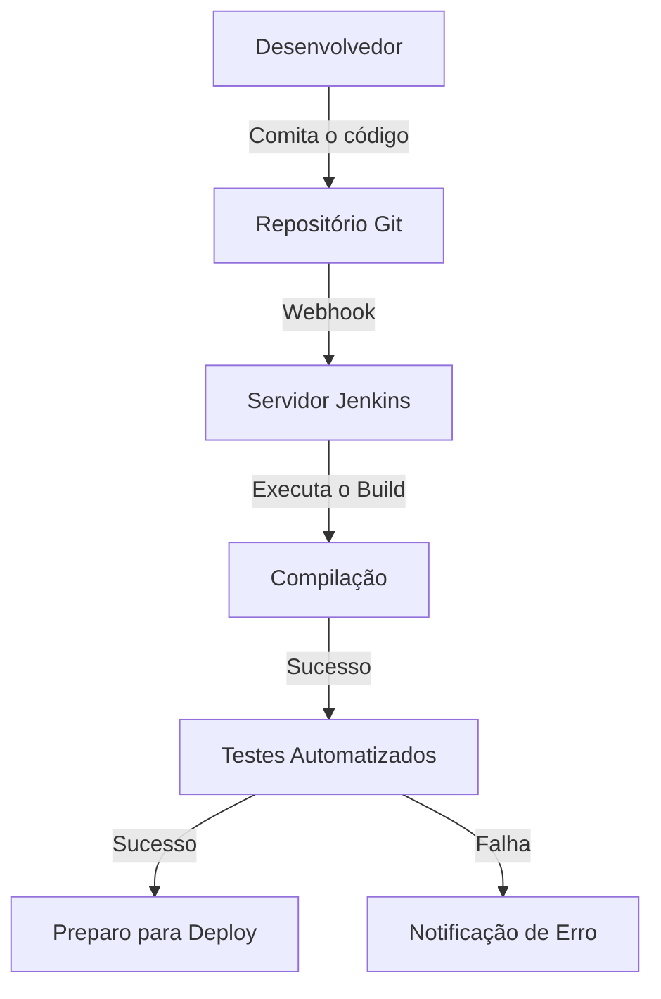
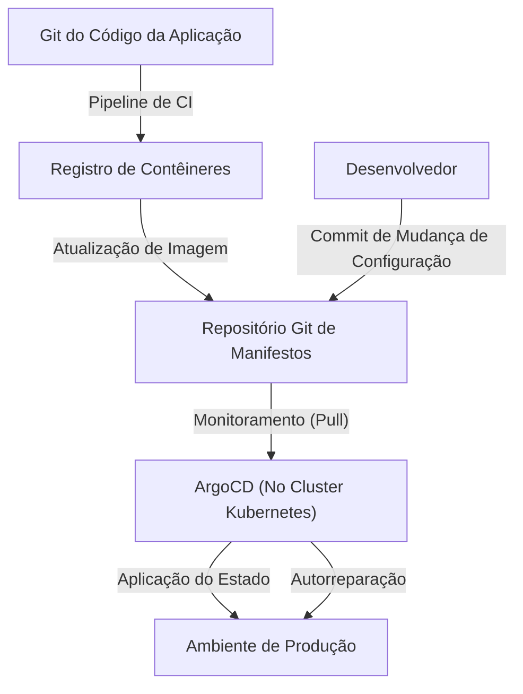

## Introdução: O "Terror" e o Esforço (Toil) em Nome do Deploy

No passado, o lançamento de software era sinônimo de "terror". Os engenheiros se reuniam à noite e nos fins de semana, operavam clientes FTP manualmente e faziam upload de arquivos para os servidores. Extensos arquivos do Excel, chamados de "manuais de procedimento", continham inúmeros itens de verificação. Um único erro silenciaria o sistema, resultando em trabalho de madrugada (marcha da morte) para reverter (rollback).

Essa implantação (deploy) manual era o exemplo definitivo de "toil" (esforço repetitivo e improdutivo). O toil diminui a motivação dos engenheiros e rouba o tempo para a inovação. Neste artigo, exploraremos a grande trajetória de como a Integração Contínua/Entrega Contínua (CI/CD) evoluiu profundamente desde os tempos sombrios do deploy manual até o moderno GitOps, e como isso transformou fundamentalmente o mundo do desenvolvimento de software.

## Capítulo 1: Extreme Programming (XP) e o Nascimento da Integração Contínua

Na história da engenharia de software, o conceito de Integração Contínua (CI) foi claramente definido no final dos anos 1990 com o "Extreme Programming (XP)", proposto por Kent Beck e outros.

Na época, o método dominante no desenvolvimento era a "Integração Big Bang". Cada desenvolvedor escrevia código independentemente durante semanas ou meses e, finalmente, tentava mesclar (integrar) todo o código. Mas, sem falhar, uma "tempestade de conflitos de merge" ocorreria nesse momento. Incontáveis horas foram desperdiçadas apenas para identificar qual alteração de quem quebrou o sistema.

O XP tentou resolver esse problema integrando "frequentemente". Os desenvolvedores mesclavam código na branch principal várias vezes ao dia e testes automatizados eram executados a cada vez. A filosofia era: "Se estiver quebrado, perceba imediatamente e conserte". Para que isso funcionasse na prática, no entanto, ferramentas que pudessem automatizar a construção (build) e testes eram essenciais, algo que qualquer um pudesse executar com facilidade.

## Capítulo 2: A Democratização da Automação com Hudson (Jenkins)

Em meados dos anos 2000, apareceu um ator que popularizou o conceito de CI, das equipes avançadas para os locais de desenvolvimento em todo o mundo. Esse foi "Hudson", que mais tarde se tornou "Jenkins".

Desenvolvido por Kohsuke Kawaguchi, o Hudson, um servidor CI de código aberto baseado em Java, ganhou popularidade explosiva. O que tornou o Jenkins revolucionário foi seu poderoso ecossistema de plug-ins. Ele permitiu a integração perfeita com todas as ferramentas: sistemas de controle de versão (Subversion, Git), ferramentas de construção (Ant, Maven, Gradle), estruturas de teste e até ferramentas de notificação (e-mail, Slack, etc.).

Jenkins democratizou o processo de CI/CD ao retirar a função baseada na pessoa do "cara do build" dos engenheiros. As equipes começaram a se importar com a qualidade do código para manter a "bolinha azul (sucesso)" no painel, estabelecendo a cultura de correção instantânea se aparecesse uma "bolinha vermelha (falha)".

Entretanto, Jenkins também tinha seus desafios. Havia a necessidade de operação e manutenção de servidores, e era fácil cair no "inferno dos plugins", onde as dependências dos plugins ficavam complicadas. Além disso, as configurações eram frequentemente feitas via GUI, o que era insuficiente do ponto de vista de Infraestrutura como Código (Infrastructure as Code).

## Capítulo 3: A Fusão com a Tecnologia de Contêineres (Docker)

Em 2013, o advento do Docker mudou drasticamente o paradigma do desenvolvimento de software. A antiga desculpa "Funciona na minha máquina" (It works on my machine) tornou-se coisa do passado graças à tecnologia de contêiner.

A fusão de CI/CD e tecnologia de contêineres aumentou drasticamente a confiabilidade da entrega. Ao empacotar a aplicação e todas as suas dependências (bibliotecas, tempos de execução, etc.) em uma imagem de contêiner, todas as diferenças ambientais entre ambientes de desenvolvimento, testes e produção foram completamente eliminadas.

A partir desta época, o artefato final do processo de CI mudou de um "arquivo executável" para uma "imagem de contêiner". A imagem gerada (build) é enviada (push) para um registro de contêineres, e o processo de CD assume a partir daí, implantando-a em cada ambiente.

## Capítulo 4: GitHub Actions e a Ascensão do CI/CD Serverless

Serviços de CI/CD baseados na nuvem surgiram para resolver os problemas de gerenciamento de infraestrutura enfrentados pelo Jenkins. Travis CI e CircleCI lideraram o caminho, e o "GitHub Actions", fornecido pelo próprio GitHub, tornou-se o padrão de fato da indústria.

A maior vantagem do GitHub Actions é a integração total de onde o código está hospedado com a plataforma de CI/CD. Basta colocar um arquivo YAML (definição de fluxo de trabalho) no diretório `.github/workflows` de um repositório e qualquer automação se torna possível.

Como é serverless, as equipes de desenvolvimento não precisam se preocupar com a aplicação de patches ou o dimensionamento de servidores de CI. Além disso, com o conceito de etapas reutilizáveis chamadas "Actions", agora é possível construir pipelines complexos combinando inúmeras Actions criadas pela comunidade de código aberto, semelhante a brincar com blocos.

## Capítulo 5: GitOps — A Forma Final através da Abordagem Baseada em Pull

A evolução de CI/CD finalmente alcançou um poderoso paradigma chamado "GitOps". Proposto pela Weaveworks, GitOps é a abordagem de "tornar o repositório Git a única fonte de verdade (Single Source of Truth) do sistema".

Ferramentas tradicionais de CD (como o Jenkins) usavam uma abordagem de "Push", onde comandos de deploy eram empurrados para ambientes externos (como clusters Kubernetes) após a conclusão do build, como uma extensão do pipeline de CI. Contudo, essa abordagem de "Push" exigia que a ferramenta de CI tivesse privilégios poderosos no ambiente de produção, apresentando riscos de segurança. Além disso, se as configurações de produção fossem alteradas manualmente, ocorria uma divergência (drift) entre as configurações do Git e o estado real.

Em contraste, as ferramentas GitOps, como ArgoCD e Flux, adotam uma abordagem baseada em "Pull":

1. **Definição Declarativa**: O estado desejado (Desired State) da infraestrutura e dos aplicativos é todo armazenado no Git como manifestos do Kubernetes ou gráficos do Helm.
2. **Sincronização Automática**: Agentes GitOps (como ArgoCD) rodando dentro do cluster monitoram (fazem Pull) regularmente o repositório Git.
3. **Autorreparação**: Se houver uma diferença entre a definição do Git e o estado real do cluster, o agente detecta isso automaticamente e corrige (sincroniza) o estado do cluster para corresponder à definição do Git.

Com o GitOps, os deploys se tornaram simplesmente "commits e merges no Git". Mesmo que ocorra uma falha, o sistema pode ser revertido instantaneamente para o estado seguro anterior fazendo apenas `git revert` para o commit anterior no Git.

## Conclusão: Tornando os Lançamentos "Chatos"

Fazer deploy não é mais um grande evento cheio de terror. Nas práticas modernas e excelentes de CI/CD e GitOps, um lançamento deve ser "uma tarefa diária extremamente chata que flui naturalmente como água".

Começando com uploads de FTP manuais, passando pela filosofia XP, ecossistema de plugins do Jenkins, portabilidade do Docker, GitHub Actions serverless e o controle autônomo GitOps trazido pelo ArgoCD. Essa longa trajetória de evolução se baseou na história de "permitir que os humanos foquem em trabalho verdadeiramente criativo".

A tecnologia, sem dúvida, continuará a evoluir. Mas a filosofia fundamental do CI/CD de "eliminar toil por meio da automação e acelerar o ciclo de entrega de valor" nunca mudará para a eternidade.
