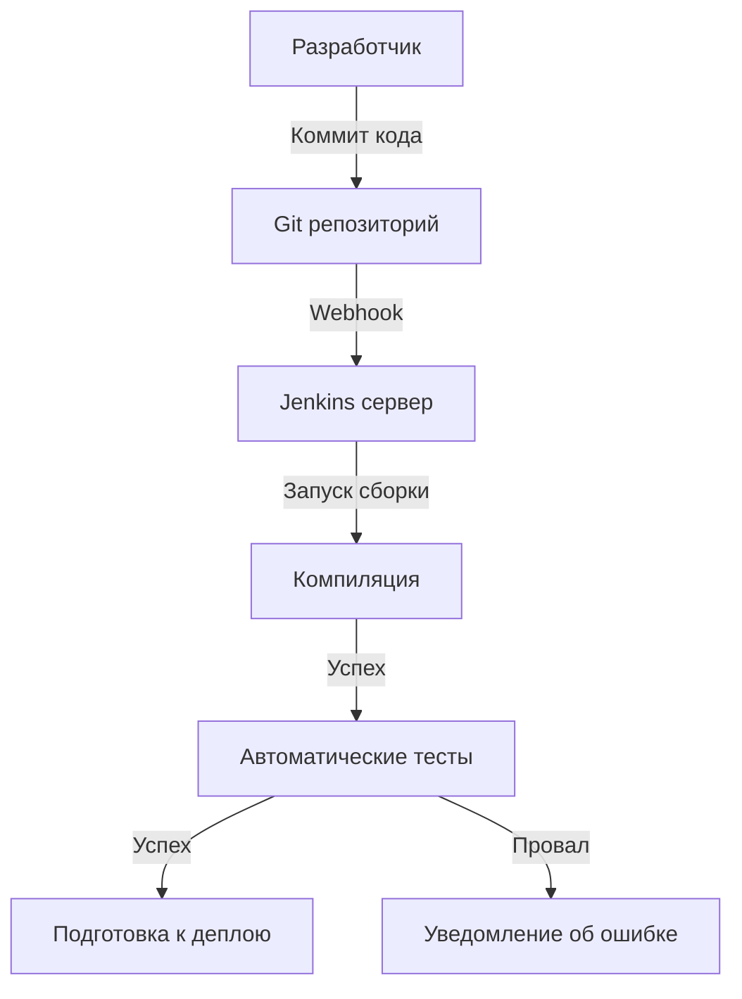
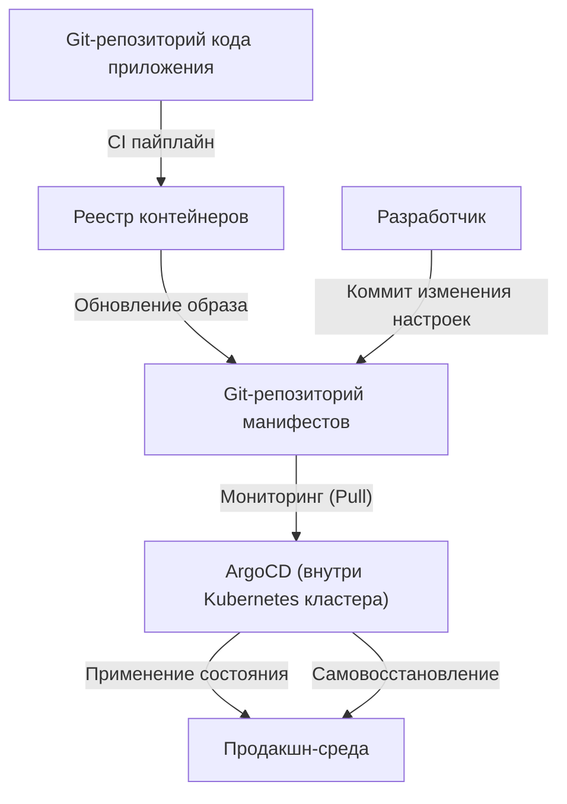

## Введение: "Ужас" под названием деплой и Toil (рутина)

Когда-то релиз программного обеспечения был синонимом "ужаса". Инженеры собирались по ночам и выходным, вручную управляли FTP-клиентами и загружали файлы на серверы. "Инструкции" в виде огромных файлов Excel содержали бесчисленные пункты для проверки, и если возникала хоть одна ошибка, система замолкала, и всех ждала бессонная ночь (марш смерти) для отката.

Этот ручной деплой был ярчайшим примером так называемого "Toil" (непродуктивного повторяющегося труда). Toil лишает инженеров мотивации и отнимает время, необходимое для инноваций. В этой статье мы подробно рассмотрим эпический путь эволюции CI/CD (непрерывной интеграции / непрерывной доставки) от темных веков ручного деплоя до современного GitOps, и то, как это в корне изменило мир разработки программного обеспечения.

## Глава 1: Экстремальное программирование (XP) и зарождение непрерывной интеграции

В истории программной инженерии концепция непрерывной интеграции (Continuous Integration: CI) была четко определена в конце 1990-х годов в рамках "Экстремального программирования (XP)", предложенного Кентом Беком и его коллегами.

В те времена в разработке доминировал метод "интеграции большого взрыва" (Big Bang Integration). Каждый разработчик писал код независимо в течение нескольких недель или месяцев, а в самом конце пытался объединить (интегрировать) весь код. Однако в этот момент почти всегда разражалась "буря конфликтов слияния". Огромное количество времени тратилось только на то, чтобы определить, чьи изменения сломали систему.

XP попыталось решить эту проблему путем "частой интеграции". Разработчики объединяют код в главную ветку несколько раз в день и каждый раз запускают автоматизированные тесты. Философия гласит: "Если что-то сломано, сразу заметь это и исправь". Однако для реализации этого был необходим механизм автоматизации сборки и тестирования, который мог бы легко запустить любой желающий.

## Глава 2: Демократизация автоматизации с помощью Hudson (Jenkins)

В середине 2000-х годов появился главный герой, который распространил концепцию CI от нескольких передовых команд до команд разработчиков по всему миру. Это был "Hudson", позже ставший "Jenkins".

Разработанный Косукэ Кавагучи, Hudson приобрел взрывную популярность как CI-сервер с открытым исходным кодом на базе Java. Прорывным в Jenkins стала его мощная экосистема плагинов. Он мог бесшовно интегрировать любые инструменты: системы контроля версий (Subversion и Git), инструменты сборки (Ant, Maven, Gradle), фреймворки тестирования и даже инструменты уведомлений (электронная почта, Slack и т.д.).

Jenkins лишил инженеров персонифицированной роли "дяденьки по сборке" и демократизировал процесс CI/CD. Команды начали следить за качеством кода, чтобы поддерживать "синий шар" (успех) на дашборде, и укоренилась культура немедленного исправления при появлении "красного шара" (провал).

Однако у Jenkins были и проблемы. Требовалось обслуживание сервера, и было легко попасть в "ад плагинов", где зависимости плагинов становились слишком сложными. Кроме того, настройки часто выполнялись через графический интерфейс, что было недостаточно с точки зрения подхода "Инфраструктура как код" (Infrastructure as Code).

## Глава 3: Слияние с контейнерными технологиями (Docker)

С появлением Docker в 2013 году парадигма разработки программного обеспечения кардинально изменилась. Старая отговорка "На моей машине это работало" (It works on my machine) ушла в прошлое благодаря контейнерным технологиям.

Слияние CI/CD и контейнерных технологий значительно повысило надежность доставки. Упаковав приложение и все его зависимости (библиотеки, среду выполнения и т.д.) в контейнерный образ, полностью устранялись различия в среде между средами разработки, тестирования и продакшена.

С этой эпохи конечный результат процесса CI сместился с "исполняемого файла" на "образ контейнера". Собранный образ отправляется в реестр контейнеров (Container Registry), а процесс CD (непрерывной доставки) берет его оттуда и развертывает в каждой среде.

## Глава 4: GitHub Actions и рост бессерверных CI/CD

В качестве решения проблемы управления инфраструктурой, с которой сталкивался Jenkins, набрали популярность облачные сервисы CI/CD. Travis CI и CircleCI проложили путь, а затем "GitHub Actions", предоставляемый самим GitHub, утвердился в качестве стандарта де-факто в отрасли.

Самое большое преимущество GitHub Actions заключается в том, что место размещения кода и платформа CI/CD полностью интегрированы. Просто разместив YAML-файлы (определения рабочих процессов) в директории `.github/workflows` репозитория, можно реализовать любую автоматизацию.

Поскольку он является бессерверным (Serverless), командам разработчиков не нужно беспокоиться об установке патчей или масштабировании CI-сервера. Кроме того, благодаря концепции переиспользуемых шагов, называемых "Actions", стало возможным строить сложные пайплайны как из кубиков, комбинируя бесчисленное количество Actions, созданных сообществом открытого исходного кода.

## Глава 5: GitOps — Финальная форма благодаря Pull-подходу

Эволюция CI/CD наконец достигла мощной парадигмы под названием "GitOps". GitOps, предложенный компанией Weaveworks, — это подход, при котором "Git-репозиторий становится единственным достоверным источником истины (Single Source of Truth) для системы".

Традиционные инструменты CD (такие как Jenkins), являясь продолжением CI-пайплайна, использовали подход "Push", отправляя команды деплоя во внешнюю среду (например, кластер Kubernetes) после завершения сборки. Однако при таком "Push-подходе" CI-инструмент должен был обладать широкими правами в продакшн-среде, что создавало риски безопасности. Кроме того, если конфигурация продакшн-среды изменялась вручную, возникало расхождение (дрифт) между конфигурацией в Git и фактическим состоянием.

В отличие от этого, инструменты GitOps, такие как ArgoCD и Flux, используют "Pull-подход".

1. **Декларативное определение**: Желаемое состояние (Desired State) инфраструктуры и приложений полностью сохраняется в Git в виде манифестов Kubernetes или Helm-чартов.
2. **Автоматическая синхронизация**: Агент GitOps (например, ArgoCD), работающий внутри кластера, регулярно проверяет (Pull) Git-репозиторий.
3. **Самовосстановление**: Если есть разница между определением в Git и фактическим состоянием кластера, агент автоматически обнаруживает это и исправляет (синхронизирует) состояние кластера в соответствии с определением в Git.

С GitOps деплой стал просто "коммитом и слиянием в Git". Даже в случае сбоя достаточно выполнить `git revert` к предыдущему коммиту в Git, и система мгновенно вернется в предыдущее безопасное состояние.

## Заключение: Как сделать релиз "скучным"

Деплой больше не является масштабным событием, полным ужаса. В современных передовых практиках CI/CD и GitOps релиз должен быть "естественной, как течение воды, и крайне скучной рутинной задачей".

Начиная с ручной загрузки по FTP, проходя через философию XP, экосистему плагинов Jenkins, портативность Docker, бессерверность GitHub Actions и автономный контроль GitOps, принесенный ArgoCD. Вся эта долгая история эволюции была направлена на то, чтобы "люди могли сосредоточиться на по-настоящему творческой работе".

Технологии будут продолжать развиваться. Однако фундаментальная идея CI/CD — "устранение Toil через автоматизацию и ускорение цикла доставки ценности" — останется неизменной навсегда.
