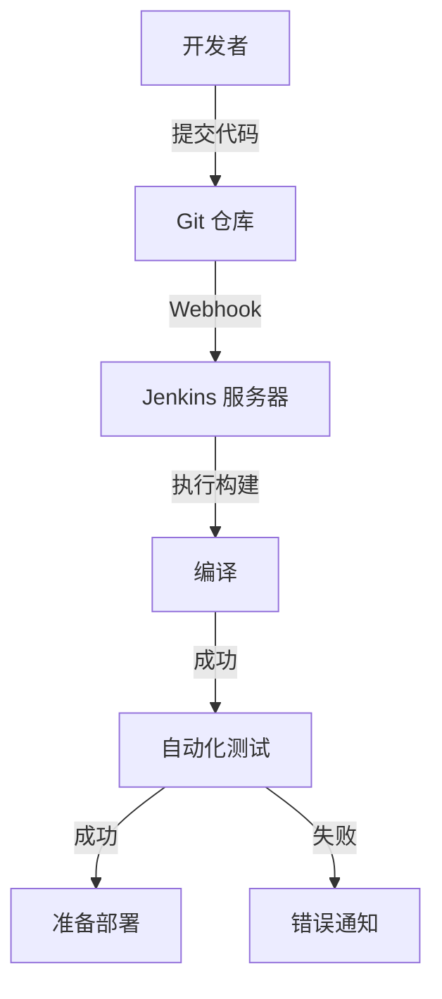
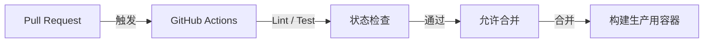
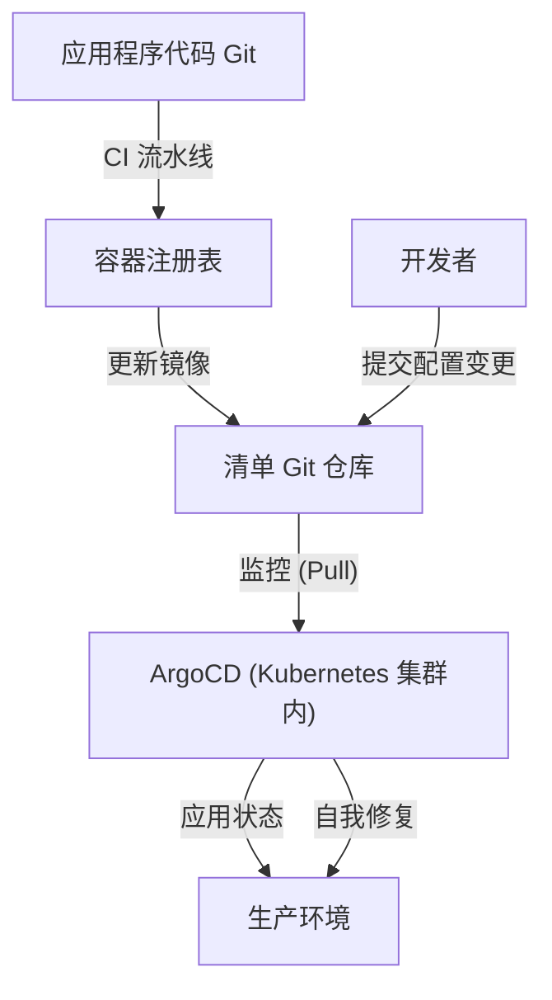

## 序章：名为“恐惧”的部署与苦工 (Toil)

过去，软件的发布与“恐惧”是同义词。工程师们在夜间或休息日聚集在一起，手动操作 FTP 客户端，将文件上传到服务器。名为“操作手册”的冗长 Excel 文件中列有无数的检查项目，只要出现一个错误，系统就会陷入沉默，随之而来的是为了回滚而熬夜工作（死亡行军）。

这种手动部署是所谓的“苦工（Toil：缺乏生产力的重复性劳动）”的典型代表。Toil 会削弱工程师的动力，并夺走用于创新的时间。在本文中，我们将深入探讨从这个手动部署的黑暗时代到现代 GitOps，CI/CD（持续集成 / 持续交付）是如何演进的，以及它如何从根本上改变了软件开发世界。

## 第1章：极限编程 (XP) 与持续集成的诞生

在软件工程的历史中，“持续集成（Continuous Integration: CI）”这一概念被明确定义，是在 20 世纪 90 年代后期由 Kent Beck 等人提倡的“极限编程 (XP)”中。

在当时的开发环境中，被称为“大爆炸集成”的方法是主流。每位开发者花费几周到几个月的时间独立编写代码，最后尝试将所有代码结合（集成）在一起。然而，在这个瞬间，几乎必然会刮起“合并冲突的风暴”。仅仅是为了找出是谁的修改导致了系统崩溃，就浪费了大量的时间。

XP 试图通过“频繁结合”来解决这个问题。开发者每天多次将代码合并到主分支，并每次运行自动化测试。其哲学是“如果坏了，就立即发现并修复”。然而，为了实践这一点，自动化构建和测试，并建立让任何人都能轻松执行的机制是必不可少的。

## 第2章：通过 Hudson (Jenkins) 实现自动化的民主化

2000 年代中期，一位将 CI 概念从部分先进团队普及到全球开发环境的关键角色登场了。那就是“Hudson”，即后来的“Jenkins”。

由川口耕介开发的 Hudson 作为一款基于 Java 的开源 CI 服务器，获得了爆炸性的人气。Jenkins 的革命性在于其强大的插件生态系统。版本控制系统（Subversion 或 Git）、构建工具（Ant、Maven、Gradle）、测试框架，甚至通知工具（邮件或 Slack 等），它可以无缝集成各种工具。

Jenkins 从工程师手中夺走了被称为“构建大叔”这种过度依赖个人的角色，实现了 CI/CD 流程的民主化。团队为了维持仪表板上的“蓝球（成功）”而开始关注代码质量，形成了只要出现“红球（失败）”就立即修复的文化。

然而，Jenkins 也存在挑战。它需要服务器的运维和管理，并且容易陷入插件依赖关系复杂化的“插件地狱”。此外，配置通常是通过 GUI 进行的，从基础设施即代码（Infrastructure as Code）的角度来看，也存在不足之处。

## 第3章：与容器技术 (Docker) 的融合

2013 年，随着 Docker 的出现，软件开发的范式发生了戏剧性的变化。“在我的环境中是能运行的 (It works on my machine)”这种古老的借口，因为容器技术而成为了过去。

CI/CD 与容器技术的融合极大地提高了交付的可靠性。通过将应用程序及其所有依赖项（库、运行时等）打包到容器镜像中，完全消除了开发环境、测试环境和生产环境之间的差异。

从这个时代起，CI 流程的最终产物从“可执行文件”转变为“容器镜像”。构建的镜像被推送到容器注册表，然后 CD（持续交付）流程接管，将其部署到各个环境。

## 第4章：GitHub Actions 与无服务器 CI/CD 的崛起

为了解决 Jenkins 所面临的基础设施管理挑战，基于云的 CI/CD 服务开始崛起。Travis CI 和 CircleCI 等开启了先河，随后 GitHub 自身提供的“GitHub Actions”确立了行业事实标准的地位。

GitHub Actions 最大的优势在于，代码托管的位置与 CI/CD 平台实现了完全集成。只需在仓库的 `.github/workflows` 目录中放置 YAML 文件（工作流定义），即可实现各种自动化。

由于它是无服务器的，开发团队不需要担心 CI 服务器的补丁应用或扩展。此外，通过“Actions”这一可重用步骤的概念，开发者可以像搭积木一样组合开源社区创建的无数 Action，构建复杂的流水线。

## 第5章：GitOps — Pull 型方法的最终形态

CI/CD 的演进终于达到了“GitOps”这一强大的范式。由 Weaveworks 提倡的 GitOps 是一种将“Git 仓库作为系统唯一真实来源 (Single Source of Truth)”的方法。

传统的 CD 工具（如 Jenkins 等）作为 CI 流水线的延伸，采用了在构建完成后将部署命令“Push (推送)”到外部环境（如 Kubernetes 集群等）的方法。然而，在这种“Push 型”下，CI 工具需要拥有生产环境的强大权限，存在安全风险。此外，如果手动更改了生产环境的配置，Git 上的配置与实际状态就会产生偏离（漂移）的问题。

相比之下，ArgoCD 和 Flux 等 GitOps 工具采用了“Pull (拉取) 型”方法。

1. **声明式定义**: 将基础设施和应用程序的所有期望状态 (Desired State) 作为 Kubernetes 清单 (Manifest) 或 Helm Chart 保存在 Git 中。
2. **自动同步**: 在集群内部运行的 GitOps 代理（如 ArgoCD 等）定期监控 (Pull) Git 仓库。
3. **自我修复**: 如果 Git 的定义与实际集群状态存在差异，代理会自动检测到它，并根据 Git 的定义修正（同步）集群的状态。

借助 GitOps，部署变成了单纯的“Git 提交和合并”。即使发生故障，只需在 Git 上执行 `git revert` 回退到上一个提交，系统就能瞬间恢复到之前的安全状态。

## 结论：为了让发布变得“无聊”

部署不再是一件充满恐惧的大事件。在现代优秀的 CI/CD 和 GitOps 实践中，发布应该是一项“像水流一样自然、极其无聊的日常工作”。

从手动 FTP 上传开始，经历了 XP 的哲学、Jenkins 的插件生态、Docker 的可移植性、GitHub Actions 的无服务器化，以及 ArgoCD 带来的 GitOps 自治控制。这段漫长的演进轨迹，全都是“为了让人类能够专注于真正具有创造性的工作”的历史。

技术仍将不断演进。然而，“通过自动化消除苦工 (Toil)，加速价值交付循环”这一 CI/CD 的根本思想，在未来也将永远不会改变。
