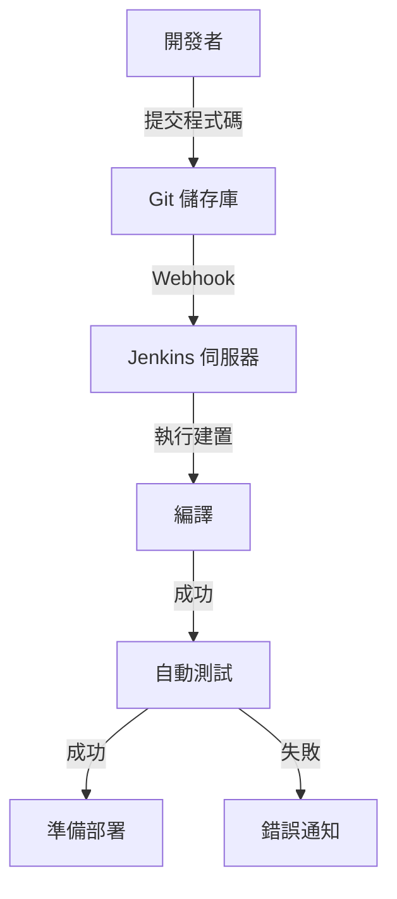
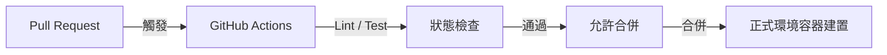
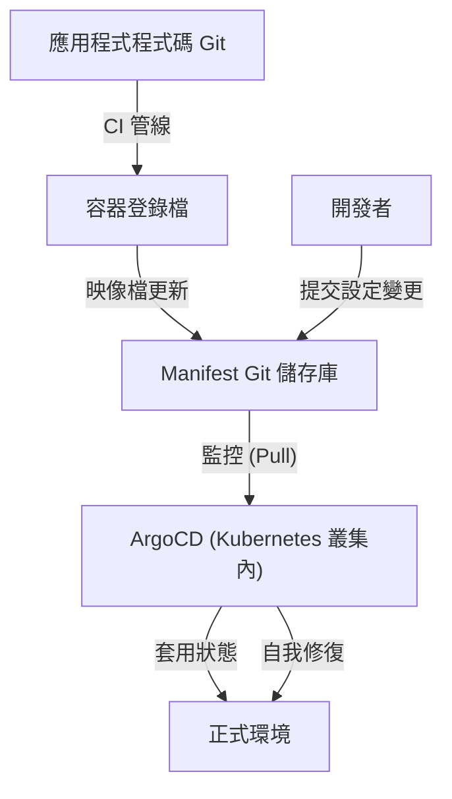

## 序章：名為「恐懼」的部署與瑣事 (Toil)

曾經，軟體發布是「恐懼」的代名詞。工程師們會在夜間或假日聚集，手動操作 FTP 客戶端，將檔案上傳到伺服器。名為「步驟書」的冗長 Excel 檔案中列滿了無數的檢查項目，只要有一個失誤，系統就會停擺，隨之而來的是為了還原 (Rollback) 而熬夜工作的「死亡行軍」(Death March)。

這種手動部署可說是「瑣事」（Toil：沒有生產力的重複性勞動）的最佳寫照。瑣事會削弱工程師的動力，並剝奪創新的時間。本文將深入探討 CI/CD（持續整合／持續交付）如何從手動部署的黑暗時代演進到現代的 GitOps，以及它如何徹底改變軟體開發世界，為這段宏大的軌跡進行深度解析。

## 第1章：極限程式設計 (XP) 與持續整合的誕生

在軟體工程的歷史中，持續整合 (Continuous Integration: CI) 這個概念的明確定義，要追溯到 1990 年代後期由 Kent Beck 等人提倡的「極限程式設計 (XP)」。

當時的開發環境主流是所謂的「大爆炸整合 (Big Bang Integration)」。每位開發者花費數週甚至數個月的時間獨立編寫程式碼，最後再試圖將所有程式碼結合（整合）在一起。然而，在這個時刻，幾乎必然會掀起「合併衝突的風暴」。光是找出是誰的變更導致系統崩潰，就浪費了大量時間。

XP 試圖透過「頻繁整合」來解決這個問題。開發者每天多次將程式碼合併到主分支，每次都運行自動化測試。這是一種「如果壞了，就立刻發現並修復」的哲學。但是，為了實踐這一點，自動化建置與測試，並建立任何人都能輕鬆執行的機制是不可或缺的。

## 第2章：Hudson (Jenkins) 帶來的自動化民主化

2000 年代中期，將 CI 概念從少數先進團隊普及到全世界開發現場的功臣登場了。那就是「Hudson」，也就是後來的「Jenkins」。

由川口耕介開發的 Hudson，作為一個基於 Java 的開源 CI 伺服器，獲得了爆炸性的受歡迎程度。Jenkins 的劃時代之處在於其強大的外掛程式生態系統。它可以無縫地將版本控制系統（如 Subversion 和 Git）、建置工具（如 Ant、Maven、Gradle）、測試框架，甚至通知工具（如電子郵件和 Slack）等各種工具連接起來。

Jenkins 從工程師手中奪走了「建置大叔」這個過於依賴個人的角色，並將 CI/CD 流程民主化。團隊開始關注程式碼品質，以維持儀表板上的「藍球（成功）」，而一旦出現「紅球（失敗）」，就立即修復的文化也隨之扎根。

然而，Jenkins 也存在一些挑戰。它需要進行伺服器的營運維護，而且很容易陷入外掛程式依賴關係複雜化的「外掛地獄」。此外，設定通常是透過 GUI 進行，從基礎設施即代碼 (Infrastructure as Code) 的角度來看，也有不盡完善之處。

## 第3章：與容器技術 (Docker) 的融合

2013 年 Docker 的出現，讓軟體開發的典範發生了戲劇性的變化。容器技術讓「在我的環境裡會動 (It works on my machine)」這句古老的藉口成為歷史。

CI/CD 與容器技術的融合，大幅提升了交付的確定性。透過將應用程式及其依賴關係（函式庫、執行環境等）全部打包到容器映像檔中，徹底消除了開發環境、測試環境和正式環境之間的差異。

從這個時代開始，CI 流程的最終產出物從「可執行檔案」轉變為「容器映像檔」。建置完成的映像檔會被推送到容器登錄檔 (Container Registry) 中，然後由 CD（持續交付）流程接手，將其部署到各個環境。

## 第4章：GitHub Actions 與無伺服器 CI/CD 的崛起

為了解決 Jenkins 所面臨的基礎設施管理問題，基於雲端的 CI/CD 服務開始崛起。Travis CI 和 CircleCI 等服務開創了先河，隨後由 GitHub 自身提供的「GitHub Actions」確立為業界的實質標準。

GitHub Actions 最大的優勢在於，程式碼代管的地方與 CI/CD 平台完全整合。只要在儲存庫的 `.github/workflows` 目錄下放置 YAML 檔案（工作流程定義），就能實現各種自動化。

由於它是無伺服器的，開發團隊不需要擔心 CI 伺服器的修補和擴展。此外，透過「Actions」這個可重複使用步驟的概念，開發者可以像玩積木一樣，組合開源社群所建立的無數 Action，來建構複雜的管線 (Pipeline)。

## 第5章：GitOps — 透過 Pull 型方法的最終型態

CI/CD 的進化終於達到了一個名為「GitOps」的強大典範。由 Weaveworks 提倡的 GitOps 是一種「將 Git 儲存庫作為系統唯一真實來源 (Single Source of Truth)」的方法。

傳統的 CD 工具（如 Jenkins）作為 CI 管線的延伸，採用在建置完成後將部署命令「推送 (Push)」到外部環境（如 Kubernetes 叢集）的方法。然而，在這種「Push 型」方法中，CI 工具需要擁有正式環境的強大權限，因此存在安全風險。此外，如果正式環境的設定被手動更改，Git 上的設定與實際狀態就會產生偏差 (Drift)。

相對地，ArgoCD 和 Flux 等 GitOps 工具則採用「Pull 型」方法。

1. **宣告式定義**: 將基礎設施和應用程式的期望狀態 (Desired State) 全部作為 Kubernetes Manifest 或 Helm Chart 儲存在 Git 中。
2. **自動同步**: 在叢集內部運行的 GitOps 代理（如 ArgoCD）會定期監控（拉取, Pull）Git 儲存庫。
3. **自我修復**: 如果 Git 的定義與實際叢集的狀態有差異，代理會自動偵測到，並根據 Git 的定義修正（同步）叢集的狀態。

透過 GitOps，部署變成了單純的「Git 提交與合併」。即使發生故障，只要在 Git 上使用 `git revert` 回退到上一個提交，系統就能瞬間恢復到以前的安全狀態。

## 結論：為了讓發布變得「無聊」

部署不再是一場充滿恐懼的重大事件。在現代優秀的 CI/CD 和 GitOps 實踐中，發布應該是「如同流水般自然、極度無聊的日常業務」。

從手動的 FTP 上傳開始，經歷了 XP 的哲學、Jenkins 的外掛生態系統、Docker 的可攜性、GitHub Actions 的無伺服器化，以及 ArgoCD 帶來的 GitOps 自治控制。這段漫長的進化軌跡，全部都是「為了讓人們能專注於真正具創造力工作」的歷史。

未來技術仍會持續進化。但是，「透過自動化消除瑣事，加快價值交付週期」這個 CI/CD 的根本思想，將會是永恆不變的。
