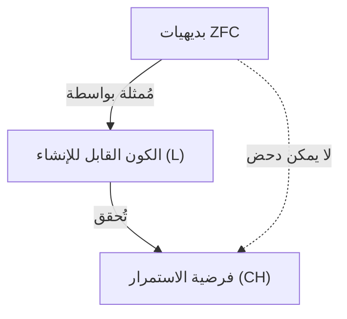
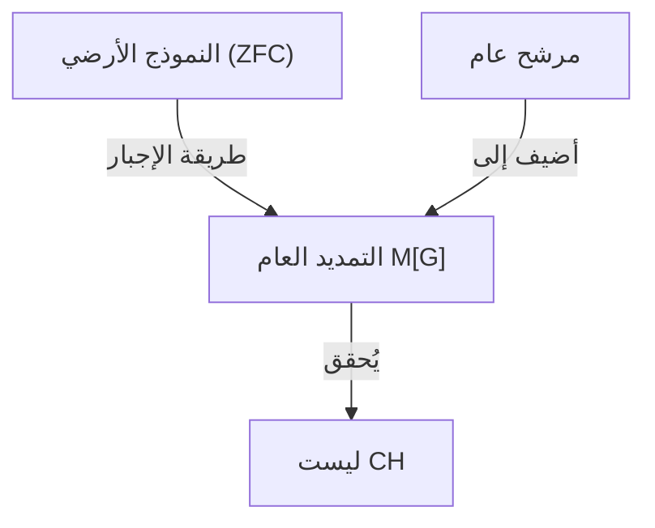

## 1. مقدمة: قياس حجم اللانهاية

في عالم الرياضيات، لطالما كان مفهوم «اللانهاية» موضوعًا للنقاش الفلسفي. ومع ذلك، حتى ظهور [جورج كانتور](https://kenji.blog/p/cantor/) ([Georg Cantor](https://kenji.blog/p/cantor/)) في أواخر القرن التاسع عشر، لم تكن هناك طريقة رياضية صارمة لمقارنة أحجام اللانهاية. أسس كانتور نظرية المجموعات وأثبت وجود **أحجام مختلفة** (العدد الأصلي، الكاردينالية) حتى في اللانهاية.

عند النظر في مجموعة الأعداد الطبيعية $\mathbb{N}$ ومجموعة الأعداد الحقيقية $\mathbb{R}$، أظهرت حجة كانتور القطرية أن مجموعة الأعداد الحقيقية «أكبر حقًا» من مجموعة الأعداد الطبيعية. يُشار إلى العدد الأصلي للأعداد الطبيعية بالرمز $\aleph_0$ (أليف-صفر)، والعدد الأصلي للأعداد الحقيقية بالرمز $\mathfrak{c}$ (عدد الاستمرار) أو $2^{\aleph_0}$. وفقًا لنظرية كانتور، فإن $\aleph_0 < 2^{\aleph_0}$.

هنا طرح كانتور سؤالًا طبيعيًا واحدًا: «هل توجد مجموعة لها عدد أصلي يقع في **المنتصف** بين العدد الأصلي للأعداد الطبيعية والعدد الأصلي للأعداد الحقيقية؟»
كانت هذه بداية **فرضية الاستمرار** ([Continuum Hypothesis](https://kenji.blog/p/continuum-hypothesis/), CH) التي هزت فيما بعد أسس الرياضيات.

## 2. التعريف الدقيق لفرضية الاستمرار (CH)

تُصاغ فرضية الاستمرار على النحو التالي:

> **فرضية الاستمرار (CH)**
> لا توجد مجموعة لها عدد أصلي أكبر من العدد الأصلي للأعداد الطبيعية $\aleph_0$ وأصغر من العدد الأصلي للأعداد الحقيقية $2^{\aleph_0}$.
> أي أن $\aleph_1 = 2^{\aleph_0}$.

هنا، يشير $\aleph_1$ إلى العدد الأصلي اللانهائي الأكبر التالي بعد $\aleph_0$. إذا كانت CH صحيحة، فإن حجم مجموعة الأعداد الحقيقية هو اللانهاية الأكبر التالية بعد مجموعة الأعداد الطبيعية.

### التعبير عن المعادلات باستخدام KaTeX

رياضيًا، بالنسبة لأي مجموعة لانهائية $S$، يكون العدد الأصلي لمجموعة القوة الخاصة بها $\mathcal{P}(S)$ أكبر حقًا من العدد الأصلي للمجموعة الأصلية (نظرية كانتور).
$$ |S| < |\mathcal{P}(S)| $$
لذلك، بالنسبة لمجموعة الأعداد الطبيعية $\mathbb{N}$، نجد أن:
$$ |\mathbb{N}| < |\mathcal{P}(\mathbb{N})| = |\mathbb{R}| $$
وهذا يتحقق. تدعي CH أنه لا توجد أعداد أصلية أخرى بينهما.

## 3. معاناة كانتور واقتراح [ديفيد هيلبرت](https://kenji.blog/p/hilbert/)

قضى كانتور حياته في محاولة إثبات هذه الفرضية، لكنه لم ينجح أبدًا. تأثرت حالته العقلية بشدة بهذه المشكلة الصعبة، ففي بعض الأحيان كان يعتقد أنه «أثبتها»، وفي أحيان أخرى كان يعتقد أنه «دحضها».

في عام 1900، في المؤتمر الدولي الثاني لعلماء الرياضيات الذي عقد في باريس، اقترح [ديفيد هيلبرت](https://kenji.blog/p/hilbert/) ([David Hilbert](https://kenji.blog/p/hilbert/)) «مسائل هيلبرت الـ 23» التي ينبغي أن تحلها رياضيات القرن العشرين. كانت **المسألة الأولى** التي لا تُنسى هي تحديدًا «إثبات فرضية الاستمرار».

## 4. إضفاء الطابع البديهي على نظرية المجموعات: نظام بديهيات ZFC

من أجل إثبات فرضية الاستمرار، كان من الضروري أولاً تعريف ما هي «المجموعة» بصرامة وما هي العمليات المسموح بها. أصبح **نظام بديهيات ZFC** (نظرية مجموعات زيرميلو-فرانكل مع بديهية الاختيار)، الذي أعده إرنست زيرميلو (Ernst Zermelo) وأدولف فرانكل (Adolf Fraenkel)، الأساس القياسي للرياضيات الحديثة.

يتكون نظام بديهيات ZFC من البديهيات التسع التالية (أو مخططات البديهيات):
1. بديهية التمدد
2. بديهية المجموعة الخالية
3. بديهية الازدواج
4. بديهية الاتحاد
5. بديهية مجموعة القوة
6. بديهية الفرز (مخطط بديهية الإحلال)
7. بديهية اللانهاية
8. بديهية الانتظام
9. بديهية الاختيار (Axiom of Choice)

باستخدام هذه البديهيات، حاول علماء الرياضيات تحديد صحة أو بطلان CH.

## 5. كيرت غودل و«المجموعات القابلة للإنشاء»

في عام 1940، نشر كيرت غودل ([Kurt Gödel](https://kenji.blog/p/godel/)) نتيجة مذهلة. لقد أثبت أنه بافتراض أن نظام بديهيات ZFC غير متناقض، فإن **«إضافة CH إلى نظام بديهيات ZFC لا يؤدي إلى تناقض»**.

بنى غودل نموذجًا للمجموعات يُدعى **الكون القابل للإنشاء** (Constructible Universe, $L$). داخل $L$، تتكون جميع المجموعات هرميًا بواسطة صيغ منطقية. أظهر غودل أن جميع بديهيات ZFC متحققة داخل هذا الـ $L$، وعلاوة على ذلك، أثبت أن **CH صحيحة أيضًا**.

أدى هذا إلى تحديد أنه «من المستحيل دحض CH من نظام بديهيات ZFC (إن CH متسقة نسبيًا مع ZFC)».

## 6. بول كوهين و«طريقة الإجبار»

في عام 1963، بعد مرور أكثر من 20 عامًا على نتائج غودل، نشر بول كوهين (Paul Cohen) نتيجة أكثر إثارة للدهشة. اخترع طريقة رياضية جديدة تمامًا تُدعى **طريقة الإجبار** (Forcing) وأظهر أنه **«من المستحيل أيضًا إثبات CH من نظام بديهيات ZFC»**.

طور كوهين تقنية لتوسيع نموذج يفي بـ ZFC عن طريق إضافة مجموعة جديدة (مرشح عام) من الخارج. باستخدام طريقة الإجبار هذه، بنى نموذجًا حيث **«يتحقق ZFC، ولكن CH تكون خاطئة (على سبيل المثال، يصبح العدد الأصلي للأعداد الحقيقية $\aleph_2$)»**.

## 7. الخلاصة: «الاستقلالية» التي لا يمكن إثباتها أو دحضها

الجمع بين أعمال غودل وكوهين حدد أن فرضية الاستمرار **لا يمكن إثباتها أو دحضها** من نظام بديهيات ZFC. مثل هذه الافتراضات يقال إنها **مستقلة** (Independent) عن نظام البديهيات.

أحدث هذا صدمة هائلة في مجتمع الرياضيات. ما هي الحقيقة الرياضية حقًا؟ كان نظام البديهيات الذي نتبناه (ZFC) غير مكتمل لتحديد الحجم الحقيقي لمجموعة الأعداد الحقيقية (يمكن القول إن هذا أحد مظاهر نظرية عدم الاكتمال لغودل).

### منظور نظرية المجموعات الحديثة

حتى بعد أن اتضح أن فرضية الاستمرار مستقلة، لم يتوقف علماء الرياضيات عن التفكير هناك. واليوم، تستمر المحاولات لتحديد صحة أو بطلان فرضية الاستمرار عن طريق إضافة بديهيات جديدة (مثل بديهية الأعداد الأصلية الكبيرة وبديهية الإجبار) إلى ZFC.

على سبيل المثال، في أطر عمل مثل منطق-$\Omega$ بواسطة أبحاث دبليو هيو وودين (W. Hugh Woodin) وآخرين، تم اقتراح أنه إذا افترضنا بديهيات قوية معينة، فمن الطبيعي اعتبار CH «خاطئة». من ناحية أخرى، من منظور مختلف، هناك وجهة نظر مفادها أنه من المرغوب فيه أن تكون CH «صحيحة»، ولم يتم التوصل إلى استنتاج نهائي.

## 8. استكشاف تفصيلي للخلفية الرياضية

لتعميق فهمنا لفرضية الاستمرار، دعونا نلقي نظرة فاحصة على مفاهيم الأعداد الترتيبية (Ordinal numbers) والأعداد الأصلية (Cardinal numbers).

### الأعداد الترتيبية والمجموعات جيدة الترتيب
الأعداد الترتيبية هي مفهوم يجرد «ترتيب» المجموعات. مجموعة الأعداد الطبيعية $\mathbb{N}$ مرتبة ترتيبًا جيدًا بعلاقة الحجم المعتادة. يُطلق على نوع هذا الترتيب الكلي اسم $\omega$ (أوميغا). بعد $\omega$، يستمر الترتيب إلى ما لا نهاية كـ $\omega+1, \omega+2, \dots$، ثم يستمر أكثر كـ $\omega+\omega, \omega \times \omega, \omega^{\omega}$. كل هذه المجموعات قابلة للعد (لها نفس العدد الأصلي للأعداد الطبيعية).

إذا نظرنا في مجموعة كل الأعداد الترتيبية القابلة للعد، فإنها تصبح بحد ذاتها مجموعة جيدة الترتيب، ونوع ترتيبها لم يعد قابلًا للعد. يُسمى هذا بأول عدد ترتيبي غير قابل للعد، ويُعبر عنه بـ $\omega_1$. العدد الأصلي لـ $\omega_1$ هو $\aleph_1$.

### أعداد أليف (Aleph Numbers)
سمى كانتور الأعداد الأصلية اللانهائية بترتيب تصاعدي كـ $\aleph_0, \aleph_1, \aleph_2, \dots$.
- $\aleph_0$ : العدد الأصلي للأعداد الطبيعية $\mathbb{N}$
- $\aleph_1$ : العدد الأصلي لـ $\omega_1$ (العدد الأصلي لمجموعة كل الأعداد الترتيبية القابلة للعد)
- $\dots$

ادعاء CH هو أن $2^{\aleph_0} = \aleph_1$. إذا كانت CH خاطئة، فقد يكون العدد الأصلي أكبر، مثل $2^{\aleph_0} = \aleph_2$ أو $2^{\aleph_0} = \aleph_{\omega+1}$ (ومع ذلك، وفقًا لنظرية كونيج، هناك قيود مثل $2^{\aleph_0} \neq \aleph_{\omega}$).

### آلية طريقة الإجبار لكوهين
طريقة الإجبار هي تقنية معقدة للغاية، ولكن فكرتها الأساسية هي كما يلي.
بالنسبة لنموذج أساسي $M$، نعتبر مجموعة $P$ من الشروط (Poset) التي تُقرب مجموعة فرعية جديدة «شيئًا فشيئًا». نجد مرشحًا $G$ (يُسمى مرشحًا عامًا، وهو شيء خاص لا ينتمي إلى $M$) يجمع الشروط غير المتناقضة داخل $P$، ونضيف $G$ إلى $M$ لإنشاء نموذج جديد $M[G]$.

قام كوهين ببناء طريقة إجبار تضيف كمية هائلة (على سبيل المثال $\aleph_2$) من الدوال الجديدة من الأعداد الطبيعية إلى $\{0, 1\}$ (والتي تعادل الأعداد الحقيقية). ونتيجة لذلك، أصبح عدد الأعداد الحقيقية داخل $M[G]$ $\aleph_2$ أو أكثر، مما جعل CH خاطئة.

## 9. التداعيات الفلسفية

تطرح استقلالية CH قضايا عميقة في فلسفة الرياضيات حول «الأفلاطونية» و«الشكلية».
- **وجهة النظر الأفلاطونية** : يوجد عالم مثالي واحد للمجموعات، ولا بد أن تمتلك CH قيمة حقيقة موضوعية إما «صحيحة» أو «خاطئة». إن فشل ZFC في تحديد ذلك يرجع إلى كونها نظام بديهيات غير مكتمل بسبب حدود الإدراك البشري.
- **وجهة النظر الشكلية** : الرياضيات هي مجرد لعبة لمعالجة الرموز وفقًا لقواعد منطقية من بديهيات. تمامًا مثل بديهية التوازي في الهندسة الإقليدية، توجد ببساطة عوالم رياضية مختلفة تعمل بالتوازي: «نظرية المجموعات حيث CH صحيحة» و«نظرية المجموعات حيث CH خاطئة».

## 10. الخلاصة

لقد وصل سعي [جورج كانتور](https://kenji.blog/p/cantor/) لاستكشاف التسلسل الهرمي اللانهائي الذي حلم به إلى نهاية درامية تتمثل في أن الفرضية «لا يمكن إثباتها أو دحضها» بفضل العبقريين غودل وكوهين. ومع ذلك، هذا لا يعني بأي حال من الأحوال هزيمة للرياضيات. بل على العكس من ذلك، أنتجت أداة قوية تسمى طريقة الإجبار ودفعت بمجال نظرية المجموعات ليتطور إلى شيء أكثر ثراءً وتعقيدًا من أي وقت مضى.

لا تزال فرضية الاستمرار تطرح علينا أسئلة أساسية مثل «ما هي اللانهاية؟» و«ما هي الحقيقة الرياضية؟».

## ملحق: مزيد من الأفكار حول اللانهاية

لا يزال استكشاف اللانهاية في الرياضيات مستمرًا بنشاط منذ كانتور وحتى يومنا هذا. بعد إثبات استقلالية فرضية الاستمرار، تعلمنا أنه يمكننا رسم «أكوان» مختلفة من خلال اختيارنا لنظام البديهيات. لقد دخل النقاش حول ما إذا كانت الكيانات الرياضية موجودة بالفعل في العالم المادي أم أنها إبداعات خالصة للعقل البشري، في مرحلة جديدة، وتتقاطع هذه المناقشات مع معالجة اللانهاية في نظرية المعلومات وميكانيكا الكم.
