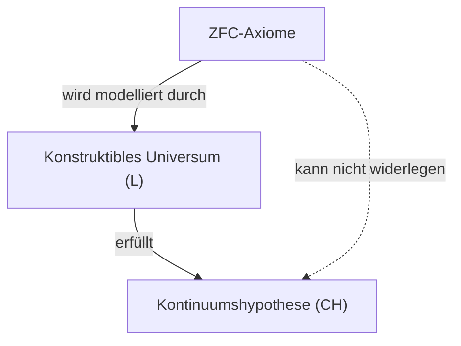
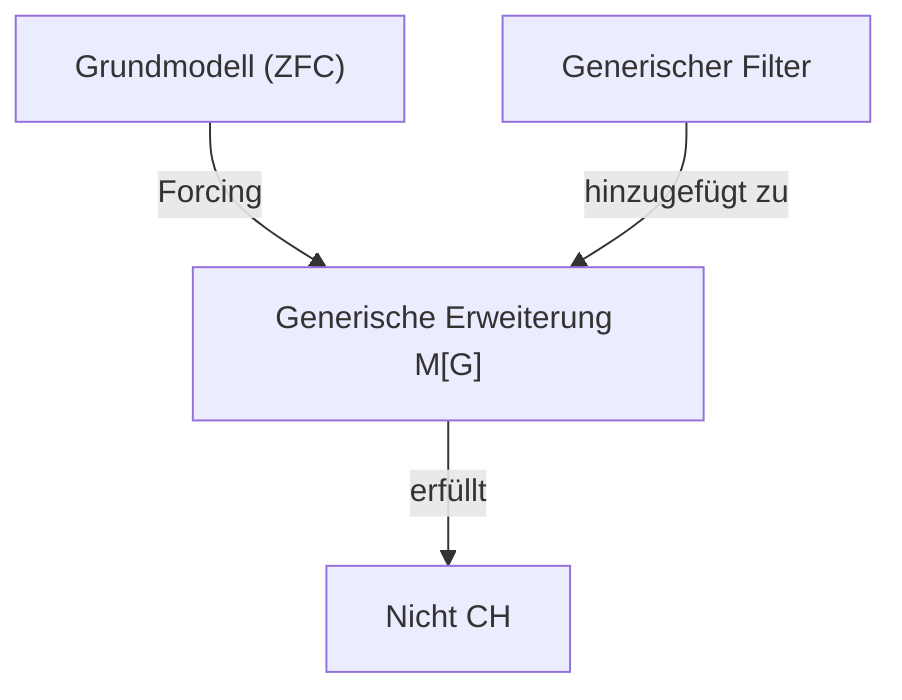

## 1. Einleitung: Die Messung der Unendlichkeit

In der Welt der Mathematik ist das Konzept der „Unendlichkeit“ seit langem Gegenstand philosophischer Debatten. Bis zum Auftreten von [Georg Cantor](https://kenji.blog/de/p/cantor/) Ende des 19. Jahrhunderts gab es jedoch keine strengen mathematischen Methoden, um die Größen von Unendlichkeiten zu vergleichen. Cantor begründete die Mengenlehre und bewies, dass es auch bei der Unendlichkeit **unterschiedliche Größen** (Mächtigkeiten, Kardinalitäten) gibt.

Betrachtet man die Menge der natürlichen Zahlen $\mathbb{N}$ und die Menge der reellen Zahlen $\mathbb{R}$, so zeigte Cantors zweites Diagonalargument, dass die Menge der reellen Zahlen „echt größer“ ist als die Menge der natürlichen Zahlen. Die Mächtigkeit der natürlichen Zahlen wird mit $\aleph_0$ (Aleph-null) und die der reellen Zahlen mit $\mathfrak{c}$ (Mächtigkeit des Kontinuums) oder $2^{\aleph_0}$ bezeichnet. Nach dem Satz von Cantor gilt $\aleph_0 < 2^{\aleph_0}$.

Hier stellte sich Cantor eine natürliche Frage: „Gibt es eine Menge mit einer Mächtigkeit, die genau in der **Mitte** zwischen der Mächtigkeit der natürlichen Zahlen und der Mächtigkeit der reellen Zahlen liegt?“
Dies ist der Ursprung der **Kontinuumshypothese** ([Continuum Hypothesis](https://kenji.blog/de/p/continuum-hypothesis/), CH), die später die Grundlagen der Mathematik erschüttern sollte.

## 2. Strenge Definition der Kontinuumshypothese (CH)

Die Kontinuumshypothese wird wie folgt formuliert:

> **Kontinuumshypothese (CH)**
> Es gibt keine Menge, deren Mächtigkeit streng zwischen der der natürlichen Zahlen $\aleph_0$ und der der reellen Zahlen $2^{\aleph_0}$ liegt.
> Das heißt, $\aleph_1 = 2^{\aleph_0}$.

Hier bezeichnet $\aleph_1$ die nächstgrößere unendliche Mächtigkeit nach $\aleph_0$. Wäre die CH wahr, so wäre die Größe der Menge der reellen Zahlen die nächstgrößere Unendlichkeit nach der Menge der natürlichen Zahlen.

### Darstellung von Formeln mit KaTeX

Mathematisch gesehen ist für jede unendliche Menge $S$ die Mächtigkeit ihrer Potenzmenge $\mathcal{P}(S)$ echt größer als die Mächtigkeit der ursprünglichen Menge (Satz von Cantor).
$$ |S| < |\mathcal{P}(S)| $$
Daher gilt für die Menge der natürlichen Zahlen $\mathbb{N}$:
$$ |\mathbb{N}| < |\mathcal{P}(\mathbb{N})| = |\mathbb{R}| $$
Die CH behauptet, dass es zwischen diesen beiden keine weitere Mächtigkeit gibt.

## 3. Cantors Leiden und [David Hilbert](https://kenji.blog/de/p/hilbert/)s These

Cantor verbrachte sein Leben damit, diese Hypothese zu beweisen, doch ohne Erfolg. Manchmal glaubte er, sie „bewiesen“ zu haben, und ein anderes Mal, er hätte sie „widerlegt“. Sein mentaler Zustand wurde durch dieses schwierige Problem stark beeinträchtigt.

Im Jahr 1900 stellte [David Hilbert](https://kenji.blog/de/p/hilbert/) auf dem 2. Internationalen Mathematikerkongress in Paris seine berühmten „23 mathematischen Probleme“ vor, die die Mathematik im 20. Jahrhundert lösen sollte. Das denkwürdige **erste Problem** war genau dieser „Beweis der Kontinuumshypothese“.

## 4. Axiomatisierung der Mengenlehre: Das ZFC-Axiomensystem

Um die Kontinuumshypothese zu beweisen, musste zunächst streng definiert werden, was eine „Menge“ ist und welche Operationen zulässig sind. Das von Ernst Zermelo und Adolf Fraenkel entwickelte **ZFC-Axiomensystem** (Zermelo-Fraenkel-Mengenlehre mit dem Auswahlaxiom) bildet die Standardgrundlage der modernen Mathematik.

Das ZFC-Axiomensystem besteht aus den folgenden 9 Axiomen (oder Axiomenschemata):
1. Extensionalitätsaxiom
2. Leermengenaxiom
3. Paarmengenaxiom
4. Vereinigungsmengenaxiom
5. Potenzmengenaxiom
6. Aussonderungsaxiom (Ersetzungsaxiom)
7. Unendlichkeitsaxiom
8. Fundierungsaxiom (Regularitätsaxiom)
9. Auswahlaxiom (Axiom of Choice)

Mit Hilfe dieser Axiome versuchten Mathematiker, den Wahrheitsgehalt der CH zu bestimmen.

## 5. [Kurt Gödel](https://kenji.blog/de/p/godel/) und die „Konstruktiblen Mengen“

Im Jahr 1940 veröffentlichte [Kurt Gödel](https://kenji.blog/de/p/godel/) ein erstaunliches Ergebnis. Er bewies, dass unter der Annahme, das ZFC-Axiomensystem sei widerspruchsfrei, **„das Hinzufügen der CH zum ZFC-Axiomensystem keinen Widerspruch erzeugt“**.

Gödel konstruierte ein Modell der Mengenlehre, das als **konstruktibles Universum** (Constructible Universe, $L$) bezeichnet wird. In $L$ werden alle Mengen hierarchisch durch logische Formeln aufgebaut. Gödel zeigte, dass in diesem $L$ alle ZFC-Axiome erfüllt sind und zudem **die CH wahr wird**.

Damit stand fest, dass es unmöglich ist, die CH aus dem ZFC-Axiomensystem zu widerlegen (die CH ist relativ widerspruchsfrei zu ZFC).

## 6. Paul Cohen und das „Forcing“

Im Jahr 1963, mehr als 20 Jahre nach Gödels Ergebnis, veröffentlichte Paul Cohen ein noch verblüffenderes Resultat. Er erfand eine völlig neue mathematische Methode namens **Forcing** (Erzwingungsmethode) und zeigte, dass es **„auch unmöglich ist, die CH aus dem ZFC-Axiomensystem zu beweisen“**.

Cohen entwickelte eine Technik, um ein Modell, das ZFC erfüllt, zu erweitern, indem er von außen eine neue Menge (einen generischen Filter) hinzufügt. Mit diesem Forcing konstruierte er ein Modell, in dem **„ZFC erfüllt ist, die CH jedoch falsch ist (zum Beispiel, wenn die Mächtigkeit der reellen Zahlen $\aleph_2$ wird)“**.

## 7. Fazit: Eine „Unabhängigkeit“, die weder beweisbar noch widerlegbar ist

Durch die gemeinsamen Arbeiten von Gödel und Cohen wurde festgestellt, dass die Kontinuumshypothese aus dem ZFC-Axiomensystem **weder bewiesen noch widerlegt** werden kann. Eine solche Aussage nennt man **unabhängig** (independent) vom Axiomensystem.

Dies war ein unermesslicher Schock für die mathematische Welt. Was ist überhaupt eine mathematische Wahrheit? Das von uns verwendete Axiomensystem (ZFC) war unvollständig, um die wahre Größe der Menge der reellen Zahlen zu bestimmen (was auch als Manifestation des gödelschen Unvollständigkeitssatzes betrachtet werden kann).

### Perspektiven der modernen Mengenlehre

Auch nachdem sich die Kontinuumshypothese als unabhängig herausstellte, dachten Mathematiker weiter darüber nach. Heute wird versucht, durch Hinzufügen neuer Axiome (wie den Axiomen großer Kardinalzahlen oder Forcing-Axiomen) zu ZFC den Wahrheitsgehalt der Kontinuumshypothese zu bestimmen.

Beispielsweise wird durch Forschungen von W. Hugh Woodin zur $\Omega$-Logik vorgeschlagen, dass bei der Annahme bestimmter starker Axiome die Annahme, die CH sei „falsch“, natürlicher erscheint. Andererseits gibt es auch Perspektiven, die argumentieren, dass es wünschenswert wäre, wenn die CH „wahr“ wäre; ein endgültiges Ergebnis steht jedoch noch aus.

## 8. Vertiefung der mathematischen Hintergründe

Um die Kontinuumshypothese besser zu verstehen, betrachten wir die Konzepte der Ordinalzahlen (Ordinal numbers) und Kardinalzahlen (Cardinal numbers) genauer.

### Ordinalzahlen und wohlgeordnete Mengen
Ordinalzahlen sind eine Abstraktion der „Anordnung“ von Mengen. Die Menge der natürlichen Zahlen $\mathbb{N}$ ist durch die übliche Größenrelation wohlgeordnet. Den Ordnungstyp dieser gesamten Anordnung nennt man $\omega$ (Omega). Nach $\omega$ folgen unendlich weiter $\omega+1, \omega+2, \dots$ und dann $\omega+\omega, \omega \times \omega, \omega^{\omega}$ usw. All diese sind abzählbar (haben dieselbe Mächtigkeit wie die natürlichen Zahlen).

Betrachtet man die Menge aller abzählbaren Ordinalzahlen, so ist diese selbst eine wohlgeordnete Menge, und ihr Ordnungstyp ist nicht mehr abzählbar. Dies nennt man die erste überabzählbare Ordinalzahl und bezeichnet sie mit $\omega_1$. Die Mächtigkeit von $\omega_1$ ist $\aleph_1$.

### Aleph-Zahlen (Aleph Numbers)
Cantor benannte die unendlichen Mächtigkeiten in aufsteigender Reihenfolge $\aleph_0, \aleph_1, \aleph_2, \dots$.
- $\aleph_0$ : Die Mächtigkeit der natürlichen Zahlen $\mathbb{N}$
- $\aleph_1$ : Die Mächtigkeit von $\omega_1$ (die Mächtigkeit der Menge aller abzählbaren Ordinalzahlen)
- $\dots$

Die CH ist die Behauptung, dass $2^{\aleph_0} = \aleph_1$. Wenn die CH falsch ist, besteht die Möglichkeit, dass die Mächtigkeit größer ist, wie z. B. $2^{\aleph_0} = \aleph_2$ oder $2^{\aleph_0} = \aleph_{\omega+1}$ (allerdings gibt es durch den Satz von König Einschränkungen, wie z. B. $2^{\aleph_0} \neq \aleph_{\omega}$).

### Wie Cohens Forcing funktioniert
Forcing ist eine extrem schwierige Technik, deren Kernidee jedoch wie folgt aussieht:
Für ein Grundmodell $M$ betrachten wir eine Menge $P$ von Bedingungen (Poset), die eine neue Teilmenge „Schritt für Schritt“ annähern. Wir finden in $P$ einen Filter $G$ aus nicht widersprüchlichen Bedingungen (einen sogenannten generischen Filter, etwas Besonderes, das nicht zu $M$ gehört), fügen $G$ zu $M$ hinzu und erstellen so ein neues Modell $M[G]$.

Cohen konstruierte ein Forcing, das eine riesige Menge (z. B. $\aleph_2$) von neuen Funktionen von den natürlichen Zahlen nach $\{0, 1\}$ (entsprechend den reellen Zahlen) hinzufügt. Das Ergebnis war, dass die Anzahl der reellen Zahlen in $M[G]$ mindestens $\aleph_2$ wurde, wodurch die CH falsch wurde.

## 9. Philosophische Implikationen

Die Unabhängigkeit der CH wirft tiefgreifende Probleme für die Philosophie der Mathematik auf, nämlich für den „Platonismus“ und den „Formalismus“.
- **Platonistische Sichtweise**: Es gibt nur eine einzige Ideenwelt der Mengen, und die CH hat notwendigerweise einen objektiven Wahrheitswert von entweder „wahr“ oder „falsch“. Dass ZFC diesen nicht bestimmen kann, liegt daran, dass ZFC aufgrund der Grenzen der menschlichen Erkenntnis ein unvollständiges Axiomensystem ist.
- **Formalistische Sichtweise**: Die Mathematik ist lediglich ein Spiel, bei dem Symbole gemäß logischen Regeln ausgehend von Axiomen manipuliert werden. Ähnlich wie beim Parallelenaxiom in der euklidischen Geometrie existieren einfach unterschiedliche mathematische Universen wie eine „Mengenlehre, in der die CH wahr ist“ und eine „Mengenlehre, in der die CH falsch ist“ nebeneinander.

## 10. Zusammenfassung

Die von [Georg Cantor](https://kenji.blog/de/p/cantor/) erträumte Suche nach einer Hierarchie der Unendlichkeit fand durch zwei Genies, Gödel und Cohen, ein dramatisches Ende: Sie ist „weder beweisbar noch widerlegbar“. Dies bedeutet jedoch keineswegs eine Niederlage für die Mathematik. Im Gegenteil, es führte zur Entwicklung des leistungsstarken Werkzeugs des Forcing und ließ das Gebiet der Mengenlehre reicher und komplexer als je zuvor werden.

Die Kontinuumshypothese stellt uns auch heute noch die fundamentalen Fragen: „Was ist Unendlichkeit?“ und „Was ist mathematische Wahrheit?“.

## Ergänzung: Weitere Überlegungen zur Unendlichkeit

Die Erforschung der Unendlichkeit in der Mathematik wird seit Cantor bis heute aktiv fortgesetzt. Nach dem Beweis der Unabhängigkeit der Kontinuumshypothese haben wir gelernt, dass wir durch die Wahl des Axiomensystems verschiedene „Universen“ beschreiben können. Die Debatte darüber, ob mathematische Objekte tatsächlich in der physischen Welt existieren oder ob sie reine Schöpfungen des menschlichen Geistes sind, hat sich in eine neue Phase entwickelt und überschneidet sich mit der Behandlung der Unendlichkeit in der Informationstheorie und der Quantenmechanik.
