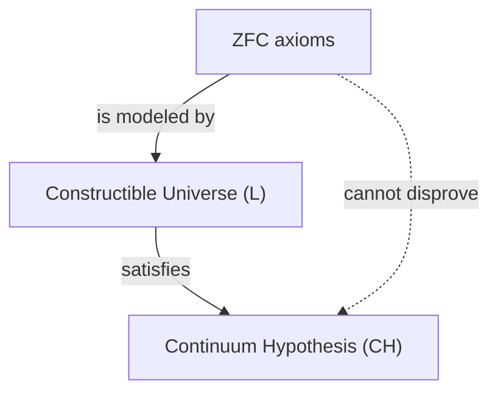

## 1. Introduction: Measuring the Size of Infinity

In the world of mathematics, the concept of "infinity" has long been a subject of philosophical debate. However, until the emergence of [Georg Cantor](https://kenji.blog/en/p/cantor/) in the late 19th century, there was no rigorous mathematical method to compare the sizes of infinity. Cantor founded set theory and proved that there are **different sizes** (cardinalities) even within infinity.

Considering the set of natural numbers $\mathbb{N}$ and the set of real numbers $\mathbb{R}$, [Cantor's diagonal argument](/en/p/cantors-diagonal-argument/) showed that the set of real numbers is "strictly larger" than the set of natural numbers. The cardinality of the natural numbers is denoted by $\aleph_0$ (aleph-null), and the cardinality of the real numbers by $\mathfrak{c}$ (cardinality of the continuum) or $2^{\aleph_0}$. According to Cantor's theorem, $\aleph_0 < 2^{\aleph_0}$.

Here, Cantor had a natural question: "Does there exist a set with a cardinality positioned in the **middle** of the cardinality of the natural numbers and the cardinality of the real numbers?"
This is the origin of the **[Continuum Hypothesis](https://kenji.blog/en/p/continuum-hypothesis/)** (CH), which would later shake the foundations of mathematics.

## 2. Rigorous Definition of the [Continuum Hypothesis](https://kenji.blog/en/p/continuum-hypothesis/) (CH)

The continuum hypothesis is formulated as follows.

> **[Continuum Hypothesis](https://kenji.blog/en/p/continuum-hypothesis/) (CH)**
> There is no set whose cardinality is strictly between that of the integers $\aleph_0$ and the real numbers $2^{\aleph_0}$.
> That is, $\aleph_1 = 2^{\aleph_0}$.

Here, $\aleph_1$ refers to the next largest infinite cardinality after $\aleph_0$. If CH is true, the size of the set of real numbers is the next largest infinity after the set of natural numbers.

### Expressing Formulas with KaTeX

Mathematically, for any infinite set $S$, the cardinality of its power set $\mathcal{P}(S)$ is strictly greater than the cardinality of the original set (Cantor's theorem).
$$ |S| < |\mathcal{P}(S)| $$
Therefore, for the set of natural numbers $\mathbb{N}$,
$$ |\mathbb{N}| < |\mathcal{P}(\mathbb{N})| = |\mathbb{R}| $$
holds. CH is the assertion that no other cardinality exists in between these.

## 3. Cantor's Struggle and [David Hilbert](https://kenji.blog/en/p/hilbert/)'s Proposition

Cantor spent his life trying to prove this hypothesis, but he never succeeded. At times he believed he had "proved it", and at other times he thought he had "disproved it"; his mental state was greatly worn down by this profound problem.

In 1900, at the second International Congress of Mathematicians held in Paris, [David Hilbert](https://kenji.blog/en/p/hilbert/) proposed "[Hilbert](https://kenji.blog/en/p/hilbert/)'s 23 problems" that 20th-century mathematics should solve. That memorable **first problem** was precisely this "proof of the continuum hypothesis".

## 4. Axiomatization of Set Theory: The ZFC Axiom System

To prove the continuum hypothesis, it was first necessary to strictly define what a "set" is and what operations are permitted. The **ZFC axiom system** (Zermelo-Fraenkel set theory with the axiom of choice), developed by Ernst Zermelo and Adolf Fraenkel, has become the standard foundation of modern mathematics.

The ZFC axiom system consists of the following 9 axioms (or axiom schemas):
1. Axiom of extensionality
2. Axiom of empty set
3. Axiom of pairing
4. Axiom of union
5. Axiom of power set
6. Axiom schema of specification (or replacement)
7. Axiom of infinity
8. Axiom of regularity (or foundation)
9. Axiom of Choice

Using these axioms, mathematicians attempted to determine the truth or falsehood of CH.

## 5. [Kurt Gödel](https://kenji.blog/en/p/godel/) and the "Constructible Universe"

In 1940, [Kurt Gödel](https://kenji.blog/en/p/godel/) published a surprising result. He proved that, assuming the ZFC axiom system is consistent, **"adding CH to the ZFC axiom system does not lead to a contradiction."**

Gödel constructed a model of sets called the **Constructible Universe** ($L$). In $L$, all sets are constructed hierarchically by logical formulas. Gödel showed that all ZFC axioms are satisfied in this $L$, and furthermore, **CH is also true**.

This established that "it is impossible to disprove CH from the ZFC axiom system (CH is relatively consistent with ZFC)."



## 6. Paul Cohen and "Forcing"

In 1963, more than 20 years after Gödel's result, Paul Cohen published an even more surprising result. He invented an entirely new mathematical technique called **Forcing**, and showed that **"it is also impossible to prove CH from the ZFC axiom system."**

Cohen developed a technique to extend a model by adding new sets (generic filters) from the outside to a certain model that satisfies ZFC. Using this forcing technique, he constructed a model where **"ZFC is satisfied, but CH is false (for example, the cardinality of the real numbers becomes $\aleph_2$)."**

```mermaid
graph TD
    M["Ground Model (ZFC)"]
    G["Generic Filter"]
    MG["Generic Extension M[G"]"]
    M -->|"forcing"| MG
    G -->|"added to"| MG
    MG -->|"satisfies"| NOT_CH["Not CH"]
```

## 7. Conclusion: The "Independence" That Can Neither Be Proved Nor Disproved

Combining the achievements of Gödel and Cohen, it was established that the continuum hypothesis can **neither be proved nor disproved** from the ZFC axiom system. Such a proposition is said to be **independent** from the axiom system.

This gave an immeasurable shock to the mathematical community. What on earth is mathematical truth? The axiom system we have adopted (ZFC) was incomplete to determine the true size of the set of real numbers (it can also be said to be one manifestation of [Gödel's incompleteness theorems](https://kenji.blog/en/p/godels-incompleteness-theorems/)).

### Perspectives on Modern Set Theory

Even after it was found that the continuum hypothesis is independent, mathematicians did not stop thinking there. Today, attempts continue to determine the truth or falsehood of the continuum hypothesis by adding new axioms (such as large cardinal axioms and forcing axioms) to ZFC.

For example, in frameworks such as $\Omega$-logic from the research of W. Hugh Woodin and others, a view is proposed that it is more natural to consider CH as "false" assuming certain strong axioms. On the other hand, from another perspective, there is an opinion that it is desirable for CH to be "true," and an ultimate conclusion has not been reached.

## 8. Exploring the Detailed Mathematical Background

To deepen our understanding of the continuum hypothesis, let's look more closely at the concepts of ordinal numbers and cardinal numbers.

### Ordinal Numbers and Well-Ordered Sets
Ordinal numbers are a concept that abstracts the "ordering" of a set. The set of natural numbers $\mathbb{N}$ is well-ordered by the usual less-than-or-equal-to relation. The order type of this entire arrangement is called $\omega$ (omega). After $\omega$, it continues infinitely as $\omega+1, \omega+2, \dots$, and further continues as $\omega+\omega, \omega \times \omega, \omega^{\omega}$. All of these are countable (the same cardinality as the natural numbers).

If we consider the set of all countable ordinal numbers, it itself becomes a well-ordered set, and its order type is no longer countable. This is called the first uncountable ordinal number, and is denoted by $\omega_1$. The cardinality of $\omega_1$ is $\aleph_1$.

### Aleph Numbers
Cantor named the infinite cardinalities in increasing order as $\aleph_0, \aleph_1, \aleph_2, \dots$.
- $\aleph_0$ : Cardinality of the natural numbers $\mathbb{N}$
- $\aleph_1$ : Cardinality of $\omega_1$ (the cardinality of the set of all countable ordinal numbers)
- $\dots$

CH is the claim that $2^{\aleph_0} = \aleph_1$. If CH is false, there is a possibility that it could be a larger cardinality, such as $2^{\aleph_0} = \aleph_2$ or $2^{\aleph_0} = \aleph_{\omega+1}$ (however, there are restrictions such as $2^{\aleph_0} \neq \aleph_{\omega}$ due to König's theorem).

### The Mechanism of Cohen's Forcing
Forcing is a very difficult technique, but its core idea is as follows.
For a base model $M$, consider a set $P$ of conditions (Poset) that "gradually" approximate a new subset. We find a filter $G$ (a special object called a generic filter, not belonging to $M$) that collects consistent conditions in $P$, and add $G$ to $M$ to create a new model $M[G]$.

Cohen constructed a forcing method to add a large number of new functions from natural numbers to $\{0, 1\}$ (corresponding to real numbers), for example $\aleph_2$ of them. As a result, the number of real numbers in $M[G]$ became $\aleph_2$ or more, making CH false.

## 9. Philosophical Implications

The independence of CH poses deep problems for the mathematical philosophies of "Platonism" and "Formalism".
- **Platonist viewpoint** : The ideal world of sets is singular, and CH must have an objective truth value of either "true" or "false". ZFC cannot determine it simply because ZFC is an incomplete axiom system due to the limitations of human cognition.
- **Formalist viewpoint** : Mathematics is merely a game of manipulating symbols according to logical rules from axioms. Just like the parallel postulate in [Euclide](https://kenji.blog/en/p/euclid/)an geometry, different mathematical universes of "set theory where CH is true" and "set theory where CH is false" simply exist in parallel.

## 10. Summary

The exploration of the infinite hierarchy dreamed of by [Georg Cantor](https://kenji.blog/en/p/cantor/) met a dramatic end of being "neither provable nor disprovable" thanks to two geniuses, Gödel and Cohen. However, that by no means signifies a defeat for mathematics. Rather, it produced the powerful tool of forcing, evolving the field of set theory into something richer and more complex than ever before.

The continuum hypothesis continues to throw fundamental questions at us today: "What is infinity?" and "What is mathematical truth?"

## Supplement: Further Thoughts on Infinity

The exploration of infinity in mathematics has been actively carried out from Cantor to the present day. Since the independence proof of the continuum hypothesis, we have learned that we can depict various "universes" depending on the choice of axiom systems. The debate over whether mathematical objects actually exist in the physical world or are purely creations of the human mind is entering a new phase, intersecting with the treatment of infinity in information theory and quantum mechanics.
