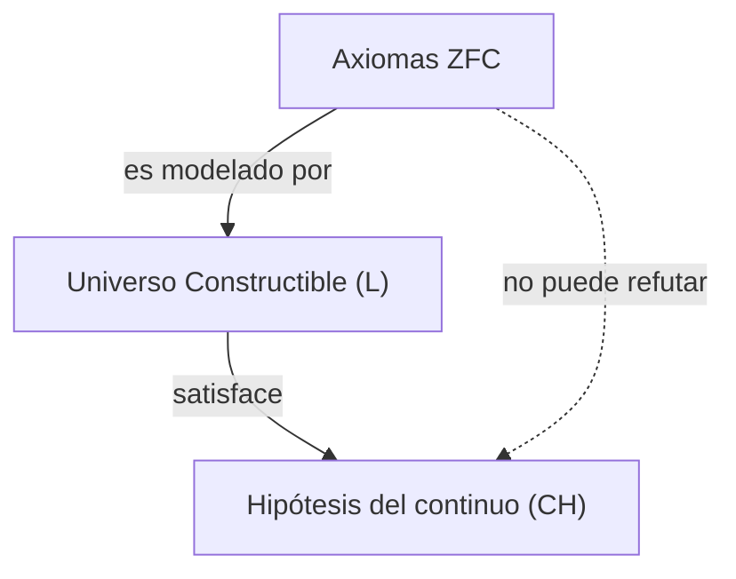
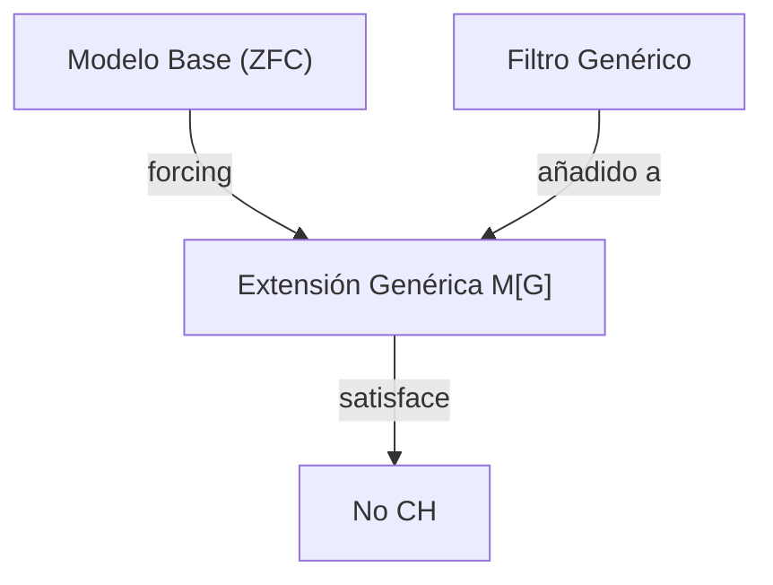

## 1. Introducción: Medir el tamaño del infinito

En el mundo de las matemáticas, el concepto de "infinito" ha sido objeto de debate filosófico desde tiempos antiguos. Sin embargo, no existía un método matemático riguroso para comparar el tamaño del infinito hasta que apareció [Georg Cantor](https://kenji.blog/es/p/cantor/) a finales del siglo XIX. Cantor fundó la teoría de conjuntos y demostró que existen **diferentes tamaños** (cardinalidades) incluso en el infinito.

Al considerar el conjunto de los números naturales $\mathbb{N}$ y el conjunto de los números reales $\mathbb{R}$, el argumento de la diagonalización de Cantor demostró que el conjunto de los números reales es "verdaderamente mayor" que el conjunto de los números naturales. La cardinalidad de los números naturales se denota por $\aleph_0$ (álef sub cero), y la de los números reales por $\mathfrak{c}$ (cardinalidad del continuo) o $2^{\aleph_0}$. Según el teorema de Cantor, $\aleph_0 < 2^{\aleph_0}$.

Aquí, Cantor se planteó una pregunta natural: "¿Existe un conjunto con una cardinalidad que se encuentre en el **medio** de la cardinalidad de los números naturales y la de los números reales?"
Este fue el comienzo de la **Hipótesis del continuo** ([Continuum Hypothesis](https://kenji.blog/es/p/continuum-hypothesis/), CH), que más tarde sacudiría los fundamentos de las matemáticas.

## 2. Definición rigurosa de la Hipótesis del continuo (CH)

La Hipótesis del continuo se formula de la siguiente manera:

> **Hipótesis del continuo (CH)**
> No existe ningún conjunto cuya cardinalidad sea estrictamente mayor que la cardinalidad de los números naturales $\aleph_0$ y estrictamente menor que la cardinalidad de los números reales $2^{\aleph_0}$.
> Es decir, $\aleph_1 = 2^{\aleph_0}$.

Aquí, $\aleph_1$ se refiere a la cardinalidad infinita que sigue inmediatamente a $\aleph_0$. Si la CH es verdadera, el tamaño del conjunto de los números reales sería el siguiente infinito más grande después del conjunto de los números naturales.

### Expresión de fórmulas con KaTeX

Matemáticamente, para cualquier conjunto infinito $S$, la cardinalidad de su conjunto potencia $\mathcal{P}(S)$ es estrictamente mayor que la cardinalidad del conjunto original (Teorema de Cantor).
$$ |S| < |\mathcal{P}(S)| $$
Por lo tanto, para el conjunto de los números naturales $\mathbb{N}$, se cumple que:
$$ |\mathbb{N}| < |\mathcal{P}(\mathbb{N})| = |\mathbb{R}| $$
La CH es la afirmación de que no existen otras cardinalidades entre estas dos.

## 3. La agonía de Cantor y la propuesta de [David Hilbert](https://kenji.blog/es/p/hilbert/)

Cantor intentó demostrar esta hipótesis durante toda su vida, pero nunca tuvo éxito. A veces creía haberla "demostrado", y otras veces creía haberla "refutado"; su estado mental se vio gravemente afectado por este difícil problema.

En el Segundo Congreso Internacional de Matemáticos celebrado en París en el año 1900, [David Hilbert](https://kenji.blog/es/p/hilbert/) propuso los "23 problemas de [Hilbert](https://kenji.blog/es/p/hilbert/)" que las matemáticas del siglo XX debían resolver. El memorable **primer problema** fue precisamente esta "demostración de la Hipótesis del continuo".

## 4. Axiomatización de la teoría de conjuntos: El sistema de axiomas ZFC

Para demostrar la Hipótesis del continuo, primero era necesario definir estrictamente qué es un "conjunto" y qué operaciones están permitidas. El **sistema de axiomas ZFC** (teoría de conjuntos de Zermelo-Fraenkel con el axioma de elección), desarrollado por Ernst Zermelo y Adolf Fraenkel, se ha convertido en la base estándar de las matemáticas modernas.

El sistema de axiomas ZFC consta de los siguientes 9 axiomas (o esquemas axiomáticos):
1. Axioma de extensionalidad
2. Axioma del conjunto vacío
3. Axioma del par
4. Axioma de la unión
5. Axioma del conjunto potencia
6. Axioma de separación (Esquema axiomático de reemplazo)
7. Axioma del infinito
8. Axioma de regularidad (o fundación)
9. Axioma de elección (Axiom of Choice)

Usando estos axiomas, los matemáticos intentaron determinar la veracidad de la CH.

## 5. [Kurt Gödel](https://kenji.blog/es/p/godel/) y el "universo constructible"

En 1940, [Kurt Gödel](https://kenji.blog/es/p/godel/) publicó un resultado sorprendente. Demostró que, suponiendo que el sistema de axiomas ZFC sea consistente, **"añadir la CH al sistema de axiomas ZFC no genera contradicciones"**.

Gödel construyó un modelo de conjuntos llamado el **universo constructible** (Constructible Universe, $L$). Dentro de $L$, todos los conjuntos se construyen jerárquicamente mediante fórmulas lógicas. Gödel demostró que todos los axiomas ZFC se cumplen dentro de este $L$, y además, **la CH también es verdadera**.

Con esto, se estableció que "es imposible refutar la CH a partir del sistema de axiomas ZFC (la CH es relativamente consistente con ZFC)".

## 6. Paul Cohen y el "forcing"

En 1963, más de 20 años después del resultado de Gödel, Paul Cohen publicó un resultado aún más sorprendente. Inventó una técnica matemática completamente nueva llamada **forcing** (Forzamiento), y demostró que **"también es imposible demostrar la CH a partir del sistema de axiomas ZFC"**.

Cohen desarrolló un método para expandir un modelo que satisface ZFC añadiéndole nuevos conjuntos desde el exterior (filtros genéricos) para crear un nuevo modelo. Utilizando este método de forcing, construyó un modelo en el que **"ZFC se cumple, pero la CH es falsa (por ejemplo, la cardinalidad de los números reales se convierte en $\aleph_2$)"**.

## 7. Conclusión: La "independencia" de no ser demostrable ni refutable

Combinando los trabajos de Gödel y Cohen, se estableció que la Hipótesis del continuo **no puede ser demostrada ni refutada** a partir del sistema de axiomas ZFC. A una proposición de este tipo se le llama **independiente** (Independent) del sistema axiomático.

Esto causó un impacto inmensurable en el mundo de las matemáticas. ¿Qué es exactamente la verdad matemática? Nuestro sistema axiomático adoptado (ZFC) era incompleto para determinar el tamaño real del conjunto de los números reales (podría decirse que es una manifestación del teorema de incompletitud de Gödel).

### Perspectivas de la teoría de conjuntos moderna

Incluso después de descubrir que la Hipótesis del continuo es independiente, los matemáticos no dejaron de reflexionar sobre ello. Hoy en día, los intentos de determinar la veracidad de la Hipótesis del continuo continúan añadiendo nuevos axiomas a ZFC (como los axiomas de cardinales grandes y los axiomas de forcing).

Por ejemplo, bajo marcos como la lógica $\Omega$, a partir de las investigaciones de W. Hugh Woodin y otros, se propone la visión de que si se asumen ciertos axiomas fuertes, es más natural considerar que la CH es "falsa". Por otro lado, desde una perspectiva diferente, también hay puntos de vista de que es preferible que la CH sea "verdadera", y no se ha llegado a una conclusión definitiva.

## 8. Exploración detallada del trasfondo matemático

Para profundizar nuestra comprensión de la Hipótesis del continuo, veamos en detalle los conceptos de números ordinales (Ordinal numbers) y números cardinales (Cardinal numbers).

### Números ordinales y conjuntos bien ordenados
Los números ordinales son un concepto que abstrae la "forma de ordenar" un conjunto. El conjunto de los números naturales $\mathbb{N}$ está bien ordenado por la relación de orden habitual. A este tipo de orden total se le llama $\omega$ (omega). Después de $\omega$ siguen infinitamente $\omega+1, \omega+2, \dots$, y luego continúan $\omega+\omega, \omega \times \omega, \omega^{\omega}$. Todos estos son numerables (tienen la misma cardinalidad que los números naturales).

Si consideramos el conjunto de todos los números ordinales numerables, este también se convierte en un conjunto bien ordenado, y su tipo de orden ya no es numerable. A este se le llama el primer número ordinal no numerable, y se denota como $\omega_1$. La cardinalidad de $\omega_1$ es $\aleph_1$.

### Números álef (Aleph Numbers)
Cantor nombró a las cardinalidades infinitas en orden ascendente como $\aleph_0, \aleph_1, \aleph_2, \dots$.
- $\aleph_0$ : Cardinalidad de los números naturales $\mathbb{N}$
- $\aleph_1$ : Cardinalidad de $\omega_1$ (cardinalidad del conjunto de todos los números ordinales numerables)
- $\dots$

La CH es la afirmación de que $2^{\aleph_0} = \aleph_1$. Si la CH fuera falsa, existiría la posibilidad de que fuera una cardinalidad mayor, como $2^{\aleph_0} = \aleph_2$ o $2^{\aleph_0} = \aleph_{\omega+1}$ (sin embargo, debido al teorema de König, existen restricciones como $2^{\aleph_0} \neq \aleph_{\omega}$).

### El mecanismo del forcing de Cohen
El forcing es una técnica extremadamente difícil, pero su idea central es la siguiente.
Para un modelo base $M$, consideramos un conjunto $P$ de condiciones (Poset) que aproxima "poco a poco" un nuevo subconjunto. Encontramos un filtro $G$ que agrupa condiciones no contradictorias dentro de $P$ (algo especial que no pertenece a $M$, llamado filtro genérico), y lo añadimos a $M$ para crear un nuevo modelo $M[G]$.

Cohen construyó un método de forcing que añadía una gran cantidad nueva (por ejemplo, $\aleph_2$) de funciones desde los números naturales hacia $\{0, 1\}$ (equivalentes a números reales). Como resultado, dentro de $M[G]$, el número de números reales pasa a ser $\aleph_2$ o más, haciendo que la CH sea falsa.

## 9. Implicaciones filosóficas

La independencia de la CH plantea problemas profundos en la filosofía de las matemáticas, específicamente entre el "platonismo" y el "formalismo".
- **Perspectiva platónica** : El mundo de las ideas de los conjuntos es único, y la CH debe tener necesariamente un valor de verdad objetivo, ya sea "verdadero" o "falso". La razón por la que ZFC no puede determinarlo es porque ZFC es un sistema axiomático incompleto debido a los límites de la cognición humana.
- **Perspectiva formalista** : Las matemáticas no son más que un juego de manipulación de símbolos siguiendo reglas lógicas a partir de axiomas. Al igual que el axioma de las paralelas en la geometría euclidiana, simplemente coexisten universos matemáticos paralelos: una "teoría de conjuntos donde la CH es verdadera" y una "teoría de conjuntos donde la CH es falsa".

## 10. Resumen

La búsqueda de la jerarquía de los infinitos que soñó [Georg Cantor](https://kenji.blog/es/p/cantor/) llegó a una conclusión dramática de "ni demostrable ni refutable" gracias a dos genios, Gödel y Cohen. Sin embargo, esto no significa en absoluto una derrota para las matemáticas. Al contrario, generó una herramienta poderosa llamada forcing y evolucionó el campo de la teoría de conjuntos hasta hacerlo más rico y complejo que nunca.

La Hipótesis del continuo sigue planteándonos hoy en día las preguntas fundamentales de "qué es el infinito" y "qué es la verdad matemática".

## Apéndice: Más consideraciones sobre el infinito

La exploración del infinito en las matemáticas ha continuado activamente desde Cantor hasta la actualidad. Después de la demostración de la independencia de la Hipótesis del continuo, aprendimos que podemos dibujar varios "universos" dependiendo de la elección del sistema axiomático. El debate sobre si los objetos matemáticos existen realmente en el mundo físico o son puras creaciones de la mente humana ha entrado en una nueva fase, cruzándose también con el manejo del infinito en la teoría de la información y la mecánica cuántica.
