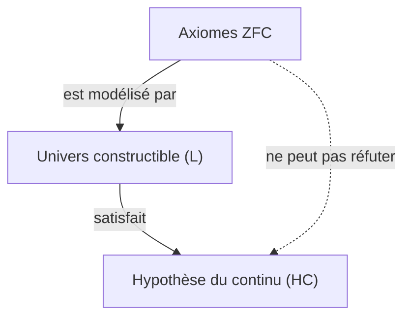
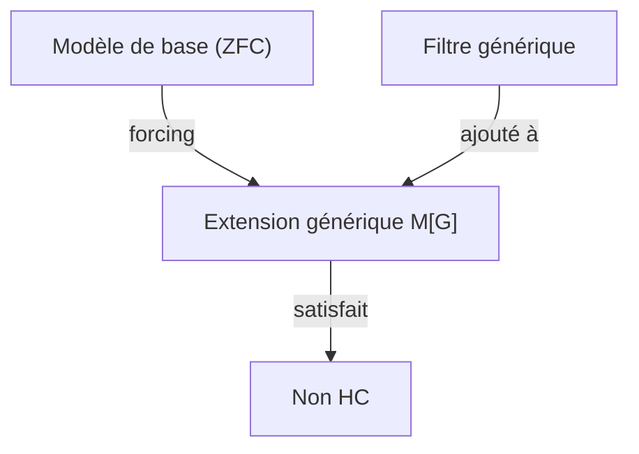

## 1. Introduction : Mesurer la taille de l'infini

Dans le monde des mathématiques, le concept d'« infini » a longtemps fait l'objet de débats philosophiques. Cependant, jusqu'à l'apparition de [Georg Cantor](https://kenji.blog/p/cantor/) à la fin du 19e siècle, il n'existait aucune méthode mathématique rigoureuse pour comparer la taille des infinis. Cantor a fondé la théorie des ensembles et a prouvé qu'il existe **différentes tailles** (cardinalités) même pour l'infini.

En considérant l'ensemble des entiers naturels $\mathbb{N}$ et l'ensemble des nombres réels $\mathbb{R}$, l'argument de la diagonale de Cantor a montré que l'ensemble des nombres réels est « strictement plus grand » que l'ensemble des entiers naturels. Le cardinal des entiers naturels est noté $\aleph_0$ (aleph-zéro), et le cardinal des nombres réels est $\mathfrak{c}$ (cardinalité du continu) ou $2^{\aleph_0}$. Selon le théorème de Cantor, $\aleph_0 < 2^{\aleph_0}$.

Ici, Cantor s'est posé une question naturelle. « Existe-il un ensemble dont la cardinalité se situe au **milieu** , entre la cardinalité des entiers naturels et celle des nombres réels ? »
C'est le début de l'**Hypothèse du continu** ([Continuum Hypothesis](https://kenji.blog/p/continuum-hypothesis/), HC), qui allait plus tard ébranler les fondements des mathématiques.

## 2. Définition rigoureuse de l'hypothèse du continu (HC)

L'hypothèse du continu est formulée comme suit.

> **Hypothèse du continu (HC)**
> Il n'existe aucun ensemble dont la cardinalité est strictement supérieure à celle des entiers naturels $\aleph_0$ et strictement inférieure à celle des nombres réels $2^{\aleph_0}$.
> C'est-à-dire, $\aleph_1 = 2^{\aleph_0}$.

Ici, $\aleph_1$ désigne la cardinalité infinie immédiatement supérieure à $\aleph_0$. Si l'HC est vraie, la taille de l'ensemble des nombres réels est le deuxième infini le plus grand après celui de l'ensemble des entiers naturels.

### Représentation des formules avec KaTeX

Mathématiquement, pour tout ensemble infini $S$, la cardinalité de son ensemble des parties $\mathcal{P}(S)$ est strictement supérieure à la cardinalité de l'ensemble d'origine (théorème de Cantor).
$$ |S| < |\mathcal{P}(S)| $$
Par conséquent, pour l'ensemble des entiers naturels $\mathbb{N}$, on a :
$$ |\mathbb{N}| < |\mathcal{P}(\mathbb{N})| = |\mathbb{R}| $$
L'HC affirme qu'il n'existe aucune autre cardinalité entre les deux.

## 3. Les tourments de Cantor et la proposition de [David Hilbert](https://kenji.blog/p/hilbert/)

Cantor a passé sa vie à essayer de prouver cette hypothèse, mais n'y est jamais parvenu. Parfois il pensait l'avoir « prouvée », d'autres fois l'avoir « réfutée », et sa santé mentale a été grandement affectée par ce problème difficile.

En 1900, lors du deuxième Congrès international des mathématiciens tenu à Paris, [David Hilbert](https://kenji.blog/p/hilbert/) a proposé les « 23 problèmes de Hilbert » que les mathématiques du 20e siècle devraient résoudre. Le mémorable **premier problème** de cette liste était précisément la « preuve de l'hypothèse du continu ».

## 4. Axiomatisation de la théorie des ensembles : Le système d'axiomes ZFC

Pour prouver l'hypothèse du continu, il fallait d'abord définir rigoureusement ce qu'est un « ensemble » et quelles opérations sont permises. Le **système d'axiomes ZFC** (Théorie des ensembles de Zermelo-Fraenkel avec l'axiome du choix), développé par Ernst Zermelo et Adolf Fraenkel, est devenu le fondement standard des mathématiques modernes.

Le système d'axiomes ZFC est composé des 9 axiomes (ou schémas d'axiomes) suivants.
1. Axiome d'extensionnalité
2. Axiome de l'ensemble vide
3. Axiome de la paire
4. Axiome de la réunion
5. Axiome de l'ensemble des parties
6. Schéma d'axiomes de remplacement (ou de compréhension)
7. Axiome de l'infini
8. Axiome de fondation (ou de régularité)
9. Axiome du choix (Axiom of Choice)

En utilisant ces axiomes, les mathématiciens ont essayé de déterminer si l'HC était vraie ou fausse.

## 5. [Kurt Gödel](https://kenji.blog/p/godel/) et « l'univers constructible »

En 1940, [Kurt Gödel](https://kenji.blog/p/godel/) a publié un résultat étonnant. Il a prouvé que si l'on suppose que le système d'axiomes ZFC est non contradictoire, **« l'ajout de l'HC au système d'axiomes ZFC n'introduit pas de contradiction »** .

Gödel a construit un modèle d'ensembles appelé **Univers constructible** (Constructible Universe, $L$). Dans $L$, tous les ensembles sont construits de manière hiérarchique par des formules logiques. Gödel a montré que dans ce $L$, tous les axiomes ZFC sont satisfaits, et de plus, l'**HC est également vraie** .

Cela a établi qu'il est « impossible de réfuter l'HC à partir du système d'axiomes ZFC (l'HC est relative et cohérente avec ZFC) ».

## 6. Paul Cohen et le « forcing »

En 1963, plus de 20 ans après les résultats de Gödel, Paul Cohen a publié un résultat encore plus étonnant. Il a inventé une technique mathématique complètement nouvelle appelée le **forcing** , et a montré qu'il est **« également impossible de prouver l'HC à partir du système d'axiomes ZFC »** .

Cohen a développé une méthode pour étendre un nouveau modèle en ajoutant de nouveaux ensembles (filtre générique) de l'extérieur à un modèle existant satisfaisant ZFC. En utilisant ce forcing, il a construit un modèle **« qui satisfait ZFC, mais où l'HC est fausse (par exemple, la cardinalité des nombres réels devient $\aleph_2$) »** .

## 7. Conclusion : Une « indépendance » impossible à prouver ou à réfuter

En combinant les travaux de Gödel et de Cohen, il a été établi que l'hypothèse du continu **ne peut être ni prouvée ni réfutée** à partir du système d'axiomes ZFC. On dit qu'une telle proposition est **indépendante** (Independent) du système d'axiomes.

Cela a provoqué un choc immense dans la communauté mathématique. Qu'est-ce que la vérité mathématique, au juste ? Le système d'axiomes que nous avons adopté (ZFC) était incomplet pour déterminer la véritable taille de l'ensemble des nombres réels (cela peut également être considéré comme une manifestation du théorème d'incomplétude de Gödel).

### Perspectives de la théorie des ensembles moderne

Même après qu'il a été découvert que l'hypothèse du continu est indépendante, les mathématiciens n'ont pas arrêté de réfléchir. Aujourd'hui, des tentatives continuent d'être faites pour déterminer la vérité de l'hypothèse du continu en ajoutant de nouveaux axiomes (comme l'axiome des grands cardinaux ou l'axiome de forcing) à ZFC.

Par exemple, dans des cadres comme la $\Omega$-logique étudiée par W. Hugh Woodin et d'autres, il a été proposé que si l'on suppose certains axiomes forts, il est plus naturel de considérer que l'HC est « fausse ». D'un autre côté, d'autres points de vue soutiennent qu'il est souhaitable que l'HC soit « vraie », et aucune conclusion définitive n'a encore été atteinte.

## 8. Exploration approfondie du contexte mathématique

Pour mieux comprendre l'hypothèse du continu, examinons de plus près les concepts de nombres ordinaux (Ordinal numbers) et de nombres cardinaux (Cardinal numbers).

### Nombres ordinaux et ensembles bien ordonnés
Les nombres ordinaux sont un concept abstrait de la façon dont les ensembles sont « ordonnés ». L'ensemble des entiers naturels $\mathbb{N}$ est bien ordonné par la relation d'ordre habituelle. Le type d'ordre de cette séquence entière est appelé $\omega$ (oméga). Après $\omega$, la séquence continue indéfiniment avec $\omega+1, \omega+2, \dots$, et plus loin encore avec $\omega+\omega, \omega \times \omega, \omega^{\omega}$. Tous ceux-ci sont dénombrables (ont la même cardinalité que les entiers naturels).

Si l'on considère l'ensemble de tous les nombres ordinaux dénombrables, il devient lui-même un ensemble bien ordonné, et son type d'ordre n'est plus dénombrable. C'est ce qu'on appelle le premier nombre ordinal indénombrable, noté $\omega_1$. La cardinalité de $\omega_1$ est $\aleph_1$.

### Nombres Aleph (Aleph Numbers)
Cantor a nommé les cardinalités infinies de la plus petite à la plus grande $\aleph_0, \aleph_1, \aleph_2, \dots$.
- $\aleph_0$ : Cardinalité des entiers naturels $\mathbb{N}$
- $\aleph_1$ : Cardinalité de $\omega_1$ (cardinalité de l'ensemble de tous les ordinaux dénombrables)
- $\dots$

L'HC est l'affirmation que $2^{\aleph_0} = \aleph_1$. Si l'HC est fausse, elle pourrait correspondre à une cardinalité plus grande telle que $2^{\aleph_0} = \aleph_2$ ou $2^{\aleph_0} = \aleph_{\omega+1}$ (cependant, selon le théorème de König, il y a des restrictions comme $2^{\aleph_0} \neq \aleph_{\omega}$).

### Mécanisme du forcing de Cohen
Le forcing est une technique très difficile, mais son idée centrale est la suivante.
Pour un modèle de base $M$, on considère un ensemble $P$ de conditions (Poset) qui approximent un nouveau sous-ensemble « petit à petit ». On trouve un filtre $G$ (appelé filtre générique, une chose spéciale qui n'appartient pas à $M$) regroupant des conditions non contradictoires dans $P$, puis on ajoute $G$ à $M$ pour créer un nouveau modèle $M[G]$.

Cohen a construit un forcing qui ajoute une grande quantité nouvelle (par exemple $\aleph_2$) de fonctions des entiers naturels vers $\{0, 1\}$ (qui correspondent aux nombres réels). En conséquence, le nombre de réels dans $M[G]$ devient au moins $\aleph_2$, rendant l'HC fausse.

## 9. Implications philosophiques

L'indépendance de l'HC soulève des questions profondes dans la philosophie des mathématiques entre le « platonisme » et le « formalisme ».
- **Point de vue platoniste** : Le monde idéal des ensembles est unique, et l'HC a nécessairement une valeur de vérité objective, soit « vraie », soit « fausse ». Le fait que ZFC ne puisse pas la déterminer est dû au fait que ZFC est un système d'axiomes incomplet limité par les capacités de la cognition humaine.
- **Point de vue formaliste** : Les mathématiques ne sont qu'un jeu consistant à manipuler des symboles selon des règles logiques à partir d'axiomes. Tout comme pour l'axiome des parallèles en géométrie euclidienne, différents univers mathématiques tels qu'« une théorie des ensembles où l'HC est vraie » et « une théorie des ensembles où l'HC est fausse » existent simplement en parallèle.

## 10. Résumé

L'exploration de la hiérarchie infinie dont rêvait [Georg Cantor](https://kenji.blog/p/cantor/) a connu une conclusion dramatique, « impossible à prouver ou à réfuter », grâce à deux génies, Gödel et Cohen. Cependant, cela ne signifie en aucun cas la défaite des mathématiques. Au contraire, cela a donné naissance à un outil puissant qu'est le forcing, faisant évoluer le domaine de la théorie des ensembles pour devenir plus riche et complexe que jamais.

L'hypothèse du continu continue de nous poser les questions fondamentales : « Qu'est-ce que l'infini ? » et « Qu'est-ce que la vérité mathématique ? ».

## Supplément : Nouvelles réflexions sur l'infini

L'exploration de l'infini en mathématiques se poursuit activement depuis Cantor jusqu'à nos jours. Depuis la preuve de l'indépendance de l'hypothèse du continu, nous avons appris que l'on peut dessiner divers « univers » selon le choix du système d'axiomes. Le débat sur la question de savoir si les objets mathématiques existent réellement dans le monde physique ou s'ils sont de pures créations de l'esprit humain est entré dans une nouvelle phase, se croisant avec le traitement de l'infini dans la théorie de l'information et la mécanique quantique.
