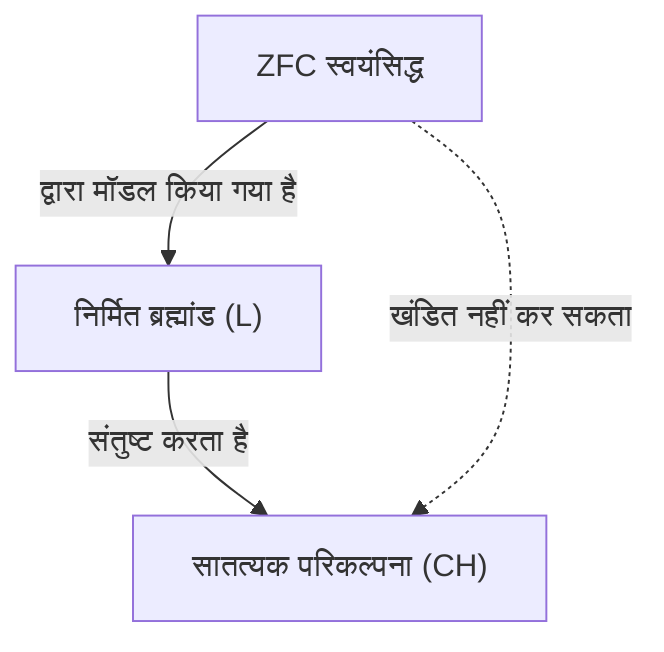
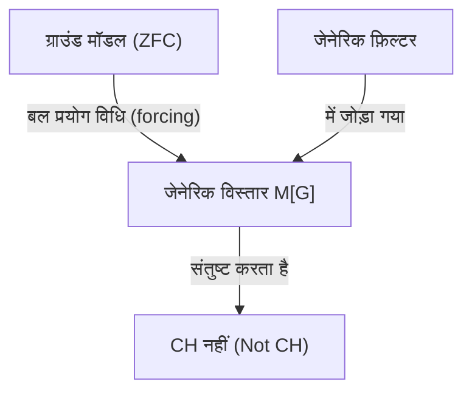

## 1. परिचय: अनंत के आकार को मापना

गणित की दुनिया में, "अनंत" की अवधारणा लंबे समय से दार्शनिक बहस का विषय रही है। हालांकि, 19वीं सदी के अंत में जॉर्ज कैंटर (Georg Cantor) के आगमन तक, अनंत के आकार की सख्ती से तुलना करने के लिए कोई गणितीय विधि नहीं थी। कैंटर ने समुच्चय सिद्धांत (Set Theory) की स्थापना की और साबित किया कि अनंत के भी **विभिन्न आकार** (कार्डिनैलिटी, सांख्यिकी) होते हैं।

जब हम प्राकृतिक संख्याओं के समुच्चय $\mathbb{N}$ और वास्तविक संख्याओं के समुच्चय $\mathbb{R}$ पर विचार करते हैं, तो कैंटर के विकर्ण तर्क (diagonal argument) ने दिखाया कि वास्तविक संख्याओं का समुच्चय प्राकृतिक संख्याओं के समुच्चय से "वास्तव में बड़ा" है। प्राकृतिक संख्याओं की कार्डिनैलिटी को $\aleph_0$ (अलेफ नल) द्वारा दर्शाया जाता है, और वास्तविक संख्याओं की कार्डिनैलिटी को $\mathfrak{c}$ (सातत्यक की कार्डिनैलिटी) या $2^{\aleph_0}$ द्वारा दर्शाया जाता है। कैंटर के प्रमेय के अनुसार, $\aleph_0 < 2^{\aleph_0}$ है।

यहाँ कैंटर के मन में एक स्वाभाविक प्रश्न उठा। "क्या प्राकृतिक संख्याओं की कार्डिनैलिटी और वास्तविक संख्याओं की कार्डिनैलिटी के **बीच** की कार्डिनैलिटी वाला कोई समुच्चय मौजूद है?"
यहीं से **सातत्यक परिकल्पना** (Continuum Hypothesis, CH) की शुरुआत हुई, जो बाद में गणितीय नींव को हिलाकर रख देगी।

## 2. सातत्यक परिकल्पना (CH) की सख्त परिभाषा

सातत्यक परिकल्पना को निम्नानुसार तैयार किया गया है।

> **सातत्यक परिकल्पना (CH)**
> प्राकृतिक संख्याओं की कार्डिनैलिटी $\aleph_0$ से बड़ी और वास्तविक संख्याओं की कार्डिनैलिटी $2^{\aleph_0}$ से छोटी कार्डिनैलिटी वाला कोई समुच्चय मौजूद नहीं है।
> अर्थात्, $\aleph_1 = 2^{\aleph_0}$ है।

यहाँ, $\aleph_1$ का अर्थ $\aleph_0$ के बाद अगली सबसे बड़ी अनंत कार्डिनैलिटी है। यदि CH सत्य है, तो वास्तविक संख्याओं के समुच्चय का आकार प्राकृतिक संख्याओं के समुच्चय के बाद अगला सबसे बड़ा अनंत होगा।

### KaTeX के साथ गणितीय सूत्रों का निरूपण

गणितीय रूप से, किसी भी अनंत समुच्चय $S$ के लिए, इसके घात समुच्चय (power set) $\mathcal{P}(S)$ की कार्डिनैलिटी मूल समुच्चय की कार्डिनैलिटी से वास्तव में बड़ी होती है (कैंटर का प्रमेय)।
$$ |S| < |\mathcal{P}(S)| $$
इसलिए, प्राकृतिक संख्याओं के समुच्चय $\mathbb{N}$ के लिए,
$$ |\mathbb{N}| < |\mathcal{P}(\mathbb{N})| = |\mathbb{R}| $$
लागू होता है। CH यह दावा है कि इनके बीच कोई अन्य कार्डिनैलिटी मौजूद नहीं है।

## 3. कैंटर का संघर्ष और डेविड हिल्बर्ट का प्रस्ताव

कैंटर ने इस परिकल्पना को साबित करने की कोशिश में अपना जीवन बिता दिया, लेकिन कभी सफल नहीं हुए। कभी-कभी उन्हें लगता था कि उन्होंने इसे "सिद्ध कर दिया है," और कभी-कभी उन्हें लगता था कि उन्होंने इसे "खंडित कर दिया है," और उनकी मानसिक स्थिति पर इस कठिन समस्या का बहुत गहरा प्रभाव पड़ा।

1900 में, पेरिस में आयोजित दूसरे अंतर्राष्ट्रीय गणितज्ञ कांग्रेस में, डेविड हिल्बर्ट (David Hilbert) ने "हिल्बर्ट की 23 समस्याएँ" प्रस्तुत कीं, जिन्हें 20वीं सदी के गणित को हल करना चाहिए। वह यादगार **पहली समस्या** वास्तव में "सातत्यक परिकल्पना का प्रमाण" थी।

## 4. समुच्चय सिद्धांत का स्वयंसिद्धीकरण: ZFC स्वयंसिद्ध प्रणाली

सातत्यक परिकल्पना को सिद्ध करने के लिए, सबसे पहले यह सख्ती से परिभाषित करना आवश्यक था कि "समुच्चय" क्या है और किस तरह के संचालन की अनुमति है। अर्नस्ट ज़र्मेलो (Ernst Zermelo) और एडोल्फ फ्रैंकेल (Adolf Fraenkel) द्वारा विकसित **ZFC स्वयंसिद्ध प्रणाली** (ZFC axiom system) (ज़र्मेलो-फ्रैंकेल समुच्चय सिद्धांत जिसमें पसंद का स्वयंसिद्ध शामिल है), आधुनिक गणित की मानक नींव बन गई है।

ZFC स्वयंसिद्ध प्रणाली में निम्नलिखित 9 स्वयंसिद्ध (या स्वयंसिद्ध योजनाएँ) शामिल हैं।
1. विस्तार का स्वयंसिद्ध (Axiom of extensionality)
2. रिक्त समुच्चय का स्वयंसिद्ध (Axiom of empty set)
3. युग्मन का स्वयंसिद्ध (Axiom of pairing)
4. संघ का स्वयंसिद्ध (Axiom of union)
5. घात समुच्चय का स्वयंसिद्ध (Axiom of power set)
6. प्रतिस्थापन का स्वयंसिद्ध (Axiom schema of replacement)
7. अनंत का स्वयंसिद्ध (Axiom of infinity)
8. नियमितता का स्वयंसिद्ध (Axiom of regularity)
9. पसंद का स्वयंसिद्ध (Axiom of Choice)

इन स्वयंसिद्धों का उपयोग करते हुए, गणितज्ञों ने CH की सत्यता या असत्यता का निर्धारण करने का प्रयास किया।

## 5. कर्ट गोडेल और "निर्मित समुच्चय"

1940 में, कर्ट गोडेल (Kurt Gödel) ने एक आश्चर्यजनक परिणाम प्रकाशित किया। उन्होंने साबित किया कि, यह मानते हुए कि ZFC स्वयंसिद्ध प्रणाली सुसंगत है, **"ZFC स्वयंसिद्ध प्रणाली में CH को जोड़ने से कोई विरोधाभास पैदा नहीं होगा।"**

गोडेल ने समुच्चय का एक मॉडल बनाया जिसे **निर्मित ब्रह्मांड** (Constructible Universe, $L$) कहा जाता है। $L$ के भीतर, सभी समुच्चयों का निर्माण तार्किक सूत्रों द्वारा पदानुक्रमित रूप से किया जाता है। गोडेल ने दिखाया कि इस $L$ के भीतर, ZFC स्वयंसिद्ध प्रणाली पूरी तरह से संतुष्ट है, और इसके अलावा, **CH भी सत्य हो जाता है**।

इसने यह सुनिश्चित कर दिया कि "ZFC स्वयंसिद्ध प्रणाली से CH को खंडित करना असंभव है (CH, ZFC के सापेक्ष सुसंगत है)।"

## 6. पॉल कोहेन और "बल प्रयोग विधि (Forcing)"

गोडेल के परिणाम के 20 से अधिक वर्षों बाद 1963 में, पॉल कोहेन (Paul Cohen) ने एक और भी आश्चर्यजनक परिणाम प्रकाशित किया। उन्होंने **बल प्रयोग विधि (Forcing)** नामक एक पूरी तरह से नई गणितीय तकनीक का आविष्कार किया और दिखाया कि **"ZFC स्वयंसिद्ध प्रणाली से CH को सिद्ध करना भी असंभव है।"**

कोहेन ने एक ZFC को संतुष्ट करने वाले मॉडल में बाहर से नए समुच्चय (जेनेरिक फ़िल्टर) जोड़कर एक नए मॉडल का विस्तार करने की विधि विकसित की। इस बल प्रयोग विधि का उपयोग करते हुए, उन्होंने एक ऐसा मॉडल बनाया जो **"ZFC को संतुष्ट करता है, लेकिन CH असत्य हो जाता है (उदाहरण के लिए, वास्तविक संख्याओं की कार्डिनैलिटी $\aleph_2$ बन जाती है)।"**

## 7. निष्कर्ष: "स्वतंत्रता" जिसे न तो सिद्ध किया जा सकता है और न ही खंडित

गोडेल और कोहेन की उपलब्धियों को मिला दें, तो यह सुनिश्चित हो गया कि सातत्यक परिकल्पना को ZFC स्वयंसिद्ध प्रणाली से **न तो सिद्ध किया जा सकता है और न ही खंडित किया जा सकता है**। ऐसे प्रस्ताव को स्वयंसिद्ध प्रणाली से **स्वतंत्र** (Independent) कहा जाता है।

इससे गणित की दुनिया में गहरा आघात लगा। गणितीय सत्य आखिर क्या है? हमने जिस स्वयंसिद्ध प्रणाली (ZFC) को अपनाया है, वह वास्तविक संख्याओं के समुच्चय के वास्तविक आकार को निर्धारित करने के लिए अपूर्ण थी (इसे गोडेल के अपूर्णता प्रमेय की एक अभिव्यक्ति भी कहा जा सकता है)।

### आधुनिक समुच्चय सिद्धांत का परिप्रेक्ष्य

यह पता चलने के बाद भी कि सातत्यक परिकल्पना स्वतंत्र है, गणितज्ञों ने इसके बारे में सोचना बंद नहीं किया। आज, ZFC में नए स्वयंसिद्ध (जैसे बड़े कार्डिनल स्वयंसिद्ध (large cardinal axioms) या बल प्रयोग स्वयंसिद्ध (forcing axioms)) जोड़कर सातत्यक परिकल्पना की सत्यता का निर्धारण करने के प्रयास जारी हैं।

उदाहरण के लिए, डब्ल्यू. ह्यूग वुडिन (W. Hugh Woodin) और अन्य के शोध के आधार पर $\Omega$-तर्क (Omega-logic) जैसे ढांचे में, यह प्रस्ताव किया गया है कि यदि कुछ मजबूत स्वयंसिद्धों को मान लिया जाए, तो CH को "असत्य" मानना अधिक स्वाभाविक है। दूसरी ओर, दूसरे दृष्टिकोण से ऐसे भी विचार हैं कि CH का "सत्य" होना वांछनीय है, और कोई अंतिम निष्कर्ष नहीं निकला है।

## 8. विस्तृत गणितीय पृष्ठभूमि का अन्वेषण

सातत्यक परिकल्पना की गहरी समझ हासिल करने के लिए, आइए क्रमसूचक संख्याओं (Ordinal numbers) और गणन संख्याओं (Cardinal numbers) की अवधारणाओं पर करीब से नज़र डालें।

### क्रमसूचक संख्याएँ और सुव्यवस्थित समुच्चय
क्रमसूचक संख्याएँ एक अवधारणा है जो समुच्चयों को "व्यवस्थित" करने के तरीके को सारगर्भित करती है। प्राकृतिक संख्याओं का समुच्चय $\mathbb{N}$ सामान्य आकार के संबंध द्वारा सुव्यवस्थित है। इस संपूर्ण व्यवस्था के प्रकार को $\omega$ (ओमेगा) कहा जाता है। $\omega$ के बाद, यह अनंत रूप से $\omega+1, \omega+2, \dots$ और आगे $\omega+\omega, \omega \times \omega, \omega^{\omega}$ तक जारी रहता है। ये सभी गणनीय (countable) हैं (प्राकृतिक संख्याओं के समान कार्डिनैलिटी)।

यदि हम सभी गणनीय क्रमसूचक संख्याओं के समुच्चय पर विचार करें, तो यह स्वयं एक सुव्यवस्थित समुच्चय बन जाता है, और इसका क्रम प्रकार अब गणनीय नहीं है। इसे पहली अगणनीय क्रमसूचक संख्या (first uncountable ordinal) कहा जाता है और $\omega_1$ द्वारा दर्शाया जाता है। $\omega_1$ की कार्डिनैलिटी $\aleph_1$ है।

### अलेफ संख्याएँ (Aleph Numbers)
कैंटर ने अनंत कार्डिनैलिटी को सबसे छोटे से $\aleph_0, \aleph_1, \aleph_2, \dots$ का नाम दिया।
- $\aleph_0$ : प्राकृतिक संख्याओं $\mathbb{N}$ की कार्डिनैलिटी
- $\aleph_1$ : $\omega_1$ की कार्डिनैलिटी (सभी गणनीय क्रमसूचक संख्याओं के समुच्चय की कार्डिनैलिटी)
- $\dots$

CH यह दावा है कि $2^{\aleph_0} = \aleph_1$ है। यदि CH असत्य है, तो यह $2^{\aleph_0} = \aleph_2$ या $2^{\aleph_0} = \aleph_{\omega+1}$ जैसी बड़ी कार्डिनैलिटी हो सकती है (हालाँकि, कोनिग के प्रमेय के कारण $2^{\aleph_0} \neq \aleph_{\omega}$ जैसे प्रतिबंध हैं)।

### कोहेन की बल प्रयोग विधि कैसे काम करती है
बल प्रयोग विधि (Forcing) एक बहुत ही जटिल तकनीक है, लेकिन इसका मूल विचार निम्नलिखित है।
एक आधार मॉडल $M$ के लिए, शर्तों (Poset) के एक समुच्चय $P$ पर विचार करें जो धीरे-धीरे एक नए उपसमुच्चय (subset) का "थोड़ा-थोड़ा करके" अनुमान लगाता है। हम $P$ में सुसंगत शर्तों का एक फ़िल्टर $G$ (एक विशेष चीज़ जो $M$ से संबंधित नहीं है, जिसे जेनेरिक फ़िल्टर कहा जाता है) खोजते हैं, और एक नया मॉडल $M[G]$ बनाने के लिए $M$ में $G$ जोड़ते हैं।

कोहेन ने एक ऐसी बल प्रयोग विधि का निर्माण किया जिसने प्राकृतिक संख्याओं से $\{0, 1\}$ (जो वास्तविक संख्याओं से मेल खाती है) तक के कार्यों को बड़ी मात्रा में (उदाहरण के लिए $\aleph_2$) नया रूप से जोड़ा। परिणामस्वरूप, $M[G]$ में वास्तविक संख्याओं की संख्या $\aleph_2$ या अधिक हो गई, जिससे CH असत्य हो गया।

## 9. दार्शनिक निहितार्थ

CH की स्वतंत्रता ने गणित के दर्शन, विशेषकर "प्लेटोनिज्म (Platonism)" और "औपचारिकता (Formalism)" के लिए गहरे प्रश्न खड़े कर दिए हैं।
- **प्लेटोनिस्ट दृष्टिकोण (Platonic view)** : समुच्चयों की वैचारिक दुनिया एक ही है, और CH का हमेशा "सत्य" या "असत्य" का एक उद्देश्यपूर्ण सत्य मूल्य (truth value) होता है। ZFC इसे निर्धारित नहीं कर सकता क्योंकि ZFC मानव अनुभूति की सीमाओं के कारण एक अपूर्ण स्वयंसिद्ध प्रणाली है।
- **औपचारिक दृष्टिकोण (Formalist view)** : गणित केवल तार्किक नियमों के अनुसार स्वयंसिद्धों से प्रतीकों में हेरफेर करने का एक खेल है। यूक्लिडियन ज्यामिति में समानांतर स्वयंसिद्ध की तरह, "CH सत्य होने वाला समुच्चय सिद्धांत" और "CH असत्य होने वाला समुच्चय सिद्धांत" नामक विभिन्न गणितीय ब्रह्मांड समानांतर में मौजूद हैं।

## 10. सारांश

अनंत के पदानुक्रम की खोज, जिसका जॉर्ज कैंटर ने सपना देखा था, गोडेल और कोहेन नामक दो प्रतिभाओं द्वारा "न सिद्ध किया जा सकता है और न ही खंडित किया जा सकता है" के नाटकीय अंत तक पहुंच गई। हालांकि, इसका मतलब गणित की हार नहीं है। इसके बजाय, इसने बल प्रयोग विधि (forcing) नामक एक शक्तिशाली उपकरण का निर्माण किया, जिसने समुच्चय सिद्धांत के क्षेत्र को पहले से कहीं अधिक समृद्ध और जटिल रूप में विकसित किया।

सातत्यक परिकल्पना आज भी हमारे सामने ये मूलभूत प्रश्न खड़ी करती है: "अनंत क्या है?" और "गणितीय सत्य क्या है?"

## परिशिष्ट: अनंत के संबंध में आगे का विचार

गणित में अनंत की खोज कैंटर के बाद से और आज तक सक्रिय रूप से जारी है। सातत्यक परिकल्पना के स्वतंत्रता प्रमाण के बाद से, हमने सीखा है कि स्वयंसिद्ध प्रणालियों का चुनाव करके हम विभिन्न "ब्रह्मांडों" को चित्रित कर सकते हैं। यह बहस कि क्या गणितीय वस्तुएं वास्तव में भौतिक दुनिया में मौजूद हैं या वे केवल मानव मन की शुद्ध रचनाएं हैं, सूचना सिद्धांत और क्वांटम यांत्रिकी में अनंत के उपचार के साथ प्रतिच्छेद करते हुए एक नए चरण में प्रवेश कर गई है।
