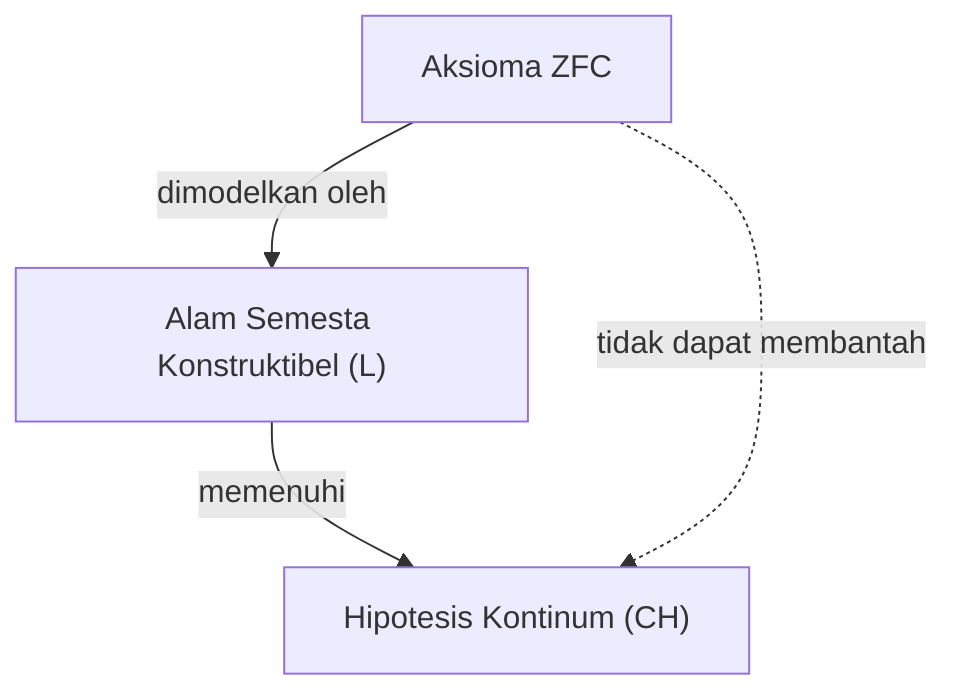
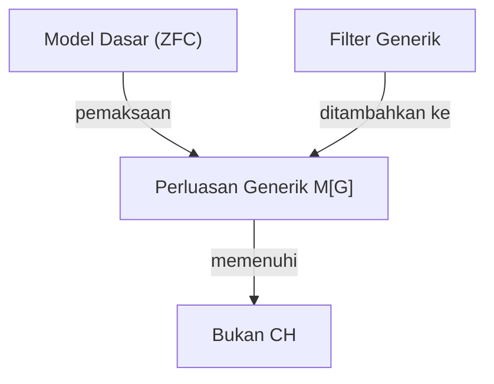

## 1. Pengantar: Mengukur Ukuran Ketakterhinggaan

Di dunia matematika, konsep "ketakterhinggaan" (infinitas) telah lama menjadi topik perdebatan filosofis. Namun, hingga munculnya [Georg Cantor](https://kenji.blog/id/p/cantor/) pada akhir abad ke-19, tidak ada metode matematis yang ketat untuk membandingkan ukuran ketakterhinggaan. Cantor mendirikan teori himpunan dan membuktikan bahwa ketakterhinggaan juga memiliki **ukuran yang berbeda** (kardinalitas).

Mempertimbangkan himpunan bilangan asli $\mathbb{N}$ dan himpunan bilangan real $\mathbb{R}$, melalui argumen diagonal Cantor, ditunjukkan bahwa himpunan bilangan real "benar-benar lebih besar" daripada himpunan bilangan asli. Kardinalitas bilangan asli dilambangkan dengan $\aleph_0$ (Aleph-nol), dan kardinalitas bilangan real dilambangkan dengan $\mathfrak{c}$ (kardinalitas kontinum) atau $2^{\aleph_0}$. Menurut Teorema Cantor, $\aleph_0 < 2^{\aleph_0}$.

Di sini, Cantor memiliki satu pertanyaan alami. "Apakah ada himpunan dengan kardinalitas yang terletak di **tengah-tengah** antara kardinalitas bilangan asli dan kardinalitas bilangan real?"
Ini adalah awal dari **Hipotesis Kontinum** ([Continuum Hypothesis](https://kenji.blog/id/p/continuum-hypothesis/), CH) yang kelak akan mengguncang dasar-dasar matematika.

## 2. Definisi Ketat Hipotesis Kontinum (CH)

Hipotesis Kontinum dirumuskan sebagai berikut.

> **Hipotesis Kontinum (CH)**
> Tidak ada himpunan yang kardinalitasnya lebih besar dari kardinalitas bilangan asli $\aleph_0$ dan lebih kecil dari kardinalitas bilangan real $2^{\aleph_0}$.
> Dengan kata lain, $\aleph_1 = 2^{\aleph_0}$.

Di sini, $\aleph_1$ merujuk pada kardinalitas tak terhingga terbesar berikutnya setelah $\aleph_0$. Jika CH bernilai benar, maka ukuran himpunan bilangan real adalah ketakterhinggaan terbesar berikutnya setelah himpunan bilangan asli.

### Representasi Rumus dengan KaTeX

Secara matematis, untuk sembarang himpunan tak terhingga $S$, kardinalitas dari himpunan kuasanya (power set) $\mathcal{P}(S)$ benar-benar lebih besar dari kardinalitas himpunan aslinya (Teorema Cantor).
$$ |S| < |\mathcal{P}(S)| $$
Oleh karena itu, untuk himpunan bilangan asli $\mathbb{N}$,
$$ |\mathbb{N}| < |\mathcal{P}(\mathbb{N})| = |\mathbb{R}| $$
berlaku. CH adalah klaim bahwa tidak ada kardinalitas lain di antara keduanya.

## 3. Penderitaan Cantor dan Pertanyaan [David Hilbert](https://kenji.blog/id/p/hilbert/)

Cantor menghabiskan seluruh hidupnya mencoba membuktikan hipotesis ini, namun tidak pernah berhasil. Kadang-kadang ia berpikir telah "membuktikannya", dan di lain waktu berpikir telah "membantahnya". Kondisi mentalnya sangat terkuras oleh masalah yang sulit ini.

Pada tahun 1900, di Kongres Matematikawan Internasional ke-2 yang diadakan di Paris, [David Hilbert](https://kenji.blog/id/p/hilbert/) mengajukan "23 Masalah [Hilbert](https://kenji.blog/id/p/hilbert/)" yang harus diselesaikan oleh matematika abad ke-20. **Masalah pertama** yang monumental tersebut tak lain adalah "Pembuktian Hipotesis Kontinum".

## 4. Aksiomatisasi Teori Himpunan: Sistem Aksioma ZFC

Untuk membuktikan Hipotesis Kontinum, pertama-tama perlu didefinisikan secara ketat apa itu "himpunan" dan operasi apa yang diperbolehkan. **Sistem Aksioma ZFC** (Teori Himpunan Zermelo-Fraenkel dengan Aksioma Pilihan), yang dikembangkan oleh Ernst Zermelo dan Adolf Fraenkel, telah menjadi dasar standar matematika modern.

Sistem Aksioma ZFC terdiri dari 9 aksioma (atau skema aksioma) berikut.
1. Aksioma Ekstensionalitas
2. Aksioma Himpunan Kosong
3. Aksioma Pasangan
4. Aksioma Gabungan
5. Aksioma Himpunan Kuasa
6. Skema Aksioma Penggantian
7. Aksioma Ketakterhinggaan
8. Aksioma Keteraturan
9. Aksioma Pilihan (Axiom of Choice)

Dengan menggunakan aksioma-aksioma ini, para matematikawan mencoba menentukan kebenaran CH.

## 5. [Kurt Gödel](https://kenji.blog/id/p/godel/) dan "Himpunan Konstruktibel"

Pada tahun 1940, [Kurt Gödel](https://kenji.blog/id/p/godel/) mengumumkan hasil yang mengejutkan. Ia membuktikan bahwa jika sistem aksioma ZFC diasumsikan konsisten, maka **"menambahkan CH ke sistem aksioma ZFC tidak akan menimbulkan kontradiksi."**

Gödel membangun sebuah model himpunan yang disebut **Alam Semesta Konstruktibel** (Constructible Universe, $L$). Di dalam $L$, semua himpunan dikonstruksi secara hierarkis oleh rumus-rumus logis. Gödel menunjukkan bahwa di dalam $L$ ini, semua aksioma ZFC terpenuhi, dan terlebih lagi **CH juga bernilai benar**.

Dengan ini, ditetapkan bahwa "mustahil untuk membantah CH dari sistem aksioma ZFC (CH konsisten secara relatif terhadap ZFC)".

## 6. Paul Cohen dan "Metode Pemaksaan"

Pada tahun 1963, lebih dari 20 tahun setelah hasil Gödel, Paul Cohen mengumumkan hasil yang lebih mengejutkan lagi. Ia menemukan metode matematika yang sama sekali baru yang disebut **Metode Pemaksaan** (Forcing) dan menunjukkan bahwa **"juga mustahil untuk membuktikan CH dari sistem aksioma ZFC."**

Cohen mengembangkan teknik untuk memperluas model baru dengan menambahkan himpunan baru (filter generik) dari luar ke suatu model yang memenuhi ZFC. Dengan menggunakan metode pemaksaan ini, ia membangun model di mana **"ZFC terpenuhi, tetapi CH bernilai salah (misalnya, kardinalitas bilangan real menjadi $\aleph_2$)"**.

## 7. Kesimpulan: "Independensi" yang Tidak Dapat Dibuktikan maupun Dibantah

Menggabungkan pencapaian Gödel dan Cohen, dipastikan bahwa Hipotesis Kontinum **tidak dapat dibuktikan maupun dibantah** dari sistem aksioma ZFC. Proposisi semacam ini disebut **independen** (Independent) dari sistem aksioma.

Hal ini memberikan kejutan yang tak terukur bagi dunia matematika. Apa sebenarnya kebenaran matematis itu? Sistem aksioma (ZFC) yang kita adopsi ternyata tidak lengkap untuk menentukan ukuran sebenarnya dari himpunan bilangan real (ini bisa dikatakan sebagai salah satu manifestasi dari [Teorema Ketidaklengkapan Gödel](https://kenji.blog/id/p/godels-incompleteness-theorems/)).

### Prospek Teori Himpunan Modern

Bahkan setelah diketahui bahwa Hipotesis Kontinum bersifat independen, para matematikawan tidak berhenti berpikir di situ. Saat ini, upaya untuk menentukan kebenaran Hipotesis Kontinum dengan menambahkan aksioma baru (seperti aksioma kardinal besar atau aksioma pemaksaan) ke ZFC terus berlanjut.

Sebagai contoh, dalam kerangka seperti logika-$\Omega$ melalui penelitian oleh W. Hugh Woodin dan lainnya, telah diusulkan pandangan bahwa dengan mengasumsikan jenis aksioma kuat tertentu, adalah lebih alami untuk menganggap CH sebagai "salah". Di sisi lain, dari perspektif yang berbeda ada juga pandangan yang menganggap bahwa diharapkan CH bernilai "benar", sehingga kesimpulan akhir belum tercapai.

## 8. Eksplorasi Latar Belakang Matematika yang Detail

Untuk memperdalam pemahaman tentang Hipotesis Kontinum, mari kita lihat lebih dekat konsep bilangan ordinal (Ordinal numbers) dan bilangan kardinal (Cardinal numbers).

### Bilangan Ordinal dan Himpunan Terurut Baik
Bilangan ordinal adalah konsep yang mengabstraksi "urutan" himpunan. Himpunan bilangan asli $\mathbb{N}$ diurutkan dengan relasi besar-kecil yang biasa. Tipe dari seluruh urutan ini disebut $\omega$ (omega). Setelah $\omega$ berlanjut tak terhingga sebagai $\omega+1, \omega+2, \dots$, dan berlanjut lagi sebagai $\omega+\omega, \omega \times \omega, \omega^{\omega}$. Semuanya ini dapat dihitung (kardinalitas yang sama dengan bilangan asli).

Jika kita mempertimbangkan himpunan dari semua bilangan ordinal yang dapat dihitung, itu sendiri menjadi himpunan terurut baik, dan tipe urutannya tidak lagi dapat dihitung. Ini disebut bilangan ordinal tak terhitung pertama, dilambangkan dengan $\omega_1$. Kardinalitas dari $\omega_1$ adalah $\aleph_1$.

### Bilangan Aleph (Aleph Numbers)
Cantor menamai kardinalitas tak terhingga dalam urutan menaik sebagai $\aleph_0, \aleph_1, \aleph_2, \dots$.
- $\aleph_0$ : Kardinalitas bilangan asli $\mathbb{N}$
- $\aleph_1$ : Kardinalitas $\omega_1$ (kardinalitas dari seluruh himpunan bilangan ordinal yang dapat dihitung)
- $\dots$

CH adalah klaim bahwa $2^{\aleph_0} = \aleph_1$. Jika CH salah, ada kemungkinan menjadi kardinalitas yang lebih besar, seperti $2^{\aleph_0} = \aleph_2$ atau $2^{\aleph_0} = \aleph_{\omega+1}$ (namun, ada batasan seperti $2^{\aleph_0} \neq \aleph_{\omega}$ menurut Teorema König).

### Mekanisme Metode Pemaksaan Cohen
Metode pemaksaan adalah teknik yang sangat sulit, tetapi gagasan intinya adalah sebagai berikut.
Untuk model dasar $M$, kita mempertimbangkan himpunan $P$ dari kondisi (Poset) yang mendekati bagian himpunan baru "sedikit demi sedikit". Temukan filter $G$ (disebut filter generik, sesuatu yang khusus dan tidak termasuk dalam $M$) yang mengumpulkan kondisi tak kontradiktif di dalam $P$, dan tambahkan $G$ ke $M$ untuk membuat model baru $M[G]$.

Cohen menyusun metode pemaksaan yang menambahkan sejumlah besar fungsi (sesuai dengan bilangan real) baru dari bilangan asli ke $\{0, 1\}$ (misalnya $\aleph_2$ buah). Akibatnya, jumlah bilangan real di dalam $M[G]$ menjadi $\aleph_2$ atau lebih, membuat CH bernilai salah.

## 9. Implikasi Filosofis

Independensi CH menimbulkan masalah mendalam pada filsafat matematika, yaitu "Platonisme" dan "Formalisme".
- **Pandangan Platonisme** : Dunia ide himpunan adalah tunggal, dan CH pasti memiliki nilai kebenaran objektif baik "benar" atau "salah". Alasan ZFC tidak dapat menentukannya adalah karena ZFC merupakan sistem aksioma yang tidak lengkap akibat keterbatasan kognisi manusia.
- **Pandangan Formalisme** : Matematika hanyalah permainan memanipulasi simbol mengikuti aturan logika dari aksioma. Sama seperti aksioma garis sejajar dalam geometri [Euclide](https://kenji.blog/id/p/euclid/)an, semesta matematika yang berbeda yaitu "teori himpunan di mana CH benar" dan "teori himpunan di mana CH salah" hanya eksis secara paralel.

## 10. Kesimpulan

Pencarian hierarki ketakterhinggaan yang diimpikan oleh [Georg Cantor](https://kenji.blog/id/p/cantor/) menemui akhir yang dramatis yaitu "tidak dapat dibuktikan maupun dibantah" oleh dua orang jenius, Gödel dan Cohen. Namun, itu sama sekali tidak berarti kekalahan matematika. Sebaliknya, hal itu menciptakan alat yang ampuh bernama metode pemaksaan, dan mengevolusikan bidang teori himpunan menjadi sesuatu yang lebih kaya dan kompleks dari sebelumnya.

Hipotesis Kontinum masih terus mengajukan pertanyaan mendasar kepada kita, "Apa itu ketakterhinggaan?" dan "Apa itu kebenaran matematis?".

## Tambahan: Pertimbangan Lebih Lanjut tentang Ketakterhinggaan

Eksplorasi ketakterhinggaan dalam matematika terus dilakukan secara aktif sejak Cantor hingga saat ini. Sejak pembuktian independensi Hipotesis Kontinum, kita telah belajar bahwa berbagai "alam semesta" dapat digambarkan dengan pemilihan sistem aksioma. Perdebatan apakah objek matematis benar-benar ada di dunia fisik atau hanya murni ciptaan pikiran manusia kini memasuki fase baru, bersilangan dengan penanganan ketakterhinggaan dalam teori informasi dan mekanika kuantum.
