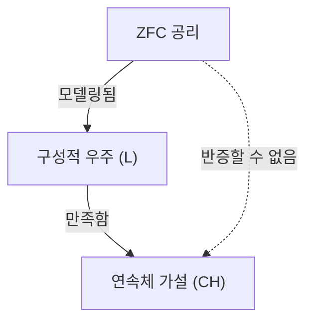

## 1. 도입: 무한의 크기를 측정하다

수학의 세계에서, '무한'이라는 개념은 예로부터 철학적인 논쟁의 대상이 되어 왔습니다. 하지만 19세기 말에 [게오르크 칸토어](https://kenji.blog/ko/p/cantor/)([Georg Cantor](https://kenji.blog/ko/p/cantor/))가 등장하기 전까지, 무한의 크기를 엄밀하게 비교하는 수학적인 방법은 존재하지 않았습니다. 칸토어는 집합론을 창시하고, 무한에도 **다른 크기** (농도, 기수)가 존재한다는 것을 증명했습니다.

자연수의 집합 $\mathbb{N}$ 과 실수의 집합 $\mathbb{R}$ 을 생각했을 때, 칸토어의 대각선 논법에 의해 실수의 집합이 자연수의 집합보다 '진정으로 크다'는 것이 나타났습니다. 자연수의 농도를 $\aleph_0$(알레프 제로), 실수의 농도를 $\mathfrak{c}$(연속체 농도) 또는 $2^{\aleph_0}$ 라고 표현합니다. 칸토어의 정리에 따르면, $\aleph_0 < 2^{\aleph_0}$ 입니다.

여기서 칸토어는 하나의 자연스러운 의문을 가졌습니다. "자연수의 농도와 실수의 농도의 **중간** 에 위치하는 농도를 가진 집합은 존재하는 것일까?"
이것이, 나중에 수학 기초론을 뒤흔들게 되는 **연속체 가설** ([Continuum Hypothesis](https://kenji.blog/ko/p/continuum-hypothesis/), CH)의 시작입니다.

## 2. 연속체 가설(CH)의 엄밀한 정의

연속체 가설은 다음과 같이 공식화됩니다.

> **연속체 가설 (CH)**
> 자연수의 농도 $\aleph_0$ 보다 크고, 실수의 농도 $2^{\aleph_0}$ 보다 작은 농도를 가진 집합은 존재하지 않는다.
> 즉, $\aleph_1 = 2^{\aleph_0}$ 이다.

여기서, $\aleph_1$ 은 $\aleph_0$ 의 다음에 큰 무한 농도를 가리킵니다. 만약 CH 가 참이라면, 실수의 집합의 크기는, 자연수의 집합 다음으로 큰 무한이라는 것이 됩니다.

### KaTeX 에 의한 수식의 표현

수학적으로, 임의의 무한 집합 $S$ 에 대해, 그 멱집합 $\mathcal{P}(S)$ 의 농도는 원래의 집합의 농도보다 진정으로 큽니다 (칸토어의 정리).
$$ |S| < |\mathcal{P}(S)| $$
따라서, 자연수의 집합 $\mathbb{N}$ 에 대해,
$$ |\mathbb{N}| < |\mathcal{P}(\mathbb{N})| = |\mathbb{R}| $$
가 성립합니다. CH 는, 이 사이에 다른 농도가 존재하지 않는다는 주장입니다.

## 3. 칸토어의 고뇌와 [다비트 힐베르트](https://kenji.blog/ko/p/hilbert/)의 제기

칸토어는 평생을 바쳐 이 가설을 증명하려고 시도했지만, 성공하지는 못했습니다. 때로는 '증명했다'고 착각하고, 또 어떤 때에는 '반증했다'고 착각하는 등, 그의 정신 상태는 이 난제로 인해 크게 깎여나갔습니다.

1900년, 파리에서 개최된 제2회 국제 수학자 회의에서, [다비트 힐베르트](https://kenji.blog/ko/p/hilbert/)([David Hilbert](https://kenji.blog/ko/p/hilbert/))는 20세기 수학이 해결해야 할 '힐베르트의 23가지 문제'를 제기했습니다. 그 기념비적인 **제1문제** 가, 바로 이 '연속체 가설의 증명'이었던 것입니다.

## 4. 집합론의 공리화: ZFC 공리계

연속체 가설을 증명하기 위해서는, 먼저 '집합'이란 무엇인지, 어떠한 조작이 허용되는지를 엄밀하게 정의할 필요가 있었습니다. 에른스트 체르멜로(Ernst Zermelo)와 아돌프 프렝켈(Adolf Fraenkel)에 의해 정비된 **ZFC 공리계** (선택 공리를 포함한 체르멜로-프렝켈 집합론)는, 현대 수학의 표준적인 기초가 되었습니다.

ZFC 공리계는 다음의 9가지 공리(또는 공리도식)로 구성됩니다.
1. 외연성 공리
2. 공집합의 공리
3. 짝 공리
4. 합집합의 공리
5. 멱집합 공리
6. 분류 공리도식(치환 공리)
7. 무한 공리
8. 정칙성 공리
9. 선택 공리 (Axiom of Choice)

이러한 공리들을 이용하여, 수학자들은 CH 의 참거짓을 판정하려고 시도했습니다.

## 5. [쿠르트 괴델](https://kenji.blog/ko/p/godel/)과 '구성적 집합'

1940년, [쿠르트 괴델](https://kenji.blog/ko/p/godel/)([Kurt Gödel](https://kenji.blog/ko/p/godel/))은 놀라운 결과를 발표했습니다. 그는, ZFC 공리계가 모순되지 않았다고 가정했을 경우, **"ZFC 공리계에 CH 를 덧붙여도 모순은 생기지 않는다"** 는 것을 증명한 것입니다.

괴델은 **구성적 우주** (Constructible Universe, $L$)라고 불리는 집합의 모델을 구축했습니다. $L$ 의 안에서는, 모든 집합이 논리식에 의해 계층적으로 구성됩니다. 괴델은, 이 $L$ 의 안에서는 ZFC 공리계가 모두 만족되고, 나아가 **CH 도 참이 된다** 는 것을 보여주었습니다.

이것에 의해, 'ZFC 공리계로부터 CH 를 반증하는 것은 불가능하다(CH 는 ZFC 와 상대적으로 무모순이다)'는 것이 확정되었습니다.



## 6. 폴 코언과 '강제법'

괴델의 결과로부터 20년 이상이 경과한 1963년, 폴 코언(Paul Cohen)은 더욱 놀라운 결과를 발표했습니다. 그는 **강제법** (Forcing)이라는 전혀 새로운 수학적 수법을 발명하고, **"ZFC 공리계로부터 CH 를 증명하는 것도 불가능하다"** 는 것을 보여주었습니다.

코언은, ZFC 를 만족하는 어떤 모델에, 외부로부터 새로운 집합(제네릭 필터)을 덧붙임으로써, 새로운 모델을 확장하는 수법을 개발했습니다. 그는 이 강제법을 이용하여, **"ZFC 는 만족하지만, CH 는 거짓이 되는 (예를 들어, 실수의 농도가 $\aleph_2$ 가 되는)"** 모델을 구축한 것입니다.

```mermaid
graph TD
    M["바탕 모델 (ZFC)"]
    G["제네릭 필터"]
    MG["제네릭 확장 M["G"]"]
    M -->|"강제법"| MG
    G -->|"에 추가됨"| MG
    MG -->|"만족함"| NOT_CH["CH 가 아님"]
```

## 7. 결론: 증명도 반증도 할 수 없는 '독립성'

괴델과 코언의 업적을 합치면, 연속체 가설은 ZFC 공리계로부터 **증명할 수도 반증할 수도 없다** 는 것이 확정되었습니다. 이와 같은 명제를, 공리계로부터 **독립** (Independent)이라고 말합니다.

이것은 수학계에 헤아릴 수 없는 충격을 주었습니다. 수학적 진리란 도대체 무엇인가? 우리가 채용하고 있는 공리계(ZFC)는, 실수의 집합의 진짜 크기를 결정하기에는 불완전했던 것입니다 ([괴델의 불완전성 정리](https://kenji.blog/ko/p/godels-incompleteness-theorems/)의 하나의 발현이라고도 말할 수 있습니다).

### 현대 집합론의 전망

연속체 가설이 독립이라는 것이 판명된 후에도, 수학자들은 거기서 사고를 멈추지 않았습니다. 오늘날에는, ZFC 에 새로운 공리(거대 기수 공리나 강제 공리 등)를 추가함으로써, 연속체 가설의 참거짓을 결정하려는 시도가 계속되고 있습니다.

예를 들어, 휴 우딘(W. Hugh Woodin) 등의 연구에 의한 $\Omega$-논리 등의 틀에서는, 어떤 종류의 강한 공리를 가정하면, CH 는 '거짓'이라고 하는 편이 자연스럽다는 시각도 제안되고 있습니다. 한편으로, 다른 시점에서는 CH 가 '참'인 것이 바람직하다고 하는 견해도 있어, 궁극적인 결론에는 이르지 못하고 있습니다.

## 8. 상세한 수학적 배경의 탐구

연속체 가설의 이해를 깊게 하기 위해, 서수(Ordinal numbers)와 기수(Cardinal numbers)의 개념을 자세히 살펴봅시다.

### 서수와 정렬 집합
서수는, 집합의 '나열되는 방식'을 추상화한 개념입니다. 자연수의 집합 $\mathbb{N}$ 은 통상적인 대소 관계로 정렬되어 있습니다. 이 전체의 나열되는 방식의 형을 $\omega$(오메가)라고 부릅니다. $\omega$ 의 다음에는 $\omega+1, \omega+2, \dots$ 라고 무한히 계속되고, 더 나아가 $\omega+\omega, \omega \times \omega, \omega^{\omega}$ 라고 계속됩니다. 이들은 모두 가산(자연수와 같은 농도)입니다.

모든 가산인 서수의 집합을 생각하면, 그것 자신도 정렬 집합이 되고, 그 순서형은 더 이상 가산이 아닙니다. 이것을 첫 번째 비가산 서수라고 부르고, $\omega_1$ 이라고 표현합니다. $\omega_1$ 의 농도가 $\aleph_1$ 입니다.

### 알레프 수(Aleph Numbers)
칸토어는, 무한 농도를 작은 순서대로 $\aleph_0, \aleph_1, \aleph_2, \dots$ 라고 이름 붙였습니다.
- $\aleph_0$ : 자연수 $\mathbb{N}$ 의 농도
- $\aleph_1$ : $\omega_1$ 의 농도 (가산 서수 전체 집합의 농도)
- $\dots$

CH 는, $2^{\aleph_0} = \aleph_1$ 이라는 주장입니다. 만약 CH 가 거짓이라면, $2^{\aleph_0} = \aleph_2$ 나 $2^{\aleph_0} = \aleph_{\omega+1}$ 등, 더 큰 농도가 될 가능성이 있습니다 (단, 쾨니그의 정리에 의해 $2^{\aleph_0} \neq \aleph_{\omega}$ 등의 제약은 있습니다).

### 코언의 강제법의 메커니즘
강제법은, 매우 난해한 기술이지만, 그 핵심적인 아이디어는 다음과 같은 것입니다.
기본이 되는 모델 $M$ 에 대해, 새로운 부분 집합을 '조금씩' 근사하는 것 같은 조건(Poset)의 집합 $P$ 를 생각합니다. $P$ 안에서 모순되지 않는 조건들을 모은 필터 $G$(제네릭 필터라고 불리는, $M$ 에는 속하지 않는 특별한 것)를 찾아내, $M$ 에 $G$ 를 첨가하여 새로운 모델 $M[G]$ 를 만듭니다.

코언은, 자연수에서 $\{0, 1\}$ 로의 함수(실수에 해당)를 새롭게 대량으로 (예를 들어 $\aleph_2$ 개) 덧붙이는 것 같은 강제법을 구성했습니다. 그 결과, $M[G]$ 안에서는 실수의 개수가 $\aleph_2$ 개 이상이 되어, CH 가 거짓이 되도록 한 것입니다.

## 9. 철학적인 함의

CH 의 독립성은, '플라톤주의'와 '형식주의'라는 수학의 철학에 깊은 문제를 던지고 있습니다.
- **플라톤주의적 견지** : 집합의 이데아 세계는 하나이며, CH 는 '참'이거나 '거짓' 중 어느 하나의 객관적인 진리값을 반드시 가진다. ZFC 가 그것을 결정할 수 없는 것은, ZFC 가 인간 인식의 한계에 의한 불완전한 공리계이기 때문이다.
- **형식주의적 견지** : 수학은 공리로부터 논리 규칙에 따라 기호를 조작하는 게임에 지나지 않는다. [유클리드](https://kenji.blog/ko/p/euclid/) 기하학에서의 평행선 공리와 같이, 'CH 가 참인 집합론'과 'CH 가 거짓인 집합론'이라는 다른 수학적 우주가 병행하여 존재할 뿐이다.

## 10. 요약

[게오르크 칸토어](https://kenji.blog/ko/p/cantor/)가 꿈꿨던 무한 계층의 탐구는, 괴델과 코언이라는 두 천재에 의해 '증명도 반증도 할 수 없다'는 극적인 결말로 끝을 맺었습니다. 하지만, 그것은 결코 수학의 패배를 의미하는 것이 아닙니다. 오히려, 강제법이라는 강력한 도구를 만들어내어, 집합론이라는 분야를 유례없이 풍요롭고 복잡한 것으로 진화시켰습니다.

연속체 가설은, 지금도 우리에게 '무한이란 무엇인가', '수학적 진리란 무엇인가'라는 근원적인 질문을 계속해서 던지고 있습니다.

## 보충: 무한에 관한 추가적인 고찰

수학에서의 무한의 탐구는, 칸토어 이후에도 현대에 이르기까지 활발하게 행해지고 있습니다. 연속체 가설의 독립성 증명 이후, 우리는 공리계의 선택에 의해 다양한 '우주'를 그려낼 수 있다는 것을 배웠습니다. 수학적 대상이 실제로 물리 세계에 존재하는 것인지, 아니면 인간 정신의 순수한 창조물인지에 대한 논의는, 정보 이론이나 양자 역학에서의 무한의 취급과도 교차하면서, 새로운 국면으로 돌입하고 있습니다.
