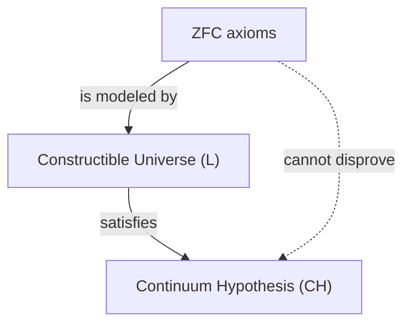
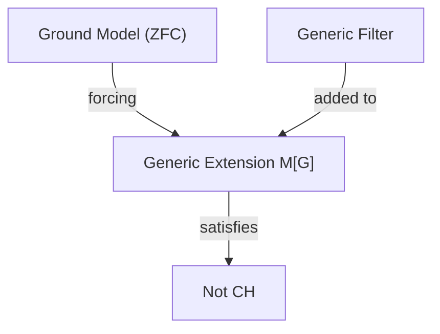

## 1. 導入：無限の大きさを測る

数学の世界において、「無限」という概念は古くから哲学的な議論の的となってきました。しかし、19世紀末にゲオルク・カントール（Georg Cantor）が登場するまで、無限の大きさを厳密に比較する数学的な手法は存在しませんでした。カントールは集合論を創始し、無限にも **異なる大きさ** （濃度、カージナリティ）が存在することを証明しました。

自然数の集合 $\mathbb{N}$ と実数の集合 $\mathbb{R}$ を考えたとき、カントールの対角線論法により、実数の集合の方が自然数の集合よりも「真に大きい」ことが示されました。自然数の濃度を $\aleph_0$（アレフ・ゼロ）、実数の濃度を $\mathfrak{c}$（連続体濃度）または $2^{\aleph_0}$ と表します。カントールの定理によれば、$\aleph_0 < 2^{\aleph_0}$ です。

ここでカントールは一つの自然な疑問を抱きました。「自然数の濃度と実数の濃度の **中間** に位置する濃度を持つ集合は存在するのだろうか？」
これが、後に数学基礎論を揺るがすことになる **連続体仮説** （Continuum Hypothesis, CH）の始まりです。

## 2. 連続体仮説（CH）の厳密な定義

連続体仮説は次のように定式化されます。

> **連続体仮説 (CH)**
> 自然数の濃度 $\aleph_0$ よりも大きく、実数の濃度 $2^{\aleph_0}$ よりも小さい濃度を持つ集合は存在しない。
> すなわち、$\aleph_1 = 2^{\aleph_0}$ である。

ここで、$\aleph_1$ は $\aleph_0$ の次に大きい無限濃度を指します。もし CH が真であれば、実数の集合の大きさは、自然数の集合の次に大きい無限ということになります。

### KaTeX による数式の表現

数学的には、任意の無限集合 $S$ に対して、その冪集合 $\mathcal{P}(S)$ の濃度は元の集合の濃度よりも真に大きくなります（カントールの定理）。
$$ |S| < |\mathcal{P}(S)| $$
したがって、自然数の集合 $\mathbb{N}$ に対して、
$$ |\mathbb{N}| < |\mathcal{P}(\mathbb{N})| = |\mathbb{R}| $$
が成り立ちます。CH は、この間に他の濃度が存在しないという主張です。

## 3. カントールの苦悩とダフィット・ヒルベルトの提起

カントールは生涯をかけてこの仮説を証明しようと試みましたが、成功することはありませんでした。時には「証明した」と思い込み、またある時には「反証した」と思い込むなど、彼の精神状態はこの難問によって大きく削られました。

1900年、パリで開催された第2回国際数学者会議において、ダフィット・ヒルベルト（David Hilbert）は20世紀の数学が解決すべき「ヒルベルトの23の問題」を提起しました。その記念すべき **第1問題** が、まさにこの「連続体仮説の証明」だったのです。

## 4. 集合論の公理化：ZFC公理系

連続体仮説を証明するためには、まず「集合」とは何か、どのような操作が許されるのかを厳密に定義する必要がありました。エルンスト・ツェルメロ（Ernst Zermelo）とアドルフ・フレンケル（Adolf Fraenkel）によって整備された **ZFC公理系** （選択公理を含むツェルメロ・フレンケル集合論）は、現代数学の標準的な基礎となっています。

ZFC公理系は以下の9つの公理（または公理図式）から構成されます。
1. 外延性の公理
2. 空集合の公理
3. 対の公理
4. 和集合の公理
5. 冪集合の公理
6. 分出公理（置換公理）
7. 無限公理
8. 正則性公理
9. 選択公理 (Axiom of Choice)

これらの公理を用いて、数学者たちは CH の真偽を判定しようと試みました。

## 5. クルト・ゲーデルと「構成的集合」

1940年、クルト・ゲーデル（Kurt Gödel）は驚くべき結果を発表しました。彼は、ZFC公理系が矛盾していないと仮定した場合、**「ZFC公理系に CH を付け加えても矛盾は生じない」** ことを証明したのです。

ゲーデルは **構成的宇宙** （Constructible Universe, $L$）と呼ばれる集合のモデルを構築しました。$L$ の中では、すべての集合が論理式によって階層的に構成されます。ゲーデルは、この $L$ の中では ZFC公理系がすべて満たされ、さらに **CH も真になる** ことを示しました。

これにより、「ZFC公理系から CH を反証することは不可能である（CH は ZFC と相対的無矛盾である）」ことが確定しました。

## 6. ポール・コーエンと「強制法」

ゲーデルの結果から20年以上が経過した1963年、ポール・コーエン（Paul Cohen）はさらに驚くべき結果を発表しました。彼は **強制法** （Forcing）という全く新しい数学的手法を発明し、**「ZFC公理系から CH を証明することも不可能である」** ことを示しました。

コーエンは、ZFCを満たすあるモデルに、外側から新しい集合（ジェネリックフィルター）を付け加えることで、新しいモデルを拡張する手法を開発しました。彼はこの強制法を用いて、**「ZFCは満たすが、CH は偽となる（例えば、実数の濃度が $\aleph_2$ になる）」** ようなモデルを構築したのです。

## 7. 結論：証明も反証もできない「独立性」

ゲーデルとコーエンの業績を合わせると、連続体仮説は ZFC公理系から **証明することも反証することもできない** ことが確定しました。このような命題を、公理系から **独立** （Independent）であると言います。

これは数学界に計り知れない衝撃を与えました。数学的真理とは一体何なのか？ 私たちの採用している公理系（ZFC）は、実数の集合の本当の大きさを決定するには不完全だったのです（ゲーデルの不完全性定理の一つの現れとも言えます）。

### 現代集合論の展望

連続体仮説が独立であることが判明した後も、数学者たちはそこで思考を止めることはありませんでした。今日では、ZFCに新たな公理（巨大基数公理や強制公理など）を追加することで、連続体仮説の真偽を決定しようとする試みが続けられています。

例えば、ヒュー・ウッディン（W. Hugh Woodin）らの研究による $\Omega$-論理などの枠組みでは、ある種の強い公理を仮定すると、CH は「偽」であるとする方が自然であるという見方も提案されています。一方で、別の視点からは CH が「真」であることが望ましいとする見解もあり、究極の結論には至っていません。

## 8. 詳細な数学的背景の探求

連続体仮説の理解を深めるために、順序数（Ordinal numbers）と基数（Cardinal numbers）の概念を詳しく見てみましょう。

### 順序数と整列集合
順序数は、集合の「並び方」を抽象化した概念です。自然数の集合 $\mathbb{N}$ は通常の大小関係で整列されています。この全体の並び方の型を $\omega$（オメガ）と呼びます。$\omega$ の次には $\omega+1, \omega+2, \dots$ と無限に続き、さらに $\omega+\omega, \omega \times \omega, \omega^{\omega}$ と続きます。これらはいずれも可算（自然数と同じ濃度）です。

すべての可算な順序数の集合を考えると、それ自身も整列集合となり、その順序型はもはや可算ではありません。これを最初の非可算順序数と呼び、$\omega_1$ と表します。$\omega_1$ の濃度が $\aleph_1$ です。

### アレフ数（Aleph Numbers）
カントールは、無限濃度を小さい順に $\aleph_0, \aleph_1, \aleph_2, \dots$ と名付けました。
- $\aleph_0$ : 自然数 $\mathbb{N}$ の濃度
- $\aleph_1$ : $\omega_1$ の濃度（可算順序数全体の集合の濃度）
- $\dots$

CH は、$2^{\aleph_0} = \aleph_1$ であるという主張です。もし CH が偽であれば、$2^{\aleph_0} = \aleph_2$ や $2^{\aleph_0} = \aleph_{\omega+1}$ など、より大きい濃度になる可能性があります（ただし、ケーニヒの定理により $2^{\aleph_0} \neq \aleph_{\omega}$ などの制約はあります）。

### コーエンの強制法の仕組み
強制法は、非常に難解な技術ですが、その核心的なアイデアは次のようなものです。
基本となるモデル $M$ に対して、新しい部分集合を「少しずつ」近似するような条件（Poset）の集合 $P$ を考えます。$P$ の中で矛盾しない条件を集めたフィルター $G$（ジェネリックフィルターと呼ばれる、$M$ には属さない特別なもの）を見つけ、$M$ に $G$ を添加して新しいモデル $M[G]$ を作ります。

コーエンは、自然数から $\{0, 1\}$ への関数（実数に相当）を新しく大量に（例えば $\aleph_2$ 個）付け加えるような強制法を構成しました。その結果、$M[G]$ の中では実数の数が $\aleph_2$ 個以上になり、CH が偽となるようにしたのです。

## 9. 哲学的な含意

CH の独立性は、「プラトニズム」と「形式主義」という数学の哲学に深い問題を投げかけています。
- **プラトニズム的見地** : 集合のイデア世界は一つであり、CH は「真」か「偽」のどちらかの客観的な真理値を必ず持つ。ZFCがそれを決定できないのは、ZFCが人間の認識の限界による不完全な公理系だからだ。
- **形式主義的見地** : 数学は公理から論理規則に従って記号を操作するゲームに過ぎない。ユークリッド幾何学における平行線公理のように、「CHが真である集合論」と「CHが偽である集合論」という異なる数学的宇宙が並行して存在するだけだ。

## 10. まとめ

ゲオルク・カントールが夢見た無限の階層の探求は、ゲーデルとコーエンという二人の天才によって「証明も反証もできない」という劇的な結末を迎えました。しかし、それは決して数学の敗北を意味するものではありません。むしろ、強制法という強力なツールを生み出し、集合論という分野をかつてないほど豊かで複雑なものへと進化させました。

連続体仮説は、今なお私たちに「無限とは何か」「数学的真理とは何か」という根源的な問いを投げかけ続けています。

## 補足：無限に関するさらなる考察

数学における無限の探求は、カントール以降も現代に至るまで活発に行われています。連続体仮説の独立性証明以降、我々は公理系の選択によって様々な「宇宙」を描き出せることを学びました。数学的対象が実際に物理世界に存在するのか、それとも人間の精神の純粋な創造物なのかという議論は、情報理論や量子力学における無限の扱いとも交差しながら、新たなフェーズに突入しています。