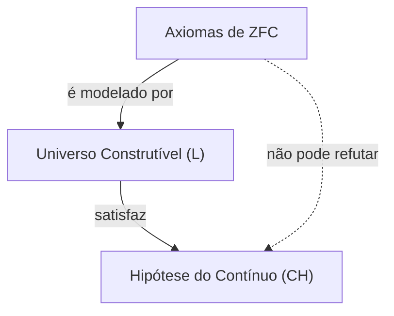

## 1. Introdução: Medindo o tamanho do infinito

No mundo da matemática, o conceito de "infinito" tem sido objeto de debate filosófico desde os tempos antigos. No entanto, até o final do século XIX, quando [Georg Cantor](https://kenji.blog/pt/p/cantor/) apareceu, não havia um método matemático rigoroso para comparar o tamanho do infinito. Cantor fundou a teoria dos conjuntos e provou que existem **tamanhos diferentes** (cardinalidade) mesmo no infinito.

Considerando o conjunto dos números naturais $\mathbb{N}$ e o conjunto dos números reais $\mathbb{R}$, o argumento da diagonalização de Cantor mostrou que o conjunto dos números reais é "verdadeiramente maior" que o conjunto dos números naturais. A cardinalidade dos números naturais é denotada como $\aleph_0$ (Aleph-zero) e a cardinalidade dos números reais como $\mathfrak{c}$ (cardinalidade do contínuo) ou $2^{\aleph_0}$. De acordo com o teorema de Cantor, $\aleph_0 < 2^{\aleph_0}$.

Neste ponto, Cantor teve uma pergunta natural: "Existe um conjunto cuja cardinalidade está localizada no **meio** entre a cardinalidade dos números naturais e a cardinalidade dos números reais?"
Este é o início da **Hipótese do Contínuo** ([Continuum Hypothesis](https://kenji.blog/pt/p/continuum-hypothesis/), CH), que mais tarde abalaria os fundamentos da matemática.

## 2. Definição rigorosa da Hipótese do Contínuo (CH)

A Hipótese do Contínuo é formulada da seguinte maneira:

> **Hipótese do Contínuo (CH)**
> Não existe nenhum conjunto com uma cardinalidade maior que a cardinalidade dos números naturais $\aleph_0$ e menor que a cardinalidade dos números reais $2^{\aleph_0}$.
> Ou seja, $\aleph_1 = 2^{\aleph_0}$.

Aqui, $\aleph_1$ refere-se à próxima maior cardinalidade infinita após $\aleph_0$. Se a CH for verdadeira, o tamanho do conjunto dos números reais é o próximo infinito maior depois do conjunto dos números naturais.

### Representação de fórmulas matemáticas usando KaTeX

Matematicamente, para qualquer conjunto infinito $S$, a cardinalidade de seu conjunto das partes $\mathcal{P}(S)$ é estritamente maior que a cardinalidade do conjunto original (Teorema de Cantor).
$$ |S| < |\mathcal{P}(S)| $$
Portanto, para o conjunto dos números naturais $\mathbb{N}$,
$$ |\mathbb{N}| < |\mathcal{P}(\mathbb{N})| = |\mathbb{R}| $$
é válido. A CH é a afirmação de que não existem outras cardinalidades entre essas duas.

## 3. O sofrimento de Cantor e a proposta de [David Hilbert](https://kenji.blog/pt/p/hilbert/)

Cantor passou toda a sua vida tentando provar essa hipótese, mas nunca obteve sucesso. Às vezes, ele acreditava ter "provado" e, outras vezes, acreditava ter "refutado"; seu estado mental foi muito desgastado por esse problema difícil.

Em 1900, no Segundo Congresso Internacional de Matemáticos, realizado em Paris, [David Hilbert](https://kenji.blog/pt/p/hilbert/) propôs os "23 Problemas de [Hilbert](https://kenji.blog/pt/p/hilbert/)" que a matemática do século XX deveria resolver. Aquele memorável **primeiro problema** era exatamente "A prova da Hipótese do Contínuo".

## 4. Axiomatização da Teoria dos Conjuntos: O Sistema de Axiomas ZFC

Para provar a hipótese do contínuo, primeiro era necessário definir rigorosamente o que é um "conjunto" e quais operações são permitidas. O **sistema de axiomas ZFC** (Teoria dos conjuntos de Zermelo-Fraenkel com o Axioma da Escolha), desenvolvido por Ernst Zermelo e Adolf Fraenkel, tornou-se o fundamento padrão da matemática moderna.

O sistema de axiomas ZFC consiste nos 9 axiomas (ou esquemas de axiomas) a seguir:
1. Axioma da extensão
2. Axioma do conjunto vazio
3. Axioma do par
4. Axioma da união
5. Axioma do conjunto das partes
6. Esquema de axiomas da separação
7. Axioma do infinito
8. Axioma da regularidade
9. Axioma da escolha (Axiom of Choice)

Usando esses axiomas, os matemáticos tentaram determinar a veracidade da CH.

## 5. [Kurt Gödel](https://kenji.blog/pt/p/godel/) e o "Universo Construtível"

Em 1940, [Kurt Gödel](https://kenji.blog/pt/p/godel/) publicou um resultado surpreendente. Ele provou que, se assumirmos que o sistema de axiomas ZFC não tem contradições, **"Adicionar a CH ao sistema de axiomas ZFC não produzirá uma contradição"**.

Gödel construiu um modelo de conjuntos chamado **Universo Construtível** (Constructible Universe, $L$). Dentro de $L$, todos os conjuntos são construídos hierarquicamente por fórmulas lógicas. Gödel mostrou que o sistema de axiomas ZFC é totalmente satisfeito dentro deste $L$ e, além disso, a **CH também é verdadeira**.

Isso estabeleceu que "É impossível refutar a CH a partir do sistema de axiomas ZFC (a CH é relativamente consistente com o ZFC)".



## 6. Paul Cohen e o "Forcing"

Em 1963, mais de 20 anos após os resultados de Gödel, Paul Cohen publicou um resultado ainda mais surpreendente. Ele inventou um método matemático completamente novo chamado **Forcing** e mostrou que **"Também é impossível provar a CH a partir do sistema de axiomas ZFC"**.

Cohen desenvolveu um método para estender um novo modelo adicionando um novo conjunto (filtro genérico) pelo lado de fora a um certo modelo que satisfaz ZFC. Usando este Forcing, ele construiu um modelo onde **"ZFC é satisfeito, mas a CH é falsa (por exemplo, a cardinalidade dos números reais torna-se $\aleph_2$)"**.

```mermaid
graph TD
    M["Modelo Base (ZFC)"]
    G["Filtro Genérico"]
    MG["Extensão Genérica M["G"]"]
    M -->|"forcing"| MG
    G -->|"adicionado a"| MG
    MG -->|"satisfaz"| NOT_CH["Não CH"]
```

## 7. Conclusão: "Independência" - Impossível de provar ou refutar

Combinando o trabalho de Gödel e Cohen, ficou estabelecido que a hipótese do contínuo **não pode ser provada nem refutada** a partir do sistema de axiomas ZFC. Diz-se que uma proposição como essa é **independente** (Independent) do sistema de axiomas.

Isso causou um impacto imensurável na comunidade matemática. O que é exatamente a verdade matemática? O sistema de axiomas que adotamos (ZFC) era incompleto para determinar o verdadeiro tamanho do conjunto dos números reais (também pode ser dito que é uma manifestação do teorema da incompletude de Gödel).

### Perspectivas da Teoria dos Conjuntos Moderna

Mesmo após descobrir que a hipótese do contínuo era independente, os matemáticos não pararam de pensar nisso. Hoje, tentativas continuam a ser feitas para determinar a veracidade da hipótese do contínuo adicionando novos axiomas (como axiomas de grandes cardinais e axiomas de forcing) ao ZFC.

Por exemplo, no framework como a $\Omega$-lógica de pesquisadores como W. Hugh Woodin e outros, foi proposto que, se assumirmos certos axiomas fortes, é mais natural considerar a CH "falsa". Por outro lado, a partir de outra perspectiva, existe também a opinião de que é desejável que a CH seja "verdadeira", e nenhuma conclusão final foi alcançada.

## 8. Exploração detalhada do contexto matemático

Para aprofundar nossa compreensão da hipótese do contínuo, vamos dar uma olhada mais de perto nos conceitos de números ordinais (Ordinal numbers) e números cardinais (Cardinal numbers).

### Números ordinais e conjuntos bem ordenados
Os números ordinais são conceitos que abstraem a "ordem" dos conjuntos. O conjunto dos números naturais $\mathbb{N}$ é bem ordenado pela relação de ordem de grandeza usual. Esse tipo geral de ordem é chamado de $\omega$ (ômega). Depois de $\omega$, continua infinitamente com $\omega+1, \omega+2, \dots$ e, além disso, continua com $\omega+\omega, \omega \times \omega, \omega^{\omega}$. Todos estes são enumeráveis (da mesma cardinalidade que os números naturais).

Considerando o conjunto de todos os números ordinais enumeráveis, ele próprio se torna um conjunto bem ordenado e seu tipo de ordem não é mais enumerável. Este é chamado de primeiro número ordinal não enumerável e denotado por $\omega_1$. A cardinalidade de $\omega_1$ é $\aleph_1$.

### Números de Aleph (Aleph Numbers)
Cantor nomeou as cardinalidades infinitas em ordem crescente como $\aleph_0, \aleph_1, \aleph_2, \dots$
- $\aleph_0$ : Cardinalidade dos números naturais $\mathbb{N}$
- $\aleph_1$ : Cardinalidade de $\omega_1$ (cardinalidade do conjunto de todos os números ordinais enumeráveis)
- $\dots$

A CH é a afirmação de que $2^{\aleph_0} = \aleph_1$. Se a CH for falsa, ela pode se tornar uma cardinalidade maior, como $2^{\aleph_0} = \aleph_2$ ou $2^{\aleph_0} = \aleph_{\omega+1}$ (no entanto, de acordo com o Teorema de König, existem restrições como $2^{\aleph_0} \neq \aleph_{\omega}$).

### O mecanismo do Forcing de Cohen
O Forcing é uma técnica muito difícil, mas sua ideia central é a seguinte.
Para um modelo básico $M$, considere um conjunto de condições (Poset) $P$ que se aproxima de um novo subconjunto "pouco a pouco". Encontre um filtro $G$ (chamado de filtro genérico, uma coisa especial que não pertence a $M$) que coleta condições não contraditórias dentro de $P$ e crie um novo modelo $M[G]$ adicionando $G$ a $M$.

Cohen construiu um forcing que adiciona um grande número (por exemplo, $\aleph_2$) de funções dos números naturais para $\{0, 1\}$ (correspondente a números reais). Como resultado, o número de números reais dentro de $M[G]$ tornou-se $\aleph_2$ ou mais, tornando a CH falsa.

## 9. Implicações filosóficas

A independência da CH levanta problemas profundos para a filosofia da matemática, a saber, o "Platonismo" e o "Formalismo".
- **Visão platônica** : Existe apenas um mundo de Ideias para conjuntos, e a CH deve ter um valor de verdade objetivo de "verdadeiro" ou "falso". O ZFC não pode determiná-lo porque o ZFC é um sistema axiomático incompleto devido às limitações da cognição humana.
- **Visão formalista** : A matemática é apenas um jogo de manipulação de símbolos de acordo com as regras lógicas a partir de axiomas. Assim como o axioma das paralelas na geometria euclidiana, universos matemáticos diferentes, a "teoria dos conjuntos onde a CH é verdadeira" e a "teoria dos conjuntos onde a CH é falsa", apenas existem em paralelo.

## 10. Conclusão

A busca de [Georg Cantor](https://kenji.blog/pt/p/cantor/) pela hierarquia do infinito teve um final dramático de ser "impossível de provar ou refutar" por dois gênios, Gödel e Cohen. No entanto, isso não significa uma derrota da matemática. Pelo contrário, criou a poderosa ferramenta do forcing e desenvolveu o campo da teoria dos conjuntos para torná-lo mais rico e complexo do que nunca.

A hipótese do contínuo continua a nos fazer perguntas fundamentais: "O que é o infinito?" e "O que é a verdade matemática?".

## Apêndice: Mais considerações sobre o infinito

A exploração do infinito na matemática continuou ativamente desde Cantor até os dias atuais. Após a prova da independência da hipótese do contínuo, aprendemos que podemos extrair vários "universos" através da escolha de sistemas de axiomas. O debate sobre se os objetos matemáticos realmente existem no mundo físico ou são meras criações da mente humana entrou em uma nova fase, cruzando-se com o tratamento do infinito na teoria da informação e na mecânica quântica.
