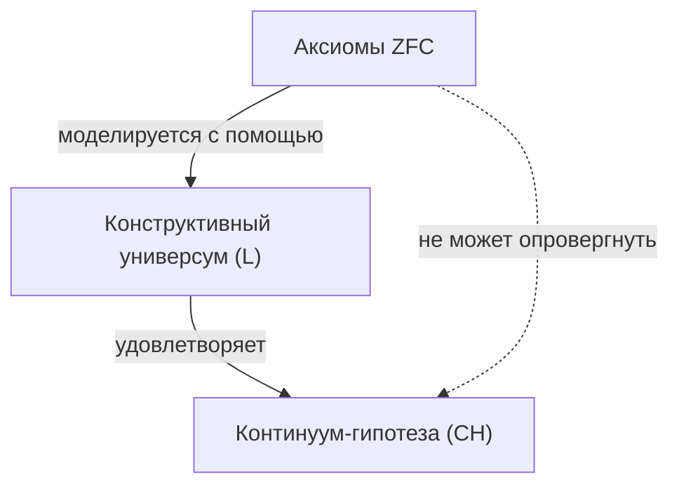

## 1. Введение: Измерение размера бесконечности

В мире математики понятие «бесконечности» издавна было предметом философских дискуссий. Однако до появления Георга Кантора ([Georg Cantor](https://kenji.blog/ru/p/cantor/)) в конце 19-го века не существовало строгих математических методов для сравнения размеров бесконечности. Кантор основал теорию множеств и доказал, что бесконечности также существуют **разного размера** (мощности, кардинальности).

Рассматривая множество натуральных чисел $\mathbb{N}$ и множество вещественных чисел $\mathbb{R}$, диагональный аргумент Кантора показал, что множество вещественных чисел «строго больше» множества натуральных чисел. Мощность натуральных чисел обозначается как $\aleph_0$ (алеф-нуль), а мощность вещественных чисел как $\mathfrak{c}$ (мощность континуума) или $2^{\aleph_0}$. Согласно теореме Кантора, $\aleph_0 < 2^{\aleph_0}$.

Здесь у Кантора возник один естественный вопрос: «Существует ли множество, мощность которого находится **посередине** между мощностью натуральных чисел и мощностью вещественных чисел?»
Это было началом **Континуум-гипотезы** ([Continuum Hypothesis](https://kenji.blog/ru/p/continuum-hypothesis/), CH), которая позже потрясла основы математики.

## 2. Строгое определение континуум-гипотезы (CH)

Континуум-гипотеза формулируется следующим образом:

> **Континуум-гипотеза (CH)**
> Не существует множества, мощность которого больше мощности натуральных чисел $\aleph_0$ и меньше мощности вещественных чисел $2^{\aleph_0}$.
> То есть, $\aleph_1 = 2^{\aleph_0}$.

Здесь $\aleph_1$ обозначает следующую по величине бесконечную мощность после $\aleph_0$. Если CH истинна, размер множества вещественных чисел является следующей бесконечностью после множества натуральных чисел.

### Выражение формул с помощью KaTeX

Математически, для любого бесконечного множества $S$ мощность его булеана (множества всех подмножеств) $\mathcal{P}(S)$ строго больше мощности исходного множества (теорема Кантора).
$$ |S| < |\mathcal{P}(S)| $$
Следовательно, для множества натуральных чисел $\mathbb{N}$ выполняется:
$$ |\mathbb{N}| < |\mathcal{P}(\mathbb{N})| = |\mathbb{R}| $$
CH — это утверждение о том, что между ними не существует другой мощности.

## 3. Страдания Кантора и вызов Давида Гильберта

Кантор потратил всю свою жизнь, пытаясь доказать эту гипотезу, но так и не преуспел. Иногда он думал, что «доказал» её, а иногда — что «опроверг», и его психическое состояние сильно пострадало от этой сложной задачи.

В 1900 году на Втором Международном конгрессе математиков в Париже [Давид Гильберт](https://kenji.blog/ru/p/hilbert/) ([David Hilbert](https://kenji.blog/ru/p/hilbert/)) предложил «23 проблемы Гильберта», которые математика 20-го века должна была решить. Этим памятным **первым вопросом** было именно «доказательство континуум-гипотезы».

## 4. Аксиоматизация теории множеств: система аксиом ZFC

Чтобы доказать континуум-гипотезу, сначала необходимо было строго определить, что такое «множество» и какие операции над ним допустимы. **Система аксиом ZFC** (теория множеств Цермело — Френкеля с аксиомой выбора), разработанная Эрнстом Цермело (Ernst Zermelo) и Адольфом Френкелем (Adolf Fraenkel), стала стандартной основой современной математики.

Система аксиом ZFC состоит из следующих 9 аксиом (или схем аксиом):
1. Аксиома объемности (экстенсиональности)
2. Аксиома пустого множества
3. Аксиома пары
4. Аксиома объединения
5. Аксиома степени (булеана)
6. Схема аксиом выделения (или подстановки)
7. Аксиома бесконечности
8. Аксиома регулярности (основания)
9. Аксиома выбора (Axiom of Choice)

Используя эти аксиомы, математики пытались определить истинность или ложность CH.

## 5. [Курт Гёдель](https://kenji.blog/ru/p/godel/) и «конструктивные множества»

В 1940 году [Курт Гёдель](https://kenji.blog/ru/p/godel/) ([Kurt Gödel](https://kenji.blog/ru/p/godel/)) опубликовал удивительный результат. Он доказал, что если предположить, что система аксиом ZFC непротиворечива, то **«добавление CH к системе аксиом ZFC не вызовет противоречия»**.

Гёдель построил модель множеств, называемую **конструктивным универсумом** (Constructible Universe, $L$). Внутри $L$ все множества строятся иерархически с помощью логических формул. Гёдель показал, что в этом $L$ выполняются все аксиомы ZFC, и кроме того, **CH также становится истинной**.

Тем самым было установлено, что «невозможно опровергнуть CH из системы аксиом ZFC (CH относительно непротиворечива с ZFC)».



## 6. Пол Коэн и «метод форсинга»

В 1963 году, спустя более 20 лет после результатов Гёделя, Пол Коэн (Paul Cohen) опубликовал еще более поразительный результат. Он изобрел совершенно новый математический метод под названием **метод форсинга** (Forcing), и показал, что **«доказать CH из системы аксиом ZFC также невозможно»**.

Коэн разработал метод расширения модели, удовлетворяющей ZFC, путем добавления снаружи нового множества (генерического фильтра). Используя этот метод форсинга, он построил модель, в которой **«ZFC выполняется, но CH ложна (например, мощность вещественных чисел становится $\aleph_2$)»**.

```mermaid
graph TD
    M["Основная модель (ZFC)"]
    G["Генерический фильтр"]
    MG["Генерическое расширение M["G"]"]
    M -->|"форсинг"| MG
    G -->|"добавляется к"| MG
    MG -->|"удовлетворяет"| NOT_CH["Не CH"]
```

## 7. Заключение: «Независимость», которую невозможно ни доказать, ни опровергнуть

Объединив достижения Гёделя и Коэна, было установлено, что континуум-гипотезу **невозможно ни доказать, ни опровергнуть** из системы аксиом ZFC. Такие утверждения называются **независимыми** (Independent) от системы аксиом.

Это вызвало неизмеримый шок в математическом мире. Что же такое математическая истина? Наша принятая система аксиом (ZFC) оказалась неполной для определения истинного размера множества вещественных чисел (это можно назвать одним из проявлений теорем Гёделя о неполноте).

### Перспективы современной теории множеств

Даже после того, как было доказано, что континуум-гипотеза независима, математики не остановили свои размышления на этом. Сегодня продолжаются попытки определить истинность континуум-гипотезы путем добавления новых аксиом к ZFC (таких как аксиомы больших кардиналов и аксиомы форсинга).

Например, в рамках таких концепций, как $\Omega$-логика, исследованных Хью Вудином (W. Hugh Woodin) и другими, предполагается, что если принять определенные сильные аксиомы, более естественно считать, что CH — «ложна». С другой стороны, есть мнения, утверждающие, что предпочтительнее, чтобы CH была «истинной», и окончательный вывод еще не достигнут.

## 8. Детальное изучение математического контекста

Чтобы углубить понимание континуум-гипотезы, давайте подробнее рассмотрим концепции порядковых чисел (Ordinal numbers) и кардинальных чисел (Cardinal numbers).

### Порядковые числа и вполне упорядоченные множества
Порядковые числа — это концепция, абстрагирующая «порядок элементов» множества. Множество натуральных чисел $\mathbb{N}$ упорядочено обычным отношением величины. Этот общий тип порядка называется $\omega$ (омега). За $\omega$ бесконечно следуют $\omega+1, \omega+2, \dots$, а затем $\omega+\omega, \omega \times \omega, \omega^{\omega}$. Все они счетны (имеют ту же мощность, что и натуральные числа).

Если рассмотреть множество всех счетных порядковых чисел, оно само становится вполне упорядоченным множеством, и его тип порядка уже не является счетным. Это называется первым несчетным порядковым числом и обозначается как $\omega_1$. Мощность $\omega_1$ равна $\aleph_1$.

### Числа Алеф (Aleph Numbers)
Кантор назвал бесконечные мощности в порядке возрастания $\aleph_0, \aleph_1, \aleph_2, \dots$.
- $\aleph_0$ : Мощность натуральных чисел $\mathbb{N}$
- $\aleph_1$ : Мощность $\omega_1$ (мощность множества всех счетных порядковых чисел)
- $\dots$

CH утверждает, что $2^{\aleph_0} = \aleph_1$. Если CH ложна, есть вероятность, что мощность будет больше, например, $2^{\aleph_0} = \aleph_2$ или $2^{\aleph_0} = \aleph_{\omega+1}$ (однако есть ограничения, такие как $2^{\aleph_0} \neq \aleph_{\omega}$ по теореме Кёнига).

### Как работает метод форсинга Коэна
Метод форсинга — чрезвычайно сложная техника, но ее основная идея заключается в следующем.
Для базовой модели $M$ мы рассматриваем множество условий (Посет) $P$, которое «понемногу» аппроксимирует новое подмножество. В $P$ мы находим фильтр $G$, содержащий непротиворечивые условия (называемый генерическим фильтром, особая вещь, не принадлежащая $M$), и добавляем $G$ к $M$, чтобы создать новую модель $M[G]$.

Коэн построил метод форсинга, который добавляет огромное количество (например, $\aleph_2$) новых функций из натуральных чисел в $\{0, 1\}$ (соответствующих вещественным числам). В результате количество вещественных чисел в $M[G]$ стало $\aleph_2$ или больше, что сделало CH ложной.

## 9. Философские следствия

Независимость CH поднимает глубокие вопросы для философии математики, касающиеся «платонизма» и «формализма».
- **Платонистическая точка зрения** : Мир идей множеств един, и CH должна иметь объективное значение истинности, либо «истинна», либо «ложна». ZFC не может определить это потому, что ZFC — это неполная система аксиом, обусловленная ограничениями человеческого познания.
- **Формалистическая точка зрения** : Математика — это просто игра манипулирования символами в соответствии с логическими правилами, исходящими из аксиом. Подобно аксиоме параллельных прямых в евклидовой геометрии, просто параллельно существуют разные математические вселенные: «теория множеств, в которой CH истинна» и «теория множеств, в которой CH ложна».

## 10. Заключение

Исследование иерархии бесконечностей, о которой мечтал [Георг Кантор](https://kenji.blog/ru/p/cantor/), достигло драматического конца: «невозможно ни доказать, ни опровергнуть» благодаря двум гениям — Гёделю и Коэну. Однако это ни в коем случае не означает поражения математики. Напротив, это привело к созданию мощного инструмента — метода форсинга, и развитию области теории множеств в нечто более богатое и сложное, чем когда-либо прежде.

Континуум-гипотеза по-прежнему продолжает задавать нам фундаментальные вопросы: «Что такое бесконечность?» и «Что такое математическая истина?».

## Дополнение: Дальнейшие размышления о бесконечности

Исследование бесконечности в математике активно продолжается со времен Кантора до наших дней. После доказательства независимости континуум-гипотезы мы узнали, что выбор системы аксиом позволяет нам нарисовать различные «вселенные». Дискуссия о том, существуют ли математические объекты в физическом мире или являются чистым творением человеческого разума, пересекается с обращением с бесконечностью в теории информации и квантовой механике, переходя в новую фазу.
