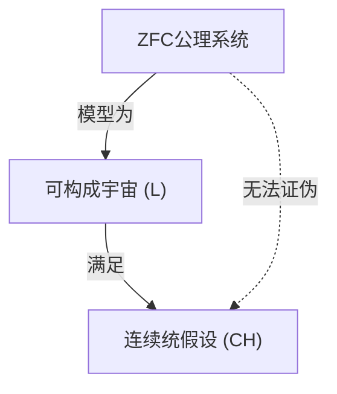

## 1. 引入：测量无穷的大小

在数学的世界中，“无穷”的概念自古以来就是哲学讨论的焦点。然而，直到19世纪末[格奥尔格·康托尔](https://kenji.blog/zh-cn/p/cantor/)（[Georg Cantor](https://kenji.blog/zh-cn/p/cantor/)）登场为止，并不存在严格比较无穷大小的数学方法。康托尔创立了集合论，证明了无穷也存在 **不同的大小** （基数、势）。

考虑自然数集合 $\mathbb{N}$ 和实数集合 $\mathbb{R}$，根据康托尔的对角线论证，证明了实数集合比自然数集合“真正更大”。自然数的基数记为 $\aleph_0$（阿列夫零），实数的基数记为 $\mathfrak{c}$（连续统基数）或 $2^{\aleph_0}$。根据康托尔定理，$\aleph_0 < 2^{\aleph_0}$。

此时康托尔产生了一个自然的问题：“是否存在一个集合，其基数位于自然数基数和实数基数的 **中间** ？”
这就是后来震撼数学基础论的 **连续统假设** （[Continuum Hypothesis](https://kenji.blog/zh-cn/p/continuum-hypothesis/), CH）的开端。

## 2. 连续统假设（CH）的严格定义

连续统假设的表述如下：

> **连续统假设 (CH)**
> 不存在一个集合，其基数大于自然数的基数 $\aleph_0$ 且小于实数的基数 $2^{\aleph_0}$。
> 即，$\aleph_1 = 2^{\aleph_0}$。

这里，$\aleph_1$ 指的是仅次于 $\aleph_0$ 的下一个无穷基数。如果 CH 为真，那么实数集合的大小就是自然数集合之后的下一个无穷。

### KaTeX 的数学公式表示

在数学上，对于任意无穷集合 $S$，其幂集 $\mathcal{P}(S)$ 的基数严格大于原集合的基数（康托尔定理）。
$$ |S| < |\mathcal{P}(S)| $$
因此，对于自然数集合 $\mathbb{N}$，
$$ |\mathbb{N}| < |\mathcal{P}(\mathbb{N})| = |\mathbb{R}| $$
成立。CH 就是主张在这之间不存在其他基数。

## 3. 康托尔的苦恼与[大卫·希尔伯特](https://kenji.blog/zh-cn/p/hilbert/)的提出

康托尔终其一生试图证明这个假设，但未能成功。有时他以为自己“证明了”，有时又以为自己“证伪了”，他的精神状态被这一难题极大地消耗。

1900年，在巴黎举行的第二届国际数学家大会上，[大卫·希尔伯特](https://kenji.blog/zh-cn/p/hilbert/)（[David Hilbert](https://kenji.blog/zh-cn/p/hilbert/)）提出了20世纪数学需要解决的“希尔伯特的23个问题”。其中具有纪念意义的 **第1个问题** ，正是这个“连续统假设的证明”。

## 4. 集合论的公理化：ZFC公理系统

为了证明连续统假设，首先需要严格定义什么是“集合”以及允许进行哪些操作。由恩斯特·策梅洛（Ernst Zermelo）和亚伯拉罕·弗兰克尔（Adolf Fraenkel）整理的 **ZFC公理系统** （包含选择公理的策梅洛-弗兰克尔集合论），成为了现代数学的标准基础。

ZFC公理系统由以下9个公理（或公理模式）组成：
1. 外延公理
2. 空集公理
3. 配对公理
4. 并集公理
5. 幂集公理
6. 分离公理（替换公理）
7. 无穷公理
8. 正则公理
9. 选择公理 (Axiom of Choice)

利用这些公理，数学家们试图判定 CH 的真伪。

## 5. [库尔特·哥德尔](https://kenji.blog/zh-cn/p/godel/)与“可构成集”

1940年，[库尔特·哥德尔](https://kenji.blog/zh-cn/p/godel/)（[Kurt Gödel](https://kenji.blog/zh-cn/p/godel/)）发表了惊人的结果。他证明了，在假设ZFC公理系统不矛盾的情况下，**“在ZFC公理系统中加入 CH 也不会产生矛盾”** 。

哥德尔构建了一个被称为 **可构成宇宙** （Constructible Universe, $L$）的集合模型。在 $L$ 中，所有的集合都由逻辑公式分层构成。哥德尔证明了，在这个 $L$ 中，ZFC公理系统全部被满足，并且 **CH 也为真** 。

由此确定了，“从ZFC公理系统中证伪 CH 是不可能的（CH 与 ZFC 是相对无矛盾的）”。



## 6. 保罗·科恩与“力迫法”

在哥德尔的结果发表20多年后的1963年，保罗·科恩（Paul Cohen）发表了更令人震惊的结果。他发明了一种被称为 **力迫法** （Forcing）的全新数学方法，证明了 **“从ZFC公理系统中证明 CH 也是不可能的”** 。

科恩开发了一种方法，通过从外部向满足ZFC的某个模型中添加新集合（泛型滤子），来扩展出新的模型。他利用这种力迫法，构建了一个 **“满足ZFC，但 CH 为假（例如，实数的基数变为 $\aleph_2$）”** 的模型。

```mermaid
graph TD
    M["基模型 (ZFC)"]
    G["泛型滤子"]
    MG["泛型扩张 M["G"]"]
    M -->|"力迫"| MG
    G -->|"添加到"| MG
    MG -->|"满足"| NOT_CH["非 CH"]
```

## 7. 结论：无法证明也无法证伪的“独立性”

结合哥德尔和科恩的成就，确定了连续统假设在ZFC公理系统中是 **既不能证明也不能证伪** 的。这样的命题被称为独立于公理系统（Independent）。

这给数学界带来了不可估量的冲击。数学真理到底是什么？我们所采用的公理系统（ZFC）在决定实数集合的真实大小方面是不完备的（这也可以说是[哥德尔不完备定理](https://kenji.blog/zh-cn/p/godels-incompleteness-theorems/)的一种体现）。

### 现代集合论的展望

在连续统假设被证明为独立之后，数学家们并没有停止思考。今天，人们仍在继续尝试通过向ZFC添加新的公理（如大基数公理或力迫公理等）来决定连续统假设的真伪。

例如，通过休·伍丁（W. Hugh Woodin）等人的研究，在 $\Omega$-逻辑等框架下，有观点提出假设某种强公理时，认为 CH 为“假”是更自然的。另一方面，从其他视角来看，也有观点认为 CH 为“真”更为理想，目前尚未得出最终结论。

## 8. 深入探索数学背景

为了加深对连续统假设的理解，让我们详细看看序数（Ordinal numbers）和基数（Cardinal numbers）的概念。

### 序数与良序集
序数是抽象化集合“排列方式”的概念。自然数集合 $\mathbb{N}$ 按照通常的大小关系是良序的。这种整体排列方式的类型被称为 $\omega$（欧米伽）。在 $\omega$ 之后，$\omega+1, \omega+2, \dots$ 无限延续，接着是 $\omega+\omega, \omega \times \omega, \omega^{\omega}$ 等等。这些全都是可数的（与自然数基数相同）。

考虑所有可数序数的集合，它本身也是一个良序集，其序型不再是可数的。这被称为第一个不可数序数，记为 $\omega_1$。$\omega_1$ 的基数就是 $\aleph_1$。

### 阿列夫数（Aleph Numbers）
康托尔将无穷基数从小到大命名为 $\aleph_0, \aleph_1, \aleph_2, \dots$。
- $\aleph_0$ : 自然数 $\mathbb{N}$ 的基数
- $\aleph_1$ : $\omega_1$ 的基数（全体可数序数集合的基数）
- $\dots$

CH 的主张是 $2^{\aleph_0} = \aleph_1$。如果 CH 为假，那么可能会有 $2^{\aleph_0} = \aleph_2$ 或 $2^{\aleph_0} = \aleph_{\omega+1}$ 等更大的基数（不过，根据柯尼希定理，存在 $2^{\aleph_0} \neq \aleph_{\omega}$ 这样的限制）。

### 科恩力迫法的机制
力迫法是一项非常艰深的技术，但其核心思想如下。
对于基础模型 $M$，考虑一个条件（Poset）的集合 $P$，它“一点一点”地近似新的子集。在 $P$ 中找到一个收集了不矛盾条件的滤子 $G$（被称为泛型滤子，是不属于 $M$ 的特殊存在），将 $G$ 添加到 $M$ 中，形成新的模型 $M[G]$。

科恩构造了一种力迫法，可以新加入大量（例如 $\aleph_2$ 个）从自然数到 $\{0, 1\}$ 的函数（相当于实数）。结果，在 $M[G]$ 中实数的数量达到了 $\aleph_2$ 个以上，从而使 CH 为假。

## 9. 哲学含义

CH 的独立性给“柏拉图主义”和“形式主义”这两种数学哲学提出了深刻的问题。
- **柏拉图主义观点** : 集合的理念世界是唯一的，CH 必然具有“真”或“假”的客观真值。ZFC无法决定它，是因为ZFC受限于人类认知的局限，是一个不完备的公理系统。
- **形式主义观点** : 数学不过是根据逻辑规则从公理操作符号的游戏。就像[欧几里得](https://kenji.blog/zh-cn/p/euclid/)几何中的平行公理一样，“CH为真的集合论”和“CH为假的集合论”作为不同的数学宇宙平行存在而已。

## 10. 总结

[格奥尔格·康托尔](https://kenji.blog/zh-cn/p/cantor/)梦想探索无穷阶层的尝试，由哥德尔和科恩这两位天才画上了“无法证明也无法证伪”的戏剧性句号。但这绝不意味着数学的失败。相反，它催生了力迫法这一强大的工具，使集合论这一领域发展得比以往任何时候都更加丰富和复杂。

连续统假设至今仍在不断地向我们提出“无穷是什么”、“数学真理是什么”等根本性的问题。

## 补充：关于无穷的进一步思考

数学中对无穷的探索，从康托尔之后一直活跃到现代。自从连续统假设独立性被证明以来，我们了解到，通过选择不同的公理系统，可以描绘出各种各样的“宇宙”。关于数学对象到底是真实存在于物理世界中，还是纯粹是人类精神的创造物这一讨论，正与信息论和量子力学中对无穷的处理相交织，进入了一个新的阶段。
