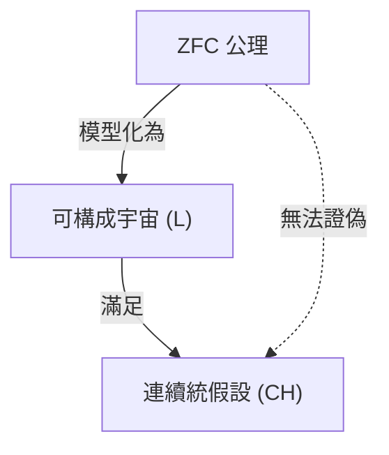
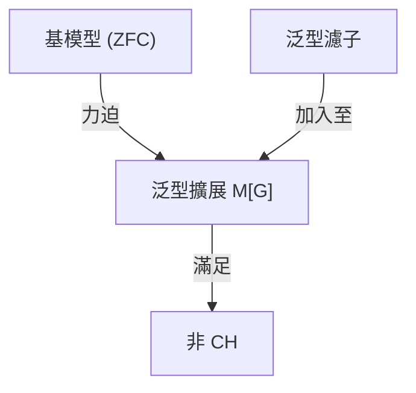

## 1. 導入：測量無限的大小

在數學世界中，「無限」的概念自古以來就是哲學爭論的焦點。然而，直到 19 世紀末格奧爾格·康托爾（Georg Cantor）出現之前，並不存在嚴格比較無限大小的數學方法。康托爾創立了集合論，並證明了無限也存在 **不同的大小** （勢、基數）。

考慮自然數集合 $\mathbb{N}$ 和實數集合 $\mathbb{R}$，透過康托爾的對角線論證，證明了實數集合比自然數集合「真正更大」。我們將自然數的基數記為 $\aleph_0$（阿列夫零），實數的基數記為 $\mathfrak{c}$（連續統基數）或 $2^{\aleph_0}$。根據康托爾定理，$\aleph_0 < 2^{\aleph_0}$。

此時康托爾產生了一個自然的疑問：「是否存在一個集合，其基數剛好介於自然數基數與實數基數 **之間** ？」
這正是後來震撼數學基礎論的 **連續統假設** （Continuum Hypothesis, CH）的開端。

## 2. 連續統假設（CH）的嚴格定義

連續統假設的公式化表述如下。

> **連續統假設 (CH)**
> 不存在一個集合，其基數嚴格大於自然數基數 $\aleph_0$ 且嚴格小於實數基數 $2^{\aleph_0}$。
> 也就是說，$\aleph_1 = 2^{\aleph_0}$。

在這裡，$\aleph_1$ 指的是大於 $\aleph_0$ 的下一個無限基數。如果 CH 為真，則實數集合的大小就是僅次於自然數集合的下一個無限。

### 透過 KaTeX 呈現的數學公式

在數學上，對於任意無限集合 $S$，其冪集 $\mathcal{P}(S)$ 的基數嚴格大於原集合的基數（康托爾定理）。
$$ |S| < |\mathcal{P}(S)| $$
因此，對於自然數集合 $\mathbb{N}$，
$$ |\mathbb{N}| < |\mathcal{P}(\mathbb{N})| = |\mathbb{R}| $$
是成立的。CH 主張這兩者之間不存在其他基數。

## 3. 康托爾的苦惱與大衛·希爾伯特的提出

康托爾窮盡一生試圖證明這個假設，但從未成功。有時他以為自己「證明了」，有時又以為自己「證偽了」，這道難題極大地消耗了他的精神狀態。

1900 年，在巴黎舉行的第二屆國際數學家大會上，大衛·希爾伯特（David Hilbert）提出了 20 世紀數學應解決的「希爾伯特的 23 個問題」。其中深具紀念意義的 **第 1 問題** ，正是這個「連續統假設的證明」。

## 4. 集合論的公理化：ZFC 公理系統

為了證明連續統假設，首先必須嚴格定義何謂「集合」以及允許進行哪些操作。由恩斯特·策梅洛（Ernst Zermelo）與亞伯拉罕·弗蘭克爾（Adolf Fraenkel）完善的 **ZFC 公理系統** （包含選擇公理的策梅洛-弗蘭克爾集合論），成為了現代數學的標準基礎。

ZFC 公理系統由以下 9 個公理（或公理模式）組成。
1. 外延公理
2. 空集公理
3. 配對公理
4. 聯集公理
5. 冪集公理
6. 分類公理（替代公理）
7. 無窮公理
8. 基礎公理（正則公理）
9. 選擇公理 (Axiom of Choice)

數學家們試圖利用這些公理來判定 CH 的真偽。

## 5. 庫爾特·哥德爾與「可構成集合」

1940 年，庫爾特·哥德爾（Kurt Gödel）發表了令人驚訝的結果。他證明了，如果假設 ZFC 公理系統不矛盾，那麼 **「在 ZFC 公理系統中加入 CH 也不會產生矛盾」** 。

哥德爾建構了一個稱為 **可構成宇宙** （Constructible Universe, $L$）的集合模型。在 $L$ 中，所有的集合都是由邏輯公式按階層構成的。哥德爾證明了，在這個 $L$ 中，不僅滿足所有 ZFC 公理系統，而且 **CH 也為真** 。

由此確定了「不可能從 ZFC 公理系統中證偽 CH（CH 與 ZFC 是相對無矛盾的）」。

## 6. 保羅·科恩與「力迫法」

在哥德爾發表結果的 20 多年後，也就是 1963 年，保羅·科恩（Paul Cohen）發表了更加令人震驚的結果。他發明了一種名為 **力迫法** （Forcing）的全新數學方法，並證明了 **「從 ZFC 公理系統中證明 CH 也是不可能的」** 。

科恩開發了一種方法，透過從外部向滿足 ZFC 的某個模型添加新集合（泛型濾子），來擴展出一個新模型。他利用這種力迫法，建構了一個 **「滿足 ZFC，但 CH 為假（例如，實數的基數變為 $\aleph_2$）」** 的模型。

## 7. 結論：無法證明也無法證偽的「獨立性」

結合哥德爾與科恩的成就，確定了連續統假設在 ZFC 公理系統中是 **無法證明也無法證偽的** 。這樣的命題被稱為獨立於公理系統的 **獨立性** （Independent）。

這給數學界帶來了難以估量的衝擊。數學真理究竟是什麼？我們所採用的公理系統（ZFC）在決定實數集合的真正大小時是不完備的（這也可以說是哥德爾不完備定理的另一種體現）。

### 現代集合論的展望

即使連續統假設被證明是獨立的，數學家們也沒有因此停止思考。時至今日，人們仍在嘗試透過在 ZFC 中添加新公理（如大基數公理或力迫公理等）來決定連續統假設的真偽。

例如，根據威廉·休·伍丁（W. Hugh Woodin）等人的研究，在 $\Omega$-邏輯等框架下，如果假設某種強公理，認為 CH 為「假」是比較自然的觀點被提了出來。另一方面，也有其他觀點認為 CH 為「真」是比較理想的，至今尚未得出最終結論。

## 8. 深入探索數學背景

為了加深對連續統假設的理解，讓我們仔細看看序數（Ordinal numbers）與基數（Cardinal numbers）的概念。

### 序數與良序集合
序數是將集合的「排列方式」抽象化後的概念。自然數集合 $\mathbb{N}$ 按通常的大小關係排列為良序。我們將這種整體的排列類型稱為 $\omega$（Omega）。$\omega$ 之後跟著 $\omega+1, \omega+2, \dots$ 無限延伸，接著是 $\omega+\omega, \omega \times \omega, \omega^{\omega}$。這些全都是可數的（與自然數基數相同）。

如果考慮所有可數序數的集合，它本身也構成一個良序集合，而其序型不再是可數的。這被稱為第一個不可數序數，記為 $\omega_1$。$\omega_1$ 的基數即為 $\aleph_1$。

### 阿列夫數（Aleph Numbers）
康托爾將無限基數由小到大命名為 $\aleph_0, \aleph_1, \aleph_2, \dots$。
- $\aleph_0$ : 自然數 $\mathbb{N}$ 的基數
- $\aleph_1$ : $\omega_1$ 的基數（所有可數序數集合的基數）
- $\dots$

CH 主張 $2^{\aleph_0} = \aleph_1$。如果 CH 為假，則可能會變成更大的基數，例如 $2^{\aleph_0} = \aleph_2$ 或 $2^{\aleph_0} = \aleph_{\omega+1}$（不過根據柯尼希定理，有 $2^{\aleph_0} \neq \aleph_{\omega}$ 等限制）。

### 科恩力迫法的機制
力迫法是一項非常深奧的技術，但其核心概念如下。
對於基本模型 $M$，考慮一個條件（Poset）集合 $P$，這些條件「一點一點地」近似一個新的子集。我們在 $P$ 中找到一個收集了不矛盾條件的濾子 $G$（稱為泛型濾子，這是一個不屬於 $M$ 的特殊物件），將 $G$ 加入到 $M$ 中，產生新模型 $M[G]$。

科恩構建了一種力迫法，大量地（例如 $\aleph_2$ 個）加入從自然數映射到 $\{0, 1\}$ 的函數（相當於實數）。結果在 $M[G]$ 中實數的數量達到 $\aleph_2$ 個以上，使得 CH 變為假。

## 9. 哲學意涵

CH 的獨立性對「柏拉圖主義」與「形式主義」的數學哲學提出了深刻的問題。
- **柏拉圖主義觀點** : 集合的理型世界是唯一的，CH 必然具有「真」或「假」其中之一的客觀真值。ZFC 之所以無法決定，是因為 ZFC 受限於人類認知，是一個不完備的公理系統。
- **形式主義觀點** : 數學只不過是從公理出發，按照邏輯規則操作符號的遊戲。就像歐幾里得幾何學中的平行公設一樣，只不過是存在著「CH 為真的集合論」與「CH 為假的集合論」這樣平行的不同數學宇宙而已。

## 10. 總結

格奧爾格·康托爾夢想著探索無限階層，卻在哥德爾與科恩兩位天才的手中，迎來了「無法證明也無法證偽」的戲劇性結局。然而，這絕不意味著數學的失敗。相反地，它催生了力迫法這個強大的工具，將集合論這個領域發展得前所未有的豐富且複雜。

連續統假設至今仍持續向我們拋出「無限究竟是什麼」「數學真理究竟是什麼」這些根本的問題。

## 補充：關於無限的進一步思考

數學中對無限的探索，從康托爾之後一直活躍到現代。自連續統假設的獨立性被證明以來，我們學會了可以透過選擇公理系統來描繪出各種不同的「宇宙」。數學物件究竟是實際存在於物理世界中，還是人類精神的純粹產物，這個爭論也與資訊理論及量子力學中處理無限的方式產生交集，邁入了一個新的階段。
