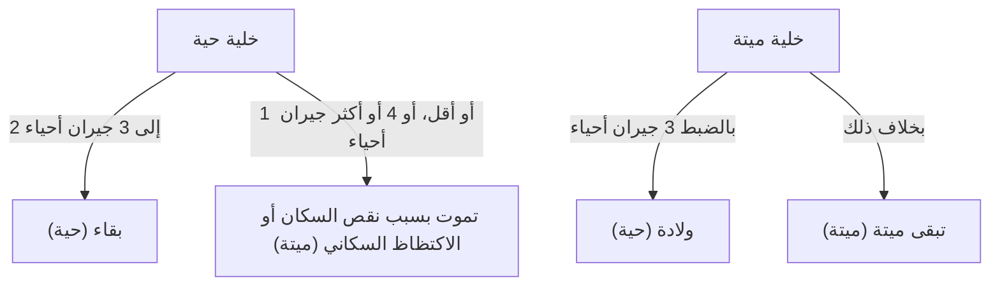

## 1. ما هي [لعبة الحياة لكونواي](https://kenji.blog/ar/p/conways-game-of-life/)؟

**[لعبة الحياة لكونواي](https://kenji.blog/ar/p/conways-game-of-life/)** ([Conway's Game of Life](https://kenji.blog/ar/p/conways-game-of-life/)) هي نوع من **الإنسان الآلي الخلوي** (Cellular Automaton) ابتكره عالم الرياضيات البريطاني جون هورتون كونواي في عام 1970. على الرغم من تسميتها بلعبة، إلا أنها "لعبة صفر لاعبين"، مما يعني أن تطورها يتحدد من خلال حالتها الأولية، ولا يتطلب أي مدخلات إضافية.

يكمن الجاذب الأكبر لهذا النظام في حقيقة أن **السلوكيات المعقدة وغير المتوقعة الشبيهة بالحياة (الانبثاق) تتولد من قواعد حتمية بسيطة للغاية**.

## 2. قواعد لعبة الحياة

تتكشف لعبة الحياة على شبكة ثنائية الأبعاد لا نهائية. تُسمى كل شبكة "خلية"، والتي يمكن أن تكون في إحدى حالتين: "حية" أو "ميتة".
يتم تحديد حالة كل خلية في الجيل التالي (الخطوة) بناءً على حالات الخلايا الثماني المحيطة بها (جوار مور).

هناك أربع قواعد فقط:

1. **الولادة** (Reproduction):
   أي خلية ميتة لها ثلاث جارات حية بالضبط تصبح خلية حية في الجيل التالي.
2. **البقاء** (Survival):
   أي خلية حية لها جارتان أو ثلاث جارات حية تعيش إلى الجيل التالي.
3. **نقص السكان** (Underpopulation):
   أي خلية حية لها أقل من جارتين حيتين تموت في الجيل التالي، كما لو كان ذلك بسبب نقص السكان.
4. **الاكتظاظ السكاني** (Overpopulation):
   أي خلية حية لها أكثر من ثلاث جارات حية تموت في الجيل التالي، كما لو كان ذلك بسبب الاكتظاظ السكاني.

للتعبير عن ذلك رياضياً، لتكن حالة خلية $(x, y)$ في الوقت $t$ هي $S_{t}(x, y) \in \{0, 1\}$، وعدد الجيران الأحياء هو $N$.

$$
N = \sum_{i=-1}^{1} \sum_{j=-1}^{1} S_{t}(x+i, y+j) - S_{t}(x, y)
$$

يتم تعريف دالة انتقال الحالة $f$ على النحو التالي:

$$
S_{t+1}(x, y) = 
\begin{cases} 
1 & \text{if } S_{t}(x, y) = 0 \text{ and } N = 3 \\
1 & \text{if } S_{t}(x, y) = 1 \text{ and } (N = 2 \text{ or } N = 3) \\
0 & \text{otherwise}
\end{cases}
$$

مخطط الانسياب لهذه القواعد هو كما يلي:



## 3. أنماط شهيرة

على الرغم من القواعد البسيطة، توجد مجموعة متنوعة من الأنماط في لعبة الحياة. يتم تصنيفها بشكل أساسي إلى الفئات التالية.

### 3.1 الحيوات الساكنة (Still Lifes)
أنماط لا تتغير حالتها على الإطلاق مع تقدم الأجيال.
- **كتلة** (Block): 2x2 خلايا حية.
- **خلية نحل** (Beehive): شكل سداسي يتكون من 6 خلايا.

### 3.2 المتذبذبات (Oscillators)
أنماط تعود إلى حالتها الأصلية في فترة ثابتة.
- **وامض** (Blinker): 3 خلايا حية مرتبة في خط مستقيم، تتبدل عمودياً وأفقياً بفترة 2.
- **نجم نابض** (Pulsar): نمط كبير يتغير بفترة 3.

### 3.3 سفن الفضاء (Spaceships)
أنماط تتحرك عبر الفضاء مع الحفاظ على شكلها.
- **طائرة شراعية** (Glider): تتكون من 5 خلايا، وتتحرك قطرياً، وهي سفينة الفضاء الأكثر شهرة. وتعرف أيضاً كرمز لثقافة الهاكر.

## 4. الأهمية في علوم الحاسوب: اكتمال تورينج

إحدى الخصائص المدهشة للعبة الحياة هي أنها **مكتملة تورينج** (Turing complete). وبعبارة أخرى، بالنظر إلى شبكة كبيرة بشكل مناسب وحالة أولية مناسبة، يمكن محاكاة أي خوارزمية يمكن حسابها بواسطة جهاز كمبيوتر حديث في لعبة الحياة هذه.

وقد ثبت رياضياً أنه يمكن إجراء العمليات المنطقية باستخدام الطائرات الشراعية كإشارات ووضع الحيوات الساكنة كدوائر منطقية (بوابات AND، بوابات OR، بوابات NOT، إلخ).

## 5. مثال تنفيذي في لغة بايثون

لعبة الحياة تحظى بشعبية كبيرة أيضاً كتمرين برمجي. فيما يلي مثال تنفيذي بسيط باستخدام بايثون و NumPy.

```python
import numpy as np
import matplotlib.pyplot as plt
import matplotlib.animation as animation

def update(frameNum, img, grid, N):
    """دالة لحساب وتحديث الشبكة للجيل التالي"""
    newGrid = grid.copy()
    for i in range(N):
        for j in range(N):
            # حساب مجموع الخلايا المجاورة مع شروط حدود حلقية
            total = int((grid[i, (j-1)%N] + grid[i, (j+1)%N] +
                         grid[(i-1)%N, j] + grid[(i+1)%N, j] +
                         grid[(i-1)%N, (j-1)%N] + grid[(i-1)%N, (j+1)%N] +
                         grid[(i+1)%N, (j-1)%N] + grid[(i+1)%N, (j+1)%N]))
            
            # تطبيق قواعد كونواي
            if grid[i, j] == 1:
                if (total < 2) or (total > 3):
                    newGrid[i, j] = 0
            else:
                if total == 3:
                    newGrid[i, j] = 1
                    
    # تحديث البيانات
    img.set_data(newGrid)
    grid[:] = newGrid[:]
    return img,

# حجم الشبكة
N = 50
# توليد حالة أولية عشوائية (احتمال 20% أن تكون حية)
grid = np.random.choice([0, 1], N*N, p=[0.8, 0.2]).reshape(N, N)

fig, ax = plt.subplots()
img = ax.imshow(grid, interpolation='nearest', cmap='gray_r')
ani = animation.FuncAnimation(fig, update, fargs=(img, grid, N),
                              frames=10, interval=200, save_count=50)
plt.show()
```

## 6. خاتمة

تعد [لعبة الحياة لكونواي](https://kenji.blog/ar/p/conways-game-of-life/) واحدة من أجمل الأمثلة وأكثرها بديهية على **الانبثاق**، حيث يتولد التعقيد من قواعد بسيطة. يقع هذا النموذج على حدود الرياضيات وعلوم الكمبيوتر والفيزياء وعلم الأحياء، ويستمر في توفير استعارة قوية لفهمنا لمفاهيم "الحياة" و"الحساب".
