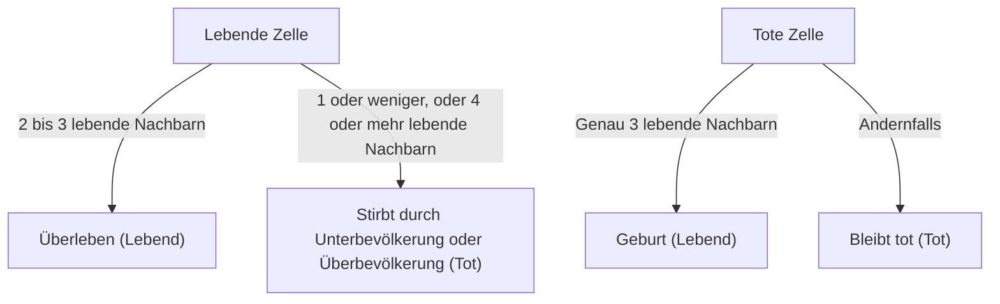

## 1. Was ist [Conways Spiel des Lebens](https://kenji.blog/de/p/conways-game-of-life/)?

**[Conways Spiel des Lebens](https://kenji.blog/de/p/conways-game-of-life/)** ([Conway's Game of Life](https://kenji.blog/de/p/conways-game-of-life/)) ist eine Art **zellulärer Automat**, der 1970 vom britischen Mathematiker John Horton Conway entwickelt wurde. Obwohl es als Spiel bezeichnet wird, ist es ein „Null-Spieler-Spiel“, was bedeutet, dass seine Entwicklung durch seinen Anfangszustand bestimmt wird und keine weiteren Eingaben erforderlich sind.

Der größte Reiz dieses Systems liegt in der Tatsache, dass **aus extrem einfachen deterministischen Regeln unvorhersehbare und komplexe lebensähnliche Verhaltensweisen (Emergenz) generiert werden**.

## 2. Regeln des Spiels des Lebens

Das Spiel des Lebens entfaltet sich auf einem unendlichen zweidimensionalen Gitter. Jedes Gitter wird als „Zelle“ bezeichnet, die sich in einem von zwei Zuständen befinden kann: „Lebend“ (Alive) oder „Tot“ (Dead).
Der [Zustand](https://kenji.blog/de/p/state-management-history-redux-context-recoil-zustand/) jeder Zelle in der nächsten Generation (Schritt) wird basierend auf den Zuständen ihrer 8 umliegenden Zellen (Moore-Nachbarschaft) bestimmt.

Es gibt nur vier Regeln:

1. **Geburt** (Reproduction):
   Jede tote Zelle mit genau drei lebenden Nachbarn wird in der nächsten Generation zu einer lebenden Zelle.
2. **Überleben** (Survival):
   Jede lebende Zelle mit zwei oder drei lebenden Nachbarn überlebt in die nächste Generation.
3. **Unterbevölkerung** (Underpopulation):
   Jede lebende Zelle mit weniger als zwei lebenden Nachbarn stirbt in der nächsten Generation, als ob sie durch Unterbevölkerung verursacht würde.
4. **Überbevölkerung** (Overpopulation):
   Jede lebende Zelle mit mehr als drei lebenden Nachbarn stirbt in der nächsten Generation, wie durch Überbevölkerung.

Wenn wir dies mathematisch ausdrücken, sei der Zustand einer Zelle $(x, y)$ zum Zeitpunkt $t$ $S_{t}(x, y) \in \{0, 1\}$, und die Anzahl der lebenden Nachbarn $N$.

$$
N = \sum_{i=-1}^{1} \sum_{j=-1}^{1} S_{t}(x+i, y+j) - S_{t}(x, y)
$$

Die Zustandsübergangsfunktion $f$ ist wie folgt definiert:

$$
S_{t+1}(x, y) = 
\begin{cases} 
1 & \text{if } S_{t}(x, y) = 0 \text{ and } N = 3 \\
1 & \text{if } S_{t}(x, y) = 1 \text{ and } (N = 2 \text{ or } N = 3) \\
0 & \text{otherwise}
\end{cases}
$$

Das Flussdiagramm für diese Regeln sieht wie folgt aus:



## 3. Berühmte Muster

Trotz der einfachen Regeln gibt es im Spiel des Lebens eine Vielzahl von Mustern. Sie werden hauptsächlich in die folgenden Kategorien eingeteilt.

### 3.1 Statische Objekte (Still Lifes)
Muster, deren [Zustand](https://kenji.blog/de/p/state-management-history-redux-context-recoil-zustand/) sich im Laufe der Generationen überhaupt nicht ändert.
- **Block**: 2x2 lebende Zellen.
- **Bienenstock** (Beehive): Ein Sechseck aus 6 Zellen.

### 3.2 Oszillatoren (Oscillators)
Muster, die in einer bestimmten Periode in ihren ursprünglichen Zustand zurückkehren.
- **Blinker**: 3 lebende Zellen, die in einer geraden Linie angeordnet sind und vertikal und horizontal mit einer Periode von 2 wechseln.
- **Pulsar**: Ein großes Muster, das sich mit einer Periode von 3 ändert.

### 3.3 Raumschiffe (Spaceships)
Muster, die sich durch den Raum bewegen, während sie ihre Form beibehalten.
- **Gleiter** (Glider): Besteht aus 5 Zellen, bewegt sich diagonal und ist das berühmteste Raumschiff. Es ist auch als Symbol der Hacker-Kultur bekannt.

## 4. Bedeutung in der Informatik: Turing-Vollständigkeit

Eine der überraschenden Eigenschaften des Spiels des Lebens ist, dass es **Turing-vollständig** ist. Mit anderen Worten, bei einem ausreichend großen Gitter und einem geeigneten Anfangszustand kann jeder Algorithmus, der von einem modernen Computer berechnet werden kann, in diesem Spiel des Lebens simuliert werden.

Es wurde mathematisch bewiesen, dass logische Operationen durchgeführt werden können, indem Gleiter als Signale verwendet und statische Objekte als logische Schaltungen (AND-Gatter, OR-Gatter, NOT-Gatter usw.) platziert werden.

## 5. Implementierungsbeispiel in Python

Das Spiel des Lebens ist auch als Programmierübung sehr beliebt. Hier ist ein einfaches Implementierungsbeispiel mit Python und NumPy.

```python
import numpy as np
import matplotlib.pyplot as plt
import matplotlib.animation as animation

def update(frameNum, img, grid, N):
    """Funktion zur Berechnung und Aktualisierung des Gitters für die nächste Generation"""
    newGrid = grid.copy()
    for i in range(N):
        for j in range(N):
            # Berechnen der Summe benachbarter Zellen mit ringförmigen Randbedingungen
            total = int((grid[i, (j-1)%N] + grid[i, (j+1)%N] +
                         grid[(i-1)%N, j] + grid[(i+1)%N, j] +
                         grid[(i-1)%N, (j-1)%N] + grid[(i-1)%N, (j+1)%N] +
                         grid[(i+1)%N, (j-1)%N] + grid[(i+1)%N, (j+1)%N]))
            
            # Anwenden von Conways Regeln
            if grid[i, j] == 1:
                if (total < 2) or (total > 3):
                    newGrid[i, j] = 0
            else:
                if total == 3:
                    newGrid[i, j] = 1
                    
    # Aktualisieren von Daten
    img.set_data(newGrid)
    grid[:] = newGrid[:]
    return img,

# Gittergröße
N = 50
# Generieren eines zufälligen Anfangszustands (20% Wahrscheinlichkeit, lebendig zu sein)
grid = np.random.choice([0, 1], N*N, p=[0.8, 0.2]).reshape(N, N)

fig, ax = plt.subplots()
img = ax.imshow(grid, interpolation='nearest', cmap='gray_r')
ani = animation.FuncAnimation(fig, update, fargs=(img, grid, N),
                              frames=10, interval=200, save_count=50)
plt.show()
```

## 6. Fazit

[Conways Spiel des Lebens](https://kenji.blog/de/p/conways-game-of-life/) ist eines der schönsten und intuitivsten Beispiele für **Emergenz**, bei dem Komplexität aus einfachen Regeln entsteht. Angesiedelt an den Grenzen von Mathematik, Informatik, Physik und Biologie, bietet dieses Modell weiterhin eine kraftvolle Metapher für unser Verständnis der Konzepte von "Leben" und "Berechnung".
