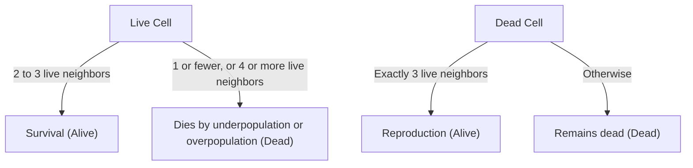

## 1. What is Conway's Game of Life?

**Conway's Game of Life** is a type of **cellular automaton** devised by the British mathematician John Horton Conway in 1970. Although it is called a game, it is a "zero-player game," meaning that its evolution is determined by its initial state, requiring no further input.

The greatest appeal of this system lies in the fact that **unpredictable and complex life-like behaviors (emergence) are generated from extremely simple deterministic rules**.

## 2. Rules of the Game of Life

The Game of Life unfolds on an infinite two-dimensional grid. Each grid is called a "cell," which can be in one of two states: "Alive" or "Dead".
The state of each cell in the next generation (step) is determined based on the states of its 8 surrounding cells (Moore neighborhood).

There are only four rules:

1. **Reproduction**:
   Any dead cell with exactly three live neighbors becomes a live cell in the next generation.
2. **Survival**:
   Any live cell with two or three live neighbors survives on to the next generation.
3. **Underpopulation**:
   Any live cell with fewer than two live neighbors dies in the next generation, as if caused by underpopulation.
4. **Overpopulation**:
   Any live cell with more than three live neighbors dies in the next generation, as if by overpopulation.

Expressing this mathematically, let the state of a cell $(x, y)$ at time $t$ be $S_{t}(x, y) \in \{0, 1\}$, and the number of living neighbors be $N$.

$$
N = \sum_{i=-1}^{1} \sum_{j=-1}^{1} S_{t}(x+i, y+j) - S_{t}(x, y)
$$

The state transition function $f$ is defined as follows:

$$
S_{t+1}(x, y) = 
\begin{cases} 
1 & \text{if } S_{t}(x, y) = 0 \text{ and } N = 3 \\
1 & \text{if } S_{t}(x, y) = 1 \text{ and } (N = 2 \text{ or } N = 3) \\
0 & \text{otherwise}
\end{cases}
$$

The flowchart for these rules is as follows:



## 3. Famous Patterns

Despite the simple rules, a variety of patterns exist in the Game of Life. They are primarily classified into the following categories.

### 3.1 Still Lifes
Patterns whose state does not change at all as generations progress.
- **Block**: 2x2 live cells.
- **Beehive**: A hexagon composed of 6 cells.

### 3.2 Oscillators
Patterns that return to their original state in a fixed period.
- **Blinker**: 3 live cells arranged in a straight line, switching vertically and horizontally with a period of 2.
- **Pulsar**: A large pattern that changes with a period of 3.

### 3.3 Spaceships
Patterns that move through space while maintaining their shape.
- **Glider**: Composed of 5 cells, moving diagonally, it is the most famous spaceship. It is also known as a symbol of hacker culture.

## 4. Significance in Computer Science: Turing Completeness

One of the surprising properties of the Game of Life is that it is **Turing complete**. In other words, given an appropriately large grid and initial state, any algorithm that can be computed by a modern computer can be simulated on this Game of Life.

It has been mathematically proven that logical operations can be performed by using gliders as signals and placing still lifes as logic circuits (AND gates, OR gates, NOT gates, etc.).

## 5. Implementation Example in Python

The Game of Life is also very popular as a programming exercise. Here is a simple implementation example using Python and NumPy.

```python
import numpy as np
import matplotlib.pyplot as plt
import matplotlib.animation as animation

def update(frameNum, img, grid, N):
    """Function to compute and update the grid for the next generation"""
    newGrid = grid.copy()
    for i in range(N):
        for j in range(N):
            # Calculate the sum of neighboring cells with toroidal boundary conditions
            total = int((grid[i, (j-1)%N] + grid[i, (j+1)%N] +
                         grid[(i-1)%N, j] + grid[(i+1)%N, j] +
                         grid[(i-1)%N, (j-1)%N] + grid[(i-1)%N, (j+1)%N] +
                         grid[(i+1)%N, (j-1)%N] + grid[(i+1)%N, (j+1)%N]))
            
            # Apply Conway's rules
            if grid[i, j] == 1:
                if (total < 2) or (total > 3):
                    newGrid[i, j] = 0
            else:
                if total == 3:
                    newGrid[i, j] = 1
                    
    # Update data
    img.set_data(newGrid)
    grid[:] = newGrid[:]
    return img,

# Grid size
N = 50
# Generate random initial state (20% probability of being alive)
grid = np.random.choice([0, 1], N*N, p=[0.8, 0.2]).reshape(N, N)

fig, ax = plt.subplots()
img = ax.imshow(grid, interpolation='nearest', cmap='gray_r')
ani = animation.FuncAnimation(fig, update, fargs=(img, grid, N),
                              frames=10, interval=200, save_count=50)
plt.show()
```

## 6. Conclusion

Conway's Game of Life is one of the most beautiful and intuitive examples of **emergence**, where complexity is generated from simple rules. Situated at the boundaries of mathematics, computer science, physics, and biology, this model continues to provide a powerful metaphor for our understanding of the concepts of "life" and "computation".
