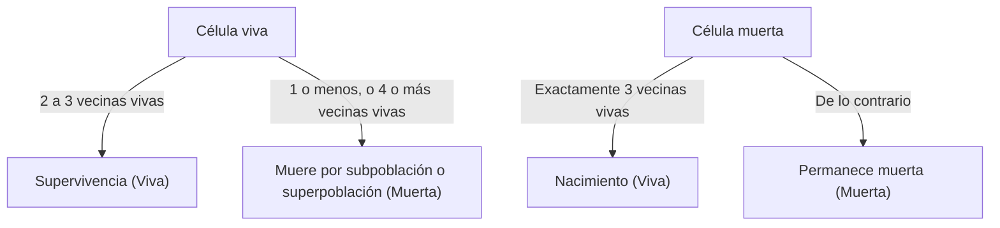

## 1. ¿Qué es el juego de la vida de Conway?

El **Juego de la vida de Conway** (Conway's Game of Life) es un tipo de **autómata celular** ideado por el matemático británico John Horton Conway en 1970. Aunque se llama juego, es un "juego de cero jugadores", lo que significa que su evolución está determinada por su estado inicial, sin requerir más intervención.

El mayor atractivo de este sistema radica en el hecho de que **a partir de reglas deterministas extremadamente simples, se generan comportamientos impredecibles y complejos similares a la vida (emergencia)**.

## 2. Reglas del juego de la vida

El juego de la vida se desarrolla en una cuadrícula (grid) bidimensional infinita. Cada cuadrícula se llama "célula", que puede estar en uno de dos estados: "Viva" o "Muerta".
El estado de cada célula en la próxima generación (paso) se determina en función de los estados de sus 8 células circundantes (vecindad de Moore).

Solo hay cuatro reglas:

1. **Nacimiento** (Reproduction):
   Cualquier célula muerta con exactamente tres células vecinas vivas se convierte en una célula viva en la próxima generación.
2. **Supervivencia** (Survival):
   Cualquier célula viva con dos o tres vecinas vivas sobrevive a la siguiente generación.
3. **Subpoblación** (Underpopulation):
   Cualquier célula viva con menos de dos vecinas vivas muere en la próxima generación, como si fuera por soledad.
4. **Superpoblación** (Overpopulation):
   Cualquier célula viva con más de tres vecinas vivas muere en la próxima generación, debido a la superpoblación.

Expresando esto matemáticamente, sea el estado de una célula $(x, y)$ en el momento $t$, $S_{t}(x, y) \in \{0, 1\}$, y el número de vecinas vivas $N$.

$$
N = \sum_{i=-1}^{1} \sum_{j=-1}^{1} S_{t}(x+i, y+j) - S_{t}(x, y)
$$

La función de transición de estado $f$ se define de la siguiente manera:

$$
S_{t+1}(x, y) = 
\begin{cases} 
1 & \text{if } S_{t}(x, y) = 0 \text{ and } N = 3 \\
1 & \text{if } S_{t}(x, y) = 1 \text{ and } (N = 2 \text{ or } N = 3) \\
0 & \text{otherwise}
\end{cases}
$$

El diagrama de flujo para estas reglas es el siguiente:



## 3. Patrones famosos

A pesar de las reglas simples, existe una variedad de patrones en el juego de la vida. Se clasifican principalmente en las siguientes categorías.

### 3.1 Vidas estáticas (Still Lifes)
Patrones cuyo estado no cambia en absoluto a medida que avanzan las generaciones.
- **Bloque** (Block): Células vivas de 2x2.
- **Colmena** (Beehive): Un hexágono compuesto por 6 células.

### 3.2 Osciladores (Oscillators)
Patrones que vuelven a su estado original en un período fijo.
- **Parpadeador** (Blinker): 3 células vivas dispuestas en línea recta, que cambian vertical y horizontalmente con un período de 2.
- **Púlsar** (Pulsar): Un patrón grande que cambia con un período de 3.

### 3.3 Naves espaciales (Spaceships)
Patrones que se mueven a través del espacio mientras mantienen su forma.
- **Planeador** (Glider): Compuesto por 5 células, moviéndose en diagonal, es la nave espacial más famosa. También se conoce como un símbolo de la cultura hacker.

## 4. Importancia en la informática: Completitud de Turing

Una de las propiedades sorprendentes del juego de la vida es que es **Turing completo**. En otras palabras, dada una cuadrícula suficientemente grande y un estado inicial apropiado, cualquier algoritmo que pueda ser calculado por una computadora moderna se puede simular en este juego de la vida.

Se ha demostrado matemáticamente que las operaciones lógicas se pueden realizar utilizando planeadores como señales y colocando vidas estáticas como circuitos lógicos (puertas AND, puertas OR, puertas NOT, etc.).

## 5. Ejemplo de implementación en Python

El juego de la vida también es muy popular como ejercicio de programación. Aquí hay un ejemplo de implementación simple usando Python y NumPy.

```python
import numpy as np
import matplotlib.pyplot as plt
import matplotlib.animation as animation

def update(frameNum, img, grid, N):
    """Función para calcular y actualizar la cuadrícula para la próxima generación"""
    newGrid = grid.copy()
    for i in range(N):
        for j in range(N):
            # Calcular la suma de las células vecinas con condiciones de contorno toroidales
            total = int((grid[i, (j-1)%N] + grid[i, (j+1)%N] +
                         grid[(i-1)%N, j] + grid[(i+1)%N, j] +
                         grid[(i-1)%N, (j-1)%N] + grid[(i-1)%N, (j+1)%N] +
                         grid[(i+1)%N, (j-1)%N] + grid[(i+1)%N, (j+1)%N]))
            
            # Aplicar las reglas de Conway
            if grid[i, j] == 1:
                if (total < 2) or (total > 3):
                    newGrid[i, j] = 0
            else:
                if total == 3:
                    newGrid[i, j] = 1
                    
    # Actualizar datos
    img.set_data(newGrid)
    grid[:] = newGrid[:]
    return img,

# Tamaño de la cuadrícula
N = 50
# Generar un estado inicial aleatorio (20% de probabilidad de estar viva)
grid = np.random.choice([0, 1], N*N, p=[0.8, 0.2]).reshape(N, N)

fig, ax = plt.subplots()
img = ax.imshow(grid, interpolation='nearest', cmap='gray_r')
ani = animation.FuncAnimation(fig, update, fargs=(img, grid, N),
                              frames=10, interval=200, save_count=50)
plt.show()
```

## 6. Conclusión

El juego de la vida de Conway es uno de los ejemplos más hermosos e intuitivos de **emergencia**, donde se genera complejidad a partir de reglas simples. Situado en los límites de las matemáticas, la informática, la física y la biología, este modelo continúa proporcionando una poderosa metáfora para nuestra comprensión de los conceptos de "vida" y "computación".
