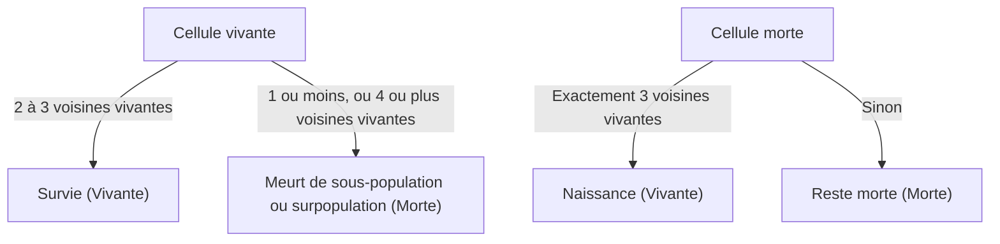

## 1. Qu'est-ce que le jeu de la vie de Conway ?

Le **Jeu de la vie de Conway** ([Conway's Game of Life](https://kenji.blog/fr/p/conways-game-of-life/)) est un type d'**automate cellulaire** conçu par le mathématicien britannique John Horton Conway en 1970. Bien qu'il s'appelle un jeu, c'est un « jeu à zéro joueur », ce qui signifie que son évolution est déterminée par son état initial, ne nécessitant aucune intervention supplémentaire.

Le plus grand attrait de ce système réside dans le fait que **des comportements complexes et imprévisibles semblables à la vie (émergence) sont générés à partir de règles déterministes extrêmement simples**.

## 2. Règles du jeu de la vie

Le jeu de la vie se déroule sur une grille bidimensionnelle infinie. Chaque grille est appelée une « cellule », qui peut être dans l'un des deux états : « Vivante » ou « Morte ».
L'état de chaque cellule dans la génération (étape) suivante est déterminé en fonction des états de ses 8 cellules environnantes (voisinage de Moore).

Il n'y a que quatre règles :

1. **Naissance** (Reproduction) :
   Toute cellule morte avec exactement trois cellules voisines vivantes devient une cellule vivante à la génération suivante.
2. **Survie** (Survival) :
   Toute cellule vivante avec deux ou trois voisines vivantes survit à la génération suivante.
3. **Sous-population** (Underpopulation) :
   Toute cellule vivante avec moins de deux voisines vivantes meurt à la génération suivante, comme si elle était causée par la sous-population.
4. **Surpopulation** (Overpopulation) :
   Toute cellule vivante avec plus de trois voisines vivantes meurt à la génération suivante, en raison de la surpopulation.

En exprimant cela mathématiquement, soit l'état d'une cellule $(x, y)$ au temps $t$, $S_{t}(x, y) \in \{0, 1\}$, et le nombre de voisines vivantes $N$.

$$
N = \sum_{i=-1}^{1} \sum_{j=-1}^{1} S_{t}(x+i, y+j) - S_{t}(x, y)
$$

La fonction de transition d'état $f$ est définie comme suit :

$$
S_{t+1}(x, y) = 
\begin{cases} 
1 & \text{if } S_{t}(x, y) = 0 \text{ and } N = 3 \\
1 & \text{if } S_{t}(x, y) = 1 \text{ and } (N = 2 \text{ or } N = 3) \\
0 & \text{otherwise}
\end{cases}
$$

L'organigramme de ces règles est le suivant :



## 3. Modèles célèbres

Malgré les règles simples, une variété de modèles existent dans le jeu de la vie. Ils sont principalement classés dans les catégories suivantes.

### 3.1 Vies stables (Still Lifes)
Modèles dont l'état ne change pas du tout à mesure que les générations progressent.
- **Bloc** (Block) : 2x2 cellules vivantes.
- **Ruche** (Beehive) : Un hexagone composé de 6 cellules.

### 3.2 Oscillateurs (Oscillators)
Modèles qui reviennent à leur état d'origine dans une période fixe.
- **Clignotant** (Blinker) : 3 cellules vivantes disposées en ligne droite, basculant verticalement et horizontalement avec une période de 2.
- **Pulsar** : Un grand modèle qui change avec une période de 3.

### 3.3 Vaisseaux spatiaux (Spaceships)
Modèles qui se déplacent dans l'espace tout en conservant leur forme.
- **Planeur** (Glider) : Composé de 5 cellules, se déplaçant en diagonale, c'est le vaisseau spatial le plus célèbre. Il est également connu comme un symbole de la culture hacker.

## 4. Importance en informatique : Complétude de Turing

L'une des propriétés surprenantes du jeu de la vie est qu'il est **Turing complet**. En d'autres termes, étant donné une grille suffisamment grande et un état initial approprié, tout algorithme qui peut être calculé par un ordinateur moderne peut être simulé sur ce jeu de la vie.

Il a été prouvé mathématiquement que des opérations logiques peuvent être effectuées en utilisant des planeurs comme signaux et en plaçant des vies stables comme circuits logiques (portes ET, portes OU, portes NON, etc.).

## 5. Exemple d'implémentation en Python

Le jeu de la vie est également très populaire comme exercice de programmation. Voici un exemple d'implémentation simple utilisant Python et NumPy.

```python
import numpy as np
import matplotlib.pyplot as plt
import matplotlib.animation as animation

def update(frameNum, img, grid, N):
    """Fonction pour calculer et mettre à jour la grille pour la génération suivante"""
    newGrid = grid.copy()
    for i in range(N):
        for j in range(N):
            # Calculer la somme des cellules voisines avec des conditions aux limites toroïdales
            total = int((grid[i, (j-1)%N] + grid[i, (j+1)%N] +
                         grid[(i-1)%N, j] + grid[(i+1)%N, j] +
                         grid[(i-1)%N, (j-1)%N] + grid[(i-1)%N, (j+1)%N] +
                         grid[(i+1)%N, (j-1)%N] + grid[(i+1)%N, (j+1)%N]))
            
            # Appliquer les règles de Conway
            if grid[i, j] == 1:
                if (total < 2) or (total > 3):
                    newGrid[i, j] = 0
            else:
                if total == 3:
                    newGrid[i, j] = 1
                    
    # Mettre à jour les données
    img.set_data(newGrid)
    grid[:] = newGrid[:]
    return img,

# Taille de la grille
N = 50
# Générer un état initial aléatoire (20% de probabilité d'être vivant)
grid = np.random.choice([0, 1], N*N, p=[0.8, 0.2]).reshape(N, N)

fig, ax = plt.subplots()
img = ax.imshow(grid, interpolation='nearest', cmap='gray_r')
ani = animation.FuncAnimation(fig, update, fargs=(img, grid, N),
                              frames=10, interval=200, save_count=50)
plt.show()
```

## 6. Conclusion

[Le jeu de la vie de Conway](https://kenji.blog/fr/p/conways-game-of-life/) est l'un des exemples les plus beaux et les plus intuitifs d'**émergence**, où la complexité est générée à partir de règles simples. Situé aux frontières des mathématiques, de l'informatique, de la physique et de la biologie, ce modèle continue de fournir une métaphore puissante pour notre compréhension des concepts de « vie » et de « calcul ».
