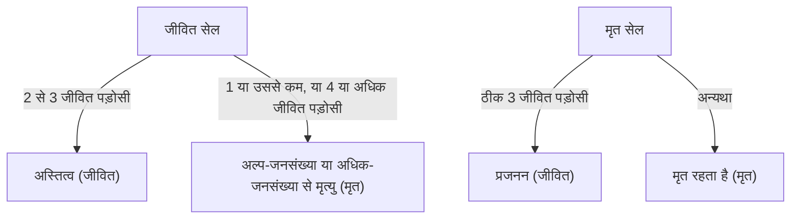

## 1. [कॉनवे का गेम ऑफ लाइफ](https://kenji.blog/hi/p/conways-game-of-life/) क्या है?

**[कॉनवे का गेम ऑफ लाइफ](https://kenji.blog/hi/p/conways-game-of-life/)** 1970 में ब्रिटिश गणितज्ञ जॉन हॉर्टन कॉनवे द्वारा तैयार किया गया एक प्रकार का **सेल्युलर ऑटोमेटन** है। यद्यपि इसे गेम कहा जाता है, यह एक "शून्य-खिलाड़ी गेम" है, जिसका अर्थ है कि इसका विकास इसकी प्रारंभिक स्थिति से निर्धारित होता है, जिसमें आगे किसी इनपुट की आवश्यकता नहीं होती है।

इस प्रणाली का सबसे बड़ा आकर्षण इस तथ्य में निहित है कि **अत्यंत सरल नियतात्मक नियमों से अप्रत्याशित और जटिल जीवन-जैसे व्यवहार (उद्भव) उत्पन्न होते हैं**।

## 2. गेम ऑफ लाइफ के नियम

गेम ऑफ लाइफ एक अनंत द्वि-आयामी ग्रिड पर सामने आता है। प्रत्येक ग्रिड को "सेल" (कोशिका) कहा जाता है, जो दो स्थितियों में से एक में हो सकती है: "जीवित" (Alive) या "मृत" (Dead)।
अगली पीढ़ी (कदम) में प्रत्येक सेल की स्थिति उसके 8 आसपास की कोशिकाओं (मूर नेबरहुड) की स्थितियों के आधार पर निर्धारित की जाती है।

केवल चार नियम हैं:

1. **प्रजनन** (Reproduction):
   कोई भी मृत सेल जिसमें ठीक तीन जीवित पड़ोसी हों, अगली पीढ़ी में जीवित सेल बन जाती है।
2. **अस्तित्व** (Survival):
   कोई भी जीवित सेल जिसमें दो या तीन जीवित पड़ोसी हों, अगली पीढ़ी में जीवित रहती है।
3. **अल्प-जनसंख्या** (Underpopulation):
   कोई भी जीवित सेल जिसमें दो से कम जीवित पड़ोसी हों, अगली पीढ़ी में मर जाती है, मानो अल्प-जनसंख्या के कारण हो।
4. **अधिक-जनसंख्या** (Overpopulation):
   कोई भी जीवित सेल जिसमें तीन से अधिक जीवित पड़ोसी हों, अगली पीढ़ी में मर जाती है, मानो अधिक-जनसंख्या के कारण हो।

इसे गणितीय रूप से व्यक्त करते हुए, मान लें कि समय $t$ पर एक सेल $(x, y)$ की स्थिति $S_{t}(x, y) \in \{0, 1\}$ है, और जीवित पड़ोसियों की संख्या $N$ है।

$$
N = \sum_{i=-1}^{1} \sum_{j=-1}^{1} S_{t}(x+i, y+j) - S_{t}(x, y)
$$

स्थिति संक्रमण फ़ंक्शन $f$ को इस प्रकार परिभाषित किया गया है:

$$
S_{t+1}(x, y) = 
\begin{cases} 
1 & \text{if } S_{t}(x, y) = 0 \text{ and } N = 3 \\
1 & \text{if } S_{t}(x, y) = 1 \text{ and } (N = 2 \text{ or } N = 3) \\
0 & \text{otherwise}
\end{cases}
$$

इन नियमों के लिए फ़्लोचार्ट इस प्रकार है:



## 3. प्रसिद्ध पैटर्न

सरल नियमों के बावजूद, गेम ऑफ लाइफ में विभिन्न प्रकार के पैटर्न मौजूद हैं। उन्हें मुख्य रूप से निम्नलिखित श्रेणियों में वर्गीकृत किया गया है।

### 3.1 स्टिल लाइफ (Still Lifes)
ऐसे पैटर्न जिनकी स्थिति पीढ़ियों के आगे बढ़ने पर बिल्कुल नहीं बदलती है।
- **ब्लॉक** (Block): 2x2 जीवित कोशिकाएँ।
- **मधुमक्खी का छत्ता** (Beehive): 6 कोशिकाओं से बना एक षट्भुज।

### 3.2 ऑसिलेटर (Oscillators)
ऐसे पैटर्न जो एक निश्चित अवधि में अपनी मूल स्थिति में लौट आते हैं।
- **ब्लिंकर** (Blinker): 3 जीवित कोशिकाएं सीधी रेखा में व्यवस्थित, जो 2 की अवधि के साथ लंबवत और क्षैतिज रूप से स्विच करती हैं।
- **पल्सर** (Pulsar): एक बड़ा पैटर्न जो 3 की अवधि के साथ बदलता है।

### 3.3 अंतरिक्ष यान (Spaceships)
ऐसे पैटर्न जो अपने आकार को बनाए रखते हुए अंतरिक्ष में चलते हैं।
- **ग्लाइडर** (Glider): 5 कोशिकाओं से बना, तिरछे रूप से आगे बढ़ने वाला, यह सबसे प्रसिद्ध अंतरिक्ष यान है। इसे हैकर संस्कृति के प्रतीक के रूप में भी जाना जाता है।

## 4. कंप्यूटर विज्ञान में महत्व: ट्यूरिंग पूर्णता

गेम ऑफ लाइफ के आश्चर्यजनक गुणों में से एक यह है कि यह **ट्यूरिंग पूर्ण** (Turing complete) है। दूसरे शब्दों में, एक पर्याप्त रूप से बड़े ग्रिड और उचित प्रारंभिक स्थिति को देखते हुए, कोई भी एल्गोरिदम जिसे आधुनिक कंप्यूटर द्वारा गणना की जा सकती है, इस गेम ऑफ लाइफ पर अनुकरण किया जा सकता है।

यह गणितीय रूप से सिद्ध हो चुका है कि ग्लाइडर्स का संकेतों के रूप में उपयोग करके और स्टिल लाइफ को तर्क सर्किट (AND गेट्स, OR गेट्स, NOT गेट्स आदि) के रूप में रखकर तार्किक संचालन किया जा सकता है।

## 5. पायथन में कार्यान्वयन उदाहरण

प्रोग्रामिंग अभ्यास के रूप में गेम ऑफ लाइफ भी बहुत लोकप्रिय है। यहाँ पायथन और NumPy का उपयोग करके एक सरल कार्यान्वयन उदाहरण दिया गया है।

```python
import numpy as np
import matplotlib.pyplot as plt
import matplotlib.animation as animation

def update(frameNum, img, grid, N):
    """अगली पीढ़ी के लिए ग्रिड की गणना और अद्यतन करने का कार्य"""
    newGrid = grid.copy()
    for i in range(N):
        for j in range(N):
            # टोरॉयडल सीमा शर्तों के साथ पड़ोसी कोशिकाओं के योग की गणना करें
            total = int((grid[i, (j-1)%N] + grid[i, (j+1)%N] +
                         grid[(i-1)%N, j] + grid[(i+1)%N, j] +
                         grid[(i-1)%N, (j-1)%N] + grid[(i-1)%N, (j+1)%N] +
                         grid[(i+1)%N, (j-1)%N] + grid[(i+1)%N, (j+1)%N]))
            
            # कॉनवे के नियम लागू करें
            if grid[i, j] == 1:
                if (total < 2) or (total > 3):
                    newGrid[i, j] = 0
            else:
                if total == 3:
                    newGrid[i, j] = 1
                    
    # डेटा अद्यतन करें
    img.set_data(newGrid)
    grid[:] = newGrid[:]
    return img,

# ग्रिड का आकार
N = 50
# यादृच्छिक प्रारंभिक स्थिति उत्पन्न करें (जीवित होने की 20% संभावना)
grid = np.random.choice([0, 1], N*N, p=[0.8, 0.2]).reshape(N, N)

fig, ax = plt.subplots()
img = ax.imshow(grid, interpolation='nearest', cmap='gray_r')
ani = animation.FuncAnimation(fig, update, fargs=(img, grid, N),
                              frames=10, interval=200, save_count=50)
plt.show()
```

## 6. निष्कर्ष

[कॉनवे का गेम ऑफ लाइफ](https://kenji.blog/hi/p/conways-game-of-life/) **उद्भव** का सबसे सुंदर और सहज उदाहरणों में से एक है, जहां सरल नियमों से जटिलता उत्पन्न होती है। गणित, कंप्यूटर विज्ञान, भौतिकी और जीव विज्ञान की सीमाओं पर स्थित, यह मॉडल "जीवन" और "गणना" की अवधारणाओं की हमारी समझ के लिए एक शक्तिशाली रूपक प्रदान करता रहता है।
