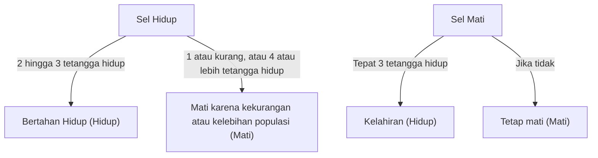

## 1. Apa itu [Game of Life Conway](https://kenji.blog/id/p/conways-game-of-life/)?

**[Game of Life Conway](https://kenji.blog/id/p/conways-game-of-life/)** adalah jenis **cellular automaton** yang dirancang oleh ahli matematika Inggris John Horton Conway pada tahun 1970. Meskipun disebut permainan, ini adalah "permainan nol pemain," yang berarti evolusinya ditentukan oleh keadaan awalnya, tidak memerlukan input lebih lanjut.

Daya tarik terbesar dari sistem ini terletak pada fakta bahwa **perilaku tidak terduga dan kompleks seperti kehidupan (kemunculan) dihasilkan dari aturan deterministik yang sangat sederhana**.

## 2. Aturan Game of Life

Game of Life terbentang pada kotak dua dimensi yang tak terbatas. Setiap kotak disebut "sel," yang bisa berada di salah satu dari dua keadaan: "Hidup" (Alive) atau "Mati" (Dead).
Keadaan setiap sel di generasi (langkah) berikutnya ditentukan berdasarkan keadaan 8 sel di sekitarnya (Moore neighborhood).

Hanya ada empat aturan:

1. **Kelahiran** (Reproduction):
   Setiap sel mati dengan tepat tiga tetangga hidup menjadi sel hidup di generasi berikutnya.
2. **Kelangsungan Hidup** (Survival):
   Setiap sel hidup dengan dua atau tiga tetangga hidup bertahan ke generasi berikutnya.
3. **Kekurangan Populasi** (Underpopulation):
   Setiap sel hidup dengan kurang dari dua tetangga hidup mati di generasi berikutnya, seolah-olah disebabkan oleh kekurangan populasi.
4. **Kelebihan Populasi** (Overpopulation):
   Setiap sel hidup dengan lebih dari tiga tetangga hidup mati di generasi berikutnya, seolah-olah karena kelebihan populasi.

Mengekspresikan ini secara matematis, biarkan keadaan sel $(x, y)$ pada waktu $t$ menjadi $S_{t}(x, y) \in \{0, 1\}$, dan jumlah tetangga yang hidup menjadi $N$.

$$
N = \sum_{i=-1}^{1} \sum_{j=-1}^{1} S_{t}(x+i, y+j) - S_{t}(x, y)
$$

Fungsi transisi keadaan $f$ didefinisikan sebagai berikut:

$$
S_{t+1}(x, y) = 
\begin{cases} 
1 & \text{if } S_{t}(x, y) = 0 \text{ and } N = 3 \\
1 & \text{if } S_{t}(x, y) = 1 \text{ and } (N = 2 \text{ or } N = 3) \\
0 & \text{otherwise}
\end{cases}
$$

Bagan alur untuk aturan ini adalah sebagai berikut:



## 3. Pola Terkenal

Meskipun aturannya sederhana, berbagai pola ada di Game of Life. Mereka terutama diklasifikasikan ke dalam kategori berikut.

### 3.1 Kehidupan Diam (Still Lifes)
Pola yang keadaannya tidak berubah sama sekali seiring berjalannya generasi.
- **Blok** (Block): 2x2 sel hidup.
- **Sarang Lebah** (Beehive): Segi enam yang terdiri dari 6 sel.

### 3.2 Osilator (Oscillators)
Pola yang kembali ke keadaan aslinya dalam periode waktu yang tetap.
- **Blinker**: 3 sel hidup tersusun dalam garis lurus, beralih secara vertikal dan horizontal dengan periode 2.
- **Pulsar**: Pola besar yang berubah dengan periode 3.

### 3.3 Pesawat Luar Angkasa (Spaceships)
Pola yang bergerak melintasi ruang angkasa sambil mempertahankan bentuknya.
- **Glider**: Terdiri dari 5 sel, bergerak secara diagonal, adalah pesawat luar angkasa yang paling terkenal. Ia juga dikenal sebagai simbol budaya peretas.

## 4. Signifikansi dalam Ilmu Komputer: Kelengkapan Turing

Salah satu sifat mengejutkan dari Game of Life adalah bahwa ia **lengkap secara Turing** (Turing complete). Dengan kata lain, mengingat kisi yang cukup besar dan keadaan awal yang sesuai, algoritma apa pun yang dapat dihitung oleh komputer modern dapat disimulasikan pada Game of Life ini.

Telah dibuktikan secara matematis bahwa operasi logis dapat dilakukan dengan menggunakan glider sebagai sinyal dan menempatkan kehidupan diam sebagai sirkuit logika (gerbang AND, gerbang OR, gerbang NOT, dll.).

## 5. Contoh Implementasi di Python

Game of Life juga sangat populer sebagai latihan pemrograman. Berikut adalah contoh implementasi sederhana menggunakan Python dan NumPy.

```python
import numpy as np
import matplotlib.pyplot as plt
import matplotlib.animation as animation

def update(frameNum, img, grid, N):
    """Fungsi untuk menghitung dan memperbarui kisi untuk generasi berikutnya"""
    newGrid = grid.copy()
    for i in range(N):
        for j in range(N):
            # Hitung jumlah sel tetangga dengan kondisi batas toroidal
            total = int((grid[i, (j-1)%N] + grid[i, (j+1)%N] +
                         grid[(i-1)%N, j] + grid[(i+1)%N, j] +
                         grid[(i-1)%N, (j-1)%N] + grid[(i-1)%N, (j+1)%N] +
                         grid[(i+1)%N, (j-1)%N] + grid[(i+1)%N, (j+1)%N]))
            
            # Terapkan aturan Conway
            if grid[i, j] == 1:
                if (total < 2) or (total > 3):
                    newGrid[i, j] = 0
            else:
                if total == 3:
                    newGrid[i, j] = 1
                    
    # Perbarui data
    img.set_data(newGrid)
    grid[:] = newGrid[:]
    return img,

# Ukuran kisi
N = 50
# Hasilkan keadaan awal acak (probabilitas 20% untuk hidup)
grid = np.random.choice([0, 1], N*N, p=[0.8, 0.2]).reshape(N, N)

fig, ax = plt.subplots()
img = ax.imshow(grid, interpolation='nearest', cmap='gray_r')
ani = animation.FuncAnimation(fig, update, fargs=(img, grid, N),
                              frames=10, interval=200, save_count=50)
plt.show()
```

## 6. Kesimpulan

[Game of Life Conway](https://kenji.blog/id/p/conways-game-of-life/) adalah salah satu contoh **kemunculan** (emergence) yang paling indah dan intuitif, tempat kompleksitas dihasilkan dari aturan sederhana. Berada di perbatasan matematika, ilmu komputer, fisika, dan biologi, model ini terus memberikan metafora yang kuat untuk pemahaman kita tentang konsep "kehidupan" dan "komputasi".
