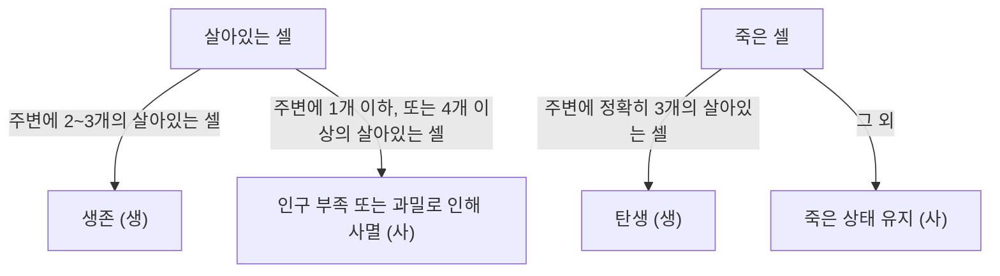

## 1. [콘웨이의 생명 게임](https://kenji.blog/ko/p/conways-game-of-life/)이란?

**[콘웨이의 생명 게임](https://kenji.blog/ko/p/conways-game-of-life/)** ([Conway's Game of Life](https://kenji.blog/ko/p/conways-game-of-life/))은 1970년 영국의 수학자 존 호튼 콘웨이(John Horton Conway)가 고안한 **셀룰러 [오토마타](/ko/p/automata-formal-language-theory/)**(Cellular Automaton)의 일종입니다. 게임이라는 이름이 붙어 있지만, 초기 상태를 설정한 후에는 규칙에 따라 자동으로 세대가 진행되는 '제로 플레이어 게임'입니다.

이 시스템의 가장 큰 매력은 **극히 단순한 결정론적 규칙에서 예측 불가능하고 복잡한 생명과 같은 행동(창발)이 만들어진다**는 점에 있습니다.

## 2. 생명 게임의 규칙

생명 게임은 무한히 펼쳐진 2차원 격자(그리드) 위에서 전개됩니다. 각 격자는 '셀(세포)'이라고 불리며, '생(Alive)' 또는 '사(Dead)' 두 가지 상태 중 하나를 가집니다.
각 셀은 주변을 둘러싼 8개의 셀(무어 이웃)의 상태를 기반으로 다음 세대(스텝)의 상태가 결정됩니다.

규칙은 다음 4가지뿐입니다.

1. **탄생** (Reproduction):
   죽은 셀에 인접한 살아있는 셀이 정확히 3개 있으면, 다음 세대에서 그 셀은 '생'이 됩니다.
2. **생존** (Survival):
   살아있는 셀에 인접한 살아있는 셀이 2개나 3개라면, 다음 세대에서도 생존합니다.
3. **인구 부족** (Underpopulation):
   살아있는 셀에 인접한 살아있는 셀이 1개 이하라면, 인구 부족으로 인해 다음 세대에서 '사'가 됩니다.
4. **인구 과밀** (Overpopulation):
   살아있는 셀에 인접한 살아있는 셀이 4개 이상이라면, 인구 과밀로 인해 다음 세대에서 '사'가 됩니다.

이를 수식으로 표현하면, 시간 $t$에서의 어떤 셀 $(x, y)$의 상태를 $S_{t}(x, y) \in \{0, 1\}$이라 하고, 이웃한 살아있는 셀의 수를 $N$이라고 합니다.

$$
N = \sum_{i=-1}^{1} \sum_{j=-1}^{1} S_{t}(x+i, y+j) - S_{t}(x, y)
$$

상태 전이 함수 $f$는 다음과 같이 정의됩니다.

$$
S_{t+1}(x, y) = 
\begin{cases} 
1 & \text{if } S_{t}(x, y) = 0 \text{ and } N = 3 \\
1 & \text{if } S_{t}(x, y) = 1 \text{ and } (N = 2 \text{ or } N = 3) \\
0 & \text{otherwise}
\end{cases}
$$

이 규칙의 순서도는 다음과 같습니다.



## 3. 유명한 패턴

단순한 규칙에도 불구하고 생명 게임에는 다양한 패턴이 존재합니다. 주로 다음 범주로 분류됩니다.

### 3.1 고정 물체 (Still Lifes)
세대가 지나도 상태가 전혀 변하지 않는 패턴입니다.
- **블록** (Block): 2x2의 살아있는 셀.
- **벌집** (Beehive): 6개의 셀로 구성된 육각형.

### 3.2 진동자 (Oscillators)
일정한 주기로 원래 상태로 돌아가는 패턴입니다.
- **블링커** (Blinker): 3개의 살아있는 셀이 일직선으로 늘어선 것으로, 주기 2로 가로세로가 전환됩니다.
- **펄사** (Pulsar): 주기 3으로 변하는 큰 패턴.

### 3.3 이동 물체 (Spaceships)
형태를 유지하면서 공간을 이동하는 패턴입니다.
- **글라이더** (Glider): 5개의 셀로 구성되어 대각선 방향으로 나아가는 가장 유명한 이동 물체입니다. 해커 문화의 상징으로도 알려져 있습니다.

## 4. 컴퓨터 과학에서의 의의: 튜링 완전성

생명 게임의 놀라운 특성 중 하나는 그것이 **튜링 완전**(Turing complete)하다는 것입니다. 즉, 충분히 넓은 그리드와 적절한 초기 상태가 주어지면 현대 컴퓨터로 계산 가능한 모든 알고리즘을 이 생명 게임 위에서 시뮬레이션할 수 있습니다.

글라이더를 신호로 사용하고 고정 물체를 논리 회로(AND 게이트, OR 게이트, NOT 게이트 등)로 배치함으로써 논리 연산을 수행할 수 있음이 수학적으로 증명되었습니다.

## 5. Python을 활용한 구현 예시

생명 게임은 프로그래밍 연습 문제로도 매우 인기가 있습니다. 여기서는 Python과 NumPy를 사용한 간단한 구현 예시를 소개합니다.

```python
import numpy as np
import matplotlib.pyplot as plt
import matplotlib.animation as animation

def update(frameNum, img, grid, N):
    """다음 세대의 그리드를 계산하고 업데이트하는 함수"""
    newGrid = grid.copy()
    for i in range(N):
        for j in range(N):
            # 원환면(Torus) 형태의 경계 조건으로 이웃 셀의 합 계산
            total = int((grid[i, (j-1)%N] + grid[i, (j+1)%N] +
                         grid[(i-1)%N, j] + grid[(i+1)%N, j] +
                         grid[(i-1)%N, (j-1)%N] + grid[(i-1)%N, (j+1)%N] +
                         grid[(i+1)%N, (j-1)%N] + grid[(i+1)%N, (j+1)%N]))
            
            # 콘웨이의 규칙 적용
            if grid[i, j] == 1:
                if (total < 2) or (total > 3):
                    newGrid[i, j] = 0
            else:
                if total == 3:
                    newGrid[i, j] = 1
                    
    # 데이터 업데이트
    img.set_data(newGrid)
    grid[:] = newGrid[:]
    return img,

# 그리드 크기
N = 50
# 무작위 초기 상태 생성 (살아있을 확률 20%)
grid = np.random.choice([0, 1], N*N, p=[0.8, 0.2]).reshape(N, N)

fig, ax = plt.subplots()
img = ax.imshow(grid, interpolation='nearest', cmap='gray_r')
ani = animation.FuncAnimation(fig, update, fargs=(img, grid, N),
                              frames=10, interval=200, save_count=50)
plt.show()
```

## 6. 결론

[콘웨이의 생명 게임](https://kenji.blog/ko/p/conways-game-of-life/)은 단순한 규칙에서 복잡성이 만들어지는 **창발**의 가장 아름답고 직관적인 예 중 하나입니다. 수학, 컴퓨터 과학, 물리학, 생물학의 경계에 있는 이 모델은 우리가 '생명'과 '계산'이라는 개념을 이해하기 위한 강력한 은유를 계속해서 제공하고 있습니다.
