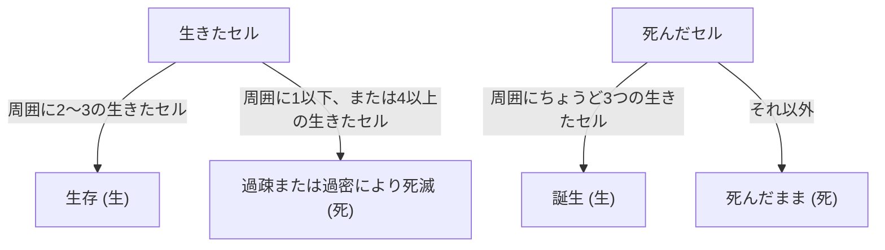

## 1. コンウェイのライフゲームとは？

**コンウェイのライフゲーム** (Conway's Game of Life) は、1970年にイギリスの数学者ジョン・ホートン・コンウェイ (John Horton Conway) によって考案された **セル・オートマトン** (Cellular Automaton) の一種です。ゲームという名前がついていますが、プレイヤーが操作するものではなく、初期状態を設定した後はルールに従って自動的に世代が進行する「ゼロプレイヤーゲーム」です。

このシステムの最大の魅力は、**極めて単純な決定論的ルールから、予測不可能で複雑な生命のような振る舞い（創発）が生み出される** 点にあります。

## 2. ライフゲームのルール

ライフゲームは、無限に広がる二次元の格子（グリッド）上で展開されます。各格子は「セル (細胞)」と呼ばれ、「生 (Alive)」か「死 (Dead)」のいずれかの状態を持ちます。
それぞれのセルは、周囲を囲む8つのセル（ムーア近傍）の状態に基づいて、次の世代（ステップ）の状態が決定されます。

ルールは以下の4つだけです。

1. **誕生** (Reproduction):
   死んでいるセルに隣接する生きたセルがちょうど3つあれば、次の世代でそのセルは「生」になります。
2. **生存** (Survival):
   生きているセルに隣接する生きたセルが2つか3つならば、次の世代でも生存します。
3. **過疎** (Underpopulation):
   生きているセルに隣接する生きたセルが1つ以下ならば、過疎により次の世代で「死」になります。
4. **過密** (Overpopulation):
   生きているセルに隣接する生きたセルが4つ以上ならば、過密により次の世代で「死」になります。

これを数式で表現すると、時刻 $t$ におけるあるセル $(x, y)$ の状態を $S_{t}(x, y) \in \{0, 1\}$ とし、その近傍の生きたセルの数を $N$ とします。

$$
N = \sum_{i=-1}^{1} \sum_{j=-1}^{1} S_{t}(x+i, y+j) - S_{t}(x, y)
$$

状態の遷移関数 $f$ は次のように定義されます。

$$
S_{t+1}(x, y) = 
\begin{cases} 
1 & \text{if } S_{t}(x, y) = 0 \text{ and } N = 3 \\
1 & \text{if } S_{t}(x, y) = 1 \text{ and } (N = 2 \text{ or } N = 3) \\
0 & \text{otherwise}
\end{cases}
$$

このルールのフローチャートは以下のようになります。



## 3. 有名なパターン

単純なルールにもかかわらず、ライフゲームには多様なパターンが存在します。主に以下のカテゴリに分類されます。

### 3.1 固定物体 (Still Lifes)
世代が進んでも状態が全く変化しないパターンです。
- **ブロック** (Block): 2x2の生きたセル。
- **蜂の巣** (Beehive): 6つのセルで構成される六角形。

### 3.2 振動子 (Oscillators)
一定の周期で元の状態に戻るパターンです。
- **ブリンカー** (Blinker): 3つの生きたセルが直線に並んだもので、周期2で縦横が切り替わります。
- **パルサー** (Pulsar): 周期3で変化する大きなパターン。

### 3.3 移動物体 (Spaceships)
形を保ちながら空間を移動していくパターンです。
- **グライダー** (Glider): 5つのセルで構成され、斜め方向に進む最も有名な移動物体。ハッカー文化のシンボルとしても知られています。

## 4. 計算科学における意義：チューリング完全

ライフゲームの驚くべき特性の一つは、それが **チューリング完全** (Turing complete) であるということです。つまり、十分な広さのグリッドと適切な初期状態を与えれば、現代のコンピューターで計算可能なあらゆるアルゴリズムを、このライフゲーム上でシミュレートすることができます。

グライダーを信号として使い、固定物体を論理回路（ANDゲート、ORゲート、NOTゲートなど）として配置することで、論理演算を行うことが数学的に証明されています。

## 5. Pythonによる実装例

ライフゲームはプログラミングの練習問題としても非常に人気があります。ここでは、PythonとNumPyを用いた簡単な実装例を紹介します。

```python
import numpy as np
import matplotlib.pyplot as plt
import matplotlib.animation as animation

def update(frameNum, img, grid, N):
    """次の世代のグリッドを計算して更新する関数"""
    newGrid = grid.copy()
    for i in range(N):
        for j in range(N):
            # トーラス状の境界条件で近傍のセルの合計を計算
            total = int((grid[i, (j-1)%N] + grid[i, (j+1)%N] +
                         grid[(i-1)%N, j] + grid[(i+1)%N, j] +
                         grid[(i-1)%N, (j-1)%N] + grid[(i-1)%N, (j+1)%N] +
                         grid[(i+1)%N, (j-1)%N] + grid[(i+1)%N, (j+1)%N]))
            
            # コンウェイのルールを適用
            if grid[i, j] == 1:
                if (total < 2) or (total > 3):
                    newGrid[i, j] = 0
            else:
                if total == 3:
                    newGrid[i, j] = 1
                    
    # データを更新
    img.set_data(newGrid)
    grid[:] = newGrid[:]
    return img,

# グリッドのサイズ
N = 50
# ランダムな初期状態の生成 (20%の確率で生)
grid = np.random.choice([0, 1], N*N, p=[0.8, 0.2]).reshape(N, N)

fig, ax = plt.subplots()
img = ax.imshow(grid, interpolation='nearest', cmap='gray_r')
ani = animation.FuncAnimation(fig, update, fargs=(img, grid, N),
                              frames=10, interval=200, save_count=50)
plt.show()
```

## 6. まとめ

コンウェイのライフゲームは、単純なルールから複雑性が生み出される **創発** の最も美しく、直感的な例の一つです。数学、情報科学、物理学、そして生物学の境界領域にあるこのモデルは、私たちが「生命」や「計算」という概念を理解するための強力なメタファーを提供し続けています。
