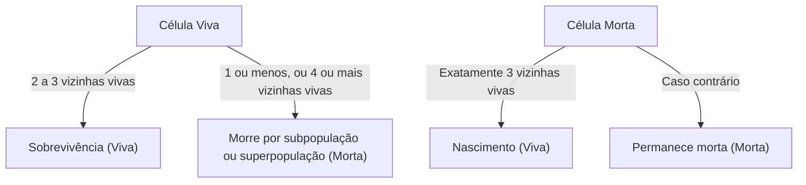

## 1. O que é o Jogo da Vida de Conway?

O **Jogo da Vida de Conway** ([Conway's Game of Life](https://kenji.blog/p/conways-game-of-life/)) é um tipo de **autômato celular** inventado pelo matemático britânico John Horton Conway em 1970. Embora seja chamado de jogo, é um "jogo de zero jogadores", o que significa que sua evolução é determinada pelo seu estado inicial, não necessitando de nenhuma entrada adicional.

O maior atrativo deste sistema reside no fato de que **comportamentos complexos e imprevisíveis semelhantes à vida (emergência) são gerados a partir de regras determinísticas extremamente simples**.

## 2. Regras do Jogo da Vida

O Jogo da Vida se desenrola em uma grade bidimensional infinita. Cada espaço é chamado de "célula", que pode estar em um de dois estados: "Viva" ou "Morta".
O estado de cada célula na próxima geração (passo) é determinado com base nos estados de suas 8 células vizinhas (vizinhança de Moore).

Existem apenas quatro regras:

1. **Nascimento** (Reproduction):
   Qualquer célula morta com exatamente três vizinhas vivas se torna uma célula viva na próxima geração.
2. **Sobrevivência** (Survival):
   Qualquer célula viva com duas ou três vizinhas vivas sobrevive para a próxima geração.
3. **Subpopulação** (Underpopulation):
   Qualquer célula viva com menos de duas vizinhas vivas morre na próxima geração, como se fosse por isolamento.
4. **Superpopulação** (Overpopulation):
   Qualquer célula viva com mais de três vizinhas vivas morre na próxima geração, devido à superpopulação.

Expressando isso matematicamente, seja o estado de uma célula $(x, y)$ no tempo $t$ $S_{t}(x, y) \in \{0, 1\}$, e o número de vizinhas vivas $N$.

$$
N = \sum_{i=-1}^{1} \sum_{j=-1}^{1} S_{t}(x+i, y+j) - S_{t}(x, y)
$$

A função de transição de estado $f$ é definida da seguinte forma:

$$
S_{t+1}(x, y) = 
\begin{cases} 
1 & \text{if } S_{t}(x, y) = 0 \text{ and } N = 3 \\
1 & \text{if } S_{t}(x, y) = 1 \text{ and } (N = 2 \text{ or } N = 3) \\
0 & \text{otherwise}
\end{cases}
$$

O fluxograma para essas regras é o seguinte:



## 3. Padrões Famosos

Apesar das regras simples, existe uma variedade de padrões no Jogo da Vida. Eles são classificados principalmente nas seguintes categorias.

### 3.1 Vidas Estáticas (Still Lifes)
Padrões cujo estado não muda de forma alguma com o passar das gerações.
- **Bloco** (Block): 2x2 células vivas.
- **Colmeia** (Beehive): Um hexágono composto por 6 células.

### 3.2 Osciladores (Oscillators)
Padrões que retornam ao seu estado original em um período fixo.
- **Pisca-pisca** (Blinker): 3 células vivas dispostas em linha reta, mudando vertical e horizontalmente com um período de 2.
- **Pulsar**: Um padrão grande que muda com um período de 3.

### 3.3 Naves Espaciais (Spaceships)
Padrões que se movem pelo espaço enquanto mantêm sua forma.
- **Planador** (Glider): Composto por 5 células, movendo-se diagonalmente, é a nave espacial mais famosa. É também conhecida como um símbolo da cultura hacker.

## 4. Significado na Ciência da Computação: Completude de Turing

Uma das propriedades surpreendentes do Jogo da Vida é que ele é **Turing completo**. Em outras palavras, dada uma grade suficientemente grande e um estado inicial apropriado, qualquer algoritmo que possa ser calculado por um computador moderno pode ser simulado neste Jogo da Vida.

Foi provado matematicamente que operações lógicas podem ser realizadas usando planadores como sinais e colocando vidas estáticas como circuitos lógicos (portas AND, portas OR, portas NOT, etc.).

## 5. Exemplo de Implementação em Python

O Jogo da Vida é também muito popular como um exercício de programação. Aqui está um exemplo de implementação simples usando Python e NumPy.

```python
import numpy as np
import matplotlib.pyplot as plt
import matplotlib.animation as animation

def update(frameNum, img, grid, N):
    """Função para calcular e atualizar a grade para a próxima geração"""
    newGrid = grid.copy()
    for i in range(N):
        for j in range(N):
            # Calcular a soma de células vizinhas com condições de contorno toroidais
            total = int((grid[i, (j-1)%N] + grid[i, (j+1)%N] +
                         grid[(i-1)%N, j] + grid[(i+1)%N, j] +
                         grid[(i-1)%N, (j-1)%N] + grid[(i-1)%N, (j+1)%N] +
                         grid[(i+1)%N, (j-1)%N] + grid[(i+1)%N, (j+1)%N]))
            
            # Aplicar as regras de Conway
            if grid[i, j] == 1:
                if (total < 2) or (total > 3):
                    newGrid[i, j] = 0
            else:
                if total == 3:
                    newGrid[i, j] = 1
                    
    # Atualizar dados
    img.set_data(newGrid)
    grid[:] = newGrid[:]
    return img,

# Tamanho da grade
N = 50
# Gerar um estado inicial aleatório (probabilidade de 20% de estar vivo)
grid = np.random.choice([0, 1], N*N, p=[0.8, 0.2]).reshape(N, N)

fig, ax = plt.subplots()
img = ax.imshow(grid, interpolation='nearest', cmap='gray_r')
ani = animation.FuncAnimation(fig, update, fargs=(img, grid, N),
                              frames=10, interval=200, save_count=50)
plt.show()
```

## 6. Conclusão

[O Jogo da Vida de Conway](https://kenji.blog/p/conways-game-of-life/) é um dos exemplos mais belos e intuitivos de **emergência**, onde a complexidade é gerada a partir de regras simples. Situado nas fronteiras da matemática, ciência da computação, física e biologia, este modelo continua a fornecer uma metáfora poderosa para a nossa compreensão dos conceitos de "vida" e "computação".
