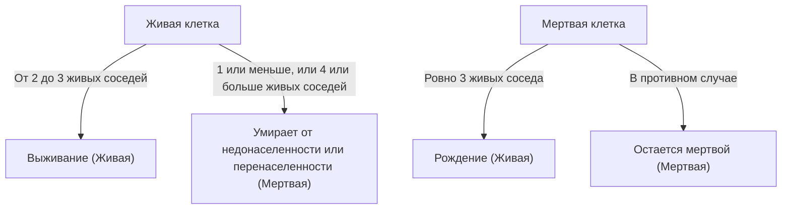

## 1. Что такое [Игра «Жизнь» Конвея](https://kenji.blog/ru/p/conways-game-of-life/)?

**[Игра «Жизнь» Конвея](https://kenji.blog/ru/p/conways-game-of-life/)** ([Conway's Game of Life](https://kenji.blog/ru/p/conways-game-of-life/)) — это тип **клеточного автомата**, разработанный британским математиком Джоном Хортоном Конвеем в 1970 году. Хотя это называется игрой, это «игра без игроков», что означает, что ее развитие определяется начальным состоянием, не требуя дальнейшего вмешательства.

Наибольшая привлекательность этой системы заключается в том, что **непредсказуемое и сложное поведение, подобное жизни (эмерджентность), генерируется из чрезвычайно простых детерминированных правил**.

## 2. Правила игры «Жизнь»

Игра «Жизнь» разворачивается на бесконечной двумерной сетке. Каждая клетка сетки называется «клеткой» (cell), которая может находиться в одном из двух состояний: «Живая» (Alive) или «Мертвая» (Dead).
Состояние каждой клетки в следующем поколении (шаге) определяется на основе состояний ее 8 окружающих клеток (окрестность Мура).

Существует всего четыре правила:

1. **Рождение** (Reproduction):
   Любая мертвая клетка, имеющая ровно три живых соседа, становится живой клеткой в следующем поколении.
2. **Выживание** (Survival):
   Любая живая клетка, имеющая два или три живых соседа, выживает в следующем поколении.
3. **Недонаселенность** (Underpopulation):
   Любая живая клетка, имеющая менее двух живых соседей, умирает в следующем поколении, как бы от недонаселенности.
4. **Перенаселенность** (Overpopulation):
   Любая живая клетка, имеющая более трех живых соседей, умирает в следующем поколении, как бы от перенаселенности.

Выражая это математически, пусть состояние клетки $(x, y)$ в момент времени $t$ будет $S_{t}(x, y) \in \{0, 1\}$, а количество живых соседей — $N$.

$$
N = \sum_{i=-1}^{1} \sum_{j=-1}^{1} S_{t}(x+i, y+j) - S_{t}(x, y)
$$

Функция перехода состояний $f$ определяется следующим образом:

$$
S_{t+1}(x, y) = 
\begin{cases} 
1 & \text{if } S_{t}(x, y) = 0 \text{ and } N = 3 \\
1 & \text{if } S_{t}(x, y) = 1 \text{ and } (N = 2 \text{ or } N = 3) \\
0 & \text{otherwise}
\end{cases}
$$

Блок-схема для этих правил выглядит следующим образом:



## 3. Известные паттерны

Несмотря на простые правила, в игре «Жизнь» существует множество паттернов. В основном они классифицируются по следующим категориям.

### 3.1 Статические фигуры (Still Lifes)
Паттерны, состояние которых совершенно не меняется с течением поколений.
- **Блок** (Block): 2x2 живые клетки.
- **Улей** (Beehive): Шестиугольник, состоящий из 6 клеток.

### 3.2 Осцилляторы (Oscillators)
Паттерны, возвращающиеся в исходное состояние через фиксированный период.
- **Мигалка** (Blinker): 3 живые клетки, расположенные по прямой линии, переключающиеся по вертикали и горизонтали с периодом 2.
- **Пульсар** (Pulsar): Большой паттерн, меняющийся с периодом 3.

### 3.3 Космические корабли (Spaceships)
Паттерны, которые перемещаются в пространстве, сохраняя свою форму.
- **Планер** (Glider): Состоящий из 5 клеток, движущийся по диагонали, является самым известным космическим кораблем. Он также известен как символ хакерской культуры.

## 4. Значение в информатике: Полнота по Тьюрингу

Одним из удивительных свойств игры «Жизнь» является то, что она **полна по Тьюрингу** (Turing complete). Другими словами, при наличии достаточно большой сетки и соответствующего начального состояния любой алгоритм, который может быть вычислен современным компьютером, может быть смоделирован в этой игре «Жизнь».

Математически доказано, что логические операции могут выполняться с использованием планеров в качестве сигналов и размещения статических фигур в качестве логических схем (вентили И, вентили ИЛИ, вентили НЕ и т.д.).

## 5. Пример реализации на Python

Игра «Жизнь» также очень популярна в качестве упражнения по программированию. Вот простой пример реализации с использованием Python и NumPy.

```python
import numpy as np
import matplotlib.pyplot as plt
import matplotlib.animation as animation

def update(frameNum, img, grid, N):
    """Функция для вычисления и обновления сетки для следующего поколения"""
    newGrid = grid.copy()
    for i in range(N):
        for j in range(N):
            # Вычислить сумму соседних клеток с тороидальными граничными условиями
            total = int((grid[i, (j-1)%N] + grid[i, (j+1)%N] +
                         grid[(i-1)%N, j] + grid[(i+1)%N, j] +
                         grid[(i-1)%N, (j-1)%N] + grid[(i-1)%N, (j+1)%N] +
                         grid[(i+1)%N, (j-1)%N] + grid[(i+1)%N, (j+1)%N]))
            
            # Применить правила Конвея
            if grid[i, j] == 1:
                if (total < 2) or (total > 3):
                    newGrid[i, j] = 0
            else:
                if total == 3:
                    newGrid[i, j] = 1
                    
    # Обновить данные
    img.set_data(newGrid)
    grid[:] = newGrid[:]
    return img,

# Размер сетки
N = 50
# Сгенерировать случайное начальное состояние (вероятность того, что клетка жива — 20%)
grid = np.random.choice([0, 1], N*N, p=[0.8, 0.2]).reshape(N, N)

fig, ax = plt.subplots()
img = ax.imshow(grid, interpolation='nearest', cmap='gray_r')
ani = animation.FuncAnimation(fig, update, fargs=(img, grid, N),
                              frames=10, interval=200, save_count=50)
plt.show()
```

## 6. Заключение

[Игра «Жизнь» Конвея](https://kenji.blog/ru/p/conways-game-of-life/) — это один из самых красивых и интуитивно понятных примеров **эмерджентности**, когда сложность возникает из простых правил. Находясь на стыке математики, информатики, физики и биологии, эта модель продолжает служить мощной метафорой для нашего понимания концепций «жизни» и «вычислений».
