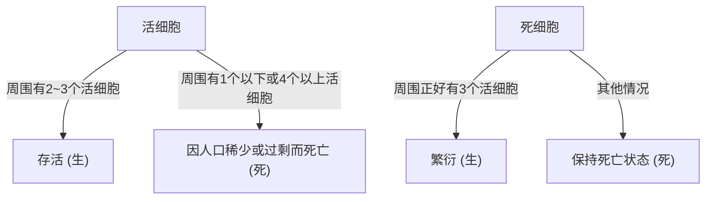

## 1. 什么是[康威生命游戏](https://kenji.blog/zh-cn/p/conways-game-of-life/)？

**[康威生命游戏](https://kenji.blog/zh-cn/p/conways-game-of-life/)**（[Conway's Game of Life](https://kenji.blog/zh-cn/p/conways-game-of-life/)）是英国数学家约翰·何顿·康威（John Horton Conway）于1970年发明的一种**元胞[自动机](/zh-cn/p/automata-formal-language-theory/)**（Cellular Automaton）。虽然被称为游戏，但它是一个“零玩家游戏”，这意味着它的演化完全由初始状态决定，不需要进一步的输入。

这个系统最大的魅力在于：**从极其简单的确定性规则中，能够产生不可预测且复杂的类生命行为（涌现）**。

## 2. 生命游戏的规则

生命游戏在一个无限延伸的二维网格上进行。每个网格被称为一个“细胞”（Cell），它可以处于两种状态之一：“生”（Alive）或“死”（Dead）。
每个细胞在下一代（步骤）的状态，是根据其周围8个相邻细胞（摩尔邻居）的状态来决定的。

规则只有以下4条：

1. **繁衍** (Reproduction)：
   任何一个死细胞如果正好有3个活的相邻细胞，则在下一代变为活细胞。
2. **存活** (Survival)：
   任何一个活细胞如果只有2个或3个活的相邻细胞，则在下一代继续存活。
3. **人口稀少** (Underpopulation)：
   任何一个活细胞如果少于2个活的相邻细胞，则在下一代死亡，仿佛是因为人口稀少。
4. **人口过剩** (Overpopulation)：
   任何一个活细胞如果有4个或更多的相邻细胞，则在下一代死亡，仿佛是因为人口过剩。

用数学公式表达，假设时间 $t$ 某细胞 $(x, y)$ 的状态为 $S_{t}(x, y) \in \{0, 1\}$，活着的邻居数量为 $N$。

$$
N = \sum_{i=-1}^{1} \sum_{j=-1}^{1} S_{t}(x+i, y+j) - S_{t}(x, y)
$$

状态转移函数 $f$ 定义如下：

$$
S_{t+1}(x, y) = 
\begin{cases} 
1 & \text{if } S_{t}(x, y) = 0 \text{ and } N = 3 \\
1 & \text{if } S_{t}(x, y) = 1 \text{ and } (N = 2 \text{ or } N = 3) \\
0 & \text{otherwise}
\end{cases}
$$

这些规则的流程图如下：



## 3. 著名图案

尽管规则简单，生命游戏中仍存在多种多样的图案。它们主要分为以下几类。

### 3.1 静物 (Still Lifes)
随着世代的推移，状态完全不发生改变的图案。
- **方块** (Block)：2x2的活细胞。
- **蜂巢** (Beehive)：由6个细胞组成的六边形。

### 3.2 振荡器 (Oscillators)
以一定周期恢复到原来状态的图案。
- **闪光灯** (Blinker)：3个活细胞排成一条直线，以周期2进行横竖切换。
- **脉冲星** (Pulsar)：周期为3的大型变化图案。

### 3.3 宇宙飞船 (Spaceships)
保持形状的同时在空间中移动的图案。
- **滑翔机** (Glider)：由5个细胞组成，沿对角线方向移动，是最著名的宇宙飞船。它也被称为黑客文化的象征。

## 4. 计算机科学中的意义：图灵完备

生命游戏令人惊讶的特性之一是它是**图灵完备**（Turing complete）的。换句话说，只要给定足够大的网格和合适的初始状态，任何可以由现代计算机计算的算法都可以通过这个生命游戏来模拟。

数学上已经证明，可以通过将滑翔机作为信号，将静物放置为逻辑电路（与门、或门、非门等）来进行逻辑运算。

## 5. Python实现示例

生命游戏作为编程练习也非常受欢迎。这里介绍一个使用Python和NumPy的简单实现示例。

```python
import numpy as np
import matplotlib.pyplot as plt
import matplotlib.animation as animation

def update(frameNum, img, grid, N):
    """计算并更新下一代网格的函数"""
    newGrid = grid.copy()
    for i in range(N):
        for j in range(N):
            # 在环形边界条件下计算相邻细胞的总和
            total = int((grid[i, (j-1)%N] + grid[i, (j+1)%N] +
                         grid[(i-1)%N, j] + grid[(i+1)%N, j] +
                         grid[(i-1)%N, (j-1)%N] + grid[(i-1)%N, (j+1)%N] +
                         grid[(i+1)%N, (j-1)%N] + grid[(i+1)%N, (j+1)%N]))
            
            # 应用康威的规则
            if grid[i, j] == 1:
                if (total < 2) or (total > 3):
                    newGrid[i, j] = 0
            else:
                if total == 3:
                    newGrid[i, j] = 1
                    
    # 更新数据
    img.set_data(newGrid)
    grid[:] = newGrid[:]
    return img,

# 网格大小
N = 50
# 生成随机的初始状态 (20%的概率为活)
grid = np.random.choice([0, 1], N*N, p=[0.8, 0.2]).reshape(N, N)

fig, ax = plt.subplots()
img = ax.imshow(grid, interpolation='nearest', cmap='gray_r')
ani = animation.FuncAnimation(fig, update, fargs=(img, grid, N),
                              frames=10, interval=200, save_count=50)
plt.show()
```

## 6. 总结

[康威生命游戏](https://kenji.blog/zh-cn/p/conways-game-of-life/)是从简单规则中产生复杂性的**涌现**的最美丽、最直观的例子之一。处于数学、计算机科学、物理学和生物学边界的这个模型，继续为我们理解“生命”和“计算”的概念提供强大的隐喻。
