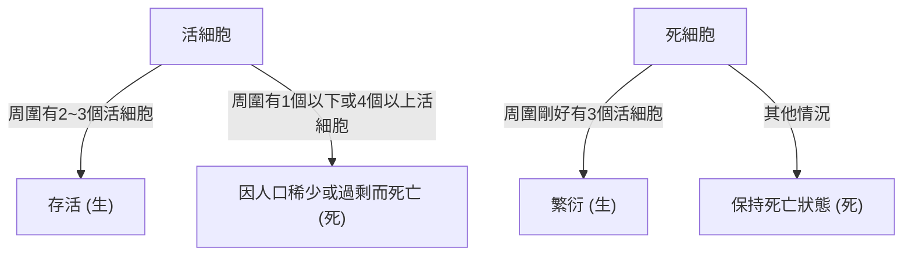

## 1. 什麼是[康威生命遊戲](https://kenji.blog/zh-tw/p/conways-game-of-life/)？

**[康威生命遊戲](https://kenji.blog/zh-tw/p/conways-game-of-life/)**（[Conway's Game of Life](https://kenji.blog/zh-tw/p/conways-game-of-life/)）是英國數學家約翰·何頓·康威（John Horton Conway）於1970年發明的一種**元胞自動機**（Cellular Automaton）。雖然被稱為遊戲，但它是一個「零玩家遊戲」，這意味著它的演化完全由初始狀態決定，不需要進一步的輸入。

這個系統最大的魅力在於：**從極其簡單的決定性規則中，能夠產生不可預測且複雜的類生命行為（湧現）**。

## 2. 生命遊戲的規則

生命遊戲在一個無限延伸的二維網格上進行。每個網格被稱為一個「細胞」（Cell），它可以處於兩種狀態之一：「生」（Alive）或「死」（Dead）。
每個細胞在下一代（步驟）的狀態，是根據其周圍8個相鄰細胞（摩爾鄰居）的狀態來決定的。

規則只有以下4條：

1. **繁衍** (Reproduction)：
   任何一個死細胞如果剛好有3個活的相鄰細胞，則在下一代變為活細胞。
2. **存活** (Survival)：
   任何一個活細胞如果只有2個或3個活的相鄰細胞，則在下一代繼續存活。
3. **人口稀少** (Underpopulation)：
   任何一個活細胞如果少於2個活的相鄰細胞，則在下一代死亡，彷彿是因為人口稀少。
4. **人口過剩** (Overpopulation)：
   任何一個活細胞如果有4個或更多的相鄰細胞，則在下一代死亡，彷彿是因為人口過剩。

用數學公式表達，假設時間 $t$ 某細胞 $(x, y)$ 的狀態為 $S_{t}(x, y) \in \{0, 1\}$，活著的鄰居數量為 $N$。

$$
N = \sum_{i=-1}^{1} \sum_{j=-1}^{1} S_{t}(x+i, y+j) - S_{t}(x, y)
$$

狀態轉移函數 $f$ 定義如下：

$$
S_{t+1}(x, y) = 
\begin{cases} 
1 & \text{if } S_{t}(x, y) = 0 \text{ and } N = 3 \\
1 & \text{if } S_{t}(x, y) = 1 \text{ and } (N = 2 \text{ or } N = 3) \\
0 & \text{otherwise}
\end{cases}
$$

這些規則的流程圖如下：



## 3. 著名圖案

儘管規則簡單，生命遊戲中仍存在多種多樣的圖案。它們主要分為以下幾類。

### 3.1 靜物 (Still Lifes)
隨著世代的推移，狀態完全不發生改變的圖案。
- **方塊** (Block)：2x2的活細胞。
- **蜂巢** (Beehive)：由6個細胞組成的六邊形。

### 3.2 振盪器 (Oscillators)
以一定週期恢復到原來狀態的圖案。
- **閃光燈** (Blinker)：3個活細胞排成一條直線，以週期2進行橫豎切換。
- **脈衝星** (Pulsar)：週期為3的大型變化圖案。

### 3.3 宇宙飛船 (Spaceships)
保持形狀的同時在空間中移動的圖案。
- **滑翔機** (Glider)：由5個細胞組成，沿對角線方向移動，是最著名的宇宙飛船。它也被稱為駭客文化的象徵。

## 4. 計算機科學中的意義：圖靈完備

生命遊戲令人驚訝的特性之一是它是**圖靈完備**（Turing complete）的。換句話說，只要給定足夠大的網格和合適的初始狀態，任何可以由現代計算機計算的演算法都可以透過這個生命遊戲來模擬。

數學上已經證明，可以透過將滑翔機作為信號，將靜物放置為邏輯電路（及閘、或閘、反閘等）來進行邏輯運算。

## 5. Python實現範例

生命遊戲作為程式設計練習也非常受歡迎。這裡介紹一個使用Python和NumPy的簡單實現範例。

```python
import numpy as np
import matplotlib.pyplot as plt
import matplotlib.animation as animation

def update(frameNum, img, grid, N):
    """計算並更新下一代網格的函數"""
    newGrid = grid.copy()
    for i in range(N):
        for j in range(N):
            # 在環形邊界條件下計算相鄰細胞的總和
            total = int((grid[i, (j-1)%N] + grid[i, (j+1)%N] +
                         grid[(i-1)%N, j] + grid[(i+1)%N, j] +
                         grid[(i-1)%N, (j-1)%N] + grid[(i-1)%N, (j+1)%N] +
                         grid[(i+1)%N, (j-1)%N] + grid[(i+1)%N, (j+1)%N]))
            
            # 應用康威的規則
            if grid[i, j] == 1:
                if (total < 2) or (total > 3):
                    newGrid[i, j] = 0
            else:
                if total == 3:
                    newGrid[i, j] = 1
                    
    # 更新資料
    img.set_data(newGrid)
    grid[:] = newGrid[:]
    return img,

# 網格大小
N = 50
# 生成隨機的初始狀態 (20%的機率為活)
grid = np.random.choice([0, 1], N*N, p=[0.8, 0.2]).reshape(N, N)

fig, ax = plt.subplots()
img = ax.imshow(grid, interpolation='nearest', cmap='gray_r')
ani = animation.FuncAnimation(fig, update, fargs=(img, grid, N),
                              frames=10, interval=200, save_count=50)
plt.show()
```

## 6. 總結

[康威生命遊戲](https://kenji.blog/zh-tw/p/conways-game-of-life/)是從簡單規則中產生複雜性的**湧現**的最美麗、最直觀的例子之一。處於數學、計算機科學、物理學和生物學邊界的這个模型，繼續為我們理解「生命」和「計算」的概念提供強大的隱喻。
