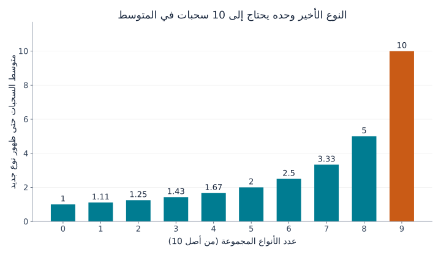
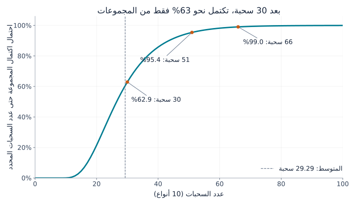
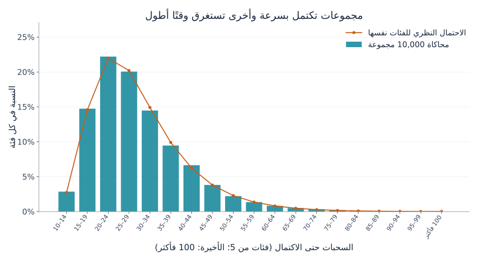

## 1. لماذا تتأخر البطاقة الأخيرة؟

تخيّل مجموعة من 10 أنواع من البطاقات، في كل عبوة مغلقة بطاقة واحدة، وجميع الأنواع متساوية الاحتمال. في البداية تضيف معظم العبوات نوعًا جديدًا. ثم تتراكم البطاقات المكررة. وعندما يبقى نوع واحد، يبدو الانتظار طويلًا على نحو خاص.

تصف **[مسألة جامع القسائم](https://kenji.blog/p/coupon-collector-problem/)** هذه التجربة رياضيًا. والقسيمة هنا ليست بالضرورة قسيمة خصم، بل أي عنصر قابل للجمع وله أنواع مميزة، مثل البطاقات أو الملصقات أو الألعاب الصغيرة.

الجواب لعشرة أنواع هو **نحو 29.3 سحبة في المتوسط**. لكن هذا لا يعني أن 30 سحبة تكفي بصورة مضمونة. احتمال الاكتمال خلالها يقارب 62.9%، وللوصول إلى احتمال لا يقل عن 95% نحتاج إلى 51 سحبة. سنشتق هذه الأرقام، ونعرض التفاوت في الرسوم، ثم نختبرها باستخدام Python.

## 2. تحديد قواعد السحب أولًا

يفترض النموذج الأساسي ما يلي:

- يوجد $n$ من الأنواع، وتمنح كل سحبة بطاقة واحدة.
- احتمال كل نوع في كل سحبة هو نفسه، ويساوي $1/n$.
- السحبات مستقلة؛ فلا تؤثر النتائج السابقة في السحبة التالية.
- يمكن تكرار النوع نفسه، ولا توجد مبادلة أو آلية لمنع التكرار.
- نبدأ بمجموعة فارغة ونتوقف بعد الحصول على كل نوع مرة واحدة على الأقل.

هذا سحب **مع الإرجاع**، مثل إعادة الكرة إلى الصندوق قبل السحب مجددًا. أما السحب من مخزون محدود دون إرجاع، أو شراء صندوق يضمن وجود جميع الأنواع، فيحتاج إلى نموذج مختلف.

نرمز لعدد السحبات حتى الاكتمال بـ $T$. وهو **متغير عشوائي** يختلف من تجربة إلى أخرى. أما **القيمة المتوقعة** $E[T]$ فهي المتوسط عند تكرار جمع المجموعة من الصفر مرات كثيرة، وليست تنبؤًا بنتيجة شخص بعينه. سنستخدم غالبًا $n=10$، لكن الصيغ تصلح لأي عدد صحيح موجب من الأنواع.

## 3. تقسيم العملية إلى انتظار النوع الجديد التالي

### كلما جمعنا أنواعًا أكثر قلّت النتائج الجديدة

إذا كان لدينا $k$ من الأنواع، فما زال ينقصنا $n-k$. واحتمال ظهور نوع جديد في السحبة التالية هو

$$
p_k=\frac{n-k}{n}
$$

مع عشرة أنواع، تكون البطاقة الأولى جديدة بالتأكيد. بعد جمع خمسة أنواع يكون الاحتمال $5/10$، وبعد جمع تسعة يصبح $1/10$ فقط.

لم تصبح البطاقات نفسها أندر. بل **قلّ عدد النتائج التي نعدّها جديدة بالنسبة إلينا**. لذلك لا يلزم أن تتغير آلية السحب حتى يتباطأ الجمع في نهايته.

### النجاح باحتمال $p$ يحتاج إلى $1/p$ محاولة في المتوسط

ليكن $X$ عدد المحاولات حتى النجاح الأول، مع احتساب المحاولة الناجحة نفسها. إذا كانت المحاولات مستقلة واحتمال النجاح في كل منها $p$، فإن $X$ يتبع التوزيع الهندسي:

$$
P(X=r)=(1-p)^{r-1}p
\qquad (r=1,2,3,\ldots)
$$

مثلًا، النجاح لأول مرة في المحاولة الثالثة يتطلب «فشلًا، ثم فشلًا، ثم نجاحًا»، واحتماله $(1-p)^2p$.

لنسمّ متوسط الانتظار $a$. سنستهلك محاولة واحدة في جميع الأحوال. وإذا فشلت، باحتمال $1-p$، نعود إلى الوضع نفسه ونحتاج إلى $a$ محاولة إضافية في المتوسط. إذن

$$
a=1+(1-p)a
\quad\Longrightarrow\quad
a=\frac{1}{p}
$$

احتمال $1/2$ يعني محاولتين في المتوسط، و$1/10$ يعني عشر محاولات. هذا لا يجعل المحاولة العاشرة أوفر حظًا؛ فالمتوسط يجمع الانتظارات القصيرة والطويلة معًا.

### نجمع المراحل لنحصل على التوقع الكلي

إذا كان $X_k$ عدد السحبات للانتقال من $k$ أنواع إلى $k+1$، فإن

$$
E[X_k]=\frac{1}{p_k}=\frac{n}{n-k}
$$

ولإكمال المجموعة يجب المرور بالمراحل كلها بالتتابع:

$$
T=X_0+X_1+\cdots+X_{n-1}
$$

وفق خطية التوقع، يساوي توقع المجموع مجموع التوقعات. وهذه الخاصية بحد ذاتها لا تتطلب الاستقلال. بالتالي

$$
\begin{aligned}
E[T]
&=\frac{n}{n}+\frac{n}{n-1}+\cdots+\frac{n}{1}\\
&=n\left(1+\frac12+\cdots+\frac1n\right)\\
&=nH_n
\end{aligned}
$$

$H_n$ هو **العدد التوافقي** ذو الرتبة $n$، أي مجموع مقلوبات الأعداد الصحيحة من 1 إلى $n$. ويظهر هذا البرهان المرحلي أيضًا في [مذكرات محاضرة MIT](https://ocw.mit.edu/courses/6-856j-randomized-algorithms-fall-2002/resources/n4/).

## 4. رؤية الانتظار الأخير في الرسم البياني

هذه بعض المراحل عند وجود عشرة أنواع:

| الأنواع المجموعة | احتمال نوع جديد | متوسط السحبات الإضافية |
|---|---|---|
| 0 | 100% | 1 |
| 5 | 50% | 2 |
| 8 | 20% | 5 |
| 9 | 10% | 10 |



*الشكل 1. يمثل كل عمود المرحلة نفسها فقط، وليس العدد التراكمي للسحبات. العمود الأخير يساوي عشرة أمثال الأول.*

بجمع الأعمدة العشرة نحصل على

$$
E[T]=10H_{10}\approx29.29
$$

الوصول إلى تسعة أنواع يحتاج إلى نحو 19.29 سحبة في المتوسط، ثم يحتاج النوع الأخير إلى عشر أخرى. أي إن **النوع الأخير وحده يشغل نحو 34% من إجمالي الانتظار المتوقع**. إنجاز آخر 10% من المجموعة لا يتطلب بالضرورة 10% فقط من الجهد.

ولا يلزم أن تكون البطاقة الأخيرة نادرة بطبيعتها. أيًّا كان النوع المتبقي، يظل احتماله $1/10$. حتى بعد 20 محاولة فاشلة للحصول عليه، يبقى احتمال النجاح التالي $1/10$، ومتوسط الانتظار الإضافي عشر سحبات. تسمى هذه خاصية **انعدام الذاكرة** في التوزيع الهندسي.

## 5. ماذا يحدث عندما يزيد عدد الأنواع؟

تعطي الصيغة نفسها القيم التقريبية التالية:

| عدد الأنواع $n$ | السحبات المتوقعة $nH_n$ | نسبة السحبات إلى عدد الأنواع |
|---|---|---|
| 6 | 14.70 | 2.45 |
| 10 | 29.29 | 2.93 |
| 20 | 71.95 | 3.60 |
| 50 | 224.96 | 4.50 |
| 100 | 518.74 | 5.19 |

مضاعفة الأنواع من 10 إلى 20 ترفع المتوسط من نحو 29 إلى 72 سحبة، أي أكثر من الضعف. فإلى جانب الأنواع الإضافية يزداد الانتظار بين البطاقات المكررة في النهاية.

عندما يكون $n$ كبيرًا، يمكن تقريب العدد التوافقي باللوغاريتم الطبيعي:

$$
H_n\approx\ln n+\gamma+\frac{1}{2n}
$$

حيث $\ln$ هو اللوغاريتم الطبيعي، و$\gamma\approx0.57721$ ثابت أويلر–ماسكيروني. ولذلك

$$
E[T]\approx n\ln n+\gamma n+\frac12
$$

ينمو التوقع على مقياس $n\ln n$. لكن إذا أردنا قيمة محددة لعشرة أو عشرين نوعًا، فجمع العدد التوافقي مباشرة سهل وأدق من استخدام $n\ln n$ وحده.

## 6. المتوسط 29.3 لا يضمن الاكتمال خلال 30 سحبة

### المتوسط واحتمال الاكتمال سؤالان مختلفان

يعني $P(T\le m)$ احتمال الانتهاء خلال $m$ سحبة على الأكثر. وهذه معلومة مختلفة عن متوسط عدد السحبات.

المنحنى التالي لعشرة أنواع محسوب بتحديث احتمالات الحالات بالتتابع، وليس تقديرًا من محاكاة عشوائية.



*الشكل 2. المحور الأفقي لعدد السحبات، والرأسي لاحتمال الاكتمال حتى ذلك العدد. الأعداد صحيحة، ووصل النقاط بخطوط هدفه تسهيل القراءة.*

| السحبات | احتمال الاكتمال التقريبي حتى ذلك العدد |
|---|---|
| 10 | 0.036% |
| 20 | 21.5% |
| 30 | 62.9% |
| 40 | 85.8% |
| 50 | 94.9% |
| 60 | 98.2% |

الاكتمال خلال عشر سحبات يتطلب عدم تكرار أي بطاقة، واحتماله $10!/10^{10}$. لذلك نادرًا جدًا ما يكفي سحب عدد بطاقات يساوي عدد الأنواع.

أصغر أعداد السحبات التي تبلغ احتمالات 50% و90% و95% و99% هي على الترتيب 27 و44 و51 و66. تسمى هذه العتبات **المئينات**، والمئين الخمسون هو الوسيط. يقع الوسيط دون المتوسط لأن التوزيع له ذيل طويل إلى اليمين؛ فبعض المجموعات البطيئة جدًا ترفع المتوسط.

### كيف نحسب المنحنى؟

ليكن $q_m(k)$ احتمال امتلاك $k$ أنواع بالضبط بعد $m$ سحبة. في البداية $q_0(0)=1$ واحتمالات الحالات الأخرى صفر.

يمكن امتلاك $k$ أنواع بعد السحبة التالية بطريقتين:

1. لدينا أصلًا $k$ أنواع ونحصل على بطاقة مكررة.
2. لدينا $k-1$ نوعًا ونحصل على نوع جديد.

بجمع احتمالي المسارين،

$$
q_{m+1}(k)=\frac{k}{n}q_m(k)
+\frac{n-k+1}{n}q_m(k-1)
\qquad (1\le k\le n)
$$

بعد السحب لا يمكن البقاء دون أي نوع، لذا $q_{m+1}(0)=0$. والمجموعة المكتملة تظل مكتملة، وبالتالي $q_m(n)=P(T\le m)$. هذه برمجة ديناميكية تكون الحالة فيها عدد الأنواع المجموعة.

يمكن تجاهل أسماء البطاقات لأن احتمالاتها متساوية. أما إذا اختلفت، فلن يكفي عدد الأنواع وحده لتحديد احتمال الحصول على نوع جديد.

## 7. محاكاة 10,000 مجموعة باستخدام Python

يستخدم الكود التالي مكتبة Python القياسية فقط. تبدأ كل تجربة بمجموعة فارغة وتستمر حتى الحصول على الأنواع العشرة، ثم نكررها 10,000 مرة.

```python
import random
import statistics

n = 10
trials = 10_000
rng = random.Random(20260915)

def collect_all(n, rng):
    collected = set()
    draws = 0
    while len(collected) < n:
        collected.add(rng.randrange(n))
        draws += 1
    return draws

results = [collect_all(n, rng) for _ in range(trials)]
theory = n * sum(1 / k for k in range(1, n + 1))

print(f"المتوسط النظري (سحبات): {theory:.2f}")
print(f"متوسط المحاكاة (سحبات): {statistics.mean(results):.2f}")
print(f"وسيط المحاكاة (سحبات): {statistics.median(results):.1f}")
print(f"نسبة الاكتمال خلال 30 سحبة: {sum(t <= 30 for t in results) / trials:.1%}")
```

تزيل `set` العناصر المكررة، فلا تزيد البطاقة القديمة حجم المجموعة. وتختار `randrange(n)` عددًا صحيحًا من 0 إلى $n-1$ باحتمالات متساوية. نتوقف عندما تضم المجموعة $n$ عناصر.

تثبيت بذرة مولد الأعداد العشوائية يجعل النتيجة قابلة للتكرار في البيئة نفسها. تغيير البذرة يغير القيم قليلًا؛ وعدم التطابق التام مع النظرية لا يعني وحده وجود خطأ في الكود.

أعطى تشغيلنا متوسطًا قدره 29.2929 سحبة، ووسيطًا 27، ونسبة اكتمال خلال 30 سحبة مقدارها 63.27%، وهي قريبة من القيمة النظرية البالغة نحو 62.9%.



*الشكل 3. الأعمدة للنسب في المحاكاة، والدوائر للاحتمالات النظرية المحسوبة بفروق الاحتمالات التراكمية. الفئات تضم خمس سحبات، والأخيرة تشمل جميع النتائج من 100 فأكثر.*

تنتهي تجارب كثيرة قرب المتوسط، لكن بعضها يستغرق وقتًا أطول بكثير. الرقم 29.3 يلخص هذا التفاوت، ولا يعد الجميع بالانتهاء قرب السحبة 29. يشرح **[قانون الأعداد الكبيرة](https://kenji.blog/p/law-of-large-numbers/)** العلاقة بين المتوسطات التجريبية والتوقع النظري.

## 8. ما مقدار التفاوت؟

تباين الانتظار الهندسي يساوي $(1-p)/p^2$. وفي نموذجنا المستقل والمتساوي الاحتمالات تكون انتظارات المراحل مستقلة أيضًا، لذا تجمع تبايناتها:

$$
\begin{aligned}
\operatorname{Var}(T)
&=\sum_{j=1}^{n}\frac{1-j/n}{(j/n)^2}\\
&=n^2\sum_{j=1}^{n}\frac{1}{j^2}-nH_n
\end{aligned}
$$

يمثل $j$ عدد الأنواع المتبقية. عند $n=10$، يبلغ **الانحراف المعياري**، أي الجذر التربيعي للتباين، نحو 11.21 سحبة؛ وهو كبير مقارنة بالمتوسط 29.29.

لكن لا يصح الاستنتاج تلقائيًا أن نحو 95% من النتائج تقع ضمن انحرافين معياريين من المتوسط. فهذا التوزيع ليس طبيعيًا ولا متماثلًا. لمعرفة احتمال الاكتمال، استخدم المنحنى التراكمي مباشرة.

أما الانحراف المعياري لمتوسط 10,000 تجربة مستقلة فهو أصغر بكثير: $11.21/\sqrt{10000}\approx0.112$ سحبة. قد تختلف المجموعات الفردية كثيرًا بينما يكون متوسطها مستقرًا نسبيًا. تشتت النتائج الفردية وعدم اليقين في المتوسط المقدّر كميتان مختلفتان.

## 9. احتياطات عند التطبيق في الواقع

### وجود أنواع نادرة

إذا كان احتمال النوع $i$ هو $p_i$، فإن ظهوره الأول يحتاج إلى $1/p_i$ سحبة في المتوسط. ولا يمكن أن تكتمل المجموعة قبل الحصول عليه، لذلك

$$
E[T]\ge\max_i\frac{1}{p_i}
$$

نوع واحد احتماله 0.1% يحتاج وحده إلى 1,000 سحبة في المتوسط. لا يمكن تطبيق نتيجة 29.3 الخاصة بالأنواع المتساوية الاحتمال هنا.

كما أن جمع $\sum_i1/p_i$ مباشرة خطأ، لأن الأنواع تُجمع بالتوازي ضمن سلسلة السحبات نفسها: أثناء انتظار نوع، قد تظهر أنواع أخرى. ما جمعناه في القسم الثالث كان مراحل متتابعة غير متداخلة حتى النوع الجديد التالي.

### المبادلة ومنع التكرار

تبادل البطاقات المكررة أو ضمان نوع غير موجود يغير العدد المطلوب. فإذا كانت كل سحبة جديدة بالتأكيد، تكفي $n$ سحبات بالضبط.

دون تلك الآلية، لا يوجد ما يبرر الاعتقاد بأن البطاقة الأخيرة «حان وقت ظهورها». احتمال الحصول عليها خلال السحبات $r$ التالية هو

$$
1-\left(1-\frac1n\right)^r
$$

مع عشرة أنواع، احتمال الحصول على الأخير خلال عشر سحبات يقارب 65.1%، بينما ينتظر نحو 34.9% مدة أطول. متوسط عشر سحبات ليس ضمانًا. من دون مبادلة أو ضمان، لا يضمن أي عدد محدود من السحبات الاكتمال باحتمال 100%.

### صلة باختبار البرمجيات

اختيار حالات اختبار عشوائيًا حتى تنفيذ كل حالة مرة واحدة على الأقل له بنية مشابهة. كلما قلّت الحالات غير المنفذة زادت نسبة تكرار الحالات المنفذة سابقًا.

الحالات الواقعية ليست بالضرورة متساوية الاحتمال، وتنفيذ كل منها مرة لا يضمن جودة البرنامج. الفكرة هي التمييز بين كثرة التجارب العشوائية وتغطية جميع الأهداف. تسجيل الحالات التي لم تنفذ وإعطاؤها الأولوية قد يقلل التكرار في النهاية.

## 10. الخلاصة: الصعوبة تتركز في النهاية

تقسيم الجمع إلى انتظار النوع الجديد التالي يعطينا متوسطًا قدره $nH_n$ لعدد $n$ من الأنواع المتساوية الاحتمال. يقل احتمال الجديد مع تقلص الأنواع الناقصة، ويحتاج النوع الأخير وحده إلى $n$ سحبة في المتوسط.

لعشرة أنواع، المتوسط نحو 29.3، لكن احتمال الاكتمال خلال 30 سحبة يبلغ 62.9% فقط. للوصول إلى 95% على الأقل نحتاج إلى 51 سحبة. **ميّز بين المتوسط والوسيط واحتمال الاكتمال.**

لتأخر البطاقة الأخيرة تفسير رياضي واضح. غيّر عدد الأنواع في Python إلى ستة أو عشرين، وتوقّع النتيجة قبل تشغيل التجربة. هكذا تصبح البطاقات المكررة مدخلًا ملموسًا للأعداد التوافقية والتوزيعات الاحتمالية.

### المراجع وملفات إعادة الإنتاج

- [مذكرات MIT OpenCourseWare عن جمع القسائم](https://ocw.mit.edu/courses/6-856j-randomized-algorithms-fall-2002/resources/n4/) — التوقع عبر المراحل وحدود الاحتمالات.
- [سكربت Python لإنشاء الرسوم](generate_graphs.ar.py) — يتطلب Python وMatplotlib وخطًا يدعم لغة الرسم.
- [بيانات الحساب بصيغة JSON](calculation-results.ar.json) — القيم النظرية واحتمالات الاكتمال وملخص المحاكاة.

حُسبت الرسوم ورُسمت بصورة مستقلة انطلاقًا من النموذج الموضح. صورة الغلاف المولّدة توضيح مفاهيمي وليست رسمًا كميًا.
