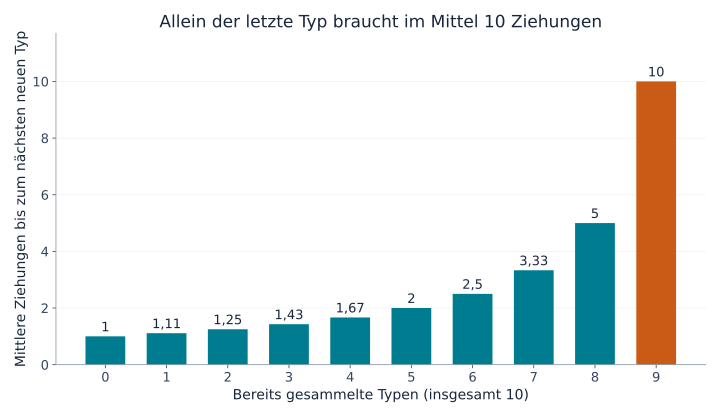
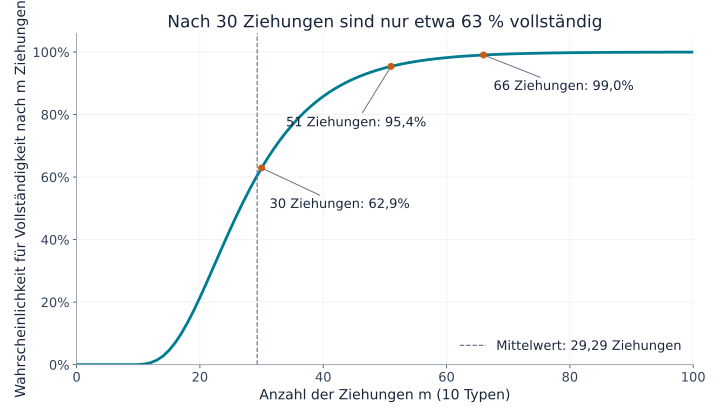
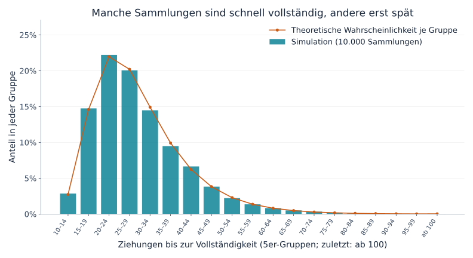

## 1. Warum fehlt ausgerechnet die letzte Karte so lange?

Stellen wir uns zehn Kartentypen vor, jeweils eine Karte pro verschlossenem Päckchen. Alle Typen sind gleich wahrscheinlich. Anfangs bringt fast jedes Päckchen etwas Neues. Später häufen sich doppelte Karten, und besonders der letzte fehlende Typ lässt auf sich warten.

Das **Sammelbilderproblem**, auch Coupon-Collector-Problem genannt, beschreibt diese Erfahrung mathematisch. „Coupon“ steht dabei allgemein für unterscheidbare Sammelobjekte, etwa Karten, Aufkleber oder Spielzeugfiguren, nicht nur für Rabattgutscheine.

Für zehn Typen benötigt man **durchschnittlich etwa 29,3 Ziehungen**. Das heißt jedoch nicht, dass 30 zuverlässig reichen: Die Wahrscheinlichkeit, dann fertig zu sein, beträgt etwa 62,9 %. Für mindestens 95 % braucht man 51 Ziehungen. Wir leiten diese Zahlen her, betrachten ihre Streuung und prüfen sie mit Python.

## 2. Zuerst die Regeln festlegen

Unser Grundmodell setzt voraus:

- Es gibt $n$ Typen; jede Ziehung liefert eine Karte.
- Jeder Typ hat bei jeder Ziehung dieselbe Wahrscheinlichkeit $1/n$.
- Die Ziehungen sind unabhängig; frühere Ergebnisse ändern die nächste nicht.
- Doppelte Karten sind möglich, ohne Tauschen oder Schutz vor Wiederholungen.
- Wir beginnen ohne Karten und hören auf, sobald jeder Typ mindestens einmal vorhanden ist.

Das entspricht dem Ziehen **mit Zurücklegen**: Eine Kugel wird vor der nächsten Ziehung in die Schachtel zurückgelegt. Ein begrenzter Vorrat ohne Zurücklegen oder eine Packung, die alle Typen garantiert, erfordert ein anderes Modell.

$T$ bezeichnet die benötigte Zahl der Ziehungen. Sie ist eine **Zufallsvariable**, deren Wert von Versuch zu Versuch wechselt. Der **Erwartungswert** $E[T]$ ist der Mittelwert über immer wieder neu begonnene Sammlungen, keine Vorhersage für eine einzelne Person. Wir verwenden hauptsächlich $n=10$, die Formeln gelten aber für jede positive Typenzahl.

## 3. In Wartezeiten auf den nächsten neuen Typ zerlegen

### Mit jedem gesammelten Typ gibt es weniger neue Möglichkeiten

Besitzen wir bereits $k$ Typen, fehlen noch $n-k$. Die Wahrscheinlichkeit, beim nächsten Zug einen neuen zu erhalten, ist

$$
p_k=\frac{n-k}{n}
$$

Bei zehn Typen ist die erste Karte sicher neu. Mit fünf vorhandenen Typen beträgt die Wahrscheinlichkeit $5/10$, mit neun nur noch $1/10$.

Die Karten selbst sind nicht seltener geworden. **Weniger Ergebnisse sind für uns noch neu.** Die Ziehungsregeln müssen sich am Ende nicht verschlechtern, damit die Sammlung langsamer wächst.

### Ein Erfolg mit Wahrscheinlichkeit $p$ braucht im Mittel $1/p$ Versuche

$X$ sei die Zahl der Versuche bis zum ersten Erfolg, einschließlich des erfolgreichen Versuchs. Bei unabhängigen Erfolgen mit Wahrscheinlichkeit $p$ ist $X$ geometrisch verteilt:

$$
P(X=r)=(1-p)^{r-1}p
\qquad (r=1,2,3,\ldots)
$$

Ein erster Erfolg im dritten Versuch erfordert „Misserfolg, Misserfolg, Erfolg“ und hat Wahrscheinlichkeit $(1-p)^2p$.

Nennen wir die mittlere Wartezeit $a$. Einen Versuch brauchen wir immer. Scheitert er, was mit Wahrscheinlichkeit $1-p$ geschieht, beginnen wir in derselben Situation erneut und brauchen durchschnittlich weitere $a$ Versuche. Also gilt

$$
a=1+(1-p)a
\quad\Longrightarrow\quad
a=\frac{1}{p}
$$

Bei $1/2$ wartet man im Mittel zweimal, bei $1/10$ zehnmal. Der zehnte Versuch wird dadurch nicht wahrscheinlicher erfolgreich: Der Mittelwert umfasst kurze und lange Wartezeiten.

### Die einzelnen Phasen addieren

Sei $X_k$ die Anzahl der Ziehungen vom $k$-ten zum $(k+1)$-ten gesammelten Typ. Dann gilt

$$
E[X_k]=\frac{1}{p_k}=\frac{n}{n-k}
$$

Für die vollständige Sammlung durchlaufen wir sämtliche Phasen:

$$
T=X_0+X_1+\cdots+X_{n-1}
$$

Wegen der Linearität des Erwartungswerts ist der Erwartungswert einer Summe die Summe ihrer Erwartungswerte. Diese Eigenschaft allein verlangt keine Unabhängigkeit. Damit folgt

$$
\begin{aligned}
E[T]
&=\frac{n}{n}+\frac{n}{n-1}+\cdots+\frac{n}{1}\\
&=n\left(1+\frac12+\cdots+\frac1n\right)\\
&=nH_n
\end{aligned}
$$

$H_n$ ist die $n$-te **harmonische Zahl**, also die Summe der Kehrwerte von 1 bis $n$. Diese Zerlegung findet sich auch in den [MIT-Vorlesungsunterlagen](https://ocw.mit.edu/courses/6-856j-randomized-algorithms-fall-2002/resources/n4/).

## 4. Die lange Schlussphase im Diagramm

Einige Phasen bei zehn Typen sehen so aus:

| Vorhandene Typen | Wahrscheinlichkeit für einen neuen Typ | Mittlere zusätzliche Ziehungen |
|---|---|---|
| 0 | 100 % | 1 |
| 5 | 50 % | 2 |
| 8 | 20 % | 5 |
| 9 | 10 % | 10 |



*Abbildung 1. Jeder Balken zeigt nur die jeweilige Phase, keine aufsummierte Dauer. Der letzte Balken ist zehnmal so hoch wie der erste.*

Die Summe aller zehn Balken ergibt

$$
E[T]=10H_{10}\approx29.29
$$

Bis zu neun Typen braucht man im Mittel etwa 19,29 Ziehungen, anschließend weitere zehn für den letzten. **Der letzte Typ beansprucht ungefähr 34 % der gesamten erwarteten Wartezeit.** Die letzten 10 % einer Sammlung müssen also nicht nur 10 % des Aufwands kosten.

Dieser letzte Typ muss nicht besonders selten sein. Welcher auch übrig bleibt, seine Wahrscheinlichkeit beträgt weiterhin $1/10$. Selbst nach 20 erfolglosen Versuchen gilt das noch; auch die erwartete zusätzliche Wartezeit bleibt bei zehn. Diese Eigenschaft der geometrischen Verteilung heißt **Gedächtnislosigkeit**.

## 5. Was passiert bei mehr Typen?

Die gleiche Formel liefert folgende gerundete Werte:

| Typen $n$ | Erwartete Ziehungen $nH_n$ | Verhältnis Ziehungen zu Typen |
|---|---|---|
| 6 | 14,70 | 2,45 |
| 10 | 29,29 | 2,93 |
| 20 | 71,95 | 3,60 |
| 50 | 224,96 | 4,50 |
| 100 | 518,74 | 5,19 |

Eine Verdopplung von zehn auf zwanzig Typen erhöht den Mittelwert von etwa 29 auf 72 Ziehungen, also um mehr als das Doppelte. Zu den zusätzlichen Typen kommen längere Wartezeiten durch Wiederholungen am Ende.

Für große $n$ lässt sich die harmonische Zahl durch den natürlichen Logarithmus annähern:

$$
H_n\approx\ln n+\gamma+\frac{1}{2n}
$$

$\ln$ ist der natürliche Logarithmus, $\gamma\approx0.57721$ die Euler–Mascheroni-Konstante. Somit gilt näherungsweise

$$
E[T]\approx n\ln n+\gamma n+\frac12
$$

Der Erwartungswert wächst in der Größenordnung $n\ln n$. Für konkrete Zahlen bei zehn oder zwanzig Typen ist es jedoch einfach und genauer, die harmonische Summe direkt zu berechnen, statt nur $n\ln n$ zu verwenden.

## 6. Ein Mittelwert von 29,3 garantiert keinen Abschluss nach 30 Ziehungen

### Mittelwert und Abschlusswahrscheinlichkeit unterscheiden

$P(T\le m)$ ist die Wahrscheinlichkeit, innerhalb von $m$ Ziehungen fertig zu werden. Das beantwortet eine andere Frage als der Erwartungswert.

Die folgende Kurve für zehn Typen wurde durch Fortschreiben von Zustandswahrscheinlichkeiten berechnet, nicht aus einer Zufallssimulation geschätzt.



*Abbildung 2. Die waagerechte Achse zeigt die Ziehungen, die senkrechte die Wahrscheinlichkeit, bis dahin fertig zu sein. Die ganzzahligen Punkte sind zur besseren Lesbarkeit verbunden.*

| Ziehungen | Ungefähre Wahrscheinlichkeit für Vollständigkeit |
|---|---|
| 10 | 0,036 % |
| 20 | 21,5 % |
| 30 | 62,9 % |
| 40 | 85,8 % |
| 50 | 94,9 % |
| 60 | 98,2 % |

Nach zehn Ziehungen fertig zu sein erfordert ausschließlich unterschiedliche Karten. Die Wahrscheinlichkeit dafür beträgt $10!/10^{10}$. So viele Ziehungen wie Typen reichen daher nur äußerst selten.

Die kleinsten Ziehungszahlen für mindestens 50 %, 90 %, 95 % und 99 % sind 27, 44, 51 und 66. Solche Schwellen heißen **Quantile**; das 50-%-Quantil ist der Median. Er liegt unter dem Mittelwert, weil die Verteilung einen langen rechten Ausläufer hat: Seltene sehr lange Sammlungen erhöhen den Durchschnitt.

### So wird die Kurve berechnet

$q_m(k)$ sei die Wahrscheinlichkeit, nach $m$ Ziehungen genau $k$ Typen zu besitzen. Anfangs ist $q_0(0)=1$, alle anderen Zustände haben Wahrscheinlichkeit null.

Nach der nächsten Ziehung können wir auf zwei Wegen $k$ Typen besitzen:

1. Wir hatten bereits $k$ und ziehen eine doppelte Karte.
2. Wir hatten $k-1$ und ziehen einen neuen Typ.

Die Summe beider Wege liefert

$$
q_{m+1}(k)=\frac{k}{n}q_m(k)
+\frac{n-k+1}{n}q_m(k-1)
\qquad (1\le k\le n)
$$

Nach einer Ziehung gilt $q_{m+1}(0)=0$. Eine vollständige Sammlung bleibt vollständig, daher ist $q_m(n)=P(T\le m)$. Das ist dynamische Programmierung mit der Anzahl vorhandener Typen als Zustand.

Die Identität der Karten kann wegen der Gleichverteilung ignoriert werden. Bei verschiedenen Wahrscheinlichkeiten würde die Anzahl allein nicht genügen, um die Chance auf eine neue Karte zu bestimmen.

## 7. 10.000 Sammlungen mit Python simulieren

Der folgende Code benötigt nur die Python-Standardbibliothek. Jeder Versuch beginnt leer und läuft bis zu allen zehn Typen; das wiederholen wir 10.000-mal.

```python
import random
import statistics

n = 10
trials = 10_000
rng = random.Random(20260915)

def collect_all(n, rng):
    collected = set()
    draws = 0
    while len(collected) < n:
        collected.add(rng.randrange(n))
        draws += 1
    return draws

results = [collect_all(n, rng) for _ in range(trials)]
theory = n * sum(1 / k for k in range(1, n + 1))

print(f"Theoretischer Mittelwert (Ziehungen): {theory:.2f}")
print(f"Simulierter Mittelwert (Ziehungen): {statistics.mean(results):.2f}")
print(f"Simulierter Median (Ziehungen): {statistics.median(results):.1f}")
print(f"Vollständig innerhalb von 30 Ziehungen: {sum(t <= 30 for t in results) / trials:.1%}")
```

Ein `set` entfernt Duplikate. Bereits vorhandene Karten vergrößern es nicht. `randrange(n)` wählt gleichverteilt eine ganze Zahl von 0 bis $n-1$. Sobald die Menge $n$ Elemente enthält, endet der Versuch.

Der feste Startwert des Zufallszahlengenerators macht das Ergebnis in derselben Umgebung reproduzierbar. Ein anderer Startwert verändert es etwas; eine kleine Abweichung von der Theorie ist noch kein Hinweis auf einen Programmfehler.

Unser Lauf ergab einen Mittelwert von 29,2929 Ziehungen, einen Median von 27 und 63,27 % vollständige Sammlungen innerhalb von 30 Ziehungen, nahe am theoretischen Wert von 62,9 %.



*Abbildung 3. Balken zeigen simulierte Anteile, Kreise die theoretischen Gruppenwahrscheinlichkeiten aus Differenzen der kumulierten Kurve. Beide verwenden Gruppen von fünf Ziehungen; die letzte enthält alle Ergebnisse ab 100.*

Viele Versuche enden nahe am Durchschnitt, andere dauern wesentlich länger. Der Mittelwert von 29,3 fasst diese Streuung zusammen und verspricht keinen Abschluss um Ziehung 29. Das **Gesetz der großen Zahlen** erklärt den Zusammenhang zwischen Versuchsmittelwerten und theoretischer Erwartung.

## 8. Wie groß ist die Streuung?

Die Varianz einer geometrischen Wartezeit lautet $(1-p)/p^2$. In unserem unabhängigen, gleichverteilten Modell sind auch die Wartezeiten der einzelnen Phasen unabhängig. Ihre Varianzen addieren sich:

$$
\begin{aligned}
\operatorname{Var}(T)
&=\sum_{j=1}^{n}\frac{1-j/n}{(j/n)^2}\\
&=n^2\sum_{j=1}^{n}\frac{1}{j^2}-nH_n
\end{aligned}
$$

$j$ zählt die noch fehlenden Typen. Bei $n=10$ beträgt die **Standardabweichung**, also die Quadratwurzel der Varianz, etwa 11,21 Ziehungen. Das ist viel im Vergleich zum Mittelwert von 29,29.

Man darf daraus nicht automatisch schließen, dass 95 % der Ergebnisse höchstens zwei Standardabweichungen vom Mittelwert entfernt liegen. Diese Verteilung ist weder normalverteilt noch symmetrisch. Für Abschlusswahrscheinlichkeiten ist die kumulierte Kurve die direkte Grundlage.

Die Standardabweichung des Mittelwerts aus 10.000 unabhängigen Versuchen ist wesentlich kleiner: $11.21/\sqrt{10000}\approx0.112$ Ziehungen. Einzelne Sammlungen streuen stark, ihr Durchschnitt ist aber relativ stabil. Ergebnisstreuung und Unsicherheit eines geschätzten Mittelwerts sind unterschiedliche Größen.

## 9. Was bei realen Anwendungen zu beachten ist

### Seltene Typen

Erscheint Typ $i$ mit Wahrscheinlichkeit $p_i$, braucht sein erstes Auftreten im Mittel $1/p_i$ Ziehungen. Die gesamte Sammlung kann nicht vorher vollständig sein. Deshalb gilt

$$
E[T]\ge\max_i\frac{1}{p_i}
$$

Ein einzelner Typ mit Wahrscheinlichkeit 0,1 % braucht durchschnittlich schon 1.000 Ziehungen. Der Wert 29,3 aus dem gleichverteilten Fall ist dann nicht übertragbar.

Auch $\sum_i1/p_i$ zu addieren wäre falsch: Die Typen werden innerhalb derselben Ziehungsfolge parallel gesammelt. Während wir auf einen warten, können andere erscheinen. In Abschnitt 3 wurden dagegen aufeinanderfolgende, nicht überlappende Phasen addiert.

### Tauschen und Schutz vor doppelten Karten

Tauschmöglichkeiten oder garantierte neue Karten verändern die benötigte Zahl. Ist jede Karte sicher neu, reichen exakt $n$ Ziehungen.

Ohne einen solchen Mechanismus ist der letzte Typ nicht irgendwann „fällig“. Die Wahrscheinlichkeit, ihn innerhalb der nächsten $r$ Ziehungen zu erhalten, ist

$$
1-\left(1-\frac1n\right)^r
$$

Bei zehn Typen beträgt sie für zehn weitere Ziehungen etwa 65,1 %. Etwa 34,9 % müssen länger warten. Zehn Ziehungen im Mittel sind keine Garantie. Ohne Tausch oder Garantie stellt keine endliche Ziehungszahl Vollständigkeit mit 100 % sicher.

### Ein Bezug zu Softwaretests

Zufällig Testfälle auszuwählen, bis jeder mindestens einmal ausgeführt wurde, hat eine ähnliche Struktur. Je weniger ungetestete Fälle bleiben, desto häufiger werden bereits ausgeführte Fälle wiederholt.

Reale Testfälle müssen nicht gleich wahrscheinlich sein, und jeder einmal ausgeführte Fall garantiert keine Softwarequalität. Entscheidend ist der Unterschied zwischen vielen Zufallsversuchen und vollständiger Abdeckung. Noch nicht getestete Fälle zu erfassen und vorzuziehen kann die Wiederholungen am Ende reduzieren.

## 10. Fazit: Besonders schwierig ist das Ende

Die Zerlegung in Wartezeiten auf den nächsten neuen Typ liefert für $n$ gleich wahrscheinliche Typen den Erwartungswert $nH_n$. Mit jedem gesammelten Typ sinkt die Chance auf Neues, und allein der letzte benötigt im Mittel $n$ Ziehungen.

Bei zehn Typen ist der Durchschnitt etwa 29,3, doch nach 30 Ziehungen beträgt die Abschlusswahrscheinlichkeit nur 62,9 %. Für mindestens 95 % braucht man 51. **Mittelwert, Median und Abschlusswahrscheinlichkeit sind auseinanderzuhalten.**

Das Warten auf die letzte Karte hat also einen klaren mathematischen Grund. Probiere im Python-Code sechs oder zwanzig Typen aus, schätze zuerst das Ergebnis und vergleiche anschließend. Doppelte Karten machen harmonische Zahlen und Wahrscheinlichkeitsverteilungen greifbar.

### Quellen und Dateien zum Nachvollziehen

- [MIT-OpenCourseWare-Unterlagen zum Sammelbilderproblem](https://ocw.mit.edu/courses/6-856j-randomized-algorithms-fall-2002/resources/n4/) — Erwartungswert nach Phasen und Wahrscheinlichkeitsschranken.
- [Python-Skript für die Diagramme](generate_graphs.de.py) — benötigt Python, Matplotlib und eine geeignete Schriftart.
- [Berechnungsdaten als JSON](calculation-results.de.json) — theoretische Werte, Wahrscheinlichkeiten und Simulationsübersicht.

Die Diagramme wurden eigenständig aus dem beschriebenen Modell berechnet. Das generierte Titelbild ist eine thematische Illustration und kein quantitatives Diagramm.
