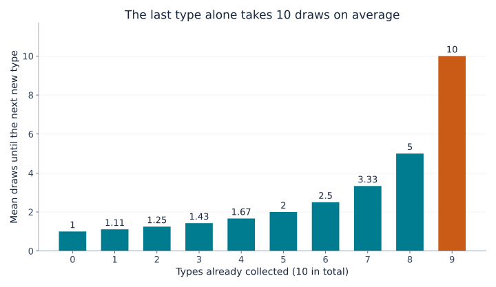
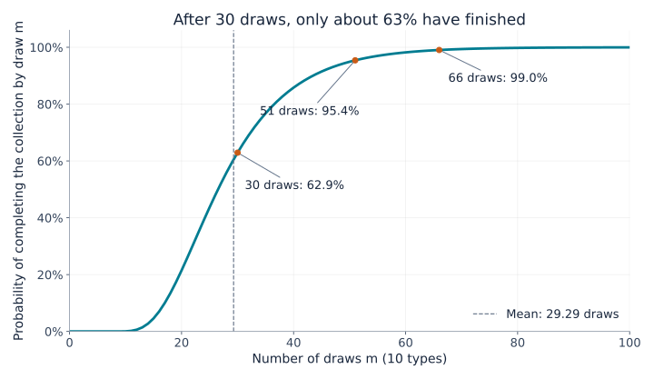
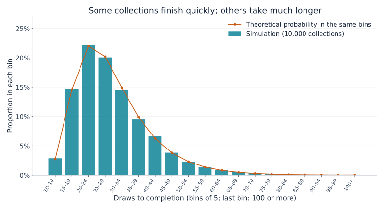

## 1. Why is the last card so hard to find?

Imagine a collection of 10 different cards, with one card in each sealed pack. Every type is equally likely. At first, almost every pack adds something new. Later, duplicates pile up. And once only one type is missing, the wait seems especially long.

The **coupon collector’s problem** describes this experience mathematically. “Coupon” here means any collectible with distinguishable types: cards, stickers, or capsule toys, not necessarily discount vouchers.

The answer for 10 types is about **29.3 draws on average**. That does not mean 30 draws will reliably finish the collection. The probability of finishing within 30 draws is approximately 62.9%; reaching at least 95% requires 51 draws.

We will derive these numbers by looking at the chance of obtaining a new type, visualize the variability, and run a short Python experiment.

## 2. Define the rules first

Our basic model assumes:

- There are $n$ types, and each draw gives one card.
- Every type has the same probability $1/n$ on every draw.
- Draws are independent: previous results do not affect the next one.
- Duplicates are allowed, with no trading or duplicate protection.
- We start with nothing and stop once every type has appeared at least once.

This is sampling **with replacement**, like returning a ball to a box before drawing again. Drawing from a finite stock without replacement, or buying a box guaranteed to contain every type, requires a different model.

Let $T$ be the number of draws needed to finish. It is a **random variable**: different experiments produce different values. Its **expected value**, $E[T]$, is the average over repeated collections started from scratch, not a prediction of one collector’s result. We will mainly use $n=10$, but the formulas work for any positive number of types.

## 3. Split the process into waits for the next new type

### More collected types mean fewer useful outcomes

If we already have $k$ types, there are $n-k$ missing types. The probability of obtaining a new one is

$$
p_k=\frac{n-k}{n}
$$

With 10 types, the first draw is certainly new. With five types collected, the probability is $5/10$; with nine, it is $1/10$.

The cards themselves have not become rarer. **Fewer outcomes count as new to us.** Slow progress near the end does not require the drawing mechanism to change.

### A success with probability $p$ takes $1/p$ draws on average

Let $X$ count the draws up to and including the first success, when each independent draw succeeds with probability $p$. Then $X$ has a geometric distribution:

$$
P(X=r)=(1-p)^{r-1}p
\qquad (r=1,2,3,\ldots)
$$

For instance, the first success on draw three requires failure, failure, success, with probability $(1-p)^2p$.

Write the mean waiting time as $a$. We always spend one draw. If it fails, which happens with probability $1-p$, we are back in the same situation and need another $a$ draws on average. Thus,

$$
a=1+(1-p)a
\quad\Longrightarrow\quad
a=\frac{1}{p}
$$

A probability of $1/2$ gives a mean wait of two draws; $1/10$ gives ten. This does not make the tenth draw more likely to succeed. It averages together both short and long waits.

### Add the stages to obtain the total expectation

Let $X_k$ be the number of draws needed to move from $k$ collected types to $k+1$. Then

$$
E[X_k]=\frac{1}{p_k}=\frac{n}{n-k}
$$

Collecting everything means passing through all these stages:

$$
T=X_0+X_1+\cdots+X_{n-1}
$$

By linearity of expectation, the expectation of a sum is the sum of the expectations. This property itself does not require independence. Therefore,

$$
\begin{aligned}
E[T]
&=\frac{n}{n}+\frac{n}{n-1}+\cdots+\frac{n}{1}\\
&=n\left(1+\frac12+\cdots+\frac1n\right)\\
&=nH_n
\end{aligned}
$$

$H_n$ is the $n$th **harmonic number**, the sum of the reciprocals of the integers from 1 to $n$. This stage-by-stage argument also appears in [MIT’s lecture notes](https://ocw.mit.edu/courses/6-856j-randomized-algorithms-fall-2002/resources/n4/).

## 4. Visualizing the long wait near the end

For 10 types, some representative stages are:

| Types already collected | Probability of a new type | Mean additional draws |
|---|---|---|
| 0 | 100% | 1 |
| 5 | 50% | 2 |
| 8 | 20% | 5 |
| 9 | 10% | 10 |



*Figure 1. Each bar represents the wait for that stage alone, not the cumulative number of draws. The final bar is ten times the first.*

Adding all ten bars gives

$$
E[T]=10H_{10}\approx29.29
$$

Reaching nine types takes about 19.29 draws on average, followed by another ten for the last type. **The final type accounts for about 34% of the total expected time.** The last 10% of a collection need not take only 10% of the effort.

Nor must the last card be inherently rare. Whichever type remains has probability $1/10$ on each subsequent draw. Even after 20 unsuccessful attempts to obtain it, the next draw still succeeds with probability $1/10$, and the expected additional wait remains ten draws. This is the geometric distribution’s **memoryless property**.

## 5. What happens when there are more types?

The same formula gives the following values, rounded to two decimal places:

| Types $n$ | Expected draws $nH_n$ | Draws per type, on average |
|---|---|---|
| 6 | 14.70 | 2.45 |
| 10 | 29.29 | 2.93 |
| 20 | 71.95 | 3.60 |
| 50 | 224.96 | 4.50 |
| 100 | 518.74 | 5.19 |

Doubling the number of types from 10 to 20 increases the expectation from about 29 to about 72 draws, more than a doubling. The extra types also bring more waiting through duplicates near the end.

For large $n$, harmonic numbers can be approximated using the natural logarithm:

$$
H_n\approx\ln n+\gamma+\frac{1}{2n}
$$

Here $\ln$ is the natural logarithm and $\gamma\approx0.57721$ is the Euler–Mascheroni constant. Consequently,

$$
E[T]\approx n\ln n+\gamma n+\frac12
$$

The expectation grows on the scale of $n\ln n$. For a concrete answer with 10 or 20 types, however, summing the harmonic number directly is easy and more accurate than using $n\ln n$ alone.

## 6. A mean of 29.3 does not guarantee success in 30 draws

### Mean versus completion probability

The probability of finishing within $m$ draws is $P(T\le m)$. It answers a different question from the expected number of draws.

The following curve for 10 types is computed by updating state probabilities, rather than estimated from random trials.



*Figure 2. The horizontal axis gives the number of draws; the vertical axis gives the probability of finishing by then. Draw counts are integers, with lines connecting points for readability.*

| Draws | Probability of finishing by then |
|---|---|
| 10 | About 0.036% |
| 20 | About 21.5% |
| 30 | About 62.9% |
| 40 | About 85.8% |
| 50 | About 94.9% |
| 60 | About 98.2% |

Finishing in ten draws requires no duplicates at all, which has probability $10!/10^{10}$. Drawing as many cards as there are types is therefore very unlikely to be enough.

The smallest draw counts reaching completion probabilities of 50%, 90%, 95%, and 99% are respectively 27, 44, 51, and 66. Such thresholds are **quantiles**; the 50% quantile is the median.

The median is below the mean because the distribution has a long right tail. Occasional very long collections pull the mean upward. Keep the average time and the chance of finishing by a deadline separate.

### How the curve is calculated

Let $q_m(k)$ be the probability of having exactly $k$ types after $m$ draws. Initially, $q_0(0)=1$ and every other state has probability zero.

There are two ways to have $k$ types after the next draw:

1. Already have $k$ types and draw a duplicate.
2. Have $k-1$ types and draw a new one.

Adding these possibilities gives

$$
q_{m+1}(k)=\frac{k}{n}q_m(k)
+\frac{n-k+1}{n}q_m(k-1)
\qquad (1\le k\le n)
$$

After a draw, $q_{m+1}(0)=0$. Once all types have been obtained, the process stays in that state, so $q_m(n)=P(T\le m)$. This is dynamic programming with the number of collected types as the state.

We can ignore the cards’ identities because they are equally likely. With unequal probabilities, the number of types alone would not determine the chance of getting something new.

## 7. Simulate 10,000 complete collections in Python

The following code uses only Python’s standard library. Each experiment starts empty and continues until all ten types have been collected. We repeat it 10,000 times.

```python
import random
import statistics

n = 10
trials = 10_000
rng = random.Random(20260915)

def collect_all(n, rng):
    collected = set()
    draws = 0
    while len(collected) < n:
        collected.add(rng.randrange(n))
        draws += 1
    return draws

results = [collect_all(n, rng) for _ in range(trials)]
theory = n * sum(1 / k for k in range(1, n + 1))

print(f"Theoretical mean (draws): {theory:.2f}")
print(f"Simulated mean (draws): {statistics.mean(results):.2f}")
print(f"Simulated median (draws): {statistics.median(results):.1f}")
print(f"Completed within 30 draws: {sum(t <= 30 for t in results) / trials:.1%}")
```

A `set` removes duplicates, so drawing an existing card does not increase its size. `randrange(n)` chooses an integer from 0 to $n-1$ with equal probability. We stop when the set contains $n$ elements.

Fixing the random seed makes the result reproducible in the same environment. Changing the seed changes the sample slightly; failing to match the theoretical value exactly does not by itself indicate a bug.

Our run produced a mean of 29.2929 draws, a median of 27, and a completion rate of 63.27% within 30 draws, close to the theoretical 62.9%.



*Figure 3. Bars show simulated proportions; circles show theoretical bin probabilities obtained by subtracting values of the cumulative curve. Both use bins of five draws, with all results of 100 draws or more included in the final bin.*

Many experiments finish near the average, while some take considerably longer. The mean of about 29.3 is an average across this variability, not a promise that everyone finishes around draw 29. The **law of large numbers** explains the relationship between repeated experimental averages and the theoretical expectation.

## 8. How large is the variation?

The variance of a geometric waiting time is $(1-p)/p^2$. Under our independent, equally likely model, the successive stage waits are independent too, so their variances add:

$$
\begin{aligned}
\operatorname{Var}(T)
&=\sum_{j=1}^{n}\frac{1-j/n}{(j/n)^2}\\
&=n^2\sum_{j=1}^{n}\frac{1}{j^2}-nH_n
\end{aligned}
$$

Here $j$ denotes the number of missing types. With $n=10$, the **standard deviation**, the square root of the variance, is about 11.21 draws: substantial compared with a mean of 29.29.

Do not automatically conclude that roughly 95% of results lie within two standard deviations of the mean. This distribution is neither normal nor symmetric. Use the cumulative probabilities in Figure 2 to answer completion questions directly.

The mean of 10,000 independent experiments has a much smaller standard deviation: $11.21/\sqrt{10000}\approx0.112$ draws. Individual collections vary widely while their average is relatively stable. Variation in individual results and uncertainty in an estimated mean are different quantities.

## 9. Applying the model to real situations

### Some types may be rare

If type $i$ occurs with probability $p_i$, its first appearance takes $1/p_i$ draws on average. Finishing the whole collection cannot happen sooner than obtaining that type, so

$$
E[T]\ge\max_i\frac{1}{p_i}
$$

A type with probability 0.1% alone takes 1,000 draws on average to obtain. The equal-probability answer of 29.3 draws for ten types cannot be reused in this case.

Adding $\sum_i1/p_i$ is also wrong: different types are collected in parallel along the same sequence of draws. While waiting for one, others may arrive. The waits added in Section 3 were consecutive, non-overlapping stages until the next new type.

### Trading and duplicate protection change the problem

Trading duplicates or guaranteeing a previously unseen type changes the required draw count. If every draw is guaranteed to be new, exactly $n$ draws suffice.

Without such a mechanism, being one card away does not make success “due.” From that point, the probability of obtaining the last type within $r$ draws is

$$
1-\left(1-\frac1n\right)^r
$$

For ten types, the chance of finding the last one within ten draws is about 65.1%, leaving about 34.9% still waiting. An expected wait of ten is not a guarantee. Without trading or guarantees, no finite number of draws ensures completion with 100% probability.

### A connection to software testing

Randomly selecting input cases until every case has been tested has a similar structure. As fewer untested cases remain, more selections repeat cases already covered.

Real test cases need not be equally likely, and executing each once does not guarantee software quality. The lesson is the difference between doing many random trials and covering every target. Tracking untested cases and prioritizing them can reduce late-stage repetition.

## 10. Conclusion: completion is hardest near the end

Breaking collection into waits for the next new type gives an expected total of $nH_n$ for $n$ equally likely types. New types become harder to find as the missing set shrinks, and the final type alone requires $n$ draws on average.

For ten types, the average is about 29.3 draws, but completion within 30 draws has probability only 62.9%. Reaching at least 95% requires 51 draws. **Distinguish the mean, the median, and completion probabilities.**

The familiar frustration of the missing last card has a clear mathematical explanation. Try changing the Python example to six or twenty types, make a prediction, and then run it. Duplicates provide a tangible route into harmonic numbers and probability distributions.

### References and reproducible files

- [MIT OpenCourseWare lecture notes on coupon collecting](https://ocw.mit.edu/courses/6-856j-randomized-algorithms-fall-2002/resources/n4/) — the stage-by-stage expectation argument and probability bounds.
- [Python graph-generation script](generate_graphs.en.py) — reproduces the three figures; requires Python and Matplotlib, plus a font supporting the chart language.
- [Calculation data (JSON)](calculation-results.en.json) — theoretical values, completion probabilities, and simulation summary.

The graphs were independently calculated and plotted from the stated model. The generated cover image is a conceptual illustration, not a quantitative figure.

