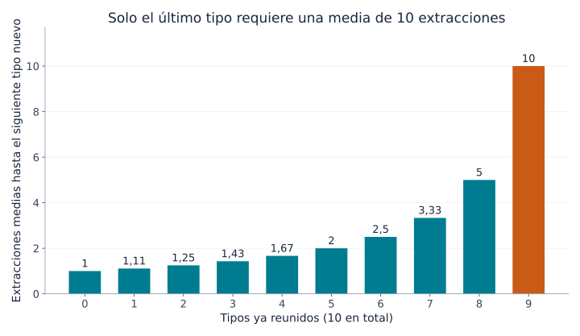
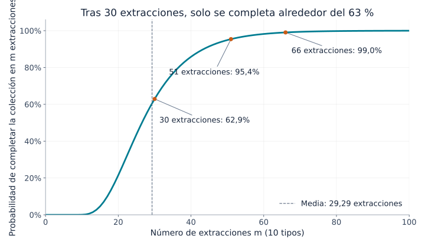
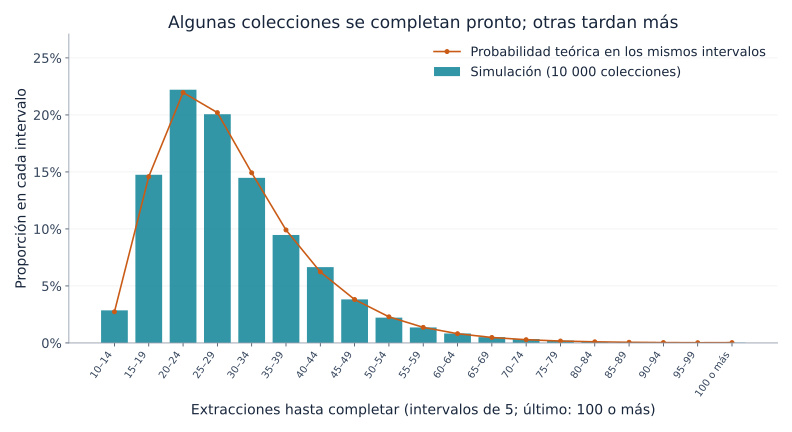

## 1. ¿Por qué cuesta tanto conseguir la última carta?

Imagina una colección de 10 tipos de cartas, con una carta en cada sobre cerrado. Todos los tipos tienen la misma probabilidad de aparecer. Al principio casi todos los sobres aportan novedades; después se acumulan las repetidas. Cuando falta una sola, la espera parece interminable.

El **problema del coleccionista de cupones** describe matemáticamente esta situación. Aquí «cupón» significa un objeto coleccionable con tipos distinguibles: cartas, pegatinas o juguetes de cápsula, no necesariamente vales de descuento.

La respuesta para 10 tipos es **unas 29,3 extracciones de media**. Eso no garantiza completar la colección en 30: la probabilidad de lograrlo es aproximadamente del 62,9 %. Para alcanzar al menos un 95 %, hacen falta 51 extracciones. Vamos a deducir estos valores, visualizar su variabilidad y comprobarlos con Python.

## 2. Primero, fijemos las reglas

El modelo básico supone lo siguiente:

- Hay $n$ tipos y cada extracción proporciona una carta.
- Cada tipo aparece con probabilidad $1/n$, igual en todas las extracciones.
- Las extracciones son independientes: el pasado no altera la siguiente.
- Puede haber repeticiones; no existen intercambios ni protección contra duplicados.
- Se empieza sin cartas y se termina al obtener todos los tipos al menos una vez.

Es un muestreo **con reemplazo**, como sacar una bola y devolverla a la caja antes de repetir. Extraer de un inventario limitado sin devolver las cartas, o comprar una caja que garantiza todos los tipos, requiere otro modelo.

Llamamos $T$ al número de extracciones hasta completar la colección. Es una **variable aleatoria**, porque cambia entre experimentos. Su **valor esperado**, $E[T]$, es la media al repetir muchas colecciones desde cero, no una predicción para una persona concreta. Usaremos principalmente $n=10$, aunque las fórmulas sirven para cualquier número positivo de tipos.

## 3. Dividir la espera en etapas

### Cuantos más tipos tenemos, menos resultados son nuevos

Si ya tenemos $k$ tipos, faltan $n-k$. La probabilidad de que la siguiente carta sea nueva es

$$
p_k=\frac{n-k}{n}
$$

Con 10 tipos, la primera carta siempre es nueva. Si tenemos cinco tipos, la probabilidad es $5/10$; si tenemos nueve, baja a $1/10$.

No ha cambiado la probabilidad de las cartas: **se ha reducido el número de resultados que nos sirven como novedad**. No hace falta que el mecanismo se vuelva desfavorable al final para que el progreso se ralentice.

### Un éxito de probabilidad $p$ tarda $1/p$ intentos de media

Sea $X$ el número de intentos hasta el primer éxito, contando el intento exitoso. Si cada intento independiente tiene probabilidad $p$ de éxito, $X$ sigue una distribución geométrica:

$$
P(X=r)=(1-p)^{r-1}p
\qquad (r=1,2,3,\ldots)
$$

Para acertar por primera vez en el tercer intento debe ocurrir «fallo, fallo, acierto», con probabilidad $(1-p)^2p$.

Si la espera media es $a$, siempre gastamos un intento. Si fallamos, con probabilidad $1-p$, volvemos a la misma situación y esperamos otros $a$ intentos de media. Por tanto,

$$
a=1+(1-p)a
\quad\Longrightarrow\quad
a=\frac{1}{p}
$$

Una probabilidad de $1/2$ implica dos intentos de media; una de $1/10$, diez. Esto no vuelve más probable el éxito en el décimo intento: la media combina esperas cortas y largas.

### Sumar las etapas da la media total

Sea $X_k$ el número de extracciones para pasar de $k$ tipos a $k+1$. Entonces,

$$
E[X_k]=\frac{1}{p_k}=\frac{n}{n-k}
$$

Completar la colección exige recorrer todas las etapas:

$$
T=X_0+X_1+\cdots+X_{n-1}
$$

Por la linealidad de la esperanza, el valor esperado de una suma es la suma de los valores esperados. Esta propiedad, por sí sola, no necesita independencia. Así obtenemos

$$
\begin{aligned}
E[T]
&=\frac{n}{n}+\frac{n}{n-1}+\cdots+\frac{n}{1}\\
&=n\left(1+\frac12+\cdots+\frac1n\right)\\
&=nH_n
\end{aligned}
$$

$H_n$ es el **número armónico** de orden $n$: la suma de los inversos de los enteros del 1 al $n$. Este razonamiento por etapas también aparece en los [apuntes del MIT](https://ocw.mit.edu/courses/6-856j-randomized-algorithms-fall-2002/resources/n4/).

## 4. El gráfico de la espera final

Estas son algunas etapas para una colección de 10 tipos:

| Tipos reunidos | Probabilidad de un tipo nuevo | Extracciones adicionales medias |
|---|---|---|
| 0 | 100 % | 1 |
| 5 | 50 % | 2 |
| 8 | 20 % | 5 |
| 9 | 10 % | 10 |



*Figura 1. Cada barra corresponde únicamente a esa etapa, no al total acumulado. La última es diez veces mayor que la primera.*

La suma de las diez barras es

$$
E[T]=10H_{10}\approx29.29
$$

Llegar a nueve tipos requiere unas 19,29 extracciones de media; el último exige otras diez. **El último tipo representa alrededor del 34 % del tiempo medio total.** El 10 % final de la colección no tiene por qué consumir solo el 10 % del esfuerzo.

Tampoco tiene que ser una carta especialmente rara: cualquiera que quede tiene probabilidad $1/10$ de aparecer. Incluso después de 20 intentos fallidos para conseguirla, la probabilidad del siguiente sigue siendo $1/10$ y la espera adicional media sigue siendo diez. Es la propiedad de **falta de memoria** de la distribución geométrica.

## 5. ¿Qué ocurre al aumentar los tipos?

Aplicando la misma fórmula obtenemos estos valores aproximados:

| Tipos $n$ | Extracciones esperadas $nH_n$ | Cociente entre extracciones y tipos |
|---|---|---|
| 6 | 14,70 | 2,45 |
| 10 | 29,29 | 2,93 |
| 20 | 71,95 | 3,60 |
| 50 | 224,96 | 4,50 |
| 100 | 518,74 | 5,19 |

Duplicar los tipos de 10 a 20 aumenta la media de unas 29 a unas 72 extracciones: más del doble. Además de reunir más tipos, se tarda más en superar las repeticiones del final.

Para valores grandes de $n$, el número armónico admite la aproximación

$$
H_n\approx\ln n+\gamma+\frac{1}{2n}
$$

$\ln$ es el logaritmo natural y $\gamma\approx0.57721$ es la constante de Euler–Mascheroni. Por tanto,

$$
E[T]\approx n\ln n+\gamma n+\frac12
$$

La esperanza crece a escala de $n\ln n$. Para calcular un número concreto con 10 o 20 tipos, conviene sumar directamente el número armónico: es sencillo y más preciso que usar solo $n\ln n$.

## 6. Una media de 29,3 no asegura terminar en 30

### Media y probabilidad de completar son cosas distintas

$P(T\le m)$ expresa la probabilidad de terminar en $m$ extracciones o menos. Responde a una pregunta diferente de la media.

La curva siguiente, para 10 tipos, se calcula actualizando probabilidades de estados; no es una estimación obtenida por simulación.



*Figura 2. El eje horizontal muestra las extracciones y el vertical, la probabilidad de haber terminado. Los recuentos son enteros; se unen los puntos para facilitar la lectura.*

| Extracciones | Probabilidad aproximada de haber terminado |
|---|---|
| 10 | 0,036 % |
| 20 | 21,5 % |
| 30 | 62,9 % |
| 40 | 85,8 % |
| 50 | 94,9 % |
| 60 | 98,2 % |

Terminar en diez extracciones exige no repetir ninguna carta, cuya probabilidad es $10!/10^{10}$. Extraer tantas cartas como tipos existen rara vez basta.

Los primeros recuentos que alcanzan probabilidades del 50 %, 90 %, 95 % y 99 % son 27, 44, 51 y 66. Son **cuantiles**; el del 50 % es la mediana. Esta queda por debajo de la media porque la distribución tiene una cola larga a la derecha: algunas colecciones muy lentas elevan el promedio.

### Cómo se calcula la curva

Sea $q_m(k)$ la probabilidad de tener exactamente $k$ tipos después de $m$ extracciones. Al principio $q_0(0)=1$ y los demás estados tienen probabilidad cero.

Para tener $k$ tipos tras la siguiente extracción, podemos:

1. Tener ya $k$ tipos y obtener una repetida.
2. Tener $k-1$ tipos y obtener uno nuevo.

Sumando ambos caminos,

$$
q_{m+1}(k)=\frac{k}{n}q_m(k)
+\frac{n-k+1}{n}q_m(k-1)
\qquad (1\le k\le n)
$$

Después de una extracción, $q_{m+1}(0)=0$. Una vez reunidos todos los tipos, permanecemos en ese estado; por eso $q_m(n)=P(T\le m)$. Es programación dinámica cuyo estado es el número de tipos reunidos.

Podemos omitir la identidad de las cartas porque son equiprobables. Si las probabilidades fueran distintas, saber solo cuántos tipos tenemos no bastaría para calcular la posibilidad de obtener uno nuevo.

## 7. Simular 10 000 colecciones con Python

Este código utiliza únicamente la biblioteca estándar de Python. Cada experimento empieza sin cartas y continúa hasta reunir los diez tipos. Se repite 10 000 veces.

```python
import random
import statistics

n = 10
trials = 10_000
rng = random.Random(20260915)

def collect_all(n, rng):
    collected = set()
    draws = 0
    while len(collected) < n:
        collected.add(rng.randrange(n))
        draws += 1
    return draws

results = [collect_all(n, rng) for _ in range(trials)]
theory = n * sum(1 / k for k in range(1, n + 1))

print(f"Media teórica (extracciones): {theory:.2f}")
print(f"Media simulada (extracciones): {statistics.mean(results):.2f}")
print(f"Mediana simulada (extracciones): {statistics.median(results):.1f}")
print(f"Completadas en 30 extracciones: {sum(t <= 30 for t in results) / trials:.1%}")
```

`set` elimina duplicados: una carta repetida no aumenta su tamaño. `randrange(n)` elige un entero entre 0 y $n-1$ con igual probabilidad. El proceso termina cuando el conjunto tiene $n$ elementos.

La semilla fija permite reproducir el resultado en el mismo entorno. Al cambiarla, los resultados varían ligeramente; no coincidir exactamente con la teoría no implica por sí mismo un error.

En nuestra ejecución, la media fue 29,2929 extracciones, la mediana 27 y la proporción completada en 30 extracciones fue del 63,27 %, cercana al 62,9 % teórico.



*Figura 3. Las barras muestran proporciones simuladas y los círculos, probabilidades teóricas calculadas por diferencias de la curva acumulada. Ambos usan intervalos de cinco extracciones; el último incluye todos los resultados de 100 o más.*

Muchas colecciones terminan cerca de la media y otras tardan bastante más. Las 29,3 extracciones resultan de promediar esa variabilidad; no significan que todo el mundo termine alrededor de la extracción 29. La **ley de los grandes números** explica la relación entre medias experimentales y esperanza teórica.

## 8. ¿Cuánta variación hay?

La varianza de una espera geométrica es $(1-p)/p^2$. En nuestro modelo independiente y equiprobable, las esperas de las distintas etapas también son independientes, así que sus varianzas se suman:

$$
\begin{aligned}
\operatorname{Var}(T)
&=\sum_{j=1}^{n}\frac{1-j/n}{(j/n)^2}\\
&=n^2\sum_{j=1}^{n}\frac{1}{j^2}-nH_n
\end{aligned}
$$

$j$ representa los tipos que faltan. Para $n=10$, la **desviación estándar**, raíz cuadrada de la varianza, es aproximadamente 11,21 extracciones, considerable frente a una media de 29,29.

No debe deducirse automáticamente que el 95 % de los resultados cae a menos de dos desviaciones estándar de la media: esta distribución no es normal ni simétrica. Para calcular probabilidades de completar, es mejor utilizar directamente la curva acumulada.

La media de 10 000 experimentos independientes tiene una desviación estándar mucho menor: $11.21/\sqrt{10000}\approx0.112$ extracciones. Los resultados individuales pueden variar mucho mientras su promedio es estable. La dispersión individual y el error al estimar una media son cantidades distintas.

## 9. Precauciones al aplicar el modelo

### Tipos poco frecuentes

Si el tipo $i$ aparece con probabilidad $p_i$, su primera aparición tarda $1/p_i$ extracciones de media. La colección no puede completarse antes de conseguirlo, de modo que

$$
E[T]\ge\max_i\frac{1}{p_i}
$$

Un tipo con probabilidad del 0,1 % requiere por sí solo 1000 extracciones de media. No podemos aplicar sin más las 29,3 extracciones del caso equiprobable.

Tampoco es correcto sumar $\sum_i1/p_i$: los tipos se reúnen en paralelo en la misma secuencia. Mientras esperamos uno, pueden aparecer otros. En la sección 3 sumamos etapas consecutivas que no se superponían: las esperas hasta la siguiente novedad.

### Intercambios y protección contra repetidas

Intercambiar duplicados o garantizar un tipo nuevo cambia el número necesario. Si cada extracción proporciona una novedad, bastan exactamente $n$.

Sin esa garantía, que falte solo una carta no significa que «ya toque». La probabilidad de obtenerla en las siguientes $r$ extracciones es

$$
1-\left(1-\frac1n\right)^r
$$

Con diez tipos, conseguir la última en diez extracciones tiene una probabilidad aproximada del 65,1 %; el 34,9 % sigue esperando. Una espera media de diez no es una garantía. Sin intercambios ni mecanismos de garantía, ninguna cantidad finita asegura completar al 100 %.

### Una conexión con las pruebas de software

Elegir casos de prueba al azar hasta ejecutar todos presenta una estructura parecida. Cuantos menos quedan pendientes, más selecciones repiten casos ya cubiertos.

Los casos reales no tienen por qué ser equiprobables y ejecutarlos una vez no garantiza la calidad. La lección es distinguir muchas pruebas aleatorias de una cobertura completa. Registrar los casos pendientes y priorizarlos ayuda a reducir repeticiones al final.

## 10. Conclusión: lo difícil es terminar

Dividir la colección en esperas hasta el siguiente tipo nuevo conduce a una media de $nH_n$ para $n$ tipos equiprobables. Al reducirse los tipos pendientes, disminuye la probabilidad de una novedad; solo el último necesita $n$ extracciones de media.

Para diez tipos, la media es 29,3, pero completar en 30 tiene una probabilidad de apenas 62,9 %. Para alcanzar al menos el 95 % hacen falta 51. **Conviene distinguir media, mediana y probabilidad de completar.**

La frustración de la última carta tiene una explicación matemática clara. Prueba el código con seis o veinte tipos, predice primero el resultado y compáralo con el experimento. Las cartas repetidas abren la puerta a los números armónicos y las distribuciones de probabilidad.

### Referencias y archivos reproducibles

- [Apuntes del MIT OpenCourseWare sobre el coleccionista de cupones](https://ocw.mit.edu/courses/6-856j-randomized-algorithms-fall-2002/resources/n4/) — esperanza por etapas y cotas de probabilidad.
- [Código Python para generar los gráficos](generate_graphs.es.py) — requiere Python, Matplotlib y una fuente compatible con el idioma.
- [Datos de cálculo en JSON](calculation-results.es.json) — valores teóricos, probabilidades y resumen de la simulación.

Los gráficos se calcularon y trazaron a partir del modelo descrito. La imagen de portada generada es conceptual, no un gráfico cuantitativo.

