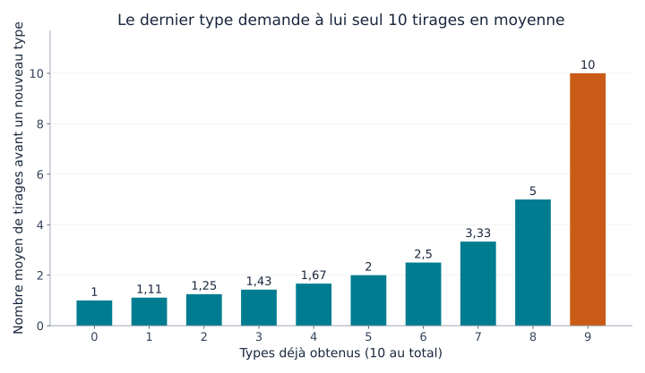
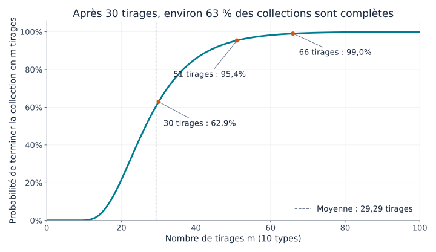
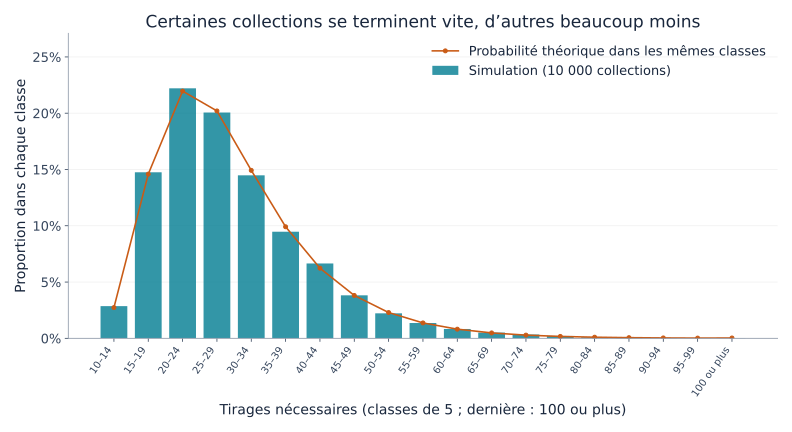

## 1. Pourquoi la dernière carte se fait-elle attendre ?

Imaginez 10 types de cartes, avec une carte par sachet fermé, tous les types étant équiprobables. Au début, les nouveautés arrivent vite. Puis les doubles s’accumulent. Quand il ne manque plus qu’un type, l’attente semble particulièrement longue.

Le **problème du collectionneur de coupons** formalise cette expérience. Un « coupon » désigne ici tout objet à collectionner dont on distingue plusieurs types : cartes, autocollants ou jouets, et pas seulement des bons de réduction.

Pour 10 types, il faut **environ 29,3 tirages en moyenne**. Mais 30 tirages ne garantissent rien : la probabilité d’avoir terminé est d’environ 62,9 %. Pour atteindre au moins 95 %, il faut 51 tirages. Nous allons retrouver ces nombres, représenter la dispersion et expérimenter avec Python.

## 2. Préciser les règles

Le modèle de base repose sur les hypothèses suivantes :

- Il existe $n$ types et chaque tirage donne une carte.
- Chaque type a la même probabilité $1/n$ à chaque tirage.
- Les tirages sont indépendants ; les résultats passés ne modifient pas le suivant.
- Les doubles sont possibles, sans échange ni mécanisme les empêchant.
- On part de zéro et on s’arrête après avoir obtenu chaque type au moins une fois.

C’est un tirage **avec remise**, comme lorsqu’on remet une boule dans une boîte avant de recommencer. Un stock fini tiré sans remise ou une boîte contenant obligatoirement tous les types relève d’un autre modèle.

Notons $T$ le nombre de tirages nécessaires. C’est une **variable aléatoire**, différente d’une expérience à l’autre. Son **espérance** $E[T]$ représente la moyenne sur des collections recommencées de zéro, pas une prédiction pour une personne particulière. Nous prendrons surtout $n=10$, mais les formules restent valables pour tout nombre positif de types.

## 3. Décomposer l’attente en étapes

### Plus on possède de types, moins il reste de nouveautés

Avec $k$ types déjà obtenus, il en manque $n-k$. La probabilité d’un nouveau type au prochain tirage est

$$
p_k=\frac{n-k}{n}
$$

Pour 10 types, le premier tirage est forcément nouveau. Avec cinq types, la probabilité vaut $5/10$ ; avec neuf, elle tombe à $1/10$.

Les cartes ne sont pas devenues plus rares : **moins de résultats constituent une nouveauté pour nous**. Le ralentissement final ne suppose aucune modification du mécanisme de tirage.

### Une réussite de probabilité $p$ demande en moyenne $1/p$ essais

Soit $X$ le nombre d’essais jusqu’à la première réussite, essai réussi compris. Si chaque essai indépendant réussit avec probabilité $p$, $X$ suit une loi géométrique :

$$
P(X=r)=(1-p)^{r-1}p
\qquad (r=1,2,3,\ldots)
$$

Une première réussite au troisième essai nécessite « échec, échec, réussite », de probabilité $(1-p)^2p$.

Appelons $a$ l’attente moyenne. Un premier essai est toujours consommé. En cas d’échec, de probabilité $1-p$, nous retrouvons la situation initiale et devons encore attendre $a$ essais en moyenne. Donc,

$$
a=1+(1-p)a
\quad\Longrightarrow\quad
a=\frac{1}{p}
$$

Une probabilité de $1/2$ donne deux essais en moyenne ; $1/10$ en donne dix. Le dixième essai n’a pas davantage de chances de réussir : la moyenne combine attentes courtes et longues.

### Additionner les étapes

Si $X_k$ est le nombre de tirages pour passer de $k$ à $k+1$ types, alors

$$
E[X_k]=\frac{1}{p_k}=\frac{n}{n-k}
$$

La collection complète exige toutes les étapes :

$$
T=X_0+X_1+\cdots+X_{n-1}
$$

La linéarité de l’espérance permet d’additionner les espérances, sans exiger en elle-même l’indépendance. On obtient

$$
\begin{aligned}
E[T]
&=\frac{n}{n}+\frac{n}{n-1}+\cdots+\frac{n}{1}\\
&=n\left(1+\frac12+\cdots+\frac1n\right)\\
&=nH_n
\end{aligned}
$$

$H_n$ est le $n$-ième **nombre harmonique**, somme des inverses des entiers de 1 à $n$. Ce raisonnement est également présenté dans les [notes de cours du MIT](https://ocw.mit.edu/courses/6-856j-randomized-algorithms-fall-2002/resources/n4/).

## 4. Visualiser l’attente en fin de collection

Voici quelques étapes pour 10 types :

| Types déjà obtenus | Probabilité d’un type nouveau | Tirages supplémentaires moyens |
|---|---|---|
| 0 | 100 % | 1 |
| 5 | 50 % | 2 |
| 8 | 20 % | 5 |
| 9 | 10 % | 10 |



*Figure 1. Chaque barre représente uniquement l’attente de cette étape, pas un cumul. La dernière est dix fois plus haute que la première.*

La somme des dix barres vaut

$$
E[T]=10H_{10}\approx29.29
$$

Obtenir neuf types demande environ 19,29 tirages, puis le dernier en demande dix de plus en moyenne. **Le dernier type représente environ 34 % de l’attente totale moyenne.** Les derniers 10 % d’une collection ne demandent donc pas forcément 10 % de l’effort.

Ce dernier type n’est pas nécessairement rare : quel qu’il soit, sa probabilité reste $1/10$. Même après 20 échecs pour l’obtenir, la probabilité au tirage suivant reste $1/10$ et l’attente supplémentaire moyenne reste dix. C’est la propriété **sans mémoire** de la loi géométrique.

## 5. Et si le nombre de types augmente ?

La même formule donne les valeurs arrondies suivantes :

| Types $n$ | Tirages moyens $nH_n$ | Rapport entre tirages et types |
|---|---|---|
| 6 | 14,70 | 2,45 |
| 10 | 29,29 | 2,93 |
| 20 | 71,95 | 3,60 |
| 50 | 224,96 | 4,50 |
| 100 | 518,74 | 5,19 |

Passer de 10 à 20 types fait passer la moyenne d’environ 29 à 72 tirages, soit plus du double. Il faut non seulement davantage de types, mais aussi attendre à travers davantage de doubles en fin de parcours.

Pour $n$ grand, on peut utiliser le logarithme naturel :

$$
H_n\approx\ln n+\gamma+\frac{1}{2n}
$$

$\ln$ désigne le logarithme naturel et $\gamma\approx0.57721$ la constante d’Euler–Mascheroni. Ainsi,

$$
E[T]\approx n\ln n+\gamma n+\frac12
$$

L’espérance croît à l’échelle de $n\ln n$. Pour un calcul concret avec 10 ou 20 types, additionner directement le nombre harmonique est facile et plus précis que de ne garder que $n\ln n$.

## 6. Une moyenne de 29,3 ne garantit pas de terminer en 30 tirages

### Espérance et probabilité d’achèvement

$P(T\le m)$ est la probabilité de terminer en au plus $m$ tirages. Ce n’est pas la même information que le nombre moyen de tirages.

La courbe ci-dessous, pour 10 types, provient d’un calcul des probabilités d’état, et non d’une estimation par simulation.



*Figure 2. L’axe horizontal indique les tirages et l’axe vertical la probabilité d’avoir terminé. Les nombres de tirages sont entiers ; les points sont reliés pour faciliter la lecture.*

| Tirages | Probabilité approximative d’avoir terminé |
|---|---|
| 10 | 0,036 % |
| 20 | 21,5 % |
| 30 | 62,9 % |
| 40 | 85,8 % |
| 50 | 94,9 % |
| 60 | 98,2 % |

Terminer en dix tirages impose de n’avoir aucun double, de probabilité $10!/10^{10}$. Tirer autant de cartes qu’il existe de types suffit donc rarement.

Les premiers nombres de tirages atteignant 50 %, 90 %, 95 % et 99 % sont respectivement 27, 44, 51 et 66. Ce sont des **quantiles** ; celui à 50 % est la médiane. Elle est inférieure à la moyenne, car la distribution possède une longue queue à droite : quelques collections très lentes tirent la moyenne vers le haut.

### Calculer la courbe

Soit $q_m(k)$ la probabilité de posséder exactement $k$ types après $m$ tirages. Initialement, $q_0(0)=1$ et les autres probabilités sont nulles.

Pour avoir $k$ types après le prochain tirage, deux possibilités existent :

1. Posséder déjà $k$ types et tirer un double.
2. Posséder $k-1$ types et en tirer un nouveau.

En additionnant ces chemins,

$$
q_{m+1}(k)=\frac{k}{n}q_m(k)
+\frac{n-k+1}{n}q_m(k-1)
\qquad (1\le k\le n)
$$

Après un tirage, $q_{m+1}(0)=0$. Une collection complète reste complète, donc $q_m(n)=P(T\le m)$. Il s’agit d’une programmation dynamique dont l’état est le nombre de types obtenus.

L’équiprobabilité permet d’ignorer l’identité des cartes. Avec des probabilités différentes, leur nombre seul ne suffirait plus pour calculer la chance d’une nouveauté.

## 7. Simuler 10 000 collections en Python

Ce code utilise uniquement la bibliothèque standard. Chaque expérience part de zéro et continue jusqu’à réunir les dix types ; on la répète 10 000 fois.

```python
import random
import statistics

n = 10
trials = 10_000
rng = random.Random(20260915)

def collect_all(n, rng):
    collected = set()
    draws = 0
    while len(collected) < n:
        collected.add(rng.randrange(n))
        draws += 1
    return draws

results = [collect_all(n, rng) for _ in range(trials)]
theory = n * sum(1 / k for k in range(1, n + 1))

print(f"Moyenne théorique (tirages): {theory:.2f}")
print(f"Moyenne simulée (tirages): {statistics.mean(results):.2f}")
print(f"Médiane simulée (tirages): {statistics.median(results):.1f}")
print(f"Collections terminées en 30 tirages: {sum(t <= 30 for t in results) / trials:.1%}")
```

Un `set` élimine les doublons : une carte déjà présente n’augmente pas sa taille. `randrange(n)` choisit uniformément un entier de 0 à $n-1$. On s’arrête lorsque l’ensemble contient $n$ éléments.

La graine fixe permet de reproduire le résultat dans le même environnement. Une autre graine modifie légèrement les valeurs ; un écart à la théorie ne suffit pas à conclure à une erreur.

Notre exécution a donné une moyenne de 29,2929 tirages, une médiane de 27 et 63,27 % de collections terminées en 30 tirages, proches des 62,9 % théoriques.



*Figure 3. Les barres donnent les proportions simulées ; les cercles donnent les probabilités théoriques, obtenues par différences de probabilités cumulées. Les classes regroupent cinq tirages et la dernière comprend tous les résultats à partir de 100.*

Beaucoup d’expériences finissent près de la moyenne, d’autres bien plus tard. Les 29,3 tirages résument cette dispersion ; ils ne signifient pas que chacun termine vers le 29e tirage. La **loi des grands nombres** explique le lien entre moyennes expérimentales et espérance.

## 8. Quelle est l’ampleur de la dispersion ?

La variance d’une attente géométrique vaut $(1-p)/p^2$. Dans notre modèle, les attentes successives sont elles aussi indépendantes ; leurs variances s’additionnent :

$$
\begin{aligned}
\operatorname{Var}(T)
&=\sum_{j=1}^{n}\frac{1-j/n}{(j/n)^2}\\
&=n^2\sum_{j=1}^{n}\frac{1}{j^2}-nH_n
\end{aligned}
$$

$j$ désigne le nombre de types manquants. Pour $n=10$, l’**écart-type**, racine carrée de la variance, vaut environ 11,21 tirages : une dispersion importante face à la moyenne de 29,29.

Il ne faut pas en déduire mécaniquement que 95 % des valeurs se trouvent à moins de deux écarts-types de la moyenne. La distribution n’est ni normale ni symétrique. Pour une probabilité d’achèvement, mieux vaut employer directement la courbe cumulée.

L’écart-type de la moyenne de 10 000 expériences indépendantes est bien plus petit : $11.21/\sqrt{10000}\approx0.112$ tirage. Les résultats individuels varient fortement, mais leur moyenne est relativement stable. Dispersion individuelle et incertitude sur une moyenne estimée sont deux notions distinctes.

## 9. Précautions pour les situations réelles

### Des types peuvent être rares

Si le type $i$ apparaît avec probabilité $p_i$, sa première apparition demande $1/p_i$ tirages en moyenne. La collection ne peut être complète avant cette apparition, d’où

$$
E[T]\ge\max_i\frac{1}{p_i}
$$

Un type de probabilité 0,1 % demande à lui seul 1 000 tirages en moyenne. On ne peut pas réutiliser les 29,3 tirages du cas équiprobable.

Additionner $\sum_i1/p_i$ serait également faux : les types sont obtenus en parallèle dans une même suite de tirages. Pendant l’attente de l’un, d’autres apparaissent. Les étapes additionnées en section 3 étaient successives et sans chevauchement.

### Échanges et prévention des doubles

Échanger des doubles ou garantir un type nouveau change le problème. Si chaque tirage est nouveau, exactement $n$ tirages suffisent.

Sans cela, il n’y a aucune raison que la dernière carte « doive » arriver. La probabilité de l’obtenir dans les $r$ prochains tirages est

$$
1-\left(1-\frac1n\right)^r
$$

Avec dix types, trouver le dernier en dix tirages a une probabilité d’environ 65,1 %. Les 34,9 % restants attendent davantage. Une attente moyenne de dix ne garantit donc rien ; sans échange ni garantie, aucun nombre fini de tirages n’assure l’achèvement à 100 %.

### Un lien avec les tests logiciels

Choisir aléatoirement des cas de test jusqu’à les avoir tous exécutés présente la même structure. Plus il reste peu de cas inédits, plus les choix répètent des cas déjà couverts.

Les cas réels ne sont pas forcément équiprobables et une exécution de chacun ne garantit pas la qualité. L’intérêt est de distinguer beaucoup d’essais aléatoires d’une couverture complète. Suivre les cas non exécutés et les prioriser réduit les répétitions finales.

## 10. Conclusion : la difficulté se concentre à la fin

En décomposant l’attente jusqu’au prochain type nouveau, on obtient une espérance de $nH_n$ pour $n$ types équiprobables. Les nouveautés se raréfient au fil de la collection, et le dernier type demande à lui seul $n$ tirages en moyenne.

Avec dix types, la moyenne vaut 29,3, mais la probabilité de terminer en 30 tirages n’est que de 62,9 %. Il en faut 51 pour atteindre au moins 95 %. **Moyenne, médiane et probabilité d’achèvement doivent être distinguées.**

L’attente de la dernière carte a donc une explication mathématique précise. Essayez le code avec six ou vingt types : faites une prévision, puis expérimentez. Les doubles deviennent ainsi une porte d’entrée vers les nombres harmoniques et les distributions de probabilité.

### Références et fichiers reproductibles

- [Notes du MIT OpenCourseWare sur le collectionneur de coupons](https://ocw.mit.edu/courses/6-856j-randomized-algorithms-fall-2002/resources/n4/) — espérance par étapes et bornes probabilistes.
- [Script Python de génération des graphiques](generate_graphs.fr.py) — nécessite Python, Matplotlib et une police adaptée à la langue.
- [Données de calcul en JSON](calculation-results.fr.json) — théorie, probabilités et résumé de simulation.

Les graphiques ont été calculés et tracés à partir du modèle décrit. L’image de couverture générée est une illustration conceptuelle, pas une représentation quantitative.
