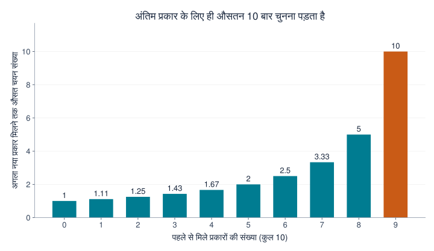
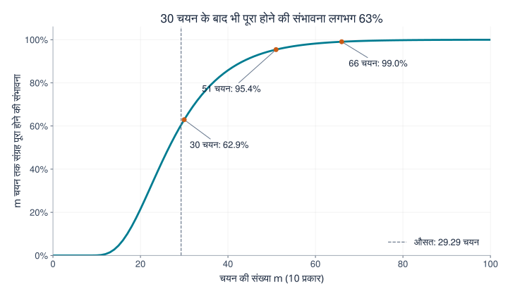
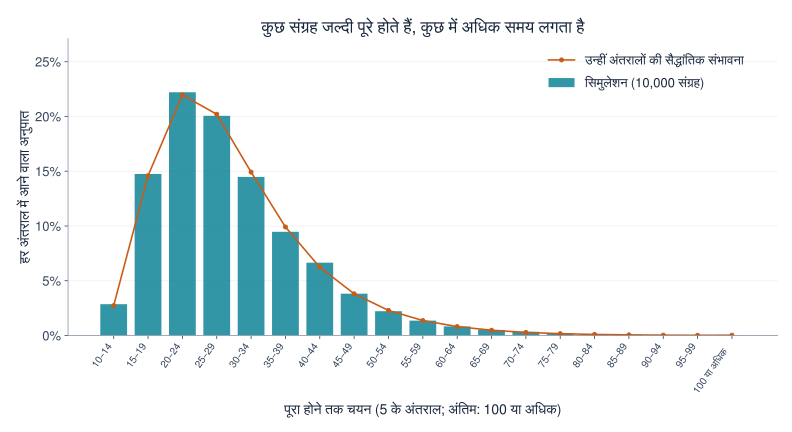

## 1. आख़िरी कार्ड मिलने में इतना समय क्यों लगता है?

मान लीजिए कार्ड 10 प्रकार के हैं और हर बंद पैकेट में एक कार्ड है। हर प्रकार मिलने की संभावना समान है। शुरू में लगभग हर पैकेट कोई नया कार्ड देता है। फिर पुराने कार्ड बार-बार आने लगते हैं। जब केवल एक प्रकार बाकी रह जाता है, तो इंतज़ार सबसे लंबा महसूस होता है।

**[कूपन संग्राहक समस्या](https://kenji.blog/hi/p/coupon-collector-problem/)** इसी अनुभव का गणितीय अध्ययन है। यहाँ कूपन का अर्थ केवल छूट वाला कूपन नहीं, बल्कि अलग-अलग प्रकारों वाली कोई भी संग्रहणीय वस्तु है—जैसे कार्ड, स्टिकर या छोटे खिलौने।

10 प्रकारों के लिए उत्तर है **औसतन लगभग 29.3 चयन**। लेकिन इसका मतलब यह नहीं कि 30 चयन में संग्रह निश्चित रूप से पूरा हो जाएगा। इसकी संभावना लगभग 62.9% है। कम-से-कम 95% संभावना के लिए 51 चयन चाहिए। आइए इन संख्याओं को निकालें, उनका फैलाव देखें और Python से प्रयोग करें।

## 2. पहले चयन के नियम तय करें

हमारा मूल मॉडल इन धारणाओं पर आधारित है:

- कुल $n$ प्रकार हैं और हर चयन में एक कार्ड मिलता है।
- हर प्रकार की संभावना हर बार समान $1/n$ है।
- चयन स्वतंत्र हैं; पिछले परिणाम अगले चयन को प्रभावित नहीं करते।
- वही कार्ड दोबारा आ सकता है; अदला-बदली या दोहराव रोकने की व्यवस्था नहीं है।
- शुरुआत खाली संग्रह से होती है और हर प्रकार कम-से-कम एक बार मिलने पर प्रक्रिया समाप्त होती है।

यह **प्रतिस्थापन के साथ नमूना चयन** है: जैसे गेंद निकालकर वापस डिब्बे में रख देना और फिर चुनना। सीमित भंडार से बिना वापस रखे चुनना, या ऐसा पूरा डिब्बा खरीदना जिसमें सभी प्रकार मिलने की गारंटी हो, अलग मॉडल हैं।

संग्रह पूरा होने तक की चयन संख्या को $T$ लिखें। यह एक **यादृच्छिक चर** है, क्योंकि हर प्रयोग में बदल सकती है। इसका **अपेक्षित मान** $E[T]$ बार-बार नए सिरे से संग्रह करने पर मिलने वाला औसत है, किसी एक व्यक्ति के परिणाम की भविष्यवाणी नहीं। हम मुख्यतः $n=10$ लेंगे, पर सूत्र किसी भी धनात्मक पूर्णांक प्रकार-संख्या के लिए काम करते हैं।

## 3. अगले नए प्रकार तक के इंतज़ार में बाँटें

### जितने अधिक प्रकार मिल चुके हैं, उतने कम परिणाम नए हैं

अगर $k$ प्रकार मिल चुके हैं, तो $n-k$ प्रकार बाकी हैं। अगली बार नया प्रकार मिलने की संभावना है

$$
p_k=\frac{n-k}{n}
$$

10 प्रकारों में पहला कार्ड निश्चित रूप से नया होगा। पाँच प्रकार मिल जाने पर संभावना $5/10$ है; नौ प्रकार मिलने पर केवल $1/10$।

कार्डों की अपनी संभावना नहीं बदली है। **हमारे लिए नए माने जाने वाले परिणाम कम हो गए हैं।** अंत में गति धीमी होने के लिए चयन के नियमों का प्रतिकूल होना ज़रूरी नहीं।

### सफलता की संभावना $p$ हो तो औसत इंतज़ार $1/p$ है

पहली सफलता तक की कोशिशों को $X$ कहें, जिसमें सफल कोशिश भी शामिल हो। यदि हर स्वतंत्र कोशिश की सफलता-सम्भावना $p$ है, तो $X$ ज्यामितीय वितरण का पालन करता है:

$$
P(X=r)=(1-p)^{r-1}p
\qquad (r=1,2,3,\ldots)
$$

तीसरी कोशिश में पहली सफलता के लिए क्रम होना चाहिए: असफलता, असफलता, सफलता। इसकी संभावना $(1-p)^2p$ है।

औसत इंतज़ार $a$ मानें। एक कोशिश तो हमेशा करनी होगी। यदि वह असफल होती है, जिसकी संभावना $1-p$ है, तो हम फिर उसी स्थिति में आ जाते हैं और औसतन $a$ अतिरिक्त कोशिशें चाहिए। इसलिए

$$
a=1+(1-p)a
\quad\Longrightarrow\quad
a=\frac{1}{p}
$$

संभावना $1/2$ हो तो औसत दो कोशिशें है; $1/10$ हो तो दस। इसका अर्थ यह नहीं कि दसवीं कोशिश में सफलता अधिक संभावित है। औसत में छोटे और लंबे दोनों इंतज़ार शामिल हैं।

### चरणों को जोड़कर कुल अपेक्षा निकालें

अगर $k$ प्रकार से $k+1$ प्रकार तक पहुँचने की चयन संख्या $X_k$ है, तो

$$
E[X_k]=\frac{1}{p_k}=\frac{n}{n-k}
$$

पूरा संग्रह बनाने के लिए सभी चरण क्रम से पूरे करने होंगे:

$$
T=X_0+X_1+\cdots+X_{n-1}
$$

अपेक्षा की रैखिकता के अनुसार, योग का अपेक्षित मान अपेक्षित मानों का योग है। इस गुण के लिए अपने आप में स्वतंत्रता आवश्यक नहीं है। इसलिए

$$
\begin{aligned}
E[T]
&=\frac{n}{n}+\frac{n}{n-1}+\cdots+\frac{n}{1}\\
&=n\left(1+\frac12+\cdots+\frac1n\right)\\
&=nH_n
\end{aligned}
$$

$H_n$ को $n$वीं **हार्मोनिक संख्या** कहते हैं: 1 से $n$ तक के पूर्णांकों के व्युत्क्रमों का योग। यही चरणबद्ध तर्क [MIT के व्याख्यान नोट्स](https://ocw.mit.edu/courses/6-856j-randomized-algorithms-fall-2002/resources/n4/) में भी दिया गया है।

## 4. अंतिम चरण का इंतज़ार ग्राफ़ में देखें

10 प्रकारों के कुछ चरण इस प्रकार हैं:

| पहले से मिले प्रकार | नया प्रकार मिलने की संभावना | अगले नए प्रकार तक औसत अतिरिक्त चयन |
|---|---|---|
| 0 | 100% | 1 |
| 5 | 50% | 2 |
| 8 | 20% | 5 |
| 9 | 10% | 10 |



*चित्र 1. हर स्तंभ केवल उस चरण का इंतज़ार दिखाता है, संचयी चयन संख्या नहीं। अंतिम स्तंभ पहले से दस गुना ऊँचा है।*

दसों स्तंभों का योग है

$$
E[T]=10H_{10}\approx29.29
$$

नौ प्रकार तक पहुँचने में औसतन लगभग 19.29 चयन लगते हैं और आख़िरी प्रकार के लिए दस और। **केवल आख़िरी प्रकार कुल औसत इंतज़ार का लगभग 34% लेता है।** संग्रह का बचा हुआ 10% ज़रूरी नहीं कि मेहनत का केवल 10% माँगे।

आख़िरी कार्ड का विशेष रूप से दुर्लभ होना भी आवश्यक नहीं। जो भी प्रकार बचा है, उसकी संभावना हर बार $1/10$ है। उसे पाने की 20 कोशिशें असफल होने के बाद भी अगली सफलता की संभावना $1/10$ और अतिरिक्त औसत इंतज़ार दस ही रहता है। इसे ज्यामितीय वितरण का **स्मृतिहीन गुण** कहते हैं।

## 5. प्रकारों की संख्या बढ़ने पर क्या होता है?

उसी सूत्र से निम्न अनुमानित मान मिलते हैं:

| प्रकार $n$ | अपेक्षित चयन $nH_n$ | चयन और प्रकारों का अनुपात |
|---|---|---|
| 6 | 14.70 | 2.45 |
| 10 | 29.29 | 2.93 |
| 20 | 71.95 | 3.60 |
| 50 | 224.96 | 4.50 |
| 100 | 518.74 | 5.19 |

प्रकार 10 से 20 करने पर औसत लगभग 29 से 72 चयन हो जाता है—सिर्फ़ दोगुना नहीं। अधिक प्रकारों के साथ अंतिम चरण में दोहराव के बीच इंतज़ार भी बढ़ता है।

बड़े $n$ के लिए हार्मोनिक संख्या को प्राकृतिक लघुगणक से सन्निकट कर सकते हैं:

$$
H_n\approx\ln n+\gamma+\frac{1}{2n}
$$

यहाँ $\ln$ प्राकृतिक लघुगणक है और $\gamma\approx0.57721$ ऑयलर–मास्केरोनी नियतांक है। इसलिए

$$
E[T]\approx n\ln n+\gamma n+\frac12
$$

अपेक्षा लगभग $n\ln n$ के पैमाने पर बढ़ती है। लेकिन 10 या 20 प्रकारों के लिए ठोस संख्या चाहिए तो हार्मोनिक योग सीधे निकालना सरल और केवल $n\ln n$ लेने से अधिक सटीक है।

## 6. औसत 29.3 होने पर भी 30 चयन में पूरा होना तय नहीं

### औसत और पूरा होने की संभावना अलग हैं

$P(T\le m)$ का अर्थ है अधिकतम $m$ चयन में संग्रह पूरा होने की संभावना। यह औसत चयन संख्या से अलग प्रश्न का उत्तर है।

10 प्रकारों का निम्न ग्राफ़ स्थितियों की संभावनाएँ क्रमशः अद्यतन करके निकाला गया है; यह यादृच्छिक सिमुलेशन का अनुमान नहीं है।



*चित्र 2. क्षैतिज अक्ष चयन संख्या दिखाता है और ऊर्ध्वाधर अक्ष तब तक पूरा होने की संभावना। चयन संख्या पूर्णांक है; बिंदुओं को पढ़ने में सुविधा के लिए जोड़ा गया है।*

| चयन | तब तक पूरा होने की अनुमानित संभावना |
|---|---|
| 10 | 0.036% |
| 20 | 21.5% |
| 30 | 62.9% |
| 40 | 85.8% |
| 50 | 94.9% |
| 60 | 98.2% |

दस चयन में पूरा होने के लिए कोई कार्ड दोहरना नहीं चाहिए। इसकी संभावना $10!/10^{10}$ है। इसलिए जितने प्रकार हों, उतने ही चयन करना बहुत कम बार पर्याप्त होगा।

50%, 90%, 95% और 99% संभावना तक पहली बार पहुँचने की न्यूनतम चयन संख्याएँ क्रमशः 27, 44, 51 और 66 हैं। ऐसे सीमांत मान **क्वांटाइल** कहलाते हैं; 50% वाला मान माध्यिका है। वितरण की दाईं ओर लंबी पूँछ होने से कुछ बहुत लंबे संग्रह औसत को ऊपर खींचते हैं, इसलिए माध्यिका औसत से छोटी है।

### ग्राफ़ की गणना कैसे होती है?

मानें $q_m(k)$, $m$ चयन के बाद ठीक $k$ प्रकार होने की संभावना है। शुरुआत में $q_0(0)=1$ और बाकी स्थितियों की संभावना शून्य है।

अगले चयन के बाद $k$ प्रकार दो तरीकों से हो सकते हैं:

1. पहले से $k$ प्रकार हों और पुराना कार्ड मिले।
2. पहले $k-1$ प्रकार हों और नया प्रकार मिले।

दोनों रास्तों की संभावनाएँ जोड़ने पर

$$
q_{m+1}(k)=\frac{k}{n}q_m(k)
+\frac{n-k+1}{n}q_m(k-1)
\qquad (1\le k\le n)
$$

एक चयन के बाद शून्य प्रकार नहीं हो सकते, इसलिए $q_{m+1}(0)=0$। पूरा संग्रह पूरा ही रहता है, इसलिए $q_m(n)=P(T\le m)$। यह [डायनेमिक प्रोग्रामिंग](/hi/p/dp-algorithm-master-guide/) है, जिसमें मिले हुए प्रकारों की संख्या स्थिति है।

कार्डों की पहचान को अनदेखा कर सकते हैं क्योंकि सभी प्रकार समान संभावना वाले हैं। असमान संभावनाओं में केवल प्रकारों की संख्या से अगला नया कार्ड मिलने की संभावना निर्धारित नहीं होगी।

## 7. Python में 10,000 संग्रहों का सिमुलेशन

यह कोड केवल Python की मानक लाइब्रेरी का उपयोग करता है। हर प्रयोग खाली संग्रह से शुरू होकर दसों प्रकार मिलने तक चलता है और इसे 10,000 बार दोहराया जाता है।

```python
import random
import statistics

n = 10
trials = 10_000
rng = random.Random(20260915)

def collect_all(n, rng):
    collected = set()
    draws = 0
    while len(collected) < n:
        collected.add(rng.randrange(n))
        draws += 1
    return draws

results = [collect_all(n, rng) for _ in range(trials)]
theory = n * sum(1 / k for k in range(1, n + 1))

print(f"सैद्धांतिक औसत (चयन): {theory:.2f}")
print(f"सिमुलेशन का औसत (चयन): {statistics.mean(results):.2f}")
print(f"सिमुलेशन की माध्यिका (चयन): {statistics.median(results):.1f}")
print(f"30 चयन तक पूरे हुए संग्रहों का अनुपात: {sum(t <= 30 for t in results) / trials:.1%}")
```

`set` दोहराए गए तत्व हटा देता है, इसलिए पुराना कार्ड आने पर आकार नहीं बढ़ता। `randrange(n)` 0 से $n-1$ तक का पूर्णांक समान संभावना से चुनता है। समुच्चय में $n$ तत्व होते ही प्रयोग रुकता है।

यादृच्छिक जनक का बीज निश्चित है, इसलिए उसी वातावरण में परिणाम दोहराया जा सकता है। बीज बदलने पर परिणाम थोड़ा बदलेगा; सैद्धांतिक मान से पूरी तरह न मिलना अपने आप में कोड की गलती नहीं है।

इस प्रयोग में औसत 29.2929 चयन, माध्यिका 27 और 30 चयन तक पूरा होने का अनुपात 63.27% मिला, जो सैद्धांतिक लगभग 62.9% के पास है।



*चित्र 3. स्तंभ सिमुलेशन के अनुपात दिखाते हैं; वृत्त संचयी संभावनाओं के अंतर से निकली सैद्धांतिक संभावनाएँ हैं। दोनों में पाँच चयन के अंतराल हैं और अंतिम में 100 या अधिक के सभी परिणाम शामिल हैं।*

कई प्रयोग औसत के आसपास समाप्त होते हैं, पर कुछ बहुत अधिक समय लेते हैं। 29.3 इस विविधता का औसत है, हर व्यक्ति के लगभग 29 चयन में पूरा करने का वादा नहीं। **[बड़ी संख्याओं का नियम](https://kenji.blog/hi/p/law-of-large-numbers/)** प्रयोगात्मक औसत और सैद्धांतिक अपेक्षा का संबंध समझाता है।

## 8. फैलाव कितना बड़ा है?

ज्यामितीय इंतज़ार का प्रसरण $(1-p)/p^2$ है। हमारे स्वतंत्र, समान-सम्भाव्यता मॉडल में अलग-अलग चरणों के इंतज़ार भी स्वतंत्र हैं, इसलिए उनके प्रसरण जुड़ते हैं:

$$
\begin{aligned}
\operatorname{Var}(T)
&=\sum_{j=1}^{n}\frac{1-j/n}{(j/n)^2}\\
&=n^2\sum_{j=1}^{n}\frac{1}{j^2}-nH_n
\end{aligned}
$$

यहाँ $j$ बाकी प्रकारों की संख्या है। $n=10$ पर प्रसरण का वर्गमूल, यानी **मानक विचलन**, लगभग 11.21 चयन है—29.29 के औसत की तुलना में काफ़ी बड़ा।

लेकिन इससे यह निष्कर्ष नहीं निकालना चाहिए कि लगभग 95% परिणाम औसत से दो मानक विचलन के भीतर होंगे। यह वितरण न सामान्य है, न सममित। पूरा होने की संभावना के लिए संचयी ग्राफ़ का सीधे उपयोग करें।

10,000 स्वतंत्र प्रयोगों के औसत का मानक विचलन कहीं छोटा है: $11.21/\sqrt{10000}\approx0.112$ चयन। अलग-अलग संग्रहों में बड़ा अंतर हो सकता है, लेकिन उनका औसत अपेक्षाकृत स्थिर रहता है। व्यक्तिगत परिणामों का फैलाव और अनुमानित औसत की अनिश्चितता अलग मात्राएँ हैं।

## 9. वास्तविक परिस्थितियों में सावधानियाँ

### कोई प्रकार दुर्लभ हो तो

यदि प्रकार $i$ की संभावना $p_i$ है, तो उसके पहली बार आने तक औसतन $1/p_i$ चयन लगते हैं। पूरा संग्रह उससे पहले समाप्त नहीं हो सकता, इसलिए

$$
E[T]\ge\max_i\frac{1}{p_i}
$$

केवल 0.1% संभावना वाले एक प्रकार को पाने में ही औसतन 1,000 चयन चाहिए। समान संभावना वाले दस प्रकारों का 29.3 वाला उत्तर यहाँ लागू नहीं कर सकते।

$\sum_i1/p_i$ को सीधे जोड़ना भी गलत है: प्रकार एक ही चयन-क्रम में साथ-साथ मिलते हैं। एक का इंतज़ार करते हुए दूसरे आ सकते हैं। खंड 3 में जोड़े गए चरण लगातार थे और एक-दूसरे पर चढ़ते नहीं थे।

### अदला-बदली या दोहराव रोकने की व्यवस्था

दोहराए गए कार्ड बदल सकना या हर बार नया प्रकार मिलने की गारंटी आवश्यक संख्या बदल देती है। हर चयन नया हो तो ठीक $n$ चयन पर्याप्त हैं।

ऐसी व्यवस्था के बिना यह मानने का आधार नहीं कि आख़िरी कार्ड “अब तो आना ही चाहिए”। अगले $r$ चयन में उसे पाने की संभावना है

$$
1-\left(1-\frac1n\right)^r
$$

दस प्रकारों में अंतिम प्रकार को दस चयन में पाने की संभावना लगभग 65.1% है; करीब 34.9% को और इंतज़ार करना पड़ता है। दस का औसत गारंटी नहीं है। अदला-बदली या गारंटी के बिना कोई भी सीमित चयन संख्या 100% पूर्णता सुनिश्चित नहीं करती।

### सॉफ़्टवेयर परीक्षण से संबंध

इनपुट परीक्षणों को यादृच्छिक रूप से चुनना, जब तक हर परीक्षण कम-से-कम एक बार न चल जाए, समान संरचना वाला प्रश्न है। जैसे-जैसे बिना चले परीक्षण घटते हैं, पहले से चले परीक्षण दोहराने का अनुपात बढ़ता है।

वास्तविक परीक्षण समान संभावना वाले नहीं भी हो सकते हैं, और हर एक को एक बार चलाना गुणवत्ता की गारंटी नहीं है। सबक यह है कि बहुत सारे यादृच्छिक प्रयास और पूरे लक्ष्य को कवर करना अलग बातें हैं। बचे हुए परीक्षणों को दर्ज करके प्राथमिकता देना अंतिम दोहराव घटा सकता है।

## 10. निष्कर्ष: कठिनाई अंत में बढ़ती है

अगले नए प्रकार तक के इंतज़ार में बाँटने पर, समान संभावना वाले $n$ प्रकारों के लिए औसत $nH_n$ मिलता है। बाकी प्रकार घटने के साथ नया प्रकार मिलने की संभावना घटती है और आख़िरी प्रकार अकेले औसतन $n$ चयन माँगता है।

दस प्रकारों के लिए औसत लगभग 29.3 है, लेकिन 30 चयन तक पूरा होने की संभावना सिर्फ़ 62.9% है। कम-से-कम 95% के लिए 51 चयन चाहिए। **औसत, माध्यिका और पूर्णता की संभावना में अंतर रखें।**

आख़िरी कार्ड का इंतज़ार करने की झुंझलाहट का स्पष्ट गणितीय कारण है। Python में प्रकार छह या बीस करिए, पहले अनुमान लगाइए और फिर प्रयोग चलाइए। दोहराए गए कार्ड हार्मोनिक संख्याओं और प्रायिकता वितरणों को समझने का ठोस रास्ता बन जाते हैं।

### संदर्भ और पुनरुत्पादन की फ़ाइलें

- [कूपन संग्रह पर MIT OpenCourseWare के नोट्स](https://ocw.mit.edu/courses/6-856j-randomized-algorithms-fall-2002/resources/n4/) — चरणों से अपेक्षा और प्रायिकता की सीमाएँ।
- [ग्राफ़ बनाने की Python स्क्रिप्ट](generate_graphs.hi.py) — Python, Matplotlib और भाषा का समर्थन करने वाला फ़ॉन्ट चाहिए।
- [गणना के आँकड़े, JSON](calculation-results.hi.json) — सैद्धांतिक मान, पूर्णता की संभावनाएँ और सिमुलेशन सारांश।

ग्राफ़ बताए गए मॉडल से स्वतंत्र रूप से गणना करके बनाए गए हैं। जनरेट किया गया आवरण चित्र विषय की कल्पनात्मक प्रस्तुति है, मात्रात्मक ग्राफ़ नहीं।

