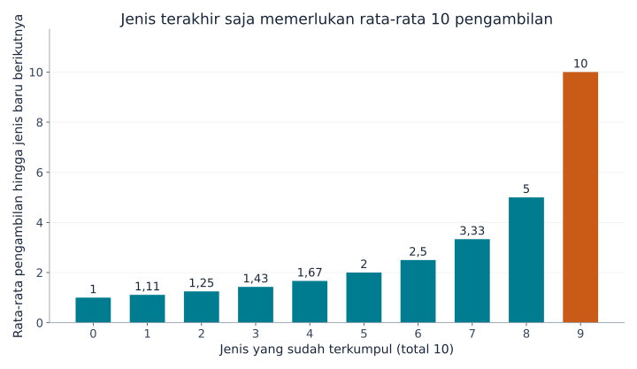
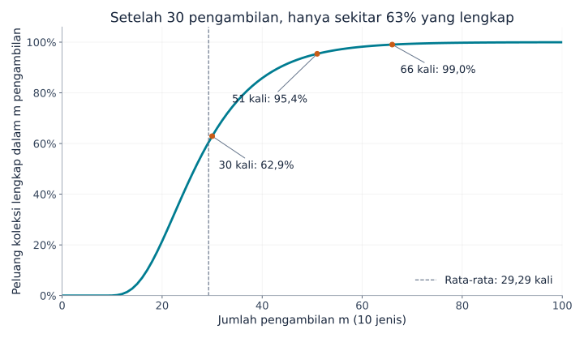
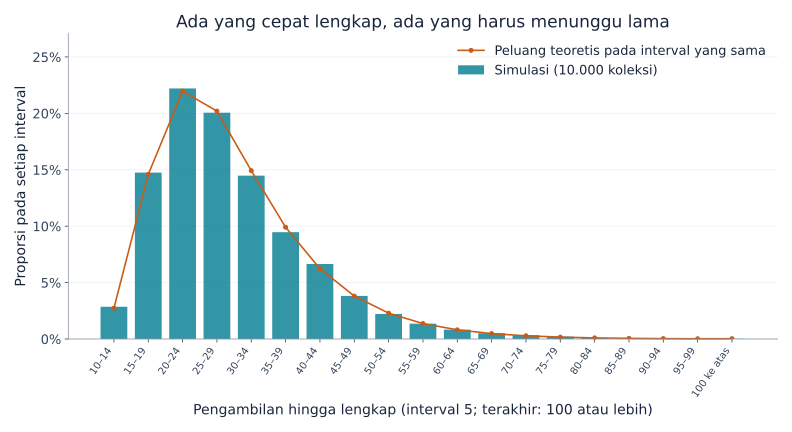

## 1. Mengapa kartu terakhir begitu sulit didapat?

Bayangkan ada 10 jenis kartu, satu kartu dalam setiap kemasan tertutup. Peluang setiap jenis sama. Awalnya hampir setiap kemasan menambah jenis baru. Lama-kelamaan kartu duplikat menumpuk. Ketika tinggal satu jenis yang belum didapat, penantiannya terasa paling panjang.

**[Masalah pengumpul kupon](https://kenji.blog/id/p/coupon-collector-problem/)** menjelaskan pengalaman ini secara matematis. “Kupon” di sini berarti benda koleksi dengan jenis yang dapat dibedakan, misalnya kartu, stiker, atau mainan kapsul; tidak harus berupa kupon diskon.

Untuk 10 jenis, jawabannya adalah **rata-rata sekitar 29,3 pengambilan**. Namun, itu bukan jaminan selesai dalam 30 pengambilan. Peluangnya sekitar 62,9%; untuk mencapai setidaknya 95%, diperlukan 51 pengambilan. Kita akan menurunkan angka-angka ini, melihat variasinya, dan mengujinya dengan Python.

## 2. Tetapkan aturan terlebih dahulu

Model dasar kita memakai asumsi berikut:

- Ada $n$ jenis dan setiap pengambilan memberikan satu kartu.
- Peluang setiap jenis selalu sama, yaitu $1/n$.
- Pengambilan saling independen; hasil sebelumnya tidak mengubah hasil berikutnya.
- Duplikat boleh muncul, tanpa pertukaran atau perlindungan dari duplikat.
- Koleksi dimulai dari kosong dan selesai setelah setiap jenis muncul setidaknya sekali.

Ini adalah pengambilan **dengan pengembalian**, seperti mengembalikan bola ke kotak sebelum mengambil lagi. Persediaan terbatas tanpa pengembalian, atau satu kotak yang menjamin semua jenis, memerlukan model lain.

Misalkan $T$ adalah jumlah pengambilan hingga lengkap. Ini merupakan **peubah acak** karena nilainya berbeda pada setiap percobaan. **Nilai harapan** $E[T]$ adalah rata-rata jika proses mengoleksi diulang dari awal berkali-kali, bukan ramalan untuk satu orang. Kita terutama memakai $n=10$, tetapi rumusnya berlaku untuk jumlah jenis positif berapa pun.

## 3. Pecah proses menjadi waktu tunggu jenis baru

### Semakin banyak jenis terkumpul, semakin sedikit hasil yang baru

Jika sudah ada $k$ jenis, masih tersisa $n-k$ jenis. Peluang memperoleh jenis baru pada pengambilan berikutnya adalah

$$
p_k=\frac{n-k}{n}
$$

Untuk 10 jenis, kartu pertama pasti baru. Setelah lima jenis terkumpul, peluangnya $5/10$; setelah sembilan jenis, hanya $1/10$.

Kartu-kartunya tidak menjadi lebih langka. **Jumlah hasil yang masih baru bagi kita semakin sedikit.** Kemajuan yang melambat di akhir tidak memerlukan perubahan mekanisme pengambilan.

### Keberhasilan berpeluang $p$ memerlukan rata-rata $1/p$ percobaan

Misalkan $X$ menghitung percobaan sampai keberhasilan pertama, termasuk percobaan yang berhasil. Jika setiap percobaan independen berhasil dengan peluang $p$, maka $X$ berdistribusi geometrik:

$$
P(X=r)=(1-p)^{r-1}p
\qquad (r=1,2,3,\ldots)
$$

Keberhasilan pertama pada percobaan ketiga membutuhkan urutan “gagal, gagal, berhasil”, dengan peluang $(1-p)^2p$.

Tuliskan rata-rata waktu tunggu sebagai $a$. Satu percobaan selalu dilakukan. Jika gagal, dengan peluang $1-p$, kita kembali ke keadaan yang sama dan memerlukan rata-rata $a$ percobaan lagi. Jadi,

$$
a=1+(1-p)a
\quad\Longrightarrow\quad
a=\frac{1}{p}
$$

Peluang $1/2$ menghasilkan rata-rata dua percobaan; $1/10$ menghasilkan sepuluh. Percobaan kesepuluh tidak menjadi lebih mungkin berhasil: rata-rata tersebut menggabungkan penantian singkat dan panjang.

### Jumlahkan semua tahap

Misalkan $X_k$ adalah jumlah pengambilan untuk berpindah dari $k$ jenis ke $k+1$ jenis. Maka,

$$
E[X_k]=\frac{1}{p_k}=\frac{n}{n-k}
$$

Koleksi lengkap harus melewati seluruh tahap:

$$
T=X_0+X_1+\cdots+X_{n-1}
$$

Menurut linearitas nilai harapan, nilai harapan suatu jumlah sama dengan jumlah nilai harapannya. Sifat ini sendiri tidak mensyaratkan independensi. Karena itu,

$$
\begin{aligned}
E[T]
&=\frac{n}{n}+\frac{n}{n-1}+\cdots+\frac{n}{1}\\
&=n\left(1+\frac12+\cdots+\frac1n\right)\\
&=nH_n
\end{aligned}
$$

$H_n$ disebut **bilangan harmonik** ke-$n$, yakni jumlah kebalikan bilangan bulat 1 sampai $n$. Penalaran per tahap ini juga dijelaskan dalam [catatan kuliah MIT](https://ocw.mit.edu/courses/6-856j-randomized-algorithms-fall-2002/resources/n4/).

## 4. Melihat penantian di akhir melalui grafik

Beberapa tahap untuk 10 jenis adalah:

| Jenis yang sudah terkumpul | Peluang jenis baru | Rata-rata pengambilan tambahan |
|---|---|---|
| 0 | 100% | 1 |
| 5 | 50% | 2 |
| 8 | 20% | 5 |
| 9 | 10% | 10 |



*Gambar 1. Setiap batang hanya menunjukkan waktu tunggu tahap itu, bukan jumlah kumulatif. Batang terakhir sepuluh kali lebih tinggi daripada yang pertama.*

Jumlah seluruh sepuluh batang adalah

$$
E[T]=10H_{10}\approx29.29
$$

Mencapai sembilan jenis memerlukan rata-rata sekitar 19,29 pengambilan, lalu jenis terakhir memerlukan sepuluh lagi. **Jenis terakhir menyumbang sekitar 34% dari total waktu rata-rata.** Sisa 10% koleksi tidak selalu membutuhkan hanya 10% usaha.

Jenis terakhir juga tidak harus langka. Apa pun jenis yang tersisa, peluangnya tetap $1/10$. Bahkan setelah 20 kali gagal mendapatkannya, peluang pengambilan berikutnya masih $1/10$ dan rata-rata penantian tambahan tetap sepuluh. Inilah sifat **tanpa ingatan** pada distribusi geometrik.

## 5. Bagaimana jika jumlah jenis bertambah?

Rumus yang sama memberikan nilai pembulatan berikut:

| Jenis $n$ | Nilai harapan pengambilan $nH_n$ | Rasio pengambilan terhadap jenis |
|---|---|---|
| 6 | 14,70 | 2,45 |
| 10 | 29,29 | 2,93 |
| 20 | 71,95 | 3,60 |
| 50 | 224,96 | 4,50 |
| 100 | 518,74 | 5,19 |

Menggandakan jenis dari 10 menjadi 20 meningkatkan rata-rata dari sekitar 29 menjadi 72 pengambilan, lebih dari dua kali lipat. Selain ada lebih banyak jenis, penantian akibat duplikat di tahap akhir ikut bertambah.

Untuk $n$ besar, bilangan harmonik dapat didekati dengan logaritma natural:

$$
H_n\approx\ln n+\gamma+\frac{1}{2n}
$$

$\ln$ adalah logaritma natural dan $\gamma\approx0.57721$ adalah konstanta Euler–Mascheroni. Jadi,

$$
E[T]\approx n\ln n+\gamma n+\frac12
$$

Nilai harapan tumbuh pada skala $n\ln n$. Untuk angka konkret seperti 10 atau 20 jenis, menjumlahkan bilangan harmonik secara langsung mudah dan lebih akurat daripada hanya memakai $n\ln n$.

## 6. Rata-rata 29,3 bukan jaminan selesai dalam 30 kali

### Rata-rata dan peluang selesai adalah hal berbeda

$P(T\le m)$ menyatakan peluang koleksi lengkap dalam paling banyak $m$ pengambilan. Pertanyaan ini berbeda dari rata-rata jumlah pengambilan.

Kurva untuk 10 jenis berikut dihitung dengan memperbarui peluang setiap keadaan, bukan diperkirakan melalui simulasi acak.



*Gambar 2. Sumbu mendatar menunjukkan jumlah pengambilan, sedangkan sumbu tegak menunjukkan peluang sudah lengkap. Jumlah pengambilan berupa bilangan bulat; titik-titik dihubungkan agar mudah dibaca.*

| Pengambilan | Perkiraan peluang sudah lengkap |
|---|---|
| 10 | 0,036% |
| 20 | 21,5% |
| 30 | 62,9% |
| 40 | 85,8% |
| 50 | 94,9% |
| 60 | 98,2% |

Selesai dalam sepuluh pengambilan mengharuskan tidak ada duplikat sama sekali, dengan peluang $10!/10^{10}$. Mengambil kartu sebanyak jumlah jenisnya sangat jarang cukup.

Jumlah pengambilan terkecil yang mencapai peluang 50%, 90%, 95%, dan 99% masing-masing adalah 27, 44, 51, dan 66. Batas ini disebut **kuantil**; kuantil 50% adalah median. Median lebih kecil daripada rata-rata karena distribusinya memiliki ekor panjang di kanan: beberapa koleksi yang sangat lama menarik rata-rata ke atas.

### Menghitung kurva peluang

Misalkan $q_m(k)$ adalah peluang memiliki tepat $k$ jenis setelah $m$ pengambilan. Awalnya, $q_0(0)=1$ dan keadaan lainnya berpeluang nol.

Setelah pengambilan berikutnya, kita dapat memiliki $k$ jenis melalui dua cara:

1. Sudah memiliki $k$ jenis lalu mendapat duplikat.
2. Memiliki $k-1$ jenis lalu mendapat jenis baru.

Menjumlahkan kedua jalur memberi

$$
q_{m+1}(k)=\frac{k}{n}q_m(k)
+\frac{n-k+1}{n}q_m(k-1)
\qquad (1\le k\le n)
$$

Setelah satu pengambilan, $q_{m+1}(0)=0$. Koleksi yang lengkap tetap lengkap, sehingga $q_m(n)=P(T\le m)$. Ini adalah pemrograman dinamis dengan jumlah jenis terkumpul sebagai keadaan.

Identitas kartu dapat diabaikan karena semua jenis berpeluang sama. Jika peluangnya berbeda, jumlah jenis saja tidak cukup untuk menentukan peluang mendapatkan jenis baru.

## 7. Simulasikan 10.000 koleksi dengan Python

Kode berikut hanya memakai pustaka standar Python. Setiap percobaan dimulai dari kosong hingga sepuluh jenis terkumpul, lalu diulang 10.000 kali.

```python
import random
import statistics

n = 10
trials = 10_000
rng = random.Random(20260915)

def collect_all(n, rng):
    collected = set()
    draws = 0
    while len(collected) < n:
        collected.add(rng.randrange(n))
        draws += 1
    return draws

results = [collect_all(n, rng) for _ in range(trials)]
theory = n * sum(1 / k for k in range(1, n + 1))

print(f"Rata-rata teoretis (pengambilan): {theory:.2f}")
print(f"Rata-rata simulasi (pengambilan): {statistics.mean(results):.2f}")
print(f"Median simulasi (pengambilan): {statistics.median(results):.1f}")
print(f"Lengkap dalam 30 pengambilan: {sum(t <= 30 for t in results) / trials:.1%}")
```

`set` menghapus duplikat, sehingga kartu lama tidak menambah ukuran himpunan. `randrange(n)` memilih bilangan bulat dari 0 sampai $n-1$ dengan peluang sama. Percobaan berhenti saat himpunan memiliki $n$ anggota.

Nilai awal generator acak yang tetap membuat hasil dapat direproduksi dalam lingkungan yang sama. Nilai awal lain sedikit mengubah hasil; perbedaan kecil dari teori tidak otomatis berarti ada kesalahan kode.

Hasil percobaan ini memiliki rata-rata 29,2929 pengambilan, median 27, dan 63,27% koleksi lengkap dalam 30 pengambilan, mendekati nilai teoretis 62,9%.



*Gambar 3. Batang menunjukkan proporsi simulasi; lingkaran menunjukkan peluang teoretis dari selisih peluang kumulatif. Keduanya memakai interval lima pengambilan, dengan semua hasil 100 atau lebih masuk ke interval terakhir.*

Banyak percobaan selesai dekat rata-rata, tetapi sebagian memerlukan waktu lebih lama. Angka 29,3 merangkum variasi ini, bukan janji bahwa semua orang selesai sekitar pengambilan ke-29. **[Hukum bilangan besar](/id/p/law-of-large-numbers/)** membantu menjelaskan hubungan rata-rata eksperimen dengan nilai harapan teoretis.

## 8. Seberapa besar variasinya?

Varians waktu tunggu geometrik adalah $(1-p)/p^2$. Dalam model independen dan berpeluang sama ini, waktu tunggu antartahap juga independen sehingga variansnya dapat dijumlahkan:

$$
\begin{aligned}
\operatorname{Var}(T)
&=\sum_{j=1}^{n}\frac{1-j/n}{(j/n)^2}\\
&=n^2\sum_{j=1}^{n}\frac{1}{j^2}-nH_n
\end{aligned}
$$

$j$ menyatakan jumlah jenis yang belum didapat. Untuk $n=10$, **simpangan baku**, yaitu akar kuadrat varians, sekitar 11,21 pengambilan. Nilainya cukup besar dibandingkan rata-rata 29,29.

Jangan langsung menyimpulkan bahwa 95% hasil berada dalam dua simpangan baku dari rata-rata. Distribusi ini tidak normal dan tidak simetris. Untuk peluang selesai, gunakan langsung kurva kumulatif.

Simpangan baku rata-rata dari 10.000 percobaan independen jauh lebih kecil: $11.21/\sqrt{10000}\approx0.112$ pengambilan. Koleksi individual sangat bervariasi, tetapi rata-ratanya relatif stabil. Variasi hasil individual berbeda dari ketidakpastian rata-rata yang diperkirakan.

## 9. Hal yang perlu diperhatikan dalam penerapan

### Ada jenis yang langka

Jika jenis $i$ muncul dengan peluang $p_i$, kemunculan pertamanya memerlukan rata-rata $1/p_i$ pengambilan. Koleksi tidak mungkin lengkap sebelum jenis itu diperoleh, sehingga

$$
E[T]\ge\max_i\frac{1}{p_i}
$$

Satu jenis dengan peluang 0,1% saja memerlukan rata-rata 1.000 pengambilan. Angka 29,3 dari kasus berpeluang sama tidak dapat langsung dipakai.

Menjumlahkan $\sum_i1/p_i$ juga keliru: jenis-jenis dikumpulkan secara bersamaan sepanjang urutan pengambilan yang sama. Saat menunggu satu jenis, jenis lain dapat muncul. Yang dijumlahkan pada bagian 3 adalah tahap-tahap berurutan yang tidak tumpang tindih.

### Pertukaran dan perlindungan dari duplikat

Menukar duplikat atau menjamin jenis baru mengubah masalahnya. Jika setiap pengambilan pasti baru, tepat $n$ kali sudah cukup.

Tanpa mekanisme itu, tidak ada alasan menganggap kartu terakhir “sudah waktunya keluar”. Peluang mendapatkannya dalam $r$ pengambilan berikutnya adalah

$$
1-\left(1-\frac1n\right)^r
$$

Untuk sepuluh jenis, peluang mendapat jenis terakhir dalam sepuluh pengambilan sekitar 65,1%; sekitar 34,9% masih menunggu. Rata-rata sepuluh bukan jaminan. Tanpa pertukaran atau jaminan, tidak ada jumlah pengambilan berhingga yang memastikan selesai dengan peluang 100%.

### Kaitannya dengan pengujian perangkat lunak

Memilih kasus uji secara acak sampai semua pernah dijalankan memiliki struktur serupa. Semakin sedikit kasus yang belum dicoba, semakin banyak pilihan yang mengulangi kasus lama.

Kasus nyata tidak harus berpeluang sama, dan menjalankan semuanya sekali tidak menjamin kualitas perangkat lunak. Pelajarannya adalah membedakan banyak percobaan acak dari cakupan lengkap. Mencatat dan memprioritaskan kasus yang belum dijalankan dapat mengurangi pengulangan di akhir.

## 10. Kesimpulan: bagian tersulit adalah menyelesaikan

Membagi proses menjadi penantian jenis baru menghasilkan rata-rata $nH_n$ untuk $n$ jenis berpeluang sama. Semakin sedikit jenis tersisa, semakin kecil peluang mendapat hal baru; jenis terakhir sendiri membutuhkan rata-rata $n$ pengambilan.

Untuk sepuluh jenis, rata-ratanya 29,3, tetapi peluang selesai dalam 30 pengambilan hanya 62,9%. Agar mencapai setidaknya 95%, diperlukan 51. **Bedakan rata-rata, median, dan peluang selesai.**

Kesulitan memperoleh kartu terakhir memiliki penjelasan matematika yang jelas. Ubah jumlah jenis dalam kode menjadi enam atau dua puluh, buat perkiraan, lalu jalankan percobaannya. Kartu duplikat menjadi jalan masuk yang nyata menuju bilangan harmonik dan distribusi peluang.

### Referensi dan berkas reproduksi

- [Catatan MIT OpenCourseWare tentang pengumpulan kupon](https://ocw.mit.edu/courses/6-856j-randomized-algorithms-fall-2002/resources/n4/) — nilai harapan per tahap dan batas peluang.
- [Skrip Python pembuat grafik](generate_graphs.id.py) — membutuhkan Python, Matplotlib, dan fon yang mendukung bahasa grafik.
- [Data perhitungan JSON](calculation-results.id.json) — nilai teoretis, peluang, dan ringkasan simulasi.

Grafik dihitung dan dibuat dari model yang dijelaskan. Gambar sampul hasil generasi merupakan ilustrasi konseptual, bukan grafik kuantitatif.

