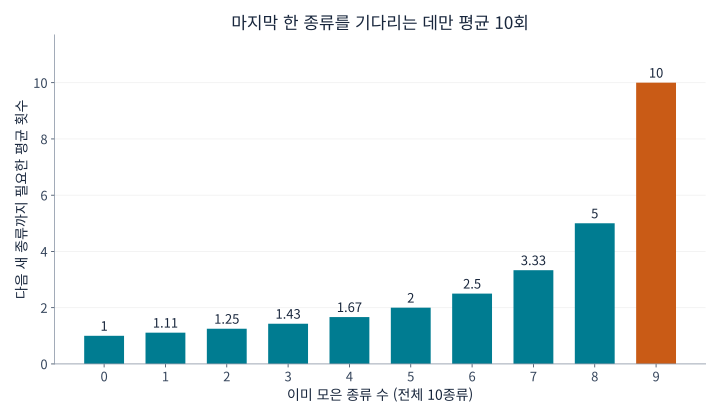
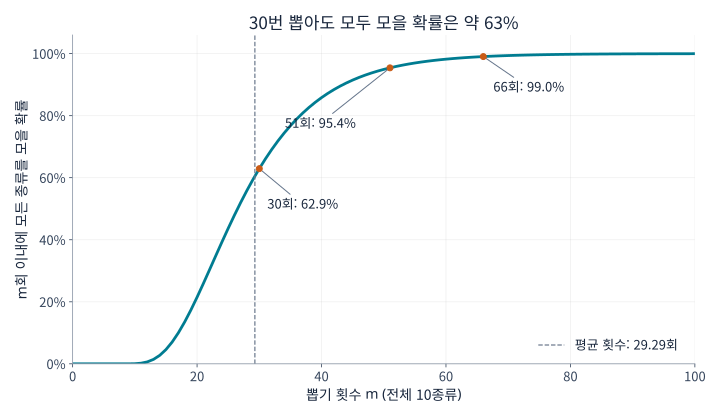
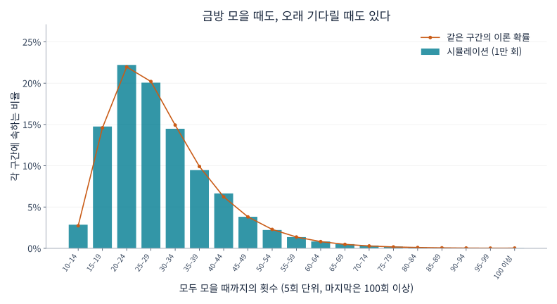

## 1. 왜 마지막 카드 한 장이 그렇게 안 나올까?

카드가 모두 10종류이고, 밀봉된 봉지마다 한 장씩 들어 있다고 해 봅시다. 각 종류가 나올 확률은 같습니다. 처음에는 새 카드가 쑥쑥 늘지만, 몇 종류만 남으면 이미 가진 카드가 계속 나옵니다. 마지막 한 종류를 남겨 두고 나서가 유난히 길게 느껴집니다.

이 경험을 수학적으로 다루는 것이 **[쿠폰 수집 문제](https://kenji.blog/ko/p/coupon-collector-problem/)**입니다. 여기서 쿠폰은 할인권에 한정되지 않습니다. 카드, 스티커, 캡슐 장난감처럼 종류를 구별할 수 있는 수집 대상을 뜻합니다.

10종류를 모두 모으는 데 필요한 횟수는 **평균 약 29.3회**입니다. 그러나 30번이면 안심해도 된다는 뜻은 아닙니다. 30회 이내에 모두 모을 확률은 약 62.9%이고, 95% 이상의 확률을 원한다면 51회가 필요합니다. 이 숫자를 차례로 유도하고, 그래프와 Python 실험으로 확인해 보겠습니다.

## 2. 먼저 뽑기의 규칙을 정하자

기본 모형은 다음을 가정합니다.

- 종류는 총 $n$개이고, 한 번 뽑을 때 카드 한 장을 얻습니다.
- 각 종류가 나올 확률은 매번 같은 $1/n$입니다.
- 뽑기는 서로 독립이며, 이전 결과가 다음 결과에 영향을 주지 않습니다.
- 같은 카드가 반복해서 나올 수 있고, 교환이나 중복 방지 기능은 없습니다.
- 아무것도 없는 상태에서 시작해 모든 종류를 한 장 이상 얻으면 끝납니다.

이는 공을 뽑은 뒤 다시 상자에 넣고 뽑는 **복원추출**에 해당합니다. 한정된 재고에서 되돌려 넣지 않고 뽑거나, 한 상자에 모든 종류가 반드시 들어 있는 경우에는 다른 모형이 필요합니다.

모든 종류를 모을 때까지의 횟수를 $T$라고 합시다. $T$는 실험마다 달라지는 **확률변수**입니다. **기댓값** $E[T]$는 수집을 처음부터 여러 번 반복했을 때의 평균이며, 특정 사람의 결과를 예언하는 숫자가 아닙니다. 주로 $n=10$으로 설명하지만 공식은 임의의 양의 종류 수에 적용됩니다.

## 3. 다음 새 종류까지의 대기 시간으로 나누기

### 이미 모은 종류가 많을수록 새 카드가 나올 가능성은 줄어든다

이미 $k$종류를 가지고 있다면, 아직 없는 종류는 $n-k$개입니다. 다음 한 번에 새 종류를 얻을 확률은

$$
p_k=\frac{n-k}{n}
$$

입니다. 전체가 10종류라면 첫 카드는 반드시 새 카드입니다. 5종류를 모았다면 $5/10$, 9종류를 모았다면 $1/10$이 됩니다.

카드 자체의 출현 확률이 바뀐 것은 아닙니다. **나에게 새로운 것으로 인정되는 종류가 줄어든 것**입니다. 막바지에 뽑기 방식이 불리하게 바뀌지 않아도 수집은 자연스럽게 느려집니다.

### 성공 확률이 $p$라면 평균 대기 횟수는 $1/p$

매번 독립적으로 확률 $p$로 성공하는 시행에서, 첫 성공까지의 횟수를 $X$라 합시다. 성공한 시행도 포함하면 $X$는 기하분포를 따릅니다.

$$
P(X=r)=(1-p)^{r-1}p
\qquad (r=1,2,3,\ldots)
$$

예를 들어 세 번째에 처음 성공하려면 ‘실패, 실패, 성공’이 일어나야 하므로 확률은 $(1-p)^2p$입니다.

평균 대기 횟수를 $a$라고 하면, 우선 한 번은 반드시 시행합니다. 확률 $1-p$로 실패한 경우에만 같은 상황으로 돌아가 평균 $a$회를 더 기다립니다. 따라서

$$
a=1+(1-p)a
\quad\Longrightarrow\quad
a=\frac{1}{p}
$$

입니다. 확률이 $1/2$이면 평균 2회, $1/10$이면 평균 10회입니다. 열 번째 시행이 더 잘 성공한다는 뜻이 아니라, 짧은 기다림과 긴 기다림을 모두 평균한 값입니다.

### 각 단계를 더하면 전체 평균을 구할 수 있다

$k$종류에서 $k+1$종류가 될 때까지의 횟수를 $X_k$라고 하면

$$
E[X_k]=\frac{1}{p_k}=\frac{n}{n-k}
$$

입니다. 모든 종류를 모으려면 이 단계들을 순서대로 거칩니다.

$$
T=X_0+X_1+\cdots+X_{n-1}
$$

기댓값의 선형성에 따르면 합의 기댓값은 기댓값의 합입니다. 이 성질 자체에는 독립성이 필요하지 않습니다. 따라서

$$
\begin{aligned}
E[T]
&=\frac{n}{n}+\frac{n}{n-1}+\cdots+\frac{n}{1}\\
&=n\left(1+\frac12+\cdots+\frac1n\right)\\
&=nH_n
\end{aligned}
$$

을 얻습니다. $H_n$은 1부터 $n$까지 정수의 역수를 더한 **조화수**입니다. 이런 단계별 풀이 방법은 [MIT 강의 자료](https://ocw.mit.edu/courses/6-856j-randomized-algorithms-fall-2002/resources/n4/)에도 소개되어 있습니다.

## 4. 그래프로 보는 막바지의 기다림

전체 10종류일 때 대표적인 단계는 다음과 같습니다.

| 이미 모은 종류 수 | 새 종류가 나올 확률 | 다음 새 종류까지의 평균 횟수 |
|---|---|---|
| 0 | 100% | 1 |
| 5 | 50% | 2 |
| 8 | 20% | 5 |
| 9 | 10% | 10 |



*그림 1. 각 막대는 해당 단계에서만 필요한 평균 횟수이며 누적 횟수가 아닙니다. 마지막 막대는 첫 막대의 10배입니다.*

10개 막대를 모두 더하면

$$
E[T]=10H_{10}\approx29.29
$$

입니다. 9종류까지는 평균 약 19.29회, 남은 한 종류에는 추가로 평균 10회가 필요합니다. **마지막 한 종류가 전체 평균 횟수의 약 34%를 차지합니다.** 수집의 남은 10%가 노력도 10%만 필요로 하는 것은 아닙니다.

마지막 카드가 특별히 희귀할 필요도 없습니다. 무엇이 남았든 다음에 나올 확률은 $1/10$입니다. 마지막 카드를 기다리며 20번 실패했어도 다음 성공 확률은 여전히 $1/10$이며, 그때부터의 평균 추가 대기 횟수도 10회입니다. 이를 기하분포의 **무기억성**이라고 합니다.

## 5. 종류가 늘어나면 얼마나 더 뽑아야 할까?

같은 공식으로 계산한 근삿값입니다.

| 종류 수 $n$ | 모두 모을 때까지의 평균 $nH_n$ | 종류 수 대비 배수 |
|---|---|---|
| 6 | 14.70 | 2.45 |
| 10 | 29.29 | 2.93 |
| 20 | 71.95 | 3.60 |
| 50 | 224.96 | 4.50 |
| 100 | 518.74 | 5.19 |

종류가 10개에서 20개로 두 배가 되면 평균은 약 29회에서 72회로 늘어납니다. 단순히 두 배가 아닙니다. 모아야 할 종류뿐 아니라 막바지의 중복 때문에 기다리는 시간도 증가하기 때문입니다.

$n$이 크면 조화수를 자연로그로 근사할 수 있습니다.

$$
H_n\approx\ln n+\gamma+\frac{1}{2n}
$$

$\ln$은 자연로그이고, $\gamma\approx0.57721$은 오일러–마스케로니 상수입니다. 따라서

$$
E[T]\approx n\ln n+\gamma n+\frac12
$$

가 됩니다. 평균 횟수는 대체로 $n\ln n$ 규모로 증가합니다. 다만 10종류나 20종류의 구체적인 값을 구할 때는 $n\ln n$만 쓰기보다 조화수를 직접 더하는 편이 쉽고 정확합니다.

## 6. 평균 29.3회여도 30회 안에 모을 확률은 약 63%

### 평균과 완료 확률은 다른 질문이다

$P(T\le m)$은 $m$회 이내에 수집을 끝낼 확률입니다. 평균 횟수와는 다른 정보를 나타냅니다.

다음은 10종류에 대한 그래프입니다. 무작위 실험으로 추정한 값이 아니라, 각 상태의 확률을 차례로 갱신하여 계산했습니다.



*그림 2. 가로축은 뽑기 횟수, 세로축은 그때까지 모두 모을 확률입니다. 횟수는 정수이지만 흐름을 읽기 쉽게 점을 선으로 연결했습니다.*

| 뽑기 횟수 | 그때까지 모두 모을 확률의 근삿값 |
|---|---|
| 10 | 0.036% |
| 20 | 21.5% |
| 30 | 62.9% |
| 40 | 85.8% |
| 50 | 94.9% |
| 60 | 98.2% |

10회 만에 모으려면 중복이 한 번도 없어야 하므로 확률은 $10!/10^{10}$입니다. 종류 수만큼만 뽑아서 완성될 가능성은 아주 낮습니다.

완료 확률이 처음으로 50%, 90%, 95%, 99% 이상이 되는 횟수는 각각 27회, 44회, 51회, 66회입니다. 이런 경곗값을 **분위수**라고 하며, 50% 분위수가 중앙값입니다. 중앙값이 평균보다 작은 이유는 분포의 오른쪽 꼬리가 길어, 드물게 아주 오래 걸리는 수집이 평균을 끌어올리기 때문입니다.

### 그래프의 확률은 어떻게 계산할까?

$m$번 뽑은 뒤 정확히 $k$종류를 가진 확률을 $q_m(k)$라 합시다. 처음에는 $q_0(0)=1$이고 나머지 상태의 확률은 0입니다.

다음 뽑기 후 $k$종류가 되는 경로는 둘입니다.

1. 이미 $k$종류를 가지고 있고 중복 카드를 뽑는다.
2. $k-1$종류를 가지고 있고 새 종류를 뽑는다.

두 경로의 확률을 더하면

$$
q_{m+1}(k)=\frac{k}{n}q_m(k)
+\frac{n-k+1}{n}q_m(k-1)
\qquad (1\le k\le n)
$$

입니다. 한 번 뽑고도 0종류일 수는 없으므로 $q_{m+1}(0)=0$입니다. 모두 모은 상태에서는 벗어나지 않으므로 $q_m(n)=P(T\le m)$입니다. 모은 종류 수를 상태로 삼는 동적 계획법입니다.

카드 이름을 기록하지 않아도 되는 것은 모든 종류의 확률이 같기 때문입니다. 확률이 다르면 종류 수만으로는 다음 새 종류가 나올 확률을 결정할 수 없습니다.

## 7. Python으로 1만 번의 수집을 시뮬레이션하기

다음 코드는 Python 표준 라이브러리만 사용합니다. 한 실험은 빈 상태에서 10종류를 모두 모을 때까지이며, 이를 1만 번 반복합니다.

```python
import random
import statistics

n = 10
trials = 10_000
rng = random.Random(20260915)

def collect_all(n, rng):
    collected = set()
    draws = 0
    while len(collected) < n:
        collected.add(rng.randrange(n))
        draws += 1
    return draws

results = [collect_all(n, rng) for _ in range(trials)]
theory = n * sum(1 / k for k in range(1, n + 1))

print(f"이론 평균 (회): {theory:.2f}")
print(f"실험 평균 (회): {statistics.mean(results):.2f}")
print(f"실험 중앙값 (회): {statistics.median(results):.1f}")
print(f"30회 이내 완료 비율: {sum(t <= 30 for t in results) / trials:.1%}")
```

`set`은 중복을 제거하는 집합입니다. 기존 카드를 뽑아도 원소 수가 늘지 않습니다. `randrange(n)`은 0부터 $n-1$까지 정수를 같은 확률로 고르고, 집합 크기가 $n$이 되면 종료합니다.

난수 시드를 고정하여 같은 실행 환경에서 결과를 재현할 수 있습니다. 시드를 바꾸면 실험값도 조금 달라지므로, 이론값과 완전히 같지 않다고 바로 구현 오류라고 볼 수는 없습니다.

이번 실행에서는 평균 29.2929회, 중앙값 27회, 30회 이내 완료 비율 63.27%가 나왔습니다. 완료 비율도 이론값 약 62.9%에 가깝습니다.



*그림 3. 막대는 실험 비율, 원은 누적 확률의 차로 구한 이론 확률입니다. 둘 다 5회 단위로 묶었으며 100회 이상인 결과도 마지막 구간에 모두 포함했습니다.*

많은 실험이 평균 근처에서 끝나지만 상당히 오래 걸리는 경우도 있습니다. 약 29.3회는 이런 변동을 평균한 결과이지 모두가 29회쯤 끝난다는 뜻이 아닙니다. **큰 수의 법칙**은 반복 실험의 평균과 이론적 기댓값의 관계를 이해하는 데 도움이 됩니다.

## 8. 평균 주변의 변동은 얼마나 클까?

기하분포의 분산은 $(1-p)/p^2$입니다. 이 독립·동일 확률 모형에서는 단계별 대기 시간도 독립이므로 분산을 더할 수 있습니다.

$$
\begin{aligned}
\operatorname{Var}(T)
&=\sum_{j=1}^{n}\frac{1-j/n}{(j/n)^2}\\
&=n^2\sum_{j=1}^{n}\frac{1}{j^2}-nH_n
\end{aligned}
$$

여기서 $j$는 아직 없는 종류 수입니다. $n=10$이면 분산의 제곱근인 **표준편차**는 약 11.21회로, 평균 29.29회에 비해 꽤 큽니다.

그렇다고 평균에서 표준편차의 두 배 이내에 약 95%가 있다고 자동으로 해석하면 안 됩니다. 이 분포는 정규분포도, 대칭분포도 아닙니다. 완료 확률은 누적 확률 그래프에서 직접 구하는 편이 정확합니다.

반면 독립 실험 1만 번의 평균 자체의 표준편차는 $11.21/\sqrt{10000}\approx0.112$회로 작아집니다. 개별 수집은 크게 흔들려도 여러 번의 평균은 비교적 안정적입니다. 개별 결과의 변동과 평균 추정의 불확실성은 서로 다른 양입니다.

## 9. 현실에 적용할 때 주의할 점

### 희귀한 종류가 있다면

종류 $i$의 확률을 $p_i$라 하면, 처음 얻을 때까지 평균 $1/p_i$회가 필요합니다. 전체 수집이 그보다 먼저 끝날 수는 없으므로

$$
E[T]\ge\max_i\frac{1}{p_i}
$$

입니다. 한 종류의 확률이 0.1%라면 그것을 처음 얻는 데만 평균 1,000회가 걸립니다. 동일 확률 10종류의 결과인 29.3회를 그대로 쓸 수 없습니다.

또한 $\sum_i1/p_i$를 단순히 더하는 것도 틀립니다. 같은 뽑기 과정에서 종류들이 함께 모이므로, 한 종류를 기다리는 동안 다른 종류가 나올 수 있기 때문입니다. 3절에서 더한 것은 서로 겹치지 않는 연속된 단계의 대기 시간이었습니다.

### 교환이나 중복 방지 기능이 있다면

중복 카드를 교환하거나 반드시 새 종류를 주는 기능이 있으면 필요한 횟수가 달라집니다. 매번 새 종류가 나온다면 정확히 $n$회면 끝납니다.

그런 기능이 없다면 ‘이제 나올 때가 됐다’고 생각할 근거는 없습니다. 한 종류만 남은 상태에서 $r$회 이내에 그것을 얻을 확률은

$$
1-\left(1-\frac1n\right)^r
$$

입니다. 전체 10종류라면 마지막 종류를 10회 안에 얻을 확률은 약 65.1%이며, 약 34.9%는 더 기다립니다. 평균 10회는 보장이 아닙니다. 교환이나 보장이 없는 모형에서는 유한한 횟수로 100% 완료를 보장할 수 없습니다.

### 소프트웨어 테스트와의 연결

입력 사례를 무작위로 골라 모든 사례를 한 번 이상 실행하려는 테스트도 비슷합니다. 미실행 사례가 줄수록 이미 실행한 사례를 반복하는 비율이 높아집니다.

실제 사례의 확률이 반드시 같지는 않고, 한 번씩 실행했다고 품질이 보장되는 것도 아닙니다. 핵심은 무작위 시행을 많이 하는 것과 대상을 빠짐없이 다루는 것의 차이입니다. 미실행 사례를 기록하고 우선하는 방식은 막바지의 중복을 줄일 수 있습니다.

## 10. 정리: 수집은 막바지가 어렵다

다음 새 종류까지의 기다림으로 나누면, 같은 확률의 $n$종류를 모으는 평균은 $nH_n$입니다. 남은 종류가 줄수록 새 종류가 나올 확률이 낮아지고, 마지막 한 종류에만 평균 $n$회가 필요합니다.

10종류의 평균은 약 29.3회이지만 30회 이내 완료 확률은 약 62.9%입니다. 95% 이상을 원하면 51회가 필요합니다. **평균, 중앙값, 완료 확률을 구별하는 것**이 중요합니다.

마지막 한 장이 나오지 않는 답답함에는 분명한 수학적 이유가 있습니다. Python 코드의 종류 수를 6이나 20으로 바꾸어 먼저 예상한 다음 실험해 보세요. 카드의 중복을 통해 조화수와 확률분포를 구체적으로 이해할 수 있습니다.

### 참고 자료와 재현용 파일

- [MIT OpenCourseWare의 쿠폰 수집 강의 자료](https://ocw.mit.edu/courses/6-856j-randomized-algorithms-fall-2002/resources/n4/) — 단계별 기댓값과 확률의 경계.
- [그래프 생성용 Python 코드](generate_graphs.ko.py) — Python, Matplotlib, 해당 언어를 지원하는 글꼴이 필요합니다.
- [계산 데이터 JSON](calculation-results.ko.json) — 이론값, 완료 확률, 시뮬레이션 요약.

그래프는 설명한 모형을 바탕으로 직접 계산해 그렸습니다. 생성된 표지 이미지는 개념적인 삽화이며 계산 결과를 나타내는 그래프가 아닙니다.

