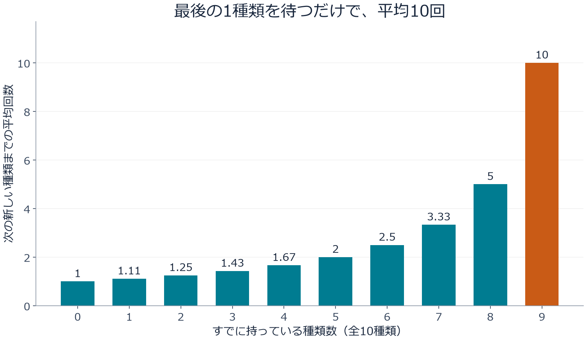
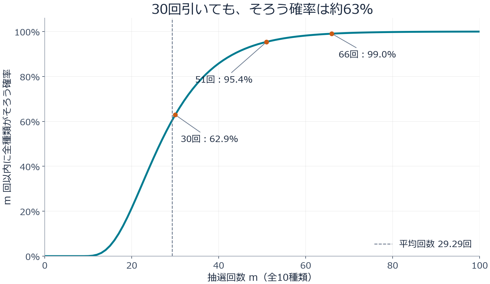
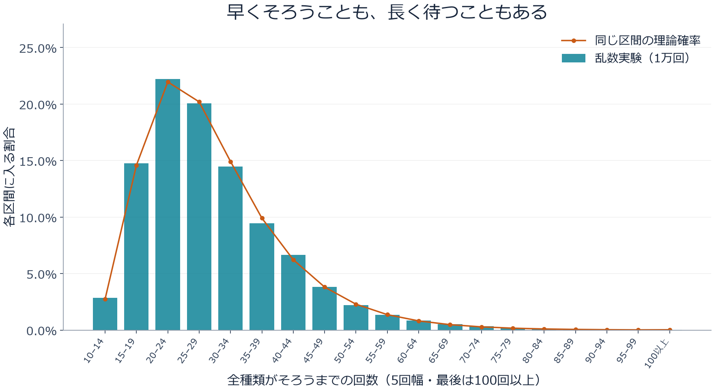

## 1. なぜ「最後の1枚」だけが出ないのか？

全10種類のカードが、1袋に1枚ずつ入っているとします。どのカードも同じ確率で出て、袋の外から中身はわかりません。最初は新しいカードが次々に増えるのに、残り数種類になると、開けても開けても持っているカードばかり。ようやく残り1種類になってからが、思いのほか長い……。

この経験を数学で扱うのが、**クーポンコレクター問題**です。ここでいうクーポンは、割引券に限らず「区別できる種類のある収集対象」を意味します。カード、シール、カプセルトイなどに置き換えると、ぐっと身近になります。

最初に結論を示すと、全10種類を集めるまでの平均回数は、約29.3回です。ただし、30回引けば安心という意味ではありません。30回までに全種類そろう確率は約62.9％で、95％以上の確率でそろえたいなら51回が必要になります。

この記事では、この数字がどこから出てくるのかを順番に確かめます。入口は「新しいカードが出る確率」。そこから期待値を導き、グラフでばらつきを眺め、最後に短いPythonコードで実験します。

## 2. まずは抽選のルールを決める

計算の前に、モデルの前提をそろえておきましょう。本記事で基本とするのは、次の条件です。

- カードは全部で $n$ 種類あり、1回の抽選で1枚を得る。
- 各種類が出る確率は、毎回同じ $1/n$ である。
- 抽選は互いに独立で、以前に出たカードは次の抽選に影響しない。
- 同じカードが何度でも出る。交換や重複回避の仕組みはない。
- 最初は1種類も持っておらず、全種類を1枚以上集めた時点で終了する。

これは「引いた玉を箱に戻してから、もう一度引く」抽選に相当します。有限の在庫を戻さずに引く場合や、1箱買うと必ず全種類そろう商品は、別のモデルです。

全種類がそろうまでの抽選回数を $T$ と書きます。$T$ は実験のたびに変わる**確率変数**です。一方、$E[T]$ は、収集を何度も最初からやり直したときの回数の平均を表す**期待値**です。個々の人の結果を予言する数字ではありません。

以降は $n=10$ を中心に考えますが、式は任意の種類数に使えます。読みながら、自分の好きなコレクションの種類数に置き換えてみてください。

## 3. 「次の新しい1種類」までの待ち時間に分ける

### すでに持っている種類が増えるほど、当たりは減る

すでに $k$ 種類を持っているなら、未入手の種類は $n-k$ 個あります。次の1回で新しい種類が出る確率は、次のようになります。

$$
p_k=\frac{n-k}{n}
$$

10種類なら、まだ何も持っていない最初の抽選は必ず新しいカードです。5種類を持っていれば、新しいカードが出る確率は $5/10$。9種類を持っていると、確率は $1/10$ に下がります。

カードそのものの出現確率は変わっていません。**自分にとって「新しい」と数えられる種類が減る**ため、収集が進みにくくなるのです。終盤だけ抽選の仕組みが不利になったと考える必要はありません。

### 確率 $p$ の当たりを待つ平均回数は $1/p$

毎回、確率 $p$ で当たる抽選について、最初に当たるまでの回数を $X$ とします。当たった回も数に含めると、$X$ は幾何分布に従います。

$$
P(X=r)=(1-p)^{r-1}p
\qquad (r=1,2,3,\ldots)
$$

例えば3回目に初めて当たるには、「外れ、外れ、当たり」となる必要があります。その確率が $(1-p)^2p$ です。

平均回数を $a$ として、最初の1回を引いた後を考えてみましょう。その1回は必ず使います。当たれば終了し、外れた場合だけ、同じ状況から平均 $a$ 回を待ち直します。したがって、

$$
a=1+(1-p)a
\quad\Longrightarrow\quad
a=\frac{1}{p}
$$

となります。確率が $1/2$ なら平均2回、$1/10$ なら平均10回です。「10回目に当たりやすくなる」という意味ではなく、早く当たる場合も長く待つ場合も含めた平均です。

### 各段階を足せば、全体の平均がわかる

$k$ 種類から $k+1$ 種類へ進むまでの回数を $X_k$ とすると、

$$
E[X_k]=\frac{1}{p_k}=\frac{n}{n-k}
$$

です。全種類を集めるには、この段階を順番に通ります。

$$
T=X_0+X_1+\cdots+X_{n-1}
$$

期待値には「和の期待値は、期待値の和になる」という性質があります。この性質自体には独立性は必要ありません。そこで段階ごとの平均を足すと、求めたかった式が得られます。

$$
\begin{aligned}
E[T]
&=\frac{n}{n}+\frac{n}{n-1}+\cdots+\frac{n}{1}\\
&=n\left(1+\frac12+\cdots+\frac1n\right)\\
&=nH_n
\end{aligned}
$$

$H_n$ は、第 $n$ **調和数**と呼ばれます。難しそうな名前ですが、1から $n$ までの整数の逆数を足したものです。この段階分けによる解法は、[MITの講義資料](https://ocw.mit.edu/courses/6-856j-randomized-algorithms-fall-2002/resources/n4/)でも紹介されています。

## 4. グラフで見る、終盤の待ち時間

10種類の場合、各段階の平均待ち時間は次のとおりです。

| 入手済みの種類数 | 新しい種類が出る確率 | 次の新しい種類までの平均回数 |
|---|---|---|
| 0種類 | 100％ | 1回 |
| 5種類 | 50％ | 2回 |
| 8種類 | 20％ | 5回 |
| 9種類 | 10％ | 10回 |



*図1：各棒は、その段階だけに必要な平均回数。累積回数ではありません。最後の棒は、最初の棒の10倍です。*

全体の平均は、これら10本の棒を足した値です。

$$
E[T]=10H_{10}\approx29.29
$$

9種類まで集める平均回数は約19.29回で、そこから残り1種類に平均10回かかります。つまり、**最後の1種類だけで、全体の平均回数の約34％を占める**ことになります。コレクションの「残り10％」に、時間も10％だけ使うとは限りません。

ここで気をつけたいのは、最後の1種類は「特別に出にくいカード」ではないことです。どの種類が最後に残っても、その時点から出る確率は毎回 $1/10$。同じ確率のカードしかなくても、終盤の停滞は自然に発生します。

また、最後の1種類を待ちながら20回外したとしても、次に出る確率は依然として $1/10$ です。独立な抽選では過去の外れが蓄積されないため、そこからの平均待ち時間も10回のままです。これは幾何分布の**無記憶性**と呼ばれる性質です。

## 5. 種類数が増えると、何回必要になる？

同じ公式で、種類数を変えて計算してみます。

| 種類数 $n$ | 全種類がそろう平均回数 $nH_n$ | 種類数に対する倍率 |
|---|---|---|
| 6 | 約14.70回 | 約2.45倍 |
| 10 | 約29.29回 | 約2.93倍 |
| 20 | 約71.95回 | 約3.60倍 |
| 50 | 約224.96回 | 約4.50倍 |
| 100 | 約518.74回 | 約5.19倍 |

10種類から20種類へ倍増すると、平均回数は約29回から約72回へ増えます。単純に2倍にはなりません。種類が増えた分に加えて、終盤の重複による待ち時間も効いてくるからです。

大きな $n$ に対して、調和数は自然対数を使って近似できます。

$$
H_n\approx\ln n+\gamma+\frac{1}{2n}
$$

$\ln$ は自然対数、$\gamma\approx0.57721$ はオイラー＝マスケローニ定数です。したがって、

$$
E[T]\approx n\ln n+\gamma n+\frac12
$$

となり、平均回数は、おおむね $n\ln n$ の規模で増えます。ただし、10種類や20種類で具体的な回数を知りたいときは、$n\ln n$ だけで済ませず、調和数を直接足すのが簡単で正確です。

## 6. 平均29.3回でも、30回では約63％しかそろわない

### 知りたいのは「平均」か「完了する確率」か

期待値は便利ですが、「30回までにそろう確率」は別の量です。こちらは $P(T\le m)$、つまり $m$ 回以内に収集が完了する確率で表します。

全10種類について計算すると、次のグラフになります。これは乱数実験の結果ではなく、各状態の確率を順番に更新して求めた値です。



*図2：横軸は抽選回数、縦軸はその回数以内に全種類がそろう確率。回数は整数ですが、変化を見やすくするため点を線で結んでいます。*

| 抽選回数 | その回数以内に全種類がそろう確率 |
|---|---|
| 10回 | 約0.036％ |
| 20回 | 約21.5％ |
| 30回 | 約62.9％ |
| 40回 | 約85.8％ |
| 50回 | 約94.9％ |
| 60回 | 約98.2％ |

10回でそろうには、重複が一度も起きてはいけません。その確率は $10!/10^{10}$。種類数と同じ回数だけ引いても、そろう可能性はとても低いのです。

「そろう確率が初めて50％以上になる回数」は27回、90％なら44回、95％なら51回、99％なら66回です。このように、必要な確率から回数を逆算した値を**分位点**と呼びます。50％の分位点は中央値です。

平均より中央値が小さいのは、収集回数の分布が右に長い裾を持ち、まれな長期化が平均を押し上げるためです。平均値を知ることと、「どの程度の確率で終わるか」を知ることは、分けて考えましょう。

### グラフの確率は、どう計算したのか？

$m$ 回引いた時点で、ちょうど $k$ 種類を持っている確率を $q_m(k)$ とします。最初は $q_0(0)=1$ で、それ以外は0です。

次の抽選後に $k$ 種類であるためには、次のどちらかが起きます。

1. すでに $k$ 種類あり、持っているカードを引く。
2. $k-1$ 種類あり、未入手のカードを引く。

この2つの経路を足せば、更新式ができます。

$$
q_{m+1}(k)=\frac{k}{n}q_m(k)
+\frac{n-k+1}{n}q_m(k-1)
\qquad (1\le k\le n)
$$

抽選後に0種類のままということはないので、$q_{m+1}(0)=0$ です。また、全種類がそろった状態からは出ていきません。そのため、$q_m(n)$ がそのまま $P(T\le m)$ になります。この計算は「持っている種類数」を状態とする動的計画法です。

カードの具体的な名前を記録しなくてよいのは、どの種類も同じ確率だからです。種類ごとの確率が違う場合は、「何種類持っているか」だけでは次の確率を決められません。

## 7. Pythonで1万回の収集をシミュレーションする

実際に抽選を繰り返して、理論と比べてみましょう。次のコードはPythonの標準ライブラリだけで動きます。1回の実験は「空の状態から10種類全部を集めるまで」。それを1万回繰り返します。

```python
import random
import statistics

n = 10
trials = 10_000
rng = random.Random(20260915)

def collect_all(n, rng):
    collected = set()
    draws = 0
    while len(collected) < n:
        collected.add(rng.randrange(n))
        draws += 1
    return draws

results = [collect_all(n, rng) for _ in range(trials)]
theory = n * sum(1 / k for k in range(1, n + 1))

print(f"理論の平均: {theory:.2f}回")
print(f"実験の平均: {statistics.mean(results):.2f}回")
print(f"実験の中央値: {statistics.median(results):.1f}回")
print(f"30回以内の完了率: {sum(t <= 30 for t in results) / trials:.1%}")
```

`set` は重複を取り除く集合です。同じカードが出ても要素数は増えません。`randrange(n)` で0から $n-1$ までの整数を等確率に選び、集合の大きさが $n$ になるまで繰り返しています。

乱数の種を固定しているため、同じ実行環境で結果を再現できます。種を変えれば実験値も少し変わります。理論値にぴったり一致しなくても、それだけで実装の誤りとはいえません。

今回の実行では、実験の平均は29.2929回、中央値は27回、30回以内の完了率は63.27％でした。平均だけでなく、完了率も理論値の約62.9％に近い値になっています。



*図3：棒は1万回の実験で得た割合、丸印は図2の累積確率の差から求めた理論値。どちらも同じ5回幅の区間にまとめています。右端の100回以上も省略せず表示しています。*

多くの実験は平均の近くで終わりますが、中にはかなり長くかかるものもあります。全員が29回前後で終わるのではなく、このばらつきを平均した結果が約29.3回なのです。[大数の法則](/p/law-of-large-numbers/)は、こうした実験平均と理論値の関係を理解する手がかりになります。

## 8. 平均のまわりに、どれくらいばらつく？

少し踏み込むと、収集回数の**分散**も計算できます。幾何分布の分散は $(1-p)/p^2$ です。本記事の独立・等確率モデルでは、各段階の待ち時間も独立になるので、分散を足せます。

$$
\begin{aligned}
\operatorname{Var}(T)
&=\sum_{j=1}^{n}\frac{1-j/n}{(j/n)^2}\\
&=n^2\sum_{j=1}^{n}\frac{1}{j^2}-nH_n
\end{aligned}
$$

ここでは、未入手の種類数を $j$ と書いています。$n=10$ なら、分散の平方根である**標準偏差**は約11.21回です。平均約29.29回に対して、かなり大きなばらつきがあるとわかります。

ただし、標準偏差がわかったからといって「平均から標準偏差の2倍以内に約95％が入る」と機械的に考えてはいけません。この分布は正規分布ではなく、左右対称でもないからです。完了確率を知りたいなら、図2の累積確率を直接使う方が確実です。

一方、1万回の独立な実験から計算した「平均値」自体の標準偏差は、$11.21/\sqrt{10000}\approx0.112$ 回です。1回の収集結果は大きくばらついても、多数回の平均は比較的安定します。個々の結果のばらつきと、平均の推定誤差は別物なのです。

## 9. 現実に当てはめるときの注意点

### レアな種類がある場合

種類 $i$ の出現確率を $p_i$ とすると、その種類を初めて引くまでの平均回数は $1/p_i$ です。全種類の収集はそれより前には終わらないため、

$$
E[T]\ge\max_i\frac{1}{p_i}
$$

が成り立ちます。例えば、ある1種類だけ確率が0.1％なら、それを初めて得るだけで平均1000回必要です。等確率の10種類で得た「約29.3回」を流用することはできません。

なお、全種類の待ち時間を単純に $\sum_i1/p_i$ と足すのも誤りです。各種類は同じ抽選列の中で並行して集まり、特定の種類を待つ間に別の種類が出るからです。第3節で足したのは、互いに重ならない「次の新しい種類まで」という段階でした。

### 交換や重複回避ができる場合

重複カードを交換できる場合や、未入手の種類から必ず選ばれる仕組みがある場合は、収集に必要な回数が変わります。毎回必ず新しい種類が出るなら、ちょうど $n$ 回で終了します。

また「あと1種類なのだから、次こそ出るはず」という感覚にも注意が必要です。残り1種類の状態から $r$ 回以内にそれを引く確率は、

$$
1-\left(1-\frac1n\right)^r
$$

です。10種類なら10回以内に最後の1種類が出る確率は約65.1％。平均待ち時間が10回でも、約34.9％はそれ以上待ちます。交換や保証のないモデルでは、有限回での完了を100％保証できません。

### ソフトウェアのテストにも似た構造がある

入力パターンをランダムに選ぶテストで「全種類のケースを一度は実行したい」と考えると、同じ構造が現れます。未実行のケースが少なくなるほど、実行済みのケースを繰り返す割合が増えます。

ただし、実際のテストケースが等確率とは限らず、一度実行しただけで品質が保証されるわけでもありません。この問題が教えてくれるのは、ランダムに数をこなすことと、対象をもれなく覆うことの違いです。未実行のケースを記録して優先する設計には、終盤の重複を減らす意味があります。

## 10. まとめ：収集の難しさは「終わり際」にある

クーポンコレクター問題は、次の新しい1種類を待つ時間に分けると見通しがよくなります。等確率の $n$ 種類を独立に引くなら、全種類を集める平均回数は $nH_n$。残りが少なくなるほど新しい種類を引く確率が下がり、最後の1種類には平均 $n$ 回が必要です。

全10種類なら平均は約29.3回ですが、30回までにそろう確率は約62.9％。95％以上の完了確率には51回が必要でした。**平均、中央値、完了確率を使い分けること**が、数字を正しく読むポイントです。

「最後の1枚が出ない」という日常のもどかしさには、はっきりした数学的な理由があります。まずはPythonコードの種類数を6や20に変え、予想してから実験してみてください。カードの重複が、調和数や確率分布へつながる様子を確かめられるはずです。

### 参考資料・再現用ファイル

- [MIT OpenCourseWare：Coupon collectingを扱う講義資料](https://ocw.mit.edu/courses/6-856j-randomized-algorithms-fall-2002/resources/n4/) — 期待値の段階分けと確率の評価。
- [グラフ生成用Pythonコード](generate_graphs.py) — 本記事の3枚のグラフを再生成できます。Pythonに加え、Matplotlibが必要です。
- [グラフの計算値（JSON）](calculation-results.json) — 理論値、完了確率、シミュレーション結果の要約。

グラフは上記のモデルから独自に計算・作図したものです。アイキャッチは内容をイメージした生成画像で、計算結果を示す図ではありません。
