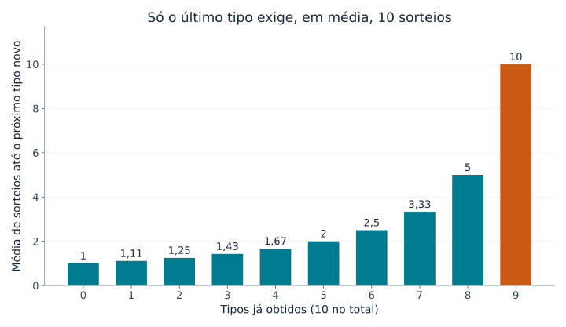
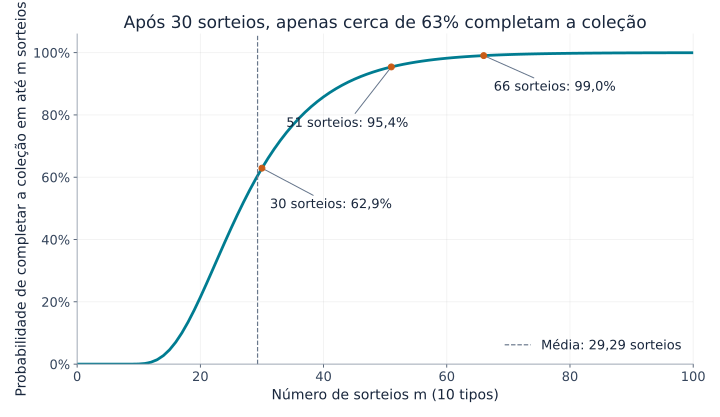
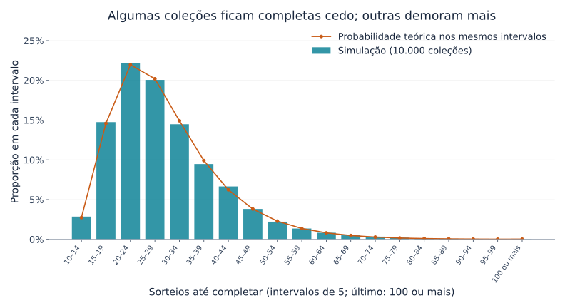

## 1. Por que a última carta demora tanto?

Imagine uma coleção de 10 tipos de cartas, com uma carta em cada pacote fechado. Todos os tipos têm a mesma chance de aparecer. No início, quase todo pacote traz uma novidade. Depois, as repetidas se acumulam. Quando falta apenas um tipo, a espera parece ainda maior.

O **problema do colecionador de cupons** descreve essa experiência matematicamente. Aqui, “cupom” significa um item colecionável com tipos distintos: cartas, figurinhas ou brinquedos, não necessariamente um vale de desconto.

Para 10 tipos, a resposta é **cerca de 29,3 sorteios em média**. Isso não garante completar a coleção em 30 sorteios: a probabilidade é de aproximadamente 62,9%. Para atingir pelo menos 95%, são necessários 51 sorteios. Vamos deduzir esses números, visualizar a variação e testar o resultado com Python.

## 2. Primeiro, definir as regras

Nosso modelo básico pressupõe:

- Existem $n$ tipos e cada sorteio fornece uma carta.
- Cada tipo tem probabilidade $1/n$ em todos os sorteios.
- Os sorteios são independentes; resultados anteriores não alteram o próximo.
- Repetições são permitidas, sem trocas nem proteção contra duplicatas.
- Começamos sem cartas e paramos ao obter todos os tipos pelo menos uma vez.

Isso corresponde à amostragem **com reposição**, como devolver uma bola à caixa antes de sortear novamente. Um estoque finito sem reposição ou uma caixa que garante todos os tipos exige outro modelo.

Chamamos de $T$ o número de sorteios até completar a coleção. É uma **variável aleatória**, pois muda a cada experiência. Seu **valor esperado**, $E[T]$, é a média ao repetir coleções desde o início, não uma previsão para uma pessoa específica. Usaremos principalmente $n=10$, mas as fórmulas servem para qualquer quantidade positiva de tipos.

## 3. Dividir a espera em etapas

### Quanto mais tipos temos, menos resultados são novos

Se já temos $k$ tipos, faltam $n-k$. A probabilidade de obter um novo no próximo sorteio é

$$
p_k=\frac{n-k}{n}
$$

Com 10 tipos, a primeira carta é necessariamente nova. Com cinco tipos, a chance é $5/10$; com nove, é apenas $1/10$.

As cartas não ficaram mais raras: **diminuiu o número de resultados que representam uma novidade para nós**. A lentidão no final não exige nenhuma mudança no sorteio.

### Um sucesso de probabilidade $p$ demora $1/p$ tentativas em média

Seja $X$ o número de tentativas até o primeiro sucesso, incluindo a tentativa bem-sucedida. Quando cada tentativa independente tem probabilidade $p$ de sucesso, $X$ segue a distribuição geométrica:

$$
P(X=r)=(1-p)^{r-1}p
\qquad (r=1,2,3,\ldots)
$$

Acertar pela primeira vez na terceira tentativa exige “falha, falha, sucesso”, com probabilidade $(1-p)^2p$.

Se a espera média é $a$, sempre gastamos uma tentativa. Se ela falhar, com probabilidade $1-p$, voltamos à mesma situação e precisamos de mais $a$ tentativas em média. Portanto,

$$
a=1+(1-p)a
\quad\Longrightarrow\quad
a=\frac{1}{p}
$$

Uma chance de $1/2$ dá média de duas tentativas; $1/10$, de dez. Isso não torna a décima tentativa mais favorável: a média combina esperas curtas e longas.

### Somar as etapas fornece a média total

Se $X_k$ representa os sorteios para passar de $k$ para $k+1$ tipos, então

$$
E[X_k]=\frac{1}{p_k}=\frac{n}{n-k}
$$

Para completar a coleção, passamos por todas as etapas:

$$
T=X_0+X_1+\cdots+X_{n-1}
$$

Pela linearidade da esperança, a esperança de uma soma é a soma das esperanças. Essa propriedade, por si só, não exige independência. Logo,

$$
\begin{aligned}
E[T]
&=\frac{n}{n}+\frac{n}{n-1}+\cdots+\frac{n}{1}\\
&=n\left(1+\frac12+\cdots+\frac1n\right)\\
&=nH_n
\end{aligned}
$$

$H_n$ é o $n$-ésimo **número harmônico**, a soma dos inversos dos inteiros de 1 a $n$. Esse argumento também aparece nas [notas de aula do MIT](https://ocw.mit.edu/courses/6-856j-randomized-algorithms-fall-2002/resources/n4/).

## 4. Visualizando a espera no final

Algumas etapas para 10 tipos são:

| Tipos já obtidos | Chance de um tipo novo | Sorteios adicionais médios |
|---|---|---|
| 0 | 100% | 1 |
| 5 | 50% | 2 |
| 8 | 20% | 5 |
| 9 | 10% | 10 |



*Figura 1. Cada barra representa apenas aquela etapa, não o total acumulado. A última tem dez vezes a altura da primeira.*

Somando as dez barras,

$$
E[T]=10H_{10}\approx29.29
$$

Obter nove tipos exige cerca de 19,29 sorteios em média; o último exige mais dez. **O último tipo representa aproximadamente 34% do tempo médio total.** Os 10% finais da coleção não precisam corresponder a apenas 10% do esforço.

O último tipo não precisa ser raro. Qualquer que seja, sua chance permanece $1/10$. Mesmo depois de 20 tentativas sem consegui-lo, a próxima ainda tem chance $1/10$ e a espera adicional média continua em dez. Essa é a propriedade de **falta de memória** da distribuição geométrica.

## 5. E quando há mais tipos?

A mesma fórmula produz os valores aproximados abaixo:

| Tipos $n$ | Sorteios esperados $nH_n$ | Razão entre sorteios e tipos |
|---|---|---|
| 6 | 14,70 | 2,45 |
| 10 | 29,29 | 2,93 |
| 20 | 71,95 | 3,60 |
| 50 | 224,96 | 4,50 |
| 100 | 518,74 | 5,19 |

Dobrar os tipos de 10 para 20 aumenta a média de aproximadamente 29 para 72 sorteios: mais que o dobro. Além dos tipos adicionais, aumentam as esperas entre repetidas no final.

Para $n$ grande, podemos aproximar o número harmônico usando o logaritmo natural:

$$
H_n\approx\ln n+\gamma+\frac{1}{2n}
$$

$\ln$ é o logaritmo natural e $\gamma\approx0.57721$ é a constante de Euler–Mascheroni. Assim,

$$
E[T]\approx n\ln n+\gamma n+\frac12
$$

A esperança cresce na escala de $n\ln n$. Para um resultado concreto com 10 ou 20 tipos, somar diretamente o número harmônico é simples e mais preciso do que usar apenas $n\ln n$.

## 6. Média de 29,3 não significa garantia em 30 sorteios

### Média e probabilidade de conclusão

$P(T\le m)$ é a probabilidade de terminar em até $m$ sorteios. Ela responde a uma pergunta diferente da média.

A curva para 10 tipos abaixo foi calculada atualizando probabilidades de estados, sem depender de uma estimativa por simulação.



*Figura 2. O eixo horizontal mostra os sorteios e o vertical, a probabilidade de já ter terminado. As contagens são inteiras; os pontos estão ligados para facilitar a leitura.*

| Sorteios | Probabilidade aproximada de conclusão |
|---|---|
| 10 | 0,036% |
| 20 | 21,5% |
| 30 | 62,9% |
| 40 | 85,8% |
| 50 | 94,9% |
| 60 | 98,2% |

Completar em dez sorteios exige nenhuma repetição, com probabilidade $10!/10^{10}$. Sortear tantas cartas quanto há tipos raramente basta.

As menores contagens que alcançam 50%, 90%, 95% e 99% são 27, 44, 51 e 66. Esses limites são **quantis**; o de 50% é a mediana. Ela fica abaixo da média porque a distribuição tem uma cauda longa à direita: algumas coleções muito demoradas puxam a média para cima.

### Como calcular a curva

Seja $q_m(k)$ a probabilidade de ter exatamente $k$ tipos após $m$ sorteios. Inicialmente, $q_0(0)=1$ e os outros estados têm probabilidade zero.

Para ter $k$ tipos depois do próximo sorteio, há duas possibilidades:

1. Já ter $k$ e obter uma repetida.
2. Ter $k-1$ e obter um tipo novo.

Somando os dois caminhos,

$$
q_{m+1}(k)=\frac{k}{n}q_m(k)
+\frac{n-k+1}{n}q_m(k-1)
\qquad (1\le k\le n)
$$

Depois de um sorteio, $q_{m+1}(0)=0$. Uma coleção completa permanece completa, portanto $q_m(n)=P(T\le m)$. É programação dinâmica usando a quantidade de tipos como estado.

Podemos ignorar a identidade das cartas porque são equiprováveis. Com probabilidades diferentes, a quantidade de tipos não bastaria para calcular a chance de uma novidade.

## 7. Simular 10.000 coleções em Python

Este código usa apenas a biblioteca padrão. Cada experiência começa vazia e vai até obter os dez tipos; repetimos isso 10.000 vezes.

```python
import random
import statistics

n = 10
trials = 10_000
rng = random.Random(20260915)

def collect_all(n, rng):
    collected = set()
    draws = 0
    while len(collected) < n:
        collected.add(rng.randrange(n))
        draws += 1
    return draws

results = [collect_all(n, rng) for _ in range(trials)]
theory = n * sum(1 / k for k in range(1, n + 1))

print(f"Média teórica (sorteios): {theory:.2f}")
print(f"Média simulada (sorteios): {statistics.mean(results):.2f}")
print(f"Mediana simulada (sorteios): {statistics.median(results):.1f}")
print(f"Coleções completas em até 30 sorteios: {sum(t <= 30 for t in results) / trials:.1%}")
```

Um `set` elimina duplicatas: cartas repetidas não aumentam seu tamanho. `randrange(n)` escolhe igualmente entre os inteiros de 0 a $n-1$. Paramos quando o conjunto tem $n$ elementos.

A semente fixa torna o resultado reproduzível no mesmo ambiente. Outra semente produz pequenas diferenças; não coincidir exatamente com a teoria não indica, por si só, um erro.

Nesta execução, a média foi 29,2929 sorteios, a mediana foi 27 e 63,27% das coleções terminaram em até 30 sorteios, perto dos 62,9% teóricos.



*Figura 3. As barras mostram proporções simuladas; os círculos mostram probabilidades teóricas obtidas por diferenças da curva acumulada. Os intervalos têm cinco sorteios e o último inclui todos os resultados de 100 ou mais.*

Muitas experiências terminam perto da média, mas outras demoram bastante. As 29,3 tentativas resumem essa variação, não prometem que todos terminem perto da tentativa 29. A **lei dos grandes números** ajuda a entender a relação entre médias experimentais e esperança teórica.

## 8. Qual é o tamanho da variação?

A variância de uma espera geométrica é $(1-p)/p^2$. No nosso modelo independente e equiprovável, as esperas das etapas também são independentes, então suas variâncias se somam:

$$
\begin{aligned}
\operatorname{Var}(T)
&=\sum_{j=1}^{n}\frac{1-j/n}{(j/n)^2}\\
&=n^2\sum_{j=1}^{n}\frac{1}{j^2}-nH_n
\end{aligned}
$$

$j$ representa a quantidade de tipos restantes. Para $n=10$, o **desvio padrão**, raiz quadrada da variância, é aproximadamente 11,21 sorteios, grande em comparação com a média de 29,29.

Não se deve concluir automaticamente que 95% dos resultados ficam a até dois desvios padrão da média: a distribuição não é normal nem simétrica. Para probabilidades de conclusão, use diretamente a curva acumulada.

A média de 10.000 experiências independentes tem desvio padrão bem menor: $11.21/\sqrt{10000}\approx0.112$ sorteio. As coleções individuais variam muito, mas sua média é relativamente estável. Dispersão individual e incerteza na média estimada são grandezas distintas.

## 9. Cuidados em situações reais

### Tipos raros

Se o tipo $i$ aparece com probabilidade $p_i$, sua primeira aparição exige $1/p_i$ sorteios em média. A coleção não pode terminar antes de obtê-lo, logo

$$
E[T]\ge\max_i\frac{1}{p_i}
$$

Um tipo com chance de 0,1% exige sozinho 1.000 sorteios em média. Não podemos reaproveitar as 29,3 tentativas do caso equiprovável.

Também seria errado somar $\sum_i1/p_i$: os tipos são reunidos em paralelo na mesma sequência. Enquanto esperamos um, outros aparecem. As etapas somadas na seção 3 eram consecutivas e não se sobrepunham.

### Trocas e proteção contra duplicatas

Trocar repetidas ou garantir um tipo novo muda o problema. Se cada sorteio traz algo novo, exatamente $n$ sorteios bastam.

Sem esse mecanismo, não há motivo para pensar que a última carta “já está para sair”. A probabilidade de obtê-la nos próximos $r$ sorteios é

$$
1-\left(1-\frac1n\right)^r
$$

Com dez tipos, a chance de obter o último em dez sorteios é cerca de 65,1%; aproximadamente 34,9% ainda esperam mais. Média de dez não é garantia. Sem troca nem garantia, nenhum número finito de sorteios assegura a conclusão com 100% de probabilidade.

### Uma ligação com testes de software

Escolher casos de teste aleatoriamente até executar todos tem uma estrutura semelhante. Quanto menos casos inéditos restam, mais seleções repetem casos já cobertos.

Casos reais não precisam ser equiprováveis, e executá-los uma vez não garante qualidade. A lição é distinguir muitos testes aleatórios de uma cobertura completa. Registrar os casos ainda não executados e priorizá-los pode reduzir as repetições finais.

## 10. Conclusão: a dificuldade está no final

Dividir a coleta em esperas pelo próximo tipo novo leva à média $nH_n$ para $n$ tipos equiprováveis. As novidades ficam menos prováveis à medida que a coleção avança, e apenas o último tipo exige $n$ sorteios em média.

Com dez tipos, a média é 29,3, mas a probabilidade de completar em 30 sorteios é só 62,9%. Para atingir pelo menos 95%, são necessários 51. **Média, mediana e probabilidade de conclusão precisam ser distinguidas.**

A frustração com a última carta tem uma explicação matemática clara. Experimente seis ou vinte tipos no código, faça uma previsão e compare. As repetidas ajudam a tornar concretos os números harmônicos e as distribuições de probabilidade.

### Referências e arquivos para reprodução

- [Notas do MIT OpenCourseWare sobre o colecionador de cupons](https://ocw.mit.edu/courses/6-856j-randomized-algorithms-fall-2002/resources/n4/) — esperança por etapas e limites de probabilidade.
- [Script Python para gerar os gráficos](generate_graphs.pt.py) — requer Python, Matplotlib e uma fonte compatível com o idioma.
- [Dados de cálculo em JSON](calculation-results.pt.json) — valores teóricos, probabilidades e resumo da simulação.

Os gráficos foram calculados e desenhados a partir do modelo descrito. A imagem de capa gerada é conceitual, não um gráfico quantitativo.

