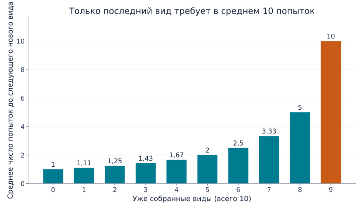
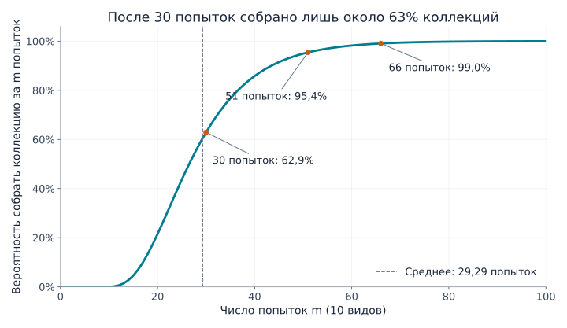
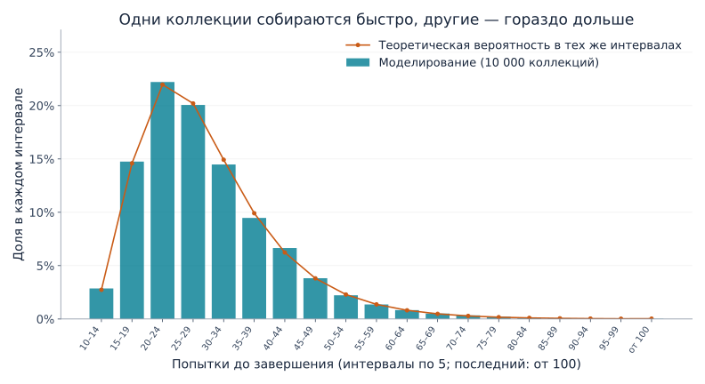

## 1. Почему последняя карточка так долго не попадается?

Представим коллекцию из 10 видов карточек: в каждом закрытом пакетике находится одна, и все виды равновероятны. Сначала новые карточки появляются быстро. Затем накапливаются повторы. Когда остаётся единственный недостающий вид, ожидание кажется особенно долгим.

**[Задача коллекционера купонов](https://kenji.blog/ru/p/coupon-collector-problem/)** описывает эту ситуацию математически. «Купон» здесь означает любой предмет коллекции с различимыми видами: карточку, наклейку или игрушку, а не обязательно скидочный талон.

Для 10 видов требуется **в среднем около 29,3 попытки**. Но это не означает, что 30 попыток надёжно хватит. Вероятность завершения к этому моменту составляет около 62,9%; для вероятности не ниже 95% нужна 51 попытка. Выведем эти числа, посмотрим на разброс и проверим результат с помощью Python.

## 2. Сначала определим правила

Базовая модель предполагает следующее:

- Есть $n$ видов, и за одну попытку мы получаем одну карточку.
- Каждый вид появляется с одинаковой вероятностью $1/n$ при каждой попытке.
- Попытки независимы: предыдущие результаты не влияют на следующий.
- Повторы разрешены; обмена и защиты от дубликатов нет.
- Мы начинаем с пустой коллекции и заканчиваем, получив каждый вид хотя бы один раз.

Это выборка **с возвращением**, как если бы шар после извлечения возвращали в коробку. Конечный запас без возвращения или коробка, гарантированно содержащая все виды, требуют другой модели.

Обозначим число попыток до завершения через $T$. Это **случайная величина**, меняющаяся от опыта к опыту. Её **математическое ожидание** $E[T]$ — среднее при многократном сборе коллекции с нуля, а не предсказание для конкретного человека. Основной пример — $n=10$, но формулы действуют для любого положительного числа видов.

## 3. Разделим процесс на ожидания нового вида

### Чем больше собрано, тем меньше новых исходов

Если уже есть $k$ видов, не хватает $n-k$. Вероятность получить новый вид в следующей попытке равна

$$
p_k=\frac{n-k}{n}
$$

При 10 видах первая карточка обязательно новая. Если собрано пять видов, вероятность составляет $5/10$; если девять — всего $1/10$.

Сами карточки не стали более редкими. **Уменьшилось количество исходов, которые для нас являются новыми.** Для замедления в конце не требуется менять правила выдачи.

### Успех с вероятностью $p$ требует в среднем $1/p$ попыток

Пусть $X$ — число попыток до первого успеха, включая успешную. Если независимая попытка завершается успехом с вероятностью $p$, то $X$ имеет геометрическое распределение:

$$
P(X=r)=(1-p)^{r-1}p
\qquad (r=1,2,3,\ldots)
$$

Первый успех на третьей попытке требует последовательности «неудача, неудача, успех», вероятность которой равна $(1-p)^2p$.

Назовём среднее ожидание $a$. Первую попытку мы тратим всегда. При неудаче, происходящей с вероятностью $1-p$, возвращаемся в то же положение и ожидаем ещё $a$ попыток в среднем. Поэтому

$$
a=1+(1-p)a
\quad\Longrightarrow\quad
a=\frac{1}{p}
$$

При $1/2$ среднее ожидание равно двум попыткам, при $1/10$ — десяти. Десятая попытка не становится удачнее остальных: среднее объединяет короткие и длинные ожидания.

### Складываем этапы

Если $X_k$ — число попыток для перехода от $k$ видов к $k+1$, то

$$
E[X_k]=\frac{1}{p_k}=\frac{n}{n-k}
$$

Чтобы собрать всё, нужно последовательно пройти все этапы:

$$
T=X_0+X_1+\cdots+X_{n-1}
$$

По линейности математического ожидания ожидание суммы равно сумме ожиданий. Само это свойство не требует независимости. Отсюда

$$
\begin{aligned}
E[T]
&=\frac{n}{n}+\frac{n}{n-1}+\cdots+\frac{n}{1}\\
&=n\left(1+\frac12+\cdots+\frac1n\right)\\
&=nH_n
\end{aligned}
$$

$H_n$ — $n$-е **гармоническое число**, сумма обратных величин целых чисел от 1 до $n$. Такое разбиение на этапы также описано в [конспекте лекции MIT](https://ocw.mit.edu/courses/6-856j-randomized-algorithms-fall-2002/resources/n4/).

## 4. Долгое ожидание в конце на графике

Некоторые этапы для 10 видов выглядят так:

| Уже собрано видов | Вероятность нового вида | Среднее число дополнительных попыток |
|---|---|---|
| 0 | 100% | 1 |
| 5 | 50% | 2 |
| 8 | 20% | 5 |
| 9 | 10% | 10 |



*Рисунок 1. Каждый столбец показывает только свой этап, а не накопленное время. Последний столбец в десять раз выше первого.*

Сумма десяти столбцов равна

$$
E[T]=10H_{10}\approx29.29
$$

Сбор девяти видов занимает в среднем около 19,29 попытки, а последний требует ещё десяти. **На последний вид приходится примерно 34% всего ожидаемого времени.** Оставшиеся 10% коллекции не обязательно требуют лишь 10% усилий.

Последняя карточка не должна быть особенно редкой: любой оставшийся вид по-прежнему выпадает с вероятностью $1/10$. Даже после 20 неудачных попыток получить его вероятность следующего успеха остаётся $1/10$, а дополнительное среднее ожидание — десять попыток. Это свойство **отсутствия памяти** геометрического распределения.

## 5. Что меняется при увеличении числа видов?

Та же формула даёт следующие округлённые значения:

| Виды $n$ | Ожидаемое число попыток $nH_n$ | Отношение попыток к числу видов |
|---|---|---|
| 6 | 14,70 | 2,45 |
| 10 | 29,29 | 2,93 |
| 20 | 71,95 | 3,60 |
| 50 | 224,96 | 4,50 |
| 100 | 518,74 | 5,19 |

Удвоение числа видов с 10 до 20 увеличивает среднее примерно с 29 до 72 попыток — более чем вдвое. Помимо новых видов добавляется ожидание среди повторов на последних этапах.

Для больших $n$ гармоническое число приближается через натуральный логарифм:

$$
H_n\approx\ln n+\gamma+\frac{1}{2n}
$$

Здесь $\ln$ — натуральный логарифм, а $\gamma\approx0.57721$ — постоянная Эйлера–Маскерони. Следовательно,

$$
E[T]\approx n\ln n+\gamma n+\frac12
$$

Математическое ожидание растёт в масштабе $n\ln n$. Но для конкретного расчёта с 10 или 20 видами проще и точнее сложить гармоническое число напрямую, а не ограничиваться $n\ln n$.

## 6. Среднее 29,3 не гарантирует завершение за 30 попыток

### Среднее и вероятность завершения — разные показатели

$P(T\le m)$ означает вероятность закончить не позднее $m$-й попытки. Это другой вопрос, чем среднее число попыток.

Кривая для 10 видов ниже вычислена последовательным обновлением вероятностей состояний, а не оценена случайным моделированием.



*Рисунок 2. По горизонтали — число попыток, по вертикали — вероятность завершения к этому моменту. Числа попыток целые; точки соединены для удобства чтения.*

| Попытки | Приблизительная вероятность завершения |
|---|---|
| 10 | 0,036% |
| 20 | 21,5% |
| 30 | 62,9% |
| 40 | 85,8% |
| 50 | 94,9% |
| 60 | 98,2% |

Завершение за десять попыток требует полного отсутствия повторов, вероятность чего равна $10!/10^{10}$. Стольких попыток, сколько есть видов, почти никогда не хватает.

Минимальные количества попыток для достижения 50%, 90%, 95% и 99% равны соответственно 27, 44, 51 и 66. Такие пороги называются **квантилями**; квантиль 50% — медиана. Она ниже среднего из-за длинного правого хвоста распределения: редкие очень долгие сборы повышают среднее.

### Как вычисляется кривая?

Пусть $q_m(k)$ — вероятность иметь ровно $k$ видов после $m$ попыток. В начале $q_0(0)=1$, а вероятности остальных состояний нулевые.

После следующей попытки можно иметь $k$ видов двумя путями:

1. Уже иметь $k$ видов и получить повтор.
2. Иметь $k-1$ видов и получить новый.

Складывая вероятности этих путей, получаем

$$
q_{m+1}(k)=\frac{k}{n}q_m(k)
+\frac{n-k+1}{n}q_m(k-1)
\qquad (1\le k\le n)
$$

После попытки $q_{m+1}(0)=0$. Полная коллекция остаётся полной, поэтому $q_m(n)=P(T\le m)$. Это динамическое программирование, где состояние — количество собранных видов.

Идентичность карточек можно игнорировать благодаря равным вероятностям. При разных вероятностях одного количества видов было бы недостаточно для расчёта шанса получить новый.

## 7. Смоделируем 10 000 коллекций на Python

Код использует только стандартную библиотеку Python. Каждый опыт начинается с пустой коллекции и продолжается до получения всех десяти видов; повторим его 10 000 раз.

```python
import random
import statistics

n = 10
trials = 10_000
rng = random.Random(20260915)

def collect_all(n, rng):
    collected = set()
    draws = 0
    while len(collected) < n:
        collected.add(rng.randrange(n))
        draws += 1
    return draws

results = [collect_all(n, rng) for _ in range(trials)]
theory = n * sum(1 / k for k in range(1, n + 1))

print(f"Теоретическое среднее (попытки): {theory:.2f}")
print(f"Среднее в моделировании (попытки): {statistics.mean(results):.2f}")
print(f"Медиана в моделировании (попытки): {statistics.median(results):.1f}")
print(f"Собрано за 30 попыток: {sum(t <= 30 for t in results) / trials:.1%}")
```

Множество `set` исключает дубликаты: повторная карточка не увеличивает его размер. `randrange(n)` равновероятно выбирает целое число от 0 до $n-1$. Останавливаемся, когда множество содержит $n$ элементов.

Фиксированное начальное значение генератора позволяет воспроизвести результат в той же среде. Другое значение немного изменит экспериментальные числа; небольшое расхождение с теорией само по себе не означает ошибку кода.

В нашем запуске среднее составило 29,2929 попытки, медиана — 27, а доля завершившихся за 30 попыток коллекций — 63,27%, близко к теоретическим 62,9%.



*Рисунок 3. Столбцы — доли в моделировании, кружки — теоретические вероятности из разностей накопленных вероятностей. Интервалы одинаковы и содержат по пять попыток; последний включает все результаты от 100 и выше.*

Многие опыты заканчиваются около среднего, но некоторые занимают намного больше времени. Значение 29,3 усредняет этот разброс, а не обещает каждому завершение примерно за 29 попыток. **[Закон больших чисел](https://kenji.blog/ru/p/law-of-large-numbers/)** объясняет связь между экспериментальными средними и ожиданием.

## 8. Насколько велик разброс?

Дисперсия геометрического ожидания равна $(1-p)/p^2$. В нашей независимой равновероятной модели ожидания этапов также независимы, поэтому их дисперсии складываются:

$$
\begin{aligned}
\operatorname{Var}(T)
&=\sum_{j=1}^{n}\frac{1-j/n}{(j/n)^2}\\
&=n^2\sum_{j=1}^{n}\frac{1}{j^2}-nH_n
\end{aligned}
$$

Здесь $j$ — число недостающих видов. При $n=10$ **стандартное отклонение**, квадратный корень из дисперсии, составляет около 11,21 попытки, что немало по сравнению со средним 29,29.

Нельзя автоматически считать, что примерно 95% результатов лежат в пределах двух стандартных отклонений от среднего. Распределение не нормальное и не симметричное. Для вероятности завершения лучше напрямую использовать накопленные вероятности.

Стандартное отклонение среднего по 10 000 независимым опытам значительно меньше: $11.21/\sqrt{10000}\approx0.112$ попытки. Отдельные коллекции сильно различаются, но их среднее относительно устойчиво. Разброс индивидуальных результатов и неопределённость оценки среднего — разные величины.

## 9. Ограничения при применении к реальности

### Редкие виды

Если вид $i$ появляется с вероятностью $p_i$, до его первого появления требуется в среднем $1/p_i$ попыток. Коллекция не может завершиться раньше, поэтому

$$
E[T]\ge\max_i\frac{1}{p_i}
$$

Один вид с вероятностью 0,1% требует в среднем уже 1 000 попыток. Переносить сюда результат 29,3 для равновероятного случая нельзя.

Просто складывать $\sum_i1/p_i$ тоже неверно: разные виды собираются параллельно в одной последовательности. Пока ждём один, могут появляться другие. В разделе 3 складывались последовательные, неперекрывающиеся этапы ожидания нового вида.

### Обмен и защита от повторов

Обмен дубликатами или гарантированная выдача нового вида меняют необходимое число попыток. Если каждый результат новый, достаточно ровно $n$ попыток.

Без такого механизма нет оснований считать, что последняя карта «уже должна выпасть». Вероятность получить её за следующие $r$ попыток равна

$$
1-\left(1-\frac1n\right)^r
$$

Для десяти видов шанс найти последний за десять попыток — около 65,1%; примерно 34,9% продолжат ждать. Среднее десять не является гарантией. Без обмена или гарантий никакое конечное число попыток не обеспечивает завершение с вероятностью 100%.

### Связь с тестированием программ

Случайный выбор тестовых случаев до выполнения каждого хотя бы раз имеет похожую структуру. Чем меньше непроверенных случаев остаётся, тем чаще выбираются уже выполненные.

Реальные случаи не обязаны быть равновероятными, а однократный запуск каждого не гарантирует качество. Важно различать множество случайных испытаний и полное покрытие целей. Учёт ещё не выполненных случаев и их приоритизация уменьшают повторы в конце.

## 10. Итог: труднее всего закончить

Разбиение на ожидания следующего нового вида даёт среднее $nH_n$ для $n$ равновероятных видов. По мере сокращения недостающих видов шанс получить новый падает, а последний один требует в среднем $n$ попыток.

Для десяти видов среднее равно примерно 29,3, но шанс закончить за 30 попыток — только 62,9%. Для достижения хотя бы 95% нужна 51 попытка. **Различайте среднее, медиану и вероятность завершения.**

У долгого ожидания последней карточки есть ясная математическая причина. Измените число видов в Python на шесть или двадцать, сначала предположите результат, а затем проверьте его. Повторы помогают наглядно понять гармонические числа и распределения вероятностей.

### Источники и файлы для воспроизведения

- [Лекция MIT OpenCourseWare о коллекционере купонов](https://ocw.mit.edu/courses/6-856j-randomized-algorithms-fall-2002/resources/n4/) — ожидание по этапам и вероятностные оценки.
- [Python-скрипт для построения графиков](generate_graphs.ru.py) — необходимы Python, Matplotlib и шрифт с поддержкой языка графиков.
- [Данные расчёта в JSON](calculation-results.ru.json) — теория, вероятности завершения и сводка моделирования.

Графики самостоятельно рассчитаны и построены по описанной модели. Сгенерированная обложка — концептуальная иллюстрация, а не количественный график.

