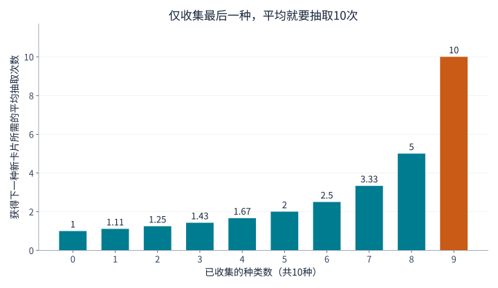
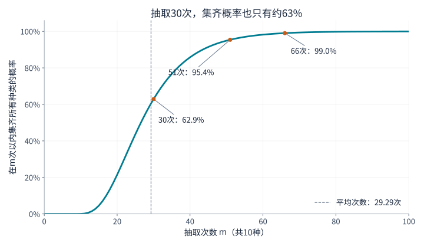
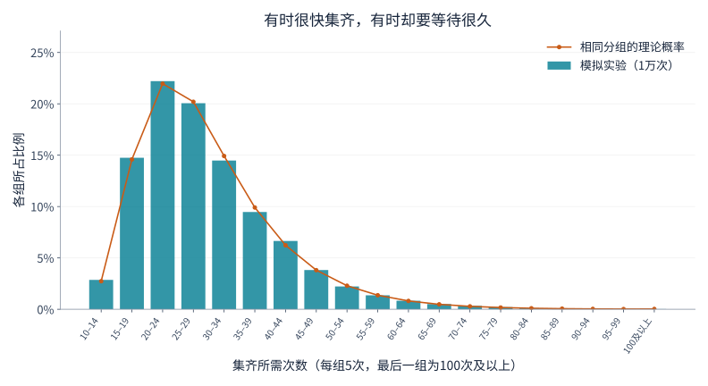

## 1. 为什么最后一张卡片总是最难等？

假设卡片共有10种，每个密封包装中有一张，每种出现的概率相同。刚开始，新卡片很快增加；后来重复的越来越多；只剩最后一种时，等待似乎格外漫长。

数学中的**[集齐优惠券问题](https://kenji.blog/zh-cn/p/coupon-collector-problem/)**（也称优惠券收集问题）正是研究这种现象。这里的“优惠券”泛指种类可区分的收集对象，不一定是折扣券，也可以是卡片、贴纸或扭蛋玩具。

先说结论：集齐10种卡片，**平均需要约29.3次抽取**。但这不等于抽30次就能放心。30次以内集齐的概率约为62.9%；若希望概率至少达到95%，则需要51次。下面从新卡片出现的概率出发，推导这些数字，再用图表和Python实验检验。

## 2. 先明确抽取规则

基本模型采用以下假设：

- 一共有 $n$ 种，每次抽取获得一张。
- 每种卡片每次出现的概率均为 $1/n$。
- 各次抽取相互独立，过去的结果不会影响下一次。
- 同一种可以反复出现，没有交换或避免重复的机制。
- 从零开始，直到每种至少获得一张时结束。

这相当于**有放回抽样**：抽出一个球后放回盒子，再抽下一次。如果库存有限且抽出后不放回，或者买一整盒就保证集齐，则需要不同的模型。

用 $T$ 表示集齐所需的抽取次数。它在每次实验中可能不同，因此是一个**随机变量**。**期望值** $E[T]$ 是把收集过程从头重复许多次后的平均，并非对某个人结果的预测。以下主要使用 $n=10$，但公式适用于任意正整数种类数。

## 3. 拆成“等到下一种新卡片”的阶段

### 收集得越多，能算作新卡片的结果越少

已经有 $k$ 种时，还缺 $n-k$ 种。下一次抽到新种类的概率为

$$
p_k=\frac{n-k}{n}
$$

总共10种时，第一张必然是新的；已有5种时，概率为 $5/10$；已有9种时，只剩 $1/10$。

卡片本身的出现概率并没有改变。只是**对自己而言仍然属于新种类的结果变少了**。即使抽取规则始终不变，收集进度也会自然变慢。

### 成功概率为 $p$ 时，平均等待次数是 $1/p$

设每次独立尝试的成功概率为 $p$，首次成功所需次数为 $X$，其中包含成功的那一次。$X$ 服从几何分布：

$$
P(X=r)=(1-p)^{r-1}p
\qquad (r=1,2,3,\ldots)
$$

例如，第三次才首次成功，需要经历“失败、失败、成功”，其概率为 $(1-p)^2p$。

设平均等待次数为 $a$。首先必定消耗一次；若以概率 $1-p$ 失败，就回到相同处境，还要平均等待 $a$ 次。因此

$$
a=1+(1-p)a
\quad\Longrightarrow\quad
a=\frac{1}{p}
$$

成功概率为 $1/2$ 时平均等2次，为 $1/10$ 时平均等10次。这并不表示第10次更容易成功，而是把短等待和长等待都纳入了平均。

### 各阶段相加，得到总期望

设从 $k$ 种增加到 $k+1$ 种所需次数为 $X_k$，则

$$
E[X_k]=\frac{1}{p_k}=\frac{n}{n-k}
$$

集齐全部种类必须依次经过这些阶段：

$$
T=X_0+X_1+\cdots+X_{n-1}
$$

根据期望的线性性，和的期望等于期望的和。这个性质本身不要求独立性。于是

$$
\begin{aligned}
E[T]
&=\frac{n}{n}+\frac{n}{n-1}+\cdots+\frac{n}{1}\\
&=n\left(1+\frac12+\cdots+\frac1n\right)\\
&=nH_n
\end{aligned}
$$

$H_n$ 称为第 $n$ 个**调和数**，即从1到 $n$ 的整数倒数之和。这种分阶段解法也见于[MIT讲义](https://ocw.mit.edu/courses/6-856j-randomized-algorithms-fall-2002/resources/n4/)。

## 4. 用图表观察最后阶段的等待

对于10种卡片，几个代表性阶段如下：

| 已有种类数 | 抽到新种类的概率 | 等到下一种所需的平均次数 |
|---|---|---|
| 0 | 100% | 1 |
| 5 | 50% | 2 |
| 8 | 20% | 5 |
| 9 | 10% | 10 |



*图1：每根柱子只代表该阶段的平均次数，并非累计次数。最后一根是第一根的10倍。*

把10根柱子相加，得到

$$
E[T]=10H_{10}\approx29.29
$$

收集到9种平均需要约19.29次，最后一种还要平均10次。也就是说，**最后一种占了总平均次数的约34%**。收集进度剩下10%，不代表只需再花10%的精力。

最后留下的卡片也不必特别稀有。无论是哪种，每次出现的概率都是 $1/10$。即使为它连续抽空了20次，下一次成功的概率仍然是 $1/10$，从此刻起的平均额外等待仍是10次。这就是几何分布的**无记忆性**。

## 5. 种类增加后，要抽多少次？

用同一公式可得到以下近似值：

| 种类数 $n$ | 集齐所需的平均次数 $nH_n$ | 平均次数与种类数之比 |
|---|---|---|
| 6 | 14.70 | 2.45 |
| 10 | 29.29 | 2.93 |
| 20 | 71.95 | 3.60 |
| 50 | 224.96 | 4.50 |
| 100 | 518.74 | 5.19 |

从10种增加到20种，平均次数由约29次增加到约72次，不只是翻倍。除了种类本身增加，后期重复造成的等待也更长。

当 $n$ 较大时，调和数可用自然对数近似：

$$
H_n\approx\ln n+\gamma+\frac{1}{2n}
$$

$\ln$ 是自然对数，$\gamma\approx0.57721$ 是欧拉–马歇罗尼常数。因此

$$
E[T]\approx n\ln n+\gamma n+\frac12
$$

期望大致按 $n\ln n$ 的规模增长。但对10种或20种求具体数值时，直接计算调和数既简单，也比只使用 $n\ln n$ 更准确。

## 6. 平均29.3次，不代表30次就一定集齐

### 平均次数与完成概率是两回事

$P(T\le m)$ 表示在 $m$ 次以内集齐的概率。它回答的问题与平均次数不同。

下面是10种卡片的曲线。它不是用随机实验估计的，而是通过逐步更新状态概率计算出来的。



*图2：横轴为抽取次数，纵轴为截至该次数已集齐的概率。次数为整数，连线只是为了便于观察变化。*

| 抽取次数 | 该次数以内集齐的近似概率 |
|---|---|
| 10 | 0.036% |
| 20 | 21.5% |
| 30 | 62.9% |
| 40 | 85.8% |
| 50 | 94.9% |
| 60 | 98.2% |

要在10次内集齐，就不能出现任何重复，概率为 $10!/10^{10}$。只抽与种类数相同的次数，成功机会非常小。

集齐概率首次达到50%、90%、95%、99%所需的次数分别为27、44、51、66。这些阈值称为**分位数**，其中50%分位数就是中位数。中位数小于平均值，是因为分布右侧有长尾：少数耗时很长的收集过程会拉高平均值。

### 曲线如何计算？

设抽取 $m$ 次后恰好拥有 $k$ 种的概率为 $q_m(k)$。初始时 $q_0(0)=1$，其他状态的概率为0。

下一次抽取后有 $k$ 种，可以通过两条路径：

1. 已有 $k$ 种，抽到了重复卡片。
2. 已有 $k-1$ 种，抽到了新种类。

将两条路径的概率相加：

$$
q_{m+1}(k)=\frac{k}{n}q_m(k)
+\frac{n-k+1}{n}q_m(k-1)
\qquad (1\le k\le n)
$$

抽取后不可能仍为0种，因此 $q_{m+1}(0)=0$。集齐后会一直保持集齐状态，所以 $q_m(n)=P(T\le m)$。这是一种以已有种类数为状态的动态规划。

能忽略卡片的具体名称，是因为每种概率相同。如果各类概率不同，仅凭“已有几种”便无法确定获得新种类的概率。

## 7. 用Python模拟一万次完整收集

下面的代码只使用Python标准库。一次实验从空集合开始，直到集齐10种，然后重复一万次。

```python
import random
import statistics

n = 10
trials = 10_000
rng = random.Random(20260915)

def collect_all(n, rng):
    collected = set()
    draws = 0
    while len(collected) < n:
        collected.add(rng.randrange(n))
        draws += 1
    return draws

results = [collect_all(n, rng) for _ in range(trials)]
theory = n * sum(1 / k for k in range(1, n + 1))

print(f"理论平均次数: {theory:.2f}")
print(f"模拟平均次数: {statistics.mean(results):.2f}")
print(f"模拟中位数: {statistics.median(results):.1f}")
print(f"30次以内集齐的比例: {sum(t <= 30 for t in results) / trials:.1%}")
```

`set` 是去除重复元素的集合，因此旧卡片不会使其大小增加。`randrange(n)` 等概率选择0到 $n-1$ 的整数，集合大小达到 $n$ 时停止。

固定随机种子，可以在相同环境中复现结果。更换种子后实验值会略有变化；没有与理论值完全一致，并不自动意味着代码有错。

本次运行的平均值为29.2929次，中位数为27次，30次以内集齐的比例为63.27%，与理论上的约62.9%接近。



*图3：柱子表示实验比例，圆点表示由累计概率之差得到的理论概率。两者均按5次分组，100次及以上的全部结果也包含在最后一组。*

许多实验在平均值附近结束，也有一些要等很久。约29.3次是对这种波动取平均，并非每个人都会在29次左右完成。**大数定律**有助于理解实验平均与理论期望之间的关系。

## 8. 波动究竟有多大？

几何等待时间的方差是 $(1-p)/p^2$。在独立、等概率模型中，各阶段等待时间也相互独立，因此方差可以相加：

$$
\begin{aligned}
\operatorname{Var}(T)
&=\sum_{j=1}^{n}\frac{1-j/n}{(j/n)^2}\\
&=n^2\sum_{j=1}^{n}\frac{1}{j^2}-nH_n
\end{aligned}
$$

这里 $j$ 表示尚未获得的种类数。当 $n=10$ 时，方差的平方根，即**标准差**，约为11.21次，相对于平均29.29次而言并不小。

但不能据此机械地断定“约95%的结果落在平均值上下两个标准差以内”。这个分布既不正态，也不对称。若要知道完成概率，直接使用累计概率曲线更合适。

一万次独立实验所得平均值本身的标准差则为 $11.21/\sqrt{10000}\approx0.112$ 次，小得多。单次收集可以波动很大，而多次平均相对稳定。个体结果的离散程度与估计平均值的不确定性是不同概念。

## 9. 应用于现实时的注意事项

### 如果存在稀有种类

若第 $i$ 种出现的概率为 $p_i$，首次抽到它平均需要 $1/p_i$ 次。全部集齐不可能早于获得它，因此

$$
E[T]\ge\max_i\frac{1}{p_i}
$$

某一种若只有0.1%的概率，仅首次获得它便平均需要1000次。此时不能套用等概率10种的29.3次。

直接将 $\sum_i1/p_i$ 相加也不对，因为各类是在同一条抽取序列中并行收集的：等待一种时，其他种也可能出现。第3节相加的是互不重叠、依次发生的“等到下一种新卡片”的阶段。

### 如果可以交换或避免重复

交换重复卡片，或保证抽到尚未拥有的种类，会改变所需次数。如果每次必定是新种类，那么恰好 $n$ 次即可。

没有这种机制时，不能认为“就差一张，下一次总该出了”。从只剩一种开始，在 $r$ 次以内获得它的概率为

$$
1-\left(1-\frac1n\right)^r
$$

对10种而言，10次内获得最后一种的概率约65.1%，仍有约34.9%需要继续等待。平均等10次并不构成保证。没有交换或保底时，任何有限次数都不能100%保证集齐。

### 与软件测试的联系

随机选择输入案例，希望每个案例都至少执行一次，也有类似结构。未执行的案例越少，重复执行旧案例的比例就越高。

实际案例未必等概率，而且每个执行一次不代表软件质量得到保证。这里的启示在于：大量随机尝试与完整覆盖所有目标并不相同。记录未执行案例并优先测试，可以减少后期重复。

## 10. 总结：收集的困难集中在最后阶段

把过程拆成等待下一种新卡片的阶段，便得到等概率 $n$ 种的期望为 $nH_n$。缺少的种类越少，抽到新种类的概率越低，最后一种单独就要平均等待 $n$ 次。

10种的平均约为29.3次，但30次以内集齐的概率只有约62.9%；至少95%的概率需要51次。**区分平均值、中位数和完成概率**，才能正确理解这些数字。

最后一张迟迟不来的烦恼，有明确的数学原因。试着把Python中的种类数改为6或20，先预测再实验，便能从重复卡片中直观理解调和数与概率分布。

### 参考资料与复现文件

- [MIT OpenCourseWare关于优惠券收集的讲义](https://ocw.mit.edu/courses/6-856j-randomized-algorithms-fall-2002/resources/n4/)——分阶段期望与概率界。
- [生成图表的Python脚本](generate_graphs.zh-cn.py)——需要Python、Matplotlib及支持相应语言的字体。
- [计算数据JSON](calculation-results.zh-cn.json)——理论值、完成概率及模拟摘要。

图表根据文中模型独立计算并绘制。生成的封面图仅是概念插画，并非定量图表。
