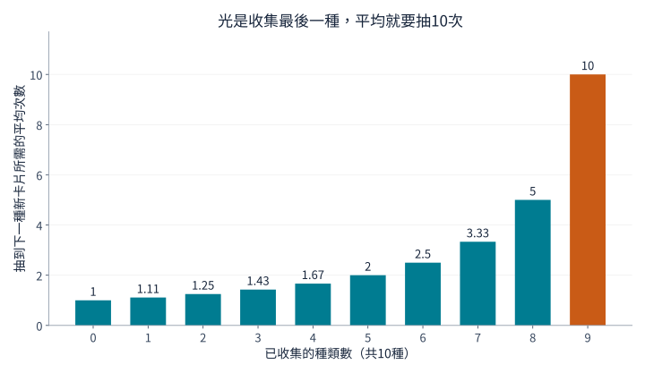
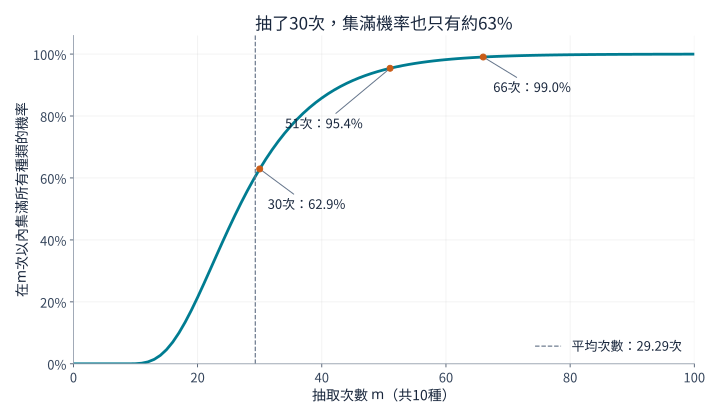
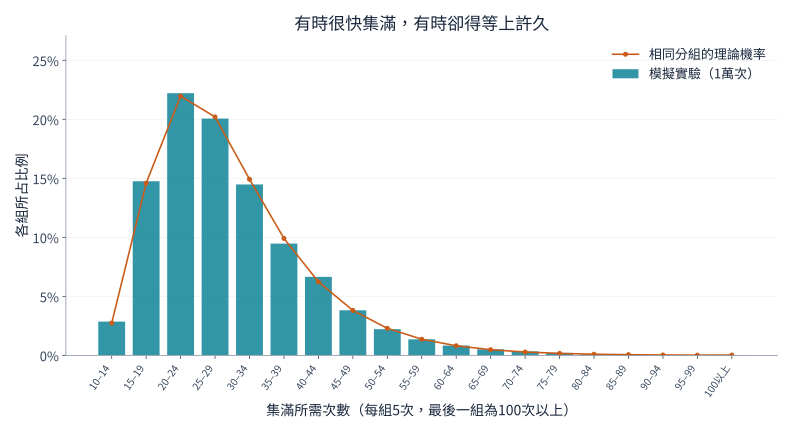

## 1. 為什麼最後一張卡片總是最難等？

假設卡片共有10種，每個密封包裝裡有一張，每種出現的機率相同。剛開始，新卡片很快增加；後來重複卡越來越多；只剩最後一種時，等待似乎特別漫長。

數學中的**[集點問題](https://kenji.blog/p/coupon-collector-problem/)**，也稱優惠券收集問題，研究的正是這種現象。這裡的優惠券泛指種類可區分的收集對象，不一定是折價券，也可以是卡片、貼紙或扭蛋玩具。

先說結論：集滿10種卡片，**平均需要約29.3次抽取**。但這不代表抽30次就能放心。30次以內集滿的機率約為62.9%；若希望機率至少達到95%，就需要51次。以下從新卡片出現的機率開始推導，再用圖表與Python實驗確認。

## 2. 先釐清抽取規則

基本模型採用以下假設：

- 共有 $n$ 種，每次抽取獲得一張。
- 每種卡片每次出現的機率都是 $1/n$。
- 各次抽取相互獨立，過去的結果不影響下一次。
- 同一種可重複出現，沒有交換或避免重複的機制。
- 從零開始，直到每種至少獲得一張才結束。

這相當於**放回抽樣**：抽出一顆球後放回盒子，再抽下一次。如果庫存有限、抽出後不放回，或買整盒便保證集滿，就需要不同的模型。

用 $T$ 表示集滿所需的抽取次數。它在每次實驗中可能不同，因此是**隨機變數**。**期望值** $E[T]$ 是將收集過程從頭重複許多次後的平均，不是對某個人結果的預言。以下主要使用 $n=10$，但公式適用於任意正整數的種類數。

## 3. 拆成「等到下一種新卡片」的階段

### 集得越多，還算新的結果就越少

已經有 $k$ 種時，尚缺 $n-k$ 種。下一次抽到新種類的機率為

$$
p_k=\frac{n-k}{n}
$$

總共10種時，第一張一定是新的；已有5種時，機率是 $5/10$；已有9種時，就只剩 $1/10$。

卡片本身的出現機率沒有改變，只是**對自己而言仍屬於新種類的結果變少了**。即使抽取規則始終相同，收集速度也會自然變慢。

### 成功機率是 $p$ 時，平均等待次數為 $1/p$

設每次獨立嘗試的成功機率為 $p$，首次成功所需次數為 $X$，包含成功的那一次。$X$ 服從幾何分配：

$$
P(X=r)=(1-p)^{r-1}p
\qquad (r=1,2,3,\ldots)
$$

例如，第三次才首次成功，必須出現「失敗、失敗、成功」，機率為 $(1-p)^2p$。

令平均等待次數為 $a$。首先一定花掉一次；若以機率 $1-p$ 失敗，就回到相同處境，還要平均再等 $a$ 次。因此

$$
a=1+(1-p)a
\quad\Longrightarrow\quad
a=\frac{1}{p}
$$

成功機率為 $1/2$ 時平均等2次，為 $1/10$ 時平均等10次。這不代表第10次比較容易成功，而是把短等待與長等待一起平均。

### 把各階段加起來，求出總期望

設從 $k$ 種增加到 $k+1$ 種所需的次數為 $X_k$，則

$$
E[X_k]=\frac{1}{p_k}=\frac{n}{n-k}
$$

集滿所有種類必須依序經過這些階段：

$$
T=X_0+X_1+\cdots+X_{n-1}
$$

根據期望值的線性性，總和的期望等於各項期望的總和。這個性質本身不要求獨立性。因此

$$
\begin{aligned}
E[T]
&=\frac{n}{n}+\frac{n}{n-1}+\cdots+\frac{n}{1}\\
&=n\left(1+\frac12+\cdots+\frac1n\right)\\
&=nH_n
\end{aligned}
$$

$H_n$ 是第 $n$ 個**調和數**，也就是從1到 $n$ 的整數倒數之和。[MIT講義](https://ocw.mit.edu/courses/6-856j-randomized-algorithms-fall-2002/resources/n4/)也介紹了這種分階段的解法。

## 4. 用圖表觀察最後階段的等待

對10種卡片而言，幾個代表性階段如下：

| 已有種類數 | 抽到新種類的機率 | 等到下一種所需的平均次數 |
|---|---|---|
| 0 | 100% | 1 |
| 5 | 50% | 2 |
| 8 | 20% | 5 |
| 9 | 10% | 10 |



*圖1：每根長條只代表該階段的平均次數，不是累計次數。最後一根是第一根的10倍。*

將10根長條相加，得到

$$
E[T]=10H_{10}\approx29.29
$$

收集到9種平均需要約19.29次，最後一種還要平均10次。也就是說，**最後一種占了總平均次數的約34%**。進度剩下10%，不代表只要再花10%的力氣。

最後留下的卡片也不必特別稀有。無論剩哪一種，每次出現的機率都是 $1/10$。即使已為它連續落空20次，下一次成功的機率仍是 $1/10$，從此刻起的平均額外等待仍是10次。這就是幾何分配的**無記憶性**。

## 5. 種類增加後，需要抽幾次？

用同一公式可得到以下近似值：

| 種類數 $n$ | 集滿所需的平均次數 $nH_n$ | 平均次數與種類數的比值 |
|---|---|---|
| 6 | 14.70 | 2.45 |
| 10 | 29.29 | 2.93 |
| 20 | 71.95 | 3.60 |
| 50 | 224.96 | 4.50 |
| 100 | 518.74 | 5.19 |

從10種增加到20種，平均次數由約29次增至72次，不只是兩倍。除了要收集更多種類，後期重複造成的等待也更長。

當 $n$ 很大時，可用自然對數近似調和數：

$$
H_n\approx\ln n+\gamma+\frac{1}{2n}
$$

$\ln$ 是自然對數，$\gamma\approx0.57721$ 是歐拉–馬斯刻若尼常數。因此

$$
E[T]\approx n\ln n+\gamma n+\frac12
$$

期望值大致按 $n\ln n$ 的規模成長。但要計算10種或20種的具體次數，直接加總調和數既簡單，也比只用 $n\ln n$ 更準確。

## 6. 平均29.3次，不代表30次就一定集滿

### 平均次數和完成機率是不同問題

$P(T\le m)$ 表示在 $m$ 次以內集滿的機率，與平均次數所回答的問題不同。

以下是10種卡片的曲線，透過逐步更新狀態機率計算而來，不是由隨機實驗估計。



*圖2：橫軸是抽取次數，縱軸是截至該次數已集滿的機率。次數是整數，連線只是為了方便觀察變化。*

| 抽取次數 | 該次數以內集滿的近似機率 |
|---|---|
| 10 | 0.036% |
| 20 | 21.5% |
| 30 | 62.9% |
| 40 | 85.8% |
| 50 | 94.9% |
| 60 | 98.2% |

要在10次內集滿，就不能有任何重複，機率為 $10!/10^{10}$。只抽與種類數相同的次數，成功機會非常小。

集滿機率首次達到50%、90%、95%、99%所需的次數依序為27、44、51、66。這些門檻稱為**分位數**，50%分位數就是中位數。中位數小於平均值，是因為分配的右側有長尾：少數非常漫長的收集過程會拉高平均值。

### 如何計算曲線？

設抽取 $m$ 次後恰好擁有 $k$ 種的機率為 $q_m(k)$。起初 $q_0(0)=1$，其他狀態的機率都是0。

下一次抽取後有 $k$ 種，可經由兩條路徑：

1. 已有 $k$ 種，抽到重複卡。
2. 已有 $k-1$ 種，抽到新種類。

兩條路徑的機率相加，得到

$$
q_{m+1}(k)=\frac{k}{n}q_m(k)
+\frac{n-k+1}{n}q_m(k-1)
\qquad (1\le k\le n)
$$

抽過一次後不可能仍為0種，因此 $q_{m+1}(0)=0$。集滿後也會持續處於集滿狀態，所以 $q_m(n)=P(T\le m)$。這是以已有種類數為狀態的動態規劃。

能忽略卡片名稱，是因為每種的機率相同。若機率不同，只知道已有幾種，便無法決定抽到新種類的機率。

## 7. 用Python模擬一萬次完整收集

以下程式只用Python標準函式庫。每次實驗從空集合開始，直到集滿10種，再重複一萬次。

```python
import random
import statistics

n = 10
trials = 10_000
rng = random.Random(20260915)

def collect_all(n, rng):
    collected = set()
    draws = 0
    while len(collected) < n:
        collected.add(rng.randrange(n))
        draws += 1
    return draws

results = [collect_all(n, rng) for _ in range(trials)]
theory = n * sum(1 / k for k in range(1, n + 1))

print(f"理論平均次數: {theory:.2f}")
print(f"模擬平均次數: {statistics.mean(results):.2f}")
print(f"模擬中位數: {statistics.median(results):.1f}")
print(f"30次以內集滿的比例: {sum(t <= 30 for t in results) / trials:.1%}")
```

`set` 是不保留重複元素的集合，舊卡片不會增加集合大小。`randrange(n)` 以相同機率選出0到 $n-1$ 的整數，當集合大小達到 $n$ 就停止。

固定亂數種子，可以在相同環境下重現結果。換一個種子，實驗值便會略有變化；與理論值不完全相同，不代表程式必定出錯。

這次執行的平均是29.2929次，中位數是27次，30次以內集滿的比例是63.27%，接近理論上的約62.9%。



*圖3：長條表示實驗比例，圓點是由累積機率之差得到的理論機率。兩者皆每5次一組，100次以上的所有結果也包含在最後一組。*

許多實驗在平均附近結束，也有些需要很久。約29.3次是把這些變動取平均，不代表每個人都會在29次左右完成。**大數法則**有助於理解實驗平均與理論期望的關係。

## 8. 變動究竟有多大？

幾何等待時間的變異數是 $(1-p)/p^2$。在獨立、等機率模型中，各階段等待時間也相互獨立，因此變異數可以相加：

$$
\begin{aligned}
\operatorname{Var}(T)
&=\sum_{j=1}^{n}\frac{1-j/n}{(j/n)^2}\\
&=n^2\sum_{j=1}^{n}\frac{1}{j^2}-nH_n
\end{aligned}
$$

這裡 $j$ 表示尚未取得的種類數。$n=10$ 時，變異數的平方根，也就是**標準差**，約為11.21次，與平均29.29次相比不算小。

但不能直接套用「約95%落在平均值上下兩個標準差內」。這個分配不是常態，也不對稱。要查完成機率，直接使用累積機率曲線比較合適。

一萬次獨立實驗所算出的平均值本身，其標準差則為 $11.21/\sqrt{10000}\approx0.112$ 次，小得多。單次收集可能波動很大，多次平均卻相對穩定。個別結果的分散程度與估計平均值的不確定性是不同概念。

## 9. 套用到現實時要注意什麼？

### 若有稀有種類

若第 $i$ 種出現的機率為 $p_i$，第一次抽到它平均需要 $1/p_i$ 次。集滿不可能早於取得它，因此

$$
E[T]\ge\max_i\frac{1}{p_i}
$$

某種若只有0.1%的機率，光是首次抽到它就平均需要1,000次，不能直接套用等機率10種的29.3次。

把 $\sum_i1/p_i$ 直接相加也不對，因為不同種類是在同一抽取序列中同時收集的：等某種時，其他種也可能出現。第3節加總的則是彼此不重疊、先後發生的等待階段。

### 若能交換或避免重複

交換重複卡，或保證抽到未持有種類，會改變所需次數。如果每次一定是新種類，那麼恰好 $n$ 次就夠了。

沒有這些機制時，不能認為「只差一張，下次總該出了」。從只缺一種開始，在 $r$ 次以內取得它的機率是

$$
1-\left(1-\frac1n\right)^r
$$

對10種來說，10次內取得最後一種的機率約65.1%，仍有約34.9%要繼續等。平均10次不等於保證。沒有交換或保底時，任何有限次數都無法100%保證集滿。

### 與軟體測試的關係

隨機選擇輸入案例，希望每個案例至少執行一次，也有相同結構。未執行案例越少，重複執行舊案例的比例就越高。

實際案例未必等機率，而且每個執行一次並不保證軟體品質。重點是區分大量隨機嘗試與完整涵蓋所有目標。記錄未執行案例並優先處理，有助於減少後期重複。

## 10. 總結：收集最難的地方在最後

把過程拆成等待下一種新卡片的階段，就能得到等機率 $n$ 種的期望值 $nH_n$。剩餘種類越少，新卡片出現的機率越低；最後一種本身就需要平均 $n$ 次。

10種的平均約29.3次，但30次內集滿的機率只有約62.9%；要至少95%，需要51次。**區分平均值、中位數與完成機率**，才能正確解讀數字。

最後一張遲遲不來的煩惱，有清楚的數學原因。把Python中的種類數改成6或20，先預測再實驗，便能從重複卡片中具體理解調和數與機率分配。

### 參考資料與重現用檔案

- [MIT OpenCourseWare的優惠券收集講義](https://ocw.mit.edu/courses/6-856j-randomized-algorithms-fall-2002/resources/n4/)——分階段期望與機率界限。
- [產生圖表的Python程式](generate_graphs.zh-tw.py)——需要Python、Matplotlib及支援對應語言的字型。
- [計算資料JSON](calculation-results.zh-tw.json)——理論值、完成機率與模擬摘要。

圖表依文中模型獨立計算並繪製。生成的封面圖只是概念插畫，不是量化圖表。
