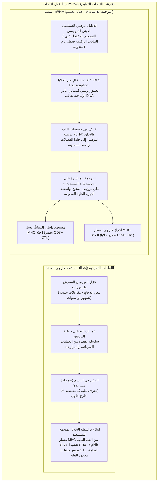
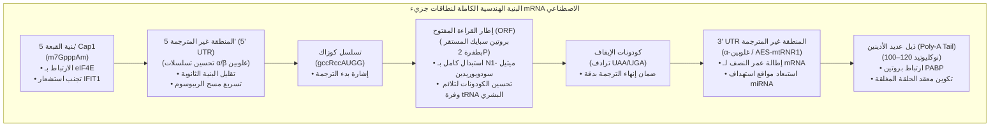
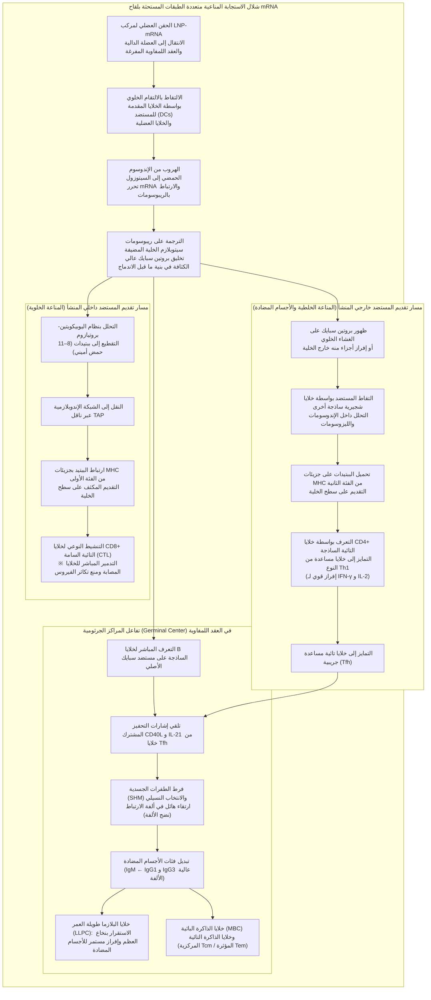
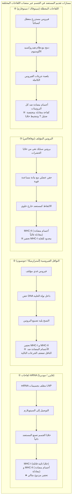

## مقدمة: ثورة mRNA —— كيف مهد «جزيء شديد الهشاشة» لأسرع تطوير للقاحات في تاريخ البشرية

في يناير 2020، نُشر التسلسل الجيني الكامل (حوالي 30,000 نوكليوتيد) للممرض الغامض المسبب للمتلازمة التنفسية الحادة الوخيمة في ووهان الصينية، فيروس «SARS-CoV-2»، على شبكة الإنترنت. وبعد مرور 42 يوماً فقط، قامت شركة «موديرنا» (Moderna) الأمريكية بشحن أول دفعة سريرية من قوارير اللقاح التجريبي «mRNA-1273» إلى معاهد الصحة الوطنية الأمريكية (NIH). وفي الوقت ذاته، انطلق التحالف البحثي بين «بيونتيك» (BioNTech) الألمانية و«فايزر» (Pfizer) الأمريكية بمرشحهما «BNT162b2»، ليصل الفريقان في غضون 11 شهراً فقط — في إنجاز تاريخي خاطف غير مسبوق في الطب الحيوي — إلى استكمال تجارب المرحلة الثالثة السريرية الموسعة ونيل ترخيص الاستخدام الطارئ (EUA).

لقد كان تطوير اللقاحات التقليدية في العرف الصيدلاني المعهود — سواء اللقاحات الحية الموهنة، أو المعطلة، أو البروتينات المؤتلفة المستزرعة في بيض الدجاج أو المفاعلات الحيوية الخلوية العملاقة — يستغرق عادة ما بين **10 إلى 15 عاماً** من العمل المضني والتكاليف الفلكية، بدءاً من عزل السلالة واختيارها، وتحسين شروط الاستزراع، ووصولاً إلى عمليات التنقية المعقدة واختبارات السلامة الصارمة.

إلا أن تقنية الحمض النووي الريبوزي المرسال (mRNA) نسفت هذه المسلمات من جذورها. ويكمن الجوهر الثوري لهذه التقنية في إعادة تعريف اللقاح: فلم يعد «منتجاً صناعياً يتم فيه استزراع البروتين المستضد وتنقيته خارج الجسم ثم حقنه»، بل تحول إلى **«منصة برمجية حيوية تقوم بتحميل الشفرة الجينية الرقمية للبروتين المستهدف مؤقتاً داخل الآلية الخلوية للمضيف ذاته، محولة خلايا الجسم إلى مصنع ذاتي لإنتاج المستضد بدقة جزيئية فائقة»**.



### الطبيعة المؤقتة لـ mRNA في العقيدة المركزية واستحالة «تعديل الجينوم البشري»

في مواجهة المخاوف والشائعات التي ادعت أن «لقاحات mRNA قد تغير الحمض النووي (DNA) للإنسان أو تندمج في الجينوم»، يقدم المبدأ الأساسي الراسخ في البيولوجيا الجزيئية — المعروف باسم **«العقيدة المركزية» (Central Dogma)** — إجابة علمية قاطعة لا لبس فيها.

تتدفق المعلومات الجينية في الخلايا حقيقية النواة في مسار أحادي الاتجاه غير قابل للانعكاس: **الحمض النووي DNA (داخل النواة) ← النسخ (Transcription) ← mRNA (الخروج من النواة) ← الترجمة (Translation) ← البروتين (داخل السيتوبلازم)**. يدخل الـ mRNA الاصطناعي اللقاحي إلى السيتوبلازم فقط، حيث تلتقطه الريبوسومات مباشرة لترجمة بروتين سبايك الشوكي المطلوب:
1. **غياب إشارات التوطين النووي (NLS)**: لا يحتوي جزيء mRNA الاصطناعي على أي إشارات كيميائية أو ببتيدية تسمح له بعبور مسام الغلاف النووي، وبالتالي يظل محصوراً تماماً في سيتوبلازم الخلية دون الوصول إلى النواة.
2. **انعدام إنزيمات النسخ العكسي والتكامل**: يتطلب تحويل RNA إلى DNA وجود إنزيم خاص يُدعى «الناسخ العكسي» (Reverse Transcriptase)، ودمجه في الكروموسومات يتطلب إنزيم «إنتيجريز» (Integrase)، وهي إنزيمات تختص بها الفيروسات القهقرية وتنعدم تماماً في الخلايا البشرية السليمة (التجارب المعملية القصوى التي حاولت إثبات دور الترانسبوزونات الرجعية LINE-1 كانت في بيئات اصطناعية مفرطة ولا تمثل الواقع الفسيولوجي داخل الجسم الحي).
3. **التحلل الطبيعي فائق السرعة**: يُعد الـ mRNA جزيئاً عابراً؛ ففي غضون ساعات قليلة إلى أيام معدودة، يُحلل بالكامل بواسطة إنزيمات «الريبونوكلياز» (RNases) الخلوية إلى نوكليوتيدات مفردة طبيعية يُعاد تدويرها في العمليات الأيضية الطبيعية للجسم.

وبناءً عليه، فإن لقاحات mRNA ليست سوى **«رسالة برمجية مؤقتة ذاتية التدمير تنتهي فور تصنيع البروتين»**، ويستحيل بيولوجياً وفيزيائياً أن تحدث أي تعديل دائم في الحمض النووي للخلية المضيفة.

---

## الفصل الأول: أربعة عقود من الكفاح والاختراق العلمي —— العلماء الذين حولوا mRNA إلى دواء

لم يكن التطبيق السريري الخاطف لعام 2020 وليد صدفة مفاجئة، بل كان تتويجاً لأكثر من 40 عاماً من البحث العلمي الأساسي المضني الذي خاضه علماء واجهوا التشكيك الأكاديمي، وخفض الرتب الوظيفية، وانقطاع التمويل البحثي. وقد جاء منح جائزة نوبل في الفسيولوجيا أو الطب لعام 2023 للدكتورة **كاتالين كاريكو (Katalin Karikó)** والدكتور **درو وايزمان (Drew Weissman)** ليكون تكريماً مستحقاً لانتصار العلم النظري الصبور.

### 1.1 الجدار الميؤوس منه في البدايات: عدم الاستقرار والاستجابة المناعية الفطرية القاتلة

منذ أن اكتشف فرانسوا جاكوب (François Jacob) وسيدني برينر (Sydney Brenner) وزملاؤهما جزيء mRNA في عام 1961، ظل علماء البيولوجيا الجزيئية يحلمون بإمكانية حقن هذا الجزيء في الجسم البشري لتوجيه الخلايا نحو تصنيع أي بروتين علاجي مطلوب.

غير أن التجارب المبكرة في ثمانينيات وتسعينيات القرن الماضي اصطدمت بحائطين مسدودين:
- **عدم الاستقرار الفيزيوكيميائي الفائق**: تنتشر إنزيمات **«الريبونوكلياز» (RNase)** بكثافة متناهية في أنسجة الكائنات الحية، وفي الهواء، وعلى جلد أصابع اليدين، وهي دفاع تطوري شرس ضد الفيروسات. وكانت جزيئات mRNA المجردة (Naked RNA) تتفتت تماماً خلال لحظات من حقنها في الجسم قبل أن تلامس سطح الخلايا.
- **الهياج الكارثي للمناعة الفطرية**: وحتى عندما نجح العلماء في إيصال كميات من الـ mRNA إلى حيوانات التجارب، كانت الأجهزة المناعية تتعامل معه فوراً كإشارة غزو فيروسي خطير، مطلقة عاصفة عاتية من السيتوكينات الالتهابية أدّت إلى صدمات حادة ونفوق الحيوانات. ووصم الـ mRNA لعقود بأنه «جزيء شديد السمية لا يمكن استخدامه كدواء إطلاقاً».

وفي خضم هذه الإحباطات وخسارة منصبها الأكاديمي وانقطاع المنح، واصلت عالمة الكيمياء الحيوية المجرية الأصل كاتالين كاريكو في زوايا جامعة بنسلفانيا تمسكها باليقين العلمي بأن هذا الجزيء يختزن قدرات علاجية غير مكتشفة.

### 1.2 الاكتشاف التاريخي لكاريكو ووايزمان (2005): خداع مستقبلات TLR عبر تعديل اليوريدين

في عام 1997، التقت كاريكو بعالم المناعة درو وايزمان، الذي كان يعمل على تطوير لقاح ضد فيروس نقص المناعة البشرية (HIV) من خلال دراسة قدرة الخلايا الشجيرية (Dendritic Cells: DCs) على تقديم المستضدات. وبدأ العالمان تعاوناً وثيقاً لبحث أثر الـ mRNA على هذه الخلايا.

وكان السؤال الجوهري الذي واجههما: **«لماذا لا يهاجم الجهاز المناعي جزيئات الـ tRNA أو rRNA الطبيعية الخاصة بالجسم، في حين يثور بعنف ضد جزيئات الـ mRNA المصنعة مخبرياً بالنسخ في أنبوب الاختبار (IVT)؟»**

تحتوي أغشية خلايا الثدييات ومستودعاتها الإندوسومية على مجسات مناعية فطرية تُعرف باسم **«المستقبلات الشبيهة بتول» (Toll-like Receptors: TLRs)**:
- **TLR3**: يستشعر الحمض النووي الريبوزي مزدوج السلسلة (dsRNA).
- **TLR7 و TLR8**: يستشعران التسلسلات الغنية بقاعدة اليوراسيل (U) في الـ RNA أحادي السلسلة (ssRNA).
- **RIG-I و MDA5**: مستشعرات سيتوبلازمية تكشف الـ RNA الغريب ذي النهايات ثلاثية الفوسفات وسلاسل dsRNA الطويلة محفزة إنتاج الإنترفيرون من النوع الأول (IFN-α/β).

أدركت كاريكو ووايزمان أن جزيئات الـ RNA الطبيعية داخل خلايا الثدييات تخضع لتعديلات كيميائية حيوية معقدة بعد النسخ، في حين أن الـ mRNA المصنع مخبرياً كان يتألف فقط من القواعد الأربع التقليدية غير المعدلة (A, C, G, U).

وفي عام 2005، نشرا بحثهما المفصلي التاريخي: **عند استبدال قاعدة «اليوريدين» (Uridine) في جزيء mRNA بنظيرها الطبيعي المعدل «السودويوريدين» (Pseudouridine: Ψ)، انعدم استشعار الجزيء بواسطة TLR7 و TLR8 والمستشعرات السيتوبلازمية، واختفت الاستجابة الالتهابية المدمرة تماماً.**

### 1.3 من السودويوريدين إلى «إن1-ميثيل سودويوريدين (m1Ψ)»

لم يتوقف اكتشاف كاريكو ووايزمان عند إسكات الاستجابة المناعية الالتهابية، بل كشف عن مفاجأة مذهلة: لقد ارتفعت كفاءة ترجمة البروتين بواسطة الريبوسومات بمقدار عدة أضعاف إلى عشرات الأضعاف مقارنة بالجزيء غير المعدل.

ففي الأحوال الطبيعية، عندما يدخل mRNA يحتوي على يوريدين غير معدل، تفعل المجسات المناعية إنزيمين دفاعيين: **بروتين كيناز R (PKR)** و **إنزيم 2'-5'-أوليغوأدينيلات سينثيتيز (OAS)**. يقوم PKR بفسفرة عامل بدء الترجمة **eIF2α** مما يوقف تصنيع البروتينات في الخلية برمتها، بينما ينشط OAS إنزيم **RNase L** لتدمير الـ RNA في السيتوبلازم بشكل عشوائي.

ولكن بفضل تعديل السودويوريدين، يتم تجاوز هذه الحواجز التفتيشية بالكامل، مما يتيح للريبوسومات قراءة الشفرة بسلاسة واستقرار ولفترات زمنية طويلة.

ولاحقاً في العقد الثاني من القرن الحادي والعشرين، أثمرت المسوح الجزيئية المتقدمة لشركتي BioNTech و Moderna عن جيل أحدث من التعديل: **«إن1-ميثيل سودويوريدين» (N1-methylpseudouridine: m1Ψ)**، عبر إضافة مجموعة ميثيل إلى ذرة النيتروجين في الموضع 1:
- يقلل هذا التعديل من صلابة البنى الثانوية للـ RNA دون التأثير على تطابق الكودون ومضاد الكودون في مركز فك الشفرة بالريبوسوم.
- يمحو تماماً أي تقارب متبقٍ مع TLR7/8، مما يحقق أقصى كفاءة ترجمة حيوية داخل الجسم.
وقد اعتمدت لقاحات فايزر/بيونتيك (BNT162b2) وموديرنا (mRNA-1273) **الاستبدال الكامل بنسبة 100% لليوريدين بجزيء m1Ψ**.

### 1.4 قمة الاستقرار الهيكلي: «طفرة 2P» لبارني غراهام وجيسون ماكليلان

إلى جانب تعديل النوكليوتيدات، برز إنجاز علمي لا يقل شأناً كان حاسماً في الفعالية الفائقة للقاح: **تثبيت البنية الفراغية لبروتين سبايك الشوكي في هيئة ما قبل الاندماج (Prefusion Conformation) عبر «طفرة البرولين المزدوجة» (2P Mutation)**.

يُعد **بروتين سبايك السكري (S)** الناتئ على سطح فيروس كورونا هو المفتاح الذي يرتبط بمستقبلات ACE2 في خلايا الإنسان لإحداث العدوى. ويعمل هذا البروتين كـ «زنبرك جزيئي» شبه مستقر يتغير شكله الهندسي جذرياً بين مرحلتين:
- **بنية ما قبل الاندماج (Prefusion)**: بنية ثلاثية القسيمات تتكشف في قمتها نطاقات ربط المستقبلات (RBD)، وهي تعرض بكثافة الحواتم (Epitopes) السطحية المسؤولة عن تحفيز **«الأجسام المضادة المعادلة الفائقة»**.
- **بنية ما بعد الاندماج (Postfusion)**: الهيئة المتطاولة الشبيهة بالإبرة التي يستحيل إليها البروتين بعد الاندماج مع غشاء الخلية، وتكون الأجسام المضادة المتكونة ضدها ضعيفة الفعالية في تحييد الفيروس الحي.

وكان الفريق البحثي بقيادة **بارني غراهام (Barney Graham)** في معهد الأبحاث التابع لمعاهد الصحة الأمريكية و**جيسون ماكليلان (Jason McLellan)** بجامعة تكساس في أوستن، قد توصلا خلال أبحاث المجهر الإلكتروني بالتبريد الفائق (Cryo-EM) على فيروسي MERS و SARS-1، إلى أن استبدال حمضين أمينيين متتاليين في منطقة المفصل الحلزوني (الموضعين 986 و 987) بحمضي **«برولين» (Proline: P)** يمنع التفكك الهيكلي نحو بنية ما بعد الاندماج، **ويثبت البروتين بقوة في هيئة ما قبل الاندماج**.

وفور إتاحة التسلسل الجيني لفيروس كورونا المستجد في يناير 2020، طُبقت طفرة «2P» فوراً في تصميم قوالب الـ mRNA، مما ضمن أن الخلايا الملقحة ستقوم بإنتاج وعرض بروتينات سبايك بالهيئة الفراغية الأكثر قدرة على استحثاث أجسام مضادة واقية.

---

## الفصل الثاني: البنية الهندسية الدقيقة لجزيء mRNA الاصطناعي

لا يقتصر تصميم الـ mRNA العلاجي على نسخ الشيفرة الوراثية للفيروس، بل يمثل **«بوليمراً حيوياً عالي الهندسة»** تم تحسين كل نطاق فيه لتعظيم كفاءة الترجمة وضبط عمر الجزيء داخل الخلية بدقة متناهية.



### 2.1 بنية القبعة 5' (الانتقال من Cap0 إلى Cap1): التعرف الذاتي وبدء الترجمة

يحمل الطرف 5' لجزيئات الـ mRNA في حقيقيات النوى **«قبعة 7-ميثيل غوانوزين» (m7G)**. وتكتسب درجة نقاء ونمط مَثيَلة هذه القبعة أهمية مصيرية:
- **هيكل Cap0 (m7GpppN)**: يتعرف عليه بروتين الاستشعار المناعي السيتوبلازمي **IFIT1** كـ «جسم غريب غير ذاتي»، فيقوم بحجب الترجمة وإيقافها فوراً.
- **هيكل Cap1 (m7GpppNm)**: يحتوي على مَثيَلة إضافية في الموقع 2'-O لريبووز أول نوكليوتيد مجاور للقبعة، وهو النمط السائد في خلايا الثدييات، مما يجعله خفياً تماماً عن مستشعر IFIT1.

تعتمد لقاحات فايزر وموديرنا تقنية إضافة القبعة المتزامنة مع النسخ (CleanCap®)، محققة **دقة تفوق 95% في تكوين بنية Cap1 الأصيلة**، مما يضمن الجذب الفعال لمعقد بدء الترجمة **eIF4F** وتمركز الوحدة الصغرى 40S للريبوسوم فوراً على الجزيء.

### 2.2 تحسين المنطقتين غير المترجمتين 5' و 3' (UTRs)

تتحكم المنطقتان اللتان لا تترجمان إلى بروتين في معدل مسح الريبوسوم ومعدل تحلل الجزيء:
- **تصميم 5' UTR**: استُبعدت أي تشكلات ثانوية معقدة مثل الحلقات الجذعية وعقد G-quadruplex التي تعرقل تقدم الريبوسوم، واستُخدمت متواليات مشتقة ومحسنة من جينات **α-غلوبين و β-غلوبين** البشرية لضمان تدفق سريع وسلس للترجمة.
- **تصميم 3' UTR**: صُممت هذه المنطقة لإبطاء عمليات تفكيك ذيل عديد الأدينين وتفادي استهداف جزيئات microRNA الذاتية (استبعاد تسلسلات الربط للبذور الصامتة)، باستخدام هياكل مأخوذة من جينات ألفا-غلوبين أو هجائن معززة مثل تسلسل AES مع جين الرنا الميتوكوندري mtRNR1.

### 2.3 إطار القراءة المفتوح (ORF) والتحسين الكودوني

خضعت المنطقة المشفرة لبروتين سبايك لعملية **«تحسين كودوني» (Codon Optimization)** فائقة التطور مستندة إلى المعلوماتية الحيوية:
1. **التوافق مع وفرة الـ tRNA البشري**: استبدال الكودونات النادرة في جينوم الفيروس بكودونات مرادفة تتوفر أحماضها النووية الناقلة (tRNAs) بغزارة في الخلايا البشرية، مما يرفع سرعة استطالة السلسلة الببتيدية لأقصى حد.
2. **رفع محتوى GC**: زيادة نسب الغوانين والسايتوسين لتعزيز الاستقرار الديناميكي الحراري ومنع مواقع التضفير الشاذة وإشارات إنهاء الترجمة المبكرة.
3. **التخلص من شوائب dsRNA**: التخلص الصارم عبر تقنيات كروماتوغرافيا السائل عالية الأداء (HPLC) من النواتج الجانبية مزدوجة السلسلة الناتجة عن تراجع إنزيم T7 بوليميراز أثناء النسخ المخبري، لتفادي أي تحفيز مناعي التهابي غير مرغوب.

### 2.4 ذيل عديد الأدينين (Poly-A Tail) ونموذج «الحلقة المغلقة»

يعمل ذيل عديد الأدينين في الطرف 3' كـ «ساعة بيولوجية» تحدد بقاء الـ mRNA:
- يرتبط الجزيء بـ **بروتينات الارتباط بعديد الأدينين (PABP)**.
- يتفاعل PABP مع عامل البدء eIF4G المرتبط بالقبعة 5'، مشكلاً **«معقد الحلقة المغلقة» (Closed-Loop Model)**.
- يسمح هذا الإغلاق الحلقي للريبوسوم، فور وصوله إلى كودون الإيقاف (UAA-UGA)، بإعادة التدوير الفوري إلى القبعة 5' لبدء دورة ترجمة جديدة لنفس الجزيء آلاف المرات.
- يبلغ طول الذيل المشفر رقمياً في اللقاحات بدقة ما بين **100 إلى 120 نوكليوتيداً** لتأمين أعلى معدل تخليق مع الحماية من التفكك بالنوكليازات الخارجية.

---

## الفصل الثالث: سفينة النقل عبر الحواجز البيولوجية —— هندسة جسيمات النانو الدهنية (LNPs)

مهما بلغ كمال جزيء الـ mRNA، فإنه لا يساوي مثقال ذرة من الفعالية الدوائية دون وسيلة توصيل فائقة الدقة تحميه وتنقله إلى قلب الخلايا المستهدفة. وكان البطل الحقيقي الذي قاد التقنية إلى التطبيق هو **«جسيمات النانو الدهنية» (Lipid Nanoparticles: LNPs)** بقطرها الهندسي المتراوح بين 80 إلى 100 نانومتر.

### 3.1 لماذا يستحيل حقن الـ mRNA بمفرده دون وسيط؟

إذا حُقن الـ mRNA المجرد في العضلات، فإن النتيجة تكون شبه معدومة بسبب عقبتين حاسمتين:
1. **التنافر الكهروستاتيكي**: يحمل العمود الفقري للفوسفات شحنات سالبة كثيفة (أنيونات)، وهو ما يتنافر مع الرؤوس المشحونة سالباً لطبقة الفوسفوليبيد المزدوجة التي تغلف الخلايا البشرية.
2. **التحلل الفوري بالريبونوكليازات**: لا تتجاوز فترة بقاء الـ RNA الحر في السوائل الخلالية بضع دقائق قبل أن يُمزق كلياً.

لذلك كان لابد من تطوير «حصان طروادة نانوي» يحيد الشحنة السالبة، ويحمي الشفرة، ويهرب بها إلى داخل السيتوبلازم.

### 3.2 «الدهون الأربعة الذهبية» المكونة للجسيم النانوي

تتألف جسيمات LNP في لقاحات فايزر وموديرنا من **أربعة جزيئات دهنية متخصصة** ممزوجة بنسب مولية محسوبة بدقة بالغة:

```
【المكونات الدهنية الأربعة لجسيمات LNP】
1. الدهن الكاتيوني القابل للتأين (Ionizable Lipid) 〜 46-50 مول%
2. الدهن المساعد الفوسفوليبيدي (DSPC) 〜 10 مول%
3. الكوليسترول (Cholesterol) 〜 38-43 مول%
4. الدهن المدمج بالبولي إيثيلين جلايكول (PEGylated Lipid) 〜 1.5-1.7 مول%
```

| المكون الدهني | الجزيء المعتمد (فايزر / موديرنا) | النسبة المولية (mol%) | الخصائص الفيزيوكيميائية | الوظيفة البيولوجية الحيوية |
| :--- | :--- | :--- | :--- | :--- |
| **الدهن القابل للتأين<br/>(Ionizable Lipid)** | **ALC-0315** (Pfizer)<br/>**SM-102** (Moderna) | **~46 إلى 50%** | قيمة pKa الظاهرية **6.0–6.8**. شحنة موجبة في الوسط الحمضي، وشحنة متعادلة في الوسط الفسيولوجي. يحتوي على أمين ثالثي وروابط إستر قابلة للتحلل الحيوي. | ① يرتبط إلكتروستاتيكياً بالـ mRNA سالب الشحنة في وسط حمضي أثناء التصنيع لتكثيفه داخل النواة.<br/>② يتعادل في الدم (pH 7.4) متجنباً السمية الخلوية وتحلل خلايا الدم.<br/>③ يُعاد برتنته في الوسط الحمضي للإندوسومات مسبباً تفكيك الغشاء والهروب. |
| **الدهن المساعد<br/>(Helper Lipid)** | **DSPC**<br/>(1,2-distearoyl-sn-glycero-3-phosphocholine) | **~10%** | فوسفوليبيد مشبع ذو درجة حرارة تحول طوري عالية (~55°C) وبنية جزيئية أسطوانية. | يمنح الجدار الخارجي لجسيمات LNP استقراراً ميكانيكياً وصلابة بنيوية عبر تشكيل غشاء مزدوج منتظم. |
| **الكوليسترول<br/>(Cholesterol)** | كوليسترول نقي مستخلص من مصادر نباتية | **~38 إلى 43%** | هيكل ستيرويدي صلب مع مجموعة هيدروكسيل صغيرة محبة للماء؛ جزيء لضبط تراص الأغشية. | يملأ الفراغات بين جزيئات الفوسفوليبيد، ضابطاً السيولة والمرونة الطورية للغشاء ومحسناً الاندماج الغشائي ويمنع التسرب. |
| **الدهن المدمج بـ PEG<br/>(PEGylated Lipid)** | **ALC-0159** (Pfizer)<br/>**PEG2000-DMG** (Moderna) | **~1.5 إلى 1.7%** | سلاسل بولي إيثيلين جلايكول محبة للماء (وزن 2000 دالتون) مثبتة على مرساة دهنية (دايميريستيل جليسرول). | ① يمنع تكدس واندماج الجسيمات أثناء التخزين، محكماً قطر الجسيم حول ~80 نانومتر.<br/>② يمنع الامتزاز العشوائي لبروتينات البلازما (Opsonization) مطيلاً عمر الدورة الدموية.<br/>③ ينفصل ويتساقط تدريجياً داخل الجسم للسماح للخلايا بالتقاط الجسيم. |

### 3.3 معجزة الالتقام الخلوي والهروب الإندوسومي (Endosomal Escape)

بعد حقن اللقاح في العضلة، تبدأ رحلة جسيم النانو لتخطي الحاجز الأكبر:
1. **الامتزاز بأبوليبوبروتين E والالتقام**: في السائل الخلالي ومجرى الدم، تمتص جسيمات LNP بروتين **ApoE** الطبيعي على سطحها، فتتعرف عليها مستقبلات البروتين الدهني منخفض الكثافة (**LDLR**) على أسطح الخلايا الشجيرية والبلعمية والعضلية، وتلتقطها عبر الالتقام الخلوي في حويصلات إندوسومية.
2. **حمضية الإندوسوم وضخ البروتونات**: مع تحول الإندوسومات المبكرة إلى متأخرة، تضخ مضخات V-ATPase أيونات الهيدروجين، فتهبط درجة الحموضة من 7.4 إلى 6.5 ثم دون 5.5.
3. **انعكاس الشحنة و«تأثير الإسفنج البروتوني»**: عند هذا الوسط الحمضي، تلتقط الدهون القابلة للتأين (pKa 6.0–6.8) البروتونات بكثافة، **متحولة بسرعة مذهلة إلى شحنة موجبة قوية (كاتيونية)**.
4. **الاندماج الغشائي والتحرر السيتوبلازمي**: تتجاذب هذه الدهون الموجبة بقوة هائلة مع الفوسفوليبيدات سالبة الشحنة (مثل فوسفاتيديل سيرين) في الغشاء الداخلي للإندوسوم، مما يفكك طبقة الغشاء محفزاً طوراً سداسياً مقلوباً ($H_{II}$). تتمزق حويصلة الإندوسوم، ويتحرر الـ mRNA سالماً إلى السيتوزول لينقض عليه جيش الريبوسومات.

وتشير أحدث أبحاث البيولوجيا النانوية إلى أن نسبة الـ mRNA التي تنجح فعلياً في الهروب من الإندوسوم تتراوح بين **بضعة بالمائة إلى 15% فقط**؛ ومع ذلك، ونظراً لكفاءة الجزيء الهائلة في الترجمة، فإن هذا الكسر الضئيل يكفي لتخليق كميات هائلة من البروتين المستضد تثير مناعة عارمة.

### 3.4 تقنية المزج بالميوعة الدقيقة (Microfluidics)

اعتمدت خطوط الإنتاج الضخمة على ابتكار **«المزج بالميوعة الدقيقة» (Microfluidic Formulation)**:
ففي قنوات ميكروية لا يتعدى اتساعها عشرات الميكرومترات، يتم تصادم محلول إيثانولي يحوي الدهون الأربعة مع محلول مائي حمضي يحوي جزيئات الـ mRNA بمعدلات تدفق فائقة الدقة.
وعند نقطة الالتقاء، يخفف الإيثانول آنياً فتنهار ذائبية الدهون، مؤدية إلى **تجميع ذاتي فوري (Self-assembly)**: تحيط الدهون الموجبة بالـ mRNA لتشكل النواة، بينما تغلف الدهون الفوسفاتية والـ PEG السطح الخارجي، لنحصل خلال أجزاء من الألف من الثانية على **جسيمات متجانسة بقطر 80–100 نانومتر، وبكفاءة تغليف تفوق 90%، وتباين حجمي ضئيل للغاية (PDI < 0.1)**.

---

## الفصل الرابع: شلال المناعة متعدد الطبقات —— من الترجمة السيتوبلازمية إلى إرساء المناعة الشاملة

إن السر الكامن وراء التفوق الكاسح للقاحات الـ mRNA على اللقاحات المعطلة والبروتينية المؤتلفة ينبع من قدرتها على **تنشيط مساري تقديم المستضد MHC من الفئة الأولى والفئة الثانية في آن واحد**.



### 4.1 الالتقاط الموضعي في الأنسجة العضلية والعقد اللمفاوية المصرفة

عند الحقن في العضلة الدالية، يتدفق القسم الأكبر من جسيمات LNP عبر السائل الخلالي خلال ساعات إلى الأيام الأولى نحو العقد اللمفاوية الإبطية المصرفة.
- ورغم أن خلايا العضلات الهيكلية تبتلع الـ mRNA وتعرض المستضد، إلا أن قادة المعركة المناعية الحقيقيين هم الخلايا المقدمة للمستضد المحترفة (APCs)، وفي مقدمتها **الخلايا الشجيرية (Dendritic Cells: DCs)** المتمركزة في العقد اللمفاوية.
- يتولى الجهاز الخلوي ترجمة بروتين سبايك وإجراء التعديلات اللاحقة للترجمة الطبيعية بدقة (إضافة السكريات والروابط ثنائية الكبريتيد)، ليعرض البروتين الثلاثي في هيئته الأصلية الحية على سطح الغشاء.

### 4.2 مسار MHC فئة I: التحفيز الصاعق للخلايا التائية القاتلة (CD8+ CTL)

تعجز اللقاحات البروتينية والمعطلة عن إثارة استجابة قوية لخلايا **CD8+ التائية السامة (القاتلة / CTL)** المسؤولة عن تصفية الخلايا المصابة بالفيروس، لأنها تُقدم المستضد من خارج الخلية حصراً.

أما لقاحات mRNA، فتصنع المستضد **داخل سيتوبلازم الخلية ذاتها**، مفعّلة المسار الداخلي الأصيل:
1. **التحلل بالبروتيازوم**: توسم بعض بروتينات سبايك المصنعة باليوبيكويتين، ويقطعها معقد **البروتيازوم** إلى قطع ببتيدية قصيرة بطول 8–11 حمضاً أمينياً.
2. **النقل بناقل TAP**: تُنقل هذه الببتيدات بنشاط عبر ناقل **TAP** إلى تجويف الشبكة الإندوبلازمية.
3. **التحميل على MHC-I**: ترتبط الببتيدات بشق جزيئات **MHC من الفئة الأولى (HLA-A, B, C)** وتنقل عبر جهاز غولجي لتعرض على السطح الخارجي للخلية.
4. **تنشيط الخلايا القاتلة**: تتعرف خلايا CD8+ التائية الساذجة عبر مستقبلاتها (TCR) على هذا المعقد، وبفضل إشارات التحفيز المشترك، تتحول إلى **جيش من الخلايا السامة المؤثرة (CTLs)**.

وكانت هذه الاستجابة الخلوية الهائلة هي صمام الأمان الحقيقي الذي حمى البشرية من الموت والمضاعفات الوخيمة عندما نجحت المتحورات لاحقاً في الهروب من الأجسام المضادة.

### 4.3 مسار MHC فئة II وتوجيه خلايا CD4+ نحو النمط Th1

بالتوازي مع ذلك، ينطلق المستضد إلى البيئة المحيطة مع الموت الطبيعي للخلايا أو الإفراز الخلوي:
- تبتلعه خلايا شجيرية مجاورة أخرى وتفككه داخل الليزوسومات إلى ببتيدات بطول 13–18 حمضاً أمينياً.
- تُحمل الببتيدات على جزيئات **MHC من الفئة الثانية (HLA-DR, DQ, DP)** لتقديمها لخلايا CD4+ التائية.
- وبفضل التحفيز المعتدل للمناعة الفطرية بواسطة دهون الـ LNP، توجه خلايا CD4+ بشكل صارم لتتمايز إلى **خلايا Th1 مساعدة** (تفرز كميات وفيرة من الإنترفيرون غاما و IL-2)، مما قطع الطريق تماماً أمام استجابة Th2 التحسسية الضارة.

### 4.4 معركة المراكز الجرثومية (Germinal Centers) ونضج ألفة خلايا B

أثمرت هذه الآلية عن رد فعل حيوي مذهل تمثل في تكوين واستمرار **«المراكز الجرثومية» (Germinal Centers: GCs)** داخل العقد اللمفاوية لأشهر طويلة:
1. **الارتباط بالمستضد الأصيل**: ترتبط خلايا B الساذجة في جريبات العقد مباشرة ببروتينات سبايك ثلاثية الأبعاد المعروضة على الخلايا الشجيرية.
2. **الدعم الفائق من خلايا Tfh**: تنتقل خلايا B إلى المراكز الجرثومية لتتلقى إشارات البقاء والتكاثر من **الخلايا التائية المساعدة الجريبية (Tfh)** عبر جزيء CD40L وإنترلوكين-21.
3. **فرط الطفرات الجسدية (SHM) والانتخاب النسيلي**: في المنطقة المظلمة للمركز الجرثومي، تشرع خلايا B في إحداث طفرات عشوائية سريعة في جينات الأجسام المضادة؛ وفي المنطقة المضيئة، تخوض تنافساً شرساً على الارتباط بالمستضد، فلا تنجو إلا «الخلايا النخبوية» ذات الألفة والالتصاق الأقوى، بينما تباد الخلايا الضعيفة بالموت المبرمج.
4. **تبديل الفئات وخلايا البلازما طويلة العمر**: تتطور الأجسام المضادة من IgM الضعيفة إلى **IgG1 و IgG3 عالية الألفة والقدرة على التحييد**. وتستقر نخبة هذه الخلايا في نخاع العظم كـ **خلايا بلازمية طويلة العمر (LLPCs)** تضخ الأجسام المضادة لشهور، بينما ينتشر جزء آخر كـ **خلايا ذاكرة بائية (MBCs)** متأهبة في الطحال وسائر العقد اللمفاوية.

وقد أثبتت الدراسات النسيجية لعينات العقد اللمفاوية أن المراكز الجرثومية المستحثة بلقاحات mRNA استمرت في حالة نشاط وظيفي مفرط لـ **أكثر من ستة أشهر كاملة بعد الجرعة الأولى**، مفسرة الجودة الاستثنائية للأجسام المضادة المتكونة.

---

## الفصل الخامس: الأدلة السريرية، ومسار الفعالية، والمعركة ضد المتحورات

### 5.1 نتائج تجارب المرحلة الثالثة الموسعة: صدمة فعالية الـ 95%

أحدثت نتائج تجارب المرحلة الثالثة السريرية للقاحي فايزر (Polack et al.) وموديرنا (Baden et al.)، والتي نُشرت تباعاً في أواخر عام 2020 في مجلة *نيو إنغلاند الطبية* (NEJM)، زلزالاً علمياً إيجابياً في الأوساط الطبية العالمية:
- **فايزر/بيونتيك (BNT162b2: بمشاركة 43,448 شخصاً)**: أُصيب 162 شخصاً في مجموعة الدواء الوهمي (البلاسيبو) بأعراض كوفيد-19، مقابل 8 حالات فقط في مجموعة اللقاح، محققاً **فعالية بنسبة 95.0% (مجال ثقة 95%: 90.3–97.6%)** في الوقاية من المرض العَرَضي. وسُجلت 9 حالات حرجة في مجموعة البلاسيبو مقابل حالة واحدة فقط في مجموعة اللقاح.
- **موديرنا (mRNA-1273: بمشاركة 30,420 شخصاً)**: 185 إصابة في مجموعة البلاسيبو (بينها 30 حالة حرجة ووفاة واحدة)، مقابل 11 إصابة في مجموعة اللقاح (صفر حالات حرجة)، محققاً **فعالية 94.1% (مجال ثقة 95%: 89.3–96.8%)** وفعالية بنسبة 100% في منع الحالات الشديدة.

وكانت إدارة الغذاء والدواء الأمريكية (FDA) ومنظمة الصحة العالمية قد حددتا مسبقاً عتبة 50% كشرط للترخيص الطارئ. وبالمقارنة مع لقاحات الإنفلونزا الموسمية التي تتراوح فعاليتها السنوية بين 40 إلى 60%، كان تسجيل فعالية تقارب 95% ضد فيروس مجهول بمثابة إنجاز علمي تخطى أكثر التوقعات تفاؤلاً.

### 5.2 التفسير الإحصائي: تقليل الخطر النسبي (RRR) مقابل تقليل الخطر المطلق (ARR)

أثير جدل إحصائي ومغالطة شهيرة زعمت أن «نسبة 95% تمثل خفضاً نسبياً للخطر (RRR)، بينما الخفض المطلق للخطر (ARR) لم يتجاوز 1%، مما يعني أن اللقاح غير مفيد».

ولتفكيك هذه المغالطة بموضوعية رياضية وعلمية:
- **خفض الخطر النسبي (RRR)**: يقارن معدل الإصابة في مجموعة البلاسيبو ($I_p$) بمعدل الإصابة في مجموعة اللقاح ($I_v$):
  $$RRR = \frac{I_p - I_v}{I_p} \times 100\% = \frac{0.0088 - 0.0004}{0.0088} \approx 95\%$$
  وهو المعيار البيولوجي والمناعي الأصيل الذي يعبر عن **«قدرة اللقاح الذاتية على تحييد هجوم الفيروس ومنع المرض»**.
- **خفض الخطر المطلق (ARR)**: هو الفرق الحسابي المباشر بين نسبتي المصابين في عينة الدراسة خلال نافذة زمنية محددة:
  $$ARR = I_p - I_v \approx 0.88\% - 0.04\% = 0.84\%$$
- **الجوهر الإحصائي**:
  يعتمد مقياس ARR اعتماداً كلياً على **«معدل انتشار العدوى في المجتمع المحيط أثناء فترة التجربة»**. فإذا أُجريت تجربة في مجتمع تنخفض فيه العدوى إلى أدنى مستوياتها، فإن الـ ARR لأي لقاح أسطوري في العالم سيكون حسابياً أقل من 1%. ولكن عندما تشتعل الجائحة ويتعرض 20% من السكان للعدوى، فإن الخفض المطلق يقفز فوراً إلى $20\% \times 95\% = 19\%$.
  لذا، فإن الادعاء بأن صغر الـ ARR يطعن في فائدة اللقاح هو خلط منهجي شنيع بين الكفاءة البيولوجية ومعدل التعرض الوبائي.

### 5.3 أدلة العالم الحقيقي (Real-World Evidence): حقائق السجلات الوطنية

عندما انتقل اللقاح من شروط التجارب السريرية المنضبطة إلى الواقع الديموغرافي المتشابك بعشرات الملايين من كبار السن وأصحاب الأمراض المزمنة، واصلت المنصة إثبات كفاءتها الفائقة.

أكدت الدراسات الرائدة في **إسرائيل (دراسة مطابقة شملت 1.2 مليون شخص من Clalit، Dagan et al.، NEJM 2021)** وبيانات بريطانيا (UKHSA) والمراكز الأمريكية لمكافحة الأمراض (CDC) الحقائق التالية:
1. **السيطرة المطلقة على السلالات الأولى**: بلغت الحماية في المجتمع الحقيقي ضد العدوى بسلالة ووهان ومتحور ألفا أكثر من 90%، وتجاوزت حماية المستشفيات والوفاة 95%.
2. **التراجع الزمني للحماية من مجرد العدوى**: بعد 4 إلى 6 أشهر، ومع الانخفاض الطبيعي لعمر النصف للأجسام المضادة في الدم، تراجعت الحماية من الإصابات الطفيفة ذات الأعراض إلى حدود 60–70%.
3. **الصمود الفولاذي ضد المرض الشديد والوفاة**: على النقيض من ذلك، ظلت الحماية من دخول المستشفيات والتنفس الاصطناعي والوفاة ثابتة عند مستويات تفوق 85–90% لأوقات طويلة. ويرجع ذلك إلى يقظة خلايا B الذاكرة في نخاع العظم، والأهم من ذلك: **استبسال خلايا CD8+ التائية القاتلة** التي تسحق الفيروس في أعماق الرئتين وتمنع تدمير الأنسجة.

### 5.4 موجات المتحورات والهروب المناعي: انحسار الأجسام المضادة وثبات خلايا T

مع تطاول أمد الوباء، فرض الضغط المناعي التطوري على SARS-CoV-2 تراكماً سريعاً للطفرات.

| سلالة المتحور | مواقع الطفرات الرئيسية (RBD وغيرها) | الحساسية للأجسام المضادة المعادلة | الوقاية من العدوى (جرعتان) | الوقاية من المرض الشديد (جرعتان) | تأثير الجرعات التنشيطية (المعززة) |
| :--- | :--- | :--- | :--- | :--- | :--- |
| **سلالة ووهان الأصلية<br/>(Wuhan-Hu-1)** | المرجع المعياري (دون طفرات) | **1.0x** (المعيار) | **~95%** | **أكثر من 95%** | ارتفاع عيارات الأجسام المضادة لعشرات الأضعاف |
| **متحور ألفا<br/>(Alpha: B.1.1.7)** | N501Y, P681H | **انخفاض طفيف 1.5–2 ضعف** | **~85–90%** | **~95%** | استعادة أعلى مستويات الحماية الكاملة |
| **متحور دلتا<br/>(Delta: B.1.617.2)** | L452R, T478K, P681R | **انخفاض بمقدار 3–6 أضعاف** | **~60–75%** (تتراجع مع الوقت) | **~90%** | الجرعة الثالثة تعيد الحماية من الأعراض إلى >85% |
| **أوميكرون BA.1/BA.2<br/>(بدايات أوميكرون)** | أكثر من 15 طفرة في RBD<br/>(K417N, E484A, N501Y إلخ) | **انهيار بمقدار 20–40 ضعفاً** | **~20–40%** (هبوط حاد بجرعتين) | **~70–80%** (محفوظة بمناعة خلايا T) | الجرعة المعززة تقفز بالوقاية من الأعراض إلى 65–75%، ومن المرض الشديد إلى >90% |
| **أوميكرون BA.4/BA.5<br/>و سلالات XBB/JN.1** | L452R, F486V/P, R346T<br/>هروب مناعي حاد وتقارب مستقبلي | **فقدان واسع للارتباط بالمعادلة** | **شبه معدومة بالجرعات القديمة فقط** | **~60–70%** (محمية بالذاكرة التائية) | اللقاحات المحدثة ثنائية التكافؤ وأحادية التكافؤ XBB/JN.1 تعيد تحييد الفيروس وترفع الوقاية من الاستشفاء لـ 70–80%+ |

أظهر ظهور أوميكرون حدود خط الدفاع الأول المتمثل بالأجسام المضادة، حيث أدت أكثر من 30 طفرة في بروتين سبايك و15 طفرة في نطاق RBD إلى تغيير جذري في شكل الحواتم الخارجية.

وهنا تجلت العظمة المناعية لـ **«استجابة الخلايا التائية»**:
- تستهدف الأجسام المضادة حواتم فراغية ثلاثية الأبعاد بارزة ومحدودة على السطح، مما يجعل بضع طفرات كفيلة بإفشالها.
- بالمقابل، تتعرف الخلايا التائية على **سلاسل ببتيدية خطية قصيرة** موزعة على كامل طول بروتين سبايك المكون من 1273 حمضاً أمينياً.
- ونظراً للتنوع الهائل في جزيئات HLA بين أفراد الجنس البشري، لم يتمكن الفيروس من التهرب من جميع حواتم التائية في وقت واحد.
- أثبتت الدراسات الدولية أن **أكثر من 80 إلى 90% من حواتم الخلايا التائية الناتجة عن اللقاح الأصلي ظلت سليمة تماماً ضد أوميكرون**. وكان هذا هو السر المناعي الذي حال دون انهيار وحدات العناية المركزة في العالم رغم انفجار أعداد المصابين.

### 5.5 استراتيجية الجرعات المعززة واللقاحات المحدثة المستمرة

أثبتت منصة mRNA رشاقتها ومرونتها الخارقة في مواجهة تحورات الفيروس:
1. **الجرعات المعززة المتطابقة (الجرعة 3)**: أدى إعطاء جرعة إضافية من اللقاح الأصلي إلى إعادة إشعال المراكز الجرثومية، محفزاً خلايا B الذاكرة على مزيد من نضج الألفة وتوليد أجسام مضادة قادرة على معادلة أوميكرون تصالبياً.
2. **اللقاحات ثنائية التكافؤ (Bivalent)**: مزج متساوٍ بين mRNA السلالة الأصلية وmRNA أوميكرون BA.4/5 لتوسيع المظلة المناعية.
3. **اللقاحات أحادية التكافؤ المحدثة (XBB.1.5 و JN.1)**: لمنع ظاهرة «الخطيئة المستضدية الأصلية» (Antigenic Imprinting)، تم التحول لتضمين شفرة السلالة السائدة حديثاً فقط. ولم يستغرق الانتقال من القراءة الجينية الرقمية إلى إنتاج القوارير الجاهزة سوى **شهرين إلى ثلاثة أشهر**، وهي مرونة تعجز عنها سائر المنصات الكلاسيكية.

---

## الفصل السادس: مأمونية اللقاح، وفيزيولوجيا الآثار الجانبية المرضية، وميزان الفوائد والمخاطر

كأي مستحضر بيولوجي فعال، يحمل لقاح mRNA استجابات تفاعلية متوقعة ومخاطر نادرة محتملة يجب استعراضها بأعلى درجات الأمانة العلمية والتقييم الكمي الدقيق.

### 6.1 التفاعلية الموضعية والجهازية (Reactogenicity): الضريبة الفسيولوجية لتيقظ المناعة

الأعراض الشائعة بعد الحقن — مثل الألم الموضعي، والتورم، والحمى، والإرهاق، والقشعريرة، وآلام المفاصل والصداع — ليست مؤشراً على تسمم نسيجي، بل هي **«دليل بيولوجي فسيولوجي على اشتغال محركات المناعة الفطرية كما خُطط لها»**:
- تحفز دهون LNP وشظايا الـ RNA المجهرية إفراز السيتوكينات الالتهابية الموضعية مثل **IL-1β، و IL-6، و TNF-α، وإنترفيرونات النوع الأول**.
- يثير تدفق IL-6 في الدورة الدموية مركز تنظيم الحرارة في منطقة تحت المهاد (Hypothalamus) بالدماغ محدثاً الحمى، مع آلام عضلية عابرة.
- تزول معظم هذه الأعراض تلقائياً في غضون 24 إلى 48 ساعة، وتستجيب بامتياز لمسكنات الألم الخافضة للحرارة مثل الباراسيتامول أو الإيبوبروفين.

### 6.2 التهاب عضلة القلب والتهاب التامور (Myocarditis / Pericarditis)

رصدت أنظمة التيقظ الدوائي العالمية (مثل VAERS و VSD في أمريكا والسجلات الأوروبية) ظهور حالات نادرة للغاية من التهاب عضلة القلب أو غشائها المحيط (التامور)، لا سيما لدى **الذكور من سن 12 إلى 29 عاماً** بعد تلقي الجرعة الثانية تحديداً.

#### ① المعدلات الوبائية
- المعدل العام الإجمالي نادر للغاية: **حوالي 1 إلى 5 حالات لكل 100,000 جرعة**.
- في الفئة الأعلى خطورة (الشباب من 16 إلى 19 عاماً بعد الجرعة الثانية): يصل المعدل إلى **نحو 10 إلى 15 حالة لكل 100,000 جرعة (حوالي 0.01%)**.
- ارتبط لقاح موديرنا (جرعة 100 ميكروغرام) بمعدلات أعلى قليلاً إحصائياً مقارنة بلقاح فايزر (جرعة 30 ميكروغرام)، مما دفع العديد من الدول إلى تفضيل إعطاء فايزر للشباب.

#### ② الفرضيات الإمراضية الجزيئية
1. **بروتين سبايك الحر غير المعادل**: أظهرت دراسات هارفارد (Yonker et al., Circulation 2023) وجود مستويات ضئيلة من بروتين سبايك الحر غير المرتبط بأجسام مضادة في دماء بعض الشباب المصابين، مما قد يسبب استثارة مفرطة لمستقبلات المناعة في النسيج القلبي.
2. **تأثير هرمون التستوستيرون**: يعزز التستوستيرون الذكري مسار خلايا Th1 والالتهاب، في حين يلعب الإستروجين الأنثوي دوراً مضاداً للالتهاب، مفسراً الانحياز الذكوري الواضح للحالات.
3. **رد الفعل المناعي الذاتي العابر**: تولد استجابة مناعية تصالبية عابرة ضد بروتينات الانقباض القلبي مثل ألفا-ميوزين.

#### ③ المآل السريري والمقارنة الحاسمة مع أخطار العدوى
- **أكثر من 90% من الحالات خفيفة وتتماثل للشفاء التام**: حيث يستجيب المرضى سريعاً لمضادات الالتهاب غير الستيرويدية (NSAIDs) ويغادرون المستشفى خلال أيام دون قصور قلبي مزمن.
- **خطر الإصابة بفيروس كورونا يفوق خطر اللقاح بأضعاف مضاعفة**: تؤكد البيانات القاطعة الصادرة عن مراكز السيطرة على الأمراض وهيئات الصحة البريطانية أن خطر الإصابة بالتهاب عضلة القلب الشديد، والجلطات، والفشل القلبي، والوفاة جراء التقاط عدوى كوفيد-19 الحقيقية أعلى بعشرات المرات من الخطر النادر المرتبط باللقاح، مما يرجح كفة التطعيم حتى للذكور اليافعين.

### 6.3 التأق والحساسية تجاه البولي إيثيلين جلايكول (PEG)

تحدث صدمة الحساسية الحادة (التأق / Anaphylaxis) بمعدل ضئيل جداً يُقدر بـ **2 إلى 5 حالات لكل مليون جرعة**:
- السبب الرئيسي هو وجود حساسية مسبقة لمادة **PEG2000** الداخلة في تركيب LNP، نتيجة الاستخدام الواسع للبولي إيثيلين جلايكول في مستحضرات التجميل والأدوية المسهلة، أو من خلال تنشيط المتممة غير المعتمد على IgE (تفاعل CARPA).
- من خلال الملاحظة الطبية لمدة 15–30 دقيقة بعد الحقن والتدخل الفوري بحقن الإبينفرين (الأدرينالين)، تم علاج جميع الحالات دون وفيات.

### 6.4 الفارق الجذري مع لقاحات النواقل الفيروسية (TTS / VITT)

ارتبطت لقاحات النواقل الفيروسية الغدية (مثل أسترازينيكا وجونسون آند جونسون) بمتلازمة خطيرة تسمى **متلازمة نقص الصفيحات والتخثر (TTS / VITT)**:
- ينتج VITT عن ارتباط بروتينات الغلاف الفيروسي للغدانيات بعامل الصفائح الدموية 4 (PF4)، مما يولد أجساماً مضادة ذاتية تؤدي لتخثر عارم في الجيوب الوريدية الدماغية.
- **تخلو لقاحات mRNA تماماً من أي بروتينات فيروسية حاملة**: وبالتالي لم يُسجل لها أي ارتباط بحدوث VITT.

### 6.5 دحض مخاوف الـ ADE ومرض الـ VAED

كان الخوف النظري الأكبر مستمداً من تاريخ لقاحات حمى الضنك ولقاح فيروس RSV المعطل في الستينيات، حيث تسببت الأجسام المضادة غير المحيدة في تسهيل دخول الفيروس للبلعميات وتفاقم المرض عبر **التعزيز المعتمد على الأجسام المضادة (ADE)** أو إثارة التهاب رئوي أرجائي حاد يُعرف بـ **المرض المعزز باللقاح (VAED)**:
- بعد مليارات الجرعات المعطاة في أرجاء المعمورة، **لم يُرصد أي أثر لظاهرتي ADE أو VAED مع لقاحات mRNA إطلاقاً**.
- والسبب الجزيئي يعود إلى طفرة 2P التي قصرت إنتاج الأجسام المضادة على النوع فائق التحييد، إضافة إلى استحثاث نمط Th1 القوي الذي منع تماماً مسار Th2 التحسسي المؤدي لـ VAED.

| العَرَض الجانبي أو الحدث الضار | معدل التكرار | توقيت الظهور المعتاد | الآلية المرضية الفسيولوجية الأساسية | المآل السريري وطرق العلاج |
| :--- | :--- | :--- | :--- | :--- |
| **التفاعلات الموضعية** (ألم، احمرار، تورم) | **70–85%** (شائعة جداً) | يوم الحقن وحتى اليوم التالي | إفراز السيتوكينات (IL-1, TNF) في العضلة وتسلل العدلات | شفاء تلقائي خلال 1–3 أيام؛ كمادات باردة ومسكنات بسيطة. |
| **التفاعلات الجهازية** (حمى، إرهاق، صداع) | **50–70%** (شائعة، تزداد بالجرعة 2) | بعد 12–24 ساعة من الحقن | تدفق IL-6 و IFN-α/β بالدم وتنبيه مركز تنظيم الحرارة بالدماغ | اختفاء خلال 24–48 ساعة؛ الراحة والباراسيتامول أو NSAIDs. |
| **التهاب عضلة القلب والتامور** | **1–5 لكل 100,000 جرعة** (نادر جداً، الشباب 12–29) | خلال 2–4 أيام من التطعيم | بروتين سبايك الحر، وتأثير التستوستيرون، واستجابة مناعية عابرة | **أكثر من 90% حالات خفيفة**؛ شفاء تام بالأدوية المضادة للالتهاب. |
| **التأق (الحساسية المفرطة)** | **2–5 لكل مليون جرعة** (نادر للغاية) | خلال 15–30 دقيقة من الحقن | تفاعل مع PEG2000 أو تنشيط المتممة المباشر (CARPA) | تعافٍ فوري وتام بالحقن العضلي الفوري للإبينفرين (الأدرينالين). |
| **متلازمة غيلان باريه** | **مماثلة للمعدل الطبيعي في المجتمع** | بعد أسابيع من الحقن | أجسام مضادة لغمد الميالين (سُجلت مع النواقل الفيروسية، ونُفيت عن mRNA) | العلاج بالغلوبيولين المناعي الوريدي (IVIg) وتبديل البلازما. |

---

## الفصل السابع: مقارنة شاملة بين منصات تقنيات اللقاحات المختلفة

شكلت جائحة كوفيد-19 أضخم ميدان سباق واختبار مقارن في تاريخ التكنولوجيا الحيوية تنافست فيه كافة المنصات التي ابتكرتها البشرية.



### 7.1 لقاحات mRNA مقابل النواقل الفيروسية (منصات الـ DNA)

تحمل لقاحات النواقل الفيروسية جينات الـ DNA المشفرة لسبايك داخل غلاف فيروس غدي معدل.
- **الميزة**: استقرار جزيء الـ DNA كيميائياً، مما يتيح التخزين في الثلاجات العادية (2–8 درجات مئوية).
- **العيب الحاسم (المناعة ضد الناقل)**: يبني الجسم أجساماً مضادة ضد غلاف الفيروس الغدي الحامل نفسه؛ ولهذا تفقد الجرعات المعززة اللاحقة جزءاً كبيراً من فعاليتها لأن الجسم يدمر الحامل قبل وصوله للخلايا، فضلاً عن خطر متلازمة VITT.
- أما لقاحات mRNA، فبفضل استخدام جسيمات نانو دهنية اصطناعية خالية من أي بروتينات، **يمكن تكرار الجرعات المعززة بلا حدود دون أن يعترضها الجهاز المناعي**.

### 7.2 لقاحات mRNA مقابل لقاحات البروتين المؤتلف

تعتمد منصة نوفافاكس (Novavax) على استزراع البروتين وتنقيته مسبقاً في مفاعلات حيوية لخلايا الحشرات، ثم حقنه مع مادة مساعدة مشتقة من الصابونين (Matrix-M™).
- **الميزة**: تقنية ناضجة ذات تاريخ ممتد وتفاعلية موضعية خفيفة للغاية.
- **العيب**: عملية تصنيع طويلة ومعقدة تتطلب أشهراً لاستزراع وتنقية البروتين وضمان طيه الصحيح، مما يجعل مواكبة المتحورات الطارئة بطيئة للغاية.

### 7.3 لقاحات mRNA مقابل اللقاحات المعطلة

تستخدم لقاحات سينوفاك وسينوفارم فيروسات كاملة مستزرعة أُبطل مفعولها بمواد كيميائية.
- **الميزة**: تقدم كافة البروتينات الفيروسية كالغلاف والنيوكليوكابسيد.
- **العيب**: قدرة منخفضة على توليد أجسام مضادة عالية التحييد، وانعدام شبه تام لتحفيز خلايا CD8+ التائية القاتلة، مما أدى لانهيار فعاليتها أمام أوميكرون. كما تتطلب منشآت أمان بيولوجي فائقة التعقيد (BSL-3).

### 7.4 عمليات التصنيع والقيود الديناميكية الحرارية لسلسلة التبريد

كان التحدي اللوجستي الأكبر للقاحات الـ mRNA هو **«سلسلة التبريد الفائق» (-80 إلى -20 درجة مئوية)**:
- **التفسير الفيزيوكيميائي**: يميل العمود الفقري للـ RNA إلى التحلل الذاتي المائي في الأوساط السائلة، فضلاً عن تعرض الدهون للأكسدة والاندماج.
- **التبريد الفائق**: تطلبت الدفعات الأولى حفظاً عند -80 إلى -60 درجة (فايزر) أو -20 درجة (موديرنا) لتجميد الحركة الجزيئية ومنع التحلل.
- **الميزة الإنتاجية الهائلة**: نظراً لكون التفاعل خاليًا من الخلايا (IVT)، يكفي مفاعل صغير بسعة لترات لإنتاج مئات الملايين من الجرعات في أيام، وهو ما منح هذه المنصة قابليتها الأسطورية للتوسع الفوري.

| معيار المقارنة | ① لقاحات mRNA | ② النواقل الفيروسية | ③ البروتين المؤتلف | ④ اللقاحات المعطلة |
| :--- | :--- | :--- | :--- | :--- |
| **أبرز اللقاحات** | **فايزر (BNT162b2)<br/>موديرنا (mRNA-1273)** | أسترازينيكا (ChAdOx1)<br/>جونسون (Ad26.COV2.S) | نوفافاكس (NVX-CoV2373)<br/>دايتشي سانكيو | سينوفاك (CoronaVac)<br/>سينوفارم (BBIBP) |
| **هيئة المستضد** | mRNA مغلف بجسيمات دهنية نانوية | DNA داخل فيروس غدي غير متكاثر | بروتين نانوي مُنقى ومُعدل | فيروس كامل معطل كيميائياً |
| **موقع تصنيع المستضد** | **سيتوبلازم خلايا المضيف (داخلي)** | نواة وسيتوبلازم خلايا المضيف | مفاعلات خارجية (حشرات / خلايا CHO) | مفاعلات خارجية (خلايا فيرو Vero) |
| **عيار الأجسام المحيدة** | **الأعلى والأقوى على الإطلاق** | من قوي إلى متوسط | قوي جداً | متوسط إلى ضعيف |
| **تحفيز CD8+ CTL** | **قوي جداً (عبر MHC-I)** | قوي | محدود (تقديم تصالبي فقط) | شبه معدوم |
| **سرعة تحديث السلالة** | **الأسرع إطلاقاً (شهران إلى 3 أشهر)** | متوسطة (2–4 أشهر) | بطيئة (6–12 شهراً) | بطيئة جداً (>6 أشهر) |
| **أبرز الآثار الجانبية** | حمى، إرهاق، التهاب قلب نادر | حمى، خثار صفيحات نادر (VITT) | ألم موضعي وإرهاق طفيف | تفاعلات موضعية خفيفة جداً |
| **حرارة التخزين** | **-80 إلى -20 مئوية (تجميد)** | 2 إلى 8 مئوية (تبريد عادي) | 2 إلى 8 مئوية (تبريد عادي) | 2 إلى 8 مئوية (تبريد عادي) |
| **ملاءمة التكرار المعزز** | **مثالية وغير محدودة** | ضعيفة (لتشكل مناعة ضد الناقل) | ممتازة | ممتازة |

---

## الفصل الثامن: آفاق تكنولوجيا mRNA المستقبلية —— من مناعة السرطان إلى الطب الدقيق

لقد فتح النجاح الباهر للقاحات كوفيد-19 الباب على مصراعيه لتكون تقنية الـ mRNA هي **«البنية التحتية البرمجية للطب الحيوي في القرن الحادي والعشرين»**.

### 8.1 لقاحات السرطان الشخصية القائمة على المستضدات الجديدة (Neoantigens)

الواقع أن الهدف التأسيسي الأول لشركتي BioNTech و Moderna لم يكن مواجهة الأوبئة، بل كان **«علاج الأورام السرطانية»**.

تراكم الخلايا السرطانية طفرات جينية عديدة تؤدي لإنتاج ببتيدات شاذة فريدة لا توجد في الخلايا السليمة تُعرف باسم **«المستضدات الجديدة» (Neoantigens)**:
- **مسار تصميم اللقاح الشخصي**:
  1. أخذ خزعة من ورم المريض وعينة دم سليمة وإجراء تسلسل جيني شامل من الجيل الجديد (NGS).
  2. استخدام خوارزميات الذكاء الاصطناعي لتوقع أي الببتيدات الطافرة (من 10 إلى 34 طفرة) ترتبط بأقوى درجة بجزيئات HLA الخاصة بذلك المريض بالتحديد.
  3. تخليق شريط mRNA مخصص يحمل هذه الشفرات خلال أسابيع معدودة.
  4. حقنه في المريض لتجنيد جيش جرار من خلايا CD8+ التائية القاتلة التي تستهدف الورم بدقة جراحية دون الإضرار بالأنسجة السليمة.
- **نتائج التجارب السريرية الواعدة**: أعلنت موديرنا وميرك (MSD) في تجارب المرحلة IIb أن دمج لقاح mRNA-4157 المخصص مع عقار كيترودا (Keytruda) لدى مرضى الميلانوما المستأصلة عالية الخطورة قد **خفض خطر عودة الورم أو الوفاة بنسبة 44%** مقارنة بالعلاج الأحادي (نُشرت في مجلة Lancet 2024)، وتجري الآن تجارب المرحلة الثالثة لسرطانات الرئة والبنكرياس.

### 8.2 التوسع الشامل في الأمراض المعدية: الإنفلونزا المتعددة، RSV، الإيدز، والملاريا

- **اللقاحات المجمعة**: تطوير قوارير واحدة تحمي من الإنفلونزا الموسمية الرباعية وكوفيد-19 معاً.
- **لقاح الفيروسات التاجية الشامل (Pan-Coronavirus)**: استهداف النطاقات المحفوظة وراثياً في بروتين سبايك لتأمين حماية ضد أي جوائح كورونا مستقبلية.
- **العدوى المزمنة المستعصية**: تجارب متقدمة للقاحات mRNA معقدة تستهدف فيروس نقص المناعة البشرية (HIV) عبر تحفيز أجسام مضادة واسعة التحييد (bNAbs)، إلى جانب طفيلي الملاريا وبكتيريا السل.

### 8.3 العلاج التعويضي بالبروتينات والأمراض الوراثية النادرة

لا يقتصر عمل الـ mRNA على تخليق مستضدات اللقاحات، بل يمتد ليكون **«دواءً تعويضياً يعوض الإنزيمات والبروتينات المفقودة في أنسجة الجسم»**:
- **علاج حموضة الدم الميثيل مالونية (MMA) والبروبيونية (PA)**: تُعطى جسيمات LNP المحملة بشفرات الإنزيمات الكبدية الناقصة وريدياً لترميم التمثيل الغذائي للأطفال المصابين، محققة نتائج سريرية مبهرة (Moderna mRNA-3705).
- **الأجسام المضادة المشفرة بـ mRNA**: تحويل خلايا الكبد إلى مصانع تضخ الأجسام المضادة العلاجية مباشرة في مجرى الدم.

### 8.4 العلاج بالخلايا التائية CAR-T داخل الجسم الحي (in vivo CAR-T)

يتطلب علاج CAR-T للأورام اللمفاوية حالياً سحب خلايا T من المريض وتعديلها وراثياً في غرف معقمة بأسابيع وتكاليف باهظة تصل لمئات الآلاف من الدولارات.
- تقدم تقنية mRNA جيلاً جديداً يُعرف بـ **tLNP (جسيمات دهنية موجهة)** تحمل أجساماً مضادة تستهدف مستشعرات CD4 أو CD5 على خلايا T.
- تُحقن هذه الجسيمات في الوريد مباشرة، لتلتقطها خلايا T في مجرى الدم فتعبر مؤقتاً عن مستقبلات CAR لمهاجمة الخلايا المريضة.
- نجح فريق جامعة بنسلفانيا (Rurik et al., Science 2022) في استخدام هذه التقنية لمهاجمة الخلايا الليفية المرضية في قلوب الفئران وترميم وظائف القلب المتليفة، مع ميزة أمان فائقة تنبع من كون التعبير الجيني مؤقتاً ولا يدمج في DNA.

### 8.5 التحديات الهندسية للجيل القادم

1. **الرنا ذاتي التضاعف (saRNA / لقاحات الريبليكون)**: دمج جينات إنزيم النسخ المتماثل (RdRp) للفيروسات الألفية، مما يمكن الجزيء من مضاعفة نفسه في السيتوبلازم. يتيح ذلك خفض الجرعة المعطاة **بمقدار 10 إلى 100 ضعف** (إلى ميكروغرامات معدودة)، مما يقلص التكاليف والآثار الجانبية (نال ترخيص الاستخدام في اليابان: Kostaive®).
2. **التجفيف بالتجميد (Lyophilization) والاستقرار في حرارة الغرفة**: تتيح تقنيات التجفيف بالسكريات (تريهالوز وسكروز) حفظ المستحضرات كمسحوق جاف في درجات حرارة الثلاجة العادية (2–8 مئوية) أو حرارة الغرفة (25 مئوية) لشهور، ملغية الحاجة لسلاسل التبريد الفائق في الدول النامية.
3. **التوصيل النسيجي النوعي (تقنية SORT)**: دمج جزيء دهني خامس يغير الشحنة السطحية للجسيمات، مما يتيح تجاوز الكبد وتوجيه حمولة الـ mRNA انتقائياً إلى الرئتين، أو الطحال، أو نخاع العظم، أو الأنسجة الورمية (**Selective Organ Targeting**).

---

## الفصل التاسع: خاتمة —— انتصار العلوم الأساسية وفجر عصر البيولوجيا الجديد

### 9.1 تراكم عقود من البحث الأساسي المدفوع بالفضول العلمي

إن وصول لقاحات كوفيد-19 إلى أيدي البشرية في بضعة أشهر لم يكن وليد «سحر مفاجئ»، بل كان ثمرة التقاء خيوط علمية صبورة بدأت باكتشاف الـ mRNA عام 1961، وعززتها أبحاث الديناميكا الحرارية للدهون، وفهم مستقبلات المناعة الفطرية، وصمود علماء نذروا حياتهم لفهم جزيء الرنا كـ كاتالين كاريكو ودرو وايزمان.
لقد أثبت هذا الانتصار أن **«العلم النظري الأصيل المدفوع بالفضول الإنساني المجرد هو أعظم خط دفاع أمني واستراتيجي لبقاء البشرية»**.

### 9.2 محو الأمية العلمية والمجتمع في مواجهة المجهول

لا يوجد في علم الطب ما يُسمى «صفراً مطلقاً من المخاطر». ويكمن جوهر العقلانية العلمية في الموازنة الكمية الصارمة بين المنافع المثبتة والمخاطر النادرة بالاستناد إلى بحار البيانات الإحصائية الحقيقية. إن الوعي العلمي للمجتمعات هو الدرع الأقوى لدحر التضليل ونظريات المؤامرة والتأهب للأوبئة القادمة.

### 9.3 جدول المحطات التاريخية لتطور طب الـ mRNA (1961 – حتى اليوم)

| الحقبة / العام | الحدث والمحطة العلمية البارزة | الرواد والمؤسسات البحثية الفاعلة | الأهمية الطبية والكيميائية الحيوية |
| :--- | :--- | :--- | :--- |
| **1961** | **اكتشاف الحمض النووي الريبوزي المرسال (mRNA)** | ف. جاكوب، س. برينر، ج. مونو | تحديد الجزيء الوسيط الناقل للمعلومات من DNA إلى البروتين؛ صياغة العقيدة المركزية. |
| **1978** | **توصيل الـ mRNA للخلايا عبر الجسيمات الشحمية** | د. ديميترياديس وزملاؤه | نجاح ترجمة mRNA لغلوبين الأرانب داخل الخلايا اللمفاوية للفئران بواسطة حويصلات دهنية. |
| **1989** | **النقل الخلوي للـ mRNA باستخدام الدهون الموجبة** | ر. مالون، ف. فيلغنر وزملاؤهما | إدخال الـ mRNA وتخليق البروتين في الخلايا بالاعتماد على الدهن الاصطناعي الكاتيوني DOTMA. |
| **1990** | **التعبير المباشر للـ mRNA في عضلات الفئران** | ج. وولف وفريقه (جامعة ويسكونسن) | حقن الـ mRNA المجرد في العضلات ورؤية البروتين المُعبر عنه، ممهداً لمفهوم الأدوية الجينية. |
| **1997** | **اللقاء التاريخي بين كاريكو ووايزمان** | ك. كاريكو، د. وايزمان (جامعة بنسلفانيا) | لقاء صدفة أمام آلة تصوير الأوراق يُطلق شرارة التعاون المشترك بين علم المناعة وأبحاث الرنا. |
| **2005** | **اكتشاف تعديل النوكليوزيد (Ψ) لتفادي المناعة** | ك. كاريكو، د. وايزمان | **استبدال اليوريدين بالسودويوريدين** يعطل استشعار TLR7/8 ويلغي الالتهاب ويرفع الترجمة (أساس نوبل). |
| **2008** | **تأسيس شركة بيونتيك (BioNTech)** | أ. شاهين، أ. توريتشي، ك. هوبر (ألمانيا) | الانطلاق لتطوير منصة mRNA مخصصة لعلاج السرطان باللقاحات الفردية المستندة للمستضدات الجديدة. |
| **2010** | **تأسيس شركة موديرنا (Moderna)** | د. روسي، ر. لانغر، ت. سبرينغر (أمريكا) | استثمار تقنية الرنا المعدل لتطوير أدوية تجديد الأنسجة واللقاحات الوقائية. |
| **2015** | **تحديد N1-ميثيل سودويوريدين (m1Ψ)** | بيونتيك، موديرنا، مختبرات أكاديمية | تحقيق أقصى كفاءة ترجمة بروتينية مع محو الاستجابة الالتهابية؛ حجر الأساس للقاحات كوفيد-19. |
| **2017** | **تحديد طفرة 2P لتثبيت بروتين سبايك** | ج. ماكليلان، ب. غراهام (NIAID / تكساس) | استبدال حمضين برولين لتجميد سبايك كورونا في هيئة ما قبل الاندماج لتحفيز أقوى الأجسام المحيدة. |
| **2018** | **أول دواء RNA مغلف بـ LNP ينال ترخيص FDA (باتيسيران)** | شركة ألنيلام (Alnylam) | علاج داء النشواني (siRNA)؛ تأكيد السلامة الحيوية والنجاح الإكلينيكي لجسيمات النانو الدهنية LNP. |
| **يناير 2020** | **نشر التسلسل الجيني لفيروس SARS-CoV-2** | مركز مكافحة الأمراض الصيني / جامعة فودان | نشر الشفرة الرقمية مجاناً؛ تصميم تسلسلات mRNA-1273 و BNT162b2 خلال أيام معدودة. |
| **نوفمبر 2020** | **إعلان نتائج المرحلة الثالثة (فعالية 95%)** | تحالف فايزر/بيونتيك، موديرنا | إثبات الفعالية السريرية الكاسحة بنسبة 94–95% في تجارب ضمت عشرات الآلاف (نُشرت في NEJM). |
| **ديسمبر 2020** | **أول تراخيص للاستخدام الطارئ في التاريخ (EUA)** | هيئة MHRA البريطانية، FDA الأمريكية | انطلاق أضخم حملة تلقيح للبشرية أنقذت عشرات الملايين من الأرواح حول العالم. |
| **2022** | **طرح الجرعات المعززة ثنائية التكافؤ ضد أوميكرون** | فايزر/بيونتيك، موديرنا | سرعة استثنائية في تضمين تسلسلات BA.4/5 لمواكبة الهروب المناعي للمتحورات. |
| **أكتوبر 2023** | **جائزة نوبل في الطب لـ كاريكو ووايزمان** | جمعية نوبل في معهد كارولينسكا | التتويج العالمي لاكتشاف تعديلات القواعد النوكليوزيدية التي مكنت من صنع لقاحات mRNA الفعالة. |
| **2023–الآن** | **انطلاقة لقاحات السرطان وترخيص saRNA** | بيونتيك، موديرنا، VLP وغيرها | نجاح لقاح الميلانوما في المرحلة IIb، واعتماد لقاحات الرنا ذاتي التكثير، وتدشين عصر الطب البرمجي. |

لقد تحول جزيء الـ mRNA، الذي اعتُبر يوماً ما جزيئاً مفرط الهشاشة يستحيل تحويله إلى دواء، بفضل العبقرية الإنسانية إلى درع حصين أنقذ ملايين الأرواح.
ولن تكون هزيمة الوباء سوى الخطوة الأولى في مسيرة كبرى تعد بالقضاء على أعتى الأورام السرطانية وشفاء الأمراض الوراثية المستعصية في قادم العقود.
