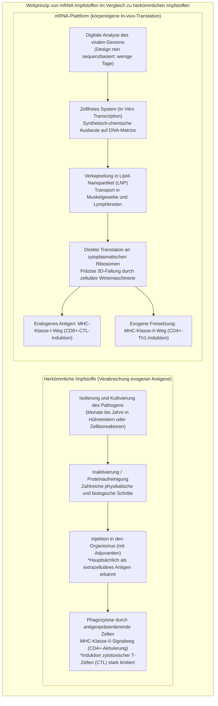
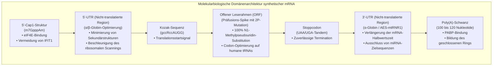
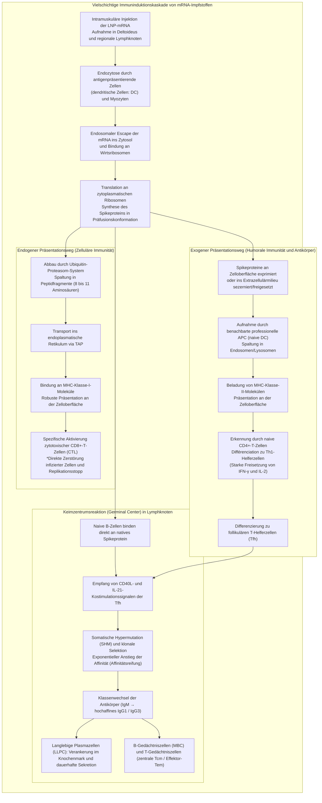
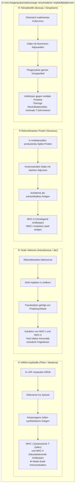

## Einleitung: Die mRNA-Revolution —— Wie ein «fragiles Molekül» die schnellste Impfstoffentwicklung der Menschheitsgeschichte ermöglichte

Im Januar 2020 wurde die vollständige Genomsequenz (rund 30.000 Nukleotide) von SARS-CoV-2 — dem Erreger einer neuartigen, im chinesischen Wuhan ausgebrochenen Atemwegsinfektion — online für die weltweite Forschungsgemeinschaft publiziert. Nur 42 Tage später lieferte das US-Biotech-Unternehmen Moderna die erste klinische Testcharge seines Impfstoffkandidaten «mRNA-1273» an die National Institutes of Health (NIH). Parallel dazu gelang dem deutsch-amerikanischen Konsortium aus BioNTech und Pfizer mit «BNT162b2» in einer beispiellosen Rekordzeit von lediglich elf Monaten der Abschluss groß angelegter klinischer Phase-III-Studien und die Erteilung der Notfallzulassung (EUA) — ein Meilenstein von historischer Dimension in der Geschichte der Pharmazie.

Die traditionelle Impfstoffentwicklung — sei es mit Lebendimpfstoffen, Inaktivaten oder rekombinanten Proteinen, die aufwändig in Hühnereiern oder gigantischen Zellkultur-Bioreaktoren herangezogen werden müssen — beanspruchte von der Isolierung des Pathogens über die Prozessoptimierung bis zur Sicherheitsüberprüfung üblicherweise **10 bis 15 Jahre** und verursachte astronomische Kosten. Diese Trägheit galt über Generationen hinweg als unverrückbares Gesetz der biomedizinischen Forschung.

Die mRNA-Technologie hat diese Dogmen grundlegend revidiert. Das Paradigma wandelte sich fundamental: Weg von einem «extern in industriellen Prozessen kultivierten und aufgereinigten Antigenprodukt», hin zu einer **«softwareartigen biotechnologischen Plattform, die den zellulären Maschinen des Wirtsorganismus vorübergehend den digitalen Bauplan des Antigens bereitstellt und den Körper selbst zur autologen Antigenfabrik macht»**.



### Die Vergänglichkeit der mRNA im Zentralen Dogma und die «Ausschließung genomischer Veränderungen»

Der in der Öffentlichkeit bisweilen geäußerten Befürchtung, «mRNA-Impfstoffe könnten das menschliche Erbgut (die DNA) verändern oder sich darin integrieren», setzt das fundamentale Prinzip der Molekularbiologie — das **Zentrale Dogma** — eine unmissverständliche wissenschaftliche Absage entgegen.

In eukaryotischen Zellen verläuft der Informationsfluss streng unidirektional und irreversibel: **DNA (Zellkern) → Transkription → mRNA (Export ins Zytosol) → Translation → Protein (Zytoplasma)**. Die verabreichte exogene mRNA gelangt ausschließlich ins Zellplasma, wo sie von den freien Ribosomen abgelesen wird, um das Spike-Protein zu synthetisieren, ohne jemals den Zellkern zu erreichen.
1. **Fehlen von Kernlokalisierungssignalen (NLS)**: Künstliche mRNA besitzt keine Signalsequenzen, die für das Passieren der Kernporenkomplexe notwendig wären; sie bleibt strikt im Zytosol arretiert.
2. **Abwesenheit von Reverser Transkriptase und Integrase**: Um RNA in DNA umzuschreiben und in das Wirtsgenom einzufügen, sind hochspezialisierte Enzyme wie die Reverse Transkriptase und Integrasen unerlässlich, die ausschließlich in Retroviren wie HIV vorkommen. Gesunde menschliche Körperzellen verfügen nicht über solche Aktivitäten (Laborexperimente unter extrem forcierten In-vitro-Bedingungen bezüglich des endogenen Retrotransposons LINE-1 lieferten keinerlei Nachweis für eine Genomintegration unter physiologischen In-vivo-Bedingungen).
3. **Rascher physiologischer Abbau**: mRNA ist ein naturgemäß instabiles Molekül; sie wird innerhalb von wenigen Stunden bis Tagen durch zelleigene Ribonukleasen (RNasen) restlos in einfache Nukleotide hydrolysiert und im zellulären Stoffwechsel recycelt.

Damit fungiert der mRNA-Impfstoff wie eine **«vergängliche, zeitlich limitierte Botschaft mit Selbstzerstörungsmechanismus nach erfolgter Proteinbiosynthese»**, was eine dauerhafte Veränderung der genomischen DNA prinzipiell ausschließt.

---

## Kapitel 1: Vierzig Jahre zähes Ringen und Durchbrüche —— Die Wissenschaftler, die mRNA in Medizin verwandelten

Die blitzschnelle Bereitstellung der Vakzinen im Jahr 2020 war keineswegs ein unerklärliches Wunder. Sie beruhte auf mehr als vier Jahrzehnten harter, unermüdlicher Grundlagenforschung von Wissenschaftlern, die trotz akademischer Skepsis und ständiger Mittelkürzungen an ihrer Vision festhielten. Die Verleihung des Nobelpreises für Physiologie oder Medizin 2023 an Dr. **Katalin Karikó** und Dr. **Drew Weissman** war die verdiente Krönung dieses wissenschaftlichen Langstreckenlaufs.

### 1.1 Die scheinbar unüberwindbare Barriere der frühen Forschung: Instabilität und letale Entzündungsreaktionen

Seit der Entdeckung der Messenger-RNA im Jahr 1961 durch François Jacob, Sydney Brenner und Kollegen träumten Molekularbiologen davon, durch Verabreichung von mRNA den Körper anzuweisen, beliebige therapeutische Proteine bedarfsgerecht selbst zu produzieren.

Die frühen Experimente in den 1980er und 1990er Jahren endeten jedoch allesamt in ernüchternden Rückschlägen. Zwei fundamentale Hürden blockierten den Fortschritt:
- **Extreme physikochemische Instabilität**: Lebende Gewebe, die Raumluft und die menschliche Haut sind dicht besiedelt von **Ribonukleasen (RNasen)** — hocheffizienten Enzymen, die darauf spezialisiert sind, virale RNA abzuwehren. Injizierte nackte mRNA (*Naked RNA*) wurde innerhalb von Millisekunden zersetzt, bevor sie überhaupt eine Zelle erreichen konnte.
- **Verheerende Entzündungsstürme des angeborenen Immunsystems**: Gelang es, größere Mengen unversehrter synthetischer mRNA in Tierversuche einzubringen, stufte das angeborene Immunsystem diese als hochgefährliche virale Invasion ein. Es kam zu massiven Zytokinstürmen, Schockzuständen und hoher Letalität bei Versuchstieren. Die Fachwelt stempelte mRNA daraufhin als «hoffnungslos toxisches Molekül ohne therapeutische Eignung» ab.

Während Karikó an der University of Pennsylvania mehrfach degradierte Karrierestufen hinnehmen musste und Fördergelder verlor, hielt die ungarische Biochemikerin unbeirrt an ihrem Glauben an das therapeutische Potenzial der RNA fest.

### 1.2 Die historische Entdeckung von Karikó und Weissman (2005): Tertiäre Uridin-Modifikation umgeht TLR-Sensoren

1997 traf Karikó auf den Immunologen Drew Weissman, der an der Entwicklung von HIV-Vakzinen forschte und die Antigenpräsentationskapazität dendritischer Zellen (DC) untersuchte. Beide schlossen sich zusammen, um die Wechselwirkung von mRNA und dendritischen Zellen systematisch zu entschlüsseln.

Ihre leitende Fragestellung lautete: **«Warum greift das Immunsystem körpereigene Transfer-RNA (tRNA) und ribosomale RNA (rRNA) nicht an, reagiert jedoch auf in vitro transkribierte mRNA (IVT-mRNA) mit einer verheerenden Entzündungsreaktion?»**.

Die Membranen und Endosomen von Säugetierzellen sind mit Sensoren des angeborenen Immunsystems ausgestattet — den **Toll-like-Rezeptoren (TLR)**:
- **TLR3**: Erkennt doppelsträngige RNA (dsRNA).
- **TLR7 / TLR8**: Detektieren uridinreiche einzelsträngige RNA (ssRNA).
- **RIG-I / MDA5**: Zytoplasmatische Wächtermoleküle, die 5'-Triphosphat-RNA oder lange RNA-Duplexe aufspüren und Typ-I-Interferone (IFN-α/β) induzieren.

Karikó und Weissman erkannten den entscheidenden Unterschied: Körpereigene eukaryotische RNA enthält eine Fülle **chemisch modifizierter Nukleoside** (Methylierungen, Isomerisierungen). Die klassische IVT-mRNA hingegen bestand ausschließlich aus den vier unmodifizierten Standardbasen (A, C, G, U).

2005 veröffentlichten sie eine epochale Arbeit: **Wurde das gewöhnliche Uridin (Uracil) bei der Synthese durch das natürlich vorkommende Isomer Pseudouridin (Ψ) ersetzt, sank die Erkennung durch TLR7, TLR8 und zytoplasmatische Sensoren drastisch. Die toxische Zytokinreaktion verschwand vollständig.**

### 1.3 Vom Pseudouridin zu «N1-Methylpseudouridin (m1Ψ)»

Der Durchbruch ging weit über die reine Unterdrückung von Entzündungsreaktionen hinaus: Die modifizierte mRNA zeigte eine um ein Vielfaches gesteigerte Translationseffizienz an den Ribosomen.

Dringt unmodifizierte Fremd-mRNA in die Zelle ein, aktivieren die angeborenen Sensoren unter anderem die **Proteinkinase R (PKR)** und die **2'-5'-Oligoadenylat-Synthetase (OAS)**. Die PKR phosphoryliert den Translationsinitiationsfaktor **eIF2α**, wodurch die zelluläre Proteinsynthese schlagartig stillgelegt wird. Parallel dazu aktiviert die OAS die **RNase L**, die sämtliche zelluläre RNA unselektiv abbaut.

Durch den Einbau von Pseudouridin werden diese Abwehrenzyme nicht alarmiert. Die Ribosomen können die mRNA ungehindert und wiederholt mit höchster Effizienz translatieren.

In den 2010er Jahren optimierten Forscher bei BioNTech und Moderna diesen Mechanismus weiter und etablierten **«N1-Methylpseudouridin (m1Ψ)»**, das an Position N1 des Pseudouridin-Rings methyliert ist.
- m1Ψ löst übermäßig starre Sekundärstrukturen auf, ohne die exakte Codon-Anticodon-Basenpaarung im Ribosom zu beeinträchtigen.
- Es senkt die Affinität zu TLR7/8 auf ein absolutes Minimum und steigert bei 100%igem Austausch der Uridine die Proteinausbeute in vivo maximal.
Sowohl BNT162b2 (Pfizer/BioNTech) als auch mRNA-1273 (Moderna) setzen auf diesen **vollständigen (100%igen) Austausch durch N1-Methylpseudouridin**.

### 1.4 Das Meisterstück der Proteinstabilisierung: Die «2P-Mutation» von Barney Graham und Jason McLellan

Neben der Nukleosidmodifikation und dem LNP-Transportsystem war die Stabilisierung der dreidimensionalen Struktur des Spikeproteins durch die **«2P-Mutation» (Substitution zweier aufeinanderfolgender Proline)** der dritte entscheidende wissenschaftliche Pfeiler des Erfolgs.

Das **Spike-(S)-Glykoprotein** auf der Oberfläche von SARS-CoV-2 bindet an den menschlichen ACE2-Rezeptor, um die Zellfusion einzuleiten. Dabei handelt es sich um eine metastabile molekulare Maschine mit zwei radikal unterschiedlichen Konformationen:
- **Präfusionskonformation (Prefusion Conformation)**: Die ursprüngliche trimere Form vor der Membranfusion. Hier ist die Rezeptorbindungsdomäne (RBD) optimal exponiert und bietet die Angriffsfläche für **hochpotente neutralisierende Antikörper**.
- **Postfusionskonformation (Postfusion Conformation)**: Der kollabierte, nadelartige Zustand nach erfolgter Fusion mit der Wirtszelle. Dagegen gerichtete Antikörper weisen nur eine extrem schwache Schutzwirkung auf.

Dr. **Barney Graham** (VRC des NIAID) und Dr. **Jason McLellan** (University of Texas at Austin) hatten durch Kryo-Elektronenmikroskopie an MERS-CoV und SARS-CoV-1 entdeckt, dass der gezielte Austausch zweier Aminosäuren an der Scharnierregion der zentralen Helix (Position 986 und 987, Lysin und Valin) gegen **zwei aufeinanderfolgende Proline (K986P und V987P)** den Übergang in die Postfusionsform sterisch blockiert und das **Protein starr in der Präfusionsform arretiert**.

Als im Januar 2020 die Genomdaten von SARS-CoV-2 publiziert wurden, transferierten die Forscher diesen 2P-Mechanismus unverzüglich auf das neuartige Coronavirus. Dadurch präsentierte der mRNA-geimpfte Körper dem Immunsystem exakt jene Konformation, die für die Bildung hochwirksamer neutralisierender Antikörper entscheidend ist.

---

## Kapitel 2: Präzisionsarchitektur des mRNA-Moleküls —— Design-Engineering synthetischer mRNA

Therapeutische mRNA ist kein triviales Duplikat viraler Sequenzen. Sie stellt ein **hochentwickeltes synthetisches Biopolymer (Engineered Biopolymer)** dar, dessen einzelne funktionelle Domänen optimiert wurden, um maximale Translationsraten zu erzielen und die Abbaukinetik präzise zu steuern.



### 2.1 Die 5'-Cap-Struktur (Von Cap0 zu Cap1): Zelleigene Erkennung und Translationsstart

Am 5'-Terminus eukaryotischer mRNA sitzt die charakteristische **7-Methylguanosin-Cap-Struktur (m7G-Cap)**. Im Kontext therapeutischer mRNA sind Reinheit und Methylierungsmuster dieser Kappe überlebenswichtig:
- **Cap0-Struktur (m7GpppN)**: Einfache Grundstruktur. Sie wird im Zytoplasma von höheren Wirbeltieren durch den antiviralen Sensor **IFIT1 (Interferon-induced protein with tetratricopeptide repeats 1)** als fremdartig erkannt und die Translation blockiert.
- **Cap1-Struktur (m7GpppNm)**: Besitzt eine zusätzliche 2'-O-Methylierung an der ersten Ribose nach der Kappe. Dies ist das physiologische Merkmal zelleigener Säugetier-mRNA, das der IFIT1-Detektion vollständig entgeht.

In den zugelassenen Impfstoffen gewährleisten moderne Co-Transkriptions-Reagenzien (wie CleanCap®) eine **Cap1-Reinheit von über 95%**. Dies ermöglicht die hochaffine Rekrutierung des Initiationsfaktorkomplexes **eIF4F (eIF4E, eIF4G, eIF4A)** und das rasche Beladen der ribosomalen 40S-Untereinheit.

### 2.2 Optimierung der untranslatierten 5'- und 3'-Regionen (UTR)

Die flankierenden, nicht protein-kodierenden Abschnitte — die **5'-UTR** und **3'-UTR** — regulieren die zelluläre Lokalisation, die Geschwindigkeit des ribosomalen Scannings und die Lebensdauer der mRNA.
- **5'-UTR-Engineering**: Starke Sekundärstrukturen (Haarnadelkurven oder G-Quadruplexe) wirken als Barrieren für wandernde Ribosomen. Daher verwendet man strukturarme Sequenzen hochgradig exprimierter humaner Gene, wie die der **α-Globin- oder β-Globin-mRNA**.
- **3'-UTR-Engineering**: Zur Verzögerung des Deadenylierungsabbaus und zum Schutz vor miRNA-vermitteltem Gen-Silencing werden Sequenzen gewählt, die frei von Bindestellen für endogene microRNAs sind (z. B. Kombinationen aus murinem α-Globin und mitochondrialen ribosomalen RNA-Fragmenten mtRNR1/AES).

### 2.3 Offener Leserahmen (ORF) und Codon-Optimierung

Der Leserahmen für das Spikeprotein wird einer bioinformatischen **Codon-Optimierung (Codon Optimization)** unterzogen.

Aufgrund der Degeneration des genetischen Codes kodieren mehrere synonyme Codons für dieselbe Aminosäure. Die Codon-Nutzung von SARS-CoV-2 weicht jedoch drastisch von den zellulären Präferenzen des menschlichen Zytoplasmas ab:
1. **Harmonisierung mit dem humanen tRNA-Pool**: Durch Ersetzen seltener Codons durch solche, die den am häufigsten vorkommenden humanen tRNAs entsprechen, werden ribosomale Wartezeiten eliminiert und die Elongationsrate maximiert.
2. **Steigerung des GC-Gehalts**: Ein höherer Anteil von Guanin und Cytosin stabilisiert das Molekül thermodynamisch und entfernt unerwünschte kryptische Spleißstellen sowie vorzeitige Polyadenylierungssignale.
3. **Minimierung doppelsträngiger RNA-Nebenprodukte (dsRNA)**: Bei der enzymatischen In-vitro-Transkription mittels T7-RNA-Polymerase können kleinste Mengen an dsRNA entstehen. Durch Sequenzdesign und chromatographische HPLC-Aufreinigung werden diese Spuren akribisch eliminiert.

### 2.4 Der Poly(A)-Schwanz (Poly-A Tail) und das «Closed-Loop-Modell»

Der homopolymere Adenin-Schwanz am 3'-Ende fungiert als biologische Zerfallsuhr der mRNA.
- Im Zytosol lagert sich das **Poly(A)-Bindeprotein (PABP)** an den Schwanz an.
- Durch Wechselwirkung von PABP mit dem am 5'-Cap gebundenen Faktor eIF4G formiert sich das Molekül zu einem ringförmigen Komplex, dem **«Closed-Loop-Modell»**.
- Diese zirkuläre Topologie schützt vor Exonukleasen und ermöglicht es Ribosomen, nach Erreichen des Stoppcodons direkt wieder an das 5'-Startcodon überzugehen. Ein einzelnes mRNA-Molekül kann so tausendfach hintereinander abgelesen werden. In den Formulierungen ist die Länge exakt auf 100 bis 120 Nukleotide kalibriert.

---

## Kapitel 3: Transportfähren durch biologische Barrieren —— Die Technologie der Lipid-Nanopartikel (LNP)

Selbst eine makellos konstruierte mRNA bliebe ohne ein Trägersystem medizinisch wirkungslos. Die ingenieurtechnische Schlüsseltechnologie, die den Einsatz von mRNA in der klinischen Praxis überhaupt erst ermöglichte, sind **Lipid-Nanopartikel (Lipid Nanoparticles: LNP)** mit einem Durchmesser von 80 bis 100 Nanometern.

### 3.1 Warum nackte mRNA (Naked RNA) nicht verabreicht werden kann

Wird ungeschützte mRNA direkt in den Muskel injiziert, verpufft die immunologische Wirkung fast vollständig. Dies liegt an zwei unüberwindbaren biologischen Hindernissen:
1. **Elektrostatische Abstoßung gleicher Ladungen**: Das Phosphodiester-Rückgrat der mRNA trägt eine hohe negative Ladungsdichte. Die Membran menschlicher Zellen ist aufgrund von Phospholipid-Kopfgruppen und Glykokalyx ebenfalls negativ geladen, was zu einer massiven elektrostatischen Abstoßung führt.
2. **Blitzartiger Abbau durch Gewebe-RNasen**: Im Interstitium zirkulierende Nukleasen bauen freie RNA in wenigen Minuten ab.

Es bedurfte somit eines «nanoskaligen Trojanischen Pferdes», das die Ladung neutralisiert, die Zellmembran überwindet und die mRNA intakt im Zytoplasma freisetzt.

### 3.2 Rolle und chemische Struktur der «vier goldenen Lipide» der LNP

Die LNP-Hüllen der zugelassenen Impfstoffe von Pfizer/BioNTech und Moderna basieren auf einer fein austarierten Mischung aus **vier spezifischen Lipidkomponenten**:

```
【Die 4 Hauptlipide der LNP-Formulierung】
1. Ionisierbares kationisches Lipid (Ionizable Cationic Lipid) 〜 46-50 mol%
2. Helfer-Phospholipid (Helper Lipid: DSPC) 〜 10 mol%
3. Cholesterin (Cholesterol) 〜 38-43 mol%
4. PEGyliertes Lipid (PEGylated Lipid) 〜 1,5-1,7 mol%
```

| Lipidkomponente | Eingesetztes Molekül (Pfizer / Moderna) | Molanteil (mol%) | Physikochemische Eigenschaften | Essenzielle biologische Funktion in vivo |
| :--- | :--- | :--- | :--- | :--- |
| **Ionisierbares Lipid<br/>(Ionizable Lipid)** | **ALC-0315** (Pfizer)<br/>**SM-102** (Moderna) | **~ 46 bis 50%** | Scheinbarer pKa-Wert von **6,0 bis 6,8**. Im Sauren positiv geladen, bei neutralem pH ungeladen. Enthält tertiäre Amine und biologisch abbaubare Esterbindungen. | ① Bindet bei saurem pH elektrostatisch die anionische mRNA und kondensiert sie im Kern.<br/>② Wird bei physiologischem Blut-pH (7,4) ladungsneutral, wodurch Hämolyse und Zytotoxizität vermieden werden.<br/>③ Protoniert im sauren Endosom erneut, destabilisiert die Membran und vermittelt den Escape. |
| **Helfer-Phospholipid<br/>(Helper Lipid)** | **DSPC**<br/>(1,2-Distearoyl-sn-glycero-3-phosphocholin) | **~ 10%** | Gesättigtes Phospholipid mit hoher Phasenübergangstemperatur (~55 °C). Zylindrische Geometrie. | Bildet eine stabile lamellare Lipiddoppelschicht an der LNP-Peripherie und verleiht der Nanopartikelhülle mechanische Steifigkeit und Formstabilität. |
| **Cholesterin<br/>(Cholesterol)** | Hochreines Cholesterin pflanzlichen Ursprungs | **~ 38 bis 43%** | Starres Steroidgerüst mit kleiner polarer Hydroxylgruppe. Membranpacker. | Füllt Hohlräume zwischen Phospholipiden, optimiert Membranfluidität und Phasenverhalten. Fördert die Membranfusion mit Wirtszellen und verhindert Leckagen. |
| **PEGyliertes Lipid<br/>(PEGylated Lipid)** | **ALC-0159** (Pfizer)<br/>**PEG2000-DMG** (Moderna) | **~ 1,5 bis 1,7%** | Hydrophile Polyethylenglykol-Kette, konjugiert an Lipidanker (Dimyristylglycerol). | ① Verhindert Aggregation während Herstellung und Lagerung, fixiert die Partikelgröße (~80 nm).<br/>② Verhindert unselektive Opsonierung durch Serumproteine, verlängert Zirkulationszeit.<br/>③ Dissoziiert in vivo langsam ab, um zelluläre Aufnahme zu ermöglichen. |

### 3.3 Endozytose und das Phänomen des endosomalen Escape (Endosomal Escape)

Nach der intramuskulären Injektion stellt der **endosomale Escape (Endosomenflucht)** ins Zytosol die kritischste Hürde dar:

1. **Apolipoprotein-Adsorption und Aufnahme**:
   Im Gewebe binden die LNP körpereigenes **Apolipoprotein E (ApoE)** an ihrer Oberfläche. Über **Low-Density-Lipoprotein-Rezeptoren (LDLR)** auf dendritischen Zellen, Makrophagen und Muskelzellen werden sie per rezeptorvermittelter Endozytose in Endosomen aufgenommen.
2. **Endosomale Ansäuerung**:
   Während der Reifung vom frühen zum späten Endosom pumpen V-ATPasen Protonen ($H^+$) in das Vesikelinnere, wodurch der pH-Wert von 7,4 auf unter 5,5 absinkt.
3. **Ladungsumkehr und Protonenschwamm-Effekt**:
   Durch das Unterschreiten ihres pKa-Wertes (6,0-6,8) nehmen die ionisierbaren Lipide massiv Protonen auf und wandeln sich von neutralen Molekülen in **stark kationische Spezies** um.
4. **Membranfusion und zytoplasmatische Freisetzung**:
   Die positiv geladenen Lipide interagieren mit den negativ geladenen Lipiden der inneren Endosomenwand (wie Phosphatidylserin). Dies erzwingt einen Phasenübergang in eine nicht-lamellare Struktur — die sogenannte **inverse hexagonale Phase ($H_{II}$)**. Es entstehen Poren in der Endosomenmembran, durch die die **mRNA unversehrt ins Zytosol geschleust** wird, wo sie unmittelbar von Ribosomen gebunden werden kann.

Nanobiologische Studien zeigen, dass tatsächlich nur etwa **2% bis 15%** der internalisierten mRNA dem Endosom entkommen. Aufgrund der Translationspotenz der optimierten Moleküle reicht diese Quote jedoch vollkommen aus, um eine massive Antigenproduktion und Immunisierung zu triggern.

### 3.4 Mikrofluidische Formulierungstechnologie (Microfluidic Formulation)

Die industrielle Großproduktion hochgradig monodisperser Partikel gelang durch den Durchbruch der **Mikrofluidik (Microfluidics)**.

Herkömmliche mechanische Emulsionsverfahren lieferten ungleichmäßige Partikelgrößen und geringe Einschlussraten. Moderne Produktionsanlagen nutzen Mikrofluidik-Chips mit winzigen Kanälen, in denen eine **ethanolische Lipidphase** und eine **saure wässrige mRNA-Pufferlösung** mit kontrollierten Flussgeschwindigkeiten von mehreren Metern pro Sekunde aufeinandertreffen.

Durch die schlagartige Verdünnung des Ethanols sinkt die Lipidlöslichkeit abrupt, was eine spontane molekulare Selbstorganisation induziert. Die protonierten ionisierbaren Lipide kondensieren mit der mRNA zu einem Kern, während sich DSPC, Cholesterin und PEG an der Außenseite anordnen. In Millisekunden entstehen Partikel von 80 bis 100 nm Durchmesser mit einer **Verkapselungseffizienz von über 90%** und extrem enger Größenverteilung (PDI < 0,1).

---

## Kapitel 4: Die vielschichtige Immunkaskade —— Von der zytoplasmatischen Translation zur systemischen Immunität

Der entscheidende Vorteil von mRNA-Impfstoffen gegenüber Tot- oder Proteinimpfstoffen liegt in der **dualen Antigenpräsentation (parallele Aktivierung der MHC-Klasse-I- und MHC-Klasse-II-Signalwege)**.



### 4.1 Aufnahme im Muskelgewebe und Transport in regionale Lymphknoten

Nach Injektion in den Musculus deltoideus wandert ein Großteil der LNP binnen weniger Stunden über die Lymphbahnen in die ableitenden axillären Lymphknoten.
- Während lokale Skelettmuskelzellen ebenfalls mRNA aufnehmen und Spikeproteine exprimieren, fungieren **professionelle antigenpräsentierende Zellen (APC)** — dendritische Zellen (DC) und Lymphknotenmakrophagen — als Haupttreiber der adaptiven Immunreaktion.
- Im Zytoplasma dieser Zellen wird das Protein mit authentischen humanen posttranslationalen Modifikationen (Glykosylierung und Disulfidbrücken) gefaltet und als nativer Trimerkomplex an der Zelloberfläche dargeboten.

### 4.2 Der MHC-Klasse-I-Weg und die potente Induktion zytotoxischer T-Zellen (CD8+ CTL)

Herkömmliche Proteinimpfstoffe führen Antigene von außen zu. Sie aktivieren fast ausschließlich den MHC-II-Weg und sind kaum in der Lage, **zytotoxische CD8+-T-Zellen (Killer-T-Zellen / CTL)** zu induzieren, die infizierte Wirtszellen gezielt aufspüren und eliminieren.

Die mRNA-Technologie durchbricht diese Limitierung, da das Antigen **direkt im Zytoplasma entsteht**:
1. **Proteasomaler Abbau**: Ein Teil der synthetisierten Spikeproteine wird ubiquitiniert und durch das zelluläre **Proteasom** in Peptide von 8 bis 11 Aminosäuren gespalten.
2. **TAP-Translokation**: Diese Peptidfragmente werden über den **TAP-Transporter** aktiv in das endoplasmatische Retikulum befördert.
3. **Beladung auf MHC-Klasse-I-Moleküle**: Die Fragmente binden in die Peptidfurche neu gebildeter **MHC-Klasse-I-Komplexe (HLA-A, HLA-B, HLA-C)** und werden über den Golgi-Apparat an die Zelloberfläche transportiert.
4. **Priming zytotoxischer T-Zellen**: Naive CD8+-T-Zellen im Lymphknoten erkennen diese Komplexe über ihren T-Zell-Rezeptor (TCR). Gekoppelt mit Kostimulationssignalen (CD80/CD86 an CD28) proliferieren sie massiv zu **zytotoxischen Effektor-T-Zellen (CTL)**.

Diese robuste CTL-Antwort bildete das entscheidende immunologische Auffangnetz, das Hospitalisierungen und Todesfälle verhinderte, selbst als Antikörper gegen neue Virusvarianten ihre Neutralisationskraft verloren hatten.

### 4.3 Der MHC-Klasse-II-Weg und die Induktion von Th1-Helferzellen

Parallel dazu wird das synthetisierte Spikeprotein sezerniert oder beim physiologischen Zelluntergang freigesetzt:
- Unreife dendritische Zellen nehmen das extrazelluläre Protein per Endozytose auf und zerlegen es in lysosomalen Kompartimenten in Peptide von 13 bis 18 Aminosäuren.
- Diese werden auf **MHC-Klasse-II-Moleküle (HLA-DR, DQ, DP)** geladen und naiven CD4+-T-Zellen präsentiert.
- Begünstigt durch die intrinsischen Adjuvanswirkungen der LNP differenzieren diese Zellen primär zu **Th1-Zellen (T-Helfer-1)**, die große Mengen IFN-γ und IL-2 ausschütten. Diese strikte Th1-Polarisierung verhinderte allergische Th2-Fehlreaktionen und Infiltrationen von Eosinophilen.

### 4.4 Formierung langlebiger Keimzentren (Germinal Centers) und B-Zell-Affinitätsreifung

Der herausragende immunologische Aspekt von mRNA-Vakzinen ist die langanhaltende Induktion funktioneller **Keimzentren (Germinal Centers: GC)** in den Lymphknoten:
1. **Erkennung des nativen Antigens**: Follikuläre naive B-Zellen binden über ihren B-Zell-Rezeptor (BCR) direkt an die unversehrten 3D-Spiketrimere dendritischer Zellen.
2. **Unterstützung durch follikuläre T-Helferzellen (Tfh)**: Im Keimzentrum erhalten die B-Zellen essenzielle Überlebens- und Selektionssignale über CD40L und Interleukin-21 (IL-21) von Tfh-Zellen.
3. **Somatische Hypermutation (SHM) und Selektion**:
   - In der dunklen Zone (Dark Zone) führt das Enzym AID (*Activation-Induced Cytidine Deaminase*) gezielte Punktmutationen mit enormer Frequenz in die variablen Antikörpergene ein.
   - In der hellen Zone (Light Zone) konkurrieren die B-Zell-Klone um die Bindung an Spikeproteine auf follikulären dendritischen Zellen (FDC).
   - Nur B-Zellen, deren Mutationen die Affinität zum Spikeprotein signifikant steigern, erhalten Überlebenssignale; Klone mit schwacher Bindung sterben durch Apoptose.
4. **Isotypenwechsel und Gedächtniszellen**:
   - Nach erfolgreichem Klassenwechsel zu **hochaffinen IgG-Antikörpern (vor allem IgG1 und IgG3)** differenzieren sich B-Zellen zu **langlebigen Plasmazellen (LLPC)**, die ins Knochenmark abwandern und über Monate hinweg Antikörper sezernieren.
   - Andere Klone formieren den Pool der **B-Gedächtniszellen (MBC)**, die bei erneutem Antigenkontakt rasch reaktiviert werden.

Biopsiestudien an menschlichen Lymphknoten bewiesen, dass die durch mRNA-Impfung induzierten Keimzentren **über mehr als sechs Monate aktiv blieben** — eine bemerkenswerte Beständigkeit für eine nicht-replizierende Vakzine.

---

## Kapitel 5: Klinische Evidenz, Schutzwirkung im Zeitverlauf und Evolution der Varianten

### 5.1 Ergebnisse der Phase-III-Zulassungsstudien: Der 95%-Wirksamkeitsschock

Ende 2020 versetzten die im *New England Journal of Medicine (NEJM)* publizierten Phase-III-Ergebnisse von Pfizer/BioNTech (Polack et al.) und Moderna (Baden et al.) die medizinische Fachwelt in Erstaunen:
- **BNT162b2 (Pfizer/BioNTech, 43.448 Probanden)**: 162 COVID-19-Fälle in der Placebogruppe standen lediglich 8 Fällen in der Impfgruppe gegenüber, was einer **Schutzwirkung von 95,0% (95%-KI: 90,3–97,6%)** entsprach. Bei schweren Verläufen traten 9 Fälle unter Placebo und nur 1 Fall in der Verumgruppe auf.
- **mRNA-1273 (Moderna, 30.420 Probanden)**: 185 symptomatische Erkrankungen unter Placebo (davon 30 schwere Verläufe, 1 Todesfall) standen 11 Erkrankungen unter Verum (0 schwere Verläufe) gegenüber. Dies belegte eine **Wirksamkeit von 94,1% (95%-KI: 89,3–96,8%)** und 100% Schutz vor schwerem Verlauf.

Angesichts der Tatsache, dass FDA und WHO vorab eine Wirksamkeitsgrenze von 50% gefordert hatten und Grippeimpfstoffe üblicherweise bei 40% bis 60% liegen, übertraf ein Schutz von 95% selbst optimistischste Prognosen bei Weitem.

### 5.2 Statistische Differenzierung: Relative Risikoreduktion (RRR) vs. Absolute Risikoreduktion (ARR)

In öffentlichen Debatten wurde bisweilen argumentiert, «95% sei lediglich eine relative Risikoreduktion (RRR), während die absolute Risikoreduktion (ARR) unter 1% liege und der Impfstoff daher kaum wirke».

Hier gilt es, die biostatistischen Grundlagen präzise einzuordnen:
- **RRR (Relative Risikoreduktion)**: Vergleicht die Inzidenz in der Placebogruppe ($I_p$) mit der Inzidenz in der Impfgruppe ($I_v$).
  $$RRR = \frac{I_p - I_v}{I_p} \times 100\% = \frac{0,0088 - 0,0004}{0,0088} \approx 95\%$$
  Dieser Wert misst die **intrinsische biologische Schutzpotenz** des Impfstoffs bei Virusexposition.
- **ARR (Absolute Risikoreduktion)**: Differenz der beobachteten Erkrankungsraten in der gesamten Studienpopulation über den kurzen Beobachtungszeitraum.
  $$ARR = I_p - I_v \approx 0,88\% - 0,04\% = 0,84\%$$
- **Epidemiologische Realität**:
  Die ARR hängt direkt von der **Hintergrundinzidenz (Infektionsgeschehen in der Gesellschaft)** während der Studie ab. Testet man einen perfekten Impfstoff bei extrem niedriger Virusverbreitung, liegt die ARR mathematisch immer unter 1%. Kommt es jedoch zu einer Infektionswelle, bei der 20% der Bevölkerung exponiert werden, springt die ARR auf $20\% \times 95\% = 19\%$. Eine niedrige ARR als Unwirksamkeit zu interpretieren, verkennt die Trennung zwischen biologischer Schutzwirkung und Umgebungsrisiko.

### 5.3 Real-World Evidence (RWE): Daten auf nationaler Ebene

Die Ausrollung auf zig Millionen Menschen — insbesondere in **Israel (Clalit-Kohorte mit 1,2 Millionen gematchten Probanden, Dagan et al., NEJM 2021)**, Großbritannien (UKHSA) und den USA (CDC) — bestätigte fundamentale Prinzipien:
1. **Beherrschung der Ursprungsvarianten**: Gegenüber dem Wildtyp und Alpha lag die Schutzwirkung gegen Infektion auch im Alltag bei über 90% und gegen Hospitalisierung bei über 95%.
2. **Kinetischer Abfall des Schutzes vor milden Infektionen**: Nach 4 bis 6 Monaten sank der Schutz vor symptomatischen Verläufen parallel zum natürlichen Titerabfall zirkulierender Antikörper auf 60% bis 70%.
3. **Robuste Persistenz gegen schwere Verläufe**: Der Schutz vor Hospitalisierung, Beatmung und Tod blieb langfristig auf einem Niveau von über 85% bis 90% stabil. Dies belegt, dass selbst bei sinkenden Antikörperspiegeln die B-Gedächtniszellen rasch reagieren und **zytotoxische CD8+-T-Zellen** die pulmonale Virusausbreitung wirkungsvoll stoppen.

### 5.4 Mutationswellen und Immune Escape: Antikörperabfall vs. T-Zell-Robustheit

Mit der globalen Zirkulation von SARS-CoV-2 akkumulierten Mutationen, die Antikörpern zunehmend entwichen.

| Virusvariante | Schlüsselmutationen (RBD / Spike) | Neutralisationsempfindlichkeit | Infektionsschutz (2 Dosen) | Schutz vor schwerem Verlauf (2 Dosen) | Effekt von Booster-Impfungen |
| :--- | :--- | :--- | :--- | :--- | :--- |
| **Wuhan-Wildtyp<br/>(Wuhan-Hu-1)** | Referenzstamm (keine Mutationen) | **1,0-fach** (Referenz) | **~ 95%** | **> 95%** | Starker Titeranstieg über Ausgangsniveau |
| **Alpha-Variante<br/>(Alpha: B.1.1.7)** | N501Y, P681H | **Leichte Reduktion (1,5 - 2x)** | **~ 85 - 90%** | **~ 95%** | Hoher Schutz auf allen Ebenen bewahrt |
| **Delta-Variante<br/>(Delta: B.1.617.2)** | L452R, T478K, P681R | **3- bis 6-fach reduziert** | **~ 60 - 75%** (sinkt über Zeit) | **~ 90%** | Booster stellt Schutz vor Erkrankung auf >85% wieder her |
| **Omikron BA.1 / BA.2<br/>(Frühes Omikron)** | >15 Mutationen in RBD<br/>(K417N, E484A, N501Y etc.) | **Drastischer Abfall (20- bis 40-fach)** | **~ 20 - 40%** (deutlich reduziert nach 2 Dosen) | **~ 70 - 80%** (durch T-Zellen stabilisiert) | Booster hebt Schutz vor Symptomen auf 65-75%, vor schwerem Verlauf auf >90% |
| **Omikron BA.4 / BA.5<br/>und XBB / JN.1** | L452R, F486V/P, R346T<br/>Extremer humoraler Escape | **Weitgehender Verlust initialer Bindung** | **Nahezu erloschen gegen Ansteckung** | **~ 60 - 70%** (durch Basisimmunität gesichert) | Angepasste bivalente oder monovalente Vakzinen (XBB.1.5/JN.1) reaktivieren Antikörper und heben schweren Schutz auf >80% |

Das Auftreten von Omikron markierte eine Zäsur zwischen Infektionsschutz und Schutz vor schweren Krankheitsverläufen. Über 30 Mutationen im Spikeprotein führten dazu, dass Antikörper kaum noch banden.

Hier zeigte sich die **überragende Widerstandskraft der zellulären T-Zell-Immunität**:
- Neutralisierende Antikörper binden an konformationelle Oberflächenepitope; kleine Strukturverschiebungen lassen die Bindung kollabieren.
- T-Zellen erkennen hingegen **kurze lineare Peptidfragmente**, die über das gesamte Protein verteilt sind.
- Da Menschen ein individuell hochvariables HLA-Repertoire besitzen, ist es evolutionsbiologisch unmöglich, dass das Virus allen T-Zell-Epitopen gleichzeitig entkommt.
- Internationale Studien zeigten, dass **80% bis 90% der T-Zell-Epitope auch in Omikron-Sublinien intakt blieben**. Dies verhinderte die Überlastung der Intensivstationen in geimpften Gesellschaften während der Omikron-Wellen.

### 5.5 Booster-Impfungen und Anpassung der Impfstoffsequenzen

Angesichts des Titerabfalls und neuer Varianten bewies die mRNA-Plattform ihre **hohe Agilität**:
1. **Homologe Booster (3. Dosis)**: Eine Auffrischung mit dem Originalimpfstoff reaktivierte Keimzentren und führte durch erneute Affinitätsreifung zu kreuzneutralisierenden Antikörpern gegen Omikron.
2. **Bivalente Impfstoffe**: Mischungen im Verhältnis 1:1 aus Wildtyp-mRNA und Omikron-mRNA (BA.1 oder BA.4/5) erweiterten das Antikörperspektrum.
3. **Monovalent angepasste Impfstoffe (XBB.1.5, JN.1)**: Um immunologische Prägungen (*Antigenic Imprinting*) zu minimieren, wurde auf die Wildtyp-Komponente verzichtet. Da lediglich die digitale DNA-Vorlage angepasst werden musste, waren neue Chargen in 8 bis 10 Wochen herstellbar.

---

## Kapitel 6: Sicherheitsprofil, Pathophysiologie von Nebenwirkungen und Nutzen-Risiko-Bewertung

Wie jede medizinische Intervention unterliegen auch mRNA-Impfstoffe einer differenzierten Nutzen-Risiko-Abwägung. Eine wissenschaftlich fundierte Analyse erfordert die exakte Aufarbeitung der Pathophysiologie unerwünschter Ereignisse.

### 6.1 Lokale und systemische Reaktogenität: Der physiologische Preis der Immunaktivierung

Häufige lokale Symptome (Schmerzen, Schwellung, Rötung an der Einstichstelle) sowie systemische Reaktionen (Fieber ≥38 °C, Abgeschlagenheit, Kopfschmerzen, Schüttelfrost, Muskel- und Gelenkschmerzen) sind kein Ausdruck toxischer Zellzerstörung, sondern die **physiologische Manifestation der anspringenden angeborenen Immunantwort**:
- LNP-Komponenten und Antigene stimulieren Makrophagen und dendritische Zellen zur transienten Freisetzung von **IL-1β, IL-6, TNF-α und Typ-I-Interferonen**.
- Diese Botenstoffe erreichen über das Blut das Temperaturzentrum im Hypothalamus und lösen Fieber sowie Muskelkater aus.
- Die Symptome klingen typischerweise innerhalb von 24 bis 48 Stunden ab und sprechen gut auf Analgetika wie Paracetamol oder Ibuprofen an.

### 6.2 Myokarditis und Perikarditis: Epidemiologie und pathophysiologische Mechanismen

Weltweite Pharmakovigilanz-Netzwerke (VAERS in den USA, Daten des israelischen Gesundheitsministeriums, europäische Register) identifizierten ein seltenes Risiko für **Myokarditis und Perikarditis**, primär bei **jungen Männern und Adoleszenten (12 bis 29 Jahre)**, typischerweise 2 bis 4 Tage nach der zweiten Dosis.

#### ① Epidemiologische Inzidenz
- Insgesamt liegt die Häufigkeit bei lediglich **1 bis 5 Fällen pro 100.000 Dosen**.
- In der Hochrisikogruppe (**männliche Jugendliche von 16 bis 19 Jahren nach Dosis 2**) liegt die Rate bei etwa **10 bis 15 Fällen pro 100.000 Dosen (0,01%)**.
- Bei Moderna (100 µg mRNA) trat dieses Ereignis etwas häufiger auf als bei Pfizer (30 µg), weshalb viele Staaten für Personen unter 30 Jahren vorzugsweise den Pfizer-Impfstoff empfahlen.

#### ② Postulierte molekulare Mechanismen
Drei Mechanismen stehen im Fokus der Forschung:
1. **Freies Spikeprotein und Immunkomplexe**: Yonker et al. (*Circulation* 2023) wiesen bei betroffenen Jugendlichen ungebundenes, freies Spikeprotein im Plasma nach, das endotheliale und myokardiale Immunrezeptoren überaktivieren könnte.
2. **Einfluss von Sexualhormonen**: Testosteron fördert Th1-Reaktionen und entzündliche Makrophagen, während Östrogene kardioprotektiv und antiinflammatorisch wirken.
3. **Vorübergehende Autoimmunität**: Bildung transienter Autoantikörper gegen kardiale Proteine wie α-Myosin.

#### ③ Klinischer Verlauf und Vergleich mit SARS-CoV-2-Infektionen
Zwei Tatsachen sind klinisch entscheidend:
- **Über 90% der impfassoziierten Myokarditiden verlaufen mild** und heilen unter Schonung und NSAR-Gabe innerhalb weniger Tage bis Wochen ohne bleibende Funktionseinschränkungen aus.
- **Das Risiko kardialer Schäden (Myokarditis, Rhythmusstörungen, Herzversagen) durch eine echte SARS-CoV-2-Infektion ist um ein Vielfaches höher** als das Impfrisiko. Die Zulassungsbehörden (CDC, EMA, STIKO) bestätigten einhellig das positive Nutzen-Risiko-Verhältnis der Impfung.

### 6.3 Anaphylaxie und PEG-Allergie

Schwere Sofortreaktionen (Anaphylaxie) treten mit einer Inzidenz von **2 bis 5 Fällen pro Million Dosen** auf — etwas häufiger als bei Influenza-Impfstoffen (~1 pro Million), aber extrem selten.
- Auslöser ist meist das in den LNP enthaltene **PEG2000 (Polyethylenglykol)**, das über präexistierende Anti-PEG-IgE-Antikörper oder komplementvermittelte Pseudoallergien (CARPA) Mastzellen aktiviert.
- Eine Vorbehandlung oder Sensibilisierung erfolgt oft unbemerkt über Kosmetika oder Abführmittel.
- Durch eine Nachbeobachtungszeit von 15 bis 30 Minuten und prompte Gabe von Adrenalin intramuskulär heilten alle Fälle ohne Folgeschäden aus.

### 6.4 Mechanistische Differenzierung zu Vektorimpfstoffen (TTS / VITT)

Bei adenoviralen Vektorimpfstoffen (AstraZeneca und Johnson & Johnson) traten schwerste **Thrombosen mit Thrombozytopenie-Syndrom (TTS / VITT)** auf.
- **Mechanismus von VITT**: Proteine des Adenovirus-Kapsids bilden Komplexe mit dem Plättchenfaktor 4 (PF4), was zu HIT-ähnlichen Autoantikörpern und disseminierter intravasaler Gerinnung führt.
- **Sicherheit der mRNA**: mRNA-Impfstoffe enthalten keine Viruskapside und interagieren nicht mit PF4. **Ein VITT/TTS-Risiko existiert bei mRNA-Impfstoffen nicht**.

### 6.5 Untersuchung zu ADE (Antibody-Dependent Enhancement) und VAED

Frühere Impfstoffversuche gegen Dengue oder RSV (FI-RSV) in den 1960er Jahren waren von Phänomenen wie **ADE** oder **VAED (Vaccine-Associated Enhanced Disease)** überschattet, bei denen subneutralisierende Antikörper das Virus in Makrophagen einschleusten oder schwere allergische Th2-Pneumonien verursachten.

Bei COVID-19-mRNA-Impfstoffen **wurde bei Milliarden verabreichter Dosen weltweit kein einziges Anzeichen von ADE oder VAED beobachtet**. Die molekularen Gründe sind:
1. **Hochaffine Neutralisation durch 2P-Mutation**: Die stabilisierte Präfusionskonformation lenkt die B-Zell-Antwort gezielt auf sterile Neutralisation.
2. **Reine Th1-Polarisierung**: Die LNP-mRNA-Kombination induziert robuste Th1-Zellen und blockiert allergische Th2-Reaktionen vollständig.

| Unerwünschtes Ereignis | Häufigkeit | Typischer Zeitpunkt | Vorherrschender Mechanismus | Verlauf und therapeutisches Management |
| :--- | :--- | :--- | :--- | :--- |
| **Lokale Reaktionen** (Schmerz, Schwellung) | **70 bis 85%** (sehr häufig) | Tag 0 bis Tag 2 | Lokale Zytokin- und Neutrophilen-Infiltration (IL-1, TNF) | Spontane Besserung in 1-3 Tagen. Kühlung, Analgetika. |
| **Systemische Reaktionen** (Fieber, Fatigue) | **50 bis 70%** (häufig, mehr bei Dosis 2) | 12 bis 24 Stunden post-inj. | Zirkulierendes IL-6 und IFN-I stimulieren Hypothalamus | Abklingen in 24-48 Stunden. Paracetamol oder Ibuprofen. |
| **Myokarditis / Perikarditis** | **1 bis 5 pro 100.000** (10-15/100.000 bei jungen Männern) | 2 bis 4 Tage nach Dosis 2 | Freies Spike-Protein, hormonelle Verstärkung, transiente Autoimmunität | **>90% mild**. Rasche Ausheilung unter NSAR und Schonung. |
| **Anaphylaxie** | **2 bis 5 pro Million** (extrem selten) | Minuten bis 30 min | IgE- oder CARPA-vermittelte Reaktion auf PEG2000 | Sofortige Adrenalin-Gabe i.m.; vollständige Remission. |
| **Guillain-Barré-Syndrom** | **Auf Niveau der Hintergrundinzidenz** | Wochen später | Autoantikörper gegen Myelinscheiden (nur bei Vektorimpfstoffen erhöht, bei mRNA widerlegt) | Intravenöse Immunglobuline (IVIg) oder Plasmapherese. |

---

## Kapitel 7: Systematischer Vergleich biotechnologischer Impfstoffplattformen

Die COVID-19-Pandemie diente als globaler Prüfstand, auf dem die führenden Impfstofftechnologien direkt miteinander verglichen werden konnten.



### 7.1 mRNA vs. Virale Vektoren (DNA-basierte Plattformen)

Vektorvakzinen nutzen modifizierte Adenoviren, um das Spike-Gen (DNA) in den Zellkern zu schleusen:
- **Vorteile**: DNA ist thermisch stabil; Lagerung bei Kühlschranktemperaturen (2 °C bis 8 °C).
- **Struktureller Nachteil (Anti-Vektor-Immunität)**: Der Körper bildet neutralisierende Antikörper gegen das Trägervirus selbst. Folgedosen werden abgefangen, bevor sie DNA abliefern können. Zudem traten VITT-Thrombosen auf.
- mRNA-LNP besitzen keine viralen Proteinkapside: **Booster können beliebig oft ohne Wirksamkeitsverlust verabreicht werden**.

### 7.2 mRNA vs. Rekombinante Proteinimpfstoffe

Beispielhaft vertreten durch Novavax (NVX-CoV2373): Spikeproteine werden in Insektenzellen produziert, aufgereinigt und mit Saponin-Adjuvantien (Matrix-M™) verabreicht.
- **Vorteile**: Etablierte Technologie mit exzellenter Verträglichkeit.
- **Nachteile**: Monatelange Zellfermentation und Aufreinigung; extrem langsame Reaktionszeit bei neuen Virusvarianten.

### 7.3 mRNA vs. Totimpfstoffe

Hergestellt durch Virusvermehrung in Vero-Zellen und Inaktivierung mittels β-Propiolacton (Sinovac, Sinopharm).
- **Vorteile**: Enthält alle Strukturproteine des Virions.
- **Nachteile**: Niedrige Neutralisationstiter, rascher Wirkungsabfall, kaum messbare zytotoxische T-Zell-Antwort. Geringer Schutz vor Omikron und Erfordernis von BSL-3-Produktionsanlagen.

### 7.4 Produktionsprozesse, Logistik und thermodynamische Grenzen der Kühlkette

Die Achillesferse der mRNA-Vakzinen war anfangs die **Tiefstkühlkette (-80 °C bis -20 °C)**:
- **Biophysikalischer Hintergrund**: In wässriger Lösung neigt die 2'-OH-Gruppe der Ribose zur internen Autohydrolyse der Phosphodiesterbindung. Zudem können Lipide ohne Kältestabilisierung oxidieren oder aggregieren.
- Dies erforderte Trockeneis-Transporte bei **-80 °C bis -60 °C** (Pfizer) bzw. **-20 °C** (Moderna).
- **Überragender industrieller Vorteil**: Durch die zellfreie enzymatische In-vitro-Synthese können hunderte Millionen Dosen in kleinen Reaktoren innerhalb weniger Tage hergestellt werden — ein Quantensprung an Skalierbarkeit gegenüber Fermentern.

| Vergleichsparameter | ① mRNA-Impfstoffe | ② Virale Vektoren | ③ Rekombinante Proteine | ④ Totimpfstoffe |
| :--- | :--- | :--- | :--- | :--- |
| **Referenzprodukte** | **Pfizer (BNT162b2)<br/>Moderna (mRNA-1273)** | AstraZeneca (ChAdOx1)<br/>J&J (Ad26.COV2.S) | Novavax (NVX-CoV2373)<br/>Daiichi Sankyo (Daichirona) | Sinovac (CoronaVac)<br/>Sinopharm (BBIBP) |
| **Antigenformat** | In LNP verpackte mRNA | DNA in Adenovirusvektor | Rekombinantes Proteinpartikel | Chemisch inaktiviertes Ganzvirus |
| **Ort der Biosynthese** | **Zytoplasma des Wirts (endogen)** | Zellkern und Zytoplasma des Wirts | Externe Bioreaktoren (Insekten-/CHO) | Externe Bioreaktoren (Vero-Zellen) |
| **Neutralisationstiter** | **Extrem hoch (Referenzniveau)** | Moderat bis hoch | Hoch | Niedrig bis moderat |
| **CD8+-CTL-Induktion** | **Sehr stark (MHC-I-Weg)** | Stark | Sehr schwach (Kreuzpräsentation) | Praktisch nicht vorhanden |
| **Anpassungsdauer** | **Kürzeste (wenige Wochen)** | Mittel (2 bis 4 Monate) | Lang (6 bis 12 Monate) | Sehr lang (>6 Monate) |
| **Hauptnebenwirkungen** | Fieber, Schmerz, seltene Myokarditis | Fieber, seltenes VITT/TTS-Risiko | Lokalschmerz, milde Fatigue | Sehr milde Lokalreaktionen |
| **Lagertemperatur** | **-80 °C bis -20 °C (Tiefkühlung)** | 2 °C bis 8 °C (Kühlschrank) | 2 °C bis 8 °C (Kühlschrank) | 2 °C bis 8 °C (Kühlschrank) |
| **Eignung für Folgedosen** | **Hervorragend (keine Vektorantikörper)** | Eingeschränkt (Anti-Vektor-Immunität) | Hoch | Hoch |

---

## Kapitel 8: Die Zukunft der mRNA-Technologie —— Von der Krebsimmuntherapie zur personalisierten Medizin

Die Validierung der mRNA-Plattform reicht weit über Infektionskrankheiten hinaus: Sie formt das **Fundament der Biomedizin des 21. Jahrhunderts**.

### 8.1 Personalisierte Neoantigen-Krebsimpfstoffe (Personalized Cancer Vaccines)

Die Gründungsvision von BioNTech und Moderna galt von Beginn an der **Onkologie**.

Tumorzellen akkumulieren Mutationen, die zur Bildung tumorspezifischer Peptide führen: sogenannten **Neoantigenen (Neoantigens)**. Durch Checkpoint-Moleküle wie PD-L1 entziehen sich Tumoren jedoch dem Immunsystem.
- **Workflow personalisierter mRNA-Krebstherapien**:
  1. Next-Generation Sequencing (NGS) des Tumorgewebes im Vergleich zu gesundem Patientengewebe.
  2. KI-gestützte Auswahl von 10 bis 34 Neoantigenen mit maximaler Bindungsaffinität an die patienteneigenen HLA-Moleküle.
  3. Synthese einer maßgeschneiderten mRNA-Sequenz, die diese Neoantigene kodiert, verpackt in LNP.
  4. Injektion in den Patienten zur gezielten Mobilisierung zytotoxischer CD8+-T-Zellen gegen die Tumorzellen.
- **Klinische Meilensteine**:
  In einer Phase-IIb-Studie von Moderna und Merck (MSD) bei Hochrisiko-Melanom-Patienten senkte die Kombination des mRNA-Impfstoffs (mRNA-4157 / V940) mit Pembrolizumab (Keytruda) das **Risiko für Rezidiv oder Tod um 44%** gegenüber Pembrolizumab allein (*Lancet* 2024). Phase-III-Studien bei Melanom, Lungen- und Bauchspeicheldrüsenkrebs laufen auf Hochtouren.

### 8.2 Expansion gegen Infektionskrankheiten: Kombinationsimpfstoffe, RSV, HIV und Malaria

Die Plattform ermöglicht die Kombination multipler Sequenzen in einer einzigen Injektion:
- **Kombinationsimpfstoffe (Grippe + COVID-19)**: Pentavalente Formulierungen gegen vier saisonale Influenzastämme und SARS-CoV-2.
- **Pan-Coronavirus-Impfstoffe**: Fokussierung auf hochkonservierte Regionen der S2-Stammregion zur Abwehr zukünftiger Zoonosen.
- **Schwierige Zielpathogene**: Klinische Studien gegen **HIV-1** mit komplexen Spiketrimeren zur Induktion breit neutralisierender Antikörper (bNAbs) sowie Vakzinen gegen **Malaria** (*Plasmodium falciparum*) und **Tuberkulose**.

### 8.3 In-vivo-Proteinsubstitution und seltene genetische Erkrankungen

mRNA kann genutzt werden, um **fehlende körpereigene Enzyme direkt in den Geweben produzieren zu lassen**.
- **Methylmalonazidämie (MMA) und Propionazidämie (PA)**: Angeborene Stoffwechseldefekte mit Enzymmangel in der Leber. Durch wiederholte Infusionen von mRNA-LNP (z. B. Moderna mRNA-3705) bilden Hepatozyten das fehlende Enzym funktionell nach.
- **mRNA-kodierte Antikörper (mRNA-encoded antibodies)**: Verabreichung von mRNA, sodass Leberzellen therapeutische monoklonale Antikörper direkt ins Blut sezernieren.

### 8.4 In-vivo-CAR-T-Zelltherapie: T-Zell-Reprogrammierung direkt im Körper

Die **CAR-T-Zelltherapie** revolutionierte die Hämatologie, erfordert bisher jedoch eine aufwändige Ex-vivo-Genmanipulation von Patientenzellen über Wochen zu enormen Kosten.

Moderne mRNA-Konzepte zielen darauf ab, **CAR-T-Zellen direkt im Körper (*in vivo*) zu erzeugen**:
- Gezielte LNP (*Targeted LNP: tLNP*), die mit Antikörpern gegen CD4 oder CD5 bestückt sind, binden spezifisch an zirkulierende T-Zellen.
- Die LNP schleusen mRNA für den chimären Antigenrezeptor ein; die T-Zellen exprimieren den CAR temporär auf ihrer Oberfläche.
- Rurik et al. (*Science* 2022, University of Pennsylvania) zeigten im Mausmodell, dass eine intravenöse Injektion von tLNP-mRNA ausreichte, um kardiale Fibroblasten abzutöten und Herzfibrose zu heilen. Da mRNA transient wirkt, besteht kein Risiko für Insertionsmutagenese oder persistente Onkogenese.

### 8.5 Zukünftige ingenieurtechnische Herausforderungen

1. **Selbstamplifizierende mRNA (saRNA / Replikon-Impfstoffe)**:
   Durch Einbau von Genen der viralen RNA-abhängigen RNA-Polymerase (RdRp) repliziert sich die mRNA im Zytoplasma autonom. Dadurch kann die Dosis um den Faktor **10 bis 100 auf wenige Mikrogramm** gesenkt werden. Japan erteilte mit Kostaive® die weltweit erste Zulassung für einen saRNA-Impfstoff.
2. **Lyophilisierung und Raumtemperaturstabilität**:
   Optimierte Gefriertrocknungsverfahren mit Zuckermatrizes (Trehalose, Saccharose) ermöglichen stabile Trockenpulver bei **Raumtemperatur (25 °C) oder normaler Kühlung (2 °C bis 8 °C)**, was die Abhängigkeit von Tiefkühlketten auflöst.
3. **Selektives Organ-Targeting (SORT-Technologie)**:
   Standard-LNP reichern sich zu über 80% in der Leber an. Durch Zugabe eines fünften Lipids kann die Oberflächenladung gezielt modifiziert werden, um mRNA selektiv in **Lunge, Milz, Knochenmark oder Tumorgewebe** zu dirigieren.

---

## Kapitel 9: Fazit —— Der Triumph der Grundlagenforschung und das neue biomedizinische Zeitalter

### 9.1 Jahrzehnte neugiergetriebener Grundlagenforschung als Sicherheitsanker

Dass der Menschheit in einer beispiellosen globalen Krise binnen weniger Monate hochwirksame Impfstoffe zur Verfügung standen, war kein spontanes Zauberwerk.

Es war das Resultat von sechs Jahrzehnten disziplinierter Grundlagenforschung: von der Entdeckung der mRNA 1961 über thermodynamische Studien zur Lipid-Selbstorganisation bis hin zur Entschlüsselung angeborener Immunrezeptoren und dem unbeirrbaren Einsatz von Pionieren wie Katalin Karikó und Drew Weissman.

In einer Ära, die oft nach unmittelbarer ökonomischer Verwertbarkeit verlangt, demonstriert der Triumph der mRNA-Impfstoffe eindrucksvoll: **Ergebnisoffene, neugiergetriebene Grundlagenforschung ist die unverzichtbare Lebensversicherung unserer Zivilisation.**

### 9.2 Wissenschaftliche Mündigkeit und gesellschaftliche Resilienz

Keine medizinische Technologie ist frei von Risiken. Wissenschaft gründet nicht auf Dogmen, sondern auf der unvoreingenommenen, quantitativen Abwägung von Nutzen und Risiken anhand robuster Daten.

Angesichts von Falschinformationen und Verschwörungsmythen ist eine solide naturwissenschaftliche Urteilskraft der beste Schutz moderner Gesellschaften vor zukünftigen biologischen Bedrohungen.

### 9.3 Chronologie der Meilensteine in der Entwicklung der mRNA-Medizin (1961 - heute)

| Jahr | Wissenschaftlicher Meilenstein | Beteiligte Forscher / Institutionen | Biomedizinische Bedeutung |
| :--- | :--- | :--- | :--- |
| **1961** | **Entdeckung der Boten-RNA (mRNA)** | F. Jacob, S. Brenner, J. Monod et al. | Identifizierung des Informationsträgers von der DNA zum Protein; Grundlegung des Zentralen Dogmas. |
| **1978** | **Liposomaler mRNA-Transfer** | D. Dimitriadis et al. | Verpackung von Kaninchen-mRNA in künstliche Phospholipidvesikel und erfolgreiche Translation in Mäuselymphozyten. |
| **1989** | **Transfektion mit kationischen Lipiden** | R. Malone, P. Felgner et al. | Nutzung synthetischer kationischer Lipide (DOTMA) zum Einschleusen von mRNA in Säugetierzellen zur Proteinexpression. |
| **1990** | **Direkte In-vivo-Expression im Mausmuskel** | J. Wolff et al. (Univ. of Wisconsin) | Injektion nackter mRNA in Muskelgewebe führt zu messbarer Proteinexpression. Geburt der Idee von mRNA-Therapeutika. |
| **1997** | **Beginn der Zusammenarbeit Karikó-Weissman** | K. Karikó, D. Weissman (Univ. of Pennsylvania) | Zufälliges Kennenlernen am Universitätscopierer; Beginn gemeinsamer Forschungen zu mRNA und dendritischen Zellen. |
| **2005** | **Entdeckung der Immunflucht durch Basenmodifikation** | K. Karikó, D. Weissman | Einbau von **Pseudouridin (Ψ)** verhindert TLR7/8-Erkennung, dämpft Entzündungen und steigert Translation. Nobelpreis-Arbeit. |
| **2008** | **Gründung von BioNTech** | U. Şahin, Ö. Türeci, C. Huber (Mainz) | Gründung des Unternehmens mit dem Ziel individualisierter mRNA-Krebsimmuntherapien. |
| **2010** | **Gründung von Moderna** | D. Rossi, R. Langer, T. Springer et al. (Boston) | Gründung zur Entwicklung modifizierter mRNA für regenerative Medizin und Impfstoffe. |
| **2015** | **Identifizierung von N1-Methylpseudouridin (m1Ψ)** | Forschungskonsortien / BioNTech / Moderna | Nachweis der Überlegenheit von m1Ψ gegenüber einfachem Pseudouridin zur Immununterdrückung und Translationssteigerung. |
| **2017** | **Entwicklung der 2P-Präfusionsmutation** | J. McLellan, B. Graham et al. (NIAID / Univ. of Texas) | Fixierung der Coronavirus-Spikeproteine in Präfusionskonformation durch zwei Proline, validiert an MERS-CoV. |
| **2018** | **Erste LNP-Therapie zugelassen (Patisiran)** | Alnylam Pharmaceuticals | FDA-Zulassung eines siRNA-LNP-Medikaments für hereditäre ATTR-Amyloidose; Beweis der In-vivo-Sicherheit von LNP. |
| **Januar 2020** | **Veröffentlichung des SARS-CoV-2-Genoms** | China CDC / Fudan University (Prof. Zhang) | Digitale Bereitstellung der Sequenz ermöglicht das Design von mRNA-1273 und BNT162b2 binnen weniger Tage. |
| **November 2020** | **Phase-III-Ergebnisse (95% Wirksamkeit)** | Pfizer/BioNTech, Moderna | Großstudien an über 70.000 Probanden belegen 94-95% Schutz vor symptomatischer Erkrankung (*NEJM*). |
| **Dezember 2020** | **Erste Notfallzulassungen (EUA)** | MHRA (UK), FDA (USA) | Zulassungen von BNT162b2 und mRNA-1273 markieren den Start der größten globalen Impfkampagne der Geschichte. |
| **2022** | **Einführung bivalenter Omikron-Booster** | Pfizer/BioNTech, Moderna | Rasche Sequenzanpassung zur Kombination von Wildtyp und Omikron-Sublinien BA.4/BA.5. |
| **Oktober 2023** | **Nobelpreis für Medizin an Karikó und Weissman** | Nobelversammlung am Karolinska-Institut | Würdigung «für ihre Entdeckungen zu Nukleosidmodifikationen, die die Entwicklung wirksamer mRNA-Impfstoffe ermöglichten». |
| **Ab 2023** | **Durchbrüche bei Krebsvakzinen und saRNA** | BioNTech, Moderna, weltweite Zentren | Phase-IIb-Erfolg bei Melanom, Zulassung von saRNA-Impfstoffen (Kostaive®) und Fortschritte bei In-vivo-Zelltherapien. |

Die mRNA — einst als zu instabil und unberechenbar für die Medizin abgetan — hat sich zu einer der lebensrettendsten Errungenschaften der Wissenschaftsgeschichte entwickelt.

Ihre Reise endet nicht mit der Überwindung der Pandemie. Sie steht erst am Beginn einer Epoche, in der Krebs, seltene Erbkrankheiten und künftige Pandemien mit molekularer Präzision beherrschbar werden.
