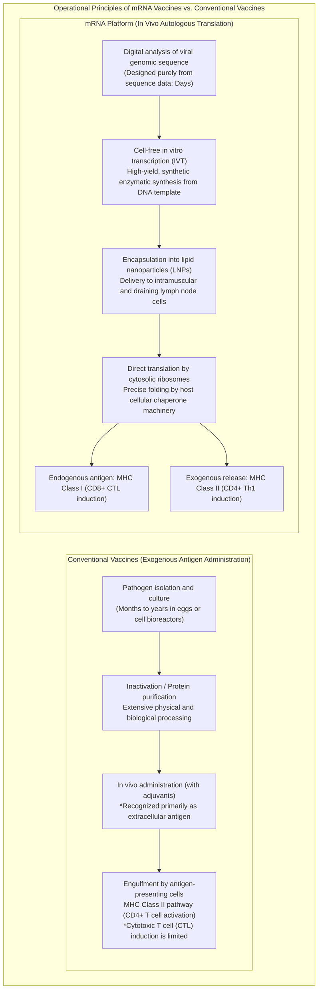
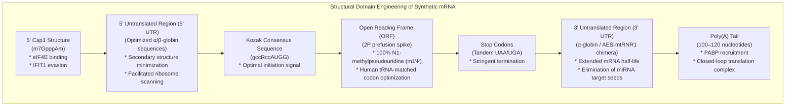
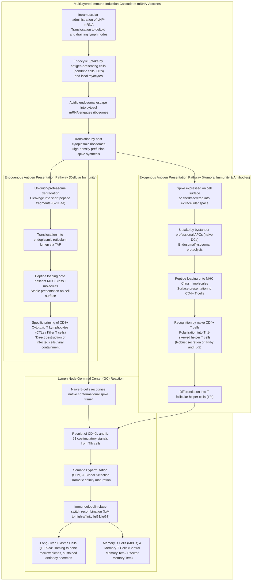
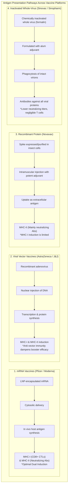

## Introduction: The mRNA Revolution — How a "Fragile Molecule" Paved the Way for the Fastest Vaccine Development in Human History

In January 2020, the full genomic sequence (approximately 30,000 nucleotides) of SARS-CoV-2—the causative agent of an unknown, severe respiratory illness emerging in Wuhan, China—was published online. Just 42 days later, the American biotechnology firm Moderna shipped the initial clinical trial batch of its candidate vaccine vial, "mRNA-1273," to the U.S. National Institutes of Health (NIH). Alongside the collaborative partnership of Germany's BioNTech and U.S. pharmaceutical giant Pfizer with their candidate "BNT162b2," both teams raced through the completion of large-scale Phase III clinical trials and achieved Emergency Use Authorization (EUA) in a mere 11 months—a blinding, unprecedented velocity in the annals of biomedical science.

Conventional vaccine development—involving live-attenuated, inactivated, or recombinant subunit platforms dependent on embryonated chicken eggs or massive industrial bioreactors—traditionally demanded **10 to 15 years** of grueling development and astronomical financial expenditure to move from viral isolation and strain selection to bioprocess optimization and rigorous safety verification. This multi-year timeline was long considered an immutable law of pharmaceutical development.

mRNA technology shattered that dogma at its core. The foundational essence of this revolution was the redefinition of vaccines: shifting from "industrial finished products where the antigenic protein is cultured, purified, and formulated externally" to **"a software-like platform that transiently loads digital genetic code for the target protein into the host's own cellular machinery, transforming the human body into an in vivo autologous antigen-manufacturing facility."**



### The Transience of mRNA in the Central Dogma and the Impossibility of Genomic Integration

To address the theoretical concerns that arose in public discourse regarding whether "administering an mRNA vaccine could alter or rewrite human genomic DNA," the fundamental tenet of molecular biology—the **Central Dogma**—provides a definitive and unequivocal scientific answer.

In eukaryotic organisms, genetic information flows unidirectionally and irreversibly: **DNA (cell nucleus) → Transcription → mRNA (nuclear export) → Translation → Protein (cytoplasm)**. Exogenously administered synthetic mRNA is directly translated by ribosomes residing in the cytoplasm to biosynthesize the target spike glycoprotein.
1. **Absence of Nuclear Localization Signals (NLS)**: Synthetic mRNA molecules lack nuclear localization signal motifs required to traverse the nuclear pore complexes of the nuclear envelope, permanently confining the transcripts to the cytoplasmic compartment.
2. **Absence of Reverse Transcriptase and Integrase**: Converting single-stranded mRNA back into double-stranded DNA requires specialized enzymes carried by retroviruses—specifically **reverse transcriptase**—coupled with **integrase** to insert foreign DNA into host chromatin. Healthy human cells do not possess functional reverse transcriptase or integrase. (While extreme in vitro artificial overexpression experiments have explored theoretical reverse transcription mediated by endogenous LINE-1 retrotransposons, no empirical evidence demonstrates genomic integration under physiological conditions in vivo).
3. **Rapid Natural In Vivo Degradation**: mRNA is inherently an ephemeral, labile macromolecule. Within hours to a few days post-injection, intracellular ribonucleases (RNases) hydrolyze the phosphodiester bonds, degrading the mRNA completely into native mononucleotides that enter normal cellular metabolic pathways, vanishing entirely from the organism.

In summary, an mRNA vaccine represents **"a timed, self-destructing transient instructional message that disintegrates immediately after antigen synthesis,"** making permanent modification of host genomic DNA biologically and mechanistically impossible.

---

## Chapter 1: Four Decades of Struggle and Breakthroughs — The Scientists Who Transformed mRNA into Medicine

The breathtakingly rapid practical realization of mRNA vaccines in 2020 was not an overnight miracle that emerged from a vacuum. Behind it lay more than 40 years of dogged, unyielding basic scientific research conducted by visionary investigators who were frequently marginalized by mainstream academia and starved of grant funding. The awarding of the 2023 Nobel Prize in Physiology or Medicine to **Dr. Katalin Karikó** and **Dr. Drew Weissman** stands as a magnificent testament to the triumph of fundamental scientific inquiry.

### 1.1 The Formidable Barriers of Early mRNA Research: Instability and Lethal Innate Immunogenicity

Ever since messenger RNA was first isolated and identified in 1961 by François Jacob, Sydney Brenner, Jacques Monod, and their colleagues, molecular biologists had nurtured an audacious dream: if exogenous mRNA could be delivered into living tissues, any desired therapeutic protein could be synthesized inside the patient's own body.

However, early experimental attempts spanning the 1980s and 1990s met with catastrophic failure. Two monumental scientific barriers stymied researchers of that era:
- **Extreme Physicochemical Instability**: Living tissues, environmental surfaces, and human skin are ubiquitously saturated with extraordinarily resilient catalytic enzymes known as **ribonucleases (RNases)**, which evolved as host defenses against foreign RNA viruses. Naked mRNA was obliterated into fragments by ubiquitous RNases the microsecond it was introduced into biological fluids, failing even to reach the outer surface of target cell membranes.
- **Catastrophic Innate Immune System Hyperactivation**: Even when intact, unfragmented synthetic mRNA could be delivered in substantial doses to laboratory animals, the host organism immediately recognized it as dangerous pathogen-associated molecular patterns (viral RNA), unleashing acute inflammatory cytokine storms. Animal experiments were plagued by severe anaphylactoid shock, systemic collapse, and mortality, branding mRNA as an inherently toxic, fatally defective molecule unviable for pharmacological therapeutics.

Demoted through academic ranks and repeatedly subjected to grant cancellations and rejections at the University of Pennsylvania, Hungarian-born biochemist Katalin Karikó obstinately clung to the conviction that RNA possessed undiscovered therapeutic potential.

### 1.2 The Historic Discovery of Karikó and Weissman (2005): Uridine Modification Evading Toll-Like Receptors

In 1997, Karikó crossed paths with immunologist Drew Weissman at the University of Pennsylvania. Weissman was researching the antigen-presenting capabilities of dendritic cells (DCs) with the goal of developing an HIV vaccine. Finding shared purpose, they launched a joint research initiative using mRNA to activate dendritic cells.

The central conundrum they encountered was: **"Why do the host's own transfer RNA (tRNA) and ribosomal RNA (rRNA) evade immune destruction, whereas in vitro transcribed (IVT) synthetic mRNA violently stimulates dendritic cells and triggers explosive inflammation?"**

Mammalian cell membranes and endosomal compartments are armed with pattern recognition receptors of the innate immune system known as **Toll-like receptors (TLRs)**:
- **TLR3**: Recognizes double-stranded RNA (dsRNA).
- **TLR7 / TLR8**: Recognizes uridine-rich single-stranded RNA (ssRNA).
- **RIG-I / MDA5**: Senses cytoplasmic foreign 5'-triphosphate uncapped RNA and long double-stranded RNA, triggering transcription of Type I interferons (IFN-α/β).

Karikó and Weissman focused on **chemically modified nucleosides** abundant in endogenous mammalian RNA. Endogenous tRNA and rRNA undergo extensive post-transcriptional modifications including methylation and isomerization. In stark contrast, synthetic mRNA produced by standard IVT reactions consisted solely of the four unmodified canonical bases (A, C, G, U).

In 2005, they published a landmark paper in *Immunity*. **When the canonical uridine (Uracil) in synthetic mRNA was replaced with its post-transcriptionally modified isomer, pseudouridine (Pseudouridine: Ψ), recognition by TLR7, TLR8, and cytosolic nucleic acid sensors plummeted dramatically, and lethal inflammatory signaling was completely abolished.**

### 1.3 Evolution from Pseudouridine to N1-Methylpseudouridine (m1Ψ)

The breakthrough of Karikó and Weissman went far beyond silencing unwanted immune reactivity. Astonishingly, pseudouridine-modified mRNA exhibited a several-fold to tens-of-fold increase in ribosomal translation efficiency.

When standard, unmodified foreign mRNA enters a cell, activation of innate nucleic acid sensors induces **Protein Kinase R (PKR)** and **2'-5'-oligoadenylate synthetase (OAS)**. PKR phosphorylates translation initiation factor **eIF2α**, shutting down global host cellular protein synthesis, while OAS activates **RNase L**, which indiscriminately shreds cytoplasmic RNA in an antiviral defense reflex.

Because pseudouridine modification completely evades activation of these surveillance enzymes, ribosomes can smoothly, continuously, and sustainably translate synthetic mRNA over extended durations.

Throughout the 2010s, biotechnology pioneers such as BioNTech and Moderna conducted extensive screening of nucleoside modifications, identifying **N1-methylpseudouridine (m1Ψ: N1-methylpseudouridine)**, which features a methyl group at the N1 position of pseudouridine.
- m1Ψ preserves proper codon-anticodon base pairing at the ribosomal decoding center while resolving excessive secondary structural rigidity.
- It suppresses TLR7/8 affinity to negligible levels; by substituting 100% of unmodified uridines with m1Ψ, in vivo protein translation efficiency skyrocketed.

Both Pfizer/BioNTech (BNT162b2) and Moderna (mRNA-1273) COVID-19 vaccines incorporated **100% complete substitution with m1Ψ** as their core standard.

### 1.4 A Monument in Structural Biology: Barney Graham and Jason McLellan's "2P Mutation"

Alongside nucleoside modification and translational optimization, the second monumental, Nobel-caliber achievement that ensured the clinical triumph of COVID-19 mRNA vaccines was the **structural stabilization of the prefusion spike glycoprotein via the "2P Mutation" (Two-Proline Substitution)**.

The **spike (S) glycoprotein** protruding from the SARS-CoV-2 envelope is the molecular key that binds human ACE2 receptors to mediate viral entry. This spike glycoprotein is a dynamic, meta-stable "molecular spring" that undergoes radical conformational restructuring before and after fusing with host cell membranes:
- **Prefusion Conformation**: The receptor-binding domain (RBD) is exposed at the apex of the trimer, displaying an abundance of conformational epitopes readily recognized by **potent neutralizing antibodies** capable of neutralizing the virus.
- **Postfusion Conformation**: After membrane fusion, the trimer irreversibly collapses into an elongated, rod-like hairpin structure. Antibodies elicited against this postfusion state possess vastly inferior neutralizing potency.

**Dr. Barney Graham** of the Vaccine Research Center at the National Institute of Allergy and Infectious Diseases (NIAID) and **Dr. Jason McLellan** of the University of Texas at Austin had spent years investigating coronaviruses (MERS-CoV and SARS-CoV-1) using cryogenic electron microscopy (cryo-EM). They discovered that mutating two consecutive amino acid residues (lysine 986 and valine 987) at the apex of the central helix in the S2 subunit hinge region into **two consecutive prolines (Proline: P, K986P/V987P)** acted as a structural conformational lock. Because proline's rigid pyrrolidine ring restricts backbone conformational flexibility, this mutation physically prevents the spike from collapsing into its postfusion state, **freezing the glycoprotein rigidly in its prefusion conformation**.

When the SARS-CoV-2 genomic sequence was deposited online in January 2020, the research teams immediately implemented this 2P mutation. By encoding the 2P-stabilized spike variant (K986P, V987P) into the synthetic mRNA, they ensured that the **most infectious, neutralization-sensitive conformation** was presented at high density and structural fidelity to the host immune system.

---

## Chapter 2: The Precision Architecture of Synthetic mRNA — Molecular Design Engineering

Therapeutic mRNA is not merely a raw copy of viral genetic text. It is an **engineered biopolymer** whose structural domains have undergone exquisite molecular tuning to maximize ribosomal translation, optimize translation kinetics, and precisely regulate intracellular decay.



### 2.1 The 5' Cap Structure (From Cap0 to Cap1): Self-Recognition and Translation Initiation

Eukaryotic cellular mRNA features a characteristic **7-methylguanosine (m7G) cap** at its 5' terminus. In synthetic mRNA, the chemical purity and methylation status of this cap dictate translational competence and immunotolerance.
- **Cap0 (m7GpppN)**: The basic cap structure. In higher vertebrate cytoplasm, it is immediately recognized as "non-self" (foreign viral RNA) by the innate immune restriction factor **IFIT1 (Interferon-induced protein with tetratricopeptide repeats 1)**, triggering translational arrest.
- **Cap1 (m7GpppNm)**: Features 2'-O-methylation of the first transcribed ribose nucleotide adjacent to the m7G cap (2'-O-methylation). This serves as the universal molecular hallmark of mammalian endogenous mRNA, completely preventing IFIT1 binding and immune activation.

Pfizer/BioNTech and Moderna employ co-transcriptional capping reagents (such as the CleanCap® technology) during in vitro transcription, achieving an exceptional **>95% incorporation efficiency of authentic Cap1**. This structure strongly recruits the translation initiation factor complex **eIF4F (comprising eIF4E, eIF4G, and eIF4A)**, rapidly assembling the 40S ribosomal small subunit onto the 5' end.

### 2.2 Optimization of the 5' and 3' Untranslated Regions (UTRs)

The non-coding **5' UTR** and **3' UTR** act as regulatory command centers controlling subcellular localization, ribosome scanning velocity, and physical half-life (decay kinetics).
- **5' UTR Engineering**: Excessively long sequences or stable secondary structures (hairpins, G-quadruplexes) physically impede the linear progression of the scanning pre-initiation complex. Highly optimized untranslated regions derived from human **α-globin** or **β-globin** are utilized, stripped of secondary structures to facilitate unobstructed ribosomal scanning.
- **3' UTR Engineering**: Designed to retard deadenylation and endonuclease cleavage while preventing inadvertent gene silencing by endogenous microRNAs (miRNAs). Target seed sites for highly expressed human miRNAs are meticulously excised. Hybrid sequences, such as human or murine α-globin elements or chimeric fusions of the Amino-Terminal Enhancer of Split (AES) and mitochondrial 12S ribosomal RNA (mtRNR1), are strategically incorporated.

### 2.3 Open Reading Frame (ORF) and Codon Optimization

The ORF encoding the spike glycoprotein amino acid sequence undergoes sophisticated bioinformatic **codon optimization**.

Because the genetic code is degenerate, multiple synonymous codons encode identical amino acids. SARS-CoV-2 genomic codon usage frequencies (codon bias) diverge sharply from human cytoplasmic tRNA abundance profiles.
1. **Harmonization with Human tRNA Abundance**: Synonymous substitution of viral codons with those corresponding to the most abundant cognate isoacceptor tRNAs in the human cytoplasm minimizes ribosomal transit pauses at decoding sites and dramatically enhances translation elongation rates.
2. **Elevation of GC Content**: Strategically increasing the ratio of guanine (G) and cytosine (C) bases enhances the thermodynamic stability of the mRNA transcript while eradicating cryptic splice sites and premature polyadenylation signals.
3. **Depletion of Double-Stranded RNA (dsRNA) Byproducts**: Aberrant run-off or backtracking transcription by bacteriophage T7 RNA polymerase can generate trace dsRNA contaminants that trigger acute innate immune signaling; these are minimized through optimized sequence design and removed via rigorous downstream high-performance liquid chromatography (HPLC) or tangential flow filtration.

### 2.4 The Poly(A) Tail and the "Closed-Loop Model"

The homopolymeric stretch of adenosine residues at the 3' terminus—the **poly(A) tail**—functions as the molecular timer governing the functional lifespan of the transcript.
- In the cytoplasm, the poly(A) tail is bound by **Poly(A)-Binding Protein (PABP)**.
- PABP directly interacts with the scaffolding protein eIF4G bound to the 5' cap complex, circularizing the mRNA into a **"closed-loop" (Closed-Loop Model)** pseudo-circular configuration.
- This looped conformation enables ribosomes that reach the tandem stop codons to be efficiently recycled directly back to the 5' initiation site, driving thousands of rounds of translation from a single mRNA molecule.
- Furthermore, circularization sterically blocks exoribonucleases (such as XRN1 from the 5' end and the exosome complex from the 3' end) from attacking the transcript terminals. Vaccines engineered by Moderna and Pfizer incorporate precisely calibrated poly(A) tails of approximately 100 to 120 nucleotides (either encoded directly in the plasmid DNA template or enzymatically appended).

---

## Chapter 3: The Transport Vessel Penetrating Biological Barriers — Lipid Nanoparticle (LNP) Engineering

Even an exquisitely engineered mRNA molecule is pharmacologically useless without an effective delivery vehicle to escort it safely into the cytoplasm of target cells. The enabling engineering triumph of mRNA therapeutics is the sub-100-nanometer **Lipid Nanoparticle (LNP)**.

### 3.1 Why Naked mRNA Cannot Be Administered

Direct intramuscular injection of naked mRNA yields virtually zero vaccinal efficacy due to two insurmountable physicochemical barriers:
1. **Electrostatic Repulsion**: The phosphodiester backbone of mRNA carries dense negative charges (polyanionic). The outer leaflet of mammalian cellular membranes consists of negatively charged phospholipid headgroups and sialic-acid-rich glycocalyx. Coulombic repulsion vigorously repels naked mRNA.
2. **Instantaneous Enzymatic Cleavage by Extracellular RNases**: Ubiquitous RNases in blood and interstitial fluids degrade naked mRNA with an in vivo half-life of mere minutes.

Consequently, a nanoscale "Trojan horse" is indispensable to shield the negative charge, encapsulate the RNA cargo, traverse the plasma membrane, and mediate release into the cytosol.

### 3.2 Roles and Chemical Structures of the "Golden Four Lipids" in LNPs

The LNPs in Pfizer/BioNTech and Moderna vaccines comprise **four lipid components** formulated at precise stoichiometric molar ratios:

```
[The Four Core LNP Lipids]
1. Ionizable Cationic Lipid ~ 46–50 mol%
2. Helper Phospholipid (DSPC) ~ 10 mol%
3. Cholesterol ~ 38–43 mol%
4. PEGylated Lipid ~ 1.5–1.7 mol%
```

| Lipid Component | Primary Molecules (Pfizer / Moderna) | Molar Ratio (mol%) | Physicochemical Characteristics | Essential In Vivo Functions |
| :--- | :--- | :--- | :--- | :--- |
| **Ionizable Lipid** | **ALC-0315** (Pfizer)<br/>**SM-102** (Moderna) | **~46–50%** | Apparent pKa of **6.0–6.8**. Positively charged under acidic conditions, uncharged/neutral at physiological pH. Features tertiary amines and biodegradable ester bonds. | ① Condenses with polyanionic mRNA via electrostatic attraction to package it into an electron-dense core at acidic formulation pH.<br/>② Neutralizes at physiological pH (7.4) in circulation, avoiding cellular toxicity and hemolysis.<br/>③ Re-protonates upon endosomal acidification, disrupting the bilayer to trigger cytosolic escape. |
| **Helper Lipid** | **DSPC**<br/>(1,2-distearoyl-sn-glycero-3-phosphocholine) | **~10%** | Saturated phospholipid with a high phase-transition temperature (~55°C). Cylindrical molecular geometry. | Forms a stable structural bilayer (lamellar phase) at the LNP outer shell, maintaining structural rigidity and morphological stability. |
| **Cholesterol** | Plant-derived purified cholesterol | **~38–43%** | Rigid steroid core with a small polar 3β-hydroxyl group. Intercalating packing molecule. | Fills gaps in the phospholipid bilayer, optimizing membrane fluidity and phase-transition dynamics. Enhances membrane fusion competence and prevents cargo leakage. |
| **PEGylated Lipid** | **ALC-0159** (Pfizer)<br/>**PEG2000-DMG** (Moderna) | **~1.5–1.7%** | Hydrophilic polyethylene glycol (PEG) chain conjugated to a lipid anchor (dimyristylglycerol, etc.). | ① Prevents nanoparticle aggregation during manufacturing and storage, tightly controlling particle size (~80 nm).<br/>② Prevents non-specific serum protein adsorption (opsonization), extending circulation half-life.<br/>③ Gradually dissociates ("sheds") in vivo to facilitate cellular uptake. |

### 3.3 The Miracle of Endocytosis and Endosomal Escape

Following intramuscular injection, the decisive biological obstacle between LNP entry and protein translation is **endosomal escape**:

1. **Adsorption and Cellular Uptake**:
   Exposed to interstitial fluid and bloodstream, LNPs adsorb endogenous serum apolipoproteins, predominantly **Apolipoprotein E (ApoE)**, onto their surface. ApoE-decorated LNPs engage **low-density lipoprotein receptors (LDLR)** expressed on professional antigen-presenting cells (dendritic cells, macrophages) and myocytes, triggering clathrin-mediated endocytosis into intracellular vesicles (early endosomes).
2. **Endosomal Acidification and Re-protonation**:
   As early endosomes mature into late endosomes, vacuolar H+-ATPase (V-ATPase) proton pumps acidify the luminal pH from neutrality (7.4) down to pH 6.5 → 5.5 or lower.
3. **Charge Reversal of Ionizable Lipids and the "Proton Sponge" Effect**:
   The ionizable lipids embedded in the LNP core (pKa 6.0–6.8) accept hydrogen ions ($H^+$), undergoing a **dramatic phase change from uncharged neutrality to dense positive charge (cationic)**.
4. **Membrane Fusion and Cytoplasmic mRNA Release**:
   Positively charged ionizable lipids interact strongly with anionic phospholipids (such as phosphatidylserine) enriched in the inner leaflet of the endosomal membrane. This charge pairing induces non-bilayer lipid phase transitions, specifically the inverted hexagonal phase ($H_{II}$ phase). Combined with osmotic swelling driven by influx of counterions (the proton sponge mechanism), the endosomal membrane ruptures, creating transient pores through which intact mRNA escapes into the **cytosolic ribosome pool**.

Contemporary nanobiological studies indicate that only a modest fraction—typically **a few percent to 15%**—of endocytosed mRNA successfully escapes into the cytoplasm before lysosomal degradation. However, because mRNA is an extraordinarily potent catalytic translation template, this small fraction is more than sufficient to orchestrate explosive antigen production and ignite potent immunity.

### 3.4 Microfluidic Formulation Technology

The industrial-scale production of LNPs was made possible by advances in **microfluidics**.

Traditional bulk mixing methods using beakers or homogenizers produced polydisperse, heterogeneous vesicles with low encapsulation efficiency and poor reproducibility. Modern manufacturing lines utilize staggered herringbone or impinging jet microfluidic chips with microchannels tens of micrometers wide.
An **ethanolic lipid solution** containing the four lipids and an **acidic aqueous mRNA buffer** are introduced at precisely controlled flow rate ratios (typically 3:1 aqueous to ethanol) and linear velocities of several meters per second.

Upon rapid hydrodynamic mixing, the sudden dilution of ethanol drops lipid solubility, driving instantaneous self-assembly. Protonated ionizable lipids electrostatically condense mRNA into nanoscopic electron-dense cores, surrounded by DSPC, cholesterol, and outward-facing PEG lipids. This continuous, millisecond-scale process generates ultra-homogeneous LNPs with **diameters of 80–100 nm, encapsulation efficiencies exceeding 90%, and exceptionally narrow polydispersity indices (PDI < 0.1)**.

---

## Chapter 4: The Multilayered Immune Cascade — From Cytosolic Translation to Systemic Immunity

The overriding scientific advantage of mRNA vaccines over traditional inactivated or recombinant subunit platforms is their **dual antigen-presentation capacity: simultaneous activation of both MHC Class I and MHC Class II pathways**.



### 4.1 Local Muscle Tissue Uptake and High Expression in Draining Lymph Nodes

Following deltoid injection, a major fraction of LNPs drains via interstitial lymphatic channels within hours into regional draining lymph nodes (predominantly axillary lymph nodes).
- While local skeletal myocytes take up LNPs and express spike on their sarcolemma, the true immunogenic drivers are tissue-resident macrophages and, crucially, **professional antigen-presenting cells (APCs), specifically conventional dendritic cells (cDCs)** concentrated in the subcapsular sinus and paracortex of lymph nodes.
- Prefusion spike synthesized within the DC cytoplasm undergoes native host post-translational modifications—proper disulfide bond isomerization and authentic N-linked high-mannose and complex glycosylation—displaying intact homotrimers that faithfully mimic the native viral envelope surface.

### 4.2 Dramatic Induction of Cytotoxic T Lymphocytes (CD8+ CTLs) via the MHC Class I Pathway

Because conventional inactivated or recombinant subunit vaccines deliver exogenous proteins from *outside* the cell, they primarily stimulate the MHC Class II pathway and struggle to induce **cytotoxic CD8+ killer T cells (CTLs)**, which are vital for identifying and destroying actively infected host cells.

In contrast, mRNA vaccines direct antigen biosynthesis **inside the cell (cytosol)**:
1. **Proteasomal Degradation**: A fraction of newly synthesized cytosolic spike protein is marked by the ubiquitin-proteasome system (UPS) and cleaved by the catalytic core of the immunoproteasome into short oligopeptides (8–11 amino acids).
2. **Translocation into the ER**: Peptides are actively transported into the endoplasmic reticulum (ER) lumen via the **Transporter associated with Antigen Processing (TAP)**.
3. **Loading onto MHC Class I**: Peptides are loaded into the peptide-binding groove of nascent **MHC Class I molecules (HLA-A, HLA-B, HLA-C)** with chaperone assistance (tapasin, calreticulin), trafficked through the Golgi apparatus, and displayed on the plasma membrane.
4. **Priming of Killer T Cells**: Naive CD8+ T cells in the lymph node recognize these peptide-MHC-I complexes via their T cell receptors (TCRs). Accompanied by costimulatory signals (CD80/CD86 binding CD28), they undergo robust clonal expansion and differentiate into **effector cytotoxic T lymphocytes (CTLs)** armed with perforin and granzymes.

This potent CTL priming is the exact biological mechanism that prevented severe disease, hospitalization, and death even when antibody neutralization was degraded by emergent variants.

### 4.3 The MHC Class II Pathway and Th1 Polarization

Simultaneously, spike protein is released extracellularly through cell shedding, microvesicular exocytosis, or apoptotic myocyte debris:
- Neighboring professional APCs engulf these extracellular antigens via macropinocytosis or receptor-mediated phagocytosis, directing them into acidic endolysosomes where cathepsins degrade them into 13–18 amino acid peptides.
- These peptides are loaded onto **MHC Class II molecules (HLA-DR, HLA-DQ, HLA-DP)** and presented at the cell surface.
- Naive CD4+ T cells recognizing these complexes encounter an adjuvant-conditioned microenvironment created by the LNP components, which promotes polarizing cytokines (IL-12, Type I IFNs). This drives differentiation into **Th1-skewed CD4+ helper T cells** that produce abundant interferon-gamma (IFN-γ) and interleukin-2 (IL-2), rather than allergic Th2 responses. This stringent Th1 skewing was instrumental in averting vaccine-associated enhanced disease.

### 4.4 Robust Germinal Center Formation and B Cell Affinity Maturation

The most sophisticated immunological feature of mRNA vaccination is the prolonged induction of **Germinal Centers (GCs)** within secondary lymphoid tissues.

1. **Recognition of Native Conformational Antigen**: Naive follicular B cells recognize intact, natively folded prefusion spike trimers presented on follicular dendritic cells (FDCs) or dendritic cell surfaces via their B cell receptors (BCRs).
2. **T Follicular Helper (Tfh) Cell Support**: Activated B cells migrate into the lymphoid follicles, where specialized **T follicular helper (Tfh) cells** provide crucial survival and differentiation cues through CD40 ligand (CD40L) and interleukin-21 (IL-21).
3. **Somatic Hypermutation (SHM) and Affinity Maturation**:
   - In the GC dark zone, B cells express activation-induced cytidine deaminase (AID), introducing high-frequency random mutations into their immunoglobulin variable ($V$) genes during iterative, rapid proliferation.
   - Migrating to the light zone, these mutant B cell clones compete for limited spike antigen displayed on FDCs.
   - Clones that have acquired higher-affinity mutations capture antigen, receive survival signals from Tfh cells, and are selected for further expansion; low-affinity or autoreactive clones undergo apoptosis.
4. **Class Switching and Differentiation into Long-Lived Plasma Cells and Memory Cells**:
   - Class-switch recombination shifts the isotype from low-affinity IgM to potent, tissue-penetrating **IgG1 and IgG3** isotypes.
   - Selected high-affinity clones differentiate into **Long-Lived Plasma Cells (LLPCs)** that home to survival niches in the bone marrow, continuously churning out thousands of high-affinity neutralizing antibody molecules per second for months.
   - Other clones become **Memory B Cells (MBCs)**, seeding lymph nodes and the spleen to mount rapid recall responses upon encountering future viral variants.

Lymph node fine-needle aspiration biopsies demonstrated that mRNA vaccination elicits GC reactions that persist with exceptional vigor for **at least six months**, an unprecedented duration that drove continuous somatic hypermutation and antibody diversification.

---

## Chapter 5: Clinical Evidence, Efficacy Kinetics, and the Battle Against Emerging Variants

### 5.1 Landmark Phase III Clinical Trials: The 95% Efficacy Phenomenon

Published in *The New England Journal of Medicine (NEJM)* in late 2020 (Polack et al. for Pfizer/BioNTech; Baden et al. for Moderna), the pivotal Phase III clinical trials stunned the scientific community:
- **Pfizer/BioNTech (BNT162b2; 43,448 participants)**: 162 COVID-19 cases in the placebo cohort versus just 8 cases in the vaccine cohort, establishing an unprecedented **vaccine efficacy of 95.0% (95% CI: 90.3–97.6%)**. Severe cases were 9 in the placebo group versus 1 in the vaccine arm.
- **Moderna (mRNA-1273; 30,420 participants)**: 185 cases in the placebo arm (30 severe, 1 death) versus 11 cases in the vaccinated group (0 severe), demonstrating **94.1% efficacy (95% CI: 89.3–96.8%)** and 100% protection against severe endpoints.

The FDA and WHO had initially established a regulatory threshold of 50% efficacy for Emergency Use Authorization. Given that annual influenza vaccines generally achieve 40–60% effectiveness, a 95% efficacy against a novel, highly contagious pathogen exceeded the most optimistic projections of vaccinologists worldwide.

### 5.2 Statistical Interpretation: Relative Risk Reduction (RRR) vs. Absolute Risk Reduction (ARR)

A frequent statistical misunderstanding arose in public discourse: critics argued that "95% represents Relative Risk Reduction (RRR), while the Absolute Risk Reduction (ARR) was only ~1%, implying minimal practical efficacy."

The epidemiological and mathematical principles resolve this issue definitively:
- **Relative Risk Reduction (RRR)**: Compares incidence in the placebo group ($I_p$) to incidence in the vaccinated group ($I_v$):
  $$RRR = \frac{I_p - I_v}{I_p} \times 100\% = \frac{0.0088 - 0.0004}{0.0088} \approx 95\%$$
  This metric isolates the **intrinsic biological and immunological efficacy of the vaccine in arresting viral pathogenesis**.
- **Absolute Risk Reduction (ARR)**: The arithmetic difference in infection rates across the entire study population over the constrained trial window (a few months):
  $$ARR = I_p - I_v \approx 0.88\% - 0.04\% = 0.84\%$$
- **The Core Statistical Reality**:
  ARR is fundamentally contingent upon the **background community transmission rate (cumulative incidence)** during the observation interval. In a low-prevalence setting, even a 100% effective panacea would have an ARR below 1%. Conversely, during an uncontrolled epidemic wave where 20% of the population is exposed, the ARR leaps to $20\% \times 95\% = 19\%$. Conflating ARR with biological efficacy reflects a fundamental confusion between immunological potency and temporary epidemiological exposure.

### 5.3 Real-World Evidence (RWE): Proof from Nationwide Cohorts

When deployed across tens of millions of individuals in heterogeneous real-world populations—including elderly individuals, multi-morbid patients, and immunosuppressed cohorts—the vaccine's real-world effectiveness was rigorously tracked.

Pioneering nationwide data from **Israel (Clalit Health Services matched cohort of 1.2 million individuals; Dagan et al., NEJM 2021)**, alongside massive surveillance from the UK Health Security Agency (UKHSA) and US CDC, established three fundamental realities:
1. **Decisive Suppression of Early Strains**: Against the ancestral Wuhan-Hu-1 strain and Alpha variant, real-world effectiveness replicated trial findings, exceeding 90% against infection and 95% against hospitalization/death.
2. **Kinetics of Waning Humoral Immunity**: Protection against symptomatic infection declined to 60–70% within 4 to 6 months post-vaccination, mirroring the natural physiological half-life of circulating serum neutralizing antibodies.
3. **Durable Preservation Against Severe Disease and Mortality**: Strikingly, protection against severe outcomes (hospitalization, mechanical ventilation, death) remained robust at 85–90% or higher long after circulating antibody titers declined. This durability was powered by rapid anamnestic antibody synthesis from marrow-resident memory B cells and **unimpaired, broad CD8+ cytotoxic T cell immunity** suppressing deep pulmonary viral replication.

### 5.4 Waves of Variants and Immune Evasion: Declining Titers vs. T Cell Resilience

As viral evolution progressed under selective pressure, SARS-CoV-2 accumulated substantial mutations:

| Variant Lineage | Key Mutations (RBD, etc.) | Neutralizing Titer Relative to Ancestral | 2-Dose Vaccine Efficacy (Infection) | 2-Dose Vaccine Efficacy (Severe Disease) | Impact of Booster (3rd Dose / Updated) |
| :--- | :--- | :--- | :--- | :--- | :--- |
| **Ancestral Strain<br/>(Wuhan-Hu-1)** | Baseline (no mutations) | **1.0x** (Reference) | **~95%** | **~95% or higher** | Titer elevated multi-fold above baseline |
| **Alpha Variant<br/>(Alpha: B.1.1.7)** | N501Y, P681H | **~1.5–2x modest decline** | **~85–90%** | **~95%** | High levels maintained for both infection and severe outcomes |
| **Delta Variant<br/>(Delta: B.1.617.2)** | L452R, T478K, P681R | **~3–6x decline** | **~60–75%** (waned over time) | **~90%** | 3rd dose restored protection against symptomatic disease to >85% |
| **Omicron BA.1/BA.2<br/>(Early Omicron)** | >15 mutations in RBD<br/>(K417N, E484A, N501Y, etc.) | **~20–40x sharp decline** | **~20–40%** (markedly reduced with 2 doses) | **~70–80%** (sustained by T cell immunity) | 3rd dose booster dramatically improved protection against infection to 65–75% and severe disease to >90% |
| **Omicron BA.4/BA.5<br/>& XBB / JN.1** | L452R, F486V/P, R346T<br/>Extreme immune escape & high receptor affinity | **Substantial loss of antibody binding** | **Near negligible with 2 doses alone** | **~60–70%** (sustained by cellular memory) | Bivalent / Monovalent updated (XBB.1.5, JN.1) vaccines restored neutralization; severe disease protection >70–80% |

The emergence of Omicron highlighted the limitations of neutralizing antibodies in providing absolute mucosal sterile immunity. With over 30 mutations in the spike protein and 15 in the RBD alone, structural reconfiguration disrupted key conformational neutralizing epitopes.

However, **the broad diversity of T cell-mediated immunity came to the fore**:
- Neutralizing antibodies target narrow, solvent-exposed structural motifs (conformational epitopes) on the spike surface; a few amino acid substitutions can drastically weaken binding.
- In stark contrast, T cells recognize **linear peptide fragments** presented on MHC molecules, distributed across the entire 1,273-amino-acid length of the spike protein.
- Because human populations express highly polymorphic HLA alleles, the virus cannot mutate all T cell epitopes without destroying its own fitness.
- Multi-institutional studies confirmed that **over 80–90% of vaccine-elicited T cell epitopes remained completely intact across Omicron sublineages**. This biological preservation explains why, despite astronomical surges in caseloads, hospitalizations and mortality in highly vaccinated populations remained decoupled from infection numbers.

### 5.5 Booster Doses and the Architecture of Variant-Adapted Vaccines

Faced with waning titers and antigenic drift, the **agility** of the mRNA platform proved decisive:
1. **Homologous Boosters (3rd Dose)**: Administering a third dose of the ancestral vaccine reignited germinal center reactions, driving further somatic hypermutation in memory B cells and expanding cross-neutralizing antibody breadth against Omicron.
2. **Bivalent Formulations**: Mixing ancestral and Omicron BA.1 or BA.4/5 mRNAs at a 1:1 ratio broadened antigenic coverage.
3. **Monovalent Variant Vaccines (XBB.1.5, JN.1)**: To mitigate immune imprinting (antigenic seniority), formulation strategy pivoted to monovalent vaccines encoding the predominant circulating lineage. Simply rewriting the digital sequence code allowed manufacturing lines to transition in just 2 to 3 months—a turnaround unimaginable with legacy bioproduction methods.

---

## Chapter 6: Safety Profile, Pathophysiology of Adverse Events, and Risk-Benefit Analysis

Like any medical intervention, mRNA vaccines entail potential risks and adverse effects alongside their demonstrable benefits. An objective, evidence-based dissection of adverse event pathophysiology and quantitative risk-benefit calculus is essential.

### 6.1 Local and Systemic Reactogenicity: The Physiological Cost of Immunogenicity

The high frequency of transient local symptoms (injection-site pain, erythema, swelling) and systemic reactions (pyrexia ≥38°C, fatigue, headache, myalgia, arthralgia, chills) reflects **physiological manifestations of innate immune activation**, not cytotoxicity.
- LNP constituents and transient cytosolic signaling stimulate local dendritic cells and macrophages to release pyrogenic cytokines: **IL-1β, IL-6, TNF-α, and Type I interferons (IFN-α/β)** into the circulation.
- These circulating mediators act on the preoptic hypothalamic thermoregulatory center to elevate the thermal setpoint (inducing fever) and trigger musculoskeletal discomfort.
- Over 95% of these symptoms resolve spontaneously within 24 to 48 hours and respond readily to symptomatic treatment with antipyretics and analgesics (acetaminophen, ibuprofen).

### 6.2 Myocarditis and Pericarditis: Epidemiology and Putative Pathological Mechanisms

Global pharmacovigilance surveillance systems (US VAERS/VSD, Israeli Ministry of Health, UK MHRA, Japanese MHLW) identified a rare association between mRNA vaccination and **myocarditis/pericarditis**, clustered primarily in **adolescent and young adult males (ages 12–29)** within days following the second dose.

#### 1. Epidemiological Incidence
- Across the general population, the incidence is exceptionally low: **approximately 1 to 5 cases per 100,000 administered doses**.
- In the highest-risk demographic—**males aged 16–19 following the second dose**—the incidence peaks at approximately **10 to 15 cases per 100,000 doses (~0.01%)**.
- The incidence was statistically higher with Moderna (mRNA-1273; 100 μg dose) than Pfizer (BNT162b2; 30 μg dose), reflecting higher mRNA and lipid payloads, prompting several nations to preferentially recommend BNT162b2 for males under 30.

#### 2. Putative Molecular Pathophysiology
Current research points to a multifactorial etiology:
1. **Unbound Free Spike and Immune Complexes**: A study led by Yonker et al. at Harvard (Circulation, 2023) identified elevated levels of unbound, circulating "free spike" protein uncomplexed with neutralizing antibodies in affected young patients, suggesting intense local innate immune receptor activation in myocardial tissue.
2. **Sex Hormone Modulation (Testosterone)**: Male preponderance is linked to testosterone, which promotes Th1-skewed responses and proinflammatory macrophage activation, whereas estrogens exert cardioprotective, anti-inflammatory effects.
3. **Transient Autoimmunity**: Hypotheses suggest temporary cross-reactive autoantibodies or innate hyper-responsiveness targeting cardiac contractile proteins like α-myosin.

#### 3. Clinical Trajectory and Comparison to Viral Infection
Crucially, **>90% of vaccine-associated myocarditis cases exhibit a mild, self-limiting clinical course**. Patients typically recover fully within days to a week with conservative care (NSAIDs), without significant myocardial scar tissue or long-term systolic dysfunction; severe heart failure and mortality are exceedingly rare.

Decisively, **the risk of myocarditis, pericarditis, cardiac arrhythmias, and all-cause cardiovascular death from natural SARS-CoV-2 infection is several-fold to tens-of-fold higher** than the risk following vaccination across all age groups, including adolescent males. Robust CDC and UK cohort studies confirm that the cardiovascular and systemic protective benefits of vaccination vastly outweigh the rare risk of post-vaccine myocarditis.

### 6.3 Anaphylaxis and Polyethylene Glycol (PEG) Hypersensitivity

Acute anaphylactic reactions occurring within minutes of injection arise at an estimated rate of **2 to 5 cases per million doses**—slightly higher than traditional flu vaccines (~1 per million), yet exceedingly rare.
- **Etiology**: Driven primarily by pre-existing anti-PEG IgE antibodies against the **PEG2000** lipid moiety decorating the LNP shell, or non-IgE-mediated complement activation-related pseudoallergy (CARPA) causing mast cell degranulation.
- Pre-sensitization occurs via everyday exposure to PEG in cosmetics, pharmaceutical excipients, or bowel preparation laxatives.
- Standardized observation periods (15–30 minutes) and prompt intramuscular epinephrine (EpiPen) administration ensured that near-zero fatal outcomes occurred.

### 6.4 Mechanistic Contrast with Adenoviral Vector Vaccines (TTS/VITT)

Adenovirus-vectored vaccines (AstraZeneca ChAdOx1-S, Johnson & Johnson Ad26.COV2.S) were implicated in a catastrophic syndrome: **Thrombosis with Thrombocytopenia Syndrome (TTS) / Vaccine-Induced Immune Thrombotic Thrombocytopenia (VITT)**, particularly affecting younger females.
- **Pathogenesis of VITT**: Adenoviral capsid proteins bind platelet factor 4 (PF4), forming immunogenic macromolecular complexes that trigger high-titer autoantibodies against PF4, driving massive platelet activation, systemic microvascular thrombosis (cerebral venous sinus thrombosis, splanchnic vein thrombosis), and profound consumptive thrombocytopenia, mimicking severe heparin-induced thrombocytopenia (HIT).
- **Safety of mRNA Vaccines**: Because mRNA vaccines utilize purely synthetic lipid nanoparticles and contain zero adenoviral or viral capsid proteins, **VITT/TTS does not occur with mRNA vaccines**.

### 6.5 Investigation of ADE (Antibody-Dependent Enhancement) and VAED

Historical precedents—such as severe **Antibody-Dependent Enhancement (ADE)** seen in dengue vaccine candidates or **Vaccine-Associated Enhanced Disease (VAED)** in 1960s formalin-inactivated RSV trials (FI-RSV)—raised early theoretical concerns for COVID-19.

However, **across billions of doses administered worldwide, no signal of ADE or VAED was ever detected for mRNA vaccines**.

Molecular biology accounts for this safety record:
1. **Dominance of High-Affinity Neutralizing Antibodies via 2P Mutation**: By stabilizing the prefusion spike conformation, the elicited humoral response is dominated by potent neutralizing antibodies, depriving the virus of sub-neutralizing complexes that could facilitate Fc-receptor-mediated cellular entry.
2. **Robust Th1 Polarization**: The innate immunostimulatory profile of the LNP-mRNA complex strictly drives CD4+ T cell differentiation down the Th1 pathway (IFN-γ-producing), preventing the deleterious Th2-skewed immunopathology, eosinophilic pulmonary infiltration, and immune-complex deposition that defined historical VAED.

| Adverse Event / Manifestation | Frequency | Typical Onset Window | Primary Pathophysiological Mechanism | Clinical Outcome & Management |
| :--- | :--- | :--- | :--- | :--- |
| **Injection-Site Reactions**<br/>(Pain, erythema, induration) | **70–85%** (Extremely common) | Day of vaccination to next day | Local myofascial and subcutaneous inflammatory cytokine release (IL-1, TNF) and neutrophil infiltration | Resolves spontaneously in 1–3 days. Local cold compresses, symptomatic care. |
| **Systemic Reactogenicity**<br/>(Pyrexia, fatigue, headache) | **50–70%** (Common, higher post-dose 2) | Day after vaccination (12–24 hours post-dose) | Circulating IL-6, IFN-α/β triggering hypothalamic thermoregulatory center | Disappears in 1–2 days. Antipyretics/analgesics (acetaminophen, ibuprofen). |
| **Myocarditis / Pericarditis** | **1–5 per 100,000 doses** (Extremely rare, predilection for males aged 12–29) | Within 2–4 days post-vaccination | Unbound free spike overstimulation, testosterone-dependent inflammatory amplification, transient cross-reactive autoimmunity | **Vast majority (>90%) mild**. Prompt resolution with conservative care (NSAIDs). |
| **Anaphylaxis** | **2–5 per 1,000,000 doses** (Extremely rare) | Immediately to 30 minutes post-dose | Pre-existing anti-PEG antibodies against LNP outer shell or complement activation-related pseudoallergy (CARPA) causing mast cell degranulation | Full recovery without long-term sequelae upon immediate intramuscular epinephrine (EpiPen). |
| **Guillain-Barré Syndrome** | **Comparable to baseline population rate for mRNA** | Several weeks post-vaccination | Autoantibodies targeting peripheral myelin (slight signal with viral vectors; refuted for mRNA vaccines) | Intravenous immunoglobulin (IVIg), plasmapheresis; no causal link established with mRNA platforms. |

---

## Chapter 7: Comprehensive Comparative Analysis of Vaccine Technological Platforms

The COVID-19 pandemic served as a crucible where every major modern biotechnology platform was tested and deployed simultaneously under identical global conditions.



### 7.1 mRNA vs. Viral Vector Vaccines (DNA-Based Platforms)

Adenoviral vector vaccines employ a replication-deficient adenovirus encoding the spike DNA transgene.
- **Advantages**: DNA is chemically more resilient than RNA, permitting extended storage at refrigerated temperatures (2–8°C), making it suitable for low-resource settings.
- **The Anti-Vector Immunity Bottleneck**: The fatal biological flaw is that the immune system develops neutralizing antibodies not just against the spike, but against the viral vector capsid itself. Subsequent booster doses are neutralized and cleared before the vector can transduce host cells, drastically attenuating redosing efficacy. Coupled with the rare risk of VITT/TTS, this platform fell behind.
- **The mRNA Advantage**: LNPs are non-immunogenic synthetic lipid envelopes lacking foreign protein capsids, enabling **unlimited repeated boosting without anti-carrier immunity**.

### 7.2 mRNA vs. Recombinant Subunit Protein Vaccines

Platforms such as Novavax (NVX-CoV2373) engineer recombinant spike proteins in insect cell (Sf9) bioreactors and formulate them with novel saponin adjuvants (Matrix-M™).
- **Advantages**: Built upon decades of established clinical precedent (similar to recombinant hepatitis B vaccines); displays markedly milder reactogenicity (lower rates of high fever and systemic fatigue).
- **Disadvantages**: Requires months of cell fermentation, complex purification, and protein refolding, resulting in protracted manufacturing lead times (several months) that preclude rapid variant-adapted reformulation.

### 7.3 mRNA vs. Inactivated Whole-Virus Vaccines

Inactivated vaccines (Sinovac CoronaVac, Sinopharm BBIBP-CorV) utilize whole SARS-CoV-2 virions cultured in Vero cell bioreactors and chemically inactivated (e.g., with β-propiolactone).
- **Advantages**: Presents all structural proteins (spike, nucleocapsid, envelope, membrane) to the immune system.
- **Disadvantages**: Elicits significantly lower neutralizing antibody titers and virtually fails to induce CD8+ cytotoxic T cells. Vaccine effectiveness waned rapidly against Delta and collapsed against Omicron. Furthermore, culturing massive volumes of live biosafety-level-3 (BSL-3) pathogen carries substantial biosafety risks and biological contamination hazards.

### 7.4 Manufacturing Processes, Supply Chains, and Thermodynamic Constraints

The initial logistical bottleneck of mRNA vaccines was their stringent **ultra-cold chain requirement (-80°C to -20°C)**.
- **Physicochemical Mechanism**: In aqueous liquid formulations, the 2'-hydroxyl group (-OH) of ribose in the phosphodiester backbone acts as an internal nucleophile, launching intramolecular transesterification attacks against the adjacent phosphorus atom (spontaneous autohydrolysis). Simultaneously, lipid components undergo oxidation and vesicle fusion.
- **Cryopreservation Rationale**: To immobilize thermodynamic cleavage and maintain structural integrity, early formulations demanded dry ice storage at **-80°C to -60°C** (Pfizer) or **-20°C** (Moderna).
- **Unrivaled Scalability of Cell-Free Synthesis**: Paradoxically, the manufacturing footprint is tiny. Because it utilizes **in vitro enzymatic transcription**, it bypasses the need for massive bioreactors; a reaction vessel the size of a household pitcher can produce hundreds of millions of doses. This unparalleled scalability made instantaneous global supply possible.

| Comparison Dimension | ① mRNA Vaccine | ② Viral Vector | ③ Recombinant Protein | ④ Inactivated Vaccine |
| :--- | :--- | :--- | :--- | :--- |
| **Representative Products** | **Pfizer (BNT162b2)<br/>Moderna (mRNA-1273)** | AstraZeneca (ChAdOx1)<br/>J&J (Ad26.COV2.S) | Novavax (NVX-CoV2373)<br/>Daiichi Sankyo (Daichirona) | Sinovac (CoronaVac)<br/>Sinopharm (BBIBP) |
| **Antigen Modality** | Lipid nanoparticle-encapsulated mRNA | Non-replicating adenoviral DNA | Purified nanoparticle protein | Formalin-inactivated whole virion |
| **Site of Antigen Synthesis** | **Host cell cytoplasm (Endogenous)** | Host cell nucleus and cytoplasm | External bioreactors (Insect/CHO cells) | External bioreactors (Vero cells) |
| **Neutralizing Antibody Induction** | **Extremely potent (Highest tier)** | Robust to moderate | Robust | Moderate to weak |
| **CD8+ CTL Induction** | **Extremely potent (MHC-I presentation)** | Robust | Limited (Cross-presentation only) | Negligible |
| **Variant Adaptation Speed** | **Fastest (Weeks to 2 months)** | Moderate (2 to 4 months) | Slow (6 months to 1 year) | Extremely slow (>6 months) |
| **Primary Adverse Events** | Pyrexia, pain; rarely myocarditis | Pyrexia; rarely thrombosis with thrombocytopenia (TTS/VITT) | Local pain, mild malaise (mild) | Local reactions (very mild) |
| **Storage & Logistics Temperature** | **-80°C to -20°C (Frozen)** | 2°C to 8°C (Standard refrigeration) | 2°C to 8°C (Standard refrigeration) | 2°C to 8°C (Standard refrigeration) |
| **Suitability for Repeat Dosing** | **Extremely high (No restrictions)** | Low (Anti-vector immunity) | High | High |

---

## Chapter 8: The Frontiers of mRNA Technology — From Cancer Immunotherapy to the Future of Personalized Medicine

The clinical validation of mRNA vaccines has transcended infectious diseases, establishing a foundational architectural paradigm for **twenty-first-century biotherapeutics**.

### 8.1 Personalized Cancer Neoantigen Vaccines

The foundational motivation for founding BioNTech and Moderna was never infectious diseases, but **oncology**.

Cancer cells harbor dozens to hundreds of somatic genetic mutations, expressing aberrant peptide sequences termed **neoantigens**. However, tumors exploit checkpoint pathways (PD-L1) and immunosuppressive microenvironments to escape immune elimination.
- **Workflow of Personalized mRNA Oncology**:
  1. Next-Generation Sequencing (NGS) of resected tumor biopsies alongside matched germline DNA.
  2. Computational bioinformatics and machine-learning algorithms predict neoantigens (typically 10 to 34 individual mutations) with the highest predicted binding affinity to the patient's specific HLA haplotype.
  3. These candidate sequences are engineered into a single synthetic concatemeric mRNA cassette and synthesized into an autologous vaccine in a few weeks.
  4. Upon administration, the patient's own dendritic cells orchestrate an elite army of **CD8+ cytotoxic T cells** targeted specifically at tumor-specific neoantigens.
- **Landmark Clinical Proof of Concept**:
  In a randomized Phase IIb trial (KEYNOTE-942), Moderna and Merck (MSD) demonstrated that the combination of personalized neoantigen mRNA vaccine (mRNA-4157 / V940) and pembrolizumab (Keytruda) in resected high-risk melanoma **reduced the risk of recurrence or death by 44%** compared to pembrolizumab alone (Lancet, 2024). Phase III trials across melanoma, non-small cell lung cancer, and pancreatic adenocarcinoma are actively recruiting.

### 8.2 Expanding Infectious Disease Pipelines: Multiplexed Flu, RSV, HIV, and Malaria

The multiplexing versatility of mRNA allows multiple distinct mRNA sequences to be co-formulated into a single LNP formulation:
- **Combination Respiratory Vaccines**: Single-shot co-formulations targeting Seasonal Influenza (Influenza A H1N1, H3N2, and Influenza B strains) plus COVID-19.
- **Pan-Coronavirus Vaccines**: Targeting conserved epitopes in the S2 fusion machinery and core catalytic domains to impart pan-subgenus neutralizing breadth against potential spillover coronaviruses.
- **Intractable Global Pathogens**: Complex trimeric mRNA vaccines capable of eliciting broadly neutralizing antibodies (bNAbs) against **HIV-1**, **Plasmodium falciparum (Malaria)**, and **Mycobacterium tuberculosis** are advancing through clinical trials.

### 8.3 In Vivo Protein Replacement Therapy and Rare Monogenic Diseases

Beyond foreign antigens, mRNA therapeutics can deliver **functional endogenous human enzymes and therapeutic proteins**:
- **Inborn Errors of Metabolism (MMA and PA)**: In methylmalonic acidemia and propionic acidemia, congenital enzymatic deficiencies impair metabolic homeostasis. Intravenous administration of LNP-formulated mRNA encoding human mitochondrial enzymes (e.g., Moderna mRNA-3705) restores intrahepatic enzymatic activity in ongoing clinical trials.
- **mRNA-Encoded Antibodies**: mRNA encoding therapeutic monoclonal antibodies delivered systemically turns hepatocytes into internal bioreactors secreting therapeutic antibodies directly into the bloodstream.

### 8.4 In Vivo CAR-T Cell Engineering: Direct Reprogramming of Immune Cells Inside the Body

Conventional **CAR-T (Chimeric Antigen Receptor T cell)** therapy requires leukapheresis, ex vivo genetic transduction using viral vectors in certified cleanroom facilities, and re-infusion—a procedure costing hundreds of thousands of dollars and taking several weeks.

Cutting-edge mRNA nanomedicine is achieving **direct, in vivo generation of CAR-T cells via a single intravenous injection**:
- Engineered targeted LNPs (tLNPs) decorated with surface-targeting ligands (such as anti-CD4 or anti-CD5 antibodies) specifically dock with circulating T cells.
- The delivered mRNA transiently expresses the anti-cancer chimeric antigen receptor within the T cell cytoplasm.
- Rurik et al. at the University of Pennsylvania (Science, 2022) deployed in vivo mRNA CAR-T cells to ablate pathological cardiac fibroblasts in a murine model of fibrotic cardiomyopathy, successfully restoring heart function. The transient nature of mRNA expression prevents uncontrolled genomic integration and secondary insertional oncogenesis, conferring major safety advantages.

### 8.5 Next-Generation Engineering Challenges in mRNA Medicine

1. **Self-Amplifying mRNA (saRNA / Replicon Vaccines)**:
   Incorporating alphavirus RNA-dependent RNA polymerase (RdRp) sequences enables autonomous mRNA replication inside the host cytoplasm. This approach achieves comparable or superior antigen expression at **1/10th to 1/100th of conventional mRNA doses (a few micrograms)**, reducing costs and reactogenicity. Japanese regulatory approval of ARCT-154 (Kostaive®) marks a major commercial milestone.
2. **Lyophilization and Ambient Thermostability**:
   Formulating with lyoprotectants (trehalose, sucrose) enables **lyophilized dry-powder formulations stable at 2–8°C or room temperature (25°C)** for months, dismantling cold-chain barriers across the Global South.
3. **Selective Organ Targeting (SORT Engineering)**:
   Standard LNPs naturally accumulate in the liver (>80%) via ApoE-mediated hepatic tropism. By incorporating a fifth "SORT lipid" to systematically tune surface charge and biophysical properties, researchers can selectively redirect LNPs to the **lungs, spleen, bone marrow, central nervous system, or solid tumor microenvironments**.

---

## Chapter 9: Conclusion — The Triumph of Fundamental Science and the Dawn of a New Biotech Era

### 9.1 Decades of Accumulated Curiosity-Driven Fundamental Research

The deployment of mRNA vaccines in mere months during the COVID-19 crisis was not spontaneous magic.

It was the convergence of decades of curiosity-driven basic science: from the discovery of mRNA in 1961, to physical chemists unraveling the thermodynamics of lipid self-assembly, to immunologists deciphering Toll-like receptor discrimination of self vs. non-self, to the stubborn resolve of Katalin Karikó and Drew Weissman. When global catastrophe struck, these disparately spun threads intertwined into an unbreakable lifeline.

In a modern era driven by demands for instantaneous commercial payoff, the mRNA saga proves that **curiosity-driven basic science—pursued without obvious immediate utility—constitutes the ultimate security guarantee for human civilization**.

### 9.2 Scientific Literacy and Societies Navigating Uncertainty

No medical intervention is free of risk. Science is not rigid dogma, but the rigorous, quantitative balancing of risk against benefit based on empirical evidence.

Overcoming misinformation and speculative conspiracy theories in the digital age requires public scientific literacy grounded in molecular biological mechanisms and worldwide epidemiological evidence. This informed understanding will be our most formidable armor in facing future pandemics.

### 9.3 Chronological Timeline of mRNA Medicine Milestones (1961–Present)

| Year / Era | Scientific Milestone & Discovery | Key Contributors & Institutions | Medical & Biochemical Significance |
| :--- | :--- | :--- | :--- |
| **1961** | **Discovery of mRNA (Messenger RNA)** | F. Jacob, S. Brenner, J. Monod, et al. | Identified mRNA as the intermediary carrier of genetic information from DNA to protein; established the Central Dogma. |
| **1978** | **Intracellular Delivery of mRNA Using Liposomes** | D. Dimitriadis, et al. | Successfully introduced rabbit reticulocyte mRNA into mouse spleen lymphocytes using artificial phospholipid vesicles, proving translation. |
| **1989** | **mRNA Transfection Using Cationic Lipids** | R. Malone, P. Felgner, et al. | Demonstrated that synthetic cationic lipids (DOTMA) could mediate mRNA cellular uptake and protein expression. |
| **1990** | **In Vivo Expression via Direct mRNA Injection into Murine Skeletal Muscle** | J. Wolff, et al. (Univ. of Wisconsin) | Injected naked mRNA into mouse muscle, confirming transient target protein expression; birthed the concept of mRNA therapeutics. |
| **1997** | **The Meeting of Katalin Karikó and Drew Weissman** | K. Karikó, D. Weissman (Univ. of Pennsylvania) | A chance encounter at a photocopier initiated a historic collaboration on dendritic cells and mRNA immunogenicity. |
| **2005** | **Historic Discovery of Uridine Modification Evading Innate Immunity** | K. Karikó, D. Weissman | Demonstrated that **pseudouridine (Ψ) modification** prevents TLR7/8 activation, abrogating inflammation and boosting translation. Core Nobel work. |
| **2008** | **Founding of BioNTech** | U. Şahin, Ö. Türeci, C. Huber (Mainz, Germany) | Founded with the explicit objective of pioneering individualized mRNA cancer immunotherapies. |
| **2010** | **Founding of Moderna** | D. Rossi, R. Langer, T. Springer, et al. (Boston, USA) | Founded to develop modified mRNA technologies for cellular reprogramming and novel therapeutics. |
| **2015** | **Identification of N1-Methylpseudouridine (m1Ψ)** | Academic Institutions / BioNTech / Moderna | Outperformed pseudouridine in suppressing innate immune sensors and maximizing translation; became the global gold standard for vaccines. |
| **2017** | **Discovery of the Prefusion Coronavirus Spike 2P Mutation** | J. McLellan, B. Graham, et al. (NIAID / UT Austin) | Cryo-EM studies on MERS revealed that two proline substitutions rigidify the hinge region, locking the spike into its prefusion state and preserving neutralizing epitopes. |
| **2018** | **First FDA Approval of an LNP-RNA Drug (Patisiran)** | Alnylam Pharmaceuticals | Approved for hereditary ATTR amyloidosis (siRNA), establishing the systemic safety and clinical validity of LNP delivery in humans. |
| **January 2020** | **Publication of the Complete SARS-CoV-2 Genome Sequence** | Chinese CDC / Fudan Univ. (Prof. Yong-Zhen Zhang, et al.) | Digital sequence release allowed in silico design of mRNA-1273 and BNT162b2 to be completed in mere days. |
| **November 2020** | **Announcement of Phase III Clinical Trial Results (95% Efficacy)** | Pfizer/BioNTech, Moderna | Multinational trials of >70,000 participants confirmed 94–95% efficacy against symptomatic disease; published in *NEJM*. |
| **December 2020** | **First Emergency Use Authorizations (EUA) in Human History** | UK MHRA, US FDA | UK and US authorizations launched the largest, most rapid global vaccination campaign in human history. |
| **2022** | **Rapid Deployment of Bivalent Omicron-Adapted Boosters** | Pfizer/BioNTech, Moderna | Adapted to emerging viral lineages, delivering ancestral + BA.4/5 bivalent formulations in record turnaround time. |
| **October 2023** | **Nobel Prize in Physiology or Medicine Awarded to Karikó and Weissman** | The Nobel Assembly at Karolinska Institutet | Honored "for their discoveries concerning nucleoside base modifications that enabled the development of effective mRNA vaccines against COVID-19." |
| **2023–Present** | **New Frontiers: Individualized Cancer Vaccines, saRNA, and Beyond** | BioNTech, Moderna, Global Research Consortiums | Successful Phase IIb melanoma trials, approval of self-amplifying mRNA (saRNA), heralding a generalized biotherapeutic revolution. |

mRNA, a molecule once dismissed as "too fragile and unstable to ever become a viable drug," has through the intellect and relentless perseverance of generations of scientists been elevated into one of the most lifesaving technologies in human history.

Its historic triumph not only brought an unprecedented global pandemic to a close, but continues to beat with vibrant momentum toward the ultimate horizons of medicine: the eradication of cancer and the definitive cure of incurable genetic diseases.
