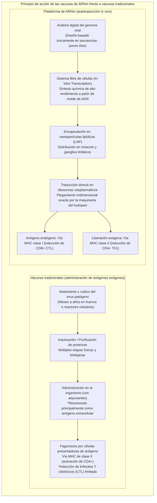
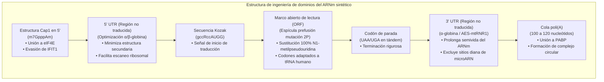
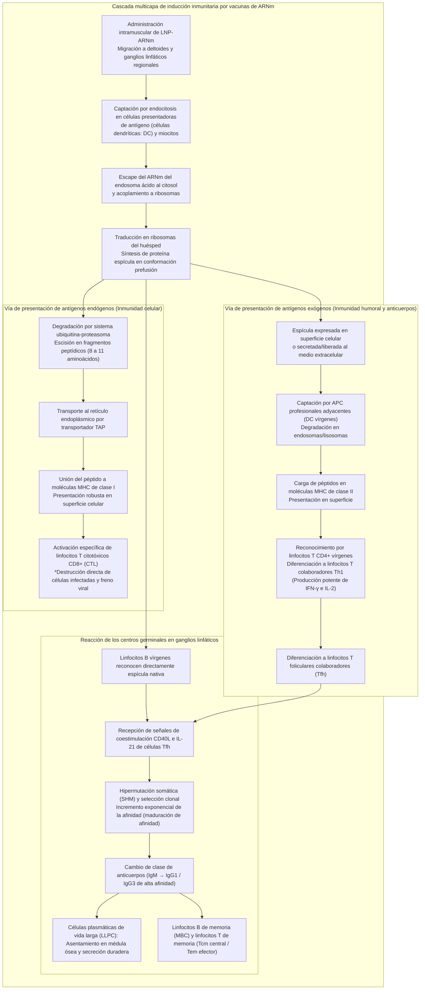
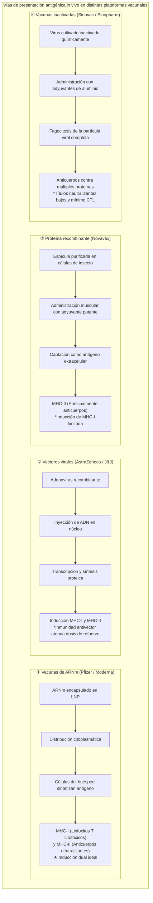

## Introducción: La revolución del ARNm —— Cómo una «molécula frágil» abrió paso al desarrollo vacunal más veloz de la humanidad

En enero de 2020, se publicó en línea la secuencia genómica completa (aproximadamente 30.000 nucleótidos) del SARS-CoV-2, el patógeno causante del brote de una infección respiratoria hasta entonces desconocida surgida en Wuhan, China. Tan solo 42 días después, la biotecnológica estadounidense Moderna despachó el primer lote clínico de su formulación vacunal «mRNA-1273» a los Institutos Nacionales de Salud (NIH). En paralelo, el equipo conjunto formado por BioNTech (Alemania) y Pfizer (EE. UU.) con «BNT162b2» completó ensayos clínicos a gran escala de fase III y obtuvo la Autorización de Uso de Emergencia (EUA) en apenas 11 meses: una velocidad fulgurante sin precedentes en los anales de la medicina.

El desarrollo clásico de vacunas —que exige el cultivo del virus en huevos embrionados de gallina o en biorreactores masivos de células para obtener virus atenuados, vacunas inactivadas o proteínas recombinantes— requería tradicionalmente entre **10 y 15 años** de prolongados trabajos experimentales y un desembolso económico astronómico. Esta lentitud constituía el paradigma inamovible de la industria farmacéutica.

La tecnología del ARNm derribó esos dogmas por completo. Su aportación fundamental consistió en redefinir la vacuna: ya no se trata de un «producto industrial manufacturado mediante el cultivo y la purificación externa de proteínas antigénicas», sino de una **«plataforma biotecnológica de base de datos que transfiere de manera temporal la plantilla de diseño del antígeno (código genético digital) a la maquinaria celular del huésped, convirtiendo el propio organismo en una fábrica endógena de antígenos»**.



### La transitoriedad del ARNm en el dogma central y la «imposibilidad de alteración genómica»

Frente a la inquietud social respecto a si «las vacunas de ARNm podrían modificar o integrarse en el genoma humano (ADN)», el principio fundamental de la biología molecular, el **Dogma Central**, ofrece una respuesta científica irrefutable.

En los organismos eucariotas, el flujo de la información genética discurre en una dirección estrictamente irreversible: **ADN (núcleo celular) → Transcripción → ARNm (exportación al citosol) → Traducción → Proteína (citoplasma)**. El ARNm exógeno administrado es captado en el citoplasma y traducido directamente por los ribosomas libres, generando la proteína espícula diana sin aproximarse al núcleo.
1. **Ausencia de señal de localización nuclear**: El ARNm sintético carece de secuencias de localización nuclear (NLS) necesarias para cruzar los complejos de poro nuclear, permaneciendo confinado en el citoplasma.
2. **Ausencia de retrotranscriptasa e integrasa**: Para transformar ARN en ADN e integrarlo en el genoma, se requiere la enzima transcriptasa inversa y una integrasa, maquinarias enzimáticas exclusivas de retrovirus como el VIH, inexistentes en las células somáticas humanas sanas (los experimentos de laboratorio bajo condiciones forzadas in vitro sobre el retrotransposón endógeno LINE-1 no han mostrado evidencia alguna de inserción genómica bajo condiciones fisiológicas in vivo).
3. **Degradación fisiológica acelerada**: El ARNm es una molécula intrínsecamente lábil; en cuestión de horas o pocos días es hidrolizado por completo hasta nucleótidos simples mediante ribonucleasas (RNasas) citoplasmáticas y reciclado en las rutas metabólicas celulares.

En definitiva, la vacuna de ARNm funciona como un **«mensaje transitorio autolimitado con temporizador de autodestrucción tras sintetizar la proteína»**, siendo biológicamente imposible que altere permanentemente el ADN del huésped.

---

## Capítulo 1: Cuarenta años de lucha y descubrimientos cruciales —— Los científicos que convirtieron el ARNm en medicina

La vertiginosa velocidad con la que se dispuso de estas vacunas en 2020 no fue un golpe de suerte repentino. Fue el fruto de más de cuatro décadas de investigaciones tenaces por parte de científicos que perseveraron frente al escepticismo académico y la escasez crónica de financiación. La concesión del Premio Nobel de Fisiología o Medicina en 2023 a la Dra. **Katalin Karikó** y al Dr. **Drew Weissman** supuso el justo reconocimiento a esta hazaña de la ciencia fundamental.

### 1.1 La barrera desalentadora de las investigaciones iniciales: inestabilidad y respuesta inmunitaria innata letal

Desde que en 1961 François Jacob, Sydney Brenner y sus colaboradores identificaron el ARN mensajero, la biología molecular albergó un anhelo: administrar ARNm exógeno para programar al organismo y sintetizar cualquier proteína terapéutica a voluntad.

Sin embargo, las tentativas de los años 1980 y 1990 colisionaron sistemáticamente contra dos obstáculos colosales:
- **Inestabilidad fisicoquímica extrema**: Los tejidos biológicos, el aire ambiente y la epidermis humana están saturados de **ribonucleasas (RNasas)**, enzimas extraordinariamente activas destinadas a neutralizar virus de ARN. El ARNm desnudo (*naked RNA*) inyectado era degradado en microsegundos antes de poder atravesar la membrana celular.
- **Respuesta destructiva del sistema inmunitario innato**: Cuando se lograba transferir suficiente ARNm intacto a modelos animales, el sistema inmunitario del huésped lo reconocía como un ARN viral hostil, desencadenando una tormenta masiva de citocinas inflamatorias. Los animales sufrían choques anafilactoides y una mortalidad elevada, lo que llevó a catalogar al ARNm como una «molécula inviable y excesivamente tóxica para uso terapéutico».

Pese a ver denegadas múltiples solicitudes de becas de investigación y sufrir descensos de categoría académica en la Universidad de Pensilvania, la bioquímica húngara Katalin Karikó mantuvo inquebrantable su convicción en el potencial del ARN.

### 1.2 El descubrimiento histórico de Karikó y Weissman (2005): evasión de receptores TLR mediante modificación de uridinas

En 1997, Karikó coincidió con el inmunólogo Drew Weissman, quien investigaba vacunas contra el VIH centradas en la capacidad presentadora de antígenos de las células dendríticas (DC). Ambos unieron fuerzas para dilucidar la interacción entre el ARNm y la activación inmunológica.

La cuestión crítica que formularon fue: **«¿Por qué el ARN de transferencia (ARNt) y el ARN ribosómico (ARNr) del propio mamífero no suscitan rechazo inmunitario, mientras que el ARNm transcrito in vitro (IVT) provoca una inflamación violenta en las células dendríticas?»**.

Las células de los mamíferos albergan sensores del sistema inmunitario innato llamados **receptores tipo Toll (Toll-like Receptors: TLR)** en membranas celulares y endosómicas:
- **TLR3**: Detecta ARN bicatenario (dsRNA).
- **TLR7 / TLR8**: Reconocen secuencias ricas en uridina (U) en ARN monocatenario (ssRNA).
- **RIG-I / MDA5**: Sensores citoplasmáticos que detectan ARN con trifosfato en el extremo 5' o dobles cadenas largas, desencadenando la producción de interferones de tipo I (IFN-α/β).

Karikó y Weissman repararon en las **bases químicas modificadas** que abundan de forma natural en el ARN eucariota. El ARNt y el ARNr sufren extensas metilaciones e isomerizaciones postranscripcionales, mientras que el ARNm sintético obtenido por IVT tradicional contenía exclusivamente las cuatro bases estándar no modificadas (A, C, G, U).

En 2005 publicaron un artículo histórico: **al sustituir la uridina (U) por su isómero natural, la pseudouridina (Ψ: pseudouridine), en la síntesis del ARNm, el reconocimiento por TLR7, TLR8 y otros sensores intracelulares se redujo drásticamente, aboliendo por completo la letal cascada inflamatoria.**

### 1.3 La evolución de la pseudouridina a la «N1-metilpseudouridina (m1Ψ)»

El hallazgo de Karikó y Weissman fue aún más trascendental: el ARNm modificado no solo evitaba la respuesta inmunotóxica, sino que su eficacia traduccional por los ribosomas se multiplicaba de forma exponencial.

Cuando un ARNm exógeno convencional con uridina ingresa en el citosol, los sensores inmunitarios inducen la activación de la **proteína cinasa R (PKR)** y de la **2'-5'-oligoadenilato sintetasa (OAS)**. La PKR fosforila el factor de iniciación **eIF2α**, bloqueando de raíz la traducción global de proteínas, mientras que la OAS activa a la **RNasa L**, la cual fragmenta indiscriminadamente el ARN celular como mecanismo de defensa antiviral.

La incorporación de pseudouridina evita la activación de estas enzimas de patrullaje celular, permitiendo que los ribosomas lean el mensaje de forma fluida, repetitiva y prolongada.

En la década de 2010, investigaciones impulsadas por BioNTech y Moderna refinaron esta modificación mediante el cribado de análogos, identificando la **«N1-metilpseudouridina (m1Ψ)»**, caracterizada por la adición de un grupo metilo en la posición N1 del anillo de la pseudouridina.
- La m1Ψ reduce la rigidez excesiva de las estructuras secundarias del ARN sin distorsionar el emparejamiento codón-anticodón en el centro decodificador del ribosoma.
- Atenúa al límite absoluto la afinidad por TLR7/TLR8 y, al reemplazar el 100% de las uridinas, dispara el rendimiento de traducción proteica in vivo.
Tanto la vacuna BNT162b2 (Pfizer/BioNTech) como la mRNA-1273 (Moderna) incorporaron la **sustitución completa (100%) por N1-metilpseudouridina**.

### 1.4 El hito de la estabilización de la proteína espícula: la «mutación 2P» de Barney Graham y Jason McLellan

Junto a la modificación del nucleósido y el vehículo lipídico, el tercer pilar que selló el éxito de las vacunas fue la estabilización de la estructura tridimensional de la proteína espícula mediante la **«mutación 2P» (sustitución de dos prolinas consecutivas)**.

La **glicoproteína de la espícula (S)** del SARS-CoV-2 sobresale en la superficie viral y media la unión al receptor humano ACE2. No obstante, la espícula es una máquina molecular metaestable que adopta dos conformaciones completamente dispares:
- **Conformación de prefusión (Prefusion Conformation)**: Estado nativo del trímero antes de fusionarse con la membrana del huésped. Expone ampliamente el dominio de unión al receptor (RBD), el blanco óptimo donde se unen los **anticuerpos neutralizantes más potentes**.
- **Conformación de posfusión (Postfusion Conformation)**: Estructura colapsada e irreversible con aspecto de aguja que se forma tras fusionar las membranas. Los anticuerpos dirigidos contra este estado exhiben una capacidad neutralizante muy reducida.

El Dr. **Barney Graham** (del Centro de Investigación de Vacunas del NIAID) y el Dr. **Jason McLellan** (Universidad de Texas en Austin) habían descubierto, estudiando los coronavirus del MERS y del SARS-CoV-1 mediante criomicroscopía electrónica, que la sustitución de dos aminoácidos situados en la bisagra de la hélice central (posiciones 986 y 987, lisina y valina) por **dos prolinas consecutivas (K986P y V987P)** impedía mecánicamente el colapso hacia la conformación de posfusión, **bloqueando rígidamente la espícula en su conformación de prefusión**.

Cuando se descifró el genoma del SARS-CoV-2 en enero de 2020, este conocimiento estructural se trasladó de inmediato. El ARNm vacunal codificó la proteína espícula con la mutación 2P, garantizando que el sistema inmunitario fuese entrenado frente a la forma tridimensional más infecciosa y con los epítopos neutralizantes óptimos.

---

## Capítulo 2: Arquitectura de precisión de la molécula de ARNm —— Ingeniería de diseño del ARNm sintético

El ARNm terapéutico no es una copia burda de la secuencia viral. Es un **biopolímero sintético de alta precisión (Engineered Biopolymer)** en el que cada uno de sus dominios ha sido optimizado a nivel atómico para maximizar la afinidad por los ribosomas y programar con exactitud su cinética de degradación.



### 2.1 Estructura del capuchón 5' (De Cap0 a Cap1): Autorreconocimiento celular e inicio de la traducción

En el extremo 5' del ARNm eucariota se halla la estructura del **casquete de 7-metilguanosina (m7G Cap)**. La pureza y el grado de metilación de este capuchón son determinantes en el ARN sintético:
- **Estructura Cap0 (m7GpppN)**: Es la forma más básica. En el citosol es reconocida por el sensor antiviral **IFIT1 (Interferon-induced protein with tetratricopeptide repeats 1)** como ARN foráneo, bloqueando el ensamblaje de ribosomas.
- **Estructura Cap1 (m7GpppNm)**: Presenta una metilación adicional en el oxígeno 2' de la ribosa del primer nucleótido transcrito (2'-O-metilación). Es la marca distintiva del ARNm eucariota maduro y escapa a la detección por IFIT1.

En las vacunas autorizadas se utilizan reactivos cotranscripcionales avanzados (como CleanCap®) que logran incorporar la **estructura Cap1 auténtica con una pureza superior al 95%**. Esta conformación atrae con gran avidez al factor de iniciación **eIF4E** (componente del complejo eIF4F), permitiendo el reclutamiento inmediato de la subunidad ribosomal 40S.

### 2.2 Optimización de las regiones no traducidas 5' y 3' (UTR)

Las regiones flanqueantes que no se traducen en proteína, la **5' UTR** y la **3' UTR**, dirigen la estabilidad física del ARNm y modulan la velocidad de lectura ribosomal.
- **Ingeniería de la 5' UTR**: Estructuras secundarias complejas (horquillas o cuartetos de guanina G-quadruplex) actúan como frenos mecánicos que entorpecen el avance del ribosoma. Por ello, se diseñan secuencias desprovistas de trabas estéricas, inspiradas en los genes de alta expresión de las globinas humanas (**α-globina y β-globina**).
- **Ingeniería de la 3' UTR**: Esta región regula la susceptibilidad a las exonucleasas y la desadenilación. Se seleccionan secuencias (como quimeras del gen de α-globina murina o combinaciones de secuencias potenciadoras AES y ARN ribosómico mitocondrial mtRNR1) que carecen deliberadamente de secuencias diana reconocibles por microARN endógenos (miRNA), previniendo el silenciamiento génico accidental.

### 2.3 Marco abierto de lectura (ORF) y optimización de codones

El marco de lectura abierto que codifica la proteína de la espícula es sometido a una profunda **optimización de codones (Codon Optimization)** bioinformática.

Dada la degeneración del código genético, múltiples codones sinónimos codifican el mismo aminoácido. El uso de codones en el SARS-CoV-2 difiere sustancialmente del sesgo preferencial de las células humanas:
1. **Sintonía con el repertorio de ARNt humano**: Al sustituir codones infrecuentes por aquellos emparejados con los ARNt más abundantes del citosol humano, se elimina el tiempo de espera del ribosoma, maximizando la tasa de elongación de la cadena polipeptídica.
2. **Enriquecimiento del contenido GC**: El incremento estratégico de la proporción de pares guanina-citosina (GC) confiere mayor estabilidad termodinámica a la cadena, a la vez que destruye señales crípticas de corte y empalme (*splicing*) y secuencias prematuras de poliadenilación.
3. **Erradicación de subproductos bicatenarios (dsRNA)**: Durante la transcripción in vitro, la ARN polimerasa T7 puede generar trazas de ARN de doble cadena por retroceso transcripcional. Estos contaminantes se minimizan mediante diseño de secuencia y se eliminan rigurosamente mediante cromatografía líquida de alta resolución (HPLC).

### 2.4 Cola poli(A) (Poly-A Tail) y el «modelo de lazo cerrado»

La extensión homopolimérica de adeninas en el extremo 3', la **cola poli(A)**, actúa como el temporizador vital de la molécula de ARNm.
- La cola poli(A) es reconocida por la **proteína de unión a poli(A) (PABP)**.
- El extremo 3' unido a PABP interactúa directamente con el factor eIF4G anclado al casquete 5', adoptando una estructura circularizada conocida como **«modelo de lazo cerrado (Closed-Loop Model)»**.
- Este lazo confiere dos beneficios cruciales: protege ambos extremos de la degradación por exonucleasas y permite que los ribosomas que alcanzan el codón de terminación sean inmediatamente transferidos de nuevo al codón de inicio 5', traduciendo cientos de copias de la espícula a partir de una única molécula de ARNm. Las formulaciones clínicas incorporan colas de longitud definida y calibrada de entre 100 y 120 nucleótidos.

---

## Capítulo 3: Vehículos para franquear las barreras biológicas —— Ingeniería de nanopartículas lipídicas (LNP)

Por extraordinario que sea el diseño de un ARNm, este resulta clínicamente inútil sin un vehículo que lo transporte indemne al interior del citoplasma diana. La proeza bioingenieril que hizo viable este tratamiento fue la concepción de las **nanopartículas lipídicas (Lipid Nanoparticles: LNP)**, vesículas de 80 a 100 nanómetros de diámetro.

### 3.1 Por qué el ARNm desnudo (Naked RNA) no puede administrarse directamente

La inyección de ARNm desnudo en el músculo ofrece una eficacia inmunológica prácticamente nula por dos barreras infranqueables:
1. **Repulsión electrostática de cargas negativas**: El esqueleto de fosfodiéster del ARNm posee una elevada densidad de carga negativa (aniónica). La membrana celular de las células humanas, recubierta de cabezas polares de fosfolípidos y cadenas de carbohidratos (glucocáliz), también está cargada negativamente, lo que genera una intensa repulsión electrostática que impide el paso libre del ácido nucleico.
2. **Degradación fulminante por RNasas tisulares**: Los fluidos intersticiales albergan ribonucleasas que degradan el ARNm libre en cuestión de minutos.

Se requería imperativamente un «caballo de Troya nanoscópico» capaz de blindar la carga eléctrica del ARNm, transportarlo a través de las membranas y liberarlo intacto en el citoplasma.

### 3.2 El papel y la estructura química de los «cuatro lípidos dorados» de las LNP

Las nanopartículas lipídicas de las vacunas autorizadas (Pfizer/BioNTech y Moderna) están ensambladas mediante una mezcla estequiométrica de **cuatro componentes lipídicos**:

```
【Los 4 lípidos cardinales de las LNP】
1. Lípido catiónico ionizable (Ionizable Cationic Lipid) 〜 46-50 mol%
2. Fosfolípido auxiliar (Helper Lipid: DSPC) 〜 10 mol%
3. Colesterol (Cholesterol) 〜 38-43 mol%
4. Lípido PEGilado (PEGylated Lipid) 〜 1,5-1,7 mol%
```

| Componente lipídico | Molécula empleada (Pfizer / Moderna) | Proporción (mol%) | Propiedades fisicoquímicas | Función fisiológica esencial in vivo |
| :--- | :--- | :--- | :--- | :--- |
| **Lípido ionizable<br/>(Ionizable Lipid)** | **ALC-0315** (Pfizer)<br/>**SM-102** (Moderna) | **~ 46 - 50%** | pKa aparente de **6,0 a 6,8**. Cationico en medio ácido, neutro a pH fisiológico. Posee aminas terciarias y enlaces éster biodegradables. | ① A pH ácido se une electrostáticamente al ARNm aniónico y lo condensa en el núcleo de la nanopartícula.<br/>② A pH fisiológico (7,4) en sangre se neutraliza, evitando citotoxicidad y lisis celular.<br/>③ Se protona en el endosoma ácido, desestabilizando la membrana para permitir el escape citoplasmático. |
| **Fosfolípido auxiliar<br/>(Helper Lipid)** | **DSPC**<br/>(1,2-distearoil-sn-glicero-3-fosfocolina) | **~ 10%** | Fosfolípido saturado con alta temperatura de transición de fase (~55 °C). Geometría molecular cilíndrica. | Forma una bicapa lipídica lamelar estable en la periferia de la LNP, otorgando rigidez estructural y preservando la morfología esférica. |
| **Colesterol<br/>(Cholesterol)** | Colesterol purificado de origen vegetal | **~ 38 - 43%** | Esqueleto esteroideo rígido con un pequeño grupo hidroxilo polar. Agente de empaquetamiento de membrana. | Rellena los intersticios entre fosfolípidos, ajustando la fluidez y el comportamiento de fase. Favorece la fusión con membranas biológicas y previene fugas de ARNm. |
| **Lípido PEGilado<br/>(PEGylated Lipid)** | **ALC-0159** (Pfizer)<br/>**PEG2000-DMG** (Moderna) | **~ 1,5 - 1,7%** | Cadena hidrofílica de polietilenglicol unida a un anclaje lipídico (dimiristilglicerol). | ① Evita la agregación espontánea durante la fabricación y el almacenamiento, fijando el tamaño de partícula (~80 nm).<br/>② Previene la opsonización inespecífica por proteínas séricas, extendiendo la semivida tisular.<br/>③ Se desprende progresivamente in vivo para permitir la captación celular. |

### 3.3 Endocitosis y la maravilla del escape endosómico (Endosomal Escape)

Tras la inyección intramuscular, el proceso que determina el éxito de la traducción es el **escape endosómico (Endosomal Escape)** al citosol celular:

1. **Adsorción de apolipoproteínas y captación celular**:
   Al contactar con los fluidos tisulares, las LNP absorben en su superficie la **apolipoproteína E (ApoE)** presente en el organismo. La partícula es reconocida por los **receptores de lipoproteínas de baja densidad (LDLR)** expresados en células dendríticas, macrófagos y células musculares, desencadenando su internalización mediante endocitosis mediada por receptor en vesículas llamadas endosomas.
2. **Acidificación del endosoma**:
   A medida que el endosoma temprano madura a endosoma tardío, las bombas de protones de su membrana (V-ATPasa) bombean iones $H^+$, reduciendo el pH interno de 7,4 a valores inferiores a 5,5.
3. **Inversión de carga y efecto esponja de protones**:
   Al descender el pH por debajo de su pKa (6,0-6,8), los lípidos ionizables aceptan protones masivamente, transformándose de moléculas neutras en **especies fuertemente policatiónicas**.
4. **Fusión de membrana y liberación citosólica**:
   Los lípidos catiónicos interactúan con los lípidos aniónicos de la cara interna del endosoma (como la fosfatidilserina), induciendo una transición de fase estructural hacia la conformación no bicapa llamada **fase hexagonal inversa ($H_{II}$)**. Esta distorsión molecular genera poros en la membrana endosómica que, combinados con la presión osmótica interna, permiten que el **ARNm sea expulsado intacto al citoplasma**, poniéndose de inmediato a disposición de los ribosomas.

Diversos estudios nanobiológicos demuestran que solo entre un **2% y un 15%** del ARNm internalizado logra escapar eficazmente del endosoma. Sin embargo, debido a la alta productividad de los ribosomas al procesar ARNm optimizado, esa fracción es suficiente para desencadenar una producción masiva de proteína espícula y generar una respuesta inmunitaria sinérgica.

### 3.4 Tecnología de mezcla microfluídica (Microfluidic Formulation)

La producción masiva y homogénea de estas nanopartículas a escala industrial se apoya en la **microfluídica (Microfluidics)**.

Los métodos convencionales basados en homogeneizadores producían vesículas heterogéneas (polidispersas) con baja tasa de encapsulación. Las plantas modernas emplean chips microfluídicos con canales micrométricos donde se hacen colisionar a velocidades controladas de metros por segundo dos fases: una **fase orgánica alcohólica** (los 4 lípidos disueltos en etanol) y una **fase acuosa ácida** (ARNm disuelto en tampón de citrato a pH bajo).

La mezcla instantánea reduce abruptamente la solubilidad del etanol, induciendo el autoensamblaje molecular espontáneo. Los lípidos ionizables protonados forman un núcleo electrostático condensado con el ARNm, mientras que el colesterol, la DSPC y el lípido PEGilado se orientan hacia la superficie. Este proceso continuo permite obtener en milisegundos partículas con un diámetro homogéneo de 80 a 100 nm, una **eficiencia de encapsulación superior al 90%** y un índice de polidispersión extraordinariamente estrecho (PDI < 0,1).

---

## Capítulo 4: Cascada inmunitaria estratificada —— De la traducción citoplasmática al establecimiento de la inmunidad sistémica

La superioridad inmunogénica de las vacunas de ARNm frente a las vacunas inactivadas o de subunidades radica en su **presentación antigénica dual simultánea (activación concurrente de las vías del MHC clase I y clase II)**.



### 4.1 Captación y alta expresión en tejido muscular local y ganglios linfáticos de drenaje

Tras la punción en el músculo deltoides, una fracción sustancial de las LNP drena por los conductos linfáticos hacia los ganglios axilares regionales en cuestión de horas.
- Aunque las fibras musculares locales traducen el ARNm y exponen la proteína espícula en su sarcolema, el motor inmunológico primordial son las **células presentadoras de antígeno profesionales (APC)**: las células dendríticas (DC) y los macrófagos residentes en los ganglios linfáticos.
- Dentro de las DC, la espícula se sintetiza incorporando los plegamientos y patrones de glucosilación exactos del huésped, formando trímeros nativos idénticos a los del virión salvaje.

### 4.2 La vía del MHC clase I y la inducción determinante de linfocitos T citotóxicos (CD8+ CTL)

Las vacunas convencionales basadas en proteínas purificadas administran el antígeno desde el medio extracelular, por lo que casi no logran alimentar la vía del MHC clase I; carecen, por ende, de la capacidad de adiestrar **linfocitos T citotóxicos (CD8+ CTL)** capaces de destruir las células infectadas.

El ARNm rompe esta barrera porque hace que el antígeno se **sintetice en el interior mismo del citoplasma**:
1. **Degradación proteosómica**: Una fracción de las proteínas sintetizadas es marcada por ubiquitina y procesada por el complejo enzimático del **proteosoma** en oligopéptidos de 8 a 11 aminoácidos.
2. **Translocación por TAP**: Los péptidos resultantes son translocados activamente al lumen del retículo endoplásmico por el transportador **TAP (Transporter associated with Antigen Processing)**.
3. **Carga en moléculas MHC de clase I**: Los fragmentos peptídicos se insertan en la hendidura de unión de los heterodímeros del **MHC de clase I (HLA-A, HLA-B, HLA-C)** y viajan a través del aparato de Golgi hasta exponerse en la membrana plasmática.
4. **Activación de linfocitos T citotóxicos**: Los linfocitos T CD8+ vírgenes reconocen este complejo mediante su receptor de células T (TCR). En concurrencia con señales coestimuladoras (CD80/CD86 con CD28), se activan y proliferan clonalmente como **linfocitos T citotóxicos efectores (CTL)**.

Esta potente respuesta de CTL constituyó el escudo protector indispensable que evitó hospitalizaciones y muertes cuando emergieron variantes que evadían los anticuerpos neutralizantes.

### 4.3 La vía del MHC clase II y la inducción de linfocitos T colaboradores Th1

Simultáneamente, las células que expresan la espícula secretan porciones de la misma al exterior o la liberan tras apoptosis celular:
- Las células dendríticas adyacentes capturan estos antígenos exógenos por macropinocitosis y los degradan enzimáticamente en endosomas y lisosomas.
- Péptidos más largos (de 13 a 18 aminoácidos) son cargados en moléculas del **MHC de clase II (HLA-DR, HLA-DQ, HLA-DP)** y presentados a los linfocitos T CD4+ vírgenes.
- La activación concurrente del sistema innato por las LNP sesga la diferenciación de estas células hacia un perfil **Th1 (linfocitos T colaboradores tipo 1)** caracterizado por la liberación de interferón gamma (IFN-γ) e interleucina 2 (IL-2). Este perfil Th1 puro fue determinante para erradicar el riesgo de inmunopatologías de hipersensibilidad alérgica de tipo Th2.

### 4.4 Formación extraordinaria del centro germinal (Germinal Center) y maduración de la afinidad de células B

El fenómeno más relevante para la memoria inmunológica duradera inducida por el ARNm es la génesis y la preservación prolongada de los **centros germinales (Germinal Centers: GC)** en los ganglios linfáticos:
1. **Reconocimiento del antígeno nativo intacto**: Los linfocitos B vírgenes en los folículos linfáticos contactan directamente con trímeros de espícula tridimensionales íntegros mediante su receptor de célula B (BCR).
2. **Ayuda de los linfocitos T foliculares colaboradores (Tfh)**: Los linfocitos B migran al centro germinal, donde reciben señales de supervivencia e instrucción mediante el ligando CD40 (CD40L) e interleucina-21 (IL-21) producidas por los linfocitos Tfh.
3. **Hipermutación somática (SHM) y maduración de la afinidad**:
   - En la zona oscura (Dark Zone) del centro germinal, la enzima citidina desaminasa inducida por activación (AID) introduce mutaciones puntuales a un ritmo astronómico en los genes de la región variable de los anticuerpos.
   - En la zona clara (Light Zone), los clones mutantes compiten intensamente por unirse a los antígenos exhibidos por las células dendríticas foliculares (FDC).
   - Solo aquellos linfocitos B cuyas mutaciones aumentan de forma superlativa la afinidad química por la espícula reciben señales de supervivencia de las células Tfh; los clones de baja afinidad son eliminados por apoptosis.
4. **Conmutación de clase y células plasmáticas de vida larga (LLPC)**:
   - Se activa la recombinación para cambiar el isotipo de IgM inicial hacia **anticuerpos IgG de altísima afinidad (fundamentalmente IgG1 e IgG3)**, con gran capacidad neutralizante y citotóxica dependiente de anticuerpos (ADCC).
   - Los clones seleccionados más sobresalientes se diferencian en **células plasmáticas de vida larga (LLPC: Long-Lived Plasma Cells)** que migran a nichos estromales de la médula ósea, bombeando miles de moléculas de anticuerpos neutralizantes por segundo durante meses.
   - Otro contingente se convierte en **linfocitos B de memoria (MBC)**, prestos a proliferar de inmediato ante una reinfección futura.

Estudios mediante biopsias de ganglios linfáticos humanos confirmaron que los centros germinales inducidos por las vacunas de ARNm se mantuvieron activos durante **más de seis meses tras la vacunación inicial**, una persistencia biológica sin parangón en vacunas no replicativas.

---

## Capítulo 5: Evidencia clínica, dinámica de la eficacia y confrontación con las variantes

### 5.1 Los resultados de los ensayos clínicos de fase III: el impacto del 95% de eficacia protectora

A finales de 2020, las publicaciones en el *New England Journal of Medicine (NEJM)* de los ensayos de fase III de Pfizer/BioNTech (Polack et al.) y Moderna (Baden et al.) conmocionaron a la comunidad científica internacional:
- **BNT162b2 (Pfizer/BioNTech, 43.448 participantes)**: Se registraron 162 casos confirmados de COVID-19 en el grupo placebo frente a tan solo 8 casos en el grupo vacunado, lo que arrojó una **eficacia vacunal del 95,0% (IC 95%: 90,3–97,6%)**. En casos graves, se observaron 9 en el grupo placebo frente a solo 1 en el vacunado.
- **mRNA-1273 (Moderna, 30.420 participantes)**: Se contabilizaron 185 casos de COVID-19 sintomático en el grupo placebo (30 graves y 1 fallecimiento) frente a 11 casos en el grupo vacunado (0 graves), acreditando una **eficacia protectora del 94,1% (IC 95%: 89,3–96,8%)** y un 100% de eficacia frente a hospitalización y muerte.

La OMS y la FDA habían fijado un umbral mínimo del 50% de eficacia para conceder la autorización. En comparación con las vacunas antigripales estacionales, cuya eficacia suele oscilar entre el 40% y el 60%, un resultado del 95% supuso una victoria científica que pulverizó todos los pronósticos conservadores.

### 5.2 Interpretación estadística: Reducción del Riesgo Relativo (RRR) frente a Reducción del Riesgo Absoluto (ARR)

Surgieron debates públicos motivados por lecturas erróneas de la bioestadística, alegando que «el 95% era solo una reducción relativa (RRR) y que la reducción del riesgo absoluto (ARR) era inferior al 1%, por lo que la vacuna no funcionaba».

Es imperativo clarificar estos dos conceptos matemáticos:
- **RRR (Reducción del Riesgo Relativo)**: Compara la incidencia en el grupo placebo ($I_p$) con la del grupo vacunado ($I_v$).
  $$RRR = \frac{I_p - I_v}{I_p} \times 100\% = \frac{0,0088 - 0,0004}{0,0088} \approx 95\%$$
  Este índice mide de forma estricta la **eficacia biológica e inmunológica intrínseca** de la vacuna para impedir la enfermedad frente a la exposición al virus.
- **ARR (Reducción del Riesgo Absoluto)**: Representa la diferencia aritmética de enfermos observados en toda la cohorte durante el período acotado del ensayo.
  $$ARR = I_p - I_v \approx 0,88\% - 0,04\% = 0,84\%$$
- **Realidad epidemiológica**:
  La ARR depende por completo de la **tasa de ataque comunitaria (incidencia de fondo)** durante el ensayo. Si se evalúa una vacuna durante un lapso breve en una sociedad con escasa circulación viral, la ARR será matemáticamente inferior al 1% con cualquier fármaco imaginable. Si la epidemia se expande y el 20% de la población se infecta, la ARR escala automáticamente a $20\% \times 95\% = 19\%$. Pretender descalificar la eficacia vacunal por un valor bajo de ARR en un ensayo acotado refleja una confusión entre la potencia biológica protectora y la probabilidad de exposición ambiental.

### 5.3 Evidencia en el mundo real (Real-World Evidence, RWE): lo que revelaron los datos a escala nacional

Cuando la vacunación se extendió a cientos de millones de personas con perfiles diversos (ancianos frágiles, pacientes trasplantados, pluripatologías complejas), los datos epidemiológicos de naciones pioneras como **Israel (cohorte de 1,2 millones emparejados de Clalit Health Services, Dagan et al., NEJM 2021)**, Reino Unido (UKHSA) y EE. UU. (CDC) confirmaron tres lecciones capitales:
1. **Control extraordinario de las cepas iniciales**: Frente a la cepa de Wuhan y la variante Alfa, la efectividad real superó el 90% contra infección sintomática y el 95% frente a hospitalización y muerte.
2. **Disminución temporal de la protección contra la infección leve**: Pasados 4 a 6 meses de la segunda dosis, la titulación de anticuerpos neutralizantes en sangre decae conforme a su cinética biológica, reduciendo la protección contra la infección sintomática leve al 60-70%.
3. **Preservación sólida de la protección frente a enfermedad grave**: La protección frente a hospitalización, ventilación mecánica y muerte se mantuvo en niveles superiores al 85-90% a largo plazo. Aunque los anticuerpos circulantes disminuyen, las células B de memoria proliferan con rapidez ante un recontacto y, crucialmente, la **inmunidad celular mediada por linfocitos T CD8+** neutraliza el avance del virus en el parénquima pulmonar.

### 5.4 Olas de variantes y escape inmunitario: disminución de anticuerpos neutralizantes y robustez de los linfocitos T

La constante replicación mundial del SARS-CoV-2 impulsó la acumulación de mutaciones que eludían selectivamente los anticuerpos neutralizantes.

| Linaje de variante | Principales mutaciones (RBD y espícula) | Sensibilidad a anticuerpos neutralizantes | Eficacia contra infección (2 dosis) | Eficacia contra enfermedad grave (2 dosis) | Impacto de dosis de refuerzo (Booster) |
| :--- | :--- | :--- | :--- | :--- | :--- |
| **Cepa ancestral de Wuhan<br/>(Wuhan-Hu-1)** | Referencia base (sin mutaciones) | **1,0x** (referencia) | **~ 95%** | **> 95%** | Incremento sustancial de títulos por encima de la línea base |
| **Variante Alfa<br/>(Alpha: B.1.1.7)** | N501Y, P681H | **Disminución leve (1,5 - 2x)** | **~ 85 - 90%** | **~ 95%** | Mantenimiento de altísima protección en todos los desenlaces |
| **Variante Delta<br/>(Delta: B.1.617.2)** | L452R, T478K, P681R | **Reducción de 3 a 6x** | **~ 60 - 75%** (decae con el tiempo) | **~ 90%** | El refuerzo restablece la prevención sintomática a >85% |
| **Ómicron BA.1 / BA.2<br/>(Omicron inicial)** | >15 mutaciones en RBD<br/>(K417N, E484A, N501Y, etc.) | **Caída drástica (20 a 40x)** | **~ 20 - 40%** (marcada caída con 2 dosis) | **~ 70 - 80%** (preservada por linfocitos T) | El refuerzo eleva la eficacia sintomática al 65-75% y la grave a >90% |
| **Ómicron BA.4 / BA.5<br/>y linajes XBB / JN.1** | L452R, F486V/P, R346T<br/>Escape extremo y afinidad a ACE2 | **Pérdida casi total de unión humoral inicial** | **Prácticamente nula frente a contagio** | **~ 60 - 70%** (sostenida por inmunidad basal) | Vacunas actualizadas bivalentes o monovalentes (XBB.1.5/JN.1) restablecen neutralización y elevan protección grave a >80% |

El advenimiento de Ómicron supuso una fractura entre la protección frente a la infección y la protección frente al desenlace fatal. La espícula de Ómicron albergaba más de 30 sustituciones de aminoácidos, de las cuales 15 se concentraban en el RBD, desbaratando la unión de gran parte de los anticuerpos neutralizantes circulantes.

Sin embargo, emergió con fuerza la **resiliencia de la inmunidad celular de los linfocitos T**:
- Los anticuerpos neutralizantes dependen de epítopos conformacionales específicos en áreas muy localizadas del RBD; mutaciones discretas en esos puntos bloquean su acoplamiento.
- En cambio, los linfocitos T reconocen **epítopos lineales de péptidos cortos** distribuidos a lo largo de toda la extensión de la espícula (1.273 aminoácidos).
- Como cada persona expresa un repertorio único de alelos HLA, era evolutivamente imposible que el virus mutase simultáneamente todos los epítopos T reconocibles por la especie humana.
- Los consorcios de investigación demostraron que **entre el 80% y el 90% de los epítopos reconocidos por los linfocitos T CD4+ y CD8+ permanecían intactos en las variantes Ómicron**. Gracias a ello, pese al aumento colosal de contagios en todo el planeta, las tasas de ingreso en UCI y mortalidad se desplomaron en las poblaciones inmunizadas con vacunas de ARNm.

### 5.5 Dosis de refuerzo (Boosters) y diseño de vacunas adaptadas a variantes

Ante el decaimiento humoral y las nuevas variantes, la plataforma de ARNm hizo valer su rasgo más determinante: la **agilidad modular**:
1. **Refuerzo homólogo (3.ª dosis)**: La administración de una dosis adicional de la formulación original reactivó los centros germinales, desencadenando una nueva ronda de maduración de afinidad que generó anticuerpos con reactividad cruzada capaces de neutralizar a Ómicron.
2. **Vacunas bivalentes**: Se combinó en proporción 1:1 el ARNm de la cepa de Wuhan con el de Ómicron (BA.1 o BA.4/BA.5), ampliando el espectro de reconocimiento antigénico.
3. **Formulaciones monovalentes adaptadas (XBB.1.5, JN.1)**: Para mitigar el sesgo inmunitario previo (*imprinting* antigénico o pecado original antigénico), se prescindió de la cepa ancestral, actualizando el vector únicamente con la secuencia de la variante dominante. Gracias a que el proceso productivo depende solo de modificar la plantilla digital de ADN, estos lotes adaptados se formularon y escalaron industrialmente en cuestión de 8 a 10 semanas.

---

## Capítulo 6: Perfil de seguridad, fisiopatología de reacciones adversas y balance riesgo-beneficio

Como cualquier intervención farmacológica o biológica a escala planetaria, la administración masiva de vacunas de ARNm conlleva tanto beneficios incontrovertibles como eventos adversos documentados. La integridad científica exige diseccionar la fisiopatología de estos efectos con rigurosa objetividad cuantitativa.

### 6.1 Reactogenicidad local y sistémica: el coste fisiológico del encendido inmunitario

Los síntomas locales frecuentes (dolor, eritema, edema en el lugar de la inyección) y sistémicos (fiebre superior a 38 °C, astenia, cefalea, mialgias, artralgias y escalofríos) no traducen daño lesivo, sino la **respuesta fisiológica inherente a la activación del sistema inmunitario innato**:
- Las LNP y los primeros niveles de antígeno estimulan en los macrófagos y células dendríticas locales la secreción transitoria de citocinas proinflamatorias como **IL-1β, IL-6, TNF-α e interferones de tipo I (IFN-α/β)**.
- Estas moléculas alcanzan la circulación sistémica y estimulan el centro termorregulador del hipotálamo, elevando la temperatura corporal y provocando mialgias reflejas.
- Estos síntomas remiten espontáneamente en un plazo de 24 a 48 horas y son manejables con antipiréticos y analgésicos habituales como el paracetamol o el ibuprofeno.

### 6.2 Miocarditis y pericarditis: epidemiología y mecanismos fisiopatológicos propuestos

Los sistemas mundiales de farmacovigilancia (VAERS, VSD en EE. UU., los registros del Ministerio de Salud de Israel y los comités europeos) detectaron una señal de seguridad específica: una incidencia muy baja pero demostrada de **miocarditis y pericarditis**, con un claro predominio en **varones jóvenes y adolescentes de entre 12 y 29 años**, preferentemente en los 2 a 4 días posteriores a la segunda dosis.

#### ① Frecuencia epidemiológica
- La incidencia global es extraordinariamente reducida: de **1 a 5 casos por cada 100.000 dosis administradas**.
- En el grupo de mayor vulnerabilidad (**varones de 16 a 19 años tras la segunda dosis**), la tasa alcanza aproximadamente **10 a 15 casos por cada 100.000 dosis (0,01%)**.
- Se constató una tasa ligeramente superior con la vacuna de Moderna (100 µg de ARNm) en comparación con la de Pfizer (30 µg), reflejando un efecto dependiente de la dosis de ARNm y lípido, lo que motivó que varios países prefirieran la formulación de Pfizer para varones menores de 30 años.

#### ② Mecanismos fisiopatológicos moleculares postulados
La investigación biomédica apunta a una confluencia de factores:
1. **Espícula libre no neutralizada e inmunocomplejos**: Investigadores del Hospital General de Massachusetts (Yonker et al., *Circulation* 2023) detectaron en varones jóvenes con miocarditis posvacunal concentraciones mensurables de «proteína espícula libre» no unida a anticuerpos neutralizantes, la cual podría interactuar con receptores endoteliales e inmunitarios en el miocardio.
2. **Influencia de las hormonas sexuales**: La marcada predisposición masculina apunta a la testosterona, hormona que promueve la diferenciación Th1 y la polarización de macrófagos proinflamatorios, mientras que los estrógenos ejercen un efecto protector y antiinflamatorio en el tejido cardíaco.
3. **Mimetismo o reactividad autoinmune transitoria**: Inducción de autoanticuerpos reactivos de forma cruzada contra proteínas contráctiles del cardiomiocito, como la α-miosina.

#### ③ Curso clínico y comparación con el riesgo por infección viral
Es indispensable contextualizar dos realidades médicas:
- **Más del 90% de los casos de miocarditis posvacunal cursan de forma leve**, resolviéndose clínicamente en pocos días tras tratamiento conservador con antiinflamatorios no esteroideos (AINE) y reposo, con recuperación completa de la fracción de eyección cardíaca.
- **El riesgo de sufrir miocarditis, arritmias graves, infarto o insuficiencia cardíaca aguda derivado de la infección natural por SARS-CoV-2 es entre 5 y 15 veces superior al riesgo asociado a la vacunación**, incluso en varones jóvenes. Las agencias reguladoras (CDC, EMA) determinaron de manera unánime que el balance riesgo-beneficio sigue siendo claramente favorable a la vacunación, al prevenir las secuelas multiorgánicas de la infección aguda y la COVID persistente (*Long COVID*).

### 6.3 Anafilaxia y alergia al polietilenglicol (PEG)

La incidencia de anafilaxia inmediata tras la inoculación es de aproximadamente **2 a 5 casos por millón de dosis**, cifra ligeramente superior a la observada con la vacuna de la gripe (~1 por millón), pero excepcionalmente infrecuente.
- El agente causal es el **PEG2000 (polietilenglicol)** que recubre la superficie de las LNP, desencadenando reacciones mediadas por anticuerpos preexistentes anti-PEG (IgE) o mediante el fenómeno de pseudoalergia asociada a la activación del complemento (CARPA).
- Dicha sensibilización previa se atribuye al empleo habitual de PEG en cosméticos, dentífricos y fármacos laxantes.
- Los protocolos de observación obligatoria de 15 a 30 minutos y la disponibilidad inmediata de adrenalina intramuscular (*EpiPen*) permitieron tratar todos los episodios sin fallecimientos registrados.

### 6.4 Diferencias mecanísticas con las vacunas de vector adenoviral (TTS/VITT)

Las vacunas basadas en vectores adenovirales no replicativos (AstraZeneca ChAdOx1-S y Johnson & Johnson Ad26.COV2.S) sufrieron restricciones tras vincularse al **síndrome de trombosis con trombocitopenia (TTS / VITT)**, caracterizado por trombosis venosas cerebrales o abdominales atípicas con descenso de plaquetas en mujeres jóvenes.
- **Fisiopatología de VITT**: Ciertas proteínas de la cápside del adenovirus se unen con alta afinidad al factor plaquetario 4 (PF4), formando agregados macromoleculares que inducen autoanticuerpos similares a los observados en la trombocitopenia inducida por heparina (HIT), desencadenando coagulación intravascular masiva.
- **Seguridad diferencial del ARNm**: Las vacunas de ARNm utilizan cápsulas lipídicas sintéticas inertes sin cápsides virales proteicas y no interactúan con el PF4. En consecuencia, **el riesgo de VITT/TTS con vacunas de ARNm es inexistente**.

### 6.5 Evaluación de ADE (potenciación dependiente de anticuerpos) y VAED (enfermedad agravada asociada a la vacuna)

Históricamente, vacunas candidatas frente al dengue o los modelos de vacuna inactivada contra el virus respiratorio sincitial (FI-RSV) en la década de 1960 provocaron cuadros de **enfermedad agravada dependiente de anticuerpos (ADE / VAED)**: anticuerpos no neutralizantes o subneutralizantes se unían al patógeno facilitando su internalización en macrófagos vía receptores Fcγ, o desencadenaban inflamaciones alérgicas de tipo Th2 destructivas.

Pese a los temores iniciales, **en los miles de millones de dosis administradas en el planeta no se ha observado indicio alguno de ADE ni de VAED con las vacunas de ARNm**. Las razones científicas son claras:
1. **Anticuerpos puramente neutralizantes de alta afinidad**: La mutación 2P garantizó que la respuesta humoral madurase frente a la conformación de prefusión funcional, maximizando los anticuerpos neutralizantes de bloqueo estérico directo.
2. **Respuesta inmunológica sesgada a Th1**: La formulación LNP-ARNm promueve una polarización Th1 pura (con IFN-γ), anulando los perfiles Th2 dominados por eosinófilos que subyacen a los fenómenos de VAED.

| Evento adverso | Incidencia estimada | Momento de aparición | Mecanismo fisiopatológico primordial | Manejo clínico y pronóstico |
| :--- | :--- | :--- | :--- | :--- |
| **Reacción local** (dolor, eritema, edema) | **70 - 85%** (muy común) | Día 0 a día 2 posvacunación | Inflamación local por citocinas tisulares (IL-1, TNF) e infiltración neutrofílica | Resolución espontánea en 1-3 días. Frío local y analgésicos. |
| **Reactogenicidad sistémica** (fiebre, astenia, cefalea) | **50 - 70%** (frecuente, más en dosis 2) | 12 a 24 horas posvacunación | Liberación de IL-6 e IFN de tipo I que estimulan el centro termorregulador hipotalámico | Resolución en 24-48 horas. Paracetamol o AINE. |
| **Miocarditis / Pericarditis** | **1 a 5 por 100.000** (10-15/100.000 en varones de 16-19 años) | 2 a 4 días tras la 2.ª dosis | Espícula libre en sangre, reactividad hormonal androgénica y respuesta inmunitaria miocárdica | **Leve en >90% de casos**. Resolución rápida con reposo y AINE. |
| **Anafilaxia** | **2 a 5 por millón** (muy infrecuente) | Minutos a 30 min posinyección | Hipersensibilidad inmediata mediada por IgE anti-PEG o activación del complemento (CARPA) | Inyección precoz de adrenalina intramuscular; pronóstico excelente. |
| **Síndrome de Guillain-Barré** | **Similar a la tasa basal poblacional** | Semanas posteriores | Reacción autoinmune cruzada contra mielina periférica (asociado a vectores adenovirales, no a ARNm) | Inmunoglobulinas intravenosas (IGIV) o plasmaféresis. |

---

## Capítulo 7: Comparación exhaustiva de plataformas biotecnológicas de vacunación

La pandemia de COVID-19 supuso un banco de pruebas incomparable donde convergieron las diversas tecnologías vacunales existentes.



### 7.1 ARNm frente a vectores virales (Plataformas basadas en ADN)

Las vacunas de vector viral utilizan un adenovirus recombinante no replicativo para transferir la secuencia de ADN que codifica la espícula al núcleo celular:
- **Puntos favorables**: El ADN es químicamente más estable que el ARN, lo que permite su conservación a temperaturas de refrigeración convencional (2 °C a 8 °C).
- **Inconveniente insalvable (inmunidad antivector)**: El sistema inmunitario del huésped produce anticuerpos no solo frente a la espícula, sino también frente a las proteínas estructurales de la cápside del adenovirus transportador. Como resultado, las dosis de refuerzo sucesivas pierden eficacia, ya que el organismo destruye el vector antes de que este pueda transferir su genoma. Además, el riesgo de trombosis VITT limitó su empleo en jóvenes.
- Por el contrario, las LNP empleadas en las vacunas de ARNm son formulaciones lipídicas totalmente sintéticas carentes de inmunogenicidad proteica, por lo que **pueden administrarse indefinidas dosis de refuerzo sin pérdida de efectividad por anticuerpos antivector**.

### 7.2 ARNm frente a vacunas de proteínas recombinantes

Representadas por Novavax (NVX-CoV2373), estas vacunas expresan la espícula en cultivos celulares de insecto (Spodoptera frugiperda), la purifican y la inoculan junto con adyuvantes de saponina (Matrix-M™).
- **Puntos favorables**: Se fundamenta en una tecnología madura con un perfil de reactogenicidad sistémica habitualmente más suave.
- **Inconvenientes**: La producción biológica de proteínas completas, su correcto plegamiento in vitro y su purificación a gran escala requiere meses. Esta inercia temporal imposibilita responder con celeridad frente a variantes biológicas emergentes.

### 7.3 ARNm frente a vacunas inactivadas

Fabricadas a gran escala mediante el cultivo masivo del virus en células Vero y su posterior inactivación química con β-propiolactona (como Sinovac CoronaVac o Sinopharm BBIBP-CorV).
- **Puntos favorables**: Conservan la morfología completa del virión nativo.
- **Inconvenientes**: La inducción de anticuerpos neutralizantes es sensiblemente más baja y decae con mayor rapidez. Carecen prácticamente de inducción de linfocitos T citotóxicos CD8+. Su protección frente a variantes con escape como Ómicron se diluyó rápidamente. Además, su producción requiere instalaciones con nivel de bioseguridad 3 (BSL-3).

### 7.4 Procesos de manufactura, cadena de suministro y restricciones termodinámicas de la cadena de frío

El gran reto operativo de las vacunas de ARNm durante la crisis fue el imperativo de la **cadena de frío ultracongelada (-80 °C a -20 °C)**:
- **Fundamento termodinámico**: En disolución acuosa, el enlace fosfodiéster del ARNm es vulnerable a la autohidrólisis interna mediada por el ataque nucleofílico del hidroxilo en 2'-OH de la ribosa. Asimismo, los lípidos de las LNP pueden oxidarse o experimentar coalescencia coloidal si no se mantienen congelados.
- Por ello, los lotes de Pfizer exigieron ultracongeladores a temperaturas de entre **-80 °C y -60 °C**, mientras que Moderna operó a **-20 °C**.
- **Ventaja industrial colosal**: A cambio de este requerimiento logístico, la síntesis enzimática in vitro libre de células (*cell-free*) permite prescindir de biorreactores de fermentación biológica. En pequeños reactores de escala de laboratorio es factible producir cientos de millones de dosis en cuestión de semanas, dotando a la manufactura de una escalabilidad y reproducibilidad sin precedentes.

| Parámetro comparativo | ① Vacunas de ARNm | ② Vectores virales | ③ Proteína recombinante | ④ Vacunas inactivadas |
| :--- | :--- | :--- | :--- | :--- |
| **Vacunas representativas** | **Pfizer (BNT162b2)<br/>Moderna (mRNA-1273)** | AstraZeneca (ChAdOx1)<br/>J&J (Ad26.COV2.S) | Novavax (NVX-CoV2373)<br/>Daiichi Sankyo (Daichirona) | Sinovac (CoronaVac)<br/>Sinopharm (BBIBP) |
| **Formato del antígeno** | ARNm encapsulado en LNP | ADN en adenovirus no replicativo | Proteína purificada en nanopartículas | Virión íntegro inactivado con formalina |
| **Sitio de síntesis antigénica** | **Citoplasma del huésped (endógeno)** | Núcleo y citoplasma del huésped | Biorreactores celulares externos (insecto/CHO) | Biorreactores externos (células Vero) |
| **Títulos neutralizantes** | **Extremadamente potentes (máxima escala)** | Medios a elevados | Elevados | Bajos a moderados |
| **Inducción CD8+ CTL** | **Muy potente (vía MHC-I directa)** | Potente | Muy escasa (solo vía cruzada) | Prácticamente nula |
| **Velocidad de adaptación** | **Máxima (semanas a 2 meses)** | Intermedia (2 a 4 meses) | Lenta (6 meses a 1 año) | Muy lenta (>6 meses) |
| **Reacciones adversas clave** | Fiebre, dolor local, rara miocarditis | Fiebre, riesgo raro de TTS/VITT | Dolor local, astenia leve | Dolor local muy leve |
| **Cadena de frío requerida** | **-80 °C a -20 °C (congelación)** | 2 °C a 8 °C (refrigeración) | 2 °C a 8 °C (refrigeración) | 2 °C a 8 °C (refrigeración) |
| **Uso en dosis repetidas** | **Óptimo (sin inmunidad portador)** | Limitado (por inmunidad antivector) | Elevado | Elevado |

---

## Capítulo 8: Las fronteras de la tecnología de ARNm —— De la inmunoterapia oncológica al futuro de la medicina personalizada

La validación regulatoria y clínica de la plataforma de ARNm trasciende el marco de las infecciones respiratorias: está remodelando la **arquitectura fundamental de la biomedicina del siglo XXI**.

### 8.1 Vacunas personalizadas de neoantígenos contra el cáncer (Personalized Cancer Vaccines)

Conviene recordar que el objetivo fundacional que motivó la creación de BioNTech y Moderna no eran las pandemias víricas, sino la **inmunoterapia del cáncer**.

Las células tumorales sufren alteraciones somáticas que generan secuencias polipeptídicas anómalas ausentes en los tejidos sanos: los **neoantígenos (Neoantigens)**. Sin embargo, los tumores consiguen evadir a los linfocitos T mediante puntos de control inmunitario como PD-L1.
- **Flujo de la terapia personalizada de ARNm**:
  1. Secuenciación de nueva generación (NGS) del exoma y ARN de la biopsia tumoral frente a tejido sano del paciente.
  2. Selección bioinformática mediante algoritmos de inteligencia artificial de 10 a 34 mutaciones con máxima probabilidad de unión a los alelos HLA del individuo y de estimulación de linfocitos T CD8+.
  3. Síntesis en pocas semanas de un ARNm que concatena en tándem los epítopos seleccionados e inserción en LNP.
  4. Administración al paciente para entrenar in vivo un batallón clonal de linfocitos T citotóxicos CD8+ que erradiquen selectivamente las células neoplásicas.
- **Datos clínicos destacados**:
  En el ensayo de fase IIb presentado por Moderna y Merck (MSD) en pacientes con melanoma de alto riesgo posresección quirúrgica, la combinación de la vacuna personalizada de ARNm (mRNA-4157 / V940) con pembrolizumab (Keytruda) **redujo en un 44% el riesgo de recurrencia o muerte** en comparación con pembrolizumab en monoterapia (*Lancet* 2024). Actualmente avanzan ensayos de fase III en melanoma, cáncer de pulmón no microcítico y adenocarcinoma de páncreas.

### 8.2 Expansión omnidireccional en enfermedades infecciosas: vacunas combinadas, VSR, VIH y malaria

La facilidad para combinar diferentes secuencias en una única formulación permite el desarrollo de vacunas polivalentes complejas:
- **Vacunas mixtas estacionales (Gripe + COVID-19)**: Formulación combinada pentavalente que cubre cuatro linajes de influenza (H1N1, H3N2 y dos cepas B) junto al ARNm de la variante predominante del SARS-CoV-2.
- **Vacunas pancoronavirus**: Dirigidas contra secuencias conservadas del tallo S2 para ofrecer protección frente a hipotéticos coronavirus zoonóticos futuros.
- **Vacunas contra patógenos complejos**: Ensayos frente al **VIH-1** dirigidos a inducir anticuerpos ampliamente neutralizantes (bNAbs) mediante trímeros conformacionales diseñados computacionalmente, así como formulaciones experimentales contra la **malaria** (*Plasmodium falciparum*) y la **tuberculosis**.

### 8.3 Terapia de reemplazo proteico in vivo y enfermedades genéticas raras

El ARNm no se circunscribe a antígenos: puede emplearse para **suministrar directamente enzimas o factores deficientes en el organismo**.
- **Acidemia metilmalónica (MMA) y acidemia propiónica (PA)**: Errores congénitos del metabolismo en los que mutaciones genéticas inactivan enzimas mitocondriales hepáticas. La infusión periódica de LNP cargadas con ARNm que codifica la enzima terapéutica normal (como mRNA-3705 de Moderna) permite que los hepatocitos restauren el metabolismo fisiológico.
- **Anticuerpos codificados por ARNm (mRNA-encoded antibodies)**: Administración de ARNm para que las células del propio paciente sincronicen la secreción sistémica prolongada de anticuerpos monoclonales terapéuticos, soslayando la costosa producción de proteínas en biorreactores.

### 8.4 Terapia celular CAR-T in vivo: la revolución de reprogramar linfocitos T directamente en el organismo

La terapia de **células T con receptores quiméricos para antígenos (CAR-T)** ha transformado la hematología oncológica, pero exige un proceso artesanal: extraer sangre al paciente, aislar sus linfocitos T, modificarlos genéticamente ex vivo con vectores lentivirales en laboratorios de contención y reinfundirlos tras semanas de espera, con costes que superan cientos de miles de dólares.

La frontera tecnológica actual persigue **generar células CAR-T directamente in vivo mediante una inyección intravenosa**:
- LNP dirigidas (*Targeted LNP: tLNP*) decoradas en su superficie con ligandos dirigidos a receptores como CD4 o CD5 se acoplan selectivamente a los linfocitos T circulantes.
- Las nanopartículas transfieren el ARNm que codifica el CAR sintético antitumoral, induciendo la expresión funcional del receptor en la membrana de las células T autólogas.
- El grupo de Rurik et al. en la Universidad de Pensilvania (*Science* 2022) demostró la validez de este enfoque en modelos murinos de miocardiopatía fibrótica: una única inyección de tLNP con ARNm reprogramó linfocitos T in vivo para eliminar los fibroblastos patológicos activados, revirtiendo la disfunción cardíaca. Al ser una expresión transitoria basada en ARNm, se elude el riesgo de mutagénesis insercional u oncogénesis asociado a vectores de integración genómica permanente.

### 8.5 Retos de la ingeniería biomédica de próxima generación

1. **ARNm autoamplificable (saRNA / Vacunas de replicón)**:
   Incorporan la maquinaria enzimática de la ARN polimerasa dependiente de ARN (RdRp) de alfavirus, lo que permite que una sola molécula de ARNm se replique activamente en el citosol. Esto reduce la dosis terapéutica en un factor de **10 a 100 veces (pocos microgramos)**, abaratando costes y atenuando la reactogenicidad. En Japón, la vacuna Kostaive® (VLP Therapeutics / Meiji Seika Pharma) obtuvo la primera autorización mundial de esta modalidad.
2. **Liofilización y termoestabilidad a temperatura ambiente**:
   El perfeccionamiento de matrices liofilizadas con protectores glucídicos (trehalosa, sacarosa) busca formular polvos secos estables a **temperatura ambiente (25 °C) o refrigeración simple (2 °C a 8 °C)** durante meses, eliminando de forma definitiva la servidumbre de la cadena de frío ultracongelada.
3. **Distribución tisular selectiva (Ingeniería SORT)**:
   Las LNP estándar inyectadas por vía intravenosa se acumulan de forma casi exclusiva en el hígado (>80%) al interactuar con ApoE. La tecnología SORT (*Selective Organ Targeting*) incorpora un quinto lípido sintonizable que modula la carga superficial de la partícula, permitiendo redirigir el tropismo tisular hacia los **pulmones, el bazo, la médula ósea, el tejido tumoral o el sistema nervioso central**.

---

## Capítulo 9: Conclusiones —— El triunfo de la ciencia fundamental y el amanecer del nuevo siglo biomédico

### 9.1 Décadas de acumulación de investigación básica guiada por la curiosidad

El hecho de que la humanidad dispusiera de vacunas eficaces en apenas unos meses ante una crisis sin precedentes no fue una casualidad ni un prodigio repentino.

Fue la convergencia de seis décadas de ciencia molecular: desde el aislamiento del ARNm en 1961 hasta los estudios biofísicos sobre autoensamblaje lipídico, las investigaciones sobre la respuesta innata frente a nucleósidos modificados y el compromiso de figuras visionarias como Katalin Karikó y Drew Weissman, quienes perseveraron en el estudio de una molécula considerada inviable por la ortodoxia de su tiempo.

En una era obsesionada con los resultados económicos inmediatos, el triunfo de las vacunas de ARNm es un recordatorio de que **la investigación básica desinteresada y guiada por la pura curiosidad es el activo de seguridad más valioso de nuestra civilización**.

### 9.2 Alfabetización científica y resiliencia social ante la incertidumbre

Ninguna tecnología médica está exenta de riesgos. El pensamiento científico no postula dogmas ciegos; se sustenta en la evaluación cuantitativa y metódica de los riesgos frente a los beneficios.

Frente a la desinformación en redes y las teorías acientíficas, el criterio fundado en la biología molecular y en los sólidos registros epidemiológicos mundiales constituye la mejor herramienta de las sociedades libres para afrontar los futuros retos biológicos globales.

### 9.3 Cronología de hitos en el desarrollo de la medicina de ARNm (1961 - presente)

| Año | Hito científico / Acontecimiento | Investigadores o instituciones clave | Relevancia biomédica y mecanística |
| :--- | :--- | :--- | :--- |
| **1961** | **Descubrimiento del ARN mensajero (ARNm)** | F. Jacob, S. Brenner, J. Monod y cols. | Identificación del intermediario que transporta la información del ADN a las proteínas; consolidación del Dogma Central. |
| **1978** | **Transferencia de ARNm mediante liposomas** | D. Dimitriadis y cols. | Empleo de vesículas de fosfolípidos artificiales para introducir ARNm de conejo en linfocitos murinos, logrando expresión funcional. |
| **1989** | **Transfección in vitro con lípidos catiónicos** | R. Malone, P. Felgner y cols. | Empleo de lípidos sintéticos catiónicos (DOTMA) para transfectar ARNm en células de mamífero y traducir proteínas. |
| **1990** | **Expresión directa in vivo en músculo de ratón** | J. Wolff y cols. (Univ. de Wisconsin) | La inyección de ARNm desnudo en músculo de ratón induce la expresión transitoria del gen reportero. Nacimiento conceptual de la terapia génica por ARNm. |
| **1997** | **Comienzo de la colaboración Karikó-Weissman** | K. Karikó, D. Weissman (Univ. de Pensilvania) | Encuentro casual en torno a una fotocopiadora universitaria; inicio del estudio del ARNm para modificar células dendríticas. |
| **2005** | **Descubrimiento de la modificación de uridinas** | K. Karikó, D. Weissman | La incorporación de **pseudouridina (Ψ)** suprime la activación de TLR7/8 y evita la cascada letal de citocinas inflamatorias. Base del Premio Nobel. |
| **2008** | **Fundación de BioNTech** | U. Şahin, Ö. Türeci, C. Huber (Maguncia, Alemania) | Creación de la compañía centrada en el desarrollo de inmunoterapias individualizadas de ARNm contra el cáncer. |
| **2010** | **Fundación de Moderna** | D. Rossi, R. Langer, T. Springer y cols. (Boston, EE. UU.) | Creación de la empresa para explotar el ARNm modificado en medicina regenerativa y desarrollo de vacunas. |
| **2015** | **Identificación de la N1-metilpseudouridina (m1Ψ)** | Grupos de investigación / BioNTech / Moderna | Demostración de que la m1Ψ supera a la pseudouridina simple en supresión inmunitaria innata e incrementa notablemente la traducción. |
| **2017** | **Diseño de la espícula prefusión con mutación 2P** | J. McLellan, B. Graham y cols. (NIAID / Univ. de Texas) | Introducción de dos prolinas consecutivas para fijar la espícula en su conformación de prefusión óptima, validado en MERS-CoV. |
| **2018** | **Aprobación de la primera terapia basada en LNP (Patisiran)** | Alnylam Pharmaceuticals | La FDA autoriza el primer fármaco de ARN interferente en LNP para la amiloidosis hereditaria por transtiretina, validando la seguridad de las LNP in vivo. |
| **Enero 2020** | **Publicación del genoma del SARS-CoV-2** | CDC de China / Univ. de Fudan (Prof. Zhang Yongzhen) | La difusión pública digital de la secuencia permitió diseñar en pocos días las secuencias de mRNA-1273 y BNT162b2. |
| **Noviembre 2020** | **Resultados de los ensayos clínicos de fase III (95% eficacia)** | Pfizer/BioNTech, Moderna | Ensayos en más de 70.000 voluntarios demuestran un 94-95% de protección frente a enfermedad sintomática (*NEJM*). |
| **Diciembre 2020** | **Primera autorización de uso de emergencia (EUA)** | MHRA (Reino Unido), FDA (EE. UU.) | Reino Unido y EE. UU. autorizan BNT162b2 y mRNA-1273, dando comienzo a la campaña global de vacunación. |
| **2022** | **Despliegue de vacunas bivalentes adaptadas a Ómicron** | Pfizer/BioNTech, Moderna | Adaptación de la formulación vacunal combinando la cepa ancestral con subvariantes BA.4/BA.5 en pocos meses. |
| **Octubre 2023** | **Premio Nobel de Medicina a Karikó y Weissman** | Asamblea Nobel del Instituto Karolinska | Concesión del galardón por «sus descubrimientos sobre modificaciones de bases de nucleósidos que permitieron el desarrollo de vacunas de ARNm eficaces contra la COVID-19». |
| **2023 en adelante** | **Avances en vacunas oncológicas y ARN autoamplificable** | BioNTech, Moderna, instituciones globales | Éxito en fase IIb en melanoma, autorización de la primera vacuna de saRNA (Kostaive®) y expansión hacia la reprogramación celular in vivo. |

El ARNm, antaño descartado por su fragilidad intrínseca y su supuesta incapacidad como vector farmacológico, se ha erigido en uno de los mayores salvavidas colectivos de nuestra especie.

Lejos de haber concluido su misión con la contención de la pandemia, esta tecnología apenas comienza a desplegar su colosal potencial transformador en la erradicación del cáncer, las enfermedades raras y las futuras amenazas infecciosas de la humanidad.
