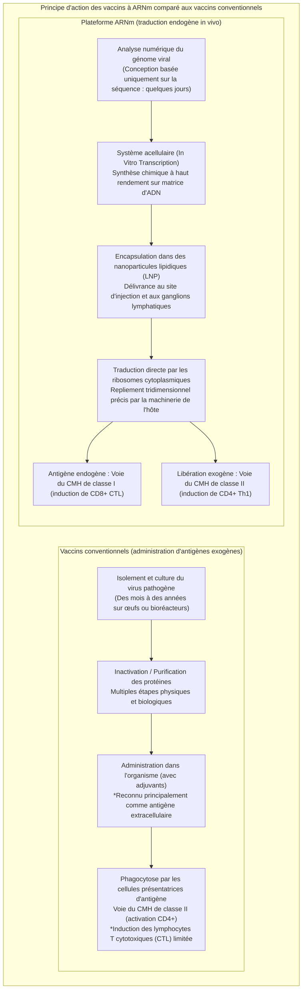
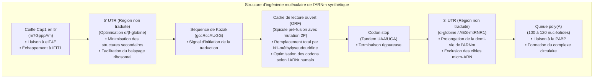
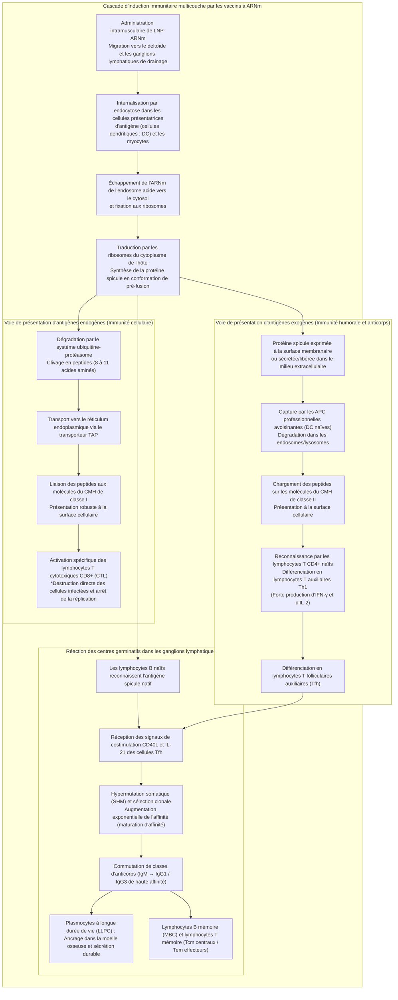
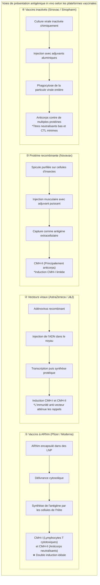

## Introduction : La révolution de l'ARNm —— Comment une « molécule fragile » a ouvert la voie au développement vaccinal le plus rapide de l'histoire humaine

En janvier 2020, la séquence complète du génome (environ 30 000 nucléotides) du SARS-CoV-2, l'agent pathogène à l'origine d'une affection respiratoire jusqu'alors inconnue apparue à Wuhan en Chine, a été mise en ligne. À peine 42 jours plus tard, la société de biotechnologie américaine Moderna expédiait son premier lot clinique du candidat vaccin « mRNA-1273 » aux National Institutes of Health (NIH). Concomitamment, l'alliance formée par la société allemande BioNTech et l'américain Pfizer avec « BNT162b2 » franchissait toutes les étapes d'essais cliniques de phase III à grande échelle et obtenait une autorisation d'utilisation d'urgence (EUA) en seulement 11 mois : un exploit d'une célérité fulgurante sans précédent dans l'histoire de la médecine.

Le développement traditionnel des vaccins — qu'il s'agisse de vaccins vivants atténués, de vaccins inactivés ou de protéines recombinantes exigeant la culture virale sur œufs embryonnés de poule ou dans d'immenses bioréacteurs cellulaires — nécessitait usuellement entre **10 et 15 années** d'efforts laborieux et des investissements financiers astronomiques. Cette lenteur constituait le postulat infranchissable du secteur pharmaceutique.

La technologie de l'ARNm a pulvérisé ces paradigmes établis. Son essence réside dans une redéfinition conceptuelle du vaccin : il ne s'agit plus d'un « produit industriel biologique manufacturé par la mise en culture et la purification externe d'antigènes protéiques », mais d'une **« plateforme logicielle biotechnologique qui charge temporairement le plan d'instruction de l'antigène (le code génétique numérique) au sein de la machinerie cellulaire de l'hôte, transformant l'organisme lui-même en usine d'antigènes endogènes »**.



### Le caractère transitoire de l'ARNm dans le dogme central et « l'impossibilité d'altération génomique »

Face aux interrogations légitimes se demandant si « l'inoculation d'un vaccin à ARNm pouvait modifier ou s'intégrer au génome humain (l'ADN) », le principe cardinal de la biologie moléculaire, le **Dogme Central**, apporte une réponse scientifique limpide et définitive.

Chez les eucaryotes, l'information génétique s'écoule selon une trajectoire unidirectionnelle et irréversible : **ADN (noyau cellulaire) → Transcription → ARNm (exportation vers le cytosol) → Traduction → Protéine (cytoplasme)**. L'ARNm synthétique exogène administré pénètre le cytoplasme où il est directement pris en charge par les ribosomes libres pour produire la protéine spicule cible, sans jamais franchir l'enveloppe nucléaire.
1. **Absence de signal de localisation nucléaire (NLS)** : L'ARNm ne possède aucune étiquette peptidique de guidage lui permettant de franchir les pores nucléaires ; il demeure strictement confiné au cytosol.
2. **Absence de transcriptase inverse et d'intégrase** : Rétrotranscrire de l'ARN en ADN puis l'insérer dans le génome de l'hôte exige des machineries enzymatiques spécifiques (la transcriptase inverse et l'intégrase) que seuls possèdent des rétrovirus tels que le VIH. Les cellules humaines somatiques saines en sont totalement dépourvues (les expériences in vitro extrêmes testant des lignées surexprimant le rétrotransposon LINE-1 n'ont jamais été reproduites dans des conditions physiologiques in vivo).
3. **Dégradation enzymatique rapide in vivo** : L'ARNm est par nature une molécule labile ; en l'espace de quelques heures à quelques jours, il est intégralement hydrolysé en nucléotides simples par les ribonucléases (RNases) cytoplasmiques et recyclé dans le métabolisme cellulaire naturel.

Par conséquent, le vaccin à ARNm se comporte comme un **« message transitoire temporisé à autodestruction programmée une fois la synthèse protéique achevée »**, excluant scientifiquement toute modification permanente de l'ADN génomique de l'hôte.

---

## Chapitre 1 : Quarante ans de luttes et de percées —— Les scientifiques qui ont transformé l'ARNm en médicament

L'avènement instantané de ces vaccins en 2020 n'a rien d'un miracle surgi du néant. Il s'enracine dans plus de quarante années de recherches fondamentales menées par des pionniers obstinés qui ont bravé le scepticisme institutionnel et le tarissement répété de leurs financements. L'attribution du prix Nobel de physiologie ou médecine en 2023 aux docteurs **Katalin Karikó** et **Drew Weissman** constitue le couronnement de cette épopée scientifique.

### 1.1 L'impasse des recherches initiales sur l'ARNm : instabilité extrême et réponse immunitaire innée létale

Dès 1961, date à laquelle François Jacob, Sydney Brenner et leurs collègues ont identifié l'ARNm, les biologistes moléculaires ont caressé un rêve : administrer de l'ARNm dans l'organisme pour faire produire n'importe quelle protéine thérapeutique sur commande.

Néanmoins, les tentatives pionnières menées dans les années 1980 et 1990 se sont heurtées à deux murailles biologiques colossales :
- **Instabilité physicochimique absolue** : Les tissus vivants, l'air ambiant et la peau humaine pullulent de **ribonucléases (RNases)**, des enzymes ultrasensibles conçues pour anéantir les virus à ARN étrangers. L'ARNm nu (*naked RNA*) injecté in vivo était pulvérisé par ces enzymes en quelques secondes, avant même d'effleurer la membrane plasmique des cellules cibles.
- **Réaction disproportionnée de l'immunité innée** : Lorsque des quantités importantes d'ARNm parvenaient à être introduites chez l'animal, le système immunitaire l'identifiait instantanément comme un agent viral hautement dangereux, déclenchant un orage cytokinique inflammatoire massif. Face aux chocs anaphylactoïdes et aux décès observés chez les animaux de laboratoire, l'ARNm fut étiqueté pendant des décennies comme une « molécule défectueuse, bien trop toxique pour prétendre au statut de médicament ».

Bien que rétrogradée par son université et privée de bourses de recherche (*grants*), la biochimiste d'origine hongroise Katalin Karikó continua d'affirmer envers et contre tous, dans un recoin discret de l'Université de Pennsylvanie, que l'ARN recelait un potentiel thérapeutique sans équivalent.

### 1.2 La découverte historique de Karikó et Weissman (2005) : l'échappement aux récepteurs TLR par modification des uridines

En 1997, Karikó fit la rencontre de l'immunologiste Drew Weissman, qui travaillait au développement d'un vaccin contre le VIH en explorant le pouvoir de présentation antigénique des cellules dendritiques (DC). Tous deux décidèrent d'unir leurs compétences pour étudier l'activation des cellules dendritiques par l'ARNm.

La question centrale qu'ils formulèrent fut la suivante : **« Pourquoi l'ARN de transfert (ARNt) et l'ARN ribosomal (ARNr) naturels des mammifères ne suscitent-ils aucune agression immunitaire, alors que l'ARNm synthétisé par transcription in vitro (IVT) déclenche une inflammation destructrice chez les cellules dendritiques ? »**.

Les membranes plasmiques et endosomales des cellules de mammifères sont équipées de sentinelles de l'immunité innée nommées **récepteurs de type Toll (Toll-like Receptors : TLR)** :
- **TLR3** : Détecte l'ARN double brin (dsRNA).
- **TLR7 / TLR8** : Reconnaissent les séquences riches en uridine (U) dans l'ARN simple brin (ssRNA).
- **RIG-I / MDA5** : Capteurs cytosoliques reconnaissant l'ARN 5'-triphosphate et les longues doubles hélices d'ARN pour induire la transcription d'interféron de type I (IFN-α/β).

Karikó et Weissman remarquèrent que l'ARN endogène des mammifères abonde en **bases nucléosidiques chimiquement modifiées** (méthylations, isomérisations post-transcriptionnelles). En revanche, l'ARNm synthétisé par les réactions IVT classiques de l'époque n'était formé que des quatre nucléosides standards non modifiés (A, C, G, U).

En 2005, ils publièrent une découverte retentissante : **en remplaçant l'uridine (Uracile) par son isomère naturel, la pseudouridine (Ψ : Pseudouridine), lors de la synthèse de l'ARNm, la reconnaissance par les TLR7, TLR8 et les capteurs intracellulaires s'effondrait, abolissant totalement la réaction inflammatoire toxique.**

### 1.3 De la pseudouridine à la « N1-méthylpseudouridine (m1Ψ) »

La découverte du tandem Karikó-Weissman révéla une surprise supplémentaire : l'ARNm modifié ne se contentait pas d'éviter l'inflammation, son efficacité de traduction par les ribosomes était démultipliée par un facteur de plusieurs dizaines.

En effet, lors de la pénétration d'un ARNm standard contenant de l'uridine ordinaire, l'activation des défenses innées stimule la **protéine kinase R (PKR)** et l'**oligo-adénylate synthétase 2'-5' (OAS)**. La PKR phosphoryle le facteur d'initiation de la traduction **eIF2α**, coupant net toute synthèse protéique cellulaire, tandis que l'OAS active la **RNase L** pour déchiqueter l'ensemble des ARN cytoplasmiques.

L'incorporation de pseudouridine déjoue cette surveillance intracellulaire, permettant aux ribosomes de traduire l'ARNm de manière fluide, soutenue et répétée.

Au cours de la décennie 2010, les recherches menées notamment par BioNTech et Moderna ont identifié un dérivé supérieur : la **« N1-méthylpseudouridine (m1Ψ : N1-methylpseudouridine) »**, porteuse d'un groupe méthyle sur l'atome d'azote N1 de la pseudouridine.
- La m1Ψ évite la rigidité stérique excessive des structures secondaires de l'ARN tout en préservant scrupuleusement l'appariement codon-anticodon dans le centre de décodage du ribosome.
- Elle réduit au minimum absolu l'affinité pour les récepteurs TLR7/8 et permet, lorsqu'elle est substituée à 100% à la place de l'uridine, d'atteindre des niveaux d'expression protéique in vivo sans précédent.
Les vaccins BNT162b2 (Pfizer/BioNTech) et mRNA-1273 (Moderna) ont tous deux adopté cette **technologie de substitution intégrale (100%) par la m1Ψ**.

### 1.4 L'apogée de la stabilisation de la protéine spicule : la « mutation 2P » de Barney Graham et Jason McLellan

Aux côtés de la modification nucléosidique et de la vectorisation lipidique, le troisième pilier scientifique couronné de succès a été la stabilisation de la structure tridimensionnelle de la spicule grâce à la **« mutation 2P » (substitution par deux prolines)**.

La **glycoprotéine spicule (S)** ancrée à la surface du SARS-CoV-2 constitue la clé d'entrée virale en se liant au récepteur humain ACE2. Cependant, cette spicule est une machinerie moléculaire dynamique et instable qui adopte deux formes structurales très divergentes :
- **Conformation de pré-fusion (Prefusion Conformation)** : L'état d'origine du trimère avant l'arrimage et la fusion membranaire. Elle expose largement le domaine de liaison au récepteur (RBD), offrant la cible idéale aux **anticorps neutralisants les plus puissants**.
- **Conformation de post-fusion (Postfusion Conformation)** : La forme allongée et rigide adoptée après la fusion avec la membrane cellulaire hôte. Les anticorps dirigés contre cette structure exhibent un pouvoir neutralisant extrêmement médiocre.

Le Dr **Barney Graham** (au VRC du NIAID) et le Dr **Jason McLellan** (Université du Texas à Austin) avaient démontré par cryo-microscopie électronique sur les coronavirus MERS et SARS-CoV-1 que le remplacement de deux acides aminés charnières (positions 986 et 987, lysine et valine) par **deux prolines consécutives (K986P et V987P)** verrouillait rigidement la molécule, **empêchant son basculement spontané vers la forme de post-fusion**.

Dès la parution de la séquence génomique du SARS-CoV-2 en janvier 2020, les équipes ont immédiatement implémenté la mutation 2P. En faisant produire par l'organisme cette spicule stabilisée en pré-fusion, les vaccins ont présenté au système immunitaire la forme la plus immunogène et la plus riche en cibles neutralisantes fonctionnelles.

---

## Chapitre 2 : Architecture de précision de la molécule d'ARNm —— Ingénierie moléculaire de l'ARNm synthétique

L'ARNm thérapeutique ne se résume pas à une simple transcription du code viral. Il s'agit d'un **biopolymère de haute précision (Engineered Biopolymer)** dont chaque domaine a été ajusté par ingénierie bio-informatique pour maximiser la cinétique de traduction et contrôler sa stabilité intracellulaire.



### 2.1 La structure de la coiffe 5' (De Cap0 à Cap1) : Auto-reconnaissance cellulaire et initiation traductionnelle

L'extrémité 5' de l'ARNm eucaryote porte la structure caractéristique de **coiffe 7-méthylguanosine (m7G Cap)**. Dans un ARNm thérapeutique, le schéma de méthylation de cette coiffe est d'une criticité absolue :
- **Structure Cap0 (m7GpppN)** : Coiffe basique, elle est reconnue dans le cytoplasme des vertébrés supérieurs par la protéine immunitaire **IFIT1 (Interferon-induced protein with tetratricopeptide repeats 1)** comme un ARN étranger, ce qui stoppe net la traduction.
- **Structure Cap1 (m7GpppNm)** : Possède une 2'-O-méthylation sur le premier ribose adjacent à la coiffe. Il s'agit de la signature physiologique de l'ARNm cellulaire hôte, échappant totalement à la détection par IFIT1.

Les vaccins autorisés utilisent des technologies de co-coiffage enzymatique de pointe (telles que le système CleanCap®), conférant une **pureté en structure Cap1 supérieure à 95%**. Cette coiffe recrute avec une affinité optimale le complexe d'initiation **eIF4F (eIF4E, eIF4G, eIF4A)**, amorçant le chargement immédiat de la sous-unité ribosomale 40S.

### 2.2 Optimisation des régions non traduites 5' et 3' (UTR)

Les régions flanquantes qui ne codent pour aucune protéine, la **5' UTR** et la **3' UTR**, régissent la localisation cellulaire, l'efficacité de balayage du ribosome et la durée de vie de l'ARNm.
- **Conception de la 5' UTR** : Des structures secondaires trop encombrantes (épingles à cheveux ou quadruplexes de guanine) constituent des freins stériques qui ralentissent les ribosomes. Les séquences choisies proviennent de gènes cellulaires humains hautement exprimés, comme les UTR de l'**α-globine ou de la β-globina**.
- **Conception de la 3' UTR** : Pour différer la déadénylation et empêcher le silençage par les micro-ARN (miRNA) endogènes du foie ou des cellules immunitaires, la séquence de la 3' UTR est expurgée de tout site de liaison aux miRNA (en combinant par exemple des séquences d'α-globine et des dérivés d'ARN ribosomique mitochondrial mtRNR1 couplés à des séquences régulatrices AES).

### 2.3 Cadre de lecture ouvert (ORF) et optimisation des codons

La région codant pour la protéine spicule fait l'objet d'une **optimisation poussée des codons (Codon Optimization)** assistée par ordinateur.

La dégénérescence du code génétique signifie que plusieurs codons synonymes codent pour le même acide aminé. Or, l'usage des codons par le génome du SARS-CoV-2 s'écarte grandement des préférences de l'organisme humain :
1. **Adéquation avec l'abondance des ARNt humains** : Le remplacement systématique des codons rares par ceux correspondant aux ARNt les plus représentés dans le cytosol humain supprime les temps de latence ribosomaux, propulsant la vitesse d'élongation de la chaîne peptidique.
2. **Élévation de la teneur en GC** : L'augmentation ciblée de la proportion de paires guanine-cytosine confère une stabilité thermodynamique supérieure à l'ARNm et élimine les sites d'épissage cryptiques accidentels.
3. **Réduction des sous-produits d'ARN double brin (dsRNA)** : Lors de la synthèse enzymatique IVT par l'ARN polymérase T7, des inversions de brin peuvent générer d'infimes quantités de dsRNA immunogènes. L'optimisation séquentielle couplée à une purification par chromatographie liquide haute performance (HPLC) permet de neutraliser ces contaminants.

### 2.4 La queue poly(A) (Poly-A Tail) et le « modèle de boucle fermée »

La séquence homopolymérique d'adénines à l'extrémité 3', la **queue poly(A)**, agit comme l'horloge biologique régulant la survie de l'ARNm.
- Dans le cytoplasme, la queue poly(A) s'associe à la **protéine de liaison au poly(A) (PABP)**.
- L'interaction physique directe entre la PABP en 3' et le facteur eIF4G ancré à la coiffe 5' courbe la molécule d'ARNm pour adopter la structure du **« modèle en boucle fermée (Closed-Loop Model) »**.
- Cette conformation circulaire protège les deux extrémités de l'assaut des exonucléases et permet aux ribosomes atteignant le codon stop d'être réorientés directement vers le codon initiateur 5', recyclant ainsi la machinerie pour traduire des milliers de spicules à partir d'une seule molécule d'ARNm. Les formulations industrielles calibrent précisément cette queue entre 100 et 120 nucléotides.

---

## Chapitre 3 : Les vecteurs de franchissement des barrières biologiques —— L'ingénierie des nanoparticules lipidiques (LNP)

Même doté d'une séquence parfaite, l'ARNm administré seul ne produit aucun effet thérapeutique mesurable. L'accomplissement d'ingénierie qui a rendu possible la révolution clinique de l'ARNm repose sur des véhicules nanométriques de 80 à 100 nanomètres de diamètre : les **nanoparticules lipidiques (Lipid Nanoparticles : LNP)**.

### 3.1 Pourquoi l'ARNm nu (Naked RNA) ne peut être injecté directement

L'injection intramusculaire directe d'ARNm nu produit une réponse vaccinale quasi nulle, bloquée par deux verrous biologiques majeurs :
1. **Répulsion électrostatique des charges négatives** : Le squelette phosphodiester de l'ARNm est porteur d'une très forte charge nette négative. La bicouche lipidique des cellules humaines et son glycocalyx présentent également une électronégativité marquée, générant une puissante répulsion coulombienne qui empêche toute diffusion passive.
2. **Dégradation immédiate par les RNases tissulaires** : Les liquides interstitiels et sanguins sont saturés de ribonucléases actives, réduisant la demi-vie de l'ARNm nu à quelques minutes.

Un transporteur furtif capable d'écrêter les charges électriques, de traverser la membrane cellulaire et de relarguer l'ARNm dans le cytosol était donc indispensable.

### 3.2 Le rôle et l'architecture chimique des « quatre lipides majeurs » des LNP

Les LNP qui composent les vaccins de Pfizer/BioNTech et de Moderna reposent sur un mélange stœchiométrique finement équilibré de **quatre lipides distincts** :

```
【Les 4 constituants lipidiques des LNP】
1. Lipide cationique ionisable (Ionizable Cationic Lipid) 〜 46-50 mol%
2. Phospholipide auxiliaire (Helper Lipid : DSPC) 〜 10 mol%
3. Cholestérol (Cholesterol) 〜 38-43 mol%
4. Lipide PEGylé (PEGylated Lipid) 〜 1,5-1,7 mol%
```

| Composant lipidique | Molécule mise en œuvre (Pfizer / Moderna) | Ratio molaire (mol%) | Caractéristiques physicochimiques | Rôle physiologique fondamental in vivo |
| :--- | :--- | :--- | :--- | :--- |
| **Lipide ionisable<br/>(Ionizable Lipid)** | **ALC-0315** (Pfizer)<br/>**SM-102** (Moderna) | **~ 46 à 50%** | pKa apparent situé entre **6,0 et 6,8**. Chargé positivement en milieu acide, neutre à pH physiologique. Comprend une amine tertiaire et des liaisons ester biodégradables. | ① À pH acide, se lie électrostatiquement à l'ARNm chargé négativement pour le condenser au cœur de la nanoparticule.<br/>② Au pH physiologique sanguin (7,4), devient neutre, supprimant la cytotoxicité et l'hémolyse.<br/>③ Se protonne dans l'endosome acide pour déstabiliser la membrane vésiculaire et libérer l'ARNm. |
| **Phospholipide auxiliaire<br/>(Helper Lipid)** | **DSPC**<br/>(1,2-distéaroyl-sn-glycéro-3-phosphocholine) | **~ 10%** | Phospholipide saturé à haute température de transition de phase (~55 °C). Géométrie cylindrique. | S'organise en bicouche lamellaire en périphérie de la nanoparticule, garantissant l'intégrité structurale et la stabilité morphologique de la capsule. |
| **Cholestérol<br/>(Cholesterol)** | Cholestérol végétal purifié | **~ 38 à 43%** | Noyau stéroïdien rigide avec groupement hydroxyle polaire. Molécule de compactage membranaire. | Comble les interstices entre phospholipides, régulant la fluidité et les transitions de phase. Facilite la fusion membranaire et prévient les fuites d'ARNm. |
| **Lipide PEGylé<br/>(PEGylated Lipid)** | **ALC-0159** (Pfizer)<br/>**PEG2000-DMG** (Moderna) | **~ 1,5 à 1,7%** | Chaîne hydrophile de polyéthylène glycol greffée sur un ancre lipidique (dimyristylglycérol). | ① Prévient l'agrégation spontanée des particules lors du stockage, stabilisant la taille (~80 nm).<br/>② Bloque l'adsorption non spécifique des protéines sériques (opsonisation), prolongeant la demi-vie.<br/>③ Se détache progressivement in vivo pour permettre l'interaction cellulaire. |

### 3.3 L'endocytose et la prouesse de l'échappement endosomal (Endosomal Escape)

Après injection dans le deltoïde, le goulot d'étranglement qui conditionne la réussite de la synthèse protéique est l'**échappement endosomal (Endosomal Escape)** :

1. **Adsorption d'apolipoprotéines et endocytose** :
   Dans les fluides interstitiels, les LNP adsorbent à leur surface l'**apolipoprotéine E (ApoE)** de l'organisme hôte. Les particules sont alors reconnues par les **récepteurs des lipoprotéines de basse densité (LDLR)** présents à la surface des cellules dendritiques, macrophages et myocytes, déclenchant leur internalisation par endocytose dans des vésicules endosomales.
2. **Acidification endosomale** :
   Lors de la maturation de l'endosome précoce vers l'endosome tardif, les pompes membranaires V-ATPase injectent des ions $H^+$, faisant chuter le pH de 7,4 à moins de 5,5.
3. **Inversion de charge et effet d'éponge à protons** :
   En franchissant leur pKa (6,0-6,8), les lipides ionisables captent massivement les protons et passent d'une charge neutre à une **puissante charge cationique positive**.
4. **Fusion membranaire et délivrance cytosolique** :
   Ces lipides cationiques s'associent de force aux lipides anioniques de la membrane interne de l'endosome (tels que la phosphatidylsérine), provoquant l'apparition d'une phase non lamellaire désorganisée appelée **phase hexagonale inversée ($H_{II}$)**. Cette désorganisation crée des pores transmembranaires qui, conjugués à la pression osmotique, permettent à l'**ARNm intact de s'échapper vers le cytosol** et de rejoindre immédiatement les ribosomes.

Les études de nanobiologie cellulaire estiment que seuls **2% à 15%** des molécules d'ARNm internalisées parviennent à s'échapper de l'endosome. Cependant, grâce à l'efficacité catalytique des ribosomes, cette fraction restreinte suffit à générer une expression protéique massive et à déclencher une immunisation robuste.

### 3.4 Technologie de formulation microfluidique (Microfluidic Formulation)

L'industrialisation à grande échelle de nanoparticules d'une telle homogénéité repose sur la **microfluidique (Microfluidics)**.

Les systèmes classiques par émulsion mécanique produisaient des vésicules hétérogènes et peu reproductibles. Les lignes de production modernes font converger au sein de microcanaux de quelques dizaines de micromètres une **solution lipidique éthanolique** (les 4 lipides dissous dans l'alcool) et une **solution aqueuse acide d'ARNm** (en tampon citrate) à des vitesses d'écoulement atteignant plusieurs mètres par seconde.

Cette collision ultrarapide dilue instantanément l'éthanol, provoquant une baisse brutale de solubilité qui force l'auto-assemblage moléculaire. Les lipides ionisables se lient à l'ARNm pour former un cœur condensé protégé par une couronne de DSPC, cholestérol et PEG. En quelques millisecondes, le système génère en continu des LNP d'un diamètre de 80 à 100 nm, avec une **efficacité d'encapsulation supérieure à 90%** et un indice de polydispersité remarquablement bas (PDI < 0,1).

---

## Chapitre 4 : La cascade immunitaire multicouche —— De la traduction cytosolique à l'immunité systémique

La supériorité protectrice démontrée par les vaccins à ARNm sur les vaccins traditionnels réside dans leur capacité à déclencher une **présentation antigénique bidirectionnelle simultanée (activation conjointe des voies CMH de classe I et de classe II)**.



### 4.1 Captation tissulaire locale et drainage vers les ganglions lymphatiques

Inoculées dans le deltoïde, les nanoparticules lipidiques s'écoulent en quelques heures via les canaux lymphatiques vers les ganglions lymphatiques de drainage axillaires.
- Si les cellules musculaires striées locales traduisent l'ARNm et exposent la spicule sur leur sarcolemme, les véritables moteurs de l'immunité sont les **cellules présentatrices d'antigène (APC) professionnelles** : les cellules dendritiques (DC) et les macrophages résidant dans les ganglions.
- Dans le cytoplasme de ces cellules immunitaires, la spicule est façonnée avec les modifications post-traductionnelles authentiques de l'hôte (glycosylation et ponts disulfures natifs), exposant des trimères identiques à ceux du virus vivant.

### 4.2 La voie du CMH de classe I et l'induction puissante des lymphocytes T cytotoxiques (CD8+ CTL)

Les vaccins conventionnels formulés avec des protéines purifiées apportent l'antigène par voie extracellulaire. Ils ne peuvent alimenter que la voie du CMH-II et s'avèrent incapables d'engager vigoureusement les **lymphocytes T cytotoxiques (CD8+ CTL)**, dont le rôle est pourtant d'éliminer les cellules infectées par le virus.

L'ARNm élimine ce handicap structurel en commandant la **synthèse de l'antigène directement à l'intérieur du cytoplasme** :
1. **Dégradation par le protéasome** : Une portion des spicules cytosoliques néosynthétisées est ubiquitinée et clivée par le **protéasome** en petits fragments de 8 à 11 acides aminés.
2. **Translocation par TAP** : Ces peptides sont pris en charge par le transporteur **TAP (Transporter associated with Antigen Processing)** et acheminés dans le réticulum endoplasmique.
3. **Chargement sur le CMH de classe I** : Les peptides s'insèrent dans la cavité de liaison des molécules du **CMH de classe I (HLA-A, B, C)** avant d'être convoyés via l'appareil de Golgi vers la membrane plasmique.
4. **Amorçage des lymphocytes T tueurs** : Les lymphocytes T CD8+ naïfs ganglionnaires reconnaissent ce complexe via leur récepteur T (TCR). Conjointement aux signaux de costimulation (CD80/CD86 avec CD28), ils prolifèrent et se transforment en **lymphocytes T cytotoxiques effecteurs (CTL)** armés de perforines et de granzymes.

Cette robuste réponse CTL a constitué le rempart fondamental ayant préservé les populations vaccinées des formes critiques et des décès, même face aux variants qui échappaient aux anticorps neutralisants.

### 4.3 La voie du CMH de classe II et l'orientation vers les lymphocytes auxiliaires Th1

Parallèlement, la spicule produite est excrétée par exocytose ou libérée lors de la clairance cellulaire :
- Les cellules dendritiques immatures environnantes captent ces débris par endocytose et les fragmentent au sein de lysosomes acides en peptides de 13 à 18 acides aminés.
- Ces fragments sont chargés sur les molécules du **CMH de classe II (HLA-DR, DQ, DP)** et présentés aux lymphocytes T CD4+ naïfs.
- L'activation innée déclenchée par les LNP induit une polarisation exclusive vers le profil **Th1 (lymphocytes T auxiliaires de type 1)** producteurs d'IFN-γ et d'IL-2. Cette polarisation Th1 a joué un rôle déterminant pour écarter le risque d'infiltrations allergiques néfastes de type Th2.

### 4.4 L'organisation remarquable des centres germinatifs et la maturation d'affinité des cellules B

Le point d'orgue de la réponse vaccinale à ARNm est l'activation prolongée des **centres germinatifs (Germinal Centers : GC)** ganglionnaires :
1. **Liaison à l'antigène natif** : Les lymphocytes B naïfs des follicules ganglionnaires s'arriment directement, via leur récepteur BCR, aux spicules trimériques natives exposées par les cellules dendritiques.
2. **Coopération avec les lymphocytes T folliculaires auxiliaires (Tfh)** : Les lymphocytes B migrent au cœur du centre germinatif où ils reçoivent des signaux d'activation indispensables (CD40L et IL-21) délivrés par les cellules Tfh spécialisées.
3. **Hypermutation somatique (SHM) et sélection compétitive** :
   - Dans la zone sombre du centre germinatif, l'enzyme AID (*Activation-Induced Cytidine Deaminase*) introduit des mutations ponctuelles ciblées à un rythme effréné dans les gènes codant les régions variables des immunoglobulines.
   - Les clones B migrent ensuite vers la zone claire, où ils entrent en compétition pour se lier aux antigènes présentés par les cellules dendritiques folliculaires (FDC).
   - Seuls les lymphocytes B ayant acquis des mutations augmentant considérablement l'affinité pour la spicule reçoivent les signaux de survie des Tfh ; les clones moins performants meurent par apoptose.
4. **Commutation isotypique et différenciation plasmocytaire** :
   - Les cellules B sélectionnées subissent une recombinaison de commutation de classe vers des **IgG de très haute affinité (notamment IgG1 et IgG3)** douées d'un puissant pouvoir neutralisant.
   - Les meilleurs clones se transforment en **plasmocytes à longue durée de vie (LLPC)** qui s'établissent dans la moelle osseuse pour sécréter des milliers d'anticorps par seconde pendant des mois.
   - Les autres constituent un contingent de **lymphocytes B mémoire (MBC)** disséminés dans la rate et les ganglions, parés à réagir instantanément en cas d'agression future.

Des études sur biopsies ganglionnaires chez l'humain ont révélé que les centres germinatifs induits par les vaccins à ARNm sont restés fonctionnellement actifs pendant **plus de six mois après la primo-vaccination**, une longévité exceptionnelle pour un vaccin non vivant.

---

## Chapitre 5 : Données cliniques, dynamique de l'efficacité et confrontation avec les variants

### 5.1 Les résultats des essais de phase III : la surprise d'une protection clinique à 95%

À la fin de l'année 2020, les résultats des essais de phase III publiés dans le *New England Journal of Medicine (NEJM)* par Pfizer/BioNTech (Polack et al.) et Moderna (Baden et al.) ont stupéfié les experts mondiaux :
- **BNT162b2 (Pfizer/BioNTech, 43 448 participants)** : 162 cas de COVID-19 symptomatique ont été observés dans le groupe placebo contre seulement 8 cas dans le groupe vacciné, établissant une **efficacité vaccinale de 95,0% (IC 95% : 90,3–97,6%)**. Sur les cas sévères, 9 sont survenus sous placebo contre 1 seul chez les vaccinés.
- **mRNA-1273 (Moderna, 30 420 participants)** : 185 cas ont été recensés dans le groupe placebo (dont 30 formes graves et 1 décès) contre 11 cas (0 forme grave) dans le groupe vacciné, attestant d'une **efficacité de 94,1% (IC 95% : 89,3–96,8%)** et de 100% contre les formes sévères.

Alors que l'OMS et la FDA avaient fixé un seuil d'approbation d'au moins 50% d'efficacité et que les vaccins antigrippaux oscillent habituellement entre 40% et 60%, atteindre 95% face à un pathogène émergent a constitué un triomphe biomédical historique.

### 5.2 Réfutation des confusions statistiques : Réduction du Risque Relatif (RRR) vs Réduction du Risque Absoluto (ARR)

Certaines voix ont prétendu que « 95% ne représentait qu'une réduction relative (RRR) et que la réduction absolue du risque (ARR) n'était que d'environ 1%, ce qui rendrait le vaccin inefficace ».

Examinons la rigueur mathématique de ces concepts :
- **RRR (Réduction du Risque Relatif)** : Compare le taux d'attaque chez les témoins ($I_p$) à celui des vaccinés ($I_v$).
  $$RRR = \frac{I_p - I_v}{I_p} \times 100\% = \frac{0,0088 - 0,0004}{0,0088} \approx 95\%$$
  Ce paramètre reflète la **puissance biologique intrinsèque** du vaccin à bloquer l'infection chez une personne exposée.
- **ARR (Réduction du Risque Absolu)** : Mesure l'écart d'incidence brute au sein de la cohorte totale sur la fenêtre d'observation réduite du protocole.
  $$ARR = I_p - I_v \approx 0,88\% - 0,04\% = 0,84\%$$
- **Réalité de l'épidémiologie** :
  L'ARR est subordonnée au **taux de circulation du virus dans la société (l'incidence de base)** durant l'essai. Si l'on teste un vaccin parfait dans un pays où le virus circule très peu, l'ARR sera inévitablement inférieure à 1%. Mais si une flambée épidémique infecte 20% de la population, l'ARR grimpe instantanément à $20\% \times 95\% = 19\%$. Arguer d'une faible ARR pour nier l'efficacité revient à confondre la performance biologique d'une thérapie avec la prévalence épidémique instantanée.

### 5.3 Données en vie réelle (Real-World Evidence, RWE) : les enseignements à l'échelle des nations

Le déploiement des vaccins auprès de dizaines de millions d'individus à l'échelle de populations entières — notamment en **Israël (cohorte de 1,2 million d'individus appariés par la Clalit Health Services, Dagan et al., NEJM 2021)**, au Royaume-Uni (UKHSA) et aux États-Unis (CDC) — a validé trois réalités épidémiologiques :
1. **Contrôle absolu des souches initiales** : Face à la souche de Wuhan et au variant Alpha, l'efficacité en vie réelle a dépassé 90% contre l'infection et 95% contre les hospitalisations et les décès.
2. **Déclin progressif contre l'infection bénigne** : Entre 4 et 6 mois après la deuxième injection, la baisse physiologique normale des anticorps circulants a ramené l'efficacité contre les formes modérées à 60-70%.
3. **Persistance remarquable contre les formes graves** : La protection contre les hospitalisations, les soins intensifs et les décès est restée remarquablement stable, dépassant 85 à 90% sur le long terme. Même si les anticorps circulants diminuent, la mobilisation rapide des lymphocytes B mémoire et l'activité destructrice des **lymphocytes T cytotoxiques CD8+** empêchent l'invasion virale du parenchyme pulmonaire.

### 5.4 La succession des variants et l'échappement immunitaire : dissociation anticorps/lymphocytes T

La réplication planétaire du virus a accéléré l'apparition de mutations altérant la liaison des anticorps.

| Lignée de variant | Mutations caractéristiques (RBD/Spicule) | Sensibilité aux anticorps neutralisants | Efficacité contre l'infection (2 doses) | Efficacité contre les formes graves (2 doses) | Impact de la dose de rappel (Booster) |
| :--- | :--- | :--- | :--- | :--- | :--- |
| **Souche historique de Wuhan<br/>(Wuhan-Hu-1)** | Souche de référence (aucune mutation) | **1,0x** (référence) | **~ 95%** | **> 95%** | Titres d'anticorps multipliés par plusieurs facteurs |
| **Variant Alpha<br/>(Alpha : B.1.1.7)** | N501Y, P681H | **Baisse modérée (1,5 à 2x)** | **~ 85 à 90%** | **~ 95%** | Très haut niveau d'efficacité maintenu sur tous les plans |
| **Variant Delta<br/>(Delta : B.1.617.2)** | L452R, T478K, P681R | **Baisse de 3 à 6x** | **~ 60 à 75%** (décroît avec le temps) | **~ 90%** | Le rappel réhausse la protection symptomatique au-delà de 85% |
| **Omicron BA.1 / BA.2<br/>(Omicron initial)** | >15 mutations sur le RBD<br/>(K417N, E484A, N501Y, etc.) | **Chute drastique (20 à 40x)** | **~ 20 à 40%** (forte perte après 2 doses) | **~ 70 à 80%** (préservée par les cellules T) | Le rappel rétablit la protection symptomatique à 65-75% et sévère à >90% |
| **Omicron BA.4 / BA.5<br/>et sous-lignées XBB / JN.1** | L452R, F486V/P, R346T<br/>Échappement humoral quasi complet | **Perte presque totale de neutralisation initiale** | **Presque nulle contre la transmission** | **~ 60 à 70%** (préservée par l'immunité mémoire) | Les vaccins bivalents ou monovalents XBB.1.5/JN.1 restaurent les anticorps et rétablissent la protection sévère à >80% |

L'émergence d'Omicron a matérialisé la rupture entre l'inhibition du contage et la prévention du décès. Avec plus de 30 mutations sur sa spicule dont 15 dans le RBD, Omicron court-circuitait la majeure partie des anticorps neutralisants induits par la souche initiale.

C'est ici qu'a resplendi la **robustesse de l'immunité cellulaire T** :
- Les anticorps neutralisants dépendent de quelques épitopes conformationnels restreints du RBD ; des mutations mineures réduisent leur affinité à néant.
- En revanche, les lymphocytes T ciblent des **épitopes peptidiques linéaires** répartis sur l'intégralité des 1 273 acides aminés de la spicule.
- La diversité génétique des molécules HLA au sein de la population humaine rend impossible un échappement total du virus face aux lymphocytes T.
- Les analyses internationales ont démontré que **80% à 90% des épitopes T restaient parfaitement conservés dans les variants Omicron**. C'est cette préservation cellulaire qui a empêché la submersion des services de réanimation des pays hautement vaccinés lors des vagues massives d'Omicron.

### 5.5 Rappels vaccinaux (Boosters) et conception de vaccins adaptés aux variants

Face à l'évolution virale, la plateforme ARNm a démontré son atout maître : sa **réactivité modulaire** :
1. **Rappels homologues (3e dose)** : Une dose de rappel avec le vaccin original a suffi à réactiver les centres germinatifs, relançant la maturation d'affinité pour produire des anticorps à réactivité croisée capables de neutraliser Omicron.
2. **Vaccins bivalents** : Formulation combinant à parts égales (1:1) l'ARNm de la souche historique et celui d'Omicron BA.1 ou BA.4/5 pour élargir l'éventail d'anticorps.
3. **Formulations monovalentes actualisées (XBB.1.5, JN.1)** : Afin d'éviter l'interférence du biais immunitaire antérieur (*empreinte immunitaire* ou péché originel antigénique), les vaccins récents n'incorporent plus que l'ARNm de la sous-lignée active. Grâce à la synthèse enzymatique, concevoir et fabriquer un nouveau lot clinique ne demande que 8 à 10 semaines.

---

## Chapitre 6 : Profil de sécurité, physiopathologie des effets indésirables et balance bénéfice-risque

Comme tout produit biologique d'intervention massive, les vaccins à ARNm possèdent un équilibre entre leurs bénéfices démontrés et des risques d'événements indésirables. Une démarche médicale rigoureuse exige d'en analyser la physiopathologie avec une parfaite transparence scientifique.

### 6.1 Réactogénicité locale et systémique : le coût physiologique de l'engagement immunitaire

Les effets secondaires locaux (douleur, gonflement, rougeur au point d'injection) et systémiques fréquents (fièvre >38 °C, céphalées, asthénie, frissons, myalgies et arthralgies) ne sont pas des signes de toxicité tissulaire, mais l'**expression normale de l'activation des cascades immunitaires innées** :
- Les nanoparticules lipidiques et la détection d'antigènes provoquent la libération transitoire par les macrophages de cytokines pro-inflammatoires (**IL-1β, IL-6, TNF-α, interférons de type I**).
- Ces cytokines activent le centre thermorégulateur hypothalamique, provoquant la montée fébrile et la sensation de courbature générale.
- Ces symptômes disparaissent spontanément sous 24 à 48 heures et répondent parfaitement aux antipyrétiques d'usage comme le paracétamol.

### 6.2 Myocardites et péricardites : épidémiologie et mécanismes physiopathologiques

La surveillance internationale de pharmacovigilance (VAERS aux États-Unis, registres israéliens et européens) a mis en évidence un signal de risque très rare mais authentique de **myocardite et de péricardite**, survenant préférentiellement chez les **hommes jeunes et adolescents (12 à 29 ans)**, typiquement dans les 2 à 4 jours suivant la deuxième dose.

#### ① Incidence épidémiologique
- L'incidence globale est extrêmement faible : environ **1 à 5 cas pour 100 000 doses injectées**.
- Dans la tranche d'âge la plus concernée (**hommes de 16 à 19 ans après la 2e dose**), le risque monte à environ **10 à 15 cas pour 100 000 doses (0,01%)**.
- L'incidence s'est révélée légèrement plus élevée avec le vaccin Moderna (100 µg d'ARNm) qu'avec celui de Pfizer (30 µg), mettant en évidence un effet-dose qui a conduit plusieurs pays à recommander préférentiellement Pfizer chez les moins de 30 ans.

#### ② Hypothèses sur les mécanismes moléculaires
Trois facteurs convergents sont retenus par la communauté scientifique :
1. **Spicule circulante non neutralisée et complexes immuns** : L'équipe de Yonker à Harvard (*Circulation* 2023) a isolé chez des jeunes développant une myocardite de la spicule libre non complexée aux anticorps, susceptible d'activer des récepteurs immunitaires cardiaques.
2. **Influence des hormones stéroïdiennes sexuelles** : La prédominance masculine suggère le rôle de la testostérone, qui stimule les voies Th1 et les macrophages pro-inflammatoires, alors que les œstrogènes exercent un effet protecteur et anti-inflammatoire sur le myocarde.
3. **Réaction auto-immune transitoire** : Apparition temporaire d'auto-anticorps dirigés contre des protéines du muscle cardiaque telles que l'α-myosine.

#### ③ Évolution clinique et comparaison avec l'infection à SARS-CoV-2
Deux constats cliniques s'imposent :
- **Plus de 90% des myocardites post-vaccinales sont bénignes**, régressant rapidement après quelques jours de repos et d'anti-inflammatoires non stéroïdiens (AINS), avec une récupération complète de la fonction contractile.
- **Le risque de myocardite, d'infarctus, d'arythmie et de défaillance cardiaque induit par la COVID-19 naturelle est 5 à 15 fois supérieur au risque vaccinal**, y compris chez les jeunes hommes. Toutes les agences sanitaires (CDC, EMA, OMS) ont conclu que le bénéfice de la vaccination reste écrasant face aux ravages cardiaques, pulmonaires et systémiques du virus sauvage.

### 6.3 Anaphylaxie et allergie au polyéthylène glycol (PEG)

Le taux d'anaphylaxie aiguë post-vaccinale est de l'ordre de **2 à 5 cas par million de doses administrées**, un niveau très bas quoiqu'un peu plus élevé que le vaccin antigrippal (~1 par million).
- La cause principale est la présence de **PEG2000 (polyéthylène glycol)** dans l'enveloppe des LNP, déclenchant une dégranulation mastocytaire médiée par des IgE anti-PEG préexistantes ou par activation du complément (pseudo-allergie CARPA).
- Cette sensibilisation préalable s'explique par l'utilisation universelle du PEG dans les shampoings, crèmes cosmétiques et préparations laxatives.
- La surveillance obligatoire de 15 à 30 minutes et l'administration prompte d'adrénaline intramusculaire ont permis une récupération sans séquelles dans la quasi-totalité des cas.

### 6.4 Distinction mécanistique avec les vaccins à adénovirus (TTS/VITT)

Les vaccins à vecteurs adénoviraux (AstraZeneca et Johnson & Johnson) ont été associés au redoutable **syndrome de thrombose thrombocytopénique (TTS / VITT)**, causant des thromboses veineuses cérébrales ou viscérales sévères chez des femmes jeunes.
- **Mécanisme du VITT** : Des protéines de la capside adénovirale s'associent au facteur plaquettaire 4 (PF4), déclenchant la formation d'auto-anticorps mimant la thrombopénie induite par l'héparine (TIH) et provoquant une coagulation disséminée.
- **Sécurité de l'ARNm** : Les vaccins à ARNm ne comportant aucune capside protéique virale, ils n'interagissent pas avec le PF4. **Le risque de TTS/VITT est donc totalement inexistant avec les vaccins à ARNm**.

### 6.5 Évaluation de l'ADE (Facilitation de l'infection par les anticorps) et du VAED (Aggravation de la maladie)

L'histoire de la vaccinologie a été marquée par les drames de l'**ADE (Antibody-Dependent Enhancement)** et du **VAED (Vaccine-Associated Enhanced Disease)** lors d'essais sur la dengue ou le virus respiratoire syncytial (FI-RSV) dans les années 1960 : des anticorps sous-neutralisants favorisaient l'entrée du virus dans les macrophages ou provoquaient une violente inflammation pulmonaire éosinophilique de type Th2.

Avec les vaccins à ARNm contre la COVID-19, **aucun phénomène d'ADE ou de VAED n'a été constaté sur des milliards de doses administrées**. Les verrous moléculaires expliquant cette innocuité sont :
1. **Anticorps neutralisants de haute affinité** : La conformation 2P a concentré la réponse anticorps sur la neutralisation stérique de la spicule fonctionnelle.
2. **Polarisation immunitaire Th1 stricte** : L'adjuvantation naturelle des LNP a orienté la réponse vers les lymphocytes Th1, court-circuitant totalement les réponses Th2 allergiques responsables des pathologies aggravées.

| Effet indésirable | Fréquence observée | Délai d'apparition | Mécanisme physiopathologique dominant | Évolution clinique et prise en charge |
| :--- | :--- | :--- | :--- | :--- |
| **Réaction locale** (douleur, rougeur, œdème) | **70 à 85%** (très fréquent) | Jour 0 à Jour 2 | Recrutement de neutrophiles et cytokines locales (IL-1, TNF) | Régression spontanée en 1 à 3 jours. Application de froid, antalgiques. |
| **Réactogénicité systémique** (fièvre, fatigue, céphalées) | **50 à 70%** (fréquent, accru en dose 2) | 12 à 24 h post-injection | Stimulation de l'hypothalamus par l'IL-6 et les interférons de type I | Disparition en 24 à 48 heures. Paracétamol ou AINS. |
| **Myocardite / Péricardite** | **1 à 5 par 100 000** (10-15/100 000 chez hommes 16-19 ans) | 2 à 4 jours post-dose 2 | Spicule circulante libre, amplification par la testostérone, auto-immunité transitoire | **Forme bénigne dans >90% des cas**. Guérison rapide sous AINS et repos. |
| **Anaphylaxie** | **2 à 5 par million** (très rare) | Quelques minutes à 30 min | Réaction d'hypersensibilité immédiate liée aux lipides PEGylés (IgE ou CARPA) | Injection intramusculaire précoce d'adrénaline ; évolution favorable sans séquelles. |
| **Syndrome de Guillain-Barré** | **Identique au taux d'incidence de base** | Semaines suivantes | Auto-anticorps contre la gaine de myéline (lié aux vaccins adénoviraux, écarté pour l'ARNm) | Immunoglobulines intraveineuses (IgIV) ou échanges plasmatiques. |

---

## Chapitre 7 : Comparaison approfondie des plateformes biotechnologiques vaccinales

La crise pandémique a constitué un banc d'essai comparatif sans équivalent où se sont mesurées les grandes technologies vaccinales modernes.



### 7.1 ARNm vs Vecteurs viraux (Plateformes à ADN)

Les vaccins à vecteur adénoviral utilisent un virus désarmé pour transférer le gène codant la spicule dans le noyau :
- **Avantages** : L'ADN bénéficie d'une stabilité thermique permettant une conservation au réfrigérateur standard (2 °C à 8 °C).
- **Handicap structurel (immunité anti-vecteur)** : L'organisme développe des anticorps neutralisants contre la capside adénovirale elle-même. Dès lors, lors des doses de rappel ultérieures, le système immunitaire neutralise le vecteur avant qu'il n'ait pu délivrer son ADN. S'y ajoute le risque d'accident thrombotique VITT.
- À l'opposé, les nanoparticules lipidiques de l'ARNm sont des émulsions synthétiques dénuées de capsides protéiques immunogènes : **les rappels peuvent être répétés indéfiniment sans perte d'efficacité**.

### 7.2 ARNm vs Vaccins à protéines recombinantes

Incarnés par Novavax (NVX-CoV2373), ces vaccins expriment la protéine spicule dans des cultures de cellules d'insectes, la purifient et l'injectent associée à un adjuvant à base de saponine (Matrix-M™).
- **Avantages** : Recours à une biotechnologie mature dotée d'une excellente tolérance clinique.
- **Inconvénients** : La mise en culture, le repliement et la purification industrielle prennent des mois, rendant l'adaptation aux variants émergents très lente.

### 7.3 ARNm vs Vaccins inactivés

Fabriqués en Chine (Sinovac CoronaVac, Sinopharm BBIBP-CorV), ils reposent sur la culture massive du virus en cellules Vero suivie d'une neutralisation chimique à la β-propiolactone.
- **Avantages** : Présence de l'ensemble des antigènes structuraux du virion.
- **Inconvénients** : Les titres d'anticorps neutralisants sont beaucoup plus faibles et s'effondrent rapidement. L'induction de lymphocytes T cytotoxiques CD8+ est quasi nulle, anéantissant l'efficacité protectrice face à Omicron. La production requiert en outre des infrastructures de confinement BSL-3 complexes.

### 7.4 Procédés de fabrication, chaîne logistique et contraintes thermodynamiques du grand froid

Le défi majeur posé par l'ARNm a été l'obligation initiale d'une **chaîne du froid extrême (-80 °C à -20 °C)** :
- **Origine biophysique** : En milieu aqueux, le pont phosphodiester de l'ARN subit l'attaque nucléophile du groupement hydroxyle en 2'-OH du ribose (autohydrolyse spontanée). De plus, les lipides des LNP peuvent s'oxyder ou fusionner entre eux s'ils ne sont pas immobilisés par congélation.
- Cela imposait des congélateurs à carboglace entre **-80 °C et -60 °C** pour Pfizer et **-20 °C** pour Moderna.
- **Bénéfice industriel majeur** : En contrepartie, la synthèse d'ARNm s'effectuant en système enzymatique acellulaire (*cell-free*), il est possible de synthétiser des centaines de millions de doses dans une cuve de quelques litres en quelques jours, s'affranchissant des contraintes des fermenteurs biologiques massifs.

| Critère d'évaluation | ① Vaccins à ARNm | ② Vecteurs viraux | ③ Protéines recombinantes | ④ Vaccins inactivés |
| :--- | :--- | :--- | :--- | :--- |
| **Produits de référence** | **Pfizer (BNT162b2)<br/>Moderna (mRNA-1273)** | AstraZeneca (ChAdOx1)<br/>J&J (Ad26.COV2.S) | Novavax (NVX-CoV2373)<br/>Daiichi Sankyo (Daichirona) | Sinovac (CoronaVac)<br/>Sinopharm (BBIBP) |
| **Forme de l'antigène** | ARNm encapsulé dans des LNP | ADN dans adénovirus non réplicatif | Protéines purifiées en nanoparticules | Particules virales entières formolées |
| **Site de biosynthèse** | **Cytoplasme de l'hôte (endogène)** | Noyau et cytoplasme de l'hôte | Bioréacteurs acellulaires (insecte/CHO) | Bioréacteurs cellulaires (Vero) |
| **Titres neutralisants** | **Extrêmement élevés (référence)** | Modérés à élevés | Élevés | Faibles à modérés |
| **Induction CD8+ CTL** | **Très puissante (voie CMH-I)** | Élevée | Faible (voie croisée marginale) | Pratiquement nulle |
| **Délai d'adaptation** | **Le plus court (quelques semaines)** | Modéré (2 à 4 mois) | Long (6 mois à 1 an) | Très long (>6 mois) |
| **Effets secondaires clés** | Fièvre, douleur, très rare myocardite | Fièvre, risque rare de TTS/VITT | Douleur locale, asthénie légère | Réaction locale très légère |
| **Température de stockage** | **-80 °C à -20 °C (congelé)** | 2 °C à 8 °C (réfrigéré) | 2 °C à 8 °C (réfrigéré) | 2 °C à 8 °C (réfrigéré) |
| **Aptitude aux rappels** | **Excellente (pas d'immunité porteur)** | Faible (blocage par anticorps) | Bonne | Bonne |

---

## Chapitre 8 : Les frontières de la technologie de l'ARNm —— De l'immunothérapie du cancer à la médecine personnalisée

La validation clinique de l'ARNm lors de la pandémie dépasse de très loin la lutte contre la COVID-19 : elle jette les fondations d'une **révolution biomédicale universelle pour le XXIe siècle**.

### 8.1 Les vaccins personnalisés à néoantigènes contre le cancer (Personalized Cancer Vaccines)

Il convient de rappeler que la vocation initiale de pionniers tels que BioNTech et Moderna était dès l'origine l'**oncologie de précision**.

Les cellules cancéreuses accumulent des mutations somatiques générant des peptides anormaux totalement absents des tissus sains : les **néoantigènes (Neoantigens)**. Toutefois, les cellules tumorales échappent à l'assaut des lymphocytes en détournant des molécules de point de contrôle comme PD-L1.
- **Protocole du traitement vaccinal personnalisé** :
  1. Séquençage haut débit (NGS) de l'ADN et de l'ARN de la tumeur du patient comparé à ses tissus sains.
  2. Sélection bio-informatique par intelligence artificielle de 10 à 34 néoantigènes possédant la plus forte affinité pour les molécules HLA du patient et capables de stimuler les lymphocytes T CD8+.
  3. Synthèse en quelques semaines d'un ARNm sur mesure codant ces épitopes concaténés, encapsulé dans des LNP.
  4. Injection au patient pour mobiliser une armée clonale de lymphocytes T tueurs ciblant exclusivement les cellules malignes.
- **Résultats cliniques pionniers** :
  Lors de l'essai de phase IIb mené par Moderna et Merck (MSD) chez des patients atteints de mélanome de haut risque réséqué, l'association du vaccin à ARNm personnalisé (mRNA-4157 / V940) et du pembrolizumab (Keytruda) a **réduit de 44% le risque de récidive ou de décès** par rapport au pembrolizumab seul (*Lancet* 2024). Des essais de phase III internationaux sont en cours pour le mélanome, le cancer bronchique non à petites cellules et le cancer du pancréas.

### 8.2 Déploiement tous azimuts contre les maladies infectieuses : vaccins combinés, VRS, VIH et paludisme

La flexibilité de la plateforme permet de mélanger différentes séquences dans un même flacon pour créer des vaccins combinés multivalents :
- **Vaccins combinés Grippe + COVID-19** : Formulations pentavalentes associant les quatre souches grippales majeures (H1N1, H3N2, deux souches B) et le variant prédominant du SARS-CoV-2.
- **Vaccins pan-coronavirus** : Dirigés contre les régions conservées de la tige S2 pour neutraliser préventivement d'éventuels coronavirus émergents.
- **Défis infectieux majeurs** : Des essais vaccinaux contre le **VIH-1** cherchant à susciter des anticorps largement neutralisants (bNAbs) à partir de trimères complexes sont en cours, ainsi que des candidats vaccins contre le **paludisme** (*Plasmodium falciparum*) et la **tuberculose**.

### 8.3 Thérapie enzymatique substitutive in vivo et maladies génétiques rares

L'ARNm ne sert pas uniquement à fabriquer des antigènes : il permet de **faire synthétiser par l'organisme ses propres enzymes ou protéines thérapeutiques défaillantes**.
- **Acidémie méthylmalonique (MMA) et acidémie propionique (PA)** : Déficits enzymatiques mitochondriaux hépatiques d'origine génétique. L'administration intraveineuse répétée de LNP chargées d'ARNm codant l'enzyme fonctionnelle (ex. Moderna mRNA-3705) permet aux hépatocytes de rétablir le métabolisme déficitaire.
- **Anticorps codés par ARNm (mRNA-encoded antibodies)** : L'ARNm injecté ordonne au foie de produire et sécréter directement dans la circulation des anticorps monoclonaux thérapeutiques, court-circuitant les coûteuses usines de production d'anticorps externes.

### 8.4 Thérapie cellulaire CAR-T in vivo : la reprogrammation des lymphocytes T au cœur de l'organisme

La thérapie par **cellules T à récepteur antigénique chimérique (CAR-T)** a bouleversé le traitement des hémopathies malignes, mais son protocole demeure très lourd : extraction des lymphocytes du patient, modification génétique par vecteur viral en salle blanche pendant des semaines, puis réinjection, pour des coûts de plusieurs centaines de milliers d'euros.

La recherche de pointe utilise désormais des LNP ciblées pour **engendrer des cellules CAR-T directement in vivo** :
- Des LNP fonctionnalisées en surface avec des anticorps dirigés contre CD4 ou CD5 ciblent sélectivement les lymphocytes T dans la circulation sanguine.
- Les nanoparticules délivrent un ARNm codant le récepteur CAR antitumoral, induisant son expression temporaire à la surface des cellules T de l'organisme.
- L'équipe de Rurik et al. à l'Université de Pennsylvanie (*Science* 2022) a démontré l'efficacité de ce concept chez la souris dans un modèle de fibrose myocardique : une simple injection intraveineuse a reprogrammé les cellules T in vivo pour détruire les fibroblastes pathologiques et restaurer la fonction cardiaque. Le caractère transitoire de l'ARNm élimine tout risque d'oncogenèse insertionnelle liée à l'intégration génomique permanente.

### 8.5 Les défis d'ingénierie de la prochaine génération d'ARNm

1. **ARNm auto-amplifiant (saRNA / Vaccins réplicons)** :
   En incorporant les gènes de l'ARN polymérase dépendante de l'ARN (RdRp) des alphavirus, l'ARNm peut se dupliquer de manière autonome dans le cytoplasme. Cela permet de **diviser la dose injectée par 10 à 100 (quelques microgrammes seulement)**, réduisant les coûts et la réactogénicité. Le Japon a accordé la première autorisation au monde à cette technologie avec le vaccin Kostaive® (VLP Therapeutics).
2. **Lyophilisation et thermostabilité à température ambiante** :
   La mise au point de matrices lyophilisées enrichies en sucres protecteurs (tréhalose, saccharose) vise à produire des poudres stables à **température ambiante (25 °C) ou au réfrigérateur simple (2 °C à 8 °C)**, libérant définitivement la distribution vaccinale des contraintes du grand froid.
3. **Ciblage tissulaire sélectif (Technologie SORT)** :
   Injectées par voie intraveineuse, les LNP classiques s'accumulent à plus de 80% dans le foie sous l'influence de l'ApoE. La technique SORT (*Selective Organ Targeting*) ajoute un cinquième lipide modulateur permettant d'orienter spécifiquement l'ARNm vers les **poumons, la rate, la moelle osseuse, les tumeurs ou le système nerveux central**.

---

## Chapitre 9 : Conclusion —— Le triomphe de la science fondamentale et l'avènement du siècle biotechnologique

### 9.1 L'accumulation silencieuse de décennies de recherche fondamentale

Le fait que l'humanité ait pu disposer de vaccins ultra-efficaces en moins d'un an lors de la crise pandémique mondiale ne relève d'aucune magie spontanée.

Cet accomplissement est l'aboutissement de six décennies de science désintéressée : de l'isolement de l'ARNm en 1961 aux découvertes biophysiques sur l'auto-assemblage lipidique, des travaux sur l'immunité innée aux convictions inébranlables de pionniers comme Katalin Karikó et Drew Weissman qui ont persévéré face aux refus institutionnels répétés.

À une époque dominée par la recherche de retours sur investissement immédiats, le triomphe de l'ARNm démontre avec éclat que **la recherche fondamentale mue par la simple curiosité scientifique constitue le bouclier protecteur le plus précieux de l'espèce humaine**.

### 9.2 Rigueur scientifique et résilience sociétale face à l'incertitude

Aucune thérapeutique médicale ne garantit le risque zéro absolu. La méthode scientifique ne repose pas sur des croyances, mais sur l'évaluation méthodique et chiffrée de la balance entre les bénéfices cliniques et les risques secondaires.

Face à la désinformation et aux dérives conspirationnistes, seule une culture scientifique solide, ancrée dans la biologie moléculaire et les données épidémiologiques mondiales vérifiées, permettra aux sociétés humaines de triompher des crises sanitaires de demain.

### 9.3 Chronologie des étapes clés du développement de la médecine à ARNm (1961 - présent)

| Année | Événement scientifique / Jalon | Contributeurs ou institutions clés | Portée biomédicale et mécanistique |
| :--- | :--- | :--- | :--- |
| **1961** | **Découverte de l'ARN messager (ARNm)** | F. Jacob, S. Brenner, J. Monod et coll. | Identification du vecteur transmettant l'information génétique de l'ADN aux protéines. Naissance du Dogme Central. |
| **1978** | **Vectorisation d'ARNm par liposomes** | D. Dimitriadis et coll. | Première encapsulation d'ARNm de lapin dans des liposomes de synthèse et expression fonctionnelle dans des lymphocytes de souris. |
| **1989** | **Transfection d'ARNm par lipides cationiques** | R. Malone, P. Felgner et coll. | Emploi de lipides cationiques de synthèse (DOTMA) pour introduire de l'ARNm dans des cellules de mammifères et en obtenir la traduction. |
| **1990** | **Expression directe in vivo dans le muscle de souris** | J. Wolff et coll. (Univ. du Wisconsin) | L'injection intramusculaire directe d'ARNm nu induit l'expression transitoire d'une protéine reporter. Preuve de concept de la thérapie génique à ARNm. |
| **1997** | **Rencontre entre Katalin Karikó et Drew Weissman** | K. Karikó, D. Weissman (Univ. de Pennsylvanie) | Rencontre fortuite près d'une photocopieuse universitaire ; amorce de leur collaboration sur les cellules dendritiques et l'ARNm. |
| **2005** | **Découverte de l'échappement immunitaire par modification d'uridines** | K. Karikó, D. Weissman | L'incorporation de **pseudouridine (Ψ)** neutralise l'activation des TLR7/8, évitant l'orage inflammatoire toxique. Découverte nobélisée. |
| **2008** | **Fondation de BioNTech** | U. Şahin, Ö. Türeci, C. Huber (Mayence, Allemagne) | Création de la société focalisée sur l'immunothérapie individualisée du cancer fondée sur l'ARNm. |
| **2010** | **Fondation de Moderna** | D. Rossi, R. Langer, T. Springer et coll. (Boston, USA) | Création de l'entreprise pour exploiter l'ARNm modifié en médecine régénérative et en vaccinologie. |
| **2015** | **Identification de la N1-méthylpseudouridine (m1Ψ)** | Consortia de recherche / BioNTech / Moderna | Démonstration de la supériorité de la m1Ψ sur la pseudouridine pour éteindre l'immunité innée et maximiser la traduction. |
| **2017** | **Conception de la mutation 2P sur la spicule pré-fusion** | J. McLellan, B. Graham et coll. (NIAID / Univ. du Texas) | Découverte de la double proline verrouillant la spicule dans sa conformation pré-fusion idéale, validée sur le MERS-CoV. |
| **2018** | **Autorisation du premier médicament à base de LNP (Patisiran)** | Alnylam Pharmaceuticals | La FDA autorise une thérapie à ARN interférent encapsulé dans des LNP pour l'amylose hépatique, validant la sécurité des LNP in vivo. |
| **Janvier 2020** | **Publication de la séquence génomique du SARS-CoV-2** | CDC Chine / Univ. Fudan (Prof. Zhang Yongzhen) | La diffusion en ligne de la séquence permet de concevoir le design d'ARNm de mRNA-1273 et de BNT162b2 en quelques jours. |
| **Novembre 2020** | **Annonce des résultats de phase III (95% d'efficacité)** | Pfizer/BioNTech, Moderna | Des essais portant sur plus de 70 000 volontaires prouvent une protection de 94 à 95% contre la COVID-19 symptomatique (*NEJM*). |
| **Décembre 2020** | **Premières autorisations d'utilisation d'urgence (EUA)** | MHRA (Royaume-Uni), FDA (États-Unis) | Autorisation d'urgence de BNT162b2 et de mRNA-1273, marquant le coup d'envoi de la plus vaste campagne vaccinale mondiale. |
| **2022** | **Déploiement des vaccins bivalents adaptés à Omicron** | Pfizer/BioNTech, Moderna | Adaptation rapide du vaccin associant la souche ancestrale et les sous-lignées Omicron BA.4/BA.5 en quelques mois. |
| **Octobre 2023** | **Prix Nobel de médecine décerné à Karikó et Weissman** | Assemblée Nobel de l'Institut Karolinska | Récompense décernée « pour leurs découvertes concernant les modifications des bases nucléosidiques ayant permis le développement de vaccins à ARNm efficaces ». |
| **2023 et au-delà** | **Essor des vaccins oncologiques et de l'ARNm auto-amplifiant** | BioNTech, Moderna, institutions mondiales | Succès de phase IIb dans le mélanome, homologation du premier saRNA (Kostaive®) et essor de la reprogrammation cellulaire in vivo. |

L'ARNm, autrefois jugé trop vulnérable pour prétendre au statut de médicament, s'est imposé comme l'une des inventions les plus salvatrices de l'histoire biomédicale.

Loin de clore son chapitre avec l'endiguement de la crise sanitaire, cette technologie commence tout juste à déployer son immense potentiel pour vaincre le cancer, guérir les maladies génétiques rares et protéger l'humanité des épidémies futures.
